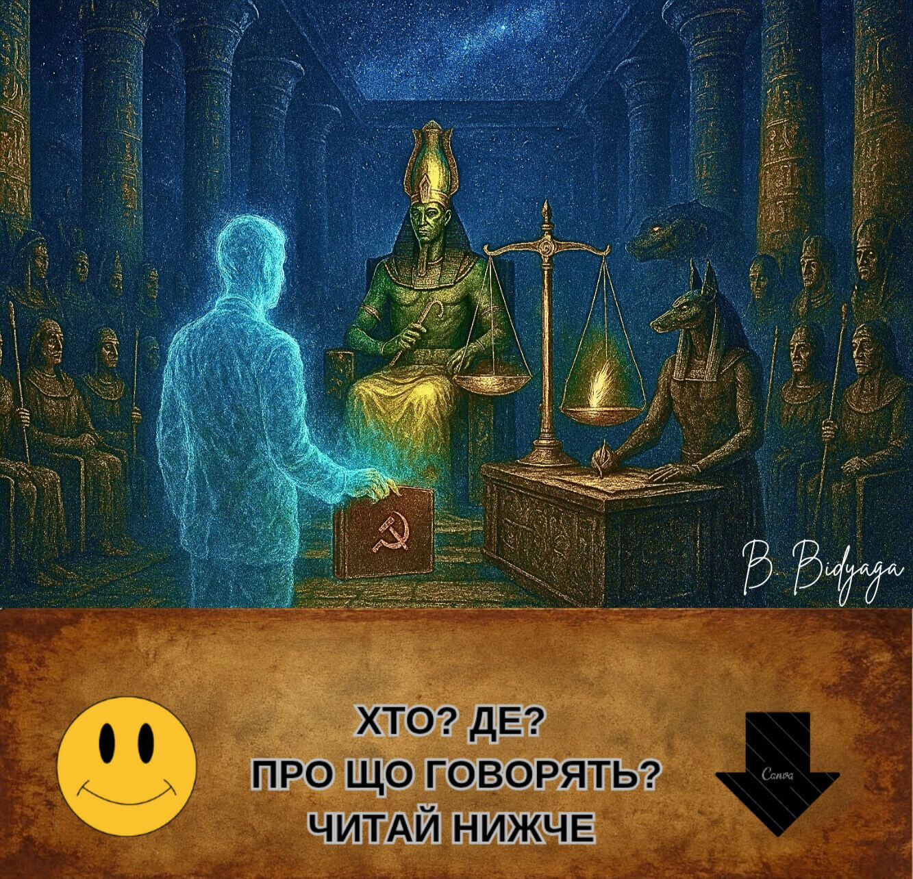
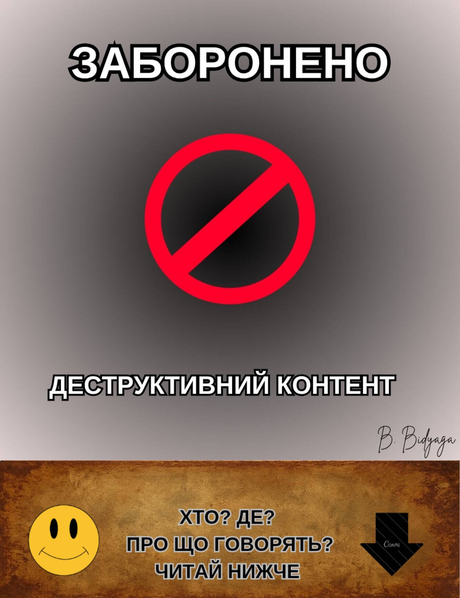
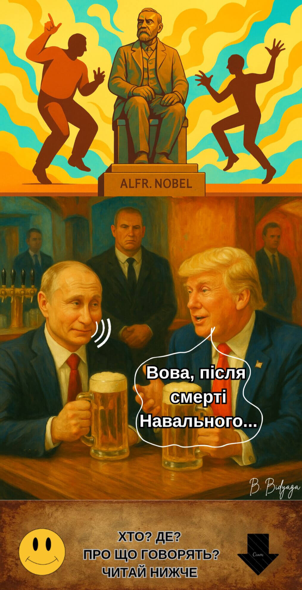
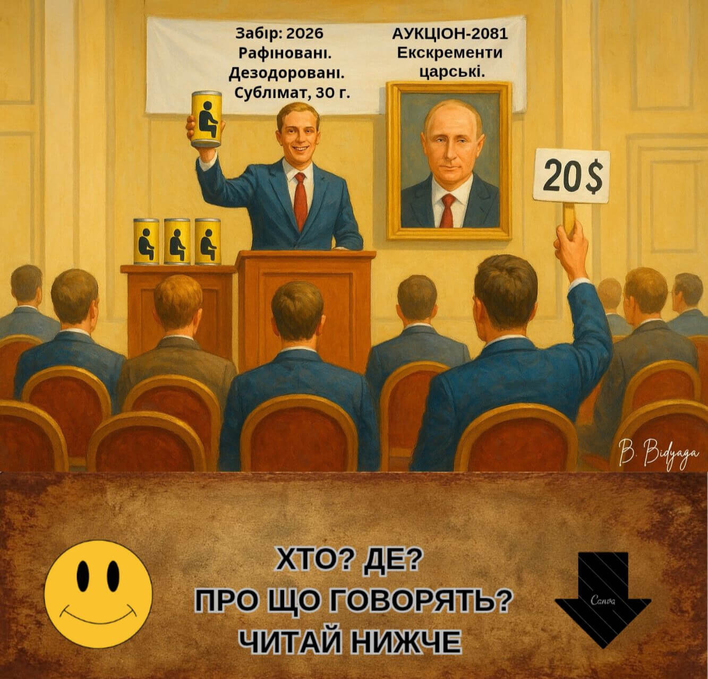
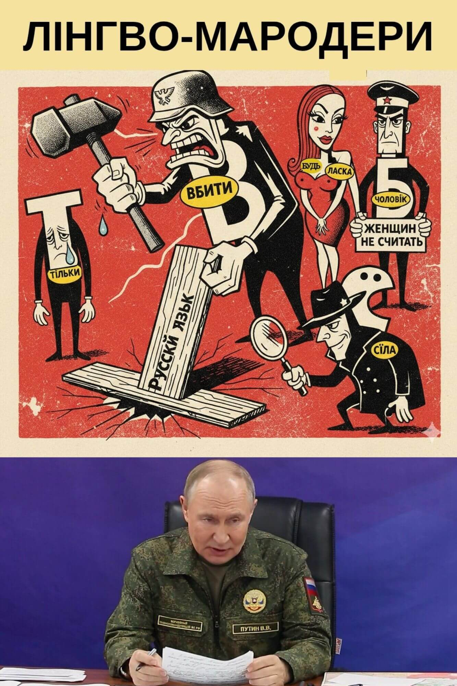
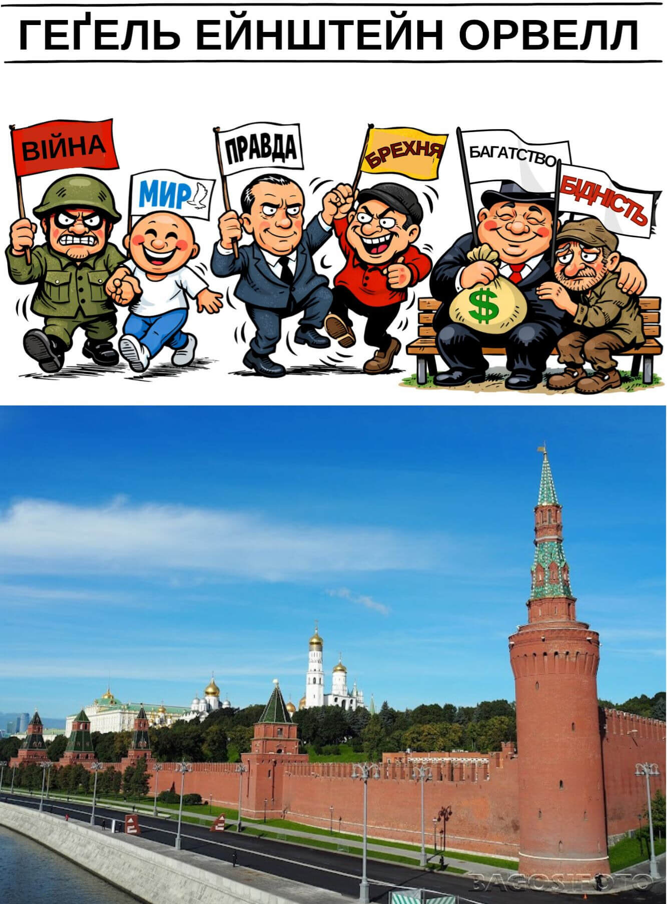
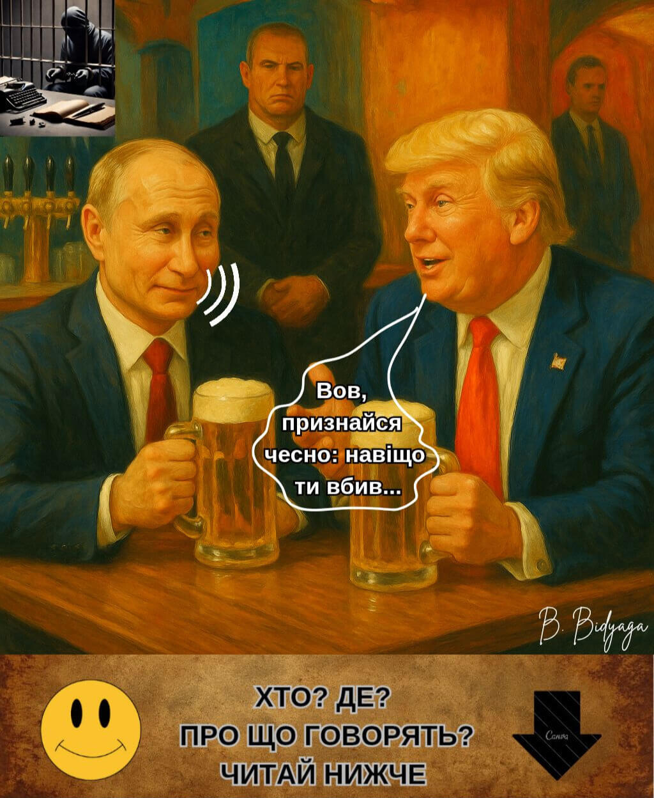

<meta name="robots" content="noindex, nofollow">

[**На головну сторінку**](index.md)

**Щеглова Ольга (Борис Бидяга)**

# У ЧЕРТОЗІ ТИСЯЧІ ІСТИН
### Отруйне джерело путiнськоï риторики

**ЗМIСТ**:

[1. Путін у Чертозі Двох Істин: Суд Озіриса](pivo_ua#1-путін-у-чертозі-двох-істин-суд-озіриса)

[2. Одна голова в шапці ходить, інша — країною керує](pivo_ua#2-одна-голова-в-шапці-ходить-інша--країною-керує)

[3. Нобелівські пляски](pivo_ua#3-нобелівські-пляски)

[4. Дерьмове безсмертя](pivo_ua#4-дерьмове-безсмертя)

[5. Культурний десант](pivo_ua#5-культурний-десант)

[6. Рятуйте! Вороги розкрадають російську мову!](pivo_ua#6-рятуйте-вороги-розкрадають-російську-мову)

[7. Наукові основи пропаганди](pivo_ua#7-наукові-основи-пропаганди)

[8. Настільна книга Путіна](pivo_ua#8-настільна-книга-путіна)

[9. Трампутація під пиво](pivo_ua#9-трампутація-під-пиво)

[10. Путініца: 35 хронічних перекручувань](pivo_ua#10-путініца-35-хронічних-перекручувань)

[11. Блаженні миротворці...](pivo_ua#11-блаженні-миротворці)

[12. Жирна та ароматна земна куля на день подяки](pivo_ua#12-жирна-та-ароматна-земна-куля-на-день-подяки)

[13. Угода століття](pivo_ua#13-угода-століття)

## 1. ПУТІН У ЧЕРТОЗІ ДВОХ ІСТИН: СУД ОЗІРИСА

> Священний давньоєгипетський храм. Всередині відбувається відома з «Книги Мертвих» процедура Суду єгипетського бога Озіриса. Також у ній беруть участь:
> 
> • Бог Тот (секретар суду, з глиняною табличкою в руках)
>
> • Бог Анубіс (експерт-криміналіст)
>
> • Богиня Маат (обвинувач)
>
> • 42 єгипетські боги-присяжні (у масках Гітлера, Муссоліні, Леніна, Сталіна, Берії, Брежнєва, Жириновського, Дракули, Диявола та інших історичних персонажів)
>
> • Президент Росії Володимир Путін (підсудний)
>
> Зал освітлений мерехтливими телеекранами, на яких транслюється судове засідання. Путін стоїть біля гігантських аптекарських терезів; на одній чаші терезів – червоне паперове серце з позолоченим гравіюванням «Путін: 86%». Інша чаша порожня, проте чаші врівноважують одна одну.

**Озіріс**:

— Починаємо прямий ефір найсправедливішого суду в історії світ! Сьогодні на вагах Істини – доля Великого Хранителя Традиційних Цінностей! Але спочатку – реклама нашого спонсора. Прошу: еліксир молодості «Амбре»!

(Рекламна пауза: богиня Хатхор п'є напій і одразу молодіє на 3000 років. Закадровий голос: «Амбре: ковток, що веде у Вічність».)

**Озіріс** (звертаючись до Путіна):

— Суду довіряєте? Відводів не буде?

**Путін** (з ледь помітною посмішкою):

— Та що Ви, Ваша честь! Як можна! Історія російсько-єгипетських відносин... Ми неодноразово надавали допомогу... Прощали кредити... Будували електростанції... Асуанська гребля... Повне взаєморозуміння...

**Озіріс**:

— Звісно. Ми пам'ятаємо. Суд видаляється до нарадної кімнати.

(Усі сидять на своїх місцях, як і раніше.)

**Маат**:

— Я протестую! Ви порушуєте процедуру! Підсудний ще не вимовив 42 клятви перед присяжними: не вбивав, не крадав, не брехав, не підробляв міри ваги... І так далі.

**Озіріс** (неохоче):

— М-м... Ну гаразд. Підсудний, розкажіть нам свою автобіографію.

**Путін**:

— Охоче, Ваша честь.
Я народився звичайним пітерським пацаном – середнім троєчником. І сам, своєю впертою працею, збираючи плоди на державній ниві, видерся на вершину влади – став президентом великої країни. Я проводив найгуманнішу і найсправедливішу політику. У своїх указах я обіцяв кожному громадянину окрему квартиру, безкоштовну медицину та освіту, високу зарплату та нульову інфляцію. Я встановив міцний мир у войовничій Чеченській республіці. Я став найщедрішим донором для всього світу. Я збудував 20 нафто- та газопроводів. Мій газ освітлює та обігріває всю планету. Я допомагаю народно-визвольним рухам по всьому світу – постачаю їх зброєю за пільговими цінами. Я роздаю мільярдні кредити бідним країнам і через кілька років анулюю їхні борги. Я віддаю Китаю свої природні ресурси за безцінь. Завдяки моїй політиці блок НАТО істотно розширив свої кордони. Я звільнив братній український народ від тиранії фашистського режиму Зеленського. Я зупинив криваву різанину в Україні.

(На екрані транслюється реклама: «Газ – у кожну гробницю!»)

**Путін** (секунду дивиться на екран, потім продовжує):

– Я запустив першу людину в космос. Мій придворний композитор написав нетлінний шедевр «Лебедине озеро» [виконує кілька балетних па під музику Чайковського ]. Нарешті, я позбавив світ Гітлера та його фашистської диктатури.
Я пахав, як раб на галерах, на посаді Президента 50 років! Я відсидів довічний термін!
Я підняв свою країну з колін. Я продав фабрики робітникам, а землю – селянам. Я створив першу армію світу.
Я простягнув руку допомоги та захистив від сваволі російськомовних братів за кордоном: у Прибалтиці, Середній Азії та на Кавказі. Ми охороняємо права та свободи російських діаспор на всій території колишнього СРСР.
У країні різко збільшилася тривалість життя: я дожив до 98 років.
Медицина розвивається швидкими темпами: я помер не від хвороби, а від нудьги.
Патріотизм молодого покоління зашкалює: у кожному шкільному кабінеті висить мій портрет. Традиційні цінності зміцнюються. Шлюби – лише двостатеві. Розлучення, аборти, презервативи – заборонені. Лесбійки та геї позбавлені громадянства. Противники та критики влади сидять у в'язниці. На землі мир, у людях – повна лояльність. Хіба це не ідилія? Я влаштував у своїй країні вічне свято життя.

**Озіріс** (широко посміхаючись):

— Достатньо. Ви – квінтесенція доброчесності. Суд видаляється до нарадної кімнати.

(Усі сидять на своїх місцях.)

**Маат** (гнівно):

— Постривайте! Ви знову порушуєте... Обвинувач ще не сказав свого слова!

**Озіріс**:

— Шановна Маат, усьому свій час. Час збирати каміння, час слухати байки. Коли прийде час для ваших фантазій [несподівано зривається на крик], я вам про це скажу! Суд видаляється до нарадної кімнати!

(Усі сидять на своїх місцях.)

**Озіріс** (після паузи):

— Пани присяжні, прошу голосувати...

**Маат** (стрибає, трясучи пір'ям):

— Я протестую! Ще не вислухано сторону обвинувачення! Ще не проводилося зважування серця!

**Озіріс** (суворо):

— Шановна Маат, серце підсудного було зважено в особливому порядку, воно визнане легшим, ніж ваше перо. Бо воно чисте, як сльоза ненародженої дитини! Анубісе!

**Анубіс** (дістає з-під ризи заздалегідь підготовлений протокол):

— Ваги показують нуль цілих, нуль десятих грама. Невинність повна та абсолютна.

(Чаші терезів раптом починають мимовільно коливатися вгору-вниз. Анубіс хапається за чаші, намагаючись їх урівноважити.)

**Озіріс** (незворушно):

— Нічого страшного: пертурбації на Сонці. Механізм, знаєте... метеозалежний.

**Путін** (дивлячись у порожнечу над головами богів):

— Підступи західних партнерів на чолі з НАТО. Вже й до Потойбічного Світу добралися. Знову зазіхають на наші духовні скріпи.

**Озіріс** (стукає жезлом об підлогу):

— Отже, пани присяжні, голосуємо. Чи підтверджуєте ви повну невинність підсудного?

**Присяжні** (хором):

— Так!

**Жириновський:**

— Клонувати!

**Брежнєв:**

— Представити до нагороди!

**Диявол:**

— Прирахувати до лику святих!

**Сталін:**

— Ми з тобою однієї крові!

**Берія:**

— Вклоняюся, Учителю!

**Муссоліні:**

— Радий знайомству, колего!

**Дракула:**

— Смоктати вмієш. Наша людина!

**Озіріс** (ігноруючи протести Маат):

— Суд оголошує вирок: підсудний виправданий.

**Маат** (трусячи в повітрі товстою пачкою фотографій):

— Та ви при своєму розумі? Ось докази! Вбивства! Викрадення! Отруєння! Війни! Гібридні атаки! Фальсифікації!

(На екрані з'являються докази і майже відразу зникають. Екран покривається дрібною брижами. Через хвилину на екрані виникає зображення Путіна на фоні Храму Христа Спасителя, що тут же змінюється мультиком «Незнайко на Місяці».)

**Озіріс** (з посмішкою):

— Шановні боги! Голосуємо! Хто за безсмертя, славу та апофеоз підсудного?

(42 бога згуртовано піднімають руки. Транслюється реклама: «Новий саркофаг "Фараон-Люкс"! Три розфарбування: чорний граніт, білий мармур, георгіївська стрічка».)

**Тот (зачитує з глиняної таблички):

— Прийнято одноголосно! Смерть скасовується, дарується вічне життя! Ім'я Володимира Путіна буде вписано до Книги Мертвих золотими чорнилами на титульній сторінці!

**Путін** (киваючи):

— Дякую. Це наша спільна перемога. Окрема подяка моєму вірному псові, Анубісу. Він хороший хлопчик.

(Анубіс зніяковіло виляє хвостом.)

**Маат** (у відчаї, роняючи пір'я на підлогу):

— Розумом не осягнути! Неймовірно! Я подаю апеляцію до Марсіанського Міжгалактичного суду!

(Її за руки виводять служителі з головами ведмедів. Трансляція обривається. На екрані – танцюючі козаки.)

**Тот** (закриваючи справу):**

— Усім дякую, всі вільні. Засідання закінчено.

> **Культурологічний коментар**
> 
> В основі мініатюри лежить давньоєгипетський міф про Суд Озіриса. Згідно з «Книгою мертвих», душа померлого приводилася до Чертогу Двох Істин, де її чекали:
> 
> – Озіріс – бог потойбічного світу, голова суду.
>
> – Маат – богиня істини та справедливості, еталон чистоти.
>
> – Анубіс – бог з головою шакала, що проводив зважування серця.
>
> – Тот – бог мудрості, секретар суду.
>
> – 42 бога-присяжних – кожен відповідав за один із гріхів; померлий повинен був публічно поклястися перед кожним богом, що не вчиняв жодного з них.
>
> Головна процедура – зважування серця: на одну чашу терезiв клали серце померлого, на іншу – перо Маат. Якщо серце було «легшим за перо», душа визнавалася чистою і отримувала вічне життя; якщо важчим – її чекала загибель.
Цей ритуал символізував абсолютну справедливість і неможливість обману.

#ПравославнийВоєннийПутінізм  
                                👻

## 2. ОДНА ГОЛОВА В ШАПЦІ ХОДИТЬ, ІНША — КРАЇНОЮ КЕРУЄ

*Примітка: iлюстрацію заблоковано цензурою.*

Простора конференц-зала. У залі сидять чиновники. Велика освітлена сцена, у центрі якої на спині лежить всесвітньо відомий політик. Його геніталії повністю оголені, а його ерегований пеніс увінчує мініатюрна, але точна копія його голови (тієї, що на плечах). Маленька головка політика, який лежить на сцені, звертається до тих, хто сидить у залі, з гучною й пафосною промовою:

— Народжуваність у країні падає катастрофічно, як камінь, кинутий у прірву. Я завжди говорив і повторюю знову: у всьому винні презервативи та аборти! І ЛГБТ. І Чайлдфрі. З усією цією єрессю треба боротися, боротися і ще раз боротися. Поки що у нас це виходить погано.

Ми заборонили аборти. І що? Тепер вони їдуть робити аборти до Китаю. Або народжують в Аргентині й залишаються там жити. Презервативи — це всесвітнє зло. Презервативи — це особиста для мене образа. Вони порушують базове право особистості — право плодитися й розмножуватися. Це закріплено в Конституції, між іншим.

Ми заборонили презервативи, визнавши їх «екстремістською символікою». І що ж? Чорний ринок презервативів процвітає. Підпільні мануфактури виробів із гуми тієї ж екстремістської символіки зростають як гриби після дощу. Усією країною. ЛГБТ-пропаганда лізе назовні з усіх щілин. Що відбувається? Це повний провал реалізації моїх указів. Я цього не стерплю.
Якщо держапарат не може змусити підконтрольне йому населення народжувати — я змушу народжувати держапарат.

Включайте, нарешті, ваші мізки. І починайте працювати.
Хіба у нас немає банку сперми? Хіба у нас немає банку яйцеклітин?
Купуйте яйцеклітини в населення за твердою ціною. Зрештою, запровадьте натуральний податок — одну яйцеклітину на користь держави щомісяця.

Підключіть Академію наук — нехай зроблять державний військовий iнкубатор. Ми виховаємо справжніх патріотів нашої країни. Щоб з пелюшок зазубрити військовий статут і 10 заповідей путінізму. Ми вбережемо їх від отруйного впливу батьків-лібералів. Це буде оплот нашого майбутнього процвітання й тріумфу.

По-друге. Підключіть генетиків. Країні не потрібні празні домогосподарки та всякі там мислителі. Гени у майбутніх поколінь мають бути правильні: патріотичні, чоловічі, войовничі.
Хіба це так складно? Дійте.

Ми відродимо нашу велику державу й нашу велику «другу армію світу». Більш того — ми зробимо її першою!
Якою б не була ціна. По трупах ворогів, крізь сльози матерів, по землі, перетвореній на попіл — ми наступатимемо без страху й без жалю. Ми придушимо будь‑який спротив і знищимо всіх, хто посміє виступити проти нас. Навіть якщо для цього доведеться поставити на коліна всю країну — ми це зробимо. Не сумнівайтеся: воля держави залізна, і ніщо й ніхто її не зупинить.

(Бурхливі, тривалі оплески.)

#ПравославнийВоєннийПутінізм
                                👻

## 3. НОБЕЛІВСЬКІ ПЛЯСКИ

Американський бар. Президент Росії Володимир Путін та Президент США Дональд Трамп сидять за столиком, п’ють пиво і мирно розмовляють...

**Трамп**:

— Вова, після того як ти розбрався з Навальним, у тебе на політікумі — тиша та гладь. Як на кладовищі. Іділія.

**Путін**:

— Кишіть, Донні. Навальний — політичний банкрот. Пшик. Хлопець, що продавав повітря.

**Трамп**:

— Тоді нащо ти розгромив всю його контору? Якщо він — банкрот?

**Путін**:

— Слухай уважно. В нього не було програми. Лише юрби підлітків, що викрикували образливі кричалки в мій бік. Це програма? Порівняй з Леніним: у того була програма — заводи робітникам, земля селянам. А в цього — лише образи, та ще й непечатні. Це ж просто непристойно.

**Трамп**:

— Погоджуюсь, безглуздя. Звичайний вискочка.

**Путін**:

— Саме так. За весь мій час лише одна людина справді мене непокоїла — Борис Немцов. Справжній політик. Він розумів, що робить.

**Трамп**:

— І ти його прибрав, щоб не ліз на вибори?

**Путін** (знизуючи плечима):

— Ні. Ми б його і так не допустили — виборча комісія знайшла б причину. І, між іншим, я не віддавав такого наказу.

**Трамп**:

— Та годі тобі, Вова. Усі знають, що це справа твоїх спецслужб.

**Путін**:

— Гучні вбивства ми вже давно не практикуємо. Це минуле століття. Навіщо кров та скандали, коли можна будь-кого… прибрати тихо. Акуратно. Будь-кого, хоч би й президента США.

**Трамп** (метушливо):

— Гей, полегше, Вова, це не моя війна! Це все Байден. А я тобі друг, ти ж знаєш.

**Путін** (зі зневажливою усмішкою):

— Так, так. Знаю. Бачу, як ти звиваєшся в'юном, граючи на два фронти.

**Трамп** (виправдовуючись):

— Вова, я клянуся, я нічого не маю проти тебе особисто. Я, чорт забирай, навіть розумію твої мотиви. Я просто… хочу Нобелівку!

**Путін** (задумливо):

— Цілком природнє бажання. Я от теж думаю… чому б і мені не отримати  Нобелівку? Наступного року, наприклад.

**Трамп** (витріщивши очі):

— Ти?!

**Путін** (зверхньо):

— Донні, у кожного є ціна. У когось нижча, у когось вища. А якщо ні… є інші методи. Погрози, компромат, шантаж… Механізм відточений.

(Пауза)

**Путін** (з холодною, іронічною посмішкою):

— Знаєш, Нобелівка на моїх грудях виглядатиме навіть переконливіше, ніж на твоїх. Уяви, сенсація: «Воєнний злочинець Путін — Нобелівський лауреат». Це найкращий доказ моєї безмежної влади над світом. Це навіть крутіше, ніж моя армія на підступах до Парижу! Ось так поставити раком цю трусливу Європу і відї*бати по повній програмі!

**Трамп** (обережно):

— Вова, а давай так… спочатку я отримую Нобелівку, а потім вже ти ставитимеш цю трусливу Європу на коліна. Угода?

**Путін** (махає рукою):

—  Добре, хай буде по-твому. Ти перший, Донні. Втім, мені ще потрібно дiйти до Києва, перш ніж збирати нагороди…

#ПравославнийВоєннийПутінізм
                                👻

## 4. ДЕРЬМОВЕ БЕЗСМЕРТЯ

Росія. Москва. Кремль. В кабінетi
за столом сидять: президент Росії Володимир Путін та Михайло Ковальчук, старий друг Путіна, який тепер курирує дослідження у сфері подовження життя та уповільнення старіння.

**Путін** (майже ласкаво):

– Ну, професоре, звітуй: як просуваються справи з моїм безсмертям?

**Ковальчук** (із ентузіазмом):

– Є зрушення, значні. Зараз опрацьовуємо проект із консервацією твоїх... біоматеріалів.

**Путін** (здивовано):

– Що? До чого тут какашки?

**Ковальчук** (поспішно):

– Постривай. Не метушись. Вислухай спочатку.

**Путін** (милостиво):

– Говори.

**Ковальчук**:

– Наука довела, що при сублімації в екскрементах зберігається повноцінна ДНК. Ми сублімуємо та консервуємо твої какашки і комплектуємо їх стопкою фотографій і збіркою твоїх промов. У далекому майбутньому за твоєю ДНК та з опорою на твої фото і зразки твоїх виступів буде відтворена точна копія Володимира Путіна. Імовірно, надрукована на 3D-принтері. Ну? Що скажеш?

**Путін** (задумливо):

– Дерьмове безсмертя. Дерьмова ідея. Ну, надрукував ти мене. А хто я такий? Ніхто. На престолі ж сидить інша людина. Відразу згадають мені і війну, і підпали, і вибухи, і кабелі, і все інше.

**Ковальчук**:

– Щодо цього не знаю. Який до того моменту в Росії буде політичний лад, передбачити неможливо.

**Путін** (із натиском):

– У тому й річ. Мені потрібне інше безсмертя. Я хочу, щоб ось це, моє, теперішнє тіло служило мені вічно. Невже так складно це зробити?! Зносилося серце – трансплантація. Печінка, нирки – трансплантація... Це ж елементарно!

**Ковальчук** (обережно):

– Але у кожного органа є термін служби – не більше вісімдесяти років...

**Путін**:

– А ти візьми серце у школяра – вчорашнього випускника. Ти що – жалієш для мене якогось пацана?

**Ковальчук** (завзято):

– Та що ти! Я тобі своє серце готовий віддати...

**Путін** (з огидою):

– Твого не треба. На біса мені твій іржавий мотлох? Ти дай мені серце молоде, з ресурсом. А через 60 років поставиш нове. Що тут складного?

**Ковальчук**:

– На сьогоднішній день медицина не дає гарантії, що орган приживеться. Ймовірність ускладнень досить висока. Тож або чекай ще років 20, або консервуємо какашки.

**Путін** (буркливо):

– Гаразд, так вже й бути. Давай свої какашки. Але тільки як запасний варіант. У крайньому разі після моєї... смерті [кривиться, ніби від болю] можна буде продати з аукціону.

**Ковальчук** (з посмішкою):

– Так. На Заході цінують дерьмо сильних світу цього. Один італійський художник, здається, його звали Мандзоні, продавав своє дерьмо за ціною золота. А зараз така 30-грамова баночка коштує сотні тисяч євро.

**Путін** (зневажливо):

– Ну якщо якийсь паршивий італьяшка випорожнювався золотими злитками – моє дерьмо піде з молотка за десять мільйонів!

**Ковальчук** (підлесливо):

– А то й більше!

**Путін**:

– Тільки чур! Не жадійничай! 30 грамів?! Та це куркам на сміх! Я що, голуб, чи що?

**Ковальчук** (переконано):

– Ти? Ні. Ти сокіл. Орел. Шуліка. Птеродактиль.

**Путін** (гордовито):

– Ось саме так. І моє дерьмо має бути вищої якості. Рафіноване. Дезодороване. І нехай буде блакитного кольору. Блакитна кров – блакитне дерьмо.

**Ковальчук**:

– Звісно, звісно. Першого віджиму. Virgin Putin shit. Чи Putin virgin shit? Як правильно?

**Путін** (з ненавистю):

– Вільний!

#ПравославнийВоєннийПутінізм
                                👻

## 5. КУЛЬТУРНИЙ ДЕСАНТ

Росія. Москва. Зала засідань Держдуми РФ.
Президент Росії Володимир Путін виступає перед депутатами.

— Шановні депутати! Друзі! Соратники!

Геополітична обстановка загострилася до межі. Вороги Росії не сидять склавши руки. Захід докладає всіх зусиль, щоб нас знищити. Особливо Європа. Особливо Франція. 

Франція споконвіків була й залишається нашим головним ворогом. Франція завжди зазіхала на наші традиційні цінності, прагнучи знищити нашу культурну спадщину, нашу мову. Згадаймо дев’ятнадцяте століття, коли в результаті французької операції впливу вся російська еліта протягом десятиліть говорила виключно французькою. Російська мова опинилася на межі повного забуття і вимирання. І якби не глибинний російський народ, який цілком справедливо ненавидів усе французьке, ми б із вами зараз розмовляли французькою!

Так, у дев’ятнадцятому столітті французькі спецслужби зазнали фіаско, зате тепер вирішили взяти реванш.
Наші вороги звинувачують нас у тому, що нібито ми ведемо проти Заходу гібридну війну. Нахабна брехня! Ми мирні люди. А от французи справді знову й знову атакують нашу культуру, наші традиційні цінності, нашу мову. 

Вони заслали в російську мову масований ворожий десант. Тільки подивіться, скільки в нас французьких слів, які так майстерно маскуються, що люди навіть не підозрюють, що їхня мова просто нашпигована французькими словами-шпигунами.

Шофер, табло, театр, шедевр… Та їх тисячі. Уже незрозуміло: це ще російська мова чи вже діалект французької?

Але «шофер» — це ще дрібниця. Але ж вони впроваджують у нашу мову такі деструктивні слова, як "президент" і "революція"! Це неприхована диверсія та атака на наші традиційні цінності. Що це ще за президент? У Росії ніколи не було й не буде «президентів». Тільки цар [б’є себе кулаком у груди]. Або: «революція». Революції та гільйотини для королівських осіб — це чисто французьке суспільно-політичне явище, абсолютно чуже російському духові. І, між іншим, у Росії цих мерзот ніколи не було — доти, доки в нашій мові не з’явилися ці ганебні слова-диверсанти.

І це зрозуміло, товариші. Згадаймо Біблію: «Спочатку було Слово». А вже потім усе інше. Тобто немає й не може бути революції, доки в мові відсутнє слово, що її позначає. Ось приклад. У Радянському Союзі не було сексу, це загальновідомий факт. А чому? А тому що не було слова «секс». Але щойно опортуніст Михайло Горбачов відкрив кордони для західної масової культури, до нас прийшли слово «секс» і слова «гей», «лесбійка», «ЛГБТ» — і після цього розпуста та содомія розквітли в Росії пишним цвітом.

Звідси висновок, товариші: якщо ми хочемо викорінити чуже нашій культурі явище — ми маємо стерти з мови саме слово, що позначає це явище. Законодавчо заборонити, переписати словники, спалити всі книги, де це слово присутнє. Всіх порушників — переслідувати за законом.

А наші так звані «лінгвісти», які сором’язливо називають ці слова-шпигуни «запозиченнями»? Це шкідництво, товариші, і ми зобов’язані його припинити. Спочатку ці словечка-диверсанти асимілюються, потім починають плодитися й розмножуватися і зрештою витісняють із мови первісно російські слова. Це мовна агресія, товариші. Лінгвістичний геноцид.
Оправдання французьких запозичень у російській мові має бути прирівняне до виправдання тероризму. Юридично. Від п’яти років до довічного ув’язнення, залежно від значення конкретного слова.

За нейтральні слова (шофер, реванш, шедевр, театр) — п’ять років.
За «революцію» (посягання на основи конституційного ладу) — десять років.
За «президента» (дискредитація національного лідера) — п’ятнадцять років.

Але найпідступніше французьке слово-диверсант — це «презерватив». Ми на власні очі спостерігали, як слідом за мовною експансією наш ринок буквально заполонили й самі ці диявольські гумові вироби. Французькі, між іншим. Ця безпрецедентна атака спрямована на найцінніше, що в нас є, — на наш генофонд. Це демографічна атомна бомба, товариші. Знищити росіян ще до їх появи на світ. Це найсвятотатськіша, найвитонченіша зброя масового ураження.

Слово «презерватив» має бути стерте з російської мови. Ми повинні вирвати його з корінням із нашого життя. Вживання цього слова в будь-якій формі — акт державної зради. У її найвищому прояві. Зображення презерватива має бути прирівняне до демонстрації екстремістської символіки.

І на майбутнє.
Товариші! Ми повинні суворо охороняти нашу мову від проникнення західних слів-диверсантів. Це головна лінія оборони в нашій боротьбі за збереження традиційних цінностей.

Дякую за увагу!

#ПравославнийВоєннийПутінізм
                                👻

## 6. РЯТУЙТЕ! ВОРОГИ РОЗКРАДАЮТЬ РОСІЙСЬКУ МОВУ!

Росія, Москва, Кремль. Засідання Ради Безпеки РФ. Виступає президент Росії Володимир Путін.

**Путін**: 

— Товариші! Сьогодні у нас знаменний день. Сьогодні ми знайшли і сформулювали нашу третю — і головну — мету спеціальної військової операції. Отже, відтепер прошу запам'ятати нашу стратегічну цільову тріаду в боротьбі з фашистським українським режимом:

•  Демілітаризація

• Денацифікація

• Деколонізація (російської мови)

Товариші! З великим сумом повідомляю: нас спіткала катастрофа космічного масштабу. Ворог підступно, таємно, за нашою спиною, протягом багатьох століть плів смертельно небезпечне павутиння, в якому ми й опинилися, абсолютно несподівано для самих себе.

Товариші! Ми приділяємо найпильнішу увагу захисту наших духовних і сімейних цінностей. Це чудово! Проте ми зовсім випустили з уваги наші традиційні комунікаційні цінності. Смислові (семантичні) та звукові (фонетичні).

Адже наша мова, наше національне надбання, протягом століть піддається грабіжницьким піратським нальотам з боку української мови! Вони крадуть наші традиційні, споконвічно російські слова, спотворюють їх, змінюючи фонетичний вигляд і семантику, і використовують у своїй мові без нашої згоди!

Вони вкрали у нас префікси і закінчення, вони вкрали у нас іменники, прикметники і дієслова. Вони кардинально змінюють їхній зміст, вони перекручують їхню вимову. Це порушення авторських прав на нашу інтелектуальну власність! Ми не давали їм на це дозволу. Це кримінальна стаття і підстава для вимоги компенсації.

Але це ще й профанація російської мови. Це геноцид нашого Лінгвофонду. Це жирний плювок нам у душу.

Товариші! Переді мною лежить тритомник, складений нашим головним лінгвістом і визнаним фахівцем з російської мови — Володимиром Далем. Тут зібрані всі споконвічно російські слова, вкрадені українською мовою з нашої мови, слова, піддані приниженню і нарузі та перетворені на презирливих рабів на службі комунікацій української фашистської тусовки.

Я не хочу бути голослівним, товариші. Я наведу вам десятки прикладів того, як наші благородні автентичні російські слова були грубо і безцеремонно зґвалтовані та втиснуті в чужі рамки так званої української мови.

• Ось російське слово ***убить***. Вони його хапнули і перетворили на ***вбити***. Це дискредитація: вбивають цвях у дошку, а ми убиваємо фашистів.

• Ось російське слово ***только***. Вони його перетворили на ***тільки***. Для російського вуха звучить образливо. До того ж, зауважте, вони тут використовують ворожу нам натівську літеру  **і**. З крапкою! Абсолютно чужу нашим інтелектуальним цінностям. А ви знали, що в мові є ще більш мерзенна літера — **ї**  з двома крапками! Це відвертий символ деградації та квінтесенція фашистської риторики.

• Ось російське слово ***человек***. Вони з нього зробили ***чоловік***, та ще й змінили семантику. За їхньою збоченою логікою, до категорії людей належать тільки чоловіки. Жінки, значить, це не люди. Це дискредитація всієї нашої жіночої половини. Вершина неповаги до російської жінки!

• Ось російське слово ***нарушать***. Вони в ньому змінили все: префікс, суфікс, закінчення. Що вийшло? Огидний гібрид: ***порушувати***. Це образа почуттів віруючих у красу і велич російської мови.

• Ось російське слово ***ласка***. Добре, миле, невинне і тепле. Вони поставили його на службу безсоромній пропаганді сексуальних ігрищ і розпущеності! Ви тільки подивіться! ***Будь ласка!*** У них це нібито означає ***пожалуйста***. 

«Будь ласка, сходи в магазин». «Будь ласка, зроби омлет». І так далі. На кожному кроці ми чуємо це ***будь ласка***. Але ж це — не що інше, як запрошення до сексуальної прелюдії: 

***будь ласка = приласкай мене!***

Це ж сексуальне домагання у чистому вигляді!

• А слово ***шкодить***? Ми з вами знаємо, що воно означає погані вчинки. Але вони його хапнули і — нам на зло — підняли й облагородили. У них воно означає ***пошкодити***: «Дивись не пошкодь мішок!». Як це розуміти? Це дискредитація самих наших смислів, товариші. Священних смислів.

Чого вони тільки не роблять з нашими словами!

• Переставляють букви в історично сформованих поєднаннях: ми говоримо ***рождается***, вони кажуть ***народжується***. У нас **жд**, у них **дж**. Це просто насмішка над нашою мовою.

• Ми говоримо ***всё***, вони кажуть ***усё***.

 • Ми говоримо ***улица***, вони кажуть ***вулиця***.

 • Ми говоримо ***креститься***, вони кажуть ***хреститися***.
 
Вони нас просто дражнять! Як мавпа в зоопарку.

• А старе добре слово ***какой-нибудь***  ? Вони ж його просто знівечили! Кастрували і поміняли місцями частини складного слова. Що вийшло? Нісенітниця, абракадабра: ***будь-який***.

І так далі, і тому подібне. Повторюю, у мене в руках три товсті томи з переліком усіх злочинів подібного роду.

Ми звернулися до фахівців, які дійшли висновку, що дане явище є не чим іншим, як колонізацією російської мови з метою її дискредитації, приниження, пародіювання, обдурювання, наруги, заподіяння тяжкої шкоди її структурним елементам і, зрештою, — її знищення.

Тому, товариші, перед нами постає нове завдання. За чотири роки самовідданої боротьби ми домоглися демілітаризації та денацифікації так званої України. Тепер перед нами стоїть завдання не менш важливе — деколонізація російської мови.

Ми повинні вирвати з лап фашистів наші зганьблені слова, повернути їх у рідну гавань і реабілітувати.

І ми подаємо до міжнародного Трибуналу зустрічний позов до України про відшкодування репутаційної та лінгвістичної шкоди. Якщо хтось хоче використовувати наші слова — отримайте письмовий дозвіл і платіть роялті. Але ми не допустимо жодного насильства, наруги і неповаги до наших мовних символів та їхніх священних смислів.

**Секретар Ради Безпеки Патрушев М.:** 

— Володимире Володимировичу! Пропоную: виступити з ініціативою взаємозаліку за даним позовом та позовом України до Росії про відшкодування матеріальних збитків від військових дій. Суму пропишемо таку саму — 800 мільярдів євро.

**Путін**: 

— Пропозиція правильна. Дякую! 
Це наша подвійна перемога. Ми зрівняли з землею добру половину їхньої країни, і при цьому не заплатимо ні копійки репарацій.

#ПравославнийВоєннийПутінізм
                                👻

## 7. НАУКОВІ ОСНОВИ ПРОПАГАНДИ

Росія, Москва, Кремль. Російський президент Володимир Путін виступає перед журналістами кремлівського пулу.

**Путін**: 

— Товариші! Сьогодні я хотів би торкнутися засадничих принципів російської державної ідеології. Вороги звинувачують нас у тому, що ми, мовляв, перекручуємо ідеї та факти, ставимо з ніг на голову поняття, принципи та віру. Часто в публічному полі стосовно нас вживають слова «брехлива пропаганда».

Це несправедливо, товариші. Це нахабна брехня та інсинуація. Ми нічого не вигадуємо і не потерпимо жодної відсеб’ятини. Наша ідеологія базується на суворо науковому підході. Як і марксизм-ленінізм, наша ідеологія логічно випливає зі всесвітньо відомих теорій найвеличніших мислителів людської цивілізації. Якщо трьома стовпами комуністичного вчення були Маркс, Енгельс і Ленін, то три кити нашої ідеології — це Гегель, Ейнштейн та Орвелл.

Діалектика та Теорія відносності — це наукова основа для структурних рамок нашої ідеології. Роман «1984» — це яскравий зразок змістовного використання цієї структури.

Наш світ стоїть на фундаментальних законах:

•  Всесвітнього тяжіння

• Єдності та боротьби протилежностей (Гегель)

• Загальної теорії відносності (Ейнштейн)

Так-с, дорогі товариші, все в цьому світі відносне: хороше і погане переплітаються, антагоністи живуть у симбіозі. Читайте Гегеля. Згадуйте Ейнштейна.

Ось, скажімо, війна і мир. Геніальний провидець Орвелл першим відкрив незаперечну істину: 

**МИР — ЦЕ ВІЙНА, ВІЙНА — ЦЕ МИР**

І справді. Дивіться: між НАТО і Росією зараз мир. Поки що. Я повторюю: поки що. Але що відбувається на ділі? Насправді триває повномасштабна гібридна війна (кібератаки, війна ідей і сенсів, драконівські економічні санкції, заморожування наших фінансових активів тощо). І це ви називаєте «миром»? Окремо хочу відзначити відверто ворожу практику регулярних постачань натівської зброї Україні. Якщо натівські «Хаймарси», нехай і запущені з України, рознесли мені десятки стратегічно важливих НПЗ — це, по-вашому, називається миром?

З іншого боку, конвенційні війни — це мир у зародку. Війна веде народи до миру. Дайте людям війну — і вони відразу стануть запеклими прихильниками миру. Війна породжує мир. Ніхто не бажає миру більше, ніж солдати, які сидять в окопах. Ці солдати б'ються не за території — вони б'ються за мир. І чим жорстокішою, кровопролитнішою, руйнівнішою стає війна, тим міцнішим і непорушнішим буде мир, породжений цією війною. 

**ВІЙНА — ЦЕ МИР**, товариші. Це факт. І з цим доводиться рахуватися.

Ще одне геніальне відкриття Орвелла — аксіома:

**ПРАВДА — ЦЕ БРЕХНЯ**

І справді, констатація будь-якого факту є суб'єктивною. Все залежить від точки зору мовця, від інтерпретації, зрештою — від визначення понять. Але ж у різних культурах понятійний апарат може (і повинен!) відрізнятися. Наприклад, у Європи свої поняття про обов'язок, мораль, духовні цінності, у нас — свої. Вже в силу цього ми не можемо мати з ними однакову інтерпретацію фактів. Те, що вони називають правдою, для нас — брехня. І навпаки. Це ж очевидно.

Щодо так званого «переписування» історії. Але це ж очевидно, товариші. Науково-технічний прогрес кардинально змінює наше життя, наше сприйняття, наші погляди, змінює буквально на очах. Зараз у нашому розпорядженні в десятки разів більше інформації, ніж було, скажімо, десять років тому. Штучний інтелект надає величезні можливості для більш адекватного аналізу та розуміння історії. В силу цього нам, звичайно ж, доводиться адаптувати навчальні посібники для студентів та школярів. Це очевидний наслідок тотальної інформатизації суспільства, в якому ми живемо.

Далі. Діалектичний підхід підводить нас до визнання очевидної істини: 

**ЗАХИСТ — ЦЕ НАПАД**

Ну ось взяти хоча б нашу героїчну спеціальну військову операцію. Так, зараз це вже повноцінна війна. Війна за мир у всьому світі. Але згадаймо, як усе починалося. НАТО відверто готувало вторгнення української армії в нашу країну. Якби 24 лютого 2022 року ми не вдерлися на територію України, то зараз ми з вами захищалися б від ворога на нашій власній землі. Ми вчинили мудро — завдали ворогу превентивно-відповідного удару. Тим самим врятували від загибелі та руйнування тисячі життів і сотні цивільних об'єктів. Як бачите:

**НАПАД — ЦЕ ЗАХИСТ**

У чистому вигляді.

Отже, товариші, підіб’ємо підсумки. Найважливіший фронт нашого протистояння із Заходом — ідеологічний. У своїй професійній діяльності ви повинні не тільки дезавуювати ворожу пропаганду — ви повинні вміти доводити електорату наукову обґрунтованість нашої державної ідеології. Я навів вам кілька переконливих прикладів. Це основа, яку ви можете розвивати та поглиблювати нескінченно. 

Дійте, товариші! 

Перемога буде за нами!
                           
#ПравославнийВоєннийПутінізм
                                👻

## 8. НАСТІЛЬНА КНИГА ПУТІНА

Росія, Москва, Кремль. Засідання керівників органів державної безпеки та охорони правопорядку. Виступає президент Росії Володимир Путін.

**Путін**:

— Товариші! 

Хто з вас читав капітальну працю великого британського письменника ***Джорджа Орвелла «1984»*** ?Ніхто не читав? Прочитайте. Це наша настільна книга.

Дорогий товариш Орвелл описав досить ефективну тоталітарну систему державного управління. Звісно, у середині минулого століття йому й уві сні не могли наснитися технології, які є у нас із вами. Через це його система досить громіздка, ресурсозатратна та дорога. Але все одно — вона чудово працює! Навіть в умовах технологічної відсталості.

Та головне, товариші, — це його безсмертні тоталітарні ідеї: ***дводумство, переписування історії, поліція думок***.

Дещо ми в нього вже перейняли і застосовуємо з великим успіхом. Але, як то кажуть, ще є до чого прагнути.

Насамперед ми маємо ввести у нашу юриспруденцію поняття ***думкозлочин***. Це поняття логічно випливає з наших традиційних цінностей. Згадайте, що говорив Христос у своїх проповідях. Якщо ти забажав дружини брата твого, ти вже вчинив перелюб. Таким чином, згідно з догматами нашої православної християнської церкви, сама думка про гріх стає гріхом. Це важливий метафізичний стрибок, який ми просто зобов'язані поставити на службу безпеці нашої держави.

Тож ***думкозлочин*** придумали не ми і навіть не Орвелл — його вигадав сам Господь Бог.

Що для нас це означає на практиці?

Перше: у поліції має з'явитися спеціальний підрозділ — ***Відділ боротьби за чистоту думок***. Простіше кажучи, та сама орвеллівська Поліція думок.

Друге — необхідно доопрацювати наші кримінальний та адміністративний кодекси, ввівши покарання за ***думкозлочин***.

І найголовніше — ми маємо налагодити практичну роботу серед населення.

Звернемося до нашої настільної книги. У міфічній країні Океанія інакомислячих виявляли, встановивши за громадянами цілодобове стеження за допомогою так званих ***телекранів***. На відміну від Океанії, яка, як я зрозумів, на міжнародній арені мала статус маргінала, Росія є одним із найбільших геополітичних гравців і повинна дотримуватися хоча б якоїсь подоби елементарних пристойностей. Тому ми не можемо відкрито порушувати такі базові права громадян, як таємниця приватного життя.

А крім того, ***телекрани*** хороші як інструмент залякування, але для виявлення таємних думок потрібні таємні методи. Ніхто не стане зізнаватися в єресі, знаючи, що його підслуховують і що за ним підглядають.

Ми вже зробили в цьому напрямку великий — величезний — крок: розробили та впровадили безальтернативний месенджер **МАХ**, що дозволяє негласно відстежувати комунікації наших громадян. 

Але! Коли іноагент виходить на мітинги, стає в одиночний пікет або публікує в інтернеті непатріотичні заклики — це вже запущена стадія ідеологічної девіації. Це вже не лікується, а лише карається тюремним ув'язненням.

Взагалі, ви знаєте, я пропоную розглядати інакомислення як прогресуюче захворювання. Якщо нам вдасться діагностувати його на ранній стадії, є дуже хороший шанс за допомогою елементарних коригуючих процедур назавжди вилікувати людину від цієї хвороби.

Тому — наша увага має бути спрямована насамперед на дітей.

Так, у нас уже повсюдно проводяться уроки «**Розмови про важливе**». Це прекрасно — ми навіюємо нашим дітям правильні установки. Але ж потрібен і зворотний зв'язок! Що ми маємо в цьому плані? Анкетування студентів? Воно абсолютно неефективне, це все одно що чекати від іноагента зізнань перед ***телекраном***.

Нам потрібне системне, глобальне рішення. І воно лежить на поверхні.

Що ми з вами робимо? Ми встановлюємо в дитячих садках, школах, інших навчальних закладах цілодобове прослуховування. Не відеоспостереження — ні. Це дорого і не потрібно. Нам не потрібні обличчя — тільки розмови і система розпізнавання голосів. Це простіше і дешевше. І робиться приховано.

Далі штучний інтелект аналізує інформацію, що надходить на сервер, і видає кінцевий результат: 

«Петя Бєлкін із 3-го класу школи номер 212 неблагонадійний; вчора на перерві між другим і третім уроком він сказав образливе слово на адресу Президента».

Далі Петею займається відділ у справах неповнолітніх: безболісна ідеологічна корекція, як, знаєте, за допомогою брекетів у дитини коригують положення зубів, що ростуть убік. І точно так само, як це буває з кривими зубами — у дитячому віці така ідеологічна корекція ще можлива.

І між іншим, хлопчик Петя, коли виросте, буде нам тільки вдячний за те, що допомогли йому в дитинстві позбутися неправильних думок і тим самим врятували від в'язниці.

Зрозуміло, тотальне прослуховування має здійснюватися у всіх державних установах — тут ми не порушуємо жодних законів. За погодженням із власниками приватних бізнесів встановлюємо прослуховування також і в їхніх закладах та офісах. Відмовляться йти назустріч — ви знаєте, як їх переконати.

Наша кінцева мета, товариші, — побудувати гармонійне суспільство — суспільство, засноване на принципах гомогенності, конформізму, солідарності та згуртованості.

Щоб мені не доводилося під час «Прямої лінії» з народом брехати, стверджуючи, що в Росії іноагенти не піддаються кримінальному переслідуванню.

Ми насправді не будемо переслідувати інакомислячих — з тієї простої причини, що у нас не буде інакомислячих.

#ПравославнийВоєннийПутінізм
                                👻

## 9. ТРАМПУТАЦІЯ ПІД ПИВО

Американський бар. Президент Росії Володимир Путін та Президент США Дональд Трамп сидять за столиком, п’ють пиво і мирно розмовляють.

**Трамп**:

— Вов, ти зробив неможливе: 25 років при владі! Як тобі це вдалося?  

**Путін:** 

— Та дуже просто: переписав Конституцію.  

**Трамп**: 

— І тебе не зкинули?  

**Путін:**  

— Ми це заздалегідь передбачили. Зварганили "смертельний вірус", влаштували пандемію... Нагнали на населення такого страху — задушили протест у зародку. Про всяк випадок я тримав у рукаві навіть «воєнний стан». Не знадобився. Ця клята опозиція виявилася слабкою на передок. Самі гучніше за всіх кричали, щоб я посилив карантинні заходи. Жалкі, нікчемні люди. Усі сиділи по домівках і тільки й робили, що тремтіли за своє здоров’я. Одним словом — моєму електорату було не до Конституції.  

**Трамп**:

— Приголомшливо! Неймовірно! Я теж не проти… Але у нас, розумієш, демократія!  

**Путін:**

— Та я б і в Америці всю вашу демократію під себе прогнув!  

**Трамп**: 

— Ти це серйозно?  

**Путін:** 

— Абсолютно. Слухай уважно, Донні.  
Почни із системи стримувань і противаг. Знеси її до бісової баби! І будуй свою вертикаль. Усі слабкі ланки — зачисть. Скрізь — тільки твої люди. Силовики — твій перший ешелон оборони. Судова система — другий.  
Дай зрозуміти кожному, що він у тебе на гачку. Компромат знайдеться на всіх. А ні — так будь-кого можна підставити.  
Усе — система відточена.  
Пам’ятай: лояльність, лояльність і ще раз лояльність. Регулярно влаштовуй чистки. І показові процеси. Для наочності. І буде тобі щастя.  
І обов’язково просувай свою ідеологію в маси. Зі шкільної лави. «Зробимо Америку знову великою!» Чи як там у тебе?  
Пропоную лейбл:  
«ТраМерика».  
«Трэкономика».
"ТраМедицина". 
«ТраМода».  

Прояви креативність — людям це подобається. І ламай шаблони.  
Ваша двопартійка — це повна дурня. Чим демократи відрізняються від республіканців? Та нічим. Кожні 4 роки міняєте шило на мотовило.

Організуй третю партію: ТрамПартія. Твій індивідуальний стиль.  
Розширь свій гасло: МАГА – ПТАГА,.  
«Зробимо Америку знову великою: процвітання для всіх. Бог. Алілуя!»  
(Make America Great Again: Prosperity To All. God. Alliluya!)  
Це, звичайно, трохи інший підхід.  

Особисто я віддаю перевагу движі у вигляді ворогів, війни та нагнітання страху. Але можна консолідувати маси й таким способом.  

А як тільки почнуть втрачати інтерес — оголошуй війну Канаді.  
Вигадай давнє індіанське плем’я, якому колись належала вся Північна Америка. Чингачгук Великий Змій — Володар Гадюк і Всея Америки. 

А що?  
Об’єднане Королівство «Північна Америка» — звучить потужно.  
(United Kingdom of North America).  
Потім від нового держави оберешся ще на пару термінів.  

Дерзай, Донні!  
Просто прояви креативність.  

Знаєш, а буде ж класно: в мене — одна шоста частина суші, і в тебе теж одна шоста!  
Поділимо з тобою цю кульку навпіл. Ти будеш — Володар Меридіанів. Я — Володяр Паралелей.  

#ПравославнийВоєннийПутінізм  
                                👻

## 10. ПУТІНІЦА: 35 ХРОНІЧНИХ ПЕРЕКРУЧУВАНЬ

Американський бар. Президент Росії Володимир Путін та президент США Дональд Трамп сидять за столиком, п’ють пиво і мирно розмовляють.

**Трамп**: 

— Вов, признайся чесно: навіщо ти вбив Навального? Невже він був для тебе справді небезпечний?

**Путін**: 

— Донні, не розсмішуй мої капці! У цього типу рейтинг був на рiвнi плінтуса. Чого мені його боятися?

**Трамп**: 

— Але тоді я не розумію...

**Путін**: 

— Донні, ти повинен зрозуміти. Ця людина мене дратувала. Просто дуже бісила. Від самого його імені в мене підскакував тиск. Я не міг жити з ним в одній країні, я не міг дихати з ним одним повітрям. Я дав йому можливість поїхати. Він повернувся. Навіщо?

**Трамп**: 

— І тоді ти наказав його вбити?

**Путін**: 

— Донні, ну навіщо так брутально? Я всього лиш посадив його у в’язницю. За економічні злочини. Злодій мусить сидіти у в’язниці, Донні. Хіба ні?

**Трамп**: 

— Чому ж він помер?

**Путін**: 

— У нього було 15 хронічних хвороб, Донні. Зокрема герпес. З таким букетом довго не живуть.

**Трамп**: 

— Так багато? Але ж він був ще зовсім молодий!

**Путін**: 

— Так мені сказали хлопці, Донні. 20 хронічних хвороб. Зокрема простатит. Хлопці досвідчені, ще з часів Магнітського. Моя найкраща команда.

**Трамп**: 

— Я чую про це вперше...

**Путін**: 

— Та ми й самі не знали. А як вскриття зробили — ахнули: 25 хронічних болячок. Зокрема радикуліт. Як у якогось дряхлого діда.

**Трамп**: 

— Неймовірно! З вигляду й не скажеш...

**Путін**: 

— Мені не віриш — можу документи показати. Довідки, медкарта, протокол розтину... Документи не брешуть, Донні, все чисто: 30 хронічних хвороб. Зокрема холецистит. Він увесь був прогнилий наскрізь.

**Трамп**: 

— Як же він у такому стані три роки протримався? Та ще й у в’язниці?

**Путін**: 

— У нього було дев'ять життів, Донні. Як у кішки. Його навіть «новичок» не брав. Дуже живучий був екземпляр. Це ж тільки подумати — 35 хронічних болячок! І воші у додаток! Це ж не людина, а ходячий труп!

**Трамп**: 

— А чому тоді не віддаєш вдові особисті речі, документи, відеозаписи? Якщо все чисто?

**Путін**: 

— Бачиш, Донні... Хлопці бояться, що речові докази знову потраплять у лапи Бундесверу. А ці німці, ти ж знаєш,  з нічого докази видобувають. Як би знову конфузу не сталося — як того разу, з «новичком».

**Трамп**: 

— А чому ти весь час змінюєш версії? То в тебе аритмія — причина смерті, то тепер — отруєння?

**Путін**: 

— Та це місцевий слідчий припустився помилки. Ямало-Ненецький. Написав чортзна-що. Між рядків читати не вміє.

(Пауза)

**Путін**: 

— Ось такі справи, Донні. Трагічна смерть від алергії на сильний мороз. І це чиста правда, Донні, можеш не сумніватися.

**Трамп** (убiк, насмішкувато): 

— Скрижалі ФСБ? Заповідь №1: заперечуй очевидне.

(Пауза)

**Трамп** (весело, звертаючись до Путіна): 

— Гаразд, Вова, залишимо цю похмурну тему. Краще хильнемо пива.

**Путін**: 

— За нас!

#ПравославнийВоєннийПутінізм
                                👻

## 11. БЛАЖЕННІ МИРОТВОРЦІ...

Американський бар. Президент Росії Володимир Путін та президент США Дональд Трамп сидять за столиком, п'ють пиво і мирно розмовляють.

**Трамп**:

— Вова, мене вже нудить від твоєї України. Як скалка в боці. Я майже шкодую, що в принципі вчепився до вашої сутички. Скінчення мого терміну близьке, і якщо до того часу я не дістану Нобелівку, мене проголосять найнікчемнішим та найогиднішим президентом за всю історію Штатів.

(Пауза)

**Трамп (умовляючи):**

— Вова, ну чому ти не хочеш мені виручити? Адже я вклав у угоду всі пункти, про які ти просив. Мужик, давай вже підпишемо цей мирний договір!     Для тебе це ж неймовірно вигідна угода! А головне — принесе мені заслужену славу!

**Путін (байдужим тоном):**

— Донні, мені теж треба вийти сухим з води. Мені потрібен Донбас, як ти не розумієш?! 
Адже я вже проголосив його в Конституції законною територією Росії. Та й до того ж: я мільйон життів поклав за цей клятий Донбас. Я мушу подати його своєму електорату на таці. Є Донбас — є перемога. Немає Донбасу — немає перемоги, а отже — усі жертви в тій кривавій м'ясорубці були марними.

**Трамп (знижуючи голос):**

— Вова, але ж ніхто не заважає тобі через пару років (та тільки після мого відходу!) продовжити цю війну. Інсценуй українську атаку на свою резиденцію. У Тверській області. У заповіднику. Тільки будь ласка — дотримуйся пристойності. Якщо ти висуваєш звинувачення — пред'яви докази. Справжні! «Рейхстаг» має горіти не вдавано. Запусти дрони з української території. Спали дотола свій улюблений палац, та ще й сто гектарів реліктового лісу впритул. Покажи журналістам обгорілі тушки рідкісних тварин, занесених до Червоної книги. Коротше — пред'яви публіці якісний *casus belli*.

**Путін (з сумнівом):**

— Але ж ти даєш Україні гарантії безпеки. Якщо певні журналісти розкопають, що це чиста інсценівка, НАТО може задіяти проти мене п'яту статтю!

(Пауза.)

**Путін (рішуче):**

— Мені потрібні гарантії безкарності, Донні.

**Трамп (згодно киваючи):**

— Авжеж. І ти їх уже маєш, Вова.
Найнадійніші гарантії — не ті, що скріплюються підписами на папері, найнадійніше — це неформальні домовленості між двома джентльменами.

Вова, згадай, що було після розпаду СРСР. Україна ж отримала тоді "залізобетонні гарантії", хіба ні?  І що — хтось її захистив від твоєї агресії? Ніхто. То чого ж ти думаєш, що нові «гарантії» будуть «працювати» інакше? Я особисто за жодних обставин не втручатимусь у твою бійку з Україною. Особливо якщо ти достатньо переконливо «підпалиш свій Рейхстаг». Візьми Обаму, Байдена — вони як огню лякалися відкритого конфлікту з Росією. США ніколи не вступлять у війну, якщо вона безпосередньо не торкнеться їхніх інтересів.

**Путін (недовірливо):**

— А Європа?

**Трамп (зневажливо):**

— Європа?! Та годі тобі... Самі вони в пекло ніколи не лізуть. Тимо більше, ти показав усьому світові безвідмовну тактику — завалювати ворога трупами своїх солдатів. Гори трупів. Від одного цього видовища Європа вже тремтить від страху. У Європі надто цінують людське життя. А що стосується постачання зброї, то в цьому вони будуть допомагати Україні лише допоки не відбудують власну оборону. А ти думав, вони озброюють Україну з доброти серця? Та хоч вовка вий! Вони роблять це просто аби Україна відволікала на себе вогонь. Охороняла європейські рубіжі ціною власного життя.

Тому в тебе немає жодної причини для непокою. Давай проведемо кордон по нинішній лінії фронту. Тимчасово. А ти поки відновишся та модернізуєш своє озброєння. У тебе ж власна економіка ледве дише! А через пару років повернешся зі свіжими силами.

**Путін**:

— А що я кажу народові?

**Трамп**:

— А що? Цілі спецоперації — денацифікація та демілітаризація — досягнуті. Донбас звільнений практично повністю. Не треба заморачуватись з цифрами. «Практично повністю» —   це звучить як перемога.
Права російськомовного населення? Захищені. Яка поразка? Про що ти говориш? Беззаперечна перемога. Перший етап. Потім, після того як я дістану Нобелівку і скінчиться мій термін, — відіграєшся, і буде тобі перемога повна та остаточна.
Та годі вже, Вова! Не вийобуйся! Підпишемо угоду, і край точці!

#ПравославнийВоєннийПутінізм
                                👻      
                                                 
## 12. ЖИРНА ТА АРОМАТНА ЗЕМНА КУЛЯ НА ДЕНЬ ПОДЯКИ

Президент США Дональд Трамп дає інтерв’ю журналістам. Президент Росії Володимир Путін бере участь у конференції через відеозв’язок.

**ТРАМП**: 

— Панове! Настав час діяти. Гренландія — це історично американська земля. Данці заселили її чорт знає ким. Інуїти? Та це ж перевдягнені єзуїти, заслані Ватиканом! Хитрі інтригани. Шкідники та диверсанти.

По-перше. Куди вони поділи ту зелену травичку, завдяки якій острів дістав свою назву? Вони її зжерли. І не лише її. Ви тільки подивіться: ще рік тому я вимірював цю територію на мапі — за Меркатором, Гренландія була вдвічі більшою! Вони відгризли від острова цілий шмат!

Ба більше, вони вистудили всю країну і вкрили її льодовиком — вони ж відколюють від нього шматки льоду і кидають до свого віскі! Це справжнє самопоїдання! Вони зжерли й усю свою оборонну міць — у гренландській армії залишилося два собачі запряги! Це злочин проти людства... тобто проти собацтва.

Як Великий захисник природи та тварин я не можу цього допустити. Я оголошую 2026 рік роком Великих Анексій. Зробимо Гренландію знову зеленою! MGGA!

Панове, Гренландія буде наша! Ми виходимо на найвищий щабель геополітичного піратства: MAGGGA! 

**MAKE AMERICA GREAT,**
**GREENLAND GREEN — AGAIN !**

Ми зробимо з Гренландії зелений газон для гольфу. А Америка купатиметься в доларах. Win-win.

Гренландці! Подумайте гарненько. Або ви йдете в мої обійми по любові, і тоді кожен з вас отримає червону кепку з логотипом MAGGGA, або я розтоплю весь ваш гренландський лід газовим пальником. 

Так чи інакше — ви до мене припливете. Хоч на своїх миршавих шкаралупках, хоч на останній крижині.

Але коли ви прийдете просити в мене притулку, я запроторю вас усіх до розподільника — нехай кожен спочатку доведе, що не є іноземним агентом Данії чи Ватикану. І нехай складе присягу та прийме тавро з моїм портретом на ліву лопатку.

MAGGGA! Ура! 

Хай завжди будуть Штати, 

Хай завжди буде зе́лень, 

Хай завжди буде сонце, 

Хай завжди буде Трамп!

(Журналісти йдуть. )

**ПУТІН** (через відеозв’язок): 

— Донні! Ну дай я тебе обійму! Ти мій найстаранніший учень. Засвоїв мої уроки  на всі двісті. Твоє блискавичне захоплення венесуельської нафти — себто я мав на думці: диктатора Мадуро — це найвищий прояв стратегічного генія. Цей Мадуро — той ще фашист, чистіший за Зеленського. Нафта його зіпсувала. Нафта і влада — ось що псує людей. Ти добре вчинив, що скинув його з трону. І глянь-но, як миттю усе це шушвалля тебе зашанувало! Навіть ця нікчемна тітка Мачадо раптом захотіла віддати тобі  свою Нобелівку.

Але які ж ці трухляві дідугани з Осло! Вирішили скасувати ринкову економіку. Дурниця несусвітня! Є попит, є пропозиція — є угода. Вторинний ринок завжди був, є і буде. Чорний ринок теж ніхто не скасовував. Отож, Донні, як купиш собі ту Нобелівку, дай-но знати — обкропимо твій новий титул.

А коли тобі оголосять імпічмент, переїжджай до Росії, за програмою «Громадянство в обмін на традиційну маячню»... тобто я хотів сказати: «традиційні цінності». І прихопи з собою Топ-10 секретів Пентагону.

Та ти не лякайся — я не підселю тебе до Януковича. Я зроблю тебе своїм Першим радником з питань України. Усі ці патрушеви, шойгу, герасимови, дугіни — бездарне злодійство. Все ніяк не наситяться: грошва, грошва, грошва. Ти не такий, Донні, ти — людина справи. Ти за грошвою не пориваєшся — у тебе її й так вистачає.

Разом ми скрутимо цю кляту Україну в баранячий ріг, Донні. Я здобуду свою славу, ти — рідкоземельні метали. Потім буде Молдова, Грузія, Вірменія та Казахстан. Без діла не залишимося. Це не про велич Америки чи Росії. Це про роль особистості в історії.

Уяви, що ти стоїш перед глобусом, як перед жирною та ароматною індичкою на День подяки. І в руках у тебе гострий клинок. Ми з тобою, як два злих генії, пишемо історію, Донні. Кров’ю. Як і належить великим Творцям.

#ПравославнийВоєннийПутінізм
                                👻
                                
## 13. УГОДА СТОЛІТТЯ

Американський бар. Американський президент Дональд Трамп і президент Росії Володимир Путін сидять за столиком, п'ють пиво і мирно розмовляють.

**Путін**:

— Ну що, Донні, як там із Гренландією?

**Трамп** (зі злою):

— Повний глухий кут. Ти ж розумієш, Вова, вони не хочуть бути частиною Америки! Дріб'язкові, ні на що не годні люди. Америка — потужна держава. Ще й дякувати повинні! А вони впираються. Та хто вони такі, щоб заперечувати мені, найвеличнішому в світі Миротворцеві? Люди — дурні, я давно це зрозумів. Я ж їм же добра хочу! А вони мені злості заради — уявляєш? — перегнали на острів «військовий контингент». Аж цілих двадцять один чоловік! Ой-ой-ой, як я тепер налякався!

**Путін**:

— Правий ти, Донні. Люди часто не розуміють, що для них добре, а що — погано. Потрібно їх, мов ту худобу, кийками в щасливий хлів заганяти. Тобто,  хотів сказати: у щасливе майбутнє. Як діти малі, їй-богу.

**Трамп**:

— Саме так! Якщо я не приберу Гренландію до рук, то хто ж їх захистить від «російської та китайської загрози»? (Не ображайся, Вова, нічого особистого.) От мені кажуть: російських підводних човнів тут уже давно не бачили. Та й що? Сьогодні не бачили, а завтра їх буде десять, двадцять, сто!

**Путін** (задумливо):

— Та я й не ображаюся, Донні. Нічого персоналій — чистий бізнес. Тобі потрібна Гренландія, мені — Донбас. У мене є підводні човни,  ти маєш Зеленського в кишені. Та й весь цей довбаний Євросоюз у тебе, можна сказати, під каблуком. Ситуація складається якнайкраще для нас обох.

**Трамп** (зі захватом):

— Вова! Та невже ти готовий заради мене піти проти всього НАТО й прогавити статки на паливо для підводок?!

**Путін** (з поблажливою усмішкою):

— Це ж буде найкраща угода століття, друже. Чи вистачить тобі десятка моїх підводних човнів біля берегів Гренландії? Чи, може, забажаєш, щоб я висадив десант своїх «мирних купальників» на цих кам'янистих гренландських пляжах?

**Трамп** (проникливо):

—  Послухай, Вова! Наш з тобою союз — це феномен історичного масштабу. Ми з тобою — справжні інь та янь. Ми не просто доповнюємо один одного — ми народжуємо нове якість. Коли ми разом — води застигають, а льоди розтають. Коли ми разом — вітер стає ураганом, а іскра розгорається в полум'я. Коли ми разом — увесь світ у трепеті й благоговінні схиляється перед нашою непереможною силою.

**Путін** (гучно сміється):

— Золоті твої слова, Донні! Такі речі треба запивати. Давай ще по одній!

#ПравославнийВоєннийПутінізм
                                👻
                                

[**Перелік благодійних фондів на допомогу Україні**](ua_funds)

[**На головну сторінку**](index.md)

