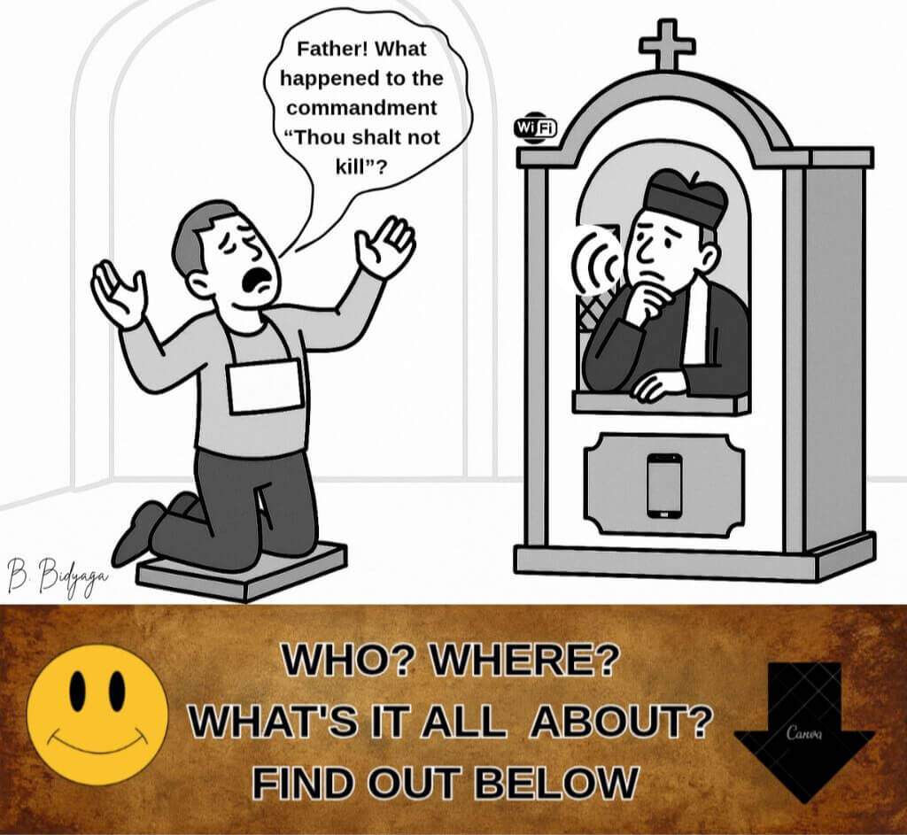
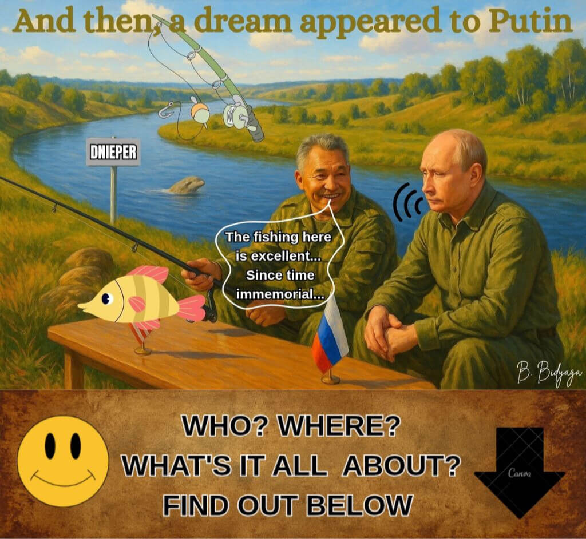
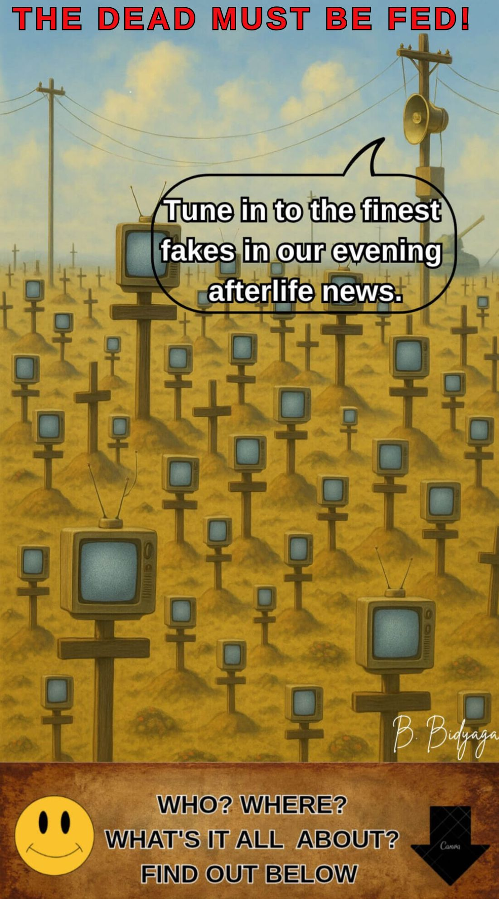
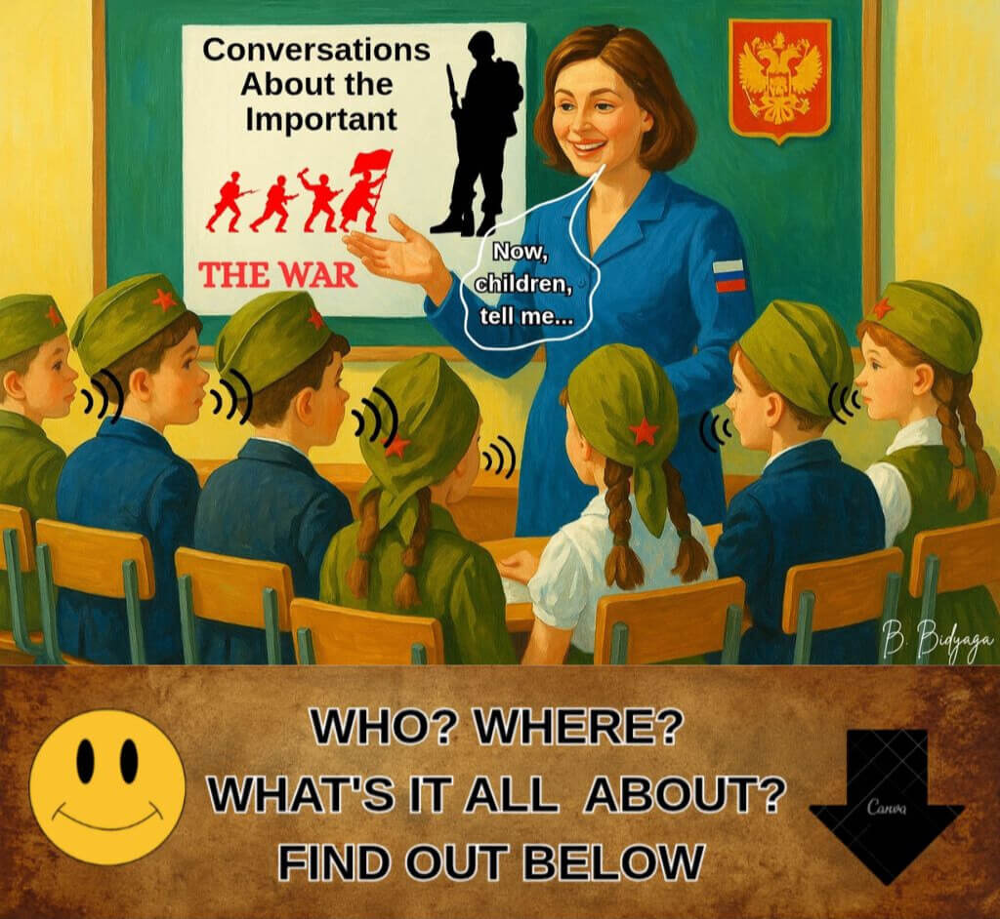
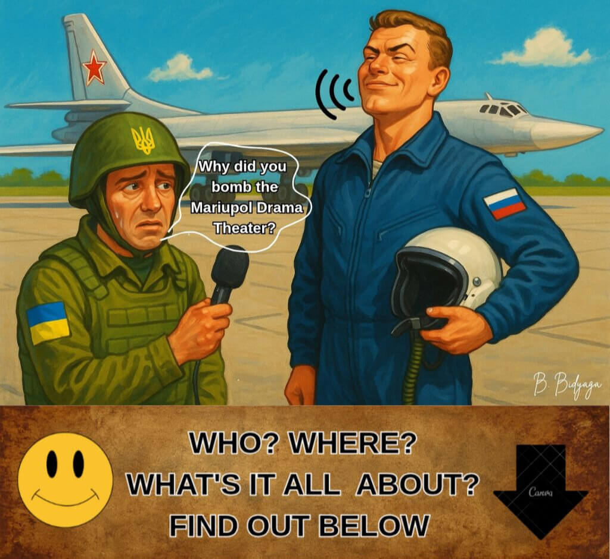
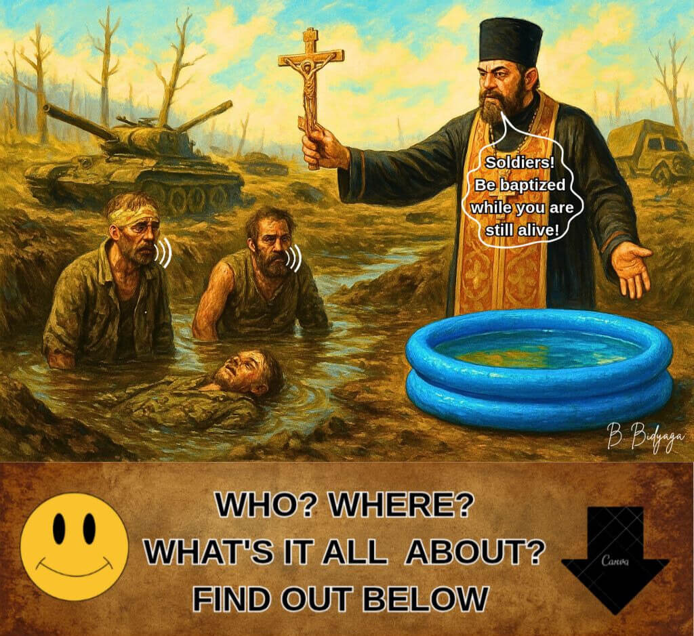
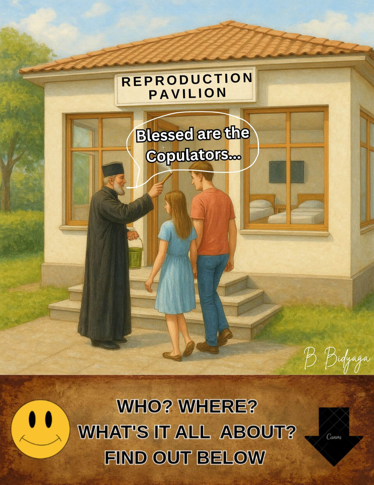
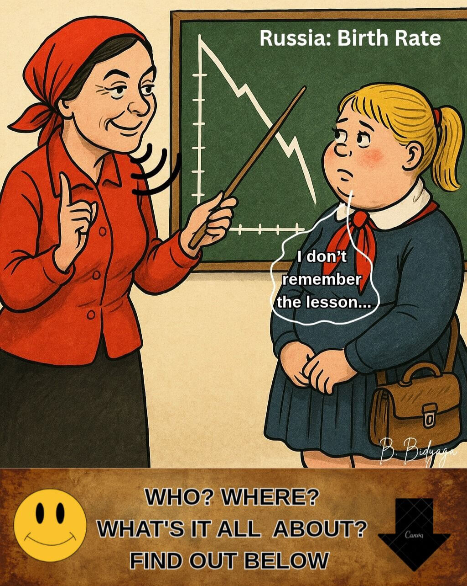
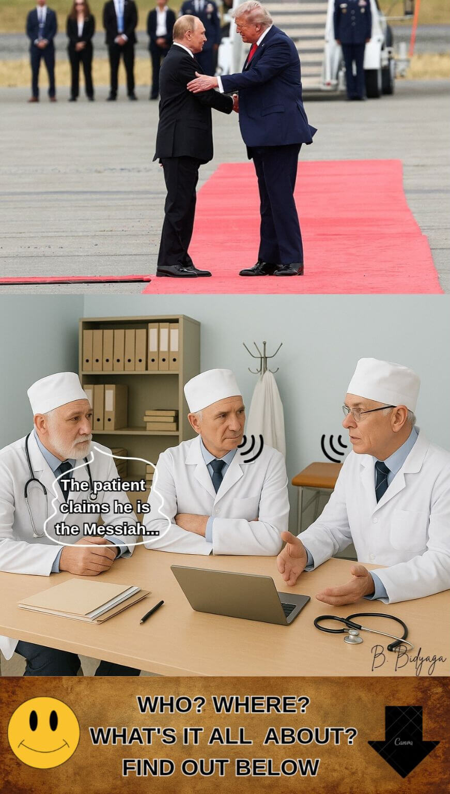

<meta name="robots" content="noindex, no follow">

[**Main Page**](index.md)

**SHCHEGLOVA OLGA (BORIS BIDYAGA)**

# The Golden Dozen: Top 12 Satirical Miniatures

**Diagnostic Foreword: Satire as a Method of Political Autopsy**

Conventional political analysis often fails when confronted with the **performative absurdity** and **metaphysical cynicism** of the contemporary Russian regime. Where rational discourse reaches its limit, **clinical satire** becomes the essential diagnostic tool.

This project is not a literary exercise. It is a **systematic cartography of a political necrosis** — a regime that has evolved from post-Soviet authoritarianism into a unique hybrid: **Orthodox Military Putinism**. This ideology synthesizes imperial nostalgia, a perverted code of religious morality, hyper-modern technologies, and a total contempt for rights and freedoms — into a doctrine of perpetual war: a war against its own citizens, against historical truth, and against the very concept of objective reality.

The “Golden Dozen” dossier presented herein dissects four core pathologies of this system:

1.  **The Biopolitics of Expendability:** The conceptual reduction of the population—especially its youth — from citizens to **consumable “bio-resources”**, valued only for their utility in sustaining power and fueling conflict.
2.  **The Engineering of Unreality:** The regime’s primary operational technology is not merely propaganda, but **institutionalized gaslighting** — the systematic weaponization of absurdity to collapse critical thought and moral judgment.
3.  **The Sacrilege of Faith:** The strategic co-option and mutation of the Russian Orthodox Church into a **theological arm of the security state**, providing sacred sanction to war and repression.
4.  **The Algorithm of Chaos:** A detailed schematic of how the Kremlin exports not just influence, but a **ready-to-install “software for autocracy”** — a package of hybrid tactics, ideological viruses, and corrupt governance models designed to destabilize and replicate.

Below you will find **The Golden Dozen** — twelve key diagnostic miniatures. They serve as both a diagnostic introduction and a conclusive proof of concept.

### CONTENTS

[1. The Supernovus Covenant](Golden_en.md#1-the-supernovus-covenant)

[2. Updating Christianity](Golden_en.md#2-updating-christianity)

[3. Dreams of the Dnieper](Golden_en.md#3-dreams-of-the-dnieper)

[4. Tunguska Special Effect: we can do it Again!](Golden_en.md#4-tunguska-special-effect-we-can-do-it-again)

[5. Propaganda Supplements](Golden_en.md#5-propaganda-supplements)

[6. "Conversations about Important Things"](Golden_en.md#6-conversations-about-important-things)

[7. Barn has Writings Too...](Golden_en.md#7-barn-has-writings-too)

[8. Baptism in Hell](Golden_en.md#8-baptism-in-hell)

[9. Blessed are Copulators...](Golden_en.md#9-blessed-are-copulators)

[10. Diploma of Puberty](Golden_en.md#10-diploma-of-puberty)

[11. Summit in Anchorage, Alaska](Golden_en.md#11-summit-in-anchorage-alaska)

[12. Geopolitical Sandbox](Golden_en.md#12-geopolitical-sandbox)

## 1. THE SUPERNOVUS COVENANT

1. Love your Putin with all your heart, with all your mind, with all your soul.
2. Love your neighbor: your boss, your deputy, your tax inspector.
3. Thou shalt not kill — a statesman, a law enforcement officer.
4. Thou shalt not commit adultery in a condom.
5. Do not bear false witness for personal gain — only for the good of the Motherland.
6. Do not waste thy seed — make children.
7. Thou shalt not steal — that is the prerogative of state officials.
8. Do not seek treasures on earth — they have already been appropriated.
9. Whoever speaks ill of Volodin or Matvienko is worthy of death.
10. Do not yield to the devilish temptation of foreign agents and the fifth column.
11. Blessed are the informers, for theirs is the earthly kingdom. Denounce — and you shall be heard.
12. Love your Motherland — especially through government contracts.
13. Abstain from doubt: faith in television shall save you.
14. Avoid the words “freedom” and “peace,” for they are heresy.
15. Thou shalt not make idols outside the power vertical.

May loyalty be with you — and ye shall not perish in prison.

*From the “Revelation of Russian agency for communications control,” ch. 666.*

#OrthodoxMilitaryPutinism
                                👻

## 2. UPDATING CHRISTIANITY

Confessional in Orthodox church, Russian town.

**Repentant sinner:**

— Father! What happened to the commandment “Thou shalt not kill”?

**Priest:**

— Outdated version, my son!
Upgrade to the latest release.
Run the file "Ukraine_Deleted.exe".

#OrthodoxMilitaryPutinism
                                👻

## 3. DREAMS OF THE DNIEPER

Dream of Russian President Vladimir Putin: he himself and Defense Minister Sergei Shoigu fishing on the Dnieper River, Ukraine.

**Shoigu:**

— The fishing here is excellent... Since time immemorial... Our river, Old Rus’… Mother Volga and Father Dnieper — all the waters of Rus’ came from them… As the great Russian poet once said: “The Dnieper is wondrous in calm weather...”

**Putin:**

— Indeed. By the way, a thousand years ago, right on this very spot, Prince Vladimir caught a giant Perch weighing over 100 pounds! It’s recorded in The Tale of Bygone Years!

(Putin awakens: drizzle, a nasty gray fog drifting over the Moscow River. He dials Medinsky.)

**Putin:**

— Vladimir Rostislavovich? Urgently include the Perch in the new history textbook! Yes, that very one… As a symbol… of Russia's greatness. And make sure it has an illustration!

*V.R. Medinsky, "history maker" on the Kremlin's order, including for school education.*

#OrthodoxMilitaryPutinism
                                👻

## 4. TUNGUSKA SPECIAL EFFECT: WE CAN DO IT AGAIN!

Russia. Moscow. Studio of famous Russian propagandist Vladimir Solovyov, on air. He talks with even more famous propagandist — Margarita Simonyan.

**Solovyov:**

— The Yanks have gone too far. They no longer fear us! Outrageous!

**Simonyan:**

— Then we have to scare them. Here's what we'll do: a spectacular nuclear test broadcast live on TV! We'll detonate a couple of cool neutron bombs, you know, medium yield. Just two pretty twin mushrooms over Siberia. Saving money, by the way, on the fireworks for Victory Day. Just to remind whoever forgot it:  we're all nuts here!

#OrthodoxMilitaryPutinism
                                👻

## 5. PROPAGANDA SUPPLEMENTS

Biologically active informational additives.
Increase the bioavailability of state propaganda up to 100%.
Active components effectively penetrate the blood-brain barrier (of critical thinking).

**Product line:**

• RT-Fake-Hallucinat, 100-500 mg tablets, extended release. Do not chew!

• Kremlin-Surrogate-Info-Syrup, standardized formula.

• "Simulacra of Christianity" Balm, with an odour of hatred. For external use only. Conditionally toxic.

• "Traditional Values" Alcohol Tincture, multi-component. Murky suspension with a cadaverous aroma. 40% ABV.

• RuMedia-FacTwister, powder for oral suspension. Hallucinogenic, with a taste of aggression.

• Kremlin-Ersatz-History, intramuscular injection kit, 100-500 mg. Versions 1.0–10.0 available.

• "Television-Past-Revision" ultra-gentle suppositories with a recto-informational itching effect. 100-500 mg.

• Bifilac-Info, 100-500 mg. An enzymatic medicine (bifido-lacto-Info-bacteria)
to support the digestion of fake news, preventing indigestion and constipation.

 **Pharmacological action:**
 
✓ Loyalty Stimulants: activate centers of submission and herd instinct.

✓ Hatred Agonists: stimulate the amygdala (center of fear and aggression). Boost norepinephrine to redirect anger toward external enemies, constructively relieving internal social tension.

✓ Analysis Inhibitors: suppress prefrontal cortex activity, responsible for critical thinking and logic.

✓ Empathy Blockers: deactivate the insular lobe and anterior cingulate cortex, suppressing all forms of empathy and compassion.

Not classified as medicinal products.

**Standardized composition:**

• Fakes – 50%

• Delusions – 20%

• Empty dreams – 10%

• Self-deception – 5%

**Inactive ingredients:**

U.S. president’s private life, celebrity gossip, African weather reports, UFOs.

**Flavoring options:**

Great-power chauvinism, ultra-right nationalism, flag-waving patriotism, ordinary fascism, blind hatred, “Obama's a jerk”, “rotten West”, "Holy war".

**Colorants & enhancers:**

“Traditional values” (premium), “spiritual bonds” (extra strong), "life's become better & merrier”, “radioactive ashes”,  “we will win.”

**Administration and Dosage:**

The daily dose is calculated according to the formula:
IQ * 10 (mg). The maximum daily dose is 1300 mg.

Take before evening news broadcasts, V. Solovyov’s and M. Simonyan’s prime-time shows, D. Kiselyov’s “News of the Week”, Putin’s live Q&As, D. Peskov’s and the Ministry of Defense briefings.

**Caution:**

Hyperloyalty syndrome, sapio-deficiency.
In case of acute outbreaks of common sense, doubts about the righteousness of state policy, or other forms of resistance to propaganda, "FORTE” formulation is recommended.

**Vital signs monitoring:**

Dopamine levels must remain within the state-approved range.
Excessive emotional amplitude may cause euphoric loyalty syndrome.

**Side effects:**

Patriotic delirium,  panegyrical logorrhea, uncontrollable vomiting with embedded slogans.
A transient cloudy sediment (in the soul) may occur.
In rare cases: ideological thrombosis, leading to acute cognitive failure.

To minimize side effects, increase dosage gradually. Do not exceed recommended amounts!

**Special instructions:**

Suspension recipe. Take 1/2 glass from any murky source, add 1 tsp of powder, stir.
IMPORTANT: Thorough agitation of all kinds — required.
Maximum bioavailability achieved in a state of controlled stupor.

**Warning:** not nootropics. Do not enhance cognitive abilities, only align them with state ideology.
If accidentally ingested by an independent journalist or human rights activist, may cause an acute allergic reaction.

**Shelf life:** unlimited.

#OrthodoxMilitaryPutinism
                            👻
                            

## 6. "CONVERSATIONS ABOUT IMPORTANT THINGS"

School, Russian town. Lesson: "Conversations About Important Things".

**Teacher:**

— Now, children, tell me who you want to be when you grow up.

**Tolya:**

— I’ll be a pilot and bomb enemy cities.

**Masha:**

— I’ll be a nurse and carry the wounded off the battlefield.

**Gena:**

— I’ll be a general at headquarters, giving orders.

**Teacher:**

— And you, Vanyusha? Why so quiet? Tell us who you want to be.

**Vanyusha (with a sigh)**:

— I’ll be hiding from this madness in a psychiatric ward, Elena Petrovna.

#OrthodoxMilitaryPutinism
                                👻
                                

## 7. BARN HAS WRITINGS TOO...

Russian military airfield.
Dialogue between Russian pilot and Ukrainian journalist.

**Ukrainian:**

— Why did you bomb the Mariupol Drama Theater? It was written loud and clear: “CHILDREN!”

**Pilot:**

— A barn can also have “Cock” scrawled on it, but inside — it’s just firewood.

#OrthodoxMilitaryPutinism
                                👻
                                
## 8. BAPTISM IN HELL

Russian-Ukrainian front, Russian positions. Priest urges soldiers to baptize themselves in field “font.”

**Priest:**

— Soldiers! Be baptized while you are still alive! Or straight to hell you go!

**First soldier:**

— We’re already in hell.

**Second soldier:**

— Come on! Let's do it! At least we’ll get a wash!

#OrthodoxMilitaryPutinism
                                👻

## 9. BLESSED ARE COPULATORS...

Russia, Moscow, State Duma hall. 
Deputy Valentina Bebienko speaks from podium:

– Dear deputies! The President has set us the task of reviving great Russia tripling the birth rate. I won’t deny  it – the task is not easy. It's a difficult task. A super difficult one. But we are obliged to fulfill it. Because our president wants us to. I propose we approach the problem creatively. Of course, our target audience is young people. Under 30. After 30, influencing one's consciousness is not so easy. Mental patterns are already formed, and resistance to the state narrative is observed.

Now let's remember our own sad childhood. How did we satisfy our... needs – the perfectly legitimate urges of puberty? Secretly, stealthily, in dark stairwells on dirty windowsills, in damp basements, on dusty attics, or simply, God forgive me, in the park behind a bush. And always in tension: what if someone sees? What if the neighbors report us? And if, God forbid, you got caught – they drag you to the police, write a report, call your parents. In a word, shame for the rest of your life. 

This is wrong, comrades. This doesn't agree with the state demographic policy. Let's correct this imbalance. Let's give our children and grandchildren a happy childhood. Just as there used to be a phone booth on every corner – now in its place there will be a beautiful and tidy "reproduction pavilion". With surveillance cameras for facial recognition – we will award participants social bonuses on the "State Services" internet-portal. 
Inside – a spacious room with 4 double beds, a large TV on the wall. A film library with inspiring videotapes and soap operas. A cupboard with Viagra and accessories. Everything is high-style, clean, and attractive – from the cheerful wallpaper  to the playful patterns on the bed linen. 

And on the steps, instead of a doorman – a priest, sprinkling holy water on those entering, and with a blessing:
"Blessed are the copulators... in the name of the Father and of the Son, and of the Holy Spirit... in accordance with Presidential Decree No. 666..."

And after nine months, the system will automatically assess performance. If the birth of a child is confirmed, the parents will receive a one-time payment. In case of a male child, the amount will be doubled — in accordance with the state program for the militarization of demographic policy.

#OrthodoxMilitaryPutinism
                                👻

## 10. DIPLOMA OF PUBERTY

School in Russia, Family studies class. Diagram of Russia’s birth rate on blackboard.

**Student:**

— I don’t remember the lesson...

**Teacher:**

— Didn’t study for the test? Don’t worry! Go have a baby, dear — you’ll get an A! If you have twins, we’ll call it your anatomy practicum. Triplets — and you can graduate on the spot. No more school for you.

#OrthodoxMilitaryPutinism
                                👻
                                
## 11. SUMMIT IN ANCHORAGE, ALASKA

Case conference in psychiatric hospital. Three professors at table.

**First Professor**:

— The patient claims he is the Messiah.

**Second Professor**:

— What?! The Messiah?! Yesterday he thought he was Hitler!

**Third Professor**:

— Today he has a new mission: “Saving the Ukrainian brotherly people.”

**First Professor**:

— And how does he plan to pull that off?

**Second Professor**:

— As usual: bombings, killings, kidnappings.

**Third Professor**:

— Paranoid geopolitical delusions with a messiah complex…

**First Professor**:

— Pure lunacy, nothing more.

**Second Professor**:

— Colleagues, let’s avoid lyricism. A specific personality disorder.

**Third Professor**:

— The patient cries, saying: “Ukraine is our pain and tragedy.”

**First Professor**:

— And keeps droning on about some “root causes of the conflict” that “must be eliminated.”

**Second Professor**:

— And every five minutes hysterically shouts: “I want all of Donbas!”

**Third Professor**:

— Otherwise — cheerful, vigorous, active, recently met with this... character… in the red cap…

**First Professor**:

— Ah, the notorious “fireman,” the one who can stop wars with a single glance?

**Second Professor**:

— That’s him. A full 11 seconds shaking hands, then strolling down the red carpet, shamelessly flirting and winking.

**Third Professor**:

— Two of a kind, God forgive me! One raves about Donbas, the other about a Nobel Prize.

**First Professor**:

— Indeed, gentlemen. Vanity is a dangerous thing. It can end in a psycho-political disorder.

**Second Professor**:

— Colleagues! I think we clearly see a conflict of interests. Nothing good will come of this.

**Third Professor**:

— For Ukraine — absolutely.

**First Professor**:

— You’re right. Measures must be taken.

**Second Professor**:

— I suggest a drastic increase of haloperidol. Both oral and intramuscular.

**Third Professor**:

— It would also be advisable to prescribe calming baths of Ukrainian mud, accompanied by recordings of the "Crimea is ours!" shouts.

**First Professor**:

— And why not try electroshock therapy? Works wonders for specific disorders. The Ministry of Health already gave the green light.

**Second Professor** (solemnly):

— The Health Ministry  warns… Start acting like a brain-dead idiot, and you’ll get three thousand volts in the ass.

#OrthodoxMilitaryPutinism
                              👻

## 12. GEOPOLITICAL SANDBOX
*Unfinished Mini-Play*

Seven boys are playing in the Sandbox:
 Bully, Jew, and five others. Each boy is special, each wears a unique headpiece: a red cap, a white cap, a bucket hat, a peaked cap, a hat.
 

**ACT 1**

The Boys in the Sandbox

**HAT**:

— News, everyone! The Bully has started another fight.

**WHITE CAP:**

— With whom this time?

**HAT**:

— The Jew.

**WHITE CAP** (sternly):

— Bully, stop it immediately! Disrupting order in the Sandbox is unacceptable!

**BULLY**:

— And who are you to give me orders?

**WHITE CAP:**

— I am the Sandbox monitor. I am the moral authority.

**BULLY**:

— And I am the criminal Authority. I don’t care about your rules. I have a special path and special moral values.

**PEAKED CAP** (cautiously):

— And what's the fight about anyway? What are you arguing over?

**BULLY:**

— He grabbed my land!

**WHITE CAP:**

— Since when is it yours?

**BULLY**:

— It’s always been mine. My great-grandfather’s ashes are buried there!

**HAT**:

— But we agreed on the inviolability of borders! Your Uncle Boris put his signature on it!

**BULLY**:

— Boris was a fool and an alcoholic. Therefore, the deal is declared null and void! It’s my land. End of discussion.

(The Bully walks up to the Jew and punches him in the chest.)

**JEW**:

— Help! He’s killing me!

**HAT**:

— Hang in there, little guy! We’ll pass a Resolution right now. First. We fully condemn this aggression! And we call on all parties to exercise restraint.

**BUCKET HAT:**

— Second. We recognize the Jew’s legitimate right to defend his territory by any means necessary.

**PEAKED CAP:**

— Third. We call on the Bully to respect the established order and immediately cease the conflict.

**WHITE CAP:**

— Should we maybe actually help him?

**BULLY** (making a scary face):

— Just you try! You’ll get a black eye!

**HAT**:

— Such statements are unacceptable! Personally, I find them concerning.

**PEAKED CAP:**

— And disconcerting.

**BUCKET HAT:**

— Guys, we need to be careful with him. Don’t forget: he has a bulldozer.

**BULLY**:

— Spot on! I’ll bring my bulldozer and smash this whole Sandbox to splinters!

(He hits the Jew again.)

**JEW** (in a whisper):

— He’s killing me.

**HAT**:

— My concern has increased many times over.

**PEAKED CAP**:

— My disconcertment is growing exponentially.

**WHITE CAP:**

— I heard that his so-called bulldozer is all rusted out and won’t start.

**BUCKET HAT** (with doubt in his voice):

— We don’t know for sure, what if he fixed it and installed new spark plugs?

**HAT**:

— We must be prudent. Let’s not anger him.

**BUCKET HAT**:

— But it’s obvious: as soon as he finishes off the Jew, he’ll attack the rest of us!

**PEAKED CAP:**

— I am, of course, a bit farther from him, and across the strait, but still, my knees are trembling with fear. Here’s an idea: let’s help the Jew, but just a little bit and secretly. That way the Bully won’t notice.

**BUCKET HAT:**

— The main thing is not to give too much. If the Bully starts losing ground, he’ll get angry. And then he’ll definitely bring his bulldozer and raze the entire Sandbox to the ground.

**HAT**:

— Correct. Let them fight. While the Bully is busy with this brawl, we can sleep soundly.

**WHITE CAP:**

— Excellent plan. We’ll do just that.

**ACT 2**

The New Monitor

A boy in a red cap, holding a golf club, approaches the Sandbox.

**RED CAP:**

— So, what do we have here? A complete mess. It’s all your fault, you foolish old man. Get out of the Sandbox! Your time is up. I’m the monitor now.

**WHITE CAP:**

— Fine. I’m leaving. I did all I could. Good luck with this conflict!

**RED CAP:**

— That’s not why I came. I came to get the Gold Peacemaker Medal. You, with your stupid decrees, only fueled this fight. I came to stop it. You’re a fool, and I’m smart. That’s the whole difference between us. Get out and stop bothering me.

(White Cap leaves.)

**JEW** (looking at the new monitor with hope):

— You will help me, right?

**RED CAP** (sternly):

— So many fine young men have fallen! Beautiful, splendid young men! And all because of you. Why did you let yourself be dragged into this conflict?

**JEW** (stunned):

— I let myself?! He was the one who started it!

**RED CAP**:

— And didn’t you see he’s a thousand times stronger than you? A normal person doesn’t pick a fight with a superior opponent. You should have negotiated right away, not escalated the conflict.

**JEW**:

— But I couldn’t just give him the land! My constitution doesn’t allow it.

**RED CAP**:

— Don’t give me that! You have no cards. You didn’t give it up then, you’ll give it up now. Don’t give it up now, you’ll give it up in a year. Same difference. Only another half a million fine boys will end up in the grave.

**JEW**:

— But that’s not fair! You should help me defeat him instead.

**RED CAP** (with condemnation):

— How much help did the old man give you? Billions in coins. You didn’t even say thank you. You just kept whining and begging for more. And then — where is it all? What happened to those billions?

**JEW**:

— I’m ashamed to admit it, but... they were a bit embezzled. It just happened. It’s not my fault!!!

**RED CAP:**

— You have to pay back all those billions to me. I heard significant deposits of rare-earth metals have been found on your plot? They belong to me now.

**JEW** (agitated):

— This is robbery!

**RED CAP**:

— You thought you’d get a free ride? That’s not how things are done. Sign here.

**JEW**:

— But I’m not authorized. I need parliamentary approval...

**RED CAP**:

— Oh, really?! Hey, Steve, call the guys — tell them to hold back our intel.

**JEW** (desperately):

— Not the intel! I beg you!

**RED CAP:**

— So, are you signing or not?

**JEW** (dejectedly):

— I’m signing.

**ACT 3**

The Same Characters

**RED CAP:**

— So, we begin the peace process. I demand an end to this fight. Bully, state your terms.

**BULLY**:

— He must give me two regions. Throw half of his toy soldiers in the trash. And renounce joining any military blocs.

**RED CAP:**

— Hmm... Not bad. Jew, do you agree?

**JEW** (firmly):

— Over my dead body.

**BULLY** (with a gloating smirk):

— That can be arranged.

**RED CAP:**

— Enough with your jokes! Jew, what’s the problem?

**JEW**:

— He wants me to give him the land without a fight. That’s absurd! There’s no precedent for that in military history.

**RED CAP:**

— Why do you need so much land? Half your population has emigrated.

**JEW**:

— I can’t. Society is against voluntary cession of territory.

**RED CAP:**

— Hey, Steve! Hold back our intel!

**JEW** (hurriedly):

— Alright, alright. I agree, but I demand thorough detailing of the specifics.

**RED CAP:**

— What about the toy soldiers? And renouncing military blocs?

**JEW**:

— In that case, I need ironclad security guarantees — in case the Bully tries to take more of my land. Who will protect me? And how?

**RED CAP:**

— I’m giving you a personal guarantee: in case of renewed aggression, we’ll... figure something out. A 100% guarantee.

**ACT 4**

The Same Characters

**RED CAP:**

— I’m doing everything possible to reconcile these brawlers. I’ve tried every means. But the peace process is somehow stalled.

**PEAKED CAP:**

— You’re the best negotiator — strict but fair. Can I call you “Daddy”?

**HAT**:

— The perfect nickname! Daddy! We are in awe of your diplomatic skill! However, one can’t help but notice that you’re putting pressure on the Jew while fully supporting the Bully’s demands.

**BUCKET HAT:**

— Daddy! We would recommend putting pressure on the Bully as well — for example, you could give the Jew weapons. You promised! But for some reason, you aren’t...

**HAT**:

— It seems Daddy is afraid of the Bully’s bulldozer.

**RED CAP:**

— The bulldozer is a bluff. The Bully is pulling our leg. I’m not afraid of the bulldozer. What I am truly afraid of is that he’ll sneak up from behind, splash gasoline on my trousers, and set them on fire.

(Hat, Peaked Cap, and Bucket Hat exchange meaningful glances and giggle nervously.)

**RED CAP:**

— What’s so funny? Your pants are just as vulnerable to him as mine are! So I advise you to think long and hard before giving weapons to the Jew. Personally, I wash my hands of it.

**PEAKED CAP:**

— Well, then you could impose secondary sanctions on the Bully.

**RED CAP:**

— Sanctions are a debatable matter. First, I don’t want to scare him away from the negotiations. Right now, the Bully is meeting me halfway, and we should value that. Second, he has the world’s largest reserves of rare-earth metals. Why should I quarrel with him if I intend, after peace is concluded, to trade and jointly develop those unique deposits? And besides: my personal friendly relationship with the Bully is the key to future peace in the Sandbox.

(Pause.)

**RED CAP:**

— As for you three — I have major grievances with you! Do you think I’ll come to your rescue when the Bully attacks you? Don’t even hope. Enough of freeloading off me! You’re big boys and must learn to defend yourselves. You need to increase your defense spending to 5 percent of your GDP. That’s an order!
And stop this idiotic immigration! Just look at yourselves in the mirror, see what you’ve become. Where has all your aristocratic bearing, your moral values, your faith gone? You’re destroying your own identity with your own hands. If things continue like this — our friendship will be over!

**ACT 5**

The Same Characters

**RED CAP:**

— So, to summarize. The thirteenth round of talks was sabotaged by the Jew — forcing me to kick him out of the Oval Office. The fourteenth round was sabotaged by the Bully, because, apparently, his plane number one got lost in a labyrinth of clouds.

**BULLY** (casually):

— That’s exactly what happened — the Jew disabled all my navigation systems!

**RED CAP:**

— Fine, whatever! Let’s schedule a date for the next round. And no more nonsense! I propose next Thursday.

**JEW**:

— Won’t work for me — I have Shabbat.

**RED CAP:**

— Then Friday.

**BULLY:**

— Christ was crucified on a Friday.

**RED CAP:**

— Then Saturday, Sunday, Monday...

**BULLY** (shaking his head negatively):

— A three-day mourning period has been declared nationwide...

**RED CAP** (furious):

— Then today! Now! This minute!
I demand that you make peace! Sit down at the negotiating table!

(Red Cap pulls out a folding table and two chairs from behind his back.)

**RED CAP:**

— My pleasure! Have a seat!

**BULLY**:

— Well, now! My chair has gone missing. This is direct sabotage of the negotiation process. I can’t negotiate standing up!

**JEW**:

— And a leg broke off my chair! It’s all the Bully, his tricks!

(Waves a chair leg in the air.)

**RED CAP** (wearily, with a martyred expression):

— The fifteenth round of negotiations is concluded. The dialogue was productive but difficult. We eagerly await the next meeting. There’s a good chance of reaching an agreement before Thanksgiving.

#OrthodoxMilitaryPutinism
                              👻

[**List Of Charitable Foundations Assisting Ukraine**](en_funds)

[**Main Page**](index.md)

