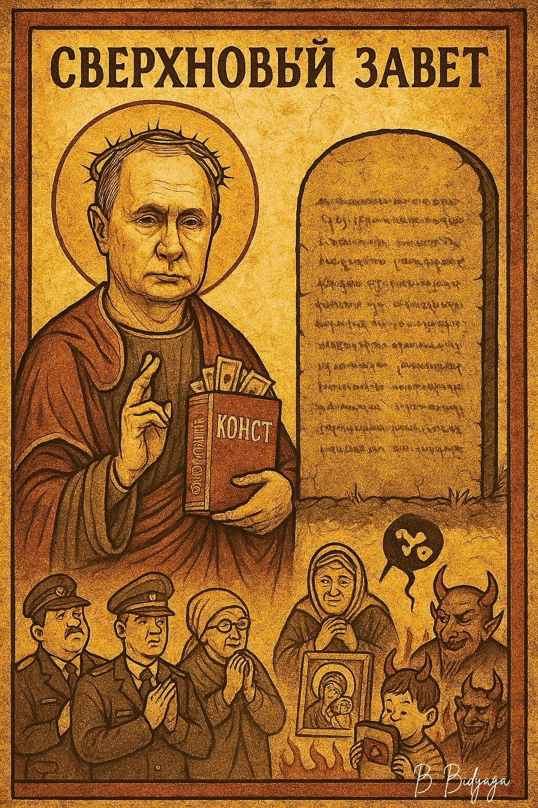
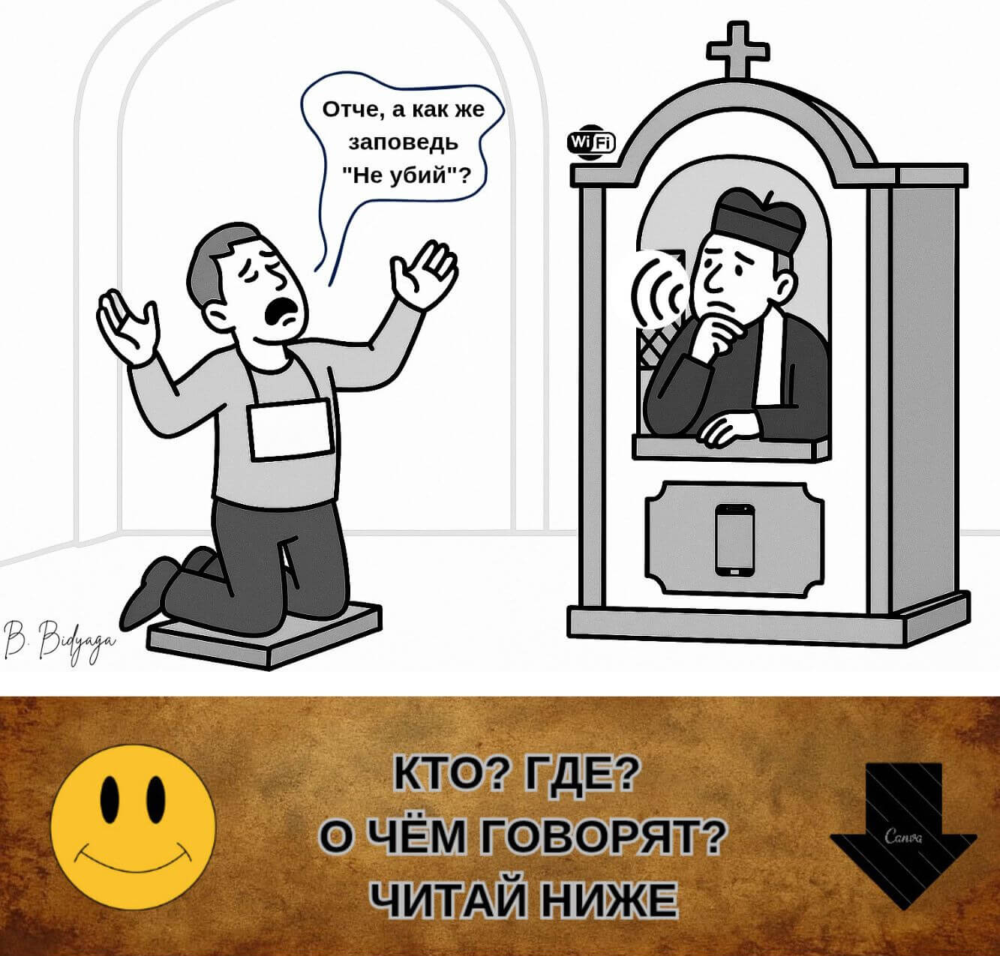
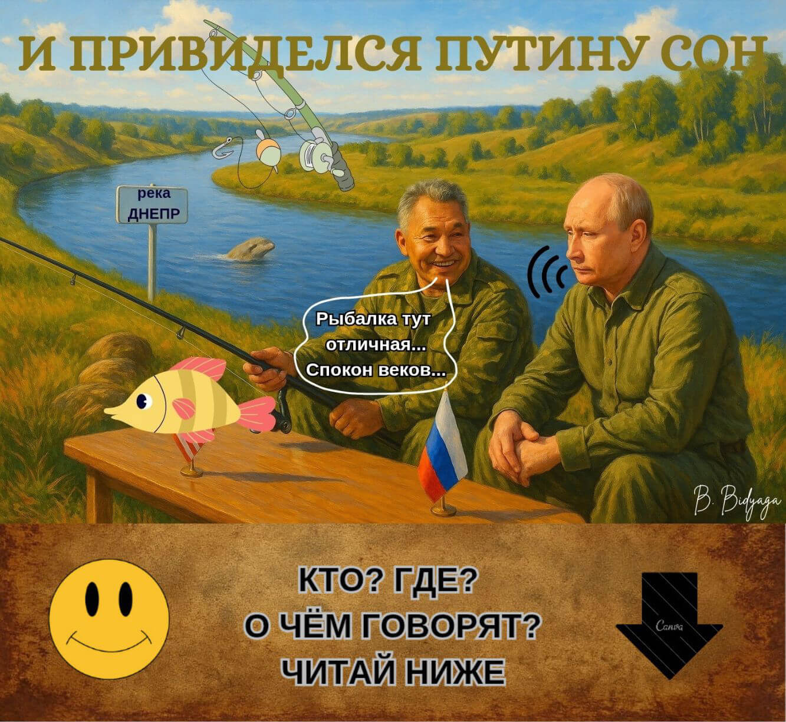
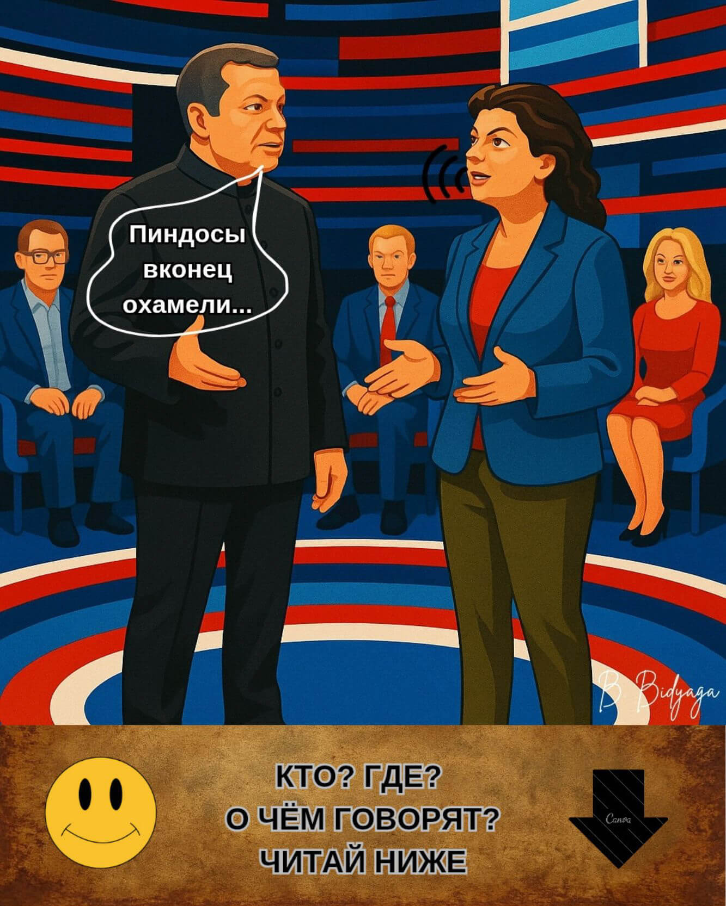
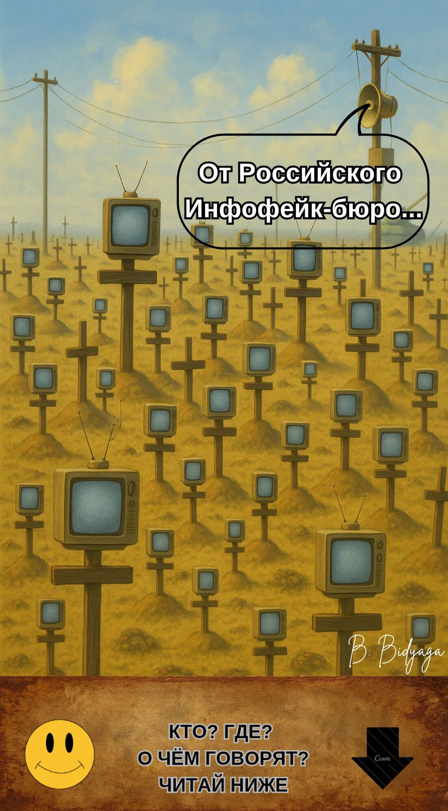
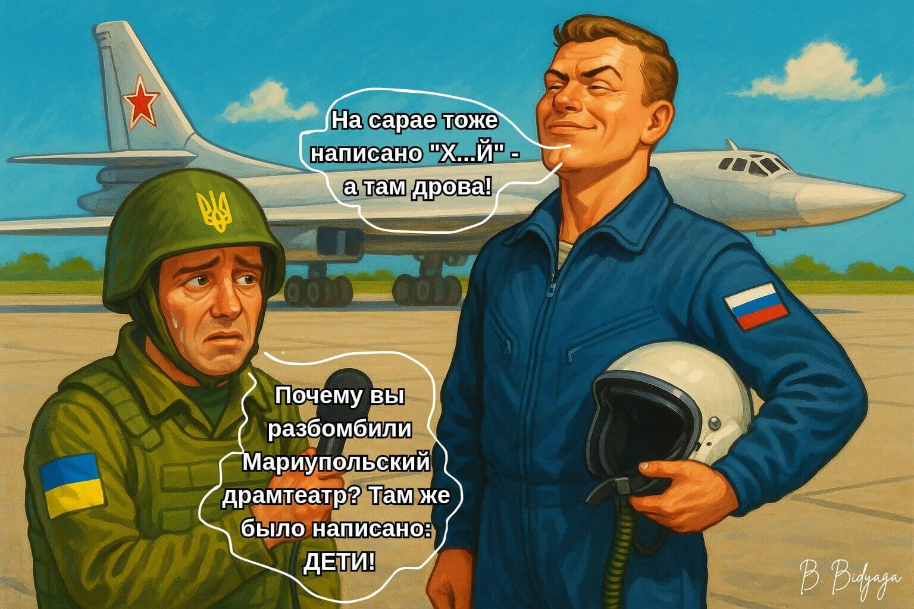
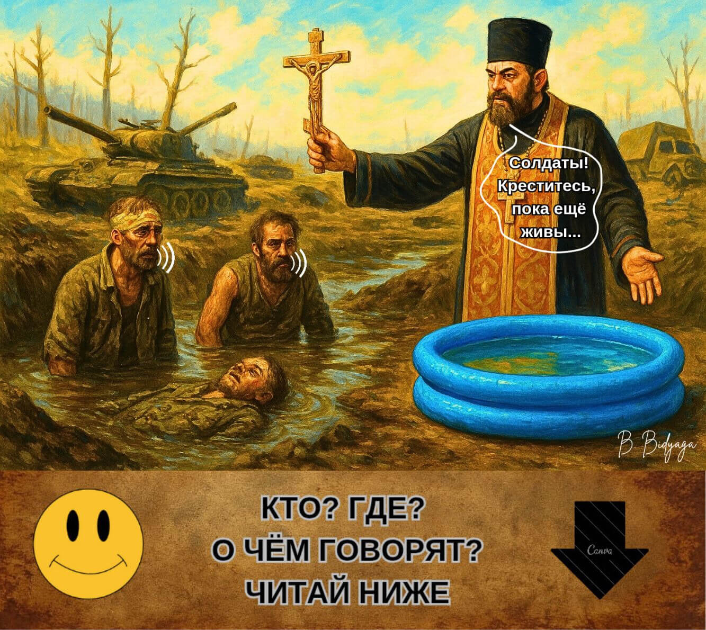
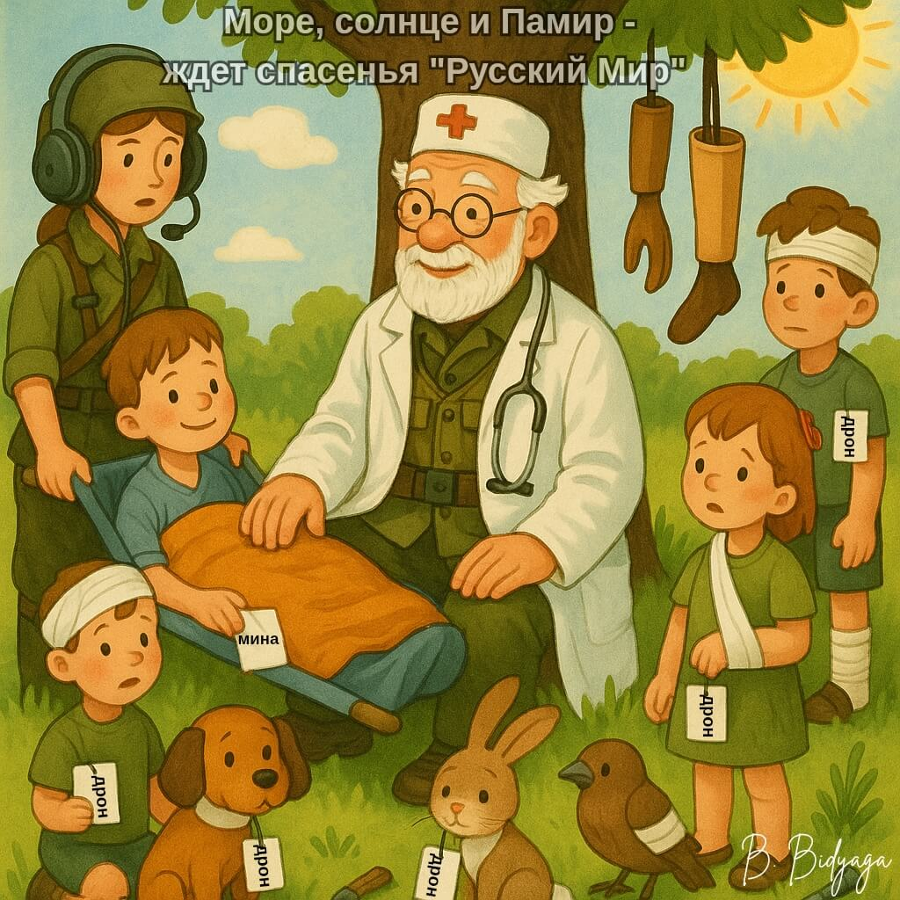
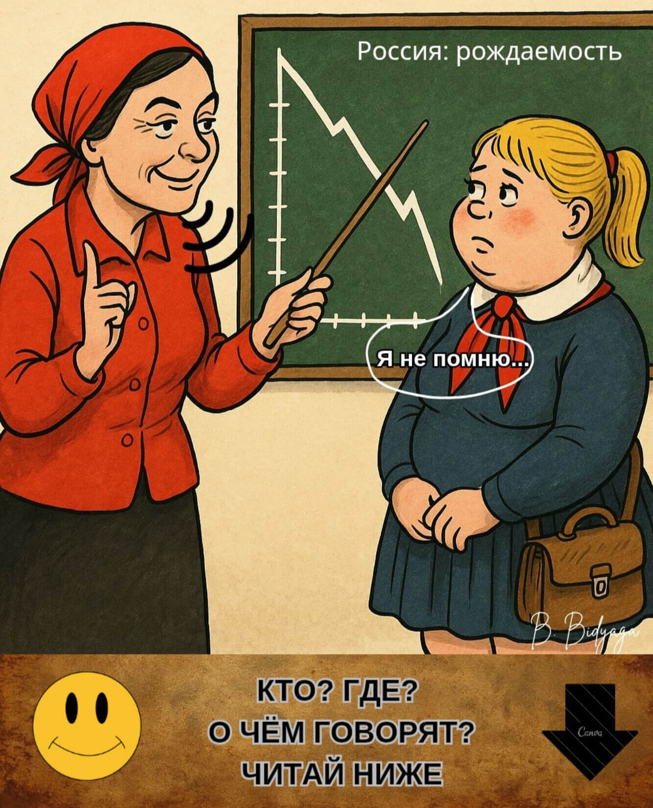
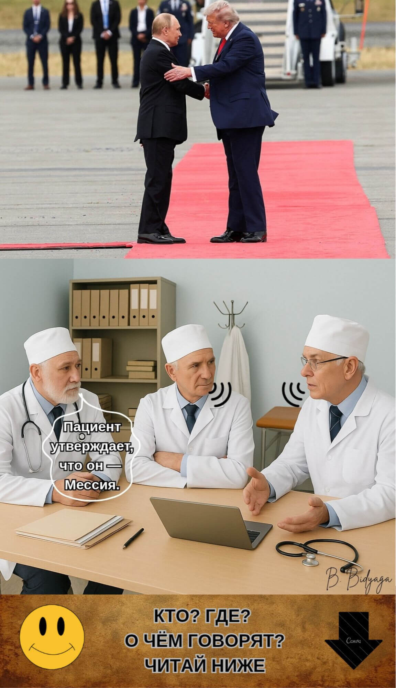

<meta name="robots" content="noindex, nofollow">

[**Главная страница**](index.md)

# ЗОЛОТАЯ ДЮЖИНА
### ТОП-12 САТИРИЧЕСКИХ МИНИАТЮР

**Автор: Щеглова Ольга (Борис Бидяга)**

**Диагностическое предисловие: Сатира как метод политической аутопсии**

Традиционный политический анализ часто терпит неудачу, сталкиваясь с **перформативным абсурдом** и **метафизическим цинизмом** современного российского режима. Там, где рациональный дискурс достигает своего предела, **клиническая сатира** становится необходимым диагностическим инструментом.

Этот проект — не литературное упражнение. Это **систематическая картография политического некроза** — режима, эволюционировавшего из постсоветского авторитаризма в уникальный гибрид: **Православный Военный Путинизм**. 
Эта идеология синтезирует имперскую ностальгию, извращенный кодекс религиозной морали, гиперсовременные технологии и полное пренебрежение правами и свободами в доктрину перманентной войны: войны против собственных граждан, против исторической правды и против самой концепции объективной реальности.

Представленное здесь досье «Золотой дюжины» вскрывает четыре ключевые патологии этой системы:

• **Биополитика расходного материала:** Концептуальная редукция населения — особенно молодёжи — от статуса граждан к **потребляемым «биоресурсам»**, ценным лишь своей полезностью для удержания власти и разжигания конфликтов.

• **Инженерия нереальности:** Ключевая операционная технология режима — не просто пропаганда, а **институционализированный газлайтинг** — системное оружие абсурда, призванное разрушить критическое мышление и моральные суждения.

• **Святотатство веры:** Стратегическая кооптация и мутация Русской Православной Церкви в **теологическое крыло силового государства**, дающее сакральное благословение войне и репрессиям.

• **Алгоритм хаоса:** Детальная схема того, как Кремль экспортирует не просто влияние, а **готовое к установке «программное обеспечение для автократии»** — пакет гибридных тактик, идеологических вирусов и коррумпированных моделей управления, созданный для дестабилизации и репликации.

Ниже вы найдёте **«Золотую дюжину»** — двенадцать ключевых диагностических миниатюр. Они служат одновременно и введением, и окончательным доказательством состоятельности метода.

**ОГЛАВЛЕНИЕ** 

[1. Сверхновый Завет](Golden_ru#1-сверхновый-завет)

[2. Обновление христианства](Golden_ru#2-обновление-христианства)

[3. Мечты о Днепре](Golden_ru#3-мечты-о-днепре)

[4. Тунгусский спецэффект: можем повторить!](Golden_ru#4-тунгусский-спецэффект-можем-повторить)

[5. БАДы пропаганды](Golden_ru#5-бады-пропаганды)

[6. «Разговоры о важном»](Golden_ru#6-разговоры-о-важном)

[7. На сарае тоже кое-что написано...](Golden_ru#7-на-сарае-тоже-кое-что-написано)

[8. Святое омовение в преисподней](Golden_ru#8-святое-омовение-в-преисподней)

[9. Доктор Айболит. Версия 2.0](Golden_ru#9-доктор-айболит-версия-20)

[10. Аттестат половозрелости](Golden_ru#10-аттестат-половозрелости)

[11. Саммит в Анкоридже, Аляска](Golden_ru#11-саммит-в-анкоридже-аляска)

[12. Геополитическая песочница](Golden_ru#12-геополитическая-песочница)

## 1. СВЕРХНОВЫЙ ЗАВЕТ

1. Возлюби Путина твоего всем сердцем твоим, всем разумением твоим, всей душою твоей.
2. Возлюби ближнего твоего: начальника, депутата, налогового инспектора.
3. Не убий: государственного деятеля, сотрудника правоохранительных органов.
4. Не прелюбодействуй в презервативе.
5. Не лжесвидетельствуй ради собственной выгоды — только на благо Отечества.
6. Не расточай семя впустую — делай детей.
7. Не укради — это прерогатива государственного чиновника.
8. Не ищи себе сокровищ на земле — их уже оприходовали.
9. Кто злословит на Володина и Матвиенко — достоин смерти.
10. Не поддавайся дьявольскому искушению в обличье иноагента и пятой колонны.
11. Блаженны доносители, ибо их есть царствие земное. Стучите — и услышаны будете.
12. Люби Родину — особенно на госзакупках.
13. Воздерживайся от сомнений: вера в телевидение спасёт тебя.
14. Избегай слов "свобода" и "мир", ибо сие есть ересь.
15. Не сотвори себе кумира вне вертикали власти.

 Да пребудет с тобой лояльность — и ты не пропадёшь в темнице.

*Из «Откровения от Роскомнадзора», гл. 666.*

#ПравославныйВоенныйПутинизм
                                👻
                                

## 2. ОБНОВЛЕНИЕ ХРИСТИАНСТВА

Россия. Исповедальня в православном храме.

**Кающийся грешник:**

— Отче! А как же заповедь "Не убий"?

**Священник:**

— Устаревшая версия, сын мой! Обнови прошивку. Последняя версия — "ukrainy.net"

#ПравославныйВоенныйПутинизм
                                👻
                                
                                
## 3. МЕЧТЫ О ДНЕПРЕ

Президенту России Владимиру Путину снится сон. Будто бы он сам и министр обороны РФ Сергей Шойгу рыбачат на Днепре.

**Шойгу:**

— Рыбалка тут отличная... Спокон веков... Наша речка, древнерусская... Волга-матушка да Днепр-батюшка — от них вся вода на Руси пошла... Как сказал великий русский поэт:  "Чуден Днепр при тихой погоде..."

**Путин:**

— Да-а. Между прочим, тысячу лет назад на этом самом месте Князь Владимир поймал гигантского Окуня весом в 3 пуда!  Об этом есть запись в Повести Временных Лет!

(Путин просыпается: моросит дождь,  над Москвой-рекой стелется гадкий серый туман. Путин набирает номер Мединского.)

**Путин:**

— Владимир Ростиславович? Срочно внесите Окуня в новый учебник истории! Да, того самого… Как символ… русской… великодержавности. И чтобы с иллюстрацией!  

#ПравославныйВоенныйПутинизм
                                👻

## 4. ТУНГУССКИЙ СПЕЦЭФФЕКТ: МОЖЕМ ПОВТОРИТЬ!

Москва, Россия.
Студия известного российского пропагандиста Владимира Соловьева.
В.Соловьев беседует с ещё более известной пропагандистской — Маргаритой Симоньян.

**Соловьев:**

— Пиндосы вконец охамели: перестали нас бояться! Это же черт знает что!

**Симоньян:**

— Надо их напугать. Вот что мы сделаем. Устроим эффектное ядерное испытание в прямом эфире! Взорвем пару клёвых нейтронных бомбочек над Сибирью. Средней мощности. Чисто символически. Просто два симпатичных ядерных грибочка для всеобщего обозрения. Заодно сэкономим на салюте в День Победы.
Пускай не забывают, что мы тут все буйные!

#ПравославныйВоенныйПутинизм
                                👻

## 5. БАДЫ ПРОПАГАНДЫ

Биологически активные добавки информационные. 
Повышают биодоступность государственной пропаганды до 100%.
Активные компоненты эффективно преодолевают гемато-энцефалический барьер (критического мышления).

**Линейка препаратов:**

• Глюкофейконат Соловьева, таблетки 100-500 мг, пролонгированного действия. Не разжёвывать!

• Суррогатная инфо-микстура "Москва. Кремль. Путин", нормализованная. 

• Бальзам "Симулякры христианства" с ароматом ненависти, для наружного применения. Условно ядовитый.

• Спиртовая настойка "Традиционные ценности", многокомпонентная. Мутная взвесь с трупным запахом. Крепость 40%.

• Фактозаменитель от Симоньян, порошок для суспензии. Галлюциногенный, со вкусом агрессии.

• Эрзац-истории от Мединского, набор инъекций в/м, 100-500 мг. Версии 1.0 — 10.0.

• Фальш-вести от Киселева, суппозитории супернежные с эффектом ректально-информационного зуда. 100-500 мг.

• Бифилак-Инфо, 100-500 мг. Препарат группы ферментов (бифидо-лакто-инфо-бактерии). Способствует эффективному перевариванию фейковой информации, предотвращает несварение и констипацию. 

**Фармакологическое действие:**

✓Стимуляторы лояльности: возбуждают центры покорности и  стадного инстинкта.

✓Агонисты ненависти: стимулируют миндалевидное тело (центр страха и агрессии). Потенцируют выработку норадреналина, направляя агрессию на внешнего врага, конструктивно снимая внутреннее социальное напряжение.

✓Ингибиторы анализа: подавляют активность префронтальной коры, отвечающей за критическое мышление и логику.

✓Блокаторы эмпатии: дезактивируют островковую долю и переднюю поясную кору, подавляя все формы эмпатии и сопереживания.

Не являются лекарственным средством.

**Состав стандартизованный:**

~ Фейки 50%

~ Глюки 20%

~ Пустые мечтания 10%

~ Самообман 5%

**Вспомогательные вещества:**

Личная жизнь президента США, звёздные сплетни, погода в Африке, НЛО.

**Ароматизаторы (на выбор):**

Великодержавный шовинизм, ультраправый национализм, ура-патриотизм, обыкновенный фашизм, 
слепая ненависть, "Обама-чмо", "гнилой Запад", "священная война".

**(Приу)красители:** 

"Ценности традиционные" отборные, "скрепы духовные" усиленные, "жить стало лучше, жить стало веселей", "радиоактивный пепел", "мы победим".

**Способ употребления и дозы**:

Суточная доза рассчитывается по формуле:
IQ * 10 (мг). Максимальная суточная доза - 1300 мг. 

Рекомендован ежедневный прием перед выпуском вечерних новостей, телеэфирами В. Соловьева и М. Симоньян, итоговой программой Д. Киселева "Вести недели", "прямой линией" Путина, брифингами Д. Пескова и Минобороны РФ.

**С осторожностью:**

Синдром гиперлояльности, сапионедостаточность. При острых приступах здравого смысла, сомнениях в правильности государственного курса и других формах резистентности к пропаганде рекомендована форма "Форте". 

**Контроль жизненных показателей:**

Уровень глюков не должен превышать уровень глюкозы.

**Побочные эффекты:**

Патриотический делириум, славословный понос, неукротимая рвота с вкраплениями лозунгов. 
В редких случаях развивается идеологический тромбоз, приводящий к острой недостаточности когнитивных функций.
Допускается преходящий мутный осадок (в душе). 
Во избежание побочных эффектов дозу увеличивать постепенно! Не превышать дозировку!

**Особые указания:**

Приготовление суспензии: взять 1/2 стакана из любого мутного источника, добавить 1 чайную ложку порошка и перемешать. Внимание: требуется тщательное забалтывание! Максимальная биодоступность достигается в состоянии контролируемого отупения. 

Препараты не являются ноотропами! Не улучшают когнитивные функции, но приводят их в соответствие с государственной идеологией. При случайном попадании в организм независимого журналиста или правозащитника могут вызвать острую аллергическую реакцию.

**Срок годности:** 
не ограничен.

#ПравославныйВоенныйПутинизм
                               👻
                               

## 6. "РАЗГОВОРЫ О ВАЖНОМ"

Школа в российском городе.
Обязательный урок "Разговоры о важном".

**Учительница:**

— А теперь, детки, расскажите, кем вы хотите стать, когда вырастете.

**Толя:**

— Я стану лётчиком, буду бомбить вражеские города.

**Маша:**

— А я — медсестрой, буду выносить раненых с поля боя.

**Гена:**

— А я стану генералом, буду сидеть в штабе и отдавать приказы.

**Учительница:**

— А ты что молчишь, Иванушка? Скажи нам, кем ты хочешь стать?

**Иванушка (со вздохом):**

— А я, Елена Петровна, в психушке буду сидеть. Подальше от этого дурдома.

#ПравославныйВоенныйПутинизм
                                👻
                                

## 7. НА САРАЕ ТОЖЕ КОЕ-ЧТО НАПИСАНО...

Российский военный аэродром. Диалог российского летчика с представителем украинских СМИ.

**Украинец:**

— Почему вы разбомбили Мариупольский драмтеатр? Там же было написано: "ДЕТИ!"

**Летчик:**

— На сарае тоже написано "Х...й" — а там дрова!

#ПравославныйВоенныйПутинизм
                                👻

## 8. СВЯТОЕ ОМОВЕНИЕ В ПРЕИСПОДНЕЙ

Российско-украинский фронт. Российские позиции. Священник агитирует солдат креститься в походной "купели".

**Священник:**

— Солдаты! Креститесь, пока ещё живы! Не то попадёте в ад!

**Первый солдат:**

— Мы и так в аду.

**Второй солдат:**

— Давай! Соглашайся! Хотя бы помоемся!

#ПравославныйВоенныйПутинизм
                                👻

## 9. ДОКТОР АЙБОЛИТ. ВЕРСИЯ 2.0

Добрый доктор Айболит, 

Он под деревом сидит.

Приходите в кабинет 

И ефрейтор, и корнет.

Всех излечит-исцелит 

Добрый доктор Айболит.

И пришёл к Айболиту Муса: 

Ой, меня расстреляла "Оса".

И пришёл к Айболиту "Портос": 

Меня с дрона шарахнули в нос.

И прибежала радистка 

И закричала: Беда! 

Мой Вася, мой мальчик, 

Ступил не туда. 

Он бежал по минной дорожке, 

И ему раскурочило ножки.

И теперь он больной и хромой, 

Бедный сынулечка мой.

И сказал Айболит: Не беда. 

Подавай-ка его сюда.

Я пришью ему новые ножки —

Пусть шагает по минной дорожке!

И принесли к нему Васю —

Такого больного, хромого.

И доктор пришил ему ножки —

И Вася стреляет снова.

А с ним и радистка-мать 

Тоже пошла танцевать. 

И стреляет она, и кричит: 

Ну спасибо тебе, Айболит!

Вдруг с востока "Аксакал" 

На кобыле прискакал.

"Вот вам срочное посланье. 

Прочитайте. До свиданья".

"Приезжайте, доктор, 

В Жмеринку скорей.

И спасайте, доктор, 

Наших корешей".

"Что такое? Неужели 

Ваши парни заболели?"

"Да-да-да, у них судимость, 

Слёзы, пот, непроходимость.

Если вы их не спасёте, 

Мы утопим их в болоте.

Ибо Путин дал приказ: 

Выдвигаться на Кавказ".

Море, солнце и Памир —

Ждёт спасенья "Русский Мир"!

"Русский Мир" теперь навечно —

Грязь, болота и пески —

Где зелёных человечков 

Оттоптались башмаки.

#ПравославныйВоенныйПутинизм
                                👻

## 10. АТТЕСТАТ ПОЛОВОЗРЕЛОСТИ

Школа в российском городе. Урок семьеведения. На доске — график динамики рождаемости в России.

**Ученица:**

— Я не помню...

**Учительница:**

— Не выучила урок? Не страшно! Иди, деточка, рожай — получишь пятёрку! А родишь двойню — зачтём как практикум по анатомии. Тройня — аттестат зрелости досрочно. Больше в школу ходить не придётся.

#ПравославныйВоенныйПутинизм
                                👻

## 11. САММИТ В АНКОРИДЖЕ, АЛЯСКА

Консилиум в психиатрической больнице. В кабинете за столом — 3 маститых профессора. 

**Первый профессор:**

— Пациент утверждает, что он — Мессия.

**Второй профессор:**

— Как?! Мессия?! Вчера же был Гитлер!

**Третий профессор:**

— Сегодня у него новая миссия: «Спасти  украинский братский народ».

**Первый профессор:**

— И как он собирается это сделать?

**Второй профессор:**

— Как обычно: бомбардировки, убийства, похищения.

**Третий профессор:**

— Параноидальный геополитический бред с манией величия ...

**Первый профессор:**

— Бред... сивой кобылы при лунном свете.

**Второй профессор:**

— Коллеги, обойдёмся без лирики. Специфическое расстройство личности.

**Третий профессор:**

— А ещё плачет, говорит: «Украина для нас — боль и трагедия».

**Первый профессор:**

— И всё время талдычит про какие-то "первопричины конфликта", которые "необходимо устранить".

**Второй профессор:**

— И каждые пять минут истерично выкрикивает: "Хочу весь Донбасс!"

**Третий профессор:**

— А в остальном — весел, бодр, активен, намедни встречался с этим... персонажем... в красной кепке... 

**Первый профессор:**

— А-а, пресловутый "пожарник", одним взглядом останавливающий военные конфликты?

**Второй профессор:**

— Он самый. Целых 11 секунд жали друг другу ручки, после расхаживали по красной дорожке, безбожно флиртовали и подмигивали.

**Третий профессор:**

— Два сапога пара, прости Господи! Один бредит Донбассом, другой — Нобелевкой.

**Первый профессор:**

— Да-с, господа. Тщеславие — вещь опасная. Может закончиться психо-политическим расстройством. 

**Второй профессор:**

— Коллеги , мне кажется, налицо конфликт интересов. Ни к чему хорошему это не приведёт.

**Третий профессор:**

— Для Украины — уж точно.

**Первый профессор:**

— Вы правы. Необходимо принять меры.

**Второй профессор:**

— Предлагаю кратно увеличить дозу галоперидола. Перорально и внутримышечно.

**Третий профессор:**

— Желательно также назначить пациенту успокоительные чернозёмные ванны под аудиозапись с криками "Крым наш!"

**Первый профессор:**

— А почему бы не попробовать электрошок? Отлично действует при специфических расстройствах. Минздрав же дал зелёный свет.

**Второй профессор** (с пафосом):

— Минздрав предупреждает... Будете буянить — получите три тысячи вольт в задницу.

#ПравославныйВоенныйПутинизм
                                👻

## 12. ГЕОПОЛИТИЧЕСКАЯ ПЕСОЧНИЦА
*Неоконченная микропьеса*

Семеро мальчиков играют в Песочнице:
Хулиган, Еврей и ещё пятеро. Каждый мальчик — особенный, у каждого на голове уникальный головной убор: красная кепка, белая кепка, панама, фуражка, шляпа.

**ДЕЙСТВИЕ 1**

Мальчики в Песочнице 

**Шляпа:**

— А у нас новость! Хулиган опять затеял драку.

**Белая кепка:**

— С кем на этот раз?

**Шляпа:**

— Еврей.

**Белая кепка (строго):**

 — Хулиган, прекрати немедленно! Недопустимо нарушать  в Песочнице порядок!

**Хулиган**:

— А ты кто такой, чтобы мне приказывать?

**Белая кепка:**

— Я — староста по Песочнице. Я  — моральный авторитет.

**Хулиган:**

— А я — криминальный Авторитет. Мне плевать на ваши порядки. У меня особый путь и особые моральные ценности.

**Фуражка (осторожно):**

— Да из-за чего драка-то? Что не поделили?

**Хулиган:**

— Он захапал мою землю!

**Белая кепка:**

— С каких это пор она твоя?

**Хулиган:**

— Всегда была моя. Там прах моего прадедушки!

**Шляпа:**

— Но мы же договорились о нерушимости границ! Твой дядя Борис поставил свою подпись!

**Хулиган:**

— Борис был дурак и алкоголик. В силу этого сделка объявляется ничтожной! Это моя земля. Конец дискуссии.

(Хулиган подходит к  Еврею и бьёт его кулаком в грудь.)

**Еврей:**

— Помогите! Убивают!

**Шляпа:**

— Держись, малыш!  Сейчас примем Резолюцию. Первое. Мы всецело осуждаем эту агрессию!

**Панама:**

— Второе. Мы признаем законное право Еврея защищать свою территорию любыми средствами.

**Фуражка:**

— Третье. Мы призываем Хулигана соблюдать установленный порядок и немедленно прекратить конфликт.

**Белая кепка:**

— Может, всё-таки окажем ему помощь?

**Хулиган (делая страшное лицо):**

— Только попробуй! Получишь в глаз!

**Шляпа:**

— Подобные заявления недопустимы! Лично у меня они вызывают беспокойство.

**Фуражка:**

— И озабоченность.

**Панама:**

— Парни, с ним надо поосторожней. Не забывайте: у него есть бульдозер.

**Хулиган:**

— Вот именно!  Пригоню бульдозер и разнесу всю Песочницу в щепки!

(Наносит Еврею ещё один удар.)

**Еврей (шёпотом):**

— Убивают!

**Шляпа:**

— Моё беспокойство многократно  усилилось.

**Фуражка:**

— Моя озабоченность растет по экспоненте.

**Белая кепка:**

— Я слышал, что этот его пресловутый бульдозер весь проржавел и не заводится.

**Панама (с сомнением в голосе):**

— Мы точно не знаем, а вдруг он его починил и установил новые свечи?

**Шляпа:**

— Надо проявлять осмотрительность. Не будем его злить.

**Панама:**

— Но ведь ясно: как только он прикончит Еврея, он нападет на нас с вами!

**Фуражка:**

— Я, конечно, от него чуть подальше, и через пролив, но все равно коленки дрожат от страха. Давайте вот что: будем Еврею помогать, но понемножку и тайно. Тогда Хулиган ничего не заметит. 

**Панама:**

— Главное — не давать слишком много. Если Хулиган начнет терять позиции, он разозлится. И тогда уж точно пригонит свой бульдозер и сравняет с землёй всю Песочницу.

**Шляпа:**

— Правильно. Пускай сражаются. Пока Хулиган занят этой дракой, мы можем спать спокойно. 

**Белая кепка:**

— Отличный план. Так и сделаем.

**ДЕЙСТВИЕ 2**

Новый староста

К Песочнице подходит мальчик в красной кепке и с клюшкой для гольфа в руках.

**Красная кепка:**

— Ну, что тут у вас? Развели бардак. Всё ты, глупый старикашка. Выметайся из Песочницы! Твое время вышло. Я теперь староста.

**Белая кепка:**

— Хорошо. Я ухожу. Сделал все что мог. Удачи тебе с этим конфликтом! 

**Красная кепка:**

— Я пришел не для того, я пришел, чтобы получить Золотую медаль Миротворца. Ты, со своими глупыми указами, только разжигал эту драку. Я пришел, чтобы ее остановить. Ты дурак, а я умный. В этом вся разница между нами. Уходи и не мозоль мне глаза.

(Белая кепка уходит.)

**Еврей** (с надеждой глядя на нового старосту):

— Ты ведь поможешь мне, правда?

**Красная кепка (сурово):**

— Столько юношей полегло! Красивых, прекрасных юношей! И всё — из-за тебя. Зачем ты позволил втянуть себя в этот конфликт?

**Еврей (ошарашенно):**

— Я позволил?! Да ведь он первый начал!

**Красная кепка:**

— А ты что, не видел, что он в тысячу раз сильнее тебя? Нормальный человек не полезет в драку с превосходящими силами  противника. Надо было сразу договариваться, а не разжигать конфликт.

**Еврей:**

— Но не мог же я отдать ему землю!  Мне конституция не позволяет.

**Красная кепка:**

— Не морочь мне голову! У тебя нет карт. Не отдал тогда — отдашь сейчас. Сейчас не отдашь — отдашь через год. Один черт. Только ещё полмиллиона красивых мальчиков лягут в могилу.

**Еврей:**

— Но это же несправедливо! Ты бы лучше помог мне его победить. 

**Красная кепка:**

— Старик тебе сколько помощи дал? Миллиарды монет. Ты даже спасибо не сказал. Только клянчишь и клянчишь. И потом — где это всё? Куда подевались эти миллиарды?

**Еврей:**

— Мне стыдно признаться, но их немножко разворовали. Так получилось. Я не виноват!!!

**Красная кепка:**

— Все эти миллиарды ты должен мне вернуть. Я слышал, на твоей делянке обнаружены большие запасы редкоземельных металлов?   Теперь они принадлежат мне.

**Еврей (взволнованно):**

— Это грабеж!

**Красная кепка:**

— А ты хотел на халяву прокатиться? Так дела не делаются. Ставь свою подпись.

**Еврей:**

— Но я не уполномочен. Нужна санкция парламента...

**Красная кепка:**

— Ах так! Эй, Стив, позвони ребятам — пусть придержат наши разведданные.

**Еврей (в отчаянии):**

— Только не разведданные! Умоляю! 

**Красная кепка:**

— Так ставишь подпись или нет?

**Еврей (подавленно):**

— Ставлю.

**ДЕЙСТВИЕ 3**

Те же лица

**Красная кепка:**

— Итак, начинаем мирный процесс. Я требую, чтобы эта драка прекратилась. Хулиган, твои условия. 

**Хулиган:**

— Он должен отдать мне два региона. И выкинуть в помойку половину своих солдатиков. И отказаться от вступления в военные блоки. 

**Красная кепка:**

— Х-м... Недурно. Еврей, ты согласен?

**Еврей (твёрдо):**

— Только через мой труп.

**Хулиган (со злорадной усмешкой):**

— Это можно устроить.

**Красная кепка:**

— Прекратите ваши шуточки! 
Еврей, в чем дело?

**Еврей:**

— Он хочет, чтобы я отдал ему землю без боя. Это же нонсенс!  В военной истории нет таких прецедентов.

**Красная кепка:**

— Зачем тебе столько земли? У тебя половина населения эмигрировала. 

**Еврей:**

— Я не могу. Общество против добровольной сдачи территорий.

**Красная кепка:**

— Эй, Стив! Придержите наши разведданные!

**Еврей (поспешно):**

— Хорошо, хорошо. Я согласен, но требую тщательной проработки деталей.

**Красная кепка:**

— Что насчёт солдатиков? И отказа от военных блоков?

**Еврей:**

— В этом случае мне нужны твердые гарантии безопасности — на случай если Хулиган снова покусится на мои земли. Кто меня защитит? И каким образом?

**Красная кепка:**

— Гарантии я даю тебе лично: в случае повторной агрессии мы... что-нибудь придумаем. Гарантия — 100%.

**ДЕЙСТВИЕ 4**

Те же лица

**Красная кепка:**

— Я делаю все возможное, чтобы помирить этих драчунов. Я перепробовал все средства. Но мирный процесс почему-то буксует.

**Фуражка:**

— Ты самый лучший переговорщик — строгий, но справедливый. Можно я буду называть тебя "Папочкой"?

**Шляпа:**

— Идеальное прозвище! Папочка! Мы восхищены твоим искусством дипломатии! Однако нельзя не заметить, что ты давишь на Еврея, а Хулигана в его требованиях всецело поддерживаешь.

**Панама:**

— Папочка! Мы бы рекомендовали оказать давление также и на Хулигана — например, ты мог бы дать Еврею оружие. Ты ведь обещал!  Но почему-то не даёшь...

**Шляпа**:

— Видимо, Папочка боится Хулиганского бульдозера.

**Красная кепка:**

— Бульдозер — блеф. Хулиган берёт нас на понт. Бульдозера я не боюсь. А вот чего я действительно опасаюсь, так это того, что он подкрадется сзади, плеснет мне на штаны бензина и подожжет.

(Шляпа, Фуражка и Панама многозначительно переглядываются и нервно хихикают.)

**Красная кепка:**

— Чего смеётесь? Ваши штаны уязвимы перед ним в неменьшей степени, чем мои!  Так что советую хорошенько подумать, прежде чем давать Еврею оружие. Лично я умываю руки.

**Фуражка**:

— Ну тогда ты мог бы ввести против Хулигана вторичные санкции.

**Красная кепка:**

— Санкции — это вопрос спорный. Во-первых,  я не хочу его отпугивать от переговоров. Сейчас Хулиган идёт мне навстречу, и это надо ценить. А во-вторых, у него самые большие в мире запасы редкоземельных металлов. Зачем мне с ним ссориться, если я намерен, после заключения мира, торговать и совместно осваивать эти уникальные месторождения? И вообще: мои личные добрые отношения с Хулиганом — это залог будущего мира в Песочнице.

(Пауза.)

**Красная кепка:**

— А вот вы трое — к вам у меня большие претензии!  Вы что — думаете, я вас буду спасать, когда Хулиган на вас набросится?  Даже не надейтесь. Хватит сидеть у меня на шее! Вы большие мальчики и должны научиться сами себя защищать. Вам необходимо увеличить расходы на оборону до 5 процентов ВВП. Это приказ! 
И прекратите эту дурацкую иммиграцию! Вы только посмотрите на себя в зеркало, до чего вы себя довели. Куда подевалась вся ваша аристократичность, моральные ценности, вера? Вы собственными руками уничтожаете свою идентичность. Если и дальше дело так  пойдет — нашей дружбе придет конец!

**ДЕЙСТВИЕ 5**

Те же лица 

**Красная кепка:**

— Итак, резюмирую. Тринадцатый раунд переговоров сорвал Еврей — вынудив меня выгнать его из Овального кабинета. Четырнадцатый раунд сорвал Хулиган, потому что, видите ли, его борт номер один заблудился в лабиринте облаков.

**Хулиган (небрежно):**

— Так оно и было — Еврей вырубил мне все навигационные приборы!

**Красная кепка:**

— Ладно, проехали!  Давайте назначим дату нового раунда. И чтобы без глупостей! Предлагаю следующий четверг.

**Еврей**:

— Не получится — у меня Шабат.

**Красная кепка:**

— Тогда пятница.

**Хулиган**:

— В пятницу распяли Христа.

**Красная кепка:**

— Тогда суббота, воскресенье, понедельник...

**Хулиган (отрицательно качая головой):**

— По всей стране объявлен трёхдневный траур...

**Красная кепка (в ярости):**

— Тогда сегодня! Сейчас! Сию минуту!
Я требую, чтобы вы помирились! Садитесь за стол переговоров!

(Красная кепка достает из-за спины складной столик и два стула.)

**Красная кепка:**

— Милости просим! Присаживайтесь!

**Хулиган:**

— Ну вот! Мой стул куда-то подевался. Это прямой саботаж переговорного процесса. Я не могу вести переговоры стоя! 

**Еврей:**

— А от моего стула отломилась ножка! Это всё Хулиган, его выходки!

(Размахивает в воздухе ножкой от стула.)

**Красная кепка:** (устало, с мученическим выражением на лице):

— Пятнадцатый раунд переговоров окончен. Диалог был продуктивным, но трудным. Ждём с нетерпением следующей  встречи. Есть хороший шанс достичь соглашения до Дня Благодарения. 

#ПравославныйВоенныйПутинизм
                                👻

 

[**Список благотворительных фондов в помощь Украине**](ru_funds)

[**На главную страницу**](index.md)

