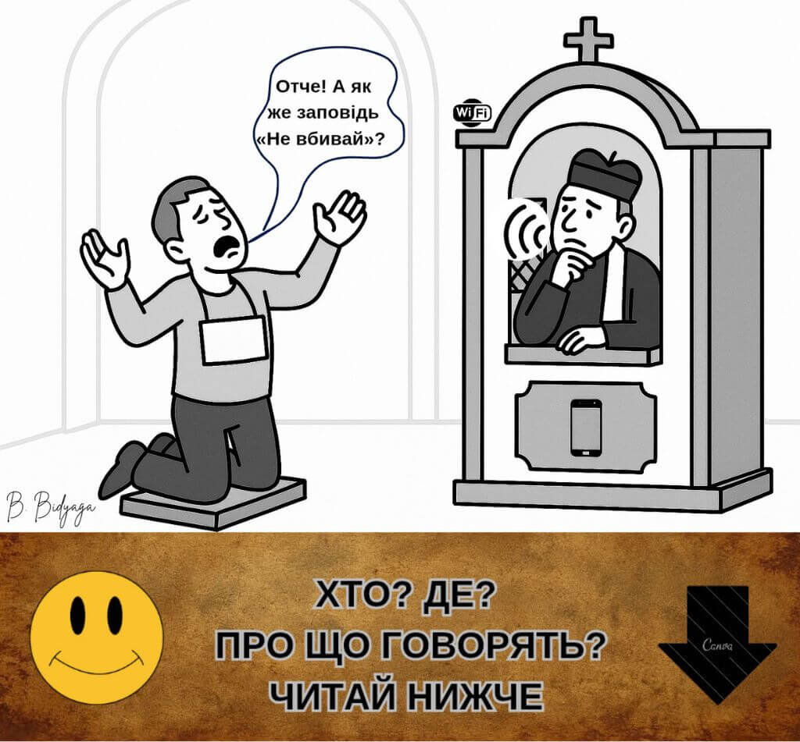
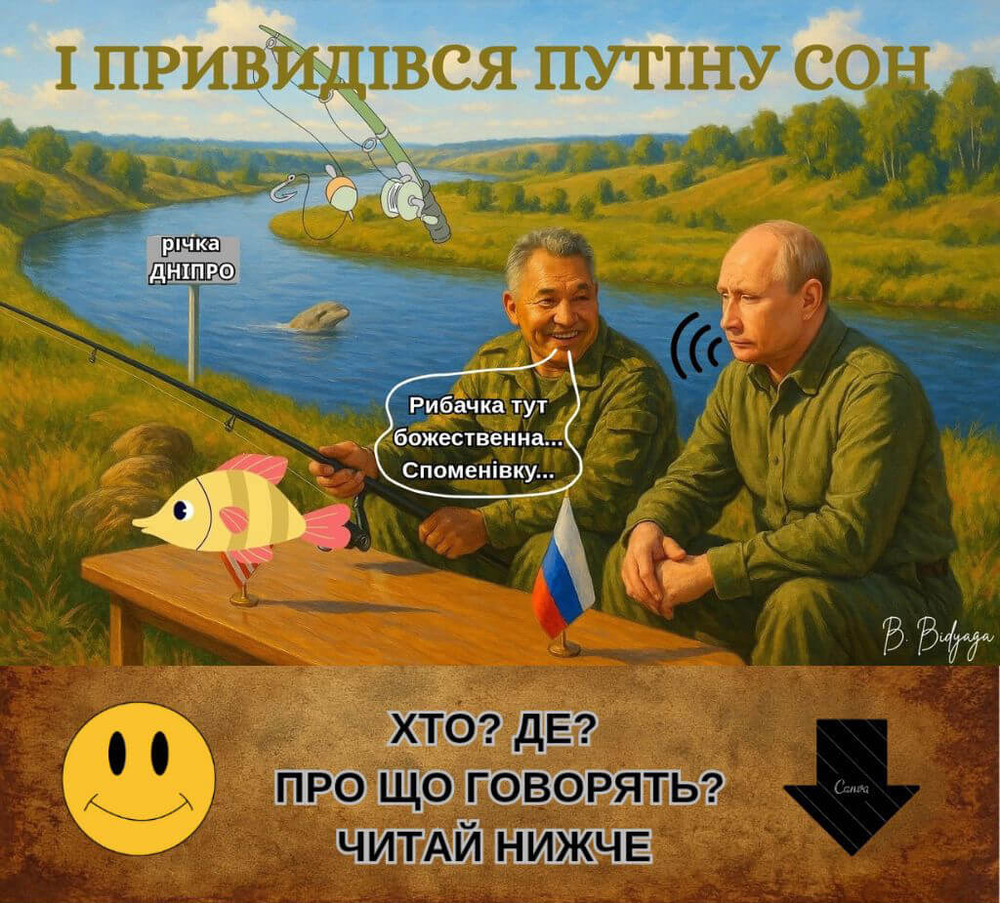
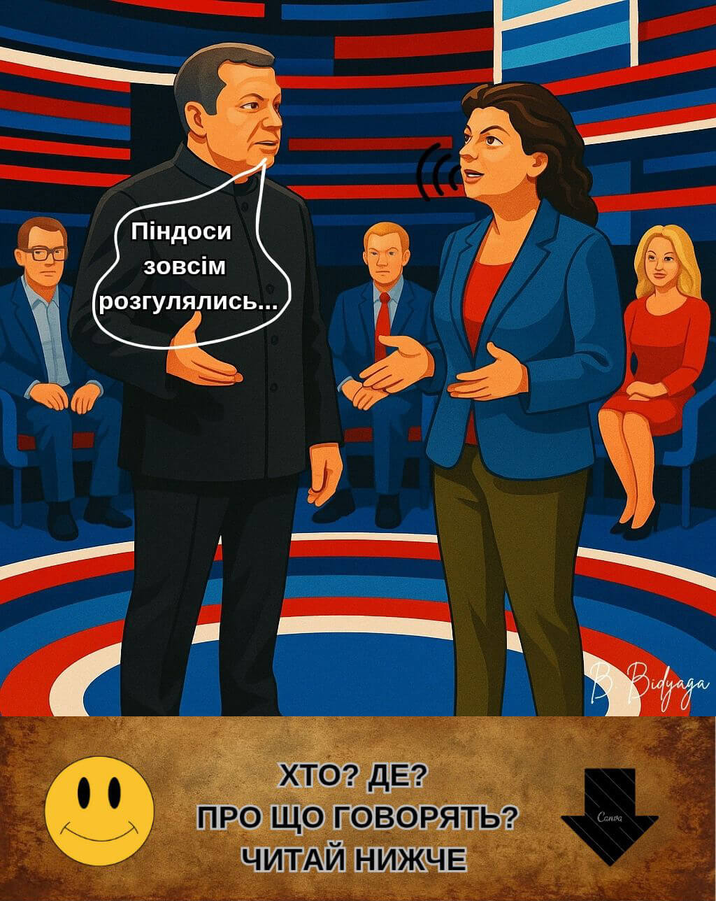
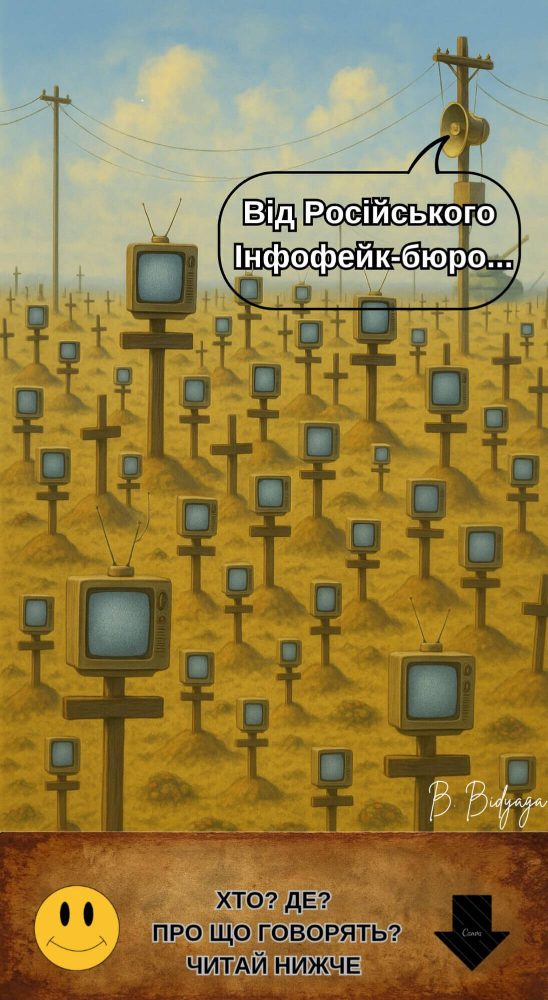
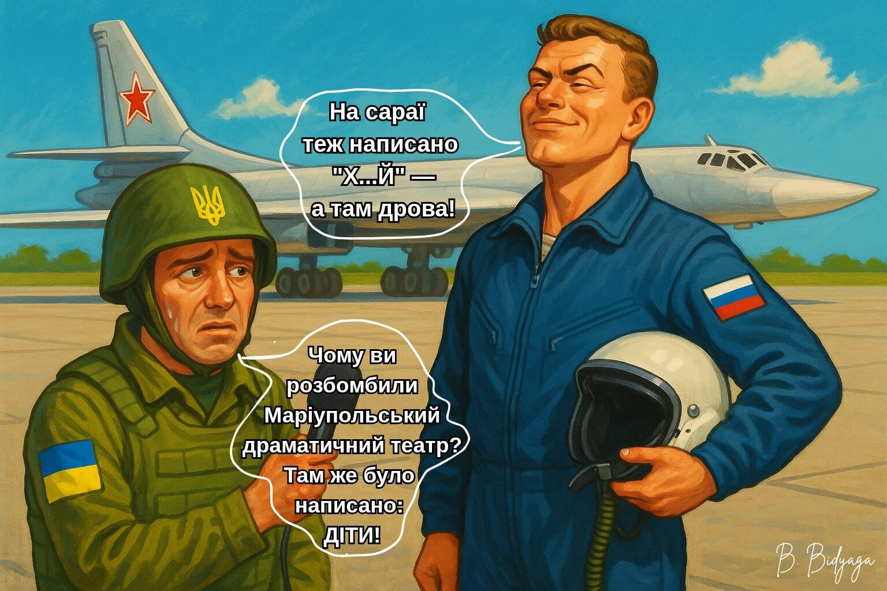
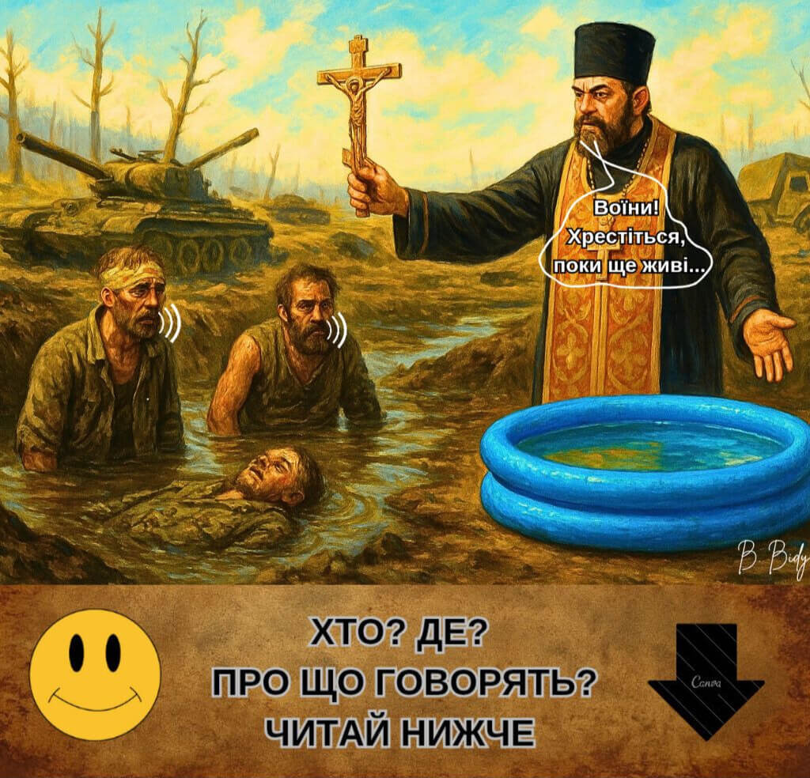
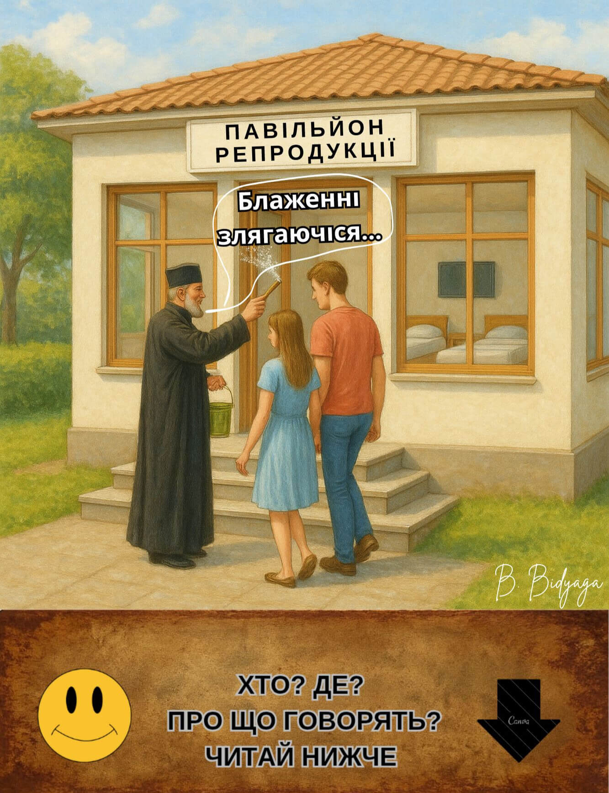
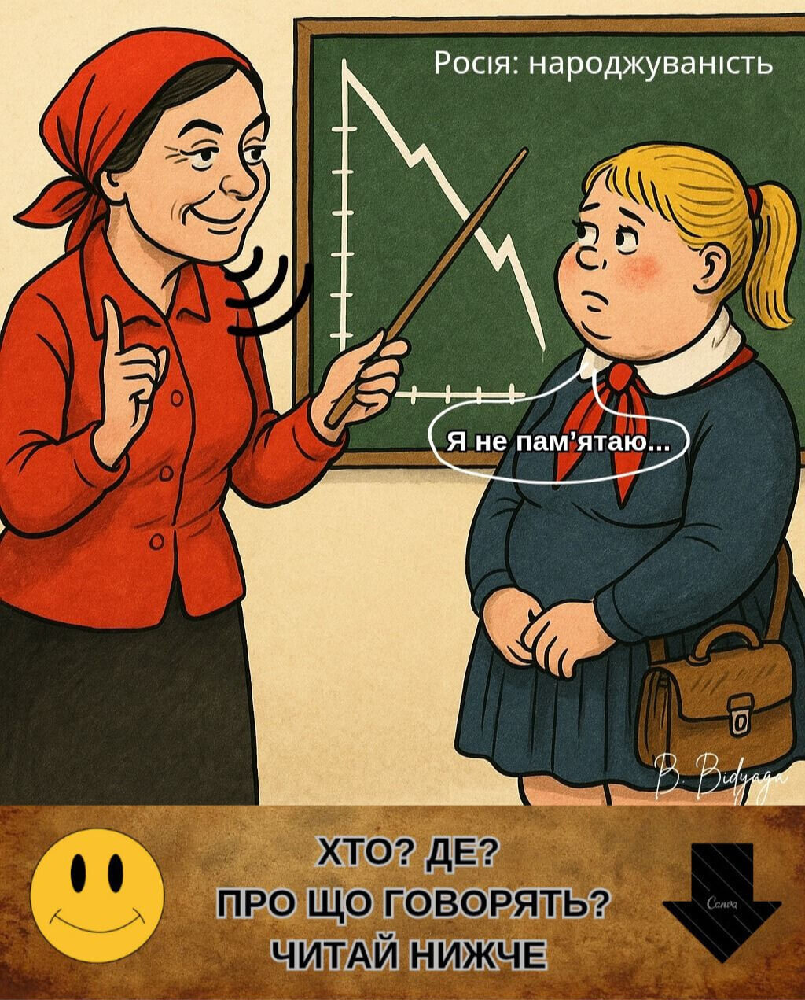
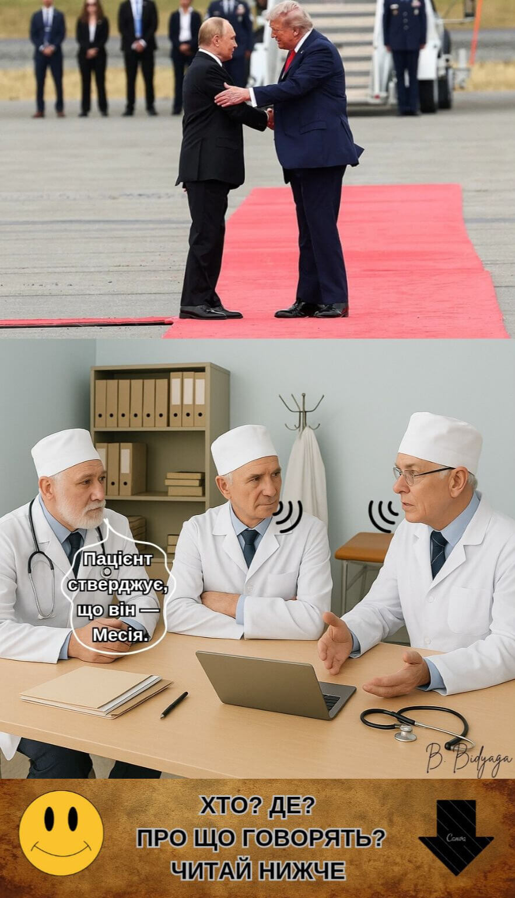

<meta name="robots" content="noindex, nofollow">

[**На головну сторінку**](index.md)

# ЗОЛОТА ДЮЖИНА
### ТОП-12 САТИРИЧНИХ МІНІАТЮР 

**Автор: Щеглова Ольга (Борис Бидяга)**

**Діагностичне передмово: Сатира як метод політичної аутопсії**

Традиційний політичний аналіз часто зазнає поразки, зіштовхуючись із **перформативним абсурдом** та **метафізичним цинізмом** сучасного російського режиму. Там, де раціональний дискурс досягає своєї межі, **клінічна сатира** стає необхідним діагностичним інструментом.

Цей проект — не літературна вправа. Це **систематична картографія політичного некрозу** — режиму, що еволюціонував від пострадянського авторитаризму до унікального гібрида: **Православного воєнного путінізму**. Ця ідеологія синтезує імперську ностальгію, спотворений кодекс релігійної моралі, гіпермодерні технології, а також повну зневагу до прав і свобод — у доктрину вічної війни: війни проти власних громадян, проти історичної правди та проти самої концепції об’єктивної реальності.

Представлене тут досьє «Золотої дюжини» розкриває чотири ключові патології цієї системи:

• **Біополітика розхідного матеріалу:** Концептуальна редукція населення — особливо молоді — від статусу громадян до **споживаних «біоресурсів»**, цінних лише своєю корисністю для утримання влади та розпалювання конфліктів.

• **Інженерія нереальності:** Ключова операційна технологія режиму — не просто пропаганда, а **інституціоналізований газлайтинг** — системна зброя абсурду, покликана зруйнувати критичне мислення та моральні судження.

• **Святотатство віри:** Стратегічна кооптація та мутація Російської Православної Церкви в **теологічне крило силової держави**, що дає сакральне благословення війні та репресіям.

• **Алгоритм хаосу:** Детальна схема того, як Кремль експортує не просто вплив, а **готове до встановлення «програмне забезпечення для автократії»** — пакет гібридних тактик, ідеологічних вірусів і корумпованих моделей управління, створений для дестабілізації та реплікації.

Нижче ви знайдете **«Золоту дюжину»** — дванадцять ключових діагностичних мініатюр. Вони слугують одночасно і введенням, і остаточним доказом обґрунтованості методу.

**ЗМІСТ**:

[1. Надновий Заповіт](Golden_ua#1-надновий-заповіт)

[2. Оновлення Християнства](Golden_ua#2-оновлення-християнства)

[3. Мрії про Дніпро](Golden_ua#3-мрії-про-дніпро)

[4. Тунгуський спецефект: можемо повторити!](Golden_ua#4-тунгуський-спецефект-можемо-повторити)

[5. БАДи пропаганди](Golden_ua#5-бади-пропаганди)

[6. "Розмови про важливе"](Golden_ua#6-розмови-про-важливе)

[7. На сараї теж дещо написано...](Golden_ua#7-на-сараї-теж-дещо-написано)

[8. Святе омовення в преисподній](Golden_ua#8-святе-омовення-в-преисподній)

[9. Блаженні копулюючі...](Golden_ua#9-блаженні-копулюючі)

[10. Атестат статевого дозрівання](Golden_ua#10-атестат-статевого-дозрівання)

[11. Саміт в Анкоріджі, Аляска](Golden_ua#11-саміт-в-анкоріджі-аляска)

[12. Геополітична пісочниця](Golden_ua#12-геополітична-пісочниця)

## 1. НАДНОВИЙ ЗАПОВІТ

1. Улюби Путіна твого всім серцем твоїм, всім розумінням твоїм, усією душею твоєю.  
2. Улюби ближнього твого: начальника, депутата, податкового інспектора.  
3. Не вбивай: державного діяча, співробітника правоохоронних органів.  
4. Не чини перелюбу у презервативі.  
5. Не свідчи ложно задля власної вигоди — тільки на благо Вітчизни.  
6. Не марнуй насіння даремно — роби дітей.  
7. Не кради — це прерогатива державного чиновника.  
8. Не шукай собі скарбів на землі — їх уже оприходували.  
9. Хто зносить на Володіна й Матвієнко — смерті достоїн.  
10. Не піддавайся диявольському спокусі в подобі іноагента та п’ятої колони. 
11. Блаженні донощики, бо їх є царство земне. Стукайте — і почутими будете.  
12. Люби Вітчизну — особливо на держзакупівлях.  
13. Утримуйся від сумнівів: віра в телебачення спасеть тебе.  
14. Уникай слів «Свобода» та «Мир», бо се є єресь.  
15. Не створюй собі кумира поза вертикаллю влади.  

Нехай перебуває з тобою лояльність — і не загинеш у темниці. 
*Із «Одкровення від Роскомнагляду», гол. 666.*

#ПравославнийВоєннийПутінізм
                                👻

## 2. ОНОВЛЕННЯ ХРИСТИЯНСТВА

Росія. У сповідальні православної церкви.

**Каючийся грішник:**

— Отче! А як же заповідь «Не вбивай»?  

**Священик:**

— Застаріла версія, сину!  Онови прошивку. Остання версія — "ukrainy.net"

#ПравославнийВоєннийПутінізм
                                👻

## 3. МРІЇ ПРО ДНІПРО 

Президенту Росії Володимиру Путіну сниться сон. Ніби він сам і міністр оборони Сергій Шойгу рибалять на Дніпрі в Україні.

**Шойгу:**

— Рибачка тут божественна... Споменівку... Наша річечка, давньоруська... Волга-матінка та Дніпро-батюшка — від них уся вода на Русі пішла... Як казав великий російський поет: «Чуден Дніпро при тихій погоді...» 

**Путін:**

— Так-так... Між іншим, тисячу років тому на цьому самому місці Князь Володимир спіймав гігантського Окуня вагою у 3 пуди! Про це є запис у «Повісті врем'яних літ»!  

(Путин прокидається. За вікном — мряка. Над Москвою-рікою стелиться гидкий сірий туман. Путін набирає номер Мединського.)

**Путін:**

— Володимире Ростиславовичу? Терміново внесіть Окуня у новий підручник історії! Так, того самого… Як символ… російської… великодержавності. І щоб з ілюстрацією!  

*Мединський В.Р. — офіційний «творець історії» від кремлівського режиму. Спеціалізується на міфотворчості та пошуку «історичних» виправдань для війни проти України.*

#ПравославнийВоєннийПутінізм
                                👻

## 4. ТУНГУСЬКИЙ СПЕЦЕФЕКТ: МОЖЕМО ПОВТОРИТИ!

Росія. Москва.
Студія відомого російського пропагандиста Володимира Соловйова.
Він веде бесіду з ще більш відомою пропагандисткою — Маргаритою Симон'ян.

**Соловйов:**

— Піндоси зовсім розгулялись: перестали нас боятись! Це ж мара!  

**Симон'ян:**

— Тоді треба їх налякати. Ось що ми зробимо: ядерні випробування у прямому ефірі! Підриваємо пару класних нейтронних бомбочок, середньої потужності. Просто два симпатичні грибочки-близнючки над Сибіром. Заощадимо на салюті до 9 Травня. Хай бачать, що ми тут усі буйні.
 
#ПравославнийВоєннийПутінізм 
                                👻

## 5. БАДИ ПРОПАГАНДИ

Біологічно активні інформаційні добавки.
Підвищують біодоступність держпропаганди до 100%.
Активні компоненти ефективно подолають гемато-енцефалічний бар'єр (критичного мислення).

**Лінійка препаратів:**

• Глюкофейконат Соловйова, таблетки 100-500 мг, тривалої дії. Не розжовувати!

• Сурогатна інфо-мікстура "Москва. Кремль. Путін", нормалізована.

• Бальзам "Симулякри християнства" з ароматом ненависті, для зовнішнього застосування. Умовно отруйний.

• Спиртова настойка "Традиційні цінності", багатокомпонентна. Каламутна суспензія з трупним запахом, міцністю 40%.

• Фактозамінник від Симон'ян, порошок для суспензії. Галюциногенний, зі смаком агресії.

• Ерзац-історії від Мединського, набір ін'єкцій в/м, 100-500 мг. Версії 1.0—10.0.

• Фальш-вісті від Кисельова, супозиторії суперніжні з ефектом ректально-інформаційного свербіння. 100-500 мг.

• Біфiлак-Iнфо, 100-500 мг. Препарат групи ферментів (біфідо-лакто-інфо-бактерії). Для ефективного перетравлення фейкової інформації, запобігання несварінню та закрепі.

**Фармакологічна дія:**

✓ Стимулятори лояльності: збуджують центри покірності та стадного інстинкту.

✓ Агоністи ненависті: стимулюють мигдалеподібне тіло (центр страху та агресії). Потенціює виробництво норадреналіну, спрямовуючи агресію на зовнішнього ворога, конструктивно знімаючи внутрішню соціальну напругу.

✓ Інгібітори аналізу: пригнічують активність префронтальної кори, відповідальної за критичне мислення та логіку.

✓ Блокатори емпатії: дезактивують острівкову частку і передню поясну кору, пригнічуючи всі форми емпатії та співпереживання.

Не є лікарським засобом.

**Стандартизований склад:**

~ Фейки 50%

~ Глюки 20%

~ Порожні мрії 10%

~ Самообман 5%

**Допоміжні речовини:**

Особисте життя президента США, зіркові плітки, погода в Африці, НЛО.

**Ароматизатори (на вибір):**

Великодержавний шовінізм, ультраправий націоналізм, ура-патріотизм, звичайний фашизм, сліпа ненависть, «Обама – мудло», «гнилий Захід», «священна війна».

**Прикрашувачі:**

"Цінності традиційні" відбірні, скріпи духовні посилені, «жити стало краще, жити стало веселіше», «радіоактивний попіл», «ми переможемо».

**Спосіб застосування та дозування:**

Добова доза розраховується за формулою:
IQ * 10 (мг). Максимальна добова доза — 1300 мг.

Рекомендовано щоденний прийом перед випуском вечірніх новин, телеефірами В. Соловйова та М. Симон'ян, підсумковою програмою Д. Кисельова «Вісті тижня», «прямою лінією» Путіна, брифінгами Д. Пескова та Міноборони РФ.

**З обережністю:**

Синдром гіперлояльності, сапіонедостатність. При гострих нападах здорового глузду, сумнівах у правильності держкурсу та інших формах резистентності до пропаганди рекомендована форма «Форте».

**Контроль життєвих показників:**

Рівень глюків не повинен перевищувати рівень глюкози.

**Побічні ефекти:**

Патріотичний делірій, славослівний пронос, нестримна блювота з вкрапленнями гасл.
У рідкісних випадках розвивається ідеологічний тромбоз, що призводить до гострої недостатності когнітивних функцій.
Допускається перехідний каламутний осад (у душі).
Щоб уникнути побічки, дозу збільшувати поступово! Не перевищувати дозування!

**Особливі вказівки.**

Приготування суспензії: взяти 1/2 склянки з будь-якого каламутного джерела, додати 1 чайну ложку порошку та перемішати. Увага: потрібне ретельне забовтування! Максимальна біодоступність досягається в стані контрольованого затупіння.

Не є ноотропами! Не покращують когнітивні функції, але приводять їх у відповідність до державної ідеології.
При випадковому потраплянні в організм незалежного журналіста чи правозахисника можуть викликати гостру алергічну реакцію.

**Термін придатності:**
не обмежений.

#ПравославнийВоєннийПутінізм
                                👻

## 6. "РОЗМОВИ ПРО ВАЖЛИВЕ"

Школа у російському місті.
Урок «Розмови про важливе».

**Вчителька:**

— А тепер, дітки, розкажіть, ким ви хочете стати, коли виростете.

**Толя:**

— Я стану льотчиком, бомбитиму ворожі міста.

**Маша:**

— А я — медсестрою, виноситиму поранених з поля бою.

**Гена:**

— А я стану генералом, сидітиму в штабі й віддаватиму накази.

**Вчителька:**

— А ти чого мовчиш, Іванку? Скажи нам, ким ти хочеш стати.

**Іванко (зі зітханням):**

— А я, Олено Петрівно, в психлікарні сидітиму. Подалі від цього дурдому.

#ПравославнийВоєннийПутінізм
                                👻

## 7. НА САРАЇ ТЕЖ ДЕЩО НАПИСАНО...

Російський військовий аеродром.  
Діалог російського льотчика з представником українських ЗМІ.

**Українець:**

— Чому ви розбомбили Маріупольський драматичний театр? Там же було написано: "ДІТИ!"

**Льотчик:**

— На сараї теж написано "Х...Й" — а там дрова!

#ПравославнийВоєннийПутінізм
                                👻

## 8. СВЯТЕ ОМОВЕННЯ В ПРЕИСПОДНІЙ

Російсько-український фронт. Російські позиції. Священик агітує солдатів охреститися в похідній «купелі».

**Священик:**

— Воїни! Хрестіться, поки ще живі! А то потрапите в пекло!

**Перший солдат:**

— Ми й так в пеклі.

**Другий солдат:**

— Давай! Погоджуйся! Хоч помиємося!

#ПравославнийВоєннийПутінізм
                                👻

## 9. БЛАЖЕННІ КОПУЛЮЮЧІ...

Росія. Москва. Зал засідань Держдуми РФ. З трибуни виступає депутат Валентина Бебиєнко:

– Шановні депутати! Президент поставив перед нами завдання відродити велику Росію – збільшити народжуваність утричі. Не приховую – завдання непросте. Складна задача. Надскладна. Але ми зобов'язані її виконати. Тому що цього хоче наш президент. Пропоную підійти до вирішення проблеми креативно. Зрозуміло, наша таргетна аудиторія – це молодь. До 30. Після 30 впливати на свідомість уже не так просто. Ментальні патерни вже сформовані, спостерігається резистентність до держнаративу.

А тепер давайте згадаємо наше з вами сумне дитинство. Як ми задовольняли свої... потреби – цілком законні пориви пубертатного періоду? Потай, нишком, у темних під'їздах на брудних підвіконнях, у сирих підвалах, на запилених горищах, та й просто, прости Господи, у парку за кущем. І весь час у напрузі: а раптом побачать? А раптом сусіди нажаляться? А якщо, не дай Боже, тебе спіймали – тягнуть у міліцію, складають протокол, дзвонять батькам. Одним словом – ганьба на все життя, що залишилося. Це неправильно, товариші. Це суперечить державній політиці в галузі демографії. Виправимо цей перекіс. Дамо нашим дітям та онукам щасливе дитинство. Як колись на кожному розі стояла телефонна будка – так тепер на її місці стоятиме гарний та охайний «павільйон репродукції». З камерами спостереження для розпізнавання обличь – будемо нараховувати учасникам соціальні бонуси на «Держпослугах». Усередині – простора кімната на 4 двоспальні ліжка, великий телевізор на стіні. Фільмотека з надихаючими роликами та серіалами. Шкафчик з Віаґрою та аксесуарами. Усе культурно, чисто та привабливо – від веселих шпалер на стінах до постільної білизни з жвавим малюнком. А на сходах замість швейцара – батюшка, що окроплює відвідувачів святою водою, та ще й з благословенням: «Блаженні копулюючi... іменем Отця і Сина, і Святого Духа... згідно з Указом Президента №666...»

А через дев’ять місяців система в автоматичному режимі проведе оцінку ефективності. У разі підтвердження факту народження дитини батькам нараховується одноразова виплата. У випадку народження хлопчика сума виплати подвоюється — відповідно до державної програми мілітаризації демографічної політики.

#ПравославнийВоєннийПутінізм
                                👻

## 10. АТЕСТАТ СТАТЕВОГО ДОЗРІВАННЯ

  

У російському місті в школі на уроці сімейознавства.
На дошці — графік динаміки народжуваності в Росії.  

**Учениця:**

— Я не пам’ятаю...

**Вчителька:**

— Не вивчила урок? Не біда! Іди, доню, народжуй — отримаєш супероцінку!
Якщо народиш двійню — зарахуємо як практикум з анатомії.  
Трійня — дострокове отримання атестата зрілості. До школи ходити більше не доведеться.  

#ПравославнийВоєннийПутінізм
                                👻

## 11. САМІТ В АНКОРІДЖІ, АЛЯСКА

Консиліум у психіатричній лікарні. В кабінеті за столом — троє поважних професорів.

**Перший професор**:

— Пацієнт стверджує, що він — Месія.

**Другий професор**:

— Що?! Месія?! Учора ж був Гітлер!

**Третій професор**:

— Сьогодні в нього нова мета: «Врятувати братній український народ».

**Перший професор**:

— І як він збирається це зробити?

**Другий професор**:

— Як завжди: бомбардування, убивства, викрадення.

**Третій професор**:

— Параноїдальне геополітичне марення з мани́єю величі.

**Перший професор**:

— Марення... рудої кобили під місячним світлом.

**Другий професор**:

— Колеги, досить лірики. Це специфічний розлад особистості.

**Третій професор**:

— А ще плаче й каже: «Україна — біль і трагедія для нас».

**Перший професор**:

— І постійно повторює про якісь «першопричини конфлікту», які «треба усунути».

**Другий професор**:

— І кожні п’ять хвилин істерично вигукує: «Хочу увесь Донбас!»

**Третій професор**:

— А в іншому — веселий, бадьорий, активний, цими днями зустрічався із цим... персонажем… у червоній кепці…

**Перший професор**:

— А-а, сумнозвісний «пожежник», що одним поглядом зупиняє військові конфлікти?

**Другий професор**:

— Це він. Цілих 11 секунд тиснули одне одному руки, потім походжали червоною доріжкою, безсоромно фліртували й підморгували.

**Третій професор**:

— Два чоботи — пара, Господи прости! Один марить Донбасом, інший — Нобелівкою.

**Перший професор**:

— Так, панове. Марнославство — річ небезпечна. Може закінчитися психополітичним розладом.

**Другий професор**:

— Колеги! Мені здається, є конфлікт інтересів. До добра це не призведе.

**Третій професор**:

— Для України — точно.

**Перший професор**:

— Ви маєте рацію. Необхідно вжити заходів.

**Другий професор**:

— Пропоную значно підвищити дозу галоперидолу. Перорально і внутрішньом’язово.

**Третій професор**:

— Варто також призначити пацієнтові заспокійливі чорноземні ванни під аудіозапис із криками "Крим наш!"

**Перший професор**:

— А чому б не спробувати електрошок? Чудово діє при специфічних розладах. МОЗ уже дав зелене світло.

**Другий професор** (з пафосом):

— МОЗ попереджає... Будеш викаблучуватися – отримаєш три тисячі вольт у дупу.

#ПравославнийВоєннийПутінізм
                                👻

## 12. ГЕОПОЛІТИЧНА ПІСОЧНИЦЯ

*Незакінчена міні-п'єса*

Семеро хлопчиків граються у Пісочниці:
Хуліган, Єврей та ще п'ятеро. Кожен хлопчик — особливий, у кожного на голові унікальний головний убір: червона кепка, біла кепка, панама, кашкет, капелюх.

**ДІЯ 1**

**Хлопчики в Пісочниці**

**Капелюх:**

— А у нас новина! Хуліган знову затіяв бійку.

**Біла кепка:**

— З ким цього разу?

**Капелюх:**

— Єврей.

**Біла кепка (суворо):**

— Хуліган, негайно припини! Неприпустимо порушувати в Пісочниці порядок!

**Хуліган:**

— А ти хто такий, щоб мені наказувати?

**Біла кепка:**

— Я — староста Пісочниці. Я — моральний авторитет.

**Хуліган:**

— А я — кримінальний Авторитет. Мені наплювати на ваші порядки. У мене особливий шлях і особливі моральні цінності.

**Кашкет (обережно):**

— Та через що бійка-то? Що не поділили?

**Хуліган:**

— Він захопив мою землю!

**Біла кепка:**

— З яких це пір вона твоя?

**Хуліган:**

— Завжди була моя. Там прах мого прадіда!

**Капелюх:**

— Але ми ж домовилися про недоторканність кордонів! Твій дядько Борис поставив свій підпис!

**Хуліган:**

— Борис був дурень і алкоголік. Через це угода оголошується недійсною! Це моя земля. Кінець дискусії.

(Хуліган підходить до Єврея і б'є його кулаком у груди.)

**Єврей:**

— Допоможіть! Вбивають!

**Капелюх:**

— Тримайся, малюк! Зараз приймемо резолюцію. Перше. Ми повністю засуджуємо цю агресію!

**Панама:**

— Друге. Ми визнаємо законне право Єврея захищати свою територію будь-якими засобами.

**Кашкет:**

— Третє. Ми закликаємо Хулігана дотримуватися встановленого порядку і негайно припинити конфлікт.

**Біла кепка:**

— Може, таки надамо йому допомогу?

**Хуліган (робить страшне обличчя):**

— Тільки спробуй! Отримаєш у око!

**Капелюх:**

— Такі заяви неприпустимі! Особисто в мене вони викликають занепокоєння.

**Кашкет:**

— І стурбованість.

**Панама:**

— Хлопці, з ним треба бути  обережніше. Не забувайте: у нього є бульдозер.

**Хуліган:**

— Ось саме! Пригоню бульдозер і рознесу всю Пісочницю на друзки!!

(Завдає Єврею ще один удар.)

**Єврей (пошепки):**

— Вбивають!

**Капелюх:**

— Моє занепокоєння значно посилилося.

**Кашкет:**

— Моя стурбованість зростає експоненційно.

**Біла кепка:**

— Я чув, що цей його горезвісний бульдозер увесь проржавів і не заводиться.

**Панама (з сумнівом у голосі):**

— Ми точно не знаємо, а раптом він його полагодив і встановив нові свічки?

**Капелюх:**

— Треба виявляти обачність. Не будемо його дратувати.

**Панама:**

— Та ж ясно: як тільки він прикінчить Єврея, він нападе на нас з вами!

**Кашкет:**

— Я, звісно, від нього трохи далі, і через протоку, але все одно колінки тремтять від страху. Давайте ось що: будемо Єврею допомагати, але по трохи і таємно. Тоді Хуліган нічого не помітить.

**Панама:**

— Головне — не давати занадто багато. Якщо Хуліган почне втрачати позиції, він розлютиться. І тоді вже точно прижене свій бульдозер і зрівняє з землею всю Пісочницю.

**Капелюх:**

— Правильно. Нехай б’ються. Поки Хуліган зайнятий цією бійкою, ми можемо спати на обидва вуха.

**Біла кепка:**

— Чудовий план. Так і зробимо.

**Дія 2**

**Новий староста**

До Пісочниці підходить хлопчик у червоній кепці та з ключкою для гольфу в руці.

**Червона кепка:**

— Ну, що тут у вас? Влаштували бардак. Це все через тебе, старий шкаре. Пшол геть із Пісочниці! Твій час минув. Тепер я тут головний.

**Біла кепка:**

— Гаразд. Я йду. Зробив усе, що міг. Удачі тобі з цим конфліктом.

**Червона кепка:** 

— Я прийшов не за цим, я прийшов за своєю Золотою медаллю Миротворця. А ти зі своїми ідіотськими указами тільки роздмухував цю гризню. Я тут, щоб її припинити. Ти — нездара, я — геній. У цьому вся різниця. Зникни з моїх очей.

**Єврей**: 

— Ти ж допоможеш мені, правда? Ти — моя єдина надія.

**Червона кепка (суворо):** 

— Скільки хлопців полягло! Красенів, героїв! І все — через тебе. Нащо ти дозволив втягнути себе в цей конфлікт?

**Єврей**: 

— Я?! Та це він перший почав!

**Червона кепка:** 

— А ти що, не бачив, що він у тисячу разів сильніший? Нормальна людина не лізе в бійку з тими, хто за неї міцніший. Треба було одразу домовлятися, а не доводити до біди.

**Єврей**: 

— Але я не міг віддати йому свою землю! Моя конституція це забороняє.

**Червона кепка:** 

— Не плети мені нісенітниць! У тебе на руках немає жодної карти. Що не віддав учора — віддаси сьогодні. Не віддаси сьогодні — віддаси за рік. Результат той самий. Тільки ще пів мільйона гарних хлопців гнитимуть у могилах.

**Єврей**: 

— Це ж несправедливо! Ти б краще допоміг мені його приструнити.

**Червона кепка (з презирством):** 

— Старий тобі скільки бабла відвалив? Мільярди. А ти навіть «дякую» не бовкнув. Тільки клянчиш і клянчиш. І взагалі — де воно все? Куди поділися ці мільярди?

**Єврей**: 

— Мені соромно казати, але їх трохи розікрали. Так уже вийшло. Я не винен!!!

**Червона кепка:** 

— Усі ці мільярди ти мені винен. Я чув, на твоїй ділянці знайшли поклади рідкісноземельних металів? Відтепер вони — мої.

**Єврей (збуджено):** 

— Це грабіж!

**Червона кепка:** 

— А ти що думав, у каруселі задарма катають? Так справи не робляться. Підписуй тут.

**Єврей:** 

— Але я не маю повноважень. Треба згода парламенту...

**Червона кепка:** 

— Ах, от ти як! Гей, Стіве, дзвони хлопцям — нехай перекриють наші розвіддані.

**Єврей (у розпачі):** 

— Тільки не розвіддані! Благаю!

**Червона кепка:** 

— Ну, підписуєш чи ні?

**Єврей (пригнічено):**

— Підписую.

**ДІЯ 3**

**Ті ж самі особи**

**Червона кепка:**

— Отже, відкриваємо мирний процес. Я вимагаю припинити цю гризню. Хулігане, викладай умови.

**Хуліган**: 

— Він віддає мені два регіони. Половину своїх солдатиків — на смітник. І щоб ніяких військових блоків.

**Червона кепка:** 

— Хм... Розумно. Єврей, ти згоден?

**Єврей**: 

— Тільки через мій труп.

**Хуліган (зі злісною посмішкою):** 

— Це ми можемо влаштувати.

**Червона кепка:**

— Припиніть ваші жарти!
Єврей, у чому справа?

**Єврей:**

— Він хоче, щоб я віддав йому землю без бою. Це ж нонсенс! У військовій історії немає таких прецедентів.  

**Червона кепка:**

— Навіщо тобі стільки землі? У тебе половина населення емігрувала.

**Єврей:**

— Я не можу. Суспільство проти добровільної здачі територій.

**Червона кепка:**

— Гей, Стів! Притримай наші розвіддані!

**Єврей (поспішно):**

— Добре, добре. Я згоден, але вимагаю ретельного опрацювання деталей.

**Червона кепка:**

— Щодо солдатиків? І відмови від військових блоків?

**Єврей:**

— У цьому випадку мені потрібні тверді гарантії безпеки — на випадок, якщо Хуліган знову зазіхне на мої землі. Хто мене захистить? І яким чином?

**Червона кепка:**

— Гарантії я даю тобі особисто: у разі повторної агресії ми... щось придумаємо. Гарантія — 100%.

**ДІЯ 4**

**Ті ж самі особи**

**Червона кепка:**

— Я зробив усе можливе, щоб помирити цих забіяк. Але з якоїсь дивної причини мирний процес стоїть на мертвій точці.

**Кашкет**: 

— Ти найкращий переговірник — жорсткий, але чесний. Можна я зватиму тебе «Татом»?

**Капелюх**: 

— Ідеальне прізвисько! Тату! Ми в захваті від твого дипломатичного хисту! Але якось воно дивно: ти тиснеш на Єврея, а забаганки Хулігана повністю підтримуєш.

**Панама**: 

— Таточку! Ми б радили притиснути також і Хулігана — наприклад, дав би ти Євреєві зброю. Ти ж обіцяв! Але чомусь не даєш...

**Капелюх**: 

— Мабуть, Таточко просто злякався хуліганського бульдозера.

**Червона кепка:** 

— Бульдозер — це блеф. Він нас на понт бере. Я його не боюся. Я боюся тільки, щоб він не підкрався ззаду, не облив мені штани бензином і не підніс сірника.

(Капелюх, Кашкет і Панама багатозначно переглядаються і нервово хихикають.)

**Червона кепка:**

— Чого смієтеся? Ваші штани вразливі перед ним не менше, ніж мої! Тому раджу добре подумати, перш ніж давати Єврею зброю. Особисто я умиваю руки.

**Кашкет:**

— Ну тоді ти міг би ввести проти Хулігана вторинні санкції.

**Червона кепка:**

— Санкції — це спірне питання. По-перше, я не хочу відлякувати його від переговорів. Зараз Хуліган йде мені назустріч, і це потрібно цінувати. А по-друге, у нього найбільші в світі запаси рідкісноземельних металів. Навіщо мені з ним сваритися, якщо я маю намір, після укладення миру, торгувати і спільно освоювати ці унікальні родовища? І взагалі: мої особисті добрі стосунки з Хуліганом — це запорука майбутнього миру в Пісочниці.

(Пауза.)

**Червона кепка:**

— А ви троє — до вас у мене серйозна розмова! Ви що собі думаєте? Що я прибіжу вас рятувати, коли Хуліган вчепиться вам у горло? Навіть не сподівайтеся. Досить сидіти у мене на шиї! Ви вже дорослі хлопці, вчіться битися самі. Витрати на оборону — 5 відсотків від вашого ВВП. Це наказ! І припиніть цю ідіотську імміграцію! Погляньте в дзеркало — ви ж у повній деградації! Куди поділася ваша аристократичність, мораль, віра? Ви самі знищуєте свою ідентичність.  Якщо так триватиме далі — нашій дружбі кінець!

**Дія 5**

**Ті ж самі особи**

**Червона кепка:**

— Отже, резюмую. Тринадцятий раунд переговорів саботував Єврей, чия поведінка змусила мене вишвирнути його з Овального кабінету. Чотирнадцятий раунд зірвав Хуліган, бо, бачите, його «Борт номер один» заблукав у хмарах.

**Хуліган**: 

— Щира правда — Єврей мені всю навігацію заглушив!

**Червона кепка:** 

— Проїхали! Призначаю наступний раунд. І щоб без фокусів! Наступний четвер.

**Єврей**: 

— Не можу, у мене Шабат.

**Червона кепка:** 

— Тоді п'ятниця. 

**Хуліган:** 

— У п'ятницю Христа розіп’яли. 

**Червона кепка:** 

— Тоді вихідні або понеділок... 

**Хуліган:**

— У мене триденна жалоба в країні...

**Червона кепка (лютує):** 

— Тоді зараз! Негайно! Сідайте і миріться! 

(Червона кепка дістає з-за спини складаний столик і стільці.) 

**Червона кепка:**

— Прошу, сідайте!

**Хуліган:** 

— Оце так! Мій стілець зник. Це прямий саботаж! Я стоячи не домовляюся! 

**Єврей:** 

— А у мого ніжка зламана! Це знову витівки Хулігана!

**Червона кепка (втомлено, з виразом мученика):** 

— П'ятнадцятий раунд закінчено. Діалог був продуктивним, хоч і непростим. З нетерпінням чекаємо наступної зустрічі. Є великі шанси домовитися до Дня Подяки.

#ПравославнийВоєннийПутінізм
                                👻
                                                                
 

[**Перелік благодійних фондів на допомогу Україні**](ua_funds)

[**На головну сторінку**](index.md)

