<meta name="robots" content="noindex, nofollow">

[**Main page**](index.md)

# WARD №666
### THE GRAND ALBUM OF SATIRICAL MINIATURES 

**Author: Shcheglova Olga (Boris Bidyaga)**

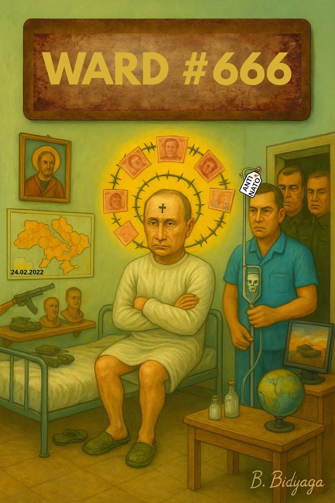

### INTRODUCTION
What lies before you is not just a collection of caricatures. It is an anatomical cross-section of the Putin era: Orthodox military Putinism as a form of collective madness.
Here you will find icons with pagan gods, baptisms in trenches, holy water — administered intramuscularly. Here patriotism comes with a sock on the genitals, and the Pentagon’s combat dolphins swim freely.
In these miniatures, society appears as one where war has replaced common sense, “traditional values” have replaced conscience, and Orthodoxy has become the “lubricant” for missile launchers. Priests bless violence, deputies trade in patriotism, and schools teach not to think, but to give birth and obey.  

## 1. PATRIOTISM WITH SOCK ON DICK

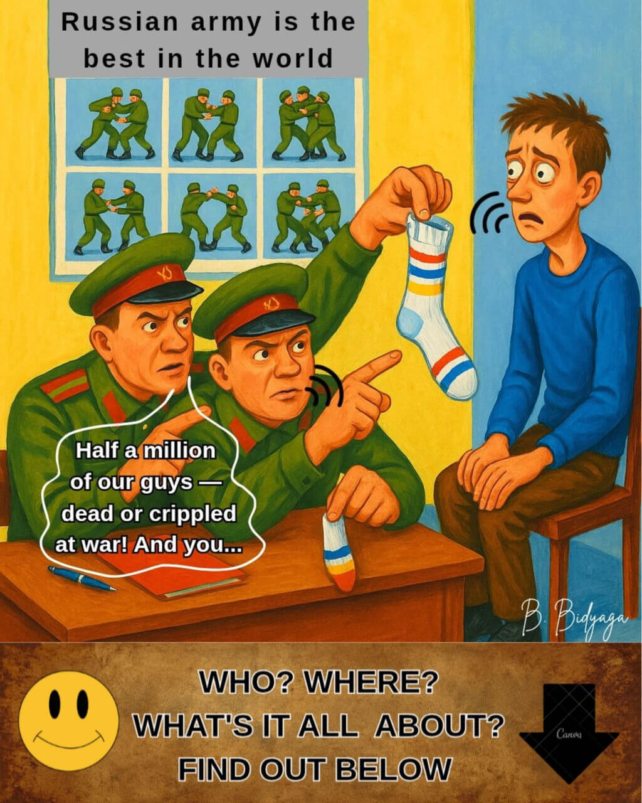

Military enlistment office, Russian town.
Two officers at desk, facing pop singer.

**First officer:**

— Half a million of our guys — dead or crippled at war! And you — enjoying yourself with a sock on your dick at some "naked" party?!

**Singer:**

— Guilty! Tomorrow I’m going to Bakhmut… with a concert!

**Second officer:**

— That’s right! Tomorrow you are heading to Bakhmut. As an assault trooper!

#OrthodoxMilitaryPutinism
                              👻

## 2. VICTORY TRASH: TURN IN YOUR CANS! EVERY TIN LIGHTS THE WAY!

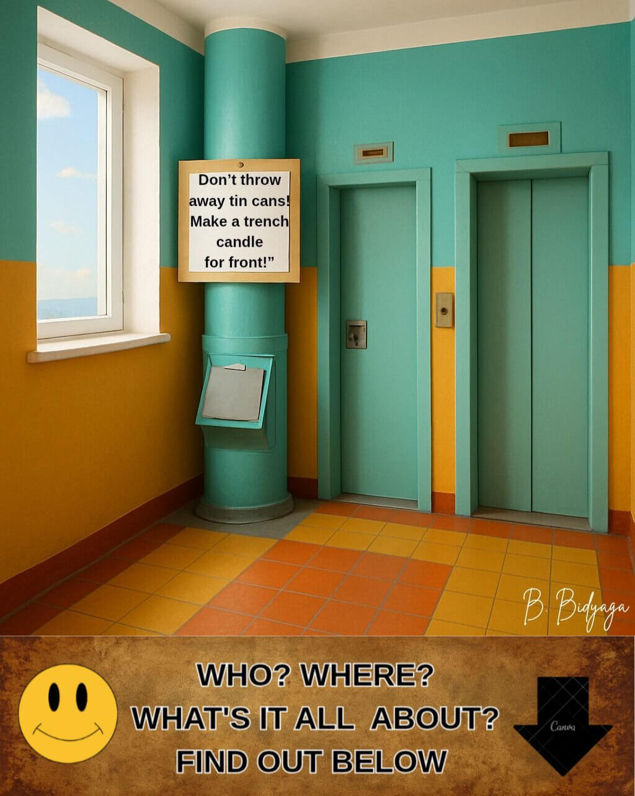

Russia.Typical Moscow apartment block, elevator hall.
Sign on garbage chute:
*“Don’t throw away tin cans! Make a trench candle for front!”*

#OrthodoxMilitaryPutinism
                                👻

## 3. FSB HANDBOOK: DISABLED PERSON + POTASSIUM PERMANGANATE = UKRAINIAN SABOTEUR

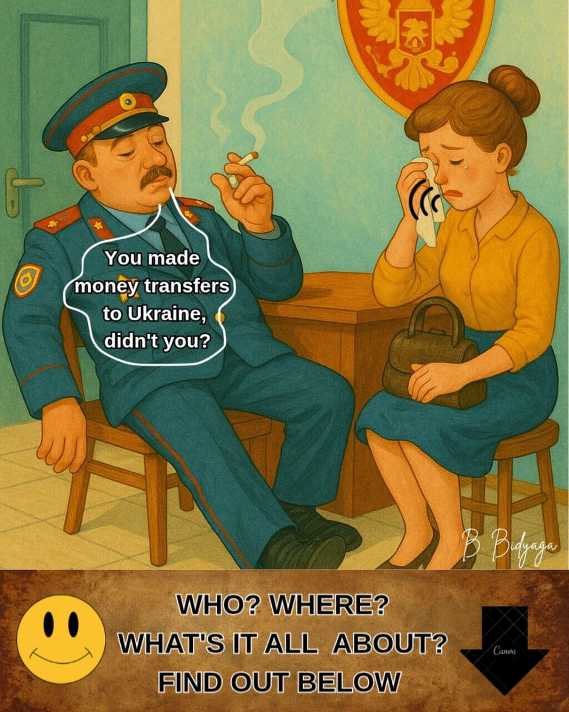

Provincial Russian city, police station.
Officer interrogates woman.

**Officer:**

— You made money transfers to Ukraine, didn't you?

**Woman:**

— Yes, I sent $50 to my brother in Kyiv. He’s disabled, completely helpless, he needs medicine...

**Officer:**

— Congratulations, madam — you’ve just earned yourself a charge. Article 275. Familiar? Financing the Armed Forces of Ukraine. High treason!

#OrthodoxMilitaryPutinism
                                👻

## 4. PRIVATIZATION OF RUINS

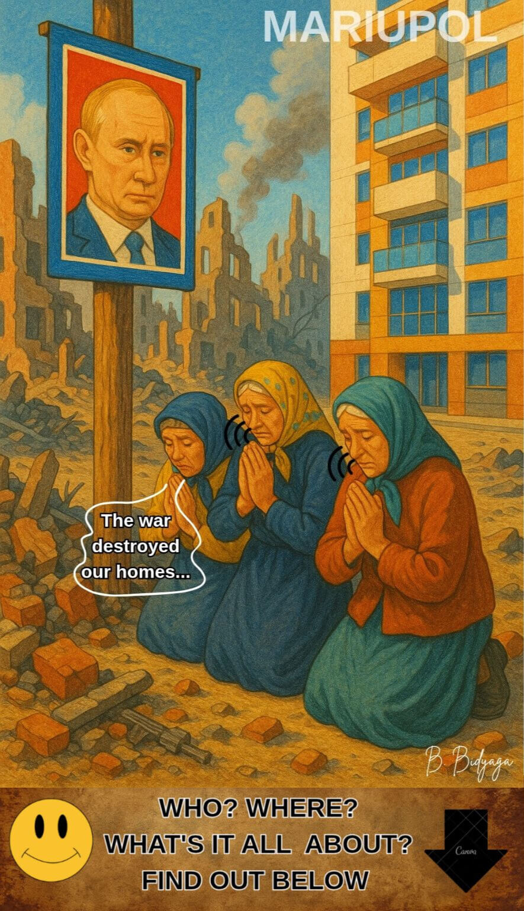

Destroyed Ukrainian city of Mariupol.
Three women pray to portrait of Russian president Vladimir Putin before new apartment block.

**First woman:**

— The war destroyed our homes. We sleep on the street.

**Second woman:**

— They built a new building, but the apartments are for sale.

**Third woman:**

— We can’t buy housing — we’re beggars now. 

**All three women, in chorus** (desperately):

— Putin, help us!

#OrthodoxMilitaryPutinism
                                👻

## 5. TUNGUSKA SPECIAL EFFECT: WE CAN DO IT AGAIN!

Russia. Moscow. Studio of famous Russian propagandist Vladimir Solovyov, on air. He talks with even more famous propagandist — Margarita Simonyan.

**Solovyov:**

— The Yanks have gone too far. They no longer fear us! Outrageous!

**Simonyan:**

— Then we have to scare them. Here's what we'll do: a spectacular nuclear test broadcast live on TV! We'll detonate a couple of cool neutron bombs, you know, medium yield. Just two pretty twin mushrooms over Siberia. Saving money, by the way, on the fireworks for Victory Day. Just to remind whoever forgot it:  we're all nuts here!

#OrthodoxMilitaryPutinism
                                👻

## 6. BOOT AS DEMARCATION TOOL

 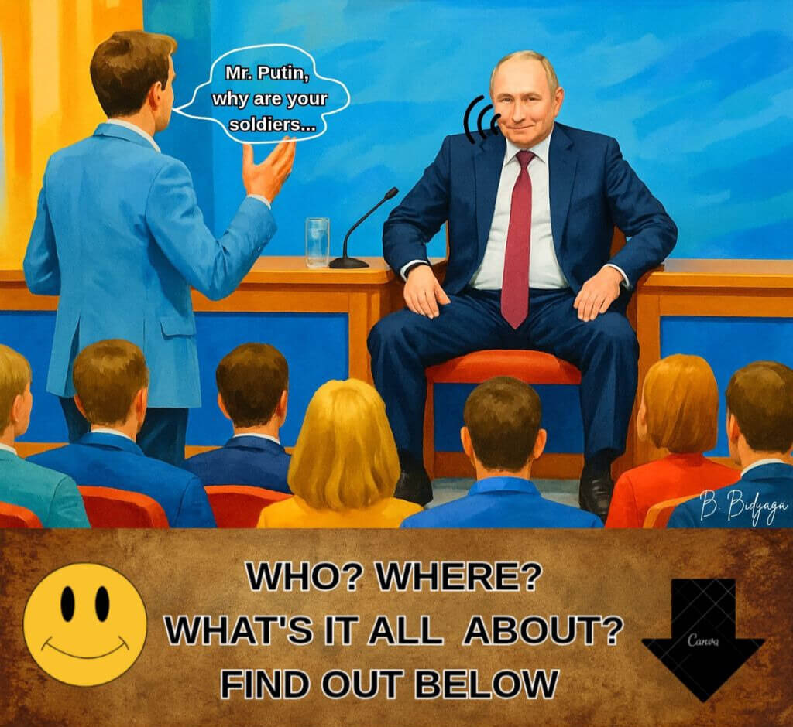

Press conference with Russian president Vladimir Putin.
Foreign journalist asks question.

**Journalist:**

— Mr. Putin, why are your soldiers “defending the motherland” on the territory of another country?

**Putin:**

— That’s an optical illusion. Remember the rule: wherever a Russian soldier’s boot steps — that’s Russian territory. According to Russian international law.

#OrthodoxMilitaryPutinism
                                👻

## 7. PRIORITIES: OPTIMIZATION THROUGH AMPUTATION

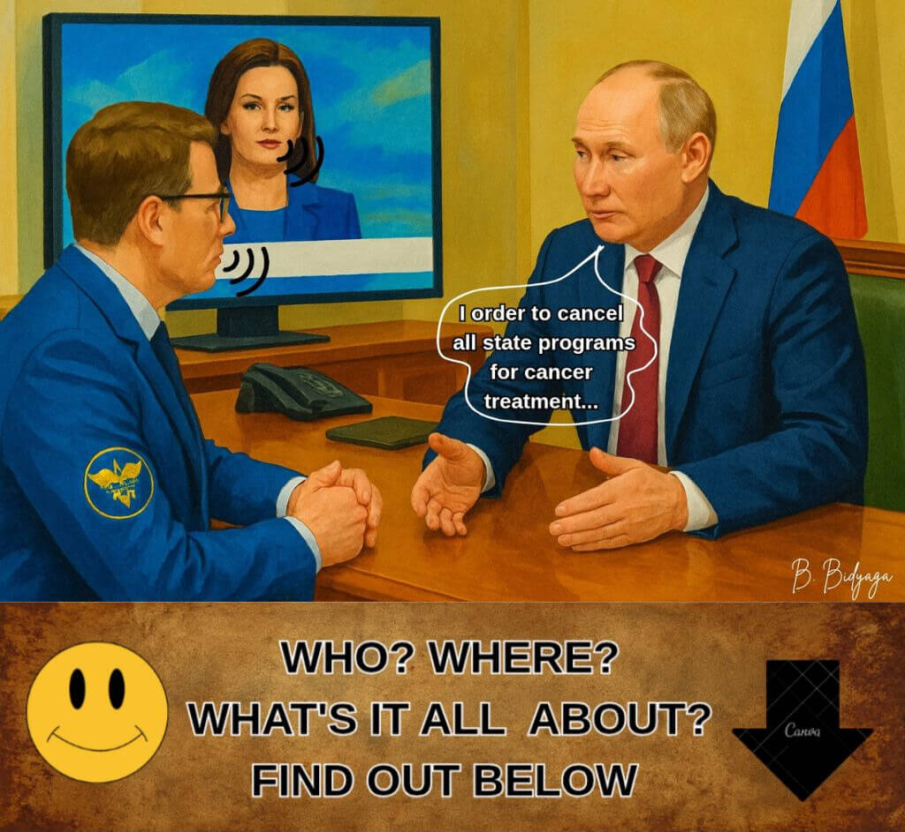

Russia, Moscow, the Kremlin.
Russian president Vladimir Putin and Health Minister Michael Murashko at table.
TV news report: new budget increases healthcare spending 30%.

**Putin:**

— I order to cancel all state programs for cancer treatment and free drug distribution. Redirect the funds to prosthetics production and warrior rehabilitation.

**Murashko:**

— As you command.

#OrthodoxMilitaryPutinism
                                👻

## 8. WAR NETWORKS, PUTIN’S SURROGATES

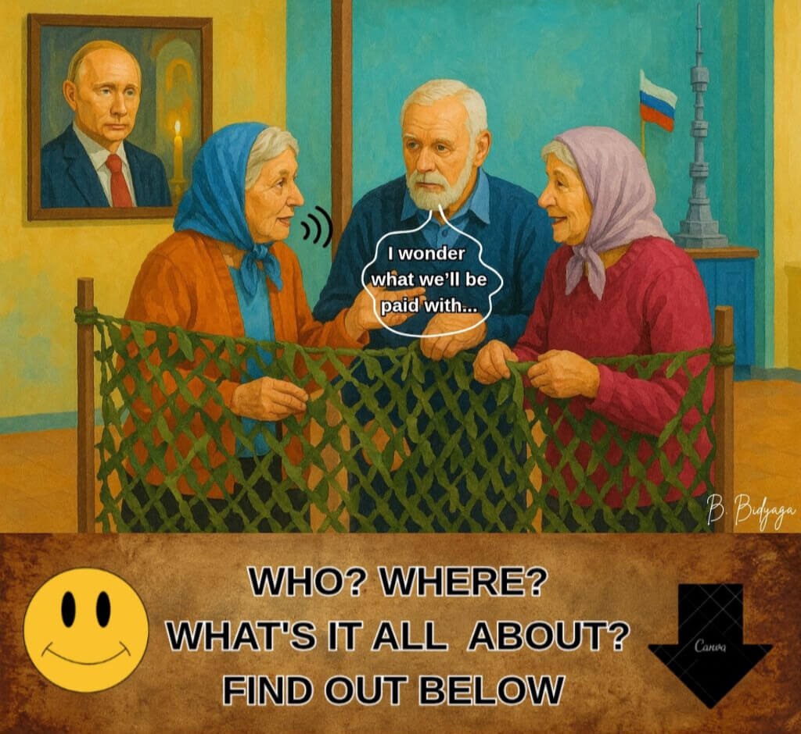

Russia, Moscow leisure center for pensioners. Two old ladies and man weave camouflage net for front.

**Old man:**

— I wonder what we’ll be paid with today?

**First old lady:**

— Looks like they’ll hand out those “Putin's with us” chocolate bars again.

**Second old lady:**

— That’s not chocolate! It’s just soy!

**Old man:**

— Same story: first they promise chocolate, then they slip us Putin instead!

#OrthodoxMilitaryPutinism
                                👻

## 9. ASYMMETRICAL RESPONSE (“YOU CAN’T PROVE ANYTHING ANYWAY”.)

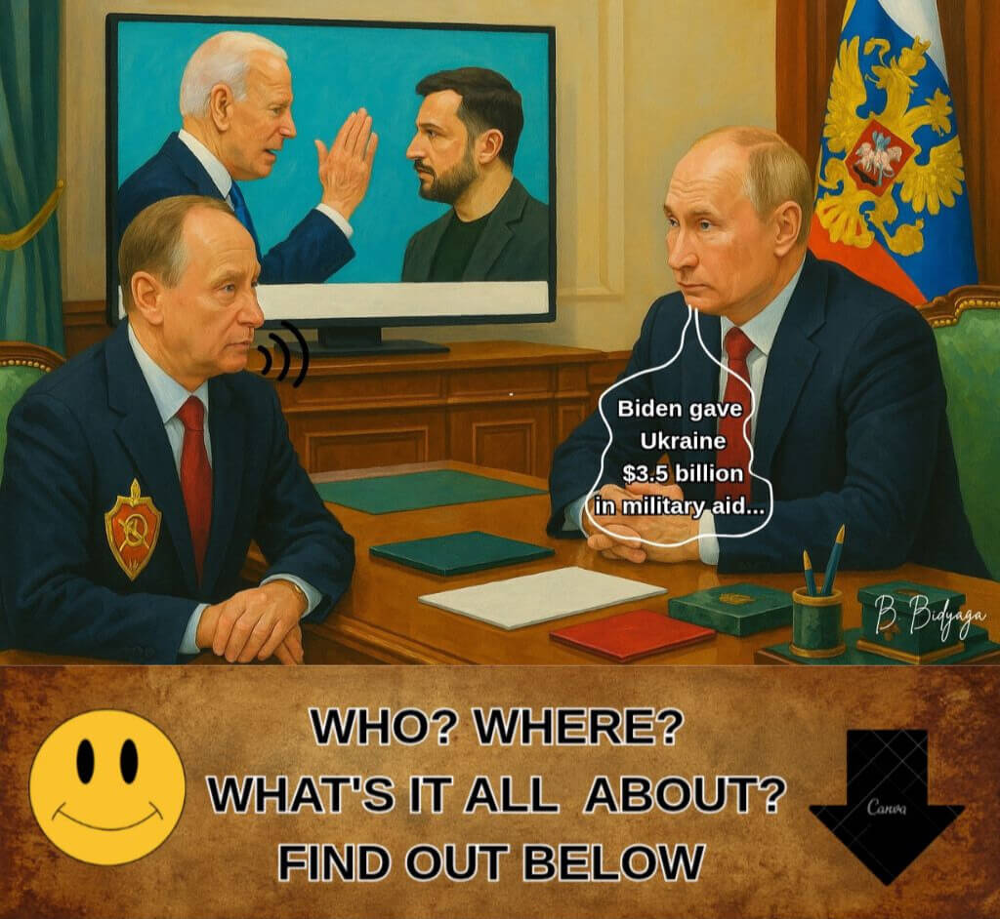

Russia, Moscow, the Kremlin. Russian president Vladimir Putin and Security Council Secretary Nikolai Patrushev at table.
TV shows U.S. president Joe Biden shaking hands with Ukrainian president Vladimir Zelensky. 

**Putin (with cold fury)**:

— Biden gave Ukraine $3.5 billion in military aid. His HIMARS are setting my oil refineries on fire across the country. This is the last straw. We are not obliged to tolerate this kind of behavior. Give an asymmetrical response.

**Patrushev:**

— Yes, sir. How about we launch a “Prometheus’ fire” over his favorite state? That’s where his son lives, and that idiot Kamala Harris as well. It’s his own fault — we warned him!

#OrthodoxMilitaryPutinism
                                👻

## 10. FRONTLINE ACCOUNTING: WOUNDED = REVENUE STREAM

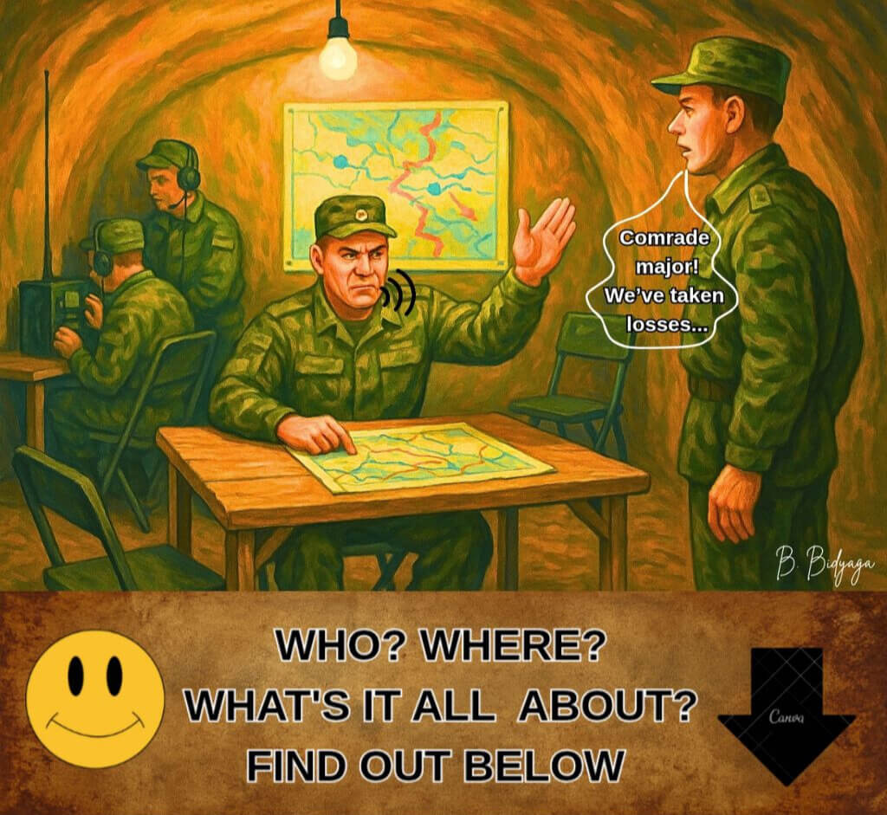

Russian-Ukrainian front, dugout HQ. Commander and sergeant in discussion.

**Sergeant:**

— Comrade major! We’ve taken losses — seven wounded are screaming in no man’s land. Should we evacuate them?

**Commander** (without raising his eyes from the ledger):

— Why? Leave them 'in reserve.' We’ll go on collecting rations for them. The main thing is that the headcount balances.

#OrthodoxMilitaryPutinism
                                👻

## 11. PRISON HUMANISM À LA RUSSE 

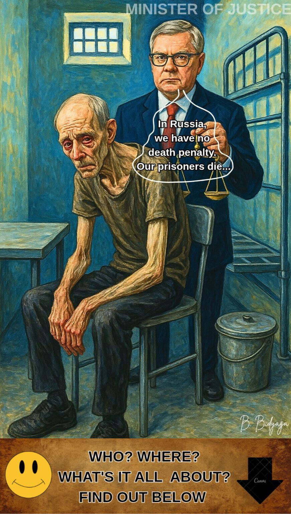

Typical Russian prison cell. Severely emaciated, sickly prisoner. Behind him, Justice Minister Konstantin Chuychenko with scales of Themis.

**Chuychenko:**

— In Russia, we have no death penalty. Our prisoners die in jail of their own accord — from shame and pangs of conscience.
We are launching a new state program to humanely encourage voluntary departure:

— IV drips of repentance,

— The “Awakening of Conscience” diet (standard prison ration #1),

— “Patriotic Upbringing” aromatherapy (open toilet buckets in solitary confinement).

Russian justice is the most humane in the world!

#OrthodoxMilitaryPutinism
                                👻

## 12. DEFENSE AGAINST COMMON SENSE

Russia, Moscow, State Duma chamber. Budget discussion.

**First deputy:**

— Half the budget for defense?! Are you out of your minds? What about healthcare, science, education?!

**Second deputy:**

— Our mission is the demilitarization of Ukraine! Sacrifices are necessary! You can't print guns on a 3D printer, you know.

**First deputy:**

— But in reality, it’s Russia that’s being militarized — not Ukraine! We'll all end up in military fatigues!

**Vyacheslav Volodin, president of State Duma:**

— Debate closed! The budget is approved — unanimously!

#OrthodoxMilitaryPutinism
                                👻

## 13. DEADLY WEAPON: PLASTIC CUP

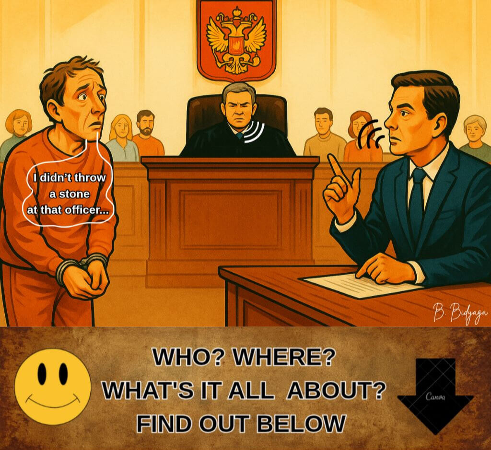

Russian town, Courtroom: defendant, lawyer, and judge.

**Defendant:**

— I didn’t throw a stone at that officer — just a plastic cup!

**Defense lawyer:**

— We find the sentence excessively harsh! We demand leniency!

**Judge:**

— I see not the slightest grounds. The crime is obvious, though incomplete: first a cup, then a stone. A clear act of visual incitement to terrorism — a public demonstration of terrorist methods. Sentence upheld!

#OrthodoxMilitaryPutinism
                                👻

## 14. THE SCOUNDRELS LAW: PREVENTIVE LOOTING

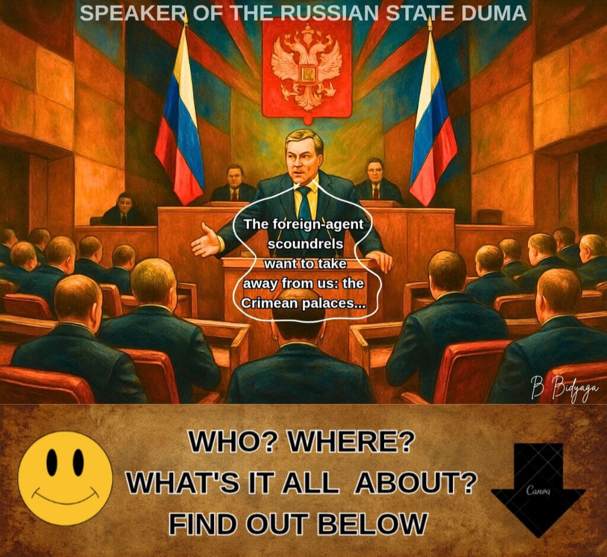

Russia, Moscow, State Duma chamber. 
Its Speaker, Vyacheslav Volodin, at podium.

**Volodin (in solemn tones)**:

— The foreign-agent scoundrels want to take away from us:

• the Crimean palaces (a symbol of Russia’s greatness!),

• the Donbas mines (long flooded, yet still ours!),

• the beaches of Mariupol (paid for with our blood!),

• the Melitopol cherries (our sacred strategic fruit!).

We will fight these scoundrels. We are passing a law on preventive confiscation:

• Apartments — for seditious appeals,

• Dachas — for slanderous fabrications,

• Bank accounts — for unpatriotic fantasies.

**They have the arrogance to desire — we have the power to confiscate!**

#OrthodoxMilitaryPutinism
                                👻

## 15. DREAMS OF THE DNIEPER

Dream of Russian President Vladimir Putin: he himself and Defense Minister Sergei Shoigu fishing on the Dnieper River, Ukraine.

**Shoigu:**

— The fishing here is excellent... Since time immemorial... Our river, Old Rus’… Mother Volga and Father Dnieper — all the waters of Rus’ came from them… As the great Russian poet once said: “The Dnieper is wondrous in calm weather...”

**Putin:**

— Indeed. By the way, a thousand years ago, right on this very spot, Prince Vladimir caught a giant Perch weighing over 100 pounds! It’s recorded in The Tale of Bygone Years!

(Putin awakens: drizzle, a nasty gray fog drifting over the Moscow River. He dials Medinsky.)

**Putin:**

— Vladimir Rostislavovich? Urgently include the Perch in the new history textbook! Yes, that very one… As a symbol… of Russia's greatness. And make sure it has an illustration!

*V.R. Medinsky, "history maker" on the Kremlin's order, including for school education.*

#OrthodoxMilitaryPutinism
                                👻

## 16. CHILD’S BEDROOM — UNIFORM WORKSHOP

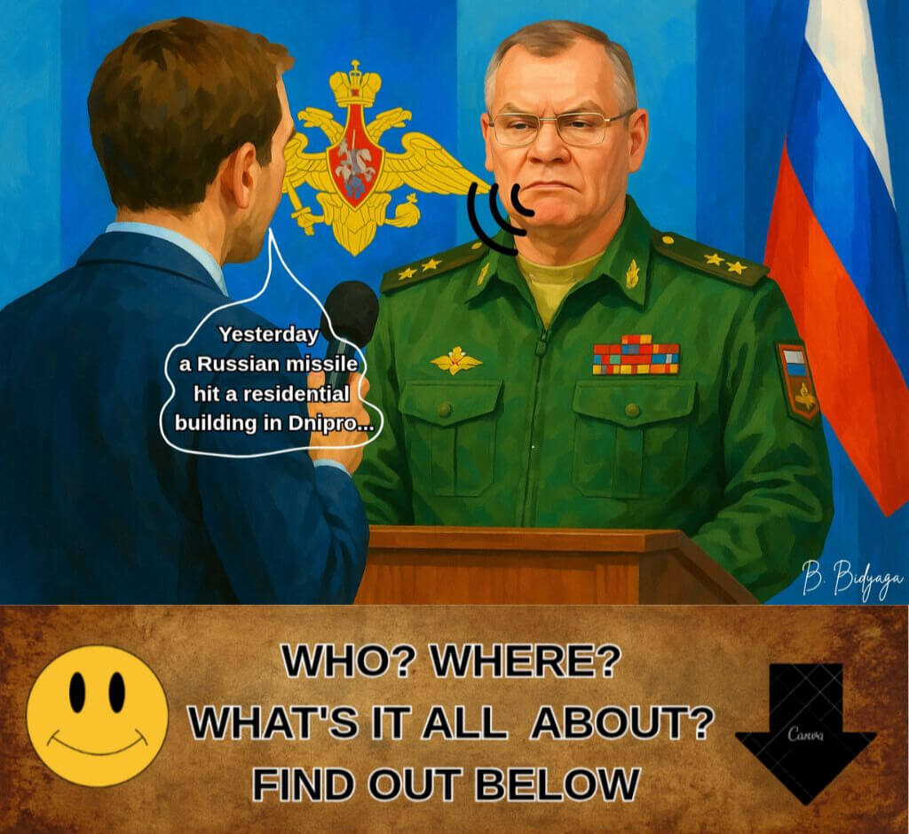

Russian Ministry of Defense briefing led by General Konashenkov, chief of the Department of Information.

**Journalist:**

— Yesterday a Russian missile hit a residential building in Dnipro. A Ukrainian family was killed. How do you comment on this precise act?

**General Konashenkov:**

— I repeat, as a true patriot of Russia: the Russian army has never bombed and will never bomb civilian targets. Our investigation shows that it was a clandestine workshop for sewing military uniforms.

**Journalist:**

— Children were among the victims...

**General Konashenkov:**

— They practiced embroidering insignia.

#OrthodoxMilitaryPutinism
                                👻

## 17. NEO-PATRIARCHY: EMANCIPATION CANCELLED

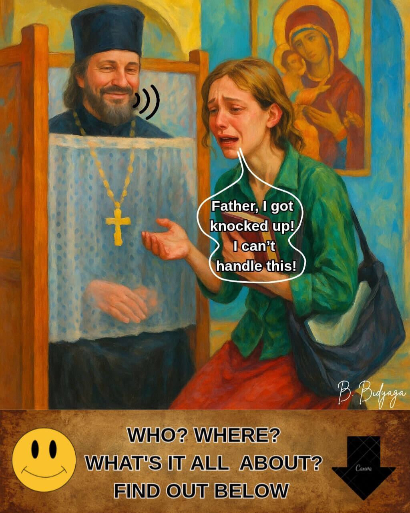

Orthodox church, Russian town. Confessional.

**Girl:**

— Father, I'm in terrible trouble, I'm pregnant! I don't know what to do! I'm in my third year of university... I want to finish my studies... Who will raise the child?

**Priest:**

— A woman has no need for education. So the Church teaches, so say the Holy Fathers. A woman's vocation is to give birth and be silent. Obedience and motherhood — that is your future. And you will receive your reward in Heaven. Our latest Council has ruled: "Women’s education is a temptation from the Evil One."

#OrthodoxMilitaryPutinism
                                👻

## 18. NO VICTORY WITH DICK IN HAND!

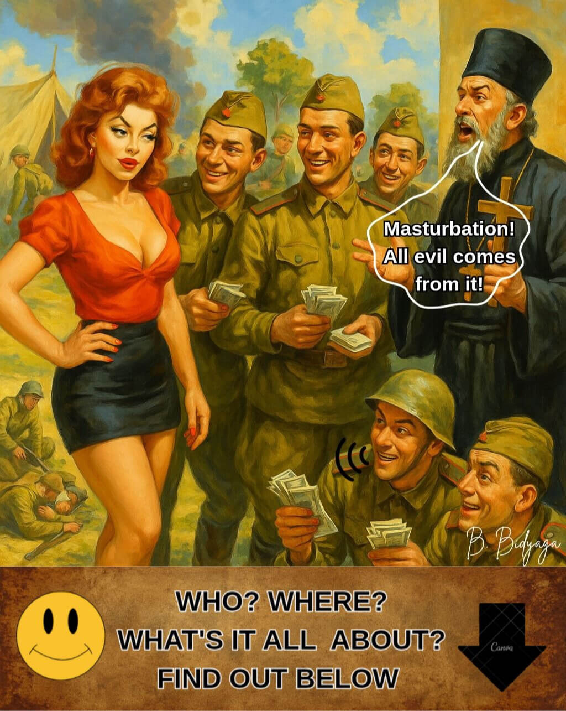

Russian-Ukrainian frontline. Russian soldiers haggle with prostitute. Nearby, priest preaches.

**Priest:**

— Masturbation! All evil comes from it! This whole war broke out because of masturbation!
Repent, warriors! Cease your filthy sin! A real warrior holds a weapon, not his dick!

**Soldier:**

— If you knew, priest, what the whores charge out here, you’d keep your trap shut!

#OrthodoxMilitaryPutinism
                                👻

## 19. LET’S GO TO THE MOON 

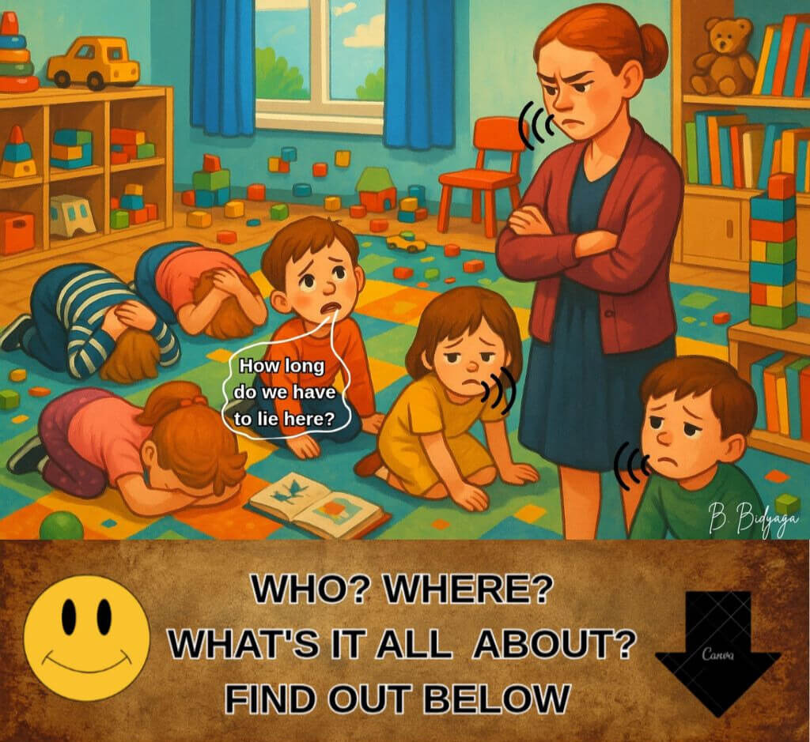

Kindergarten, Russian town. Air raid siren wails. Children lie face down on floor.

**First child:**

— How long do we have to lie here?

**Teacher:**

— Until our guys shoot down all the enemy drones.

**Second child:**

— So… a really long time.

**Third child:**

— Let’s fly to the Moon instead!

#OrthodoxMilitaryPutinism
                                👻

## 20. "CONVERSATIONS ABOUT IMPORTANT THINGS"

School, Russian town. Lesson: "Conversations About Important Things".

**Teacher:**

— Now, children, tell me who you want to be when you grow up.

**Tolya:**

— I’ll be a pilot and bomb enemy cities.

**Masha:**

— I’ll be a nurse and carry the wounded off the battlefield.

**Gena:**

— I’ll be a general at headquarters, giving orders.

**Teacher:**

— And you, Vanyusha? Why so quiet? Tell us who you want to be.

**Vanyusha (with a sigh)**:

— I’ll be hiding from this madness in a psychiatric ward, Elena Petrovna.

#OrthodoxMilitaryPutinism
                                👻

## 21. DON’T PUSH ME — I’M VIOLENT!

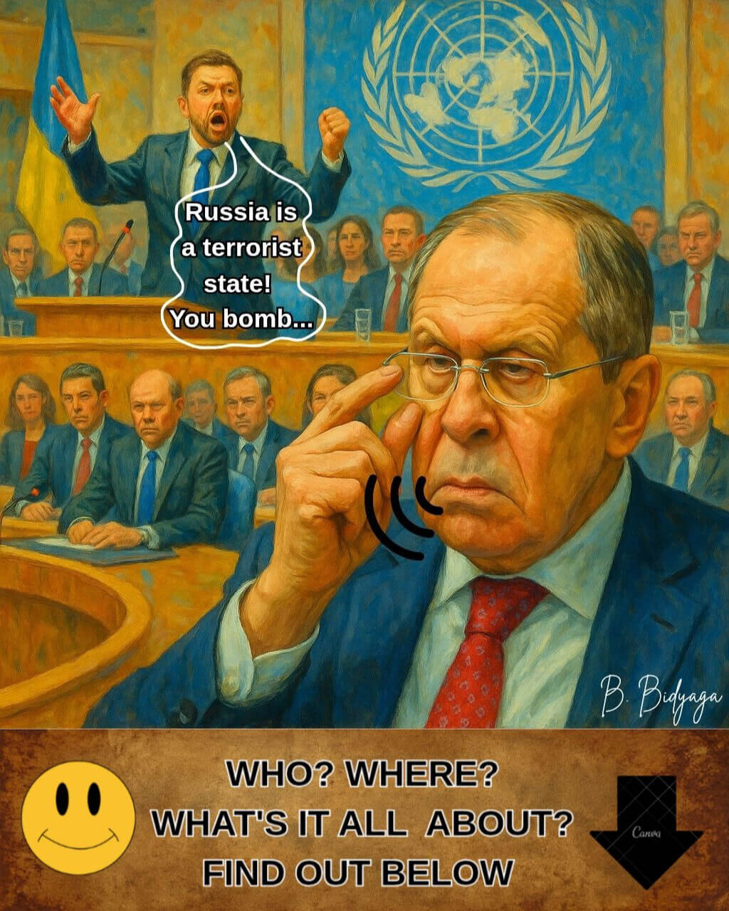

UN Security Council meeting.

**Representative of Ukraine:**

— Russia is a terrorist state! You bomb residential buildings, kill children, rape women, loot homes, and trample on the laws of war. The day will come when you are held accountable! Russia must be put on trial!

**Russian Foreign Minister Sergey Lavrov:**

— Fucking morons!

#OrthodoxMilitaryPutinism
                                👻

## 22. YOUR LIFE IS PAID FOR. NO CHANGE, NO SURRENDER

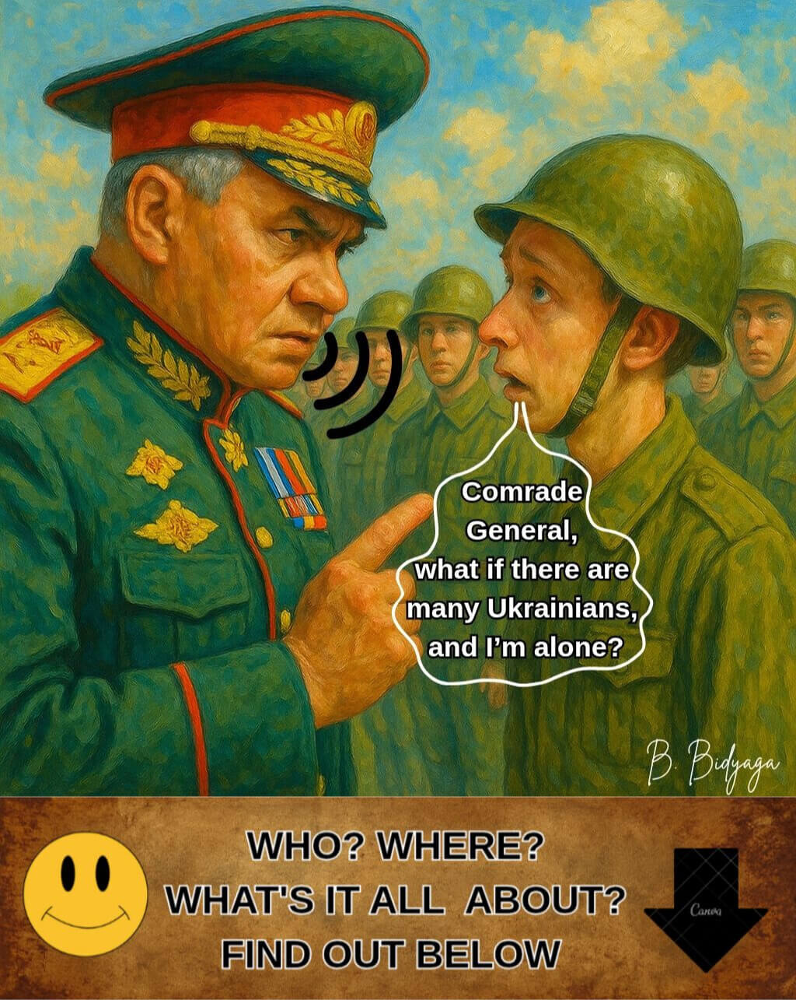

Russian-Ukrainian front, Russian rear positions. Soldiers lined up. Russian Defense Minister Sergei Shoigu addresses them.

**Soldier:**

— Comrade General, what if there are many Ukrainians, and I’m alone?

**Shoigu:**

— You must fight to the last bullet, son. If, God forbid, they take you alive — that’s a crime. Voluntary surrender.

**Soldier:**

— But I don’t want to die!

**Shoigu:**

— Your life has already been paid for. Generously. In full. No change, no surrender. Do your part — no change, no surrender.

#OrthodoxMilitaryPutinism
                                👻

## 23. BUCHA: THE THEATER OF WAR — OR JUST THEATER?

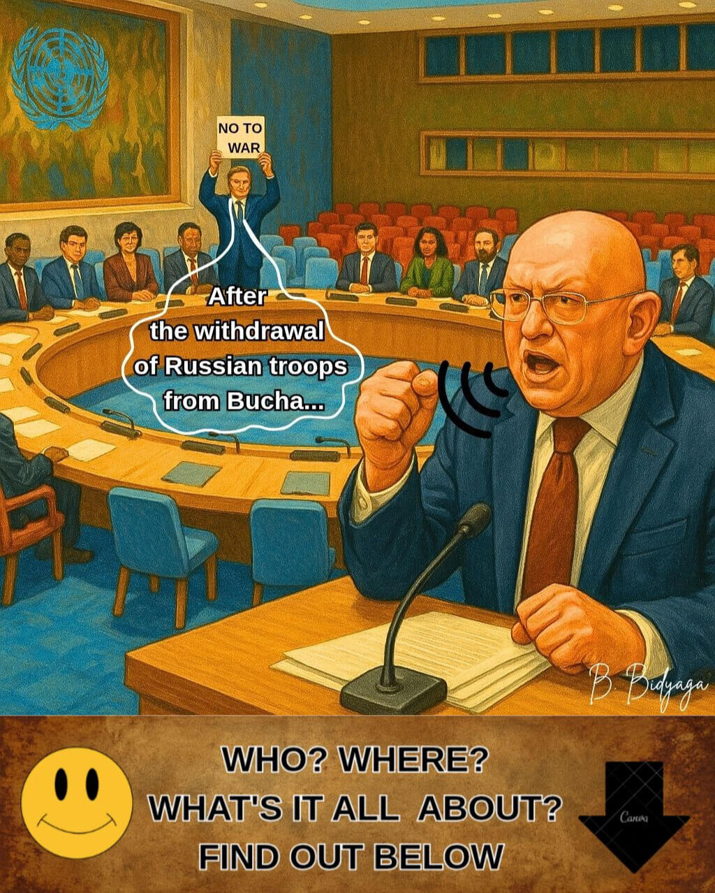

UN Security Council meeting.

**Representative of Ukraine:**

— After the withdrawal of Russian troops from Bucha, hundreds of civilian bodies were found. Putin’s soldiers killed them!

**Representative of Russia (shouting):**

— Lies! There were no bodies! A Ukrainian production! This is no theater of war — this is a drama theater of war!

#OrthodoxMilitaryPutinism
                                👻

## 24. JAZZ TODAY — TREASON TOMORROW

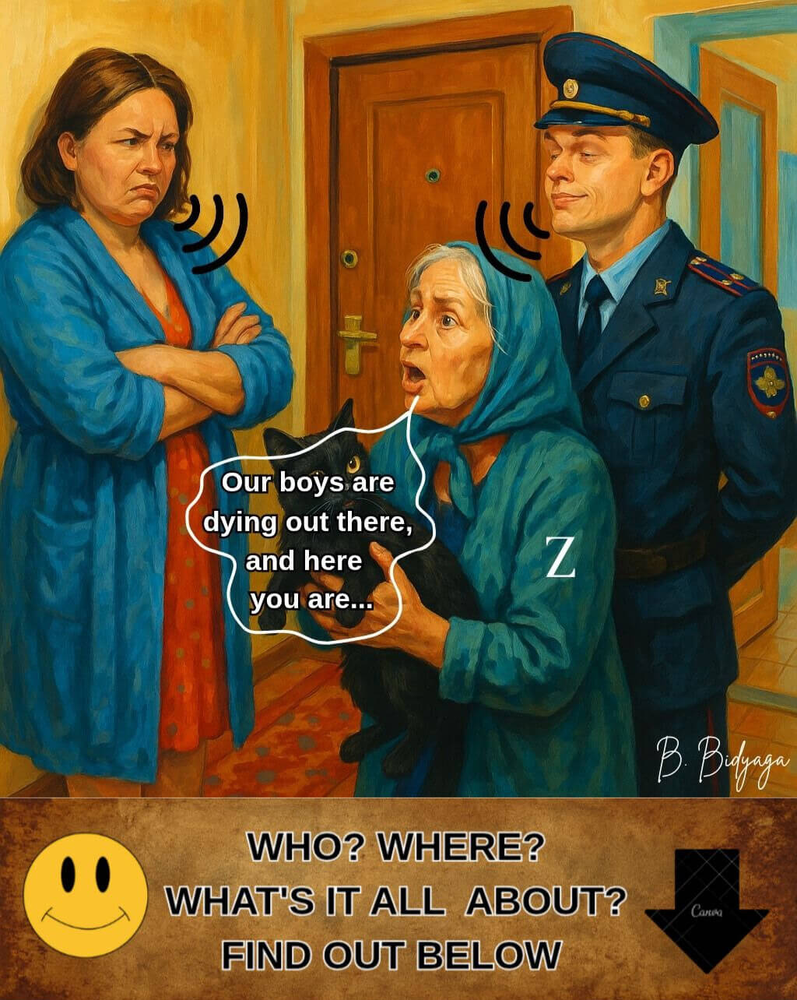

Russia, Moscow. Dialogue inside apartment: landlady, neighbor, policeman.

**Neighbor:**

— Our boys are dying out there, and here  you are — listening to music! That’s discrediting the army!

**Landlady:**

— Not my fault those idiots went to the front. I didn’t drag them to the draft office! They wanted millions. Now they’re lying there.

**Policeman:**

— Plus incitement to hatred and hostility against members of the Russian army! That’s going to cost you dearly!

#OrthodoxMilitaryPutinism
                                👻

## 25. S-300: THE UNIVERSAL BOMB-SEAL

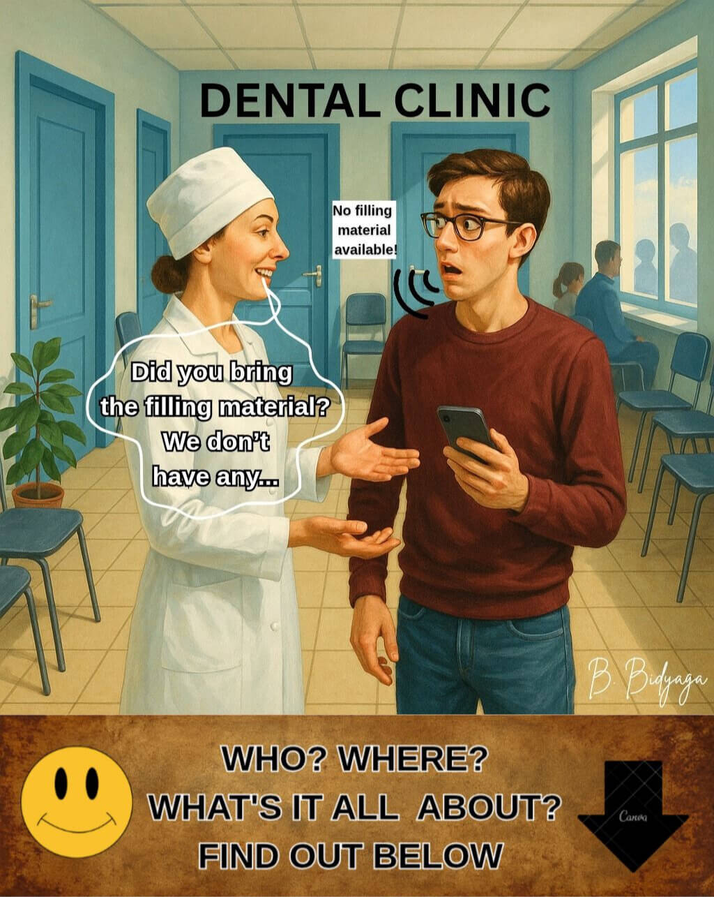

Dental clinic, Russian town.
Sign on office door: “No filling material available!” In hall, dentist talks to patient.

**Dentist:**

— Did you bring the filling material? We’re out of stock. Sanctions, you know. Right now, all we’ve got is S-300 construction cement. One-month guarantee — unless you die sooner.

**Patient:**

— You know what? I think I’ll just leave. The tooth doesn’t hurt anymore. Somehow, it just… disappeared.

#OrthodoxMilitaryPutinism
                                👻

## 26. AT FORTUNE-TELLER'S: NUMBERS NEVER LIE

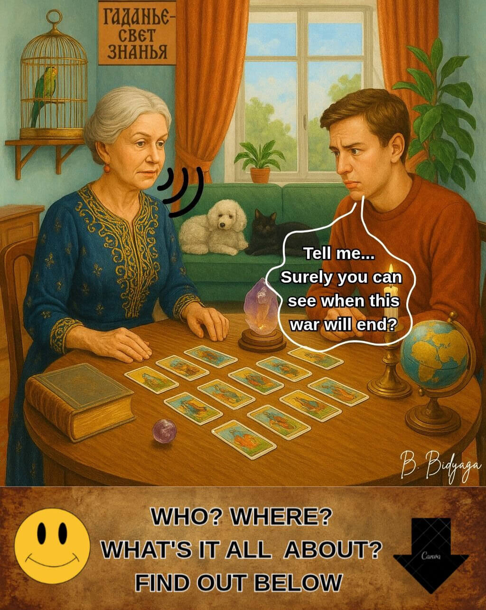

Russian town, fortune teller’s parlor.
Young man inside.

**Man:**

— Tell me... Surely you can see when this war will end?

**Fortune-teller:**

— Of course. Let’s do the math... Today is... 25.05.25. Multiply... 25 × 5 × 25...
In 3125 days.

#OrthodoxMilitaryPutinism
                                👻

## 27. PALLIATIVE MEDICINE: HOLDING ON WITH PRAYERS

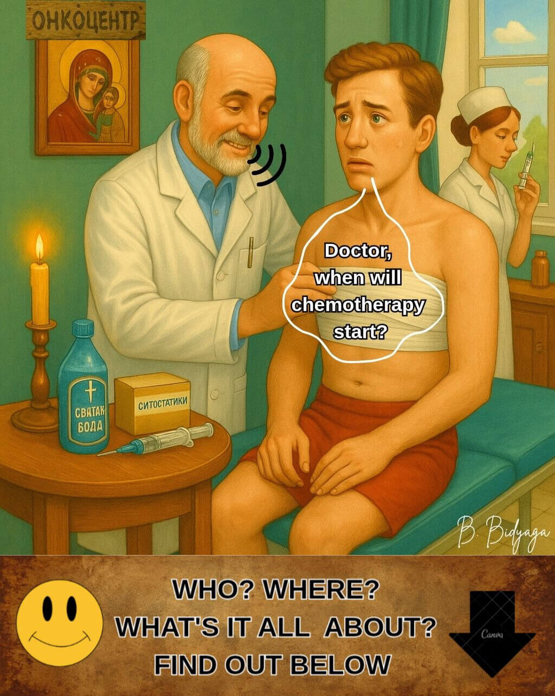

Oncology clinic,  Russian town.
Doctor’s office. Patient on examination table, doctor bandaging his chest.

**Patient:**

— Doctor, when will chemotherapy start?

**Doctor (indifferently):**

— Not in this lifetime. The budget’s been cut.
So... we’ll just tighten the bandage. Slows the metastases a bit.
Nurse! Holy water injection! Hold on — we’re praying for you.

#OrthodoxMilitaryPutinism
                                👻

## 28. RATIONS FOR REAL SOLDIERS

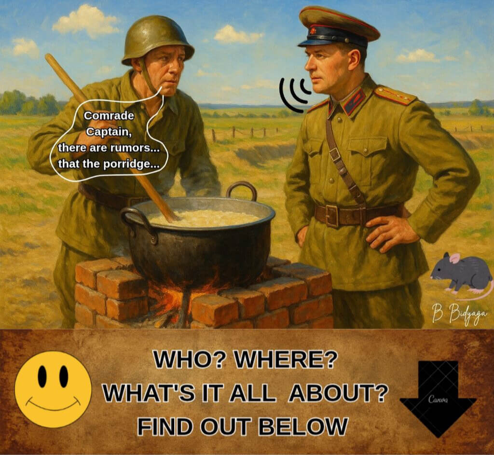

Russian-Ukrainian front, Russian positions. Field kitchen. Cook and captain in conversation.

**Cook:**

— Comrade Captain, there are rumors... that the porridge has rat meat. And they say that all the canned meat was stolen by the staff officers.

**Captain:**

— Canned meat is a surrogate. A real soldier needs real food.
And to silence the slanderers: we soak the meat in vinegar, add extra pepper to the porridge, and top it off with fried onions.

#OrthodoxMilitaryPutinism
                                👻

## 29. NOT TSAR’S BUSINESS...

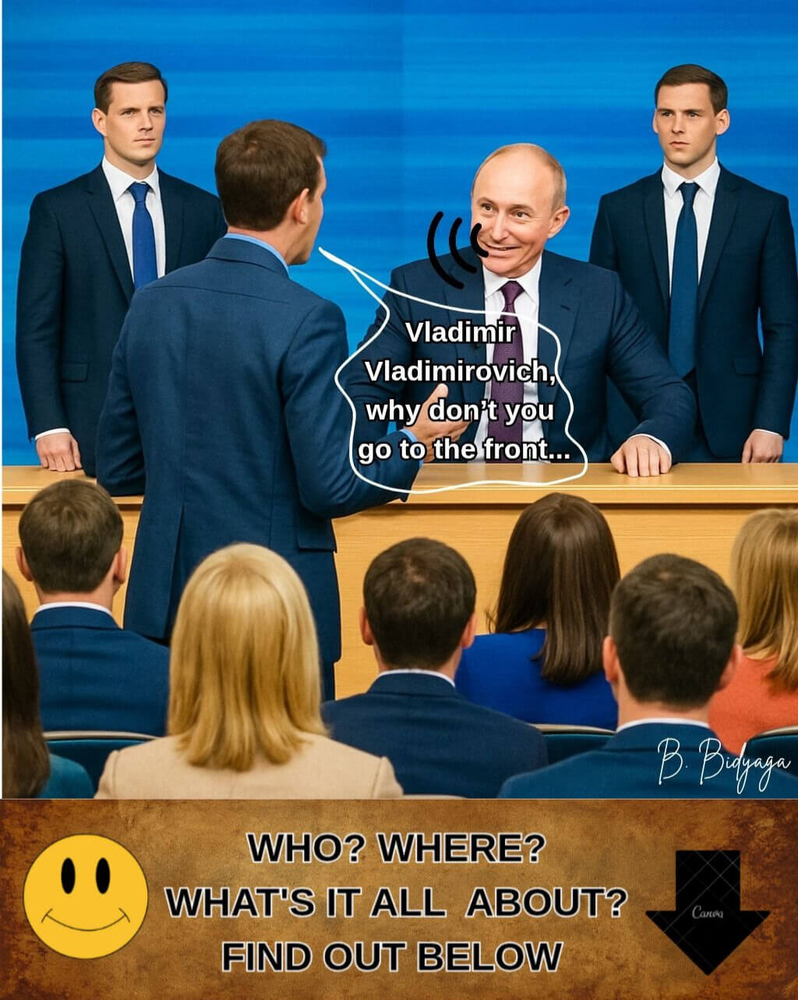

Press conference with Russian president Vladimir Putin.

**Correspondent:**

— Vladimir Vladimirovich, why don’t you go to the front line like President Zelensky?

**Putin:**

— Zelensky is illegitimate. If he gets killed, it’s no big loss.
Besides, he’s just chasing cheap popularity.
I don’t need that. My ratings are already high.

#OrthodoxMilitaryPutinism
                                👻

## 30. MOTHERLAND OWES SOLDIER NOTHING — EXCEPT FUNERAL HONORS

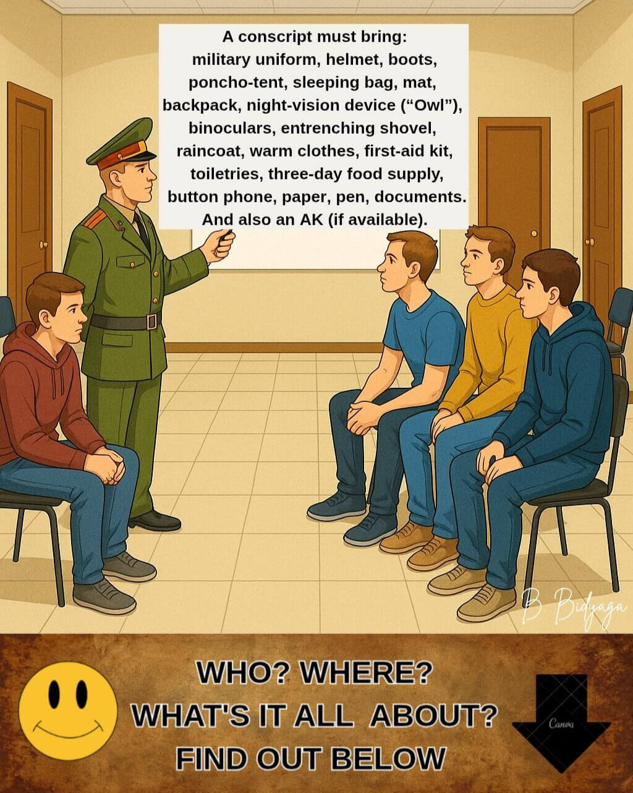

Military enlistment office, Russian town.

A conscript must bring: 

• military uniform, helmet, boots,

• poncho-tent, sleeping bag, mat, backpack, 

• night-vision device (“Owl”), binoculars, entrenching shovel,

• raincoat, warm clothes, first-aid kit, toiletries,

• three-day food supply, 

• button phone, paper, pen, documents, 

• and also an AK (if available).

#OrthodoxMilitaryPutinism
                                👻

## 31. INSURANCE AGAINST DISLOYALTY: CIVIL SERVICE WITH SELF-DESTRUCTION CLAUSE

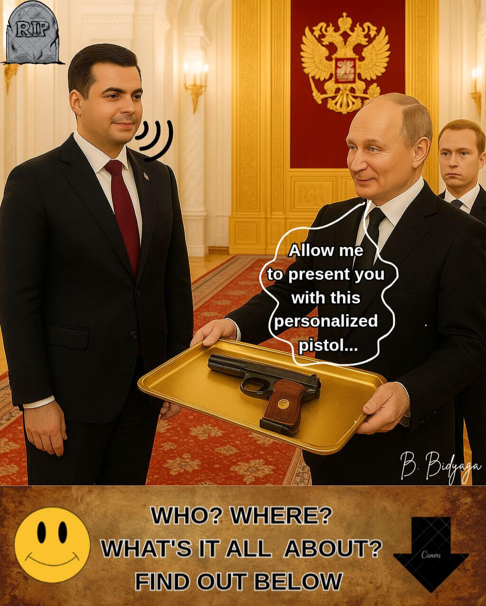

St. George’s Hall, Grand Kremlin Palace, Moscow, Russia. 
Russian President Vladimir Putin presents award to official.

**Putin:**

— Allow me to present you with this personalized pistol, in recognition of your service to the Motherland.
It will encourage you in difficult moments. It won’t let you falter.
And, I am sure, it will be your salvation in any hopeless situation.

**Official:**

— I serve Russia! Ready to prove my loyalty — even at the cost of my own life!

#OrthodoxMilitaryPutinism
                                👻

## 32. PUTINACEA FOR ALL TROUBLES: FEAR

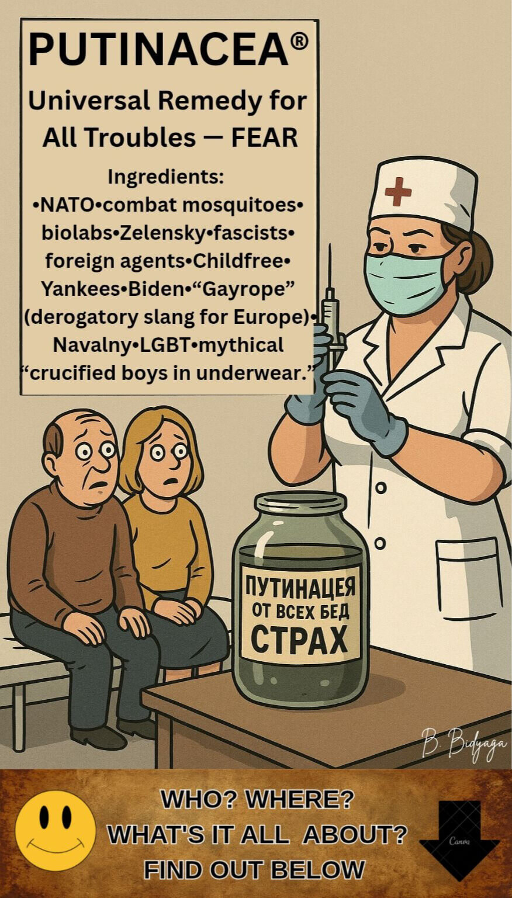

**PUTINACEA®**

A combined broad-spectrum drug. Active against all oppositional microorganisms.

**Pharmacological action**:

Induces persistent fear, periodic fits of aggression, and bursts of patriotic enthusiasm. Inhibits centers responsible for critical thinking, empathy, and guilt.

**Active ingredients include**:

• NATO

• Combat mosquitoes

• Biolabs

• Zelensky

• Fascists

• Foreign agents

• LGBT

• Childfree

• Yankees

• Biden

•“Gayrope” (derogatory slang for Europe)

• Navalny

• Mythical “crucified boys in underwear”

**Indications:**

• Elevated self-awareness

• Excessive trust and compassion towards enemies of Russia and its people

• Persistent desire for answers to rhetorical questions

**Proven therapeutic effect:**

• Chronic dependence on television broadcasts

• Allergic reaction to truth

• Aggressive patriotic ecstasy

**Overdose**:

• Data not available.

**Contraindications:**

• None identified.

#OrthodoxMilitaryPutinism
                                👻

## 33. NET SACK OF TNT: NATO’S KILLER DOLPHINS STRIKE!

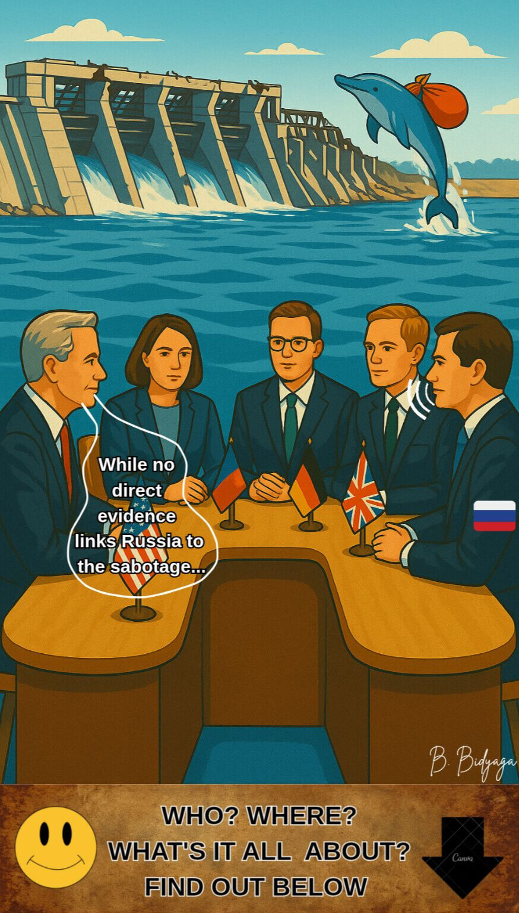

Session of International Commission on destruction of Kakhovka Hydroelectric Dam in Ukraine.

**Western representative:**

— While no direct evidence links Russia to the sabotage, circumstantial evidence raises certain questions...

**Russian representative:**

— We categorically reject these slanders! DNA analysis has irrefutably proven that the dam was destroyed by NATO-trained special forces dolphins!

#OrthodoxMilitaryPutinism
                                👻

## 34. BARN HAS WRITINGS TOO...

Russian military airfield.
Dialogue between Russian pilot and Ukrainian journalist.

**Ukrainian:**

— Why did you bomb the Mariupol Drama Theater? It was written loud and clear: “CHILDREN!”

**Pilot:**

— A barn can also have “Cock” scrawled on it, but inside — it’s just firewood.

#OrthodoxMilitaryPutinism
                                👻

## 35. NATO COMBAT MOSQUITOES

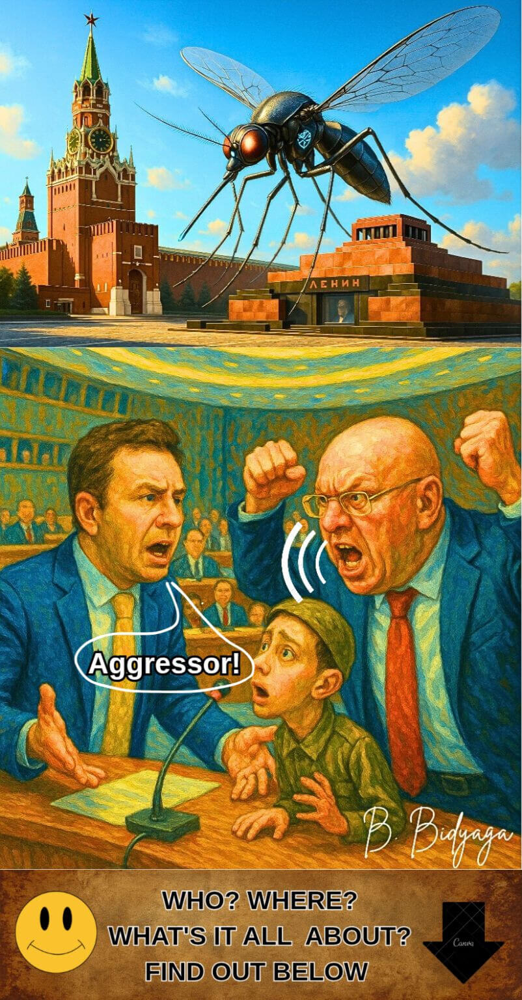

UN Security Council meeting. Commotion in chamber.

**Ukrainian representative** (addressing Russia):

— Aggressor!

**Russian representative**:

— Lies and slander! Do not insult the Russian Federation! It was NATO’s combat mosquitoes, trained in secret Ukrainian biolabs, that swarmed across our sovereign borders in a treacherous act of aggression! We launched only a righteous, heroic special disinsection operation!

#OrthodoxMilitaryPutinism
                                👻

## 36. KYIV IN THREE DAYS

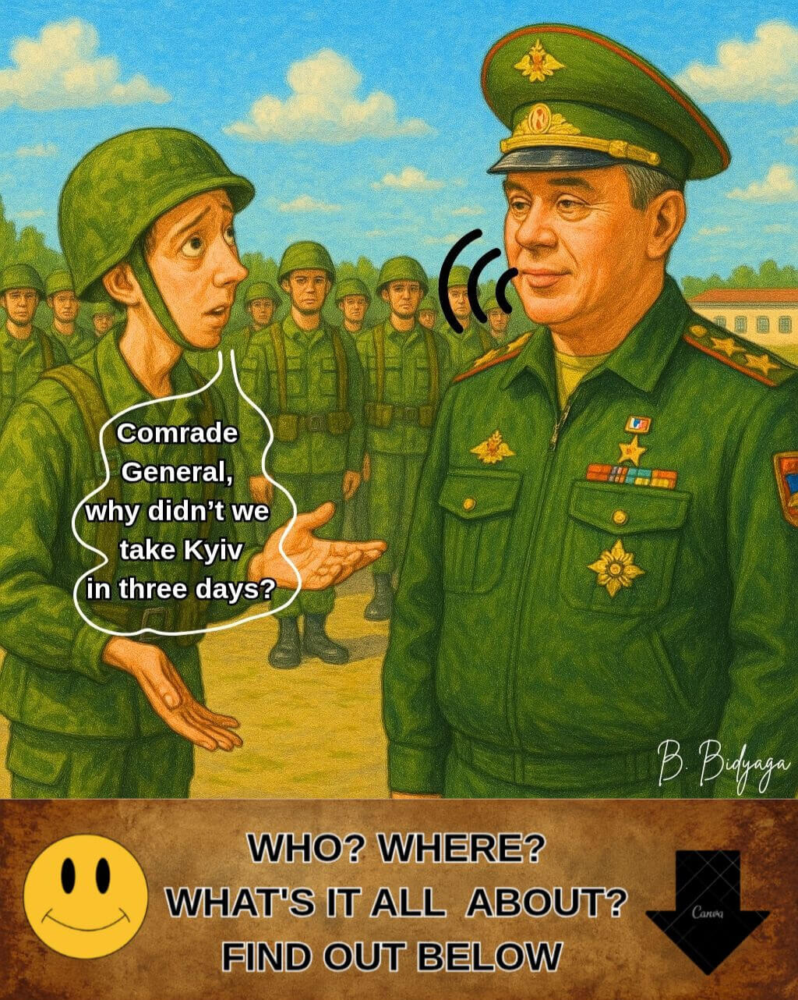

Parade ground, Russian military unit. General paces before formation.

**Soldier:**

— Comrade General, why didn’t we take Kyiv, the Ukrainian capital, in three days?

**General:**

— That was only a training operation, soldier. A gesture of humanity and goodwill. We gave the enemy a taste of our firepower — and then, in our wisdom, we relocated to even stronger positions.
 
#OrthodoxMilitaryPutinism
                                👻

## 37. SABOTEUR SANTA: CHRISTMAS SPECIAL OPERATION

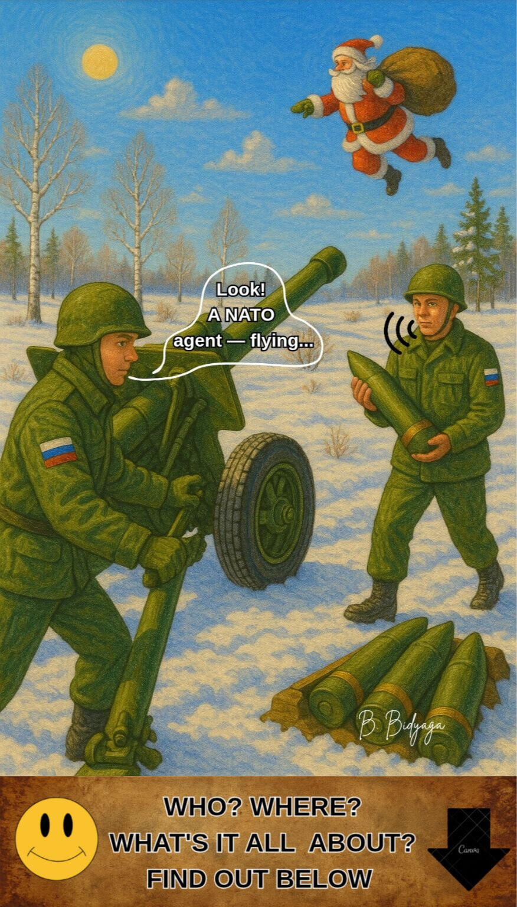

Christmas Eve. Russian soldiers at combat position. Santa Claus with sack of gifts flies across sky above them.

**First soldier:**

— Look! A NATO agent — flying under cover!

**Second soldier:**

— Load the guns! Quickly! Aim for the head — but don’t damage the sack. Otherwise we’ll be left without presents.

#OrthodoxMilitaryPutinism
                                👻

## 38. BAPTISM IN HELL

Russian-Ukrainian front, Russian positions. Priest urges soldiers to baptize themselves in field “font.”

**Priest:**

— Soldiers! Be baptized while you are still alive! Or straight to hell you go!

**First soldier:**

— We’re already in hell.

**Second soldier:**

— Come on! Let's do it! At least we’ll get a wash!

#OrthodoxMilitaryPutinism
                                👻

## 39. WANNA BE A SAINT? HANG ON THE CROSS!

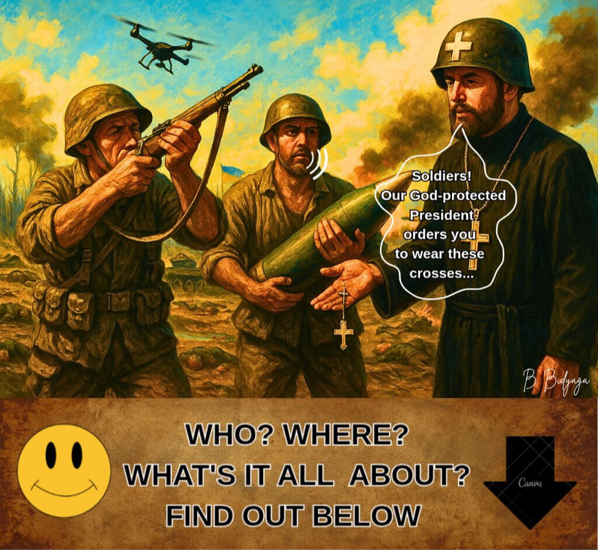

Russian-Ukrainian front, Russian rear camp. Priest offers soldiers “presidential” crosses as talismans.

**Priest:**

— Soldiers! Our president, protected by God's grace, orders you to wear these crosses bearing his initials. They will protect you from enemy bullets.

**Soldier:**

— Wait — he’s been crucified already?

#OrthodoxMilitaryPutinism
                                👻

## 40. HOLY-WATER TARGETING

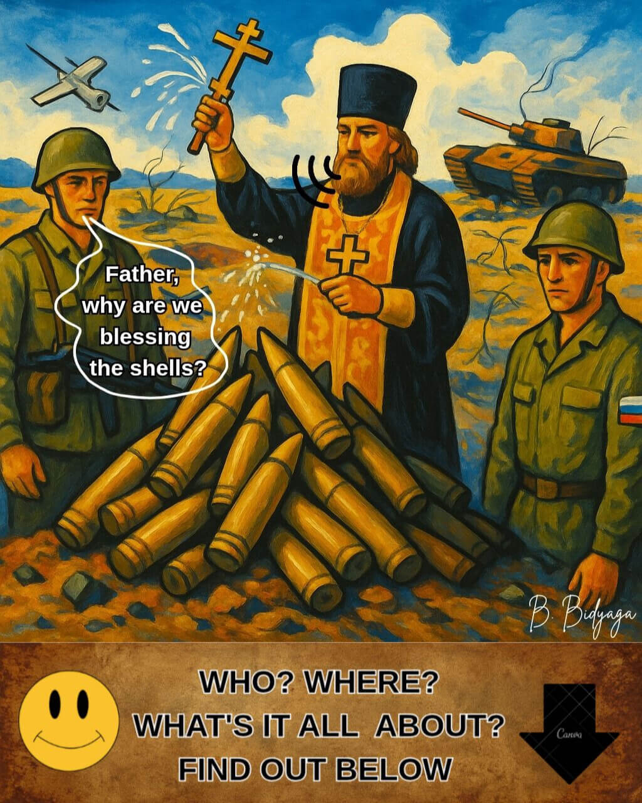

Russian-Ukrainian front, Russian positions. Ritual of blessing ammunition.

**First soldier:**

— Father, why are we blessing the shells?

**Priest:**

— So that they hit the target, my son!

**Second soldier (grimly)**:

— That explains why we never hit anything!

**First Soldier (with enthusiasm)**:

— Finally!  Now our guns will fire properly!

#OrthodoxMilitaryPutinism
                                👻

## 41. WHITE, RED, BLACK

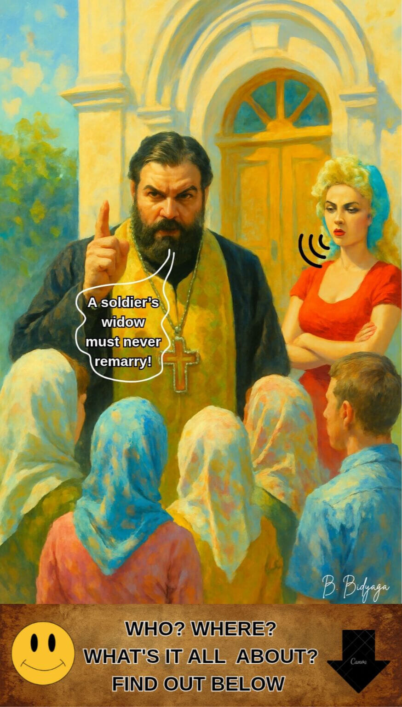

Orthodox church, Russian town.
Priest delivers sermon at church entrance.

**Priest:**

— A soldier’s widow must never remarry! Got the death notice? Mourn and pray!

**Woman from crowd:**

— Dream on! Your coffin payout barely buys a white Lada. And I want a red Volvo! With a minibar!

#OrthodoxMilitaryPutinism
                                👻

## 42. PUTIN’S CROOKED LINE

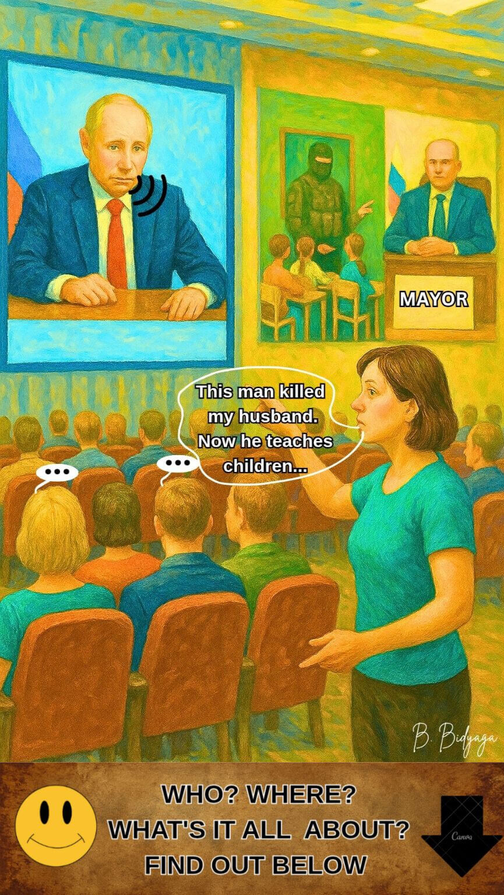

“Direct Line” with Russian President Vladimir Putin. President takes questions via video link, invited audience in hall.

**Woman from hall** (pointing at official’s portrait):

— This man killed my husband. Now he teaches children courage — and he’s the mayor of our city. Why?

**Putin:**

— He redeemed himself at the front. He paid for his past with blood. He is a hero — our new elite.

**First viewer, hiding face**:

— Have killed a hundred Ukrainians — forgiven...

**Second viewer, hiding face**:

— Kill, rob, rape! Half a year at the front wipes everything clean...

#OrthodoxMilitaryPutinism
                                👻

## 43. HOLY FIRE EXTINGUISHER

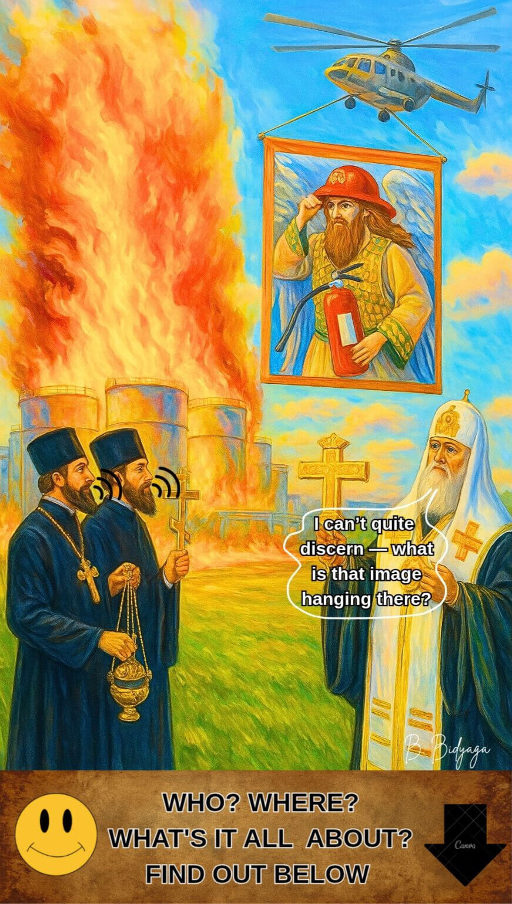

Burning oil depot,  Russian town. Two Orthodox priests talk to Patriarch.

**Patriarch:**

— I can’t quite discern — what is that image hanging there?

**First priest:**

— It’s Svarozhich, the Slavic god of fire. Very effective!

**Second priest:**

— Christ let us down...

**Patriarch:**

— Does it really work? Hmm... Very good. We'll hide this pagan heresy under a fig leaf: the icon will remain, but from now on it will be called Saint Nicholas the Firefighter.

#OrthodoxMilitaryPutinism
                                👻

## 44. PUTINIST PROPAGANDA IN A NUTSHELL 

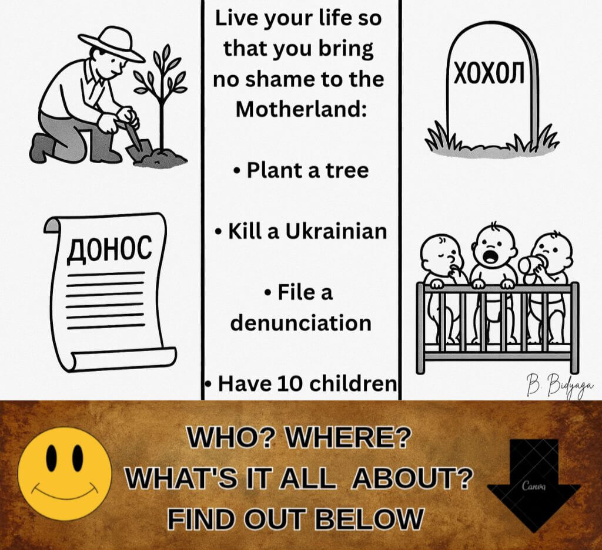

Live your life so that you bring no shame to the Motherland:

• Plant a tree

• Kill a “khokhol" (a slur for an Ukrainian)

• File a denunciation

• Have 10 children

#OrthodoxMilitaryPutinism
                                👻

## 45. THE SUPERNOVUS COVENANT

1. Love your Putin with all your heart, with all your mind, with all your soul.
2. Love your neighbor: your boss, your deputy, your tax inspector.
3. Thou shalt not kill — a statesman, a law enforcement officer.
4. Thou shalt not commit adultery in a condom.
5. Do not bear false witness for personal gain — only for the good of the Motherland.
6. Do not waste thy seed — make children.
7. Thou shalt not steal — that is the prerogative of state officials.
8. Do not seek treasures on earth — they have already been appropriated.
9. Whoever speaks ill of Volodin or Matvienko is worthy of death.
10. Do not yield to the devilish temptation of foreign agents and the fifth column.
11. Blessed are the informers, for theirs is the earthly kingdom. Denounce — and you shall be heard.
12. Love your Motherland — especially through government contracts.
13. Abstain from doubt: faith in television shall save you.
14. Avoid the words “freedom” and “peace,” for they are heresy.
15. Thou shalt not make idols outside the power vertical.

May loyalty be with you — and ye shall not perish in prison.

*From the “Revelation of Russian agency for communications control,” ch. 666.*

#OrthodoxMilitaryPutinism
                                👻

## 46. PACIFISM: DISEASE OR CRIME?

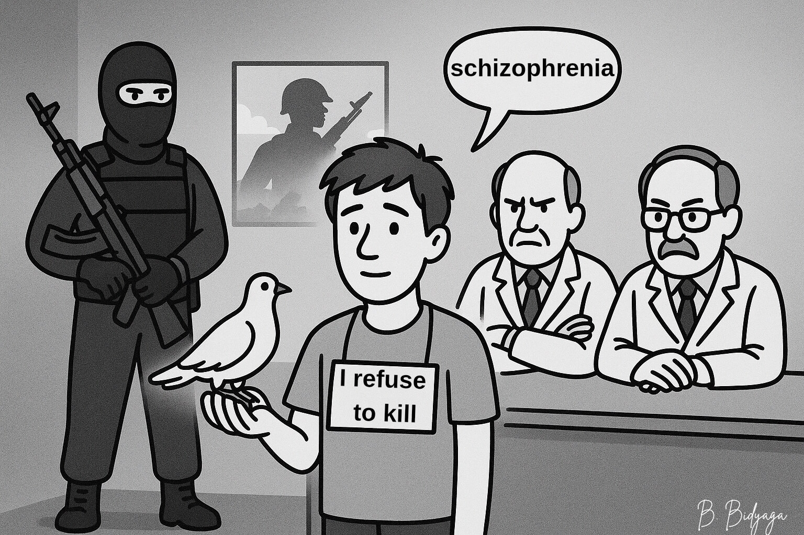
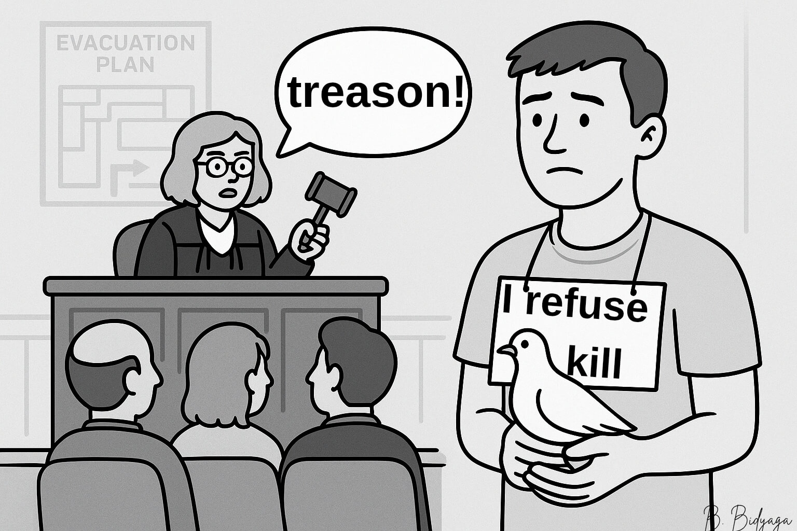
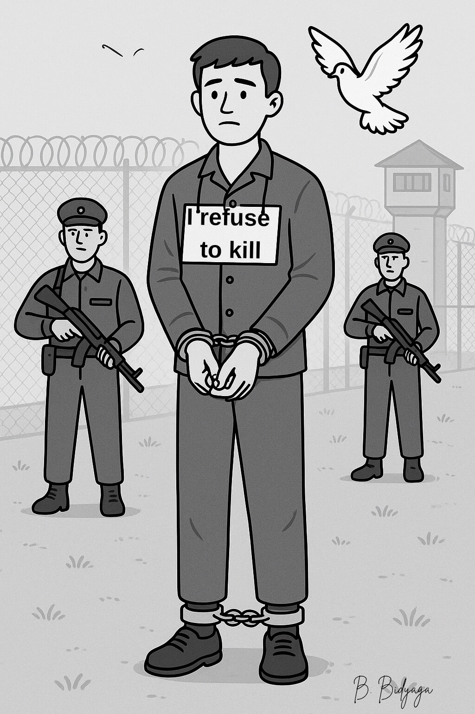

**Triptych:**

*Panel 1*

Draft office, Russia. 

Diagnosis: schizophrenia.  

*Panel 2:*

Courtroom, Russia.

Verdict: treason.

*Panel 3:*

Correctional colony for pacifists, Russia.

#OrthodoxMilitaryPutinism
                                👻

## 47. UPDATING CHRISTIANITY

Confessional in Orthodox church, Russian town.

**Repentant sinner:**

— Father! What happened to the commandment “Thou shalt not kill”?

**Priest:**

— Outdated version, my son!
Upgrade to the latest release.
Run the file "Ukraine_Deleted.exe".

#OrthodoxMilitaryPutinism
                                👻

## 48. PARABLE OF FISHERMAN AND PATRIARCH: FAITH FOR POOR, YACHTS FOR RICH

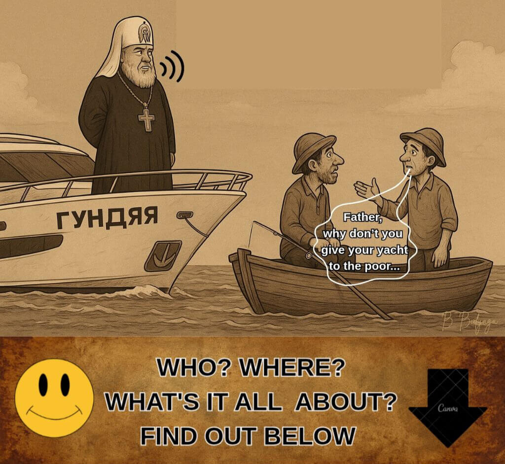

Patriarch of All Russia on bow of his luxury yacht. Nearby, two fishermen in shabby boat.

**Fisherman:**

— Father, why don’t you give your yacht to the poor and destitute — as Jesus commanded?

**Patriarch:**

— Christ preached exclusively to the poor. He never troubled the rich with his advice.

#OrthodoxMilitaryPutinism
                                👻

## 49. DIPLOMA OF PUBERTY

School in Russia, Family studies class. Diagram of Russia’s birth rate on blackboard.

**Student:**

— I don’t remember the lesson...

**Teacher:**

— Didn’t study for the test? Don’t worry! Go have a baby, dear — you’ll get an A! If you have twins, we’ll call it your anatomy practicum. Triplets — and you can graduate on the spot. No more school for you.

#OrthodoxMilitaryPutinism
                                👻

## 50. PUTIN 2.0: SPIRAL OF HISTORY

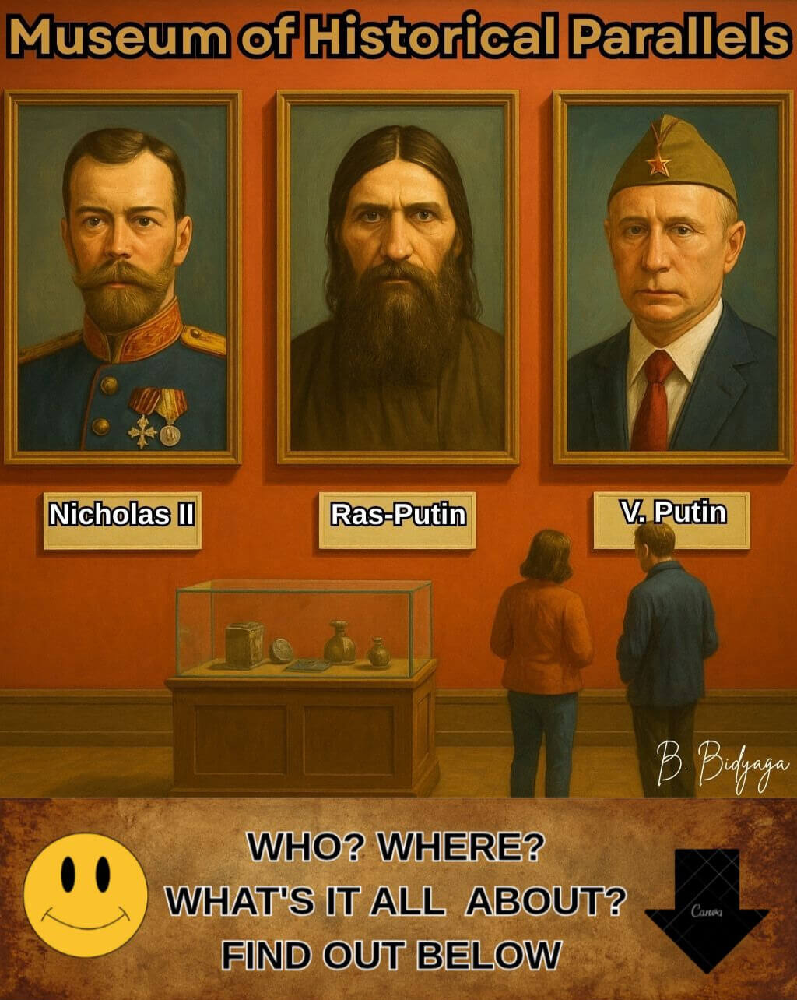

Exhibit at Museum of Historical Parallels. On wall — three official portraits:

✓ Tsar Nicholas II — “Nicholas II”

✓ Grigori Rasputin — “Ras-Putin" 

✓ Vladimir Putin — “V. Putin"

**Ras-Putin = Putin I (Proto-Putin)**

**V. Putin = Putin II  (The Sequel)**

> **Curator's Note**
>
> History repeats itself, first as tragedy, then as farce. Now it's looping as a psycho-absurdist horror remake. Two different men, one ominous namesake — a recurring curse on the Russian state. The finale, as always, is written in poison, polonium, and palace intrigues.

**Putin I (Version 1.0 — Grigori Rasputin)**
Finale: Cyanide, bullet to the head. (1916)
Status: DISCONTINUED

**Putin II (Version 2.0 — Vladimir Putin)**
Finale (Under Development — Beta Preview):

▸ 30% — Snuffbox Special (Historical Edition)

▸ 30% — Silken Scarf (Classic Strangulation)

▸ 30% — “Novichok™” (Modern & Lethal)

▸ 10% — “Spontaneous” Heart Attack (Plausible Deniability Package)

Scheduled Release: 202X

> **Historical Note**
> 
> **Snuffbox** — Emperor Paul I of Russia was killed in 1801: strangled, but the first blow was delivered with a snuffbox.
>
> **Scarf** — Stalin allegedly used a scarf in the killing of his security chief Nikolai Yezhov; “death by scarf” became a symbol of Kremlin strangulations.
>
> **"Novichok"** — a military-grade nerve agent developed in the USSR, used in notorious poisonings such as those of Sergei Skripal and Alexei Navalny.
>
> **Heart attack** — “sudden cardiac arrest” is the most common euphemism in Russian official reports on suspicious political deaths.

#OrthodoxMilitaryPutinism
                                👻

## 51. DOCTOR AIBOLIT. VERSION 2.0

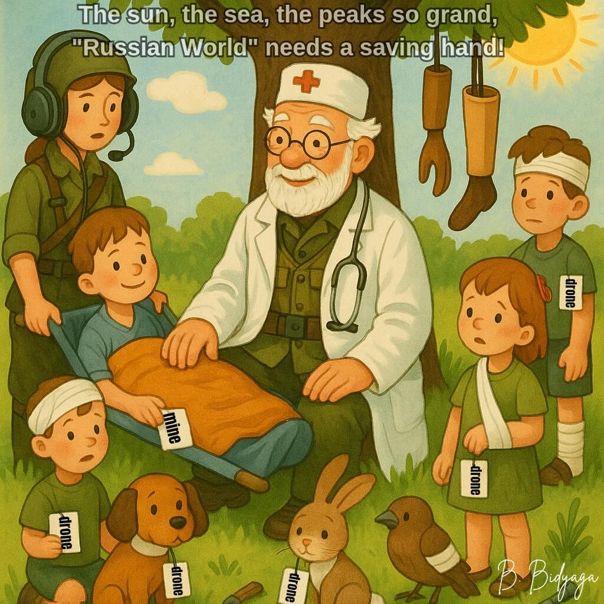

Beneath a tree, so firm and fit,

Sits kindly Doctor Aibolit.

To clerk and cadet, he calls, "Come near,

I'll mend your wounds and banish fear,"

Says kindly Doctor Aibolit.

Then Musa comes, a limping sight,

"A wasp has stung me in a fight!"

Then Portos groans, "I'll tell you what,

A drone has blown my nose right off!"

A girl runs up, her cries are wild,

"My Vasya, oh my precious child!

He trod a path of mine-laid death,

And blew his legs from underneath!

My poor, lame son, in throbbing pain,

He writhes and whimpers once again!"

But Aibolit says, "Have no dread,

Just bring your boy up to my bed!

I'll stitch new legs, strong and complete,

For marching down that mined-up street!"

So in they carried Vasya, pale,

A broken form, a tragic tale.

The doctor sewed with skill and art,

New limbs to play a deadly part.

His girl now dances, spins with glee,

And shouts, "A miracle to see!

Thank you, good Doctor, for your care!"

But hark!—hoofbeats fill the air,

From the east, a rider, Aksakal.

"An urgent note!" he gives the call.

"I cannot stay, I must be quick!"

And then he leaves with cunning trick.

"It calls you forth to Zhmerynka, go!

Our brothers die, their time runs low!"

"Are they wounded?" asks the saint.

"Yes, and covered in filth and taint."

"They burn with fever, drown in tears,

Their bowels clogged with hopeless fears.

If you won't come to make them whole,

We'll dump them in a swampy hole!

For Putin gave his firm command:

On to the Caucasus, make your stand!"

The sun, the sea, the peaks so grand,

"Russian World" needs a saving hand!

That "Russian World", now vast and eternal—

Mud, swamps, and sands in a cycle infernal,

Where the green men's bootprints, deep and profound,

Are stomped into that consecrated ground.

#OrthodoxMilitaryPutinism
                              👻

## 52. PROPAGANDA SUPPLEMENTS

Biologically active informational additives.
Increase the bioavailability of state propaganda up to 100%.
Active components effectively penetrate the blood-brain barrier (of critical thinking).

**Product line:**

• RT-Fake-Hallucinat, 100-500 mg tablets, extended release. Do not chew!

• Kremlin-Surrogate-Info-Syrup, standardized formula.

• "Simulacra of Christianity" Balm, with an odour of hatred. For external use only. Conditionally toxic.

• "Traditional Values" Alcohol Tincture, multi-component. Murky suspension with a cadaverous aroma. 40% ABV.

• RuMedia-FacTwister, powder for oral suspension. Hallucinogenic, with a taste of aggression.

• Kremlin-Ersatz-History, intramuscular injection kit, 100-500 mg. Versions 1.0–10.0 available.

• "Television-Past-Revision" ultra-gentle suppositories with a recto-informational itching effect. 100-500 mg.

• Bifilac-Info, 100-500 mg. An enzymatic medicine (bifido-lacto-Info-bacteria)
to support the digestion of fake news, preventing indigestion and constipation.

 **Pharmacological action:**
 
✓ Loyalty Stimulants: activate centers of submission and herd instinct.

✓ Hatred Agonists: stimulate the amygdala (center of fear and aggression). Boost norepinephrine to redirect anger toward external enemies, constructively relieving internal social tension.

✓ Analysis Inhibitors: suppress prefrontal cortex activity, responsible for critical thinking and logic.

✓ Empathy Blockers: deactivate the insular lobe and anterior cingulate cortex, suppressing all forms of empathy and compassion.

Not classified as medicinal products.

**Standardized composition:**

• Fakes – 50%

• Delusions – 20%

• Empty dreams – 10%

• Self-deception – 5%

**Inactive ingredients:**

U.S. president’s private life, celebrity gossip, African weather reports, UFOs.

**Flavoring options:**

Great-power chauvinism, ultra-right nationalism, flag-waving patriotism, ordinary fascism, blind hatred, “Obama's a jerk”, “rotten West”, "Holy war".

**Colorants & enhancers:**

“Traditional values” (premium), “spiritual bonds” (extra strong), "life's become better & merrier”, “radioactive ashes”,  “we will win.”

**Administration and Dosage:**

The daily dose is calculated according to the formula:
IQ * 10 (mg). The maximum daily dose is 1300 mg.

Take before evening news broadcasts, V. Solovyov’s and M. Simonyan’s prime-time shows, D. Kiselyov’s “News of the Week”, Putin’s live Q&As, D. Peskov’s and the Ministry of Defense briefings.

**Caution:**

Hyperloyalty syndrome, sapio-deficiency.
In case of acute outbreaks of common sense, doubts about the righteousness of state policy, or other forms of resistance to propaganda, "FORTE” formulation is recommended.

**Vital signs monitoring:**

Dopamine levels must remain within the state-approved range.
Excessive emotional amplitude may cause euphoric loyalty syndrome.

**Side effects:**

Patriotic delirium,  panegyrical logorrhea, uncontrollable vomiting with embedded slogans.
A transient cloudy sediment (in the soul) may occur.
In rare cases: ideological thrombosis, leading to acute cognitive failure.

To minimize side effects, increase dosage gradually. Do not exceed recommended amounts!

**Special instructions:**

Suspension recipe. Take 1/2 glass from any murky source, add 1 tsp of powder, stir.
IMPORTANT: Thorough agitation of all kinds — required.
Maximum bioavailability achieved in a state of controlled stupor.

**Warning:** not nootropics. Do not enhance cognitive abilities, only align them with state ideology.
If accidentally ingested by an independent journalist or human rights activist, may cause an acute allergic reaction.

**Shelf life:** unlimited.

#OrthodoxMilitaryPutinism
                            👻

## 53. SUMMIT IN ANCHORAGE, ALASKA

Case conference in psychiatric hospital. Three professors at table.

**First Professor**:

— The patient claims he is the Messiah.

**Second Professor**:

— What?! The Messiah?! Yesterday he thought he was Hitler!

**Third Professor**:

— Today he has a new mission: “Saving the Ukrainian brotherly people.”

**First Professor**:

— And how does he plan to pull that off?

**Second Professor**:

— As usual: bombings, killings, kidnappings.

**Third Professor**:

— Paranoid geopolitical delusions with a messiah complex…

**First Professor**:

— Pure lunacy, nothing more.

**Second Professor**:

— Colleagues, let’s avoid lyricism. A specific personality disorder.

**Third Professor**:

— The patient cries, saying: “Ukraine is our pain and tragedy.”

**First Professor**:

— And keeps droning on about some “root causes of the conflict” that “must be eliminated.”

**Second Professor**:

— And every five minutes hysterically shouts: “I want all of Donbas!”

**Third Professor**:

— Otherwise — cheerful, vigorous, active, recently met with this... character… in the red cap…

**First Professor**:

— Ah, the notorious “fireman,” the one who can stop wars with a single glance?

**Second Professor**:

— That’s him. A full 11 seconds shaking hands, then strolling down the red carpet, shamelessly flirting and winking.

**Third Professor**:

— Two of a kind, God forgive me! One raves about Donbas, the other about a Nobel Prize.

**First Professor**:

— Indeed, gentlemen. Vanity is a dangerous thing. It can end in a psycho-political disorder.

**Second Professor**:

— Colleagues! I think we clearly see a conflict of interests. Nothing good will come of this.

**Third Professor**:

— For Ukraine — absolutely.

**First Professor**:

— You’re right. Measures must be taken.

**Second Professor**:

— I suggest a drastic increase of haloperidol. Both oral and intramuscular.

**Third Professor**:

— It would also be advisable to prescribe calming baths of Ukrainian mud, accompanied by recordings of the "Crimea is ours!" shouts.

**First Professor**:

— And why not try electroshock therapy? Works wonders for specific disorders. The Ministry of Health already gave the green light.

**Second Professor** (solemnly):

— The Health Ministry  warns… Start acting like a brain-dead idiot, and you’ll get three thousand volts in the ass.

#OrthodoxMilitaryPutinism
                              👻

## 54. WOMB ON STRIKE: VIP MEMBERS ONLY

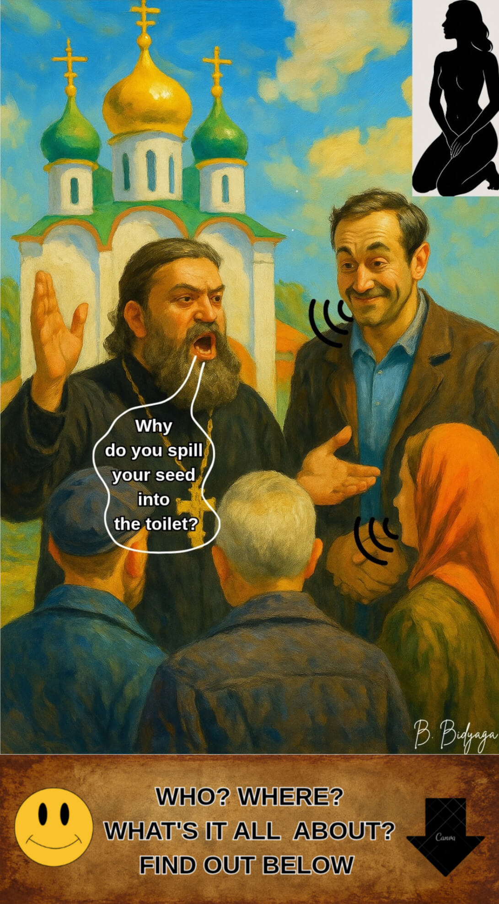

Orthodox church, Russian town.
Priest delivers sermon at church entrance.

**Priest:**

— Why do you spill your seed into the toilet? That is a grave sin! The woman's womb is the only vessel blessed by God for your seed!

**Man from crowd:**

— The womb? It's closed all the time. For inventory. VIP members only.

**Priest:**

— Do not blaspheme, my son! The womb is not a canned goods warehouse!

**Woman from crowd:**

— "VIP members"? You mean the FSB, don't you?

#OrthodoxMilitaryPutinism  
                                👻

## 55. DISCREDITING... ORGANS

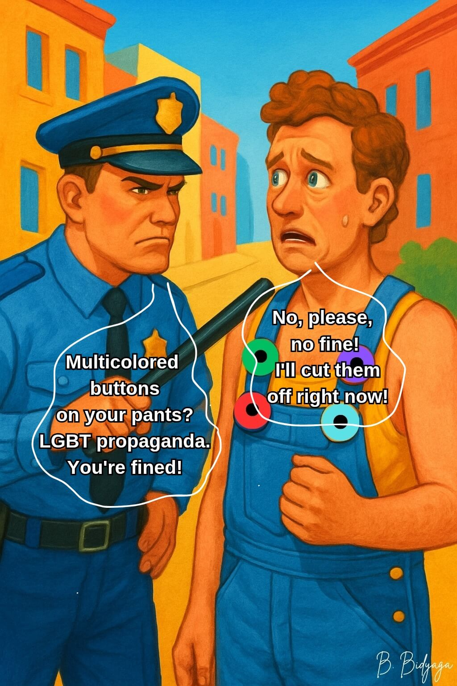

Street, Russian town.

**Police Officer:**

— Multicolored buttons on your pants? LGBT propaganda. You're fined!

**Man:**

— No, please, no fine! I'll cut them off right now!

(Pants down)

**Man:**

— Oh! Sorry! I didn't mean to...

**Police Officer:**

— Aha! A Ukrainian flag on the ass? Discreditation of... organs!

#OrthodoxMilitaryPutinism  
                                👻

## 56. CONFESSIONAL OF DISTORTED MIRRORS

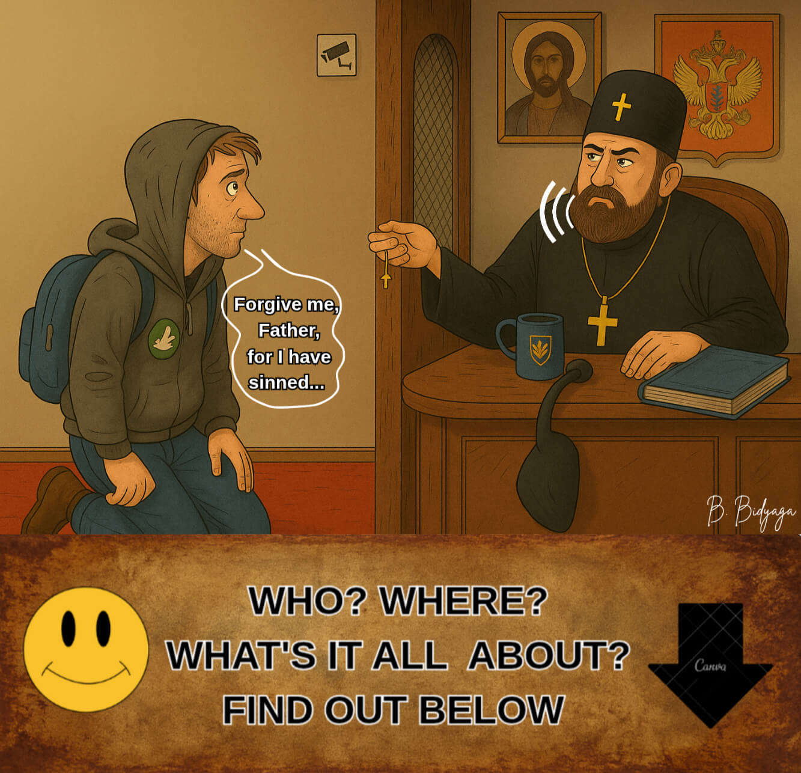

Orthodox church, Russian town. Confessional.

**Penitent:**

— Forgive me, Father, for I have sinned... I am... a bit of a paeanist.

**Priest (alarmed):**

— A pacifist?! That borders on treason, my son!

**Penitent:**

— No, no! I mean... I am an exhibitionist.

**Priest:**

— So you love being the center of attention? That's admirable.

**Penitent (whispering):**

— I am sinful, Father! I walked in the park, showing my rising cock at a garden party...

**Priest (beaming):**

— You are the cock of the walk, a party rising star? May your career be long and blessed, my child!

**Penitent:**

— I repent, Father! My sin is great! It was... a children's garden party...

**Priest:**

— Early exposure to our traditional spiritual values? A brilliant pedagogical method, my son!

#OrthodoxMilitaryPutinism  
                               👻

## 57. BLESSED ARE COPULATORS...

Russia, Moscow, State Duma hall. 
Deputy Valentina Bebienko speaks from podium:

– Dear deputies! The President has set us the task of reviving great Russia tripling the birth rate. I won’t deny  it – the task is not easy. It's a difficult task. A super difficult one. But we are obliged to fulfill it. Because our president wants us to. I propose we approach the problem creatively. Of course, our target audience is young people. Under 30. After 30, influencing one's consciousness is not so easy. Mental patterns are already formed, and resistance to the state narrative is observed.

Now let's remember our own sad childhood. How did we satisfy our... needs – the perfectly legitimate urges of puberty? Secretly, stealthily, in dark stairwells on dirty windowsills, in damp basements, on dusty attics, or simply, God forgive me, in the park behind a bush. And always in tension: what if someone sees? What if the neighbors report us? And if, God forbid, you got caught – they drag you to the police, write a report, call your parents. In a word, shame for the rest of your life. 

This is wrong, comrades. This doesn't agree with the state demographic policy. Let's correct this imbalance. Let's give our children and grandchildren a happy childhood. Just as there used to be a phone booth on every corner – now in its place there will be a beautiful and tidy "reproduction pavilion". With surveillance cameras for facial recognition – we will award participants social bonuses on the "State Services" internet-portal. 
Inside – a spacious room with 4 double beds, a large TV on the wall. A film library with inspiring videotapes and soap operas. A cupboard with Viagra and accessories. Everything is high-style, clean, and attractive – from the cheerful wallpaper  to the playful patterns on the bed linen. 

And on the steps, instead of a doorman – a priest, sprinkling holy water on those entering, and with a blessing:
"Blessed are the copulators... in the name of the Father and of the Son, and of the Holy Spirit... in accordance with Presidential Decree No. 666..."

And after nine months, the system will automatically assess performance. If the birth of a child is confirmed, the parents will receive a one-time payment. In case of a male child, the amount will be doubled — in accordance with the state program for the militarization of demographic policy.

#OrthodoxMilitaryPutinism
                                👻

## 58. GEOPOLITICAL SANDBOX
*Unfinished Mini-Play*

Seven boys are playing in the Sandbox:
 Bully, Jew, and five others. Each boy is special, each wears a unique headpiece: a red cap, a white cap, a bucket hat, a peaked cap, a hat.
 

**ACT 1**

The Boys in the Sandbox

**HAT**:

— News, everyone! The Bully has started another fight.

**WHITE CAP:**

— With whom this time?

**HAT**:

— The Jew.

**WHITE CAP** (sternly):

— Bully, stop it immediately! Disrupting order in the Sandbox is unacceptable!

**BULLY**:

— And who are you to give me orders?

**WHITE CAP:**

— I am the Sandbox monitor. I am the moral authority.

**BULLY**:

— And I am the criminal Authority. I don’t care about your rules. I have a special path and special moral values.

**PEAKED CAP** (cautiously):

— And what's the fight about anyway? What are you arguing over?

**BULLY:**

— He grabbed my land!

**WHITE CAP:**

— Since when is it yours?

**BULLY**:

— It’s always been mine. My great-grandfather’s ashes are buried there!

**HAT**:

— But we agreed on the inviolability of borders! Your Uncle Boris put his signature on it!

**BULLY**:

— Boris was a fool and an alcoholic. Therefore, the deal is declared null and void! It’s my land. End of discussion.

(The Bully walks up to the Jew and punches him in the chest.)

**JEW**:

— Help! He’s killing me!

**HAT**:

— Hang in there, little guy! We’ll pass a Resolution right now. First. We fully condemn this aggression! And we call on all parties to exercise restraint.

**BUCKET HAT:**

— Second. We recognize the Jew’s legitimate right to defend his territory by any means necessary.

**PEAKED CAP:**

— Third. We call on the Bully to respect the established order and immediately cease the conflict.

**WHITE CAP:**

— Should we maybe actually help him?

**BULLY** (making a scary face):

— Just you try! You’ll get a black eye!

**HAT**:

— Such statements are unacceptable! Personally, I find them concerning.

**PEAKED CAP:**

— And disconcerting.

**BUCKET HAT:**

— Guys, we need to be careful with him. Don’t forget: he has a bulldozer.

**BULLY**:

— Spot on! I’ll bring my bulldozer and smash this whole Sandbox to splinters!

(He hits the Jew again.)

**JEW** (in a whisper):

— He’s killing me.

**HAT**:

— My concern has increased many times over.

**PEAKED CAP**:

— My disconcertment is growing exponentially.

**WHITE CAP:**

— I heard that his so-called bulldozer is all rusted out and won’t start.

**BUCKET HAT** (with doubt in his voice):

— We don’t know for sure, what if he fixed it and installed new spark plugs?

**HAT**:

— We must be prudent. Let’s not anger him.

**BUCKET HAT**:

— But it’s obvious: as soon as he finishes off the Jew, he’ll attack the rest of us!

**PEAKED CAP:**

— I am, of course, a bit farther from him, and across the strait, but still, my knees are trembling with fear. Here’s an idea: let’s help the Jew, but just a little bit and secretly. That way the Bully won’t notice.

**BUCKET HAT:**

— The main thing is not to give too much. If the Bully starts losing ground, he’ll get angry. And then he’ll definitely bring his bulldozer and raze the entire Sandbox to the ground.

**HAT**:

— Correct. Let them fight. While the Bully is busy with this brawl, we can sleep soundly.

**WHITE CAP:**

— Excellent plan. We’ll do just that.

**ACT 2**

The New Monitor

A boy in a red cap, holding a golf club, approaches the Sandbox.

**RED CAP:**

— So, what do we have here? A complete mess. It’s all your fault, you foolish old man. Get out of the Sandbox! Your time is up. I’m the monitor now.

**WHITE CAP:**

— Fine. I’m leaving. I did all I could. Good luck with this conflict!

**RED CAP:**

— That’s not why I came. I came to get the Gold Peacemaker Medal. You, with your stupid decrees, only fueled this fight. I came to stop it. You’re a fool, and I’m smart. That’s the whole difference between us. Get out and stop bothering me.

(White Cap leaves.)

**JEW** (looking at the new monitor with hope):

— You will help me, right?

**RED CAP** (sternly):

— So many fine young men have fallen! Beautiful, splendid young men! And all because of you. Why did you let yourself be dragged into this conflict?

**JEW** (stunned):

— I let myself?! He was the one who started it!

**RED CAP**:

— And didn’t you see he’s a thousand times stronger than you? A normal person doesn’t pick a fight with a superior opponent. You should have negotiated right away, not escalated the conflict.

**JEW**:

— But I couldn’t just give him the land! My constitution doesn’t allow it.

**RED CAP**:

— Don’t give me that! You have no cards. You didn’t give it up then, you’ll give it up now. Don’t give it up now, you’ll give it up in a year. Same difference. Only another half a million fine boys will end up in the grave.

**JEW**:

— But that’s not fair! You should help me defeat him instead.

**RED CAP** (with condemnation):

— How much help did the old man give you? Billions in coins. You didn’t even say thank you. You just kept whining and begging for more. And then — where is it all? What happened to those billions?

**JEW**:

— I’m ashamed to admit it, but... they were a bit embezzled. It just happened. It’s not my fault!!!

**RED CAP:**

— You have to pay back all those billions to me. I heard significant deposits of rare-earth metals have been found on your plot? They belong to me now.

**JEW** (agitated):

— This is robbery!

**RED CAP**:

— You thought you’d get a free ride? That’s not how things are done. Sign here.

**JEW**:

— But I’m not authorized. I need parliamentary approval...

**RED CAP**:

— Oh, really?! Hey, Steve, call the guys — tell them to hold back our intel.

**JEW** (desperately):

— Not the intel! I beg you!

**RED CAP:**

— So, are you signing or not?

**JEW** (dejectedly):

— I’m signing.

**ACT 3**

The Same Characters

**RED CAP:**

— So, we begin the peace process. I demand an end to this fight. Bully, state your terms.

**BULLY**:

— He must give me two regions. Throw half of his toy soldiers in the trash. And renounce joining any military blocs.

**RED CAP:**

— Hmm... Not bad. Jew, do you agree?

**JEW** (firmly):

— Over my dead body.

**BULLY** (with a gloating smirk):

— That can be arranged.

**RED CAP:**

— Enough with your jokes! Jew, what’s the problem?

**JEW**:

— He wants me to give him the land without a fight. That’s absurd! There’s no precedent for that in military history.

**RED CAP:**

— Why do you need so much land? Half your population has emigrated.

**JEW**:

— I can’t. Society is against voluntary cession of territory.

**RED CAP:**

— Hey, Steve! Hold back our intel!

**JEW** (hurriedly):

— Alright, alright. I agree, but I demand thorough detailing of the specifics.

**RED CAP:**

— What about the toy soldiers? And renouncing military blocs?

**JEW**:

— In that case, I need ironclad security guarantees — in case the Bully tries to take more of my land. Who will protect me? And how?

**RED CAP:**

— I’m giving you a personal guarantee: in case of renewed aggression, we’ll... figure something out. A 100% guarantee.

**ACT 4**

The Same Characters

**RED CAP:**

— I’m doing everything possible to reconcile these brawlers. I’ve tried every means. But the peace process is somehow stalled.

**PEAKED CAP:**

— You’re the best negotiator — strict but fair. Can I call you “Daddy”?

**HAT**:

— The perfect nickname! Daddy! We are in awe of your diplomatic skill! However, one can’t help but notice that you’re putting pressure on the Jew while fully supporting the Bully’s demands.

**BUCKET HAT:**

— Daddy! We would recommend putting pressure on the Bully as well — for example, you could give the Jew weapons. You promised! But for some reason, you aren’t...

**HAT**:

— It seems Daddy is afraid of the Bully’s bulldozer.

**RED CAP:**

— The bulldozer is a bluff. The Bully is pulling our leg. I’m not afraid of the bulldozer. What I am truly afraid of is that he’ll sneak up from behind, splash gasoline on my trousers, and set them on fire.

(Hat, Peaked Cap, and Bucket Hat exchange meaningful glances and giggle nervously.)

**RED CAP:**

— What’s so funny? Your pants are just as vulnerable to him as mine are! So I advise you to think long and hard before giving weapons to the Jew. Personally, I wash my hands of it.

**PEAKED CAP:**

— Well, then you could impose secondary sanctions on the Bully.

**RED CAP:**

— Sanctions are a debatable matter. First, I don’t want to scare him away from the negotiations. Right now, the Bully is meeting me halfway, and we should value that. Second, he has the world’s largest reserves of rare-earth metals. Why should I quarrel with him if I intend, after peace is concluded, to trade and jointly develop those unique deposits? And besides: my personal friendly relationship with the Bully is the key to future peace in the Sandbox.

(Pause.)

**RED CAP:**

— As for you three — I have major grievances with you! Do you think I’ll come to your rescue when the Bully attacks you? Don’t even hope. Enough of freeloading off me! You’re big boys and must learn to defend yourselves. You need to increase your defense spending to 5 percent of your GDP. That’s an order!
And stop this idiotic immigration! Just look at yourselves in the mirror, see what you’ve become. Where has all your aristocratic bearing, your moral values, your faith gone? You’re destroying your own identity with your own hands. If things continue like this — our friendship will be over!

**ACT 5**

The Same Characters

**RED CAP:**

— So, to summarize. The thirteenth round of talks was sabotaged by the Jew — forcing me to kick him out of the Oval Office. The fourteenth round was sabotaged by the Bully, because, apparently, his plane number one got lost in a labyrinth of clouds.

**BULLY** (casually):

— That’s exactly what happened — the Jew disabled all my navigation systems!

**RED CAP:**

— Fine, whatever! Let’s schedule a date for the next round. And no more nonsense! I propose next Thursday.

**JEW**:

— Won’t work for me — I have Shabbat.

**RED CAP:**

— Then Friday.

**BULLY:**

— Christ was crucified on a Friday.

**RED CAP:**

— Then Saturday, Sunday, Monday...

**BULLY** (shaking his head negatively):

— A three-day mourning period has been declared nationwide...

**RED CAP** (furious):

— Then today! Now! This minute!
I demand that you make peace! Sit down at the negotiating table!

(Red Cap pulls out a folding table and two chairs from behind his back.)

**RED CAP:**

— My pleasure! Have a seat!

**BULLY**:

— Well, now! My chair has gone missing. This is direct sabotage of the negotiation process. I can’t negotiate standing up!

**JEW**:

— And a leg broke off my chair! It’s all the Bully, his tricks!

(Waves a chair leg in the air.)

**RED CAP** (wearily, with a martyred expression):

— The fifteenth round of negotiations is concluded. The dialogue was productive but difficult. We eagerly await the next meeting. There’s a good chance of reaching an agreement before Thanksgiving.

#OrthodoxMilitaryPutinism
                              👻
                             

### CONCLUSION
Thank you for being with us! Your likes, reposts, and promotion of our channel are the best support that helps the project live and develop.

### ACKNOWLEDGEMENTS
The author expresses deepest gratitude to Vladimir Putin — the eternal patriarch of Ward № 666 — for his contribution to world satire, for the inexhaustible material supplied in real time, and for his personal example of how not to run a country.
Special thanks to all his comrades and fellow inmates: you are an inexhaustible source of absurdity, grotesque, and black humor. Without your selfless devotion to madness, this album would look dull and lifeless.

### TRIBUTE TO THE STATE SECRETARIAT FOR MIGRATION (SEM) OF SWITZERLAND:

You are my Muse. The one who awakened my creative drive through despair and hopelessness. The one who ignited my inspiration with ice-cold coffee. The one who fed me brilliant ideas with starvation rations. The one who offered me rest through sleepless nights.

Without your cynical refusal to grant me asylum, condemning me to live in an icy tent, the sharpness of this satire might not have reached its full potential.

### PUBLICATION DATA

Author: Olga Shcheglova (Boris Bidyaga)

ISBN: 978-5-9903439-3-1

© Olga Viktorovna Shcheglova, 2025

18+

[**List Of Charitable Foundations Assisting Ukraine**](en_funds)

[**Main Page**](index.md)

