[**Page d'accueil**](index.md)

# 🇫🇷 CHAMBRE N°666 
### LE GRAND ALBUM DE MINIATURES SATIRIQUES

**Auteur : Olga Shcheglova (Boris Bidyaga)**

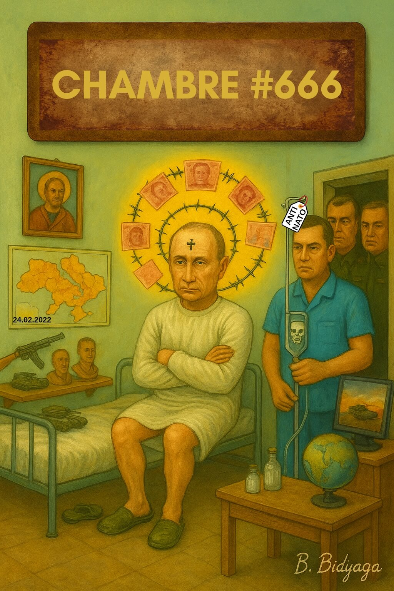

### INTRODUCTION

Ce qui se trouve devant vous n’est pas seulement un recueil de caricatures. C’est une coupe anatomique de l’ère Poutine : le poutinisme militaire orthodoxe comme forme de folie collective.
On y trouve des icônes avec des dieux païens, des baptêmes dans les tranchées, de l’eau bénite — injectée par voie intramusculaire. Ici, le patriotisme se pare d’une chaussette sur le sexe et les dauphins de combat du Pentagone nagent au service de la guerre.
Dans ces miniatures se dessine une société où la guerre a remplacé le bon sens, les « valeurs traditionnelles » ont remplacé la conscience, et l’orthodoxie est devenue le « lubrifiant » des lance-missiles. Les prêtres bénissent la violence, les députés marchandent le patriotisme, et l’école n’enseigne plus à penser, mais à enfanter et obéir.

Bonne lecture !
N'oubliez pas de liker, de reposter et de partager le lien avec vos amis. Votre engagement est le meilleur soutien pour le projet !

## 1. PATRIOTISME AVEC UNE CHAUSSETTE SUR LA BITE

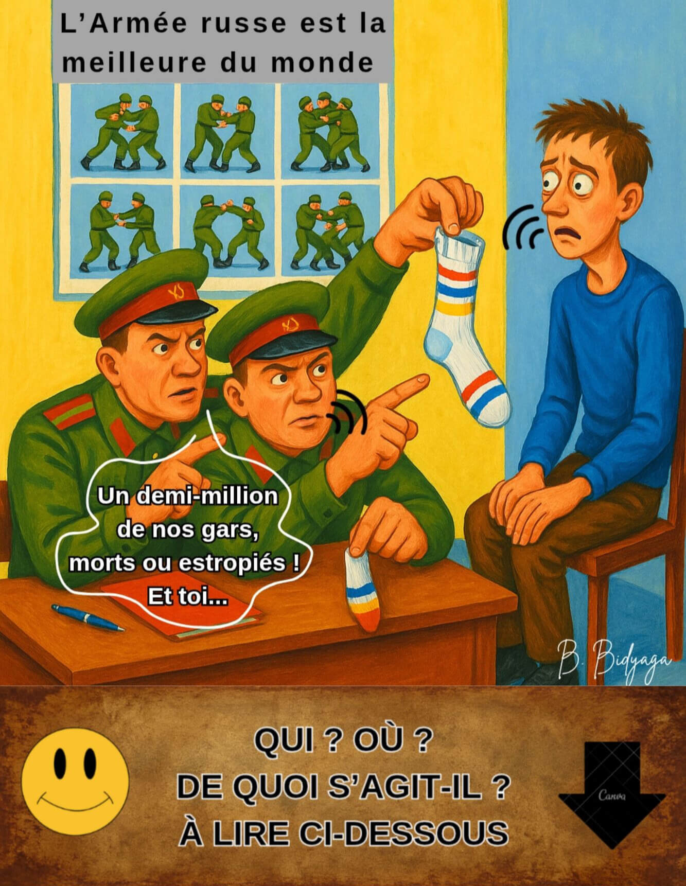

Bureau du commissariat militaire, ville russe. Deux officiers assis à une table face à un chanteur de variétés.

**Premier officier** :

— Un demi-million de nos gars sont morts ou mutilés !
Et toi ? Tu fais la fête à poil avec une chaussette sur la bite ?!

**Chanteur** :

— Je reconnais mes torts ! Demain, je pars à Bakhmout… pour donner un concert !

**Deuxième officier** :

— Exactement. Demain, tu pars à Bakhmout… comme fantassin d’assaut.

#PoutinismeMilitaireOrthodoxe
                                👻

## 2. LES ORDURES DE LA VICTOIRE : RENDEZ VOS BOÎTES ! CHAQUE CONSERVE ÉCLAIRE LE CHEMIN !

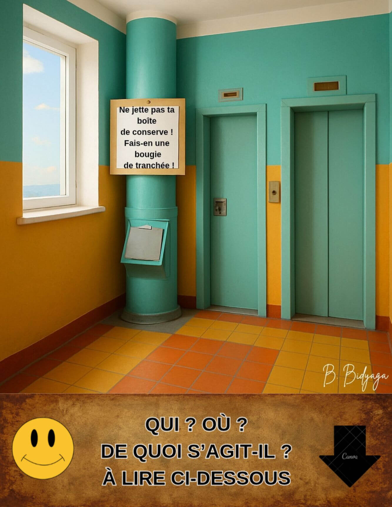

Moscou, Russie. Hall d’ascenseur d’un immeuble standard. Affiche sur le vide-ordures :
*« Ne jette pas ta boîte de conserve ! Fais-en une bougie de tranchée ! »*

#PoutinismeMilitaireOrthodoxe
                                👻

## 3. MANUEL DU FSB : HANDICAPÉ + PERMANGANATE = SABOTEUR UKRAINIEN

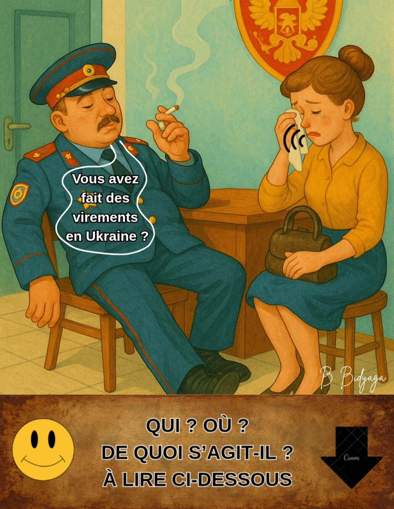

Commissariat de police, ville russe. Un officier interroge une femme.

**Officier** :

— Vous avez fait des virements en Ukraine ?

**Femme** :

— Oui, j’ai envoyé 50 $ à mon frère à Kiev. Il est invalide, complètement impuissant, il a besoin de médicaments...

**Officier** :

— Félicitations, madame — vous voilà inculpée. Article 275 du Code pénal. Vous savez ce que ça veut dire ? Financement des Forces armées ukrainiennes. Haute trahison !

#PoutinismeMilitaireOrthodoxe
                                👻

## 4. PRIVATISATION DES RUINES

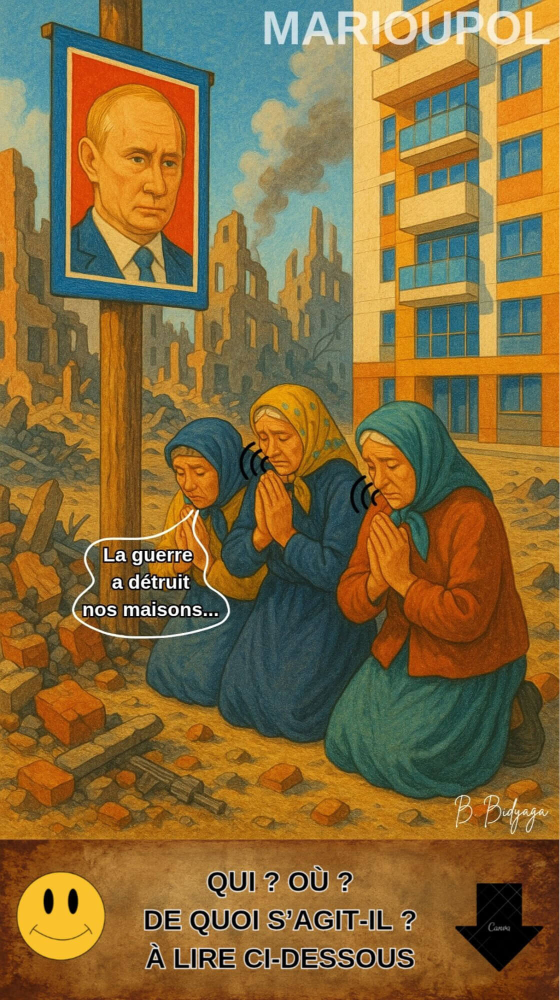

Marioupol, ville ukrainienne détruite. Devant un immeuble tout juste reconstruit, trois femmes prient devant le portrait du président russe Vladimir Poutine.

**Première femme** :

— La guerre a détruit nos maisons. Nous vivons dans la rue.

**Deuxième femme** :

— Ils ont construit un nouvel immeuble, mais les appartements sont à vendre.

**Troisième femme** :

— Nous n’avons pas les moyens d’acheter un logement — nous ne sommes que des mendiantes.

**Les trois femmes, en chœur** :

— Poutine, aide-nous !

#PoutinismeMilitaireOrthodoxe
                                👻

## 5. L’EFFET SPÉCIAL DE TUNGUSKA : ON PEUT LE RECOMMENCER !

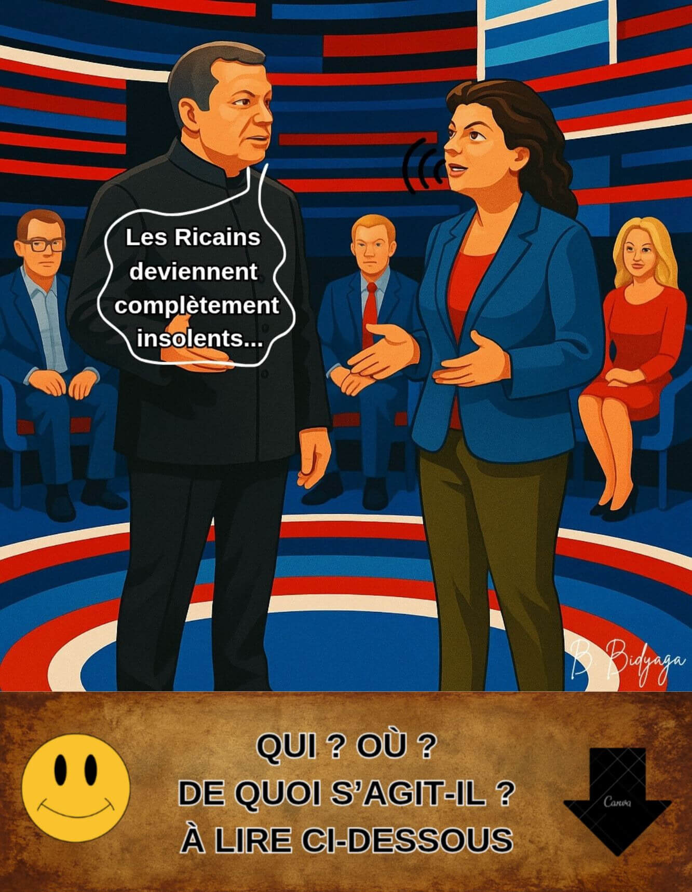

Moscou, Russie. Studio du propagandiste Vladimir Solovyov. Il discute avec une autre célébrité du genre, Margarita Simonyan.

**Solovyov** :

— Les Ricains deviennent complètement insolents ! Ils ont arrêté d’avoir peur de nous ! C’est insensé !

**Simonyan** :

— Alors il faut leur faire peur. Voilà ce qu’on va faire : un essai nucléaire spectaculaire en direct à la télé ! On fait exploser quelques bombes à neutrons sympas, de puissance moyenne. Juste deux jolis champignons jumeaux au-dessus de la Toungouska. On fera des économies sur les feux d'artifice pour le 9 Mai. Qu’ils voient bien qu'ici, on est tous cinglés !

#PoutinismeMilitaireOrthodoxe
                                👻

## 6. LA BOTTE, OUTIL DE DÉLIMITATION

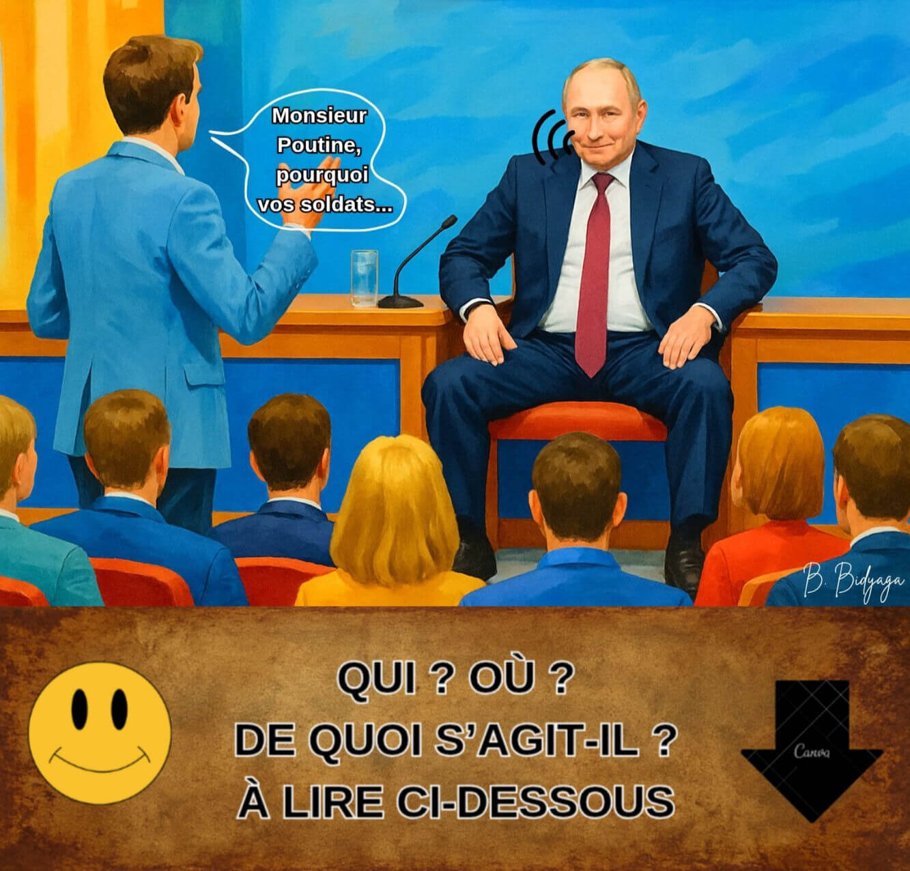

Conférence de presse du président russe Vladimir Poutine. Un journaliste étranger pose une question.

**Journaliste étranger** :

— Monsieur Poutine, pourquoi vos soldats « défendent la patrie », comme vous dites, sur le territoire d’un autre pays ?

**Poutine** :

— C’est une illusion d’optique.
Retenez cela une fois pour toutes. Là où la botte d’un soldat russe a foulé le sol, c’est le territoire de la Russie. Selon le droit international russe.

#PoutinismeMilitaireOrthodoxe
                                👻

## 7. PRIORITÉS : L’OPTIMISATION PAR L’AMPUTATION

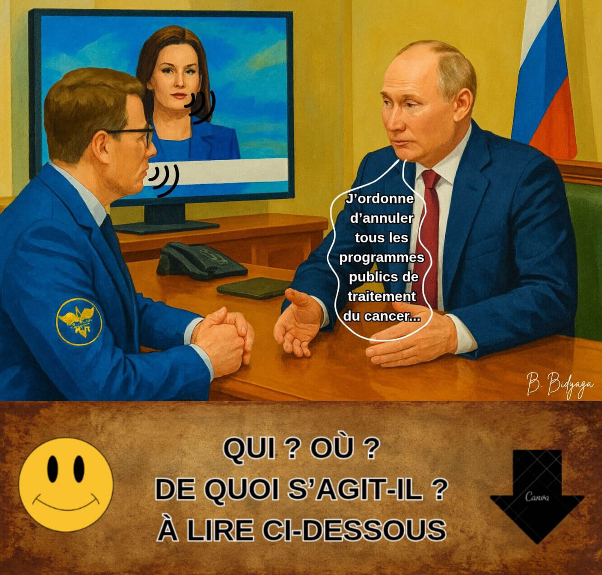

Russie, Moscou, Kremlin. 
Le président russe Vladimir Poutine et le ministre de la Santé Mikhaïl Mourachko sont à table.
À la télévision : une nouvelle — dans le budget russe, les dépenses de santé augmentent de 30 %.

**Poutine** :

— J’ordonne d’annuler tous les programmes publics de traitement du cancer ainsi que la distribution gratuite de médicaments. Tous les fonds ainsi libérés doivent être réorientés vers la production de prothèses et la réhabilitation des guerriers.

**Mourachko** :

— À vos ordres !

#PoutinismeMilitaireOrthodoxe
                                👻

## 8. RÉSEAUX DE GUERRE, LES ERSATZ DE POUTINE

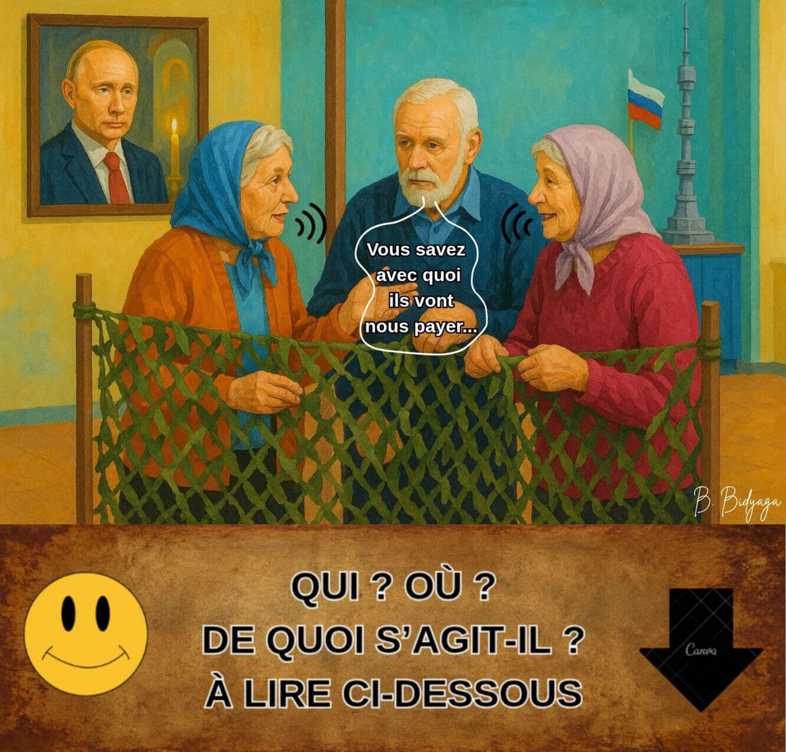

Moscou, Russie. Centre de loisirs pour retraités.
Deux vieilles femmes et un vieil homme tissent un filet de camouflage pour le front.

**Le vieil homme** :

— Vous savez avec quoi ils vont nous payer aujourd’hui ?

**Première vieille** :

— On dit qu’ils vont encore distribuer des chocolats « Poutine est avec nous ».

**Deuxième vieille** :

— Ce n’est pas du chocolat ! C’est du soja !

**Le vieil homme** :

— Comme toujours : d’abord ils promettent du chocolat, et puis ils nous refilent Poutine !

#PoutinismeMilitaireOrthodoxe
                                👻

## 9. RÉPONSE ASYMÉTRIQUE (« DE TOUTE FAÇON VOUS NE POUVEZ RIEN PROUVER »)

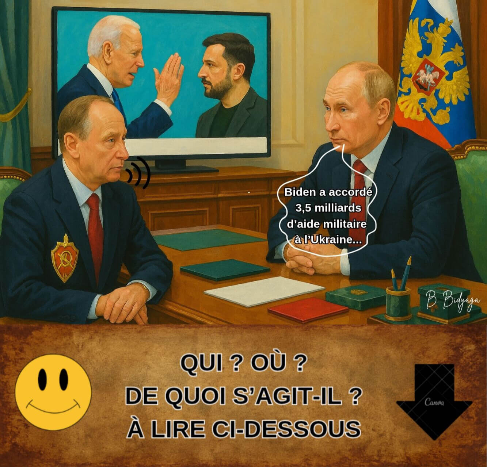

Russie, Moscou, Kremlin. Bureau présidentiel. Le président russe, Vladimir Poutine, et le secrétaire du Conseil de sécurité, Nikolaï Patrouchev,  sont à table.
Sur l'écran :  le président américain Joe Biden serre la main du président ukrainien Volodymyr Zelensky.

**Poutine** (avec une froide fureur) :

— Biden a accordé 3,5 milliards d’aide militaire à l’Ukraine. Ses HIMARS mettent le feu à mes raffineries dans tout le pays. C’en est trop. Nous ne sommes pas obligés de supporter ça. Donnez une réponse asymétrique.

**Patrouchev** :

— À vos ordres ! Nous allons organiser un “feu de Prométhée” au-dessus de son État favori. Là où résident son fils et cette idiote de Kamala Harris. C’est de sa faute — nous l’avions prévenu !

#PoutinismeMilitaireOrthodoxe
                                👻

## 10. COMPTABILITÉ DU FRONT : BLESSÉ = RECETTE

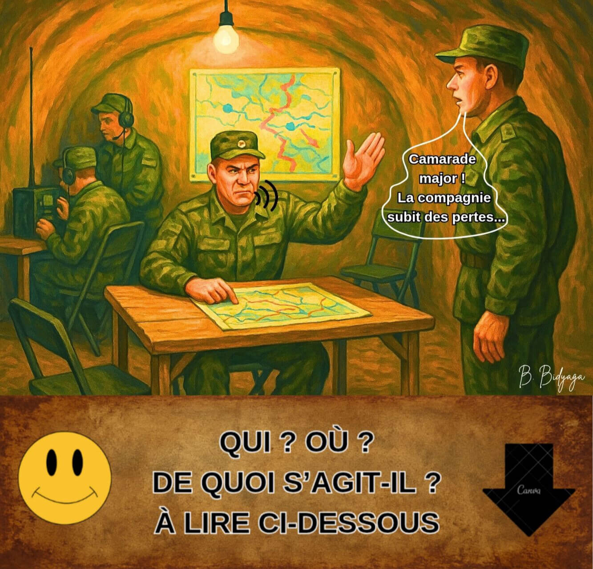

Front russo-ukrainien. Une tranchée aménagée en poste de commandement.
Un commandant et un sergent en dialogue.

**Sergent** :

— Camarade major ! La compagnie subit des pertes : sept blessés hurlent dans le no man’s land. On les évacue ?

**Commandant** (sans lever les yeux de son registre) :

— Pourquoi ? Qu’ils soient portés «en réserve». Nous toucherons la solde pour eux. L’essentiel, c’est que l’effectif sur le papier corresponde.

#PoutinismeMilitaireOrthodoxe
                                👻

## 11. L’HUMANISME PÉNITENTIAIRE À LA RUSSE   

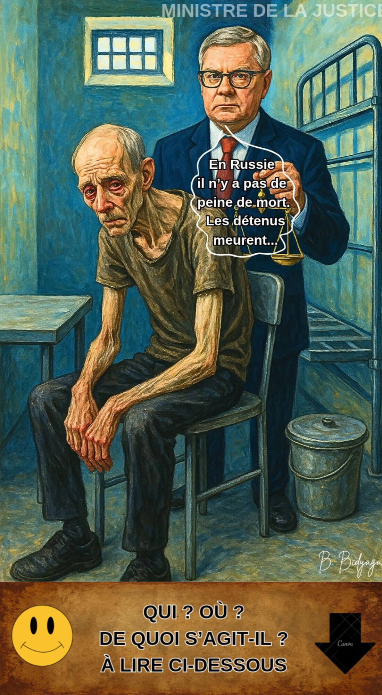

Cellule de prison russe.
Un détenu squelettique et maladif.
Derrière lui, le ministre de la Justice Konstantin Tchouïtchenko, les plateaux de la balance de Thémis en mains.

**Tchouïtchenko** :

— En Russie il n’y a pas de peine de mort. Les détenus meurent volontairement en prison — de honte et de remords.
Un nouveau programme étatique de stimulation humaine du départ volontaire est mis en place :

— perfusions de repentir,

— régime “éveil de la conscience” (ration carcérale n°1),

— aromathérapie “éducation patriotique” (seau-toilette ouvert dans les cellules disciplinaires).

La justice russe est la plus humaine du monde !

#PoutinismeMilitaireOrthodoxe
                                👻

## 12. LA DÉFENSE CONTRE LE BON SENS

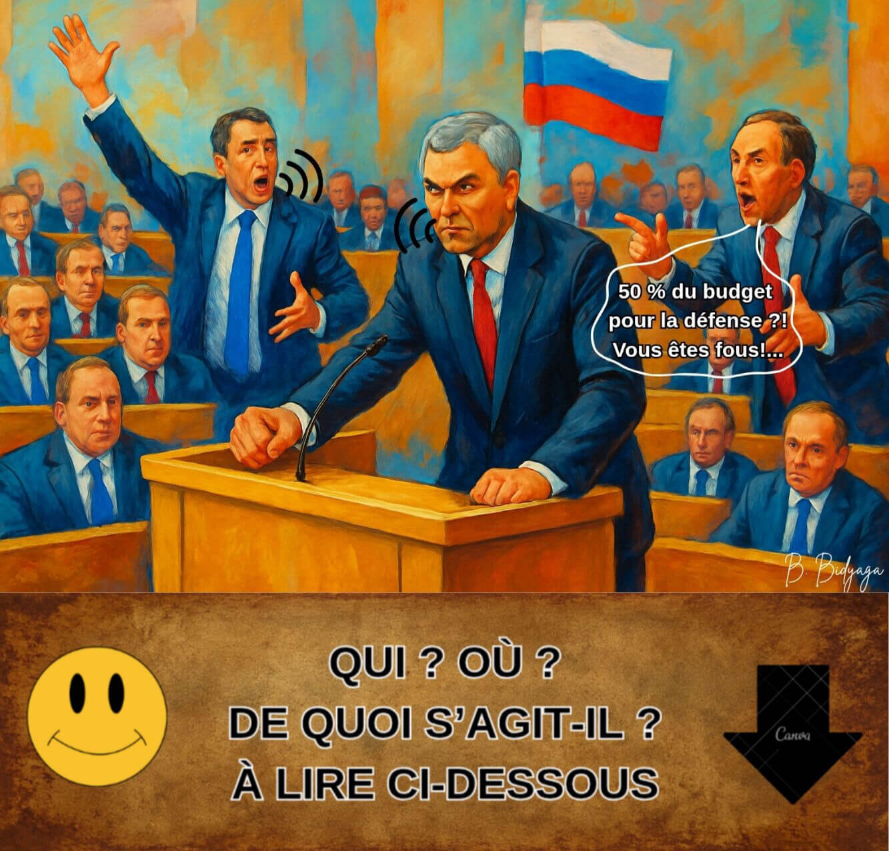

Russie, Moscou. Salle des séances de la Douma d’État. Débat budgétaire en cours.

**Premier député** :

— 50 % du budget pour la défense ?! Vous êtes fous ! Et la santé ? Et la science ? L’éducation ?!

**Deuxième député** :

— Notre objectif est la démilitarisation de l’Ukraine ! Il faut faire des sacrifices ! Les canons ne se fabriquent pas avec une imprimante 3D, vous savez.

**Premier député** :

— Mais en réalité, c’est la militarisation de la Russie ! On va tous finir en treillis !

**Viatcheslav Volodine, president de la Douma :**

— Débats clos ! Le budget est adopté à l’unanimité !

#PoutinismeMilitaireOrthodoxe
                                👻

## 13. ARME MORTELLE : GOBELET EN PLASTIQUE

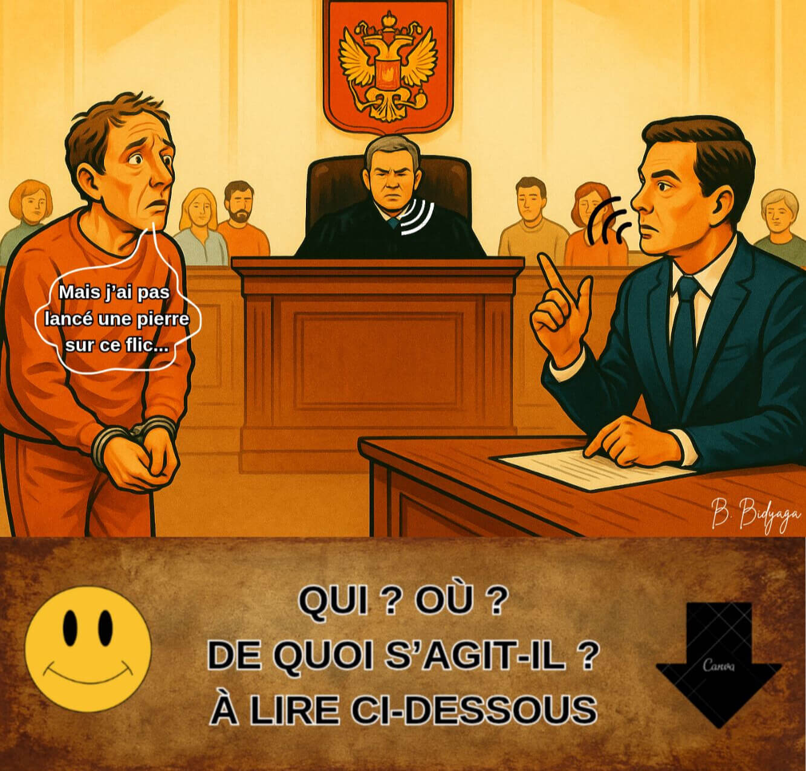

Salle d’audience d’un tribunal russe.
En présence du juge, un prévenu et son avocat.
Dialogue.

**Prévenu** :

— Mais j’ai pas lancé une pierre sur ce flic — seulement un gobelet en plastique !

**Avocat** :

— La peine est beaucoup trop sévère ! Nous demandons qu’elle soit allégée !

**Juge** :

— Je ne vois aucun motif d’allègement. Le crime est évident, même s’il n’a pas été achevé : d’abord le gobelet, ensuite la pierre. Appel visuel clair au terrorisme. Démonstration publique évidente de méthodes terroristes. La peine est maintenue !

#PoutinismeMilitaireOrthodoxe
                                👻

## 14. LOI SUR LES SCÉLÉRATS : PILLAGE PRÉVENTIF

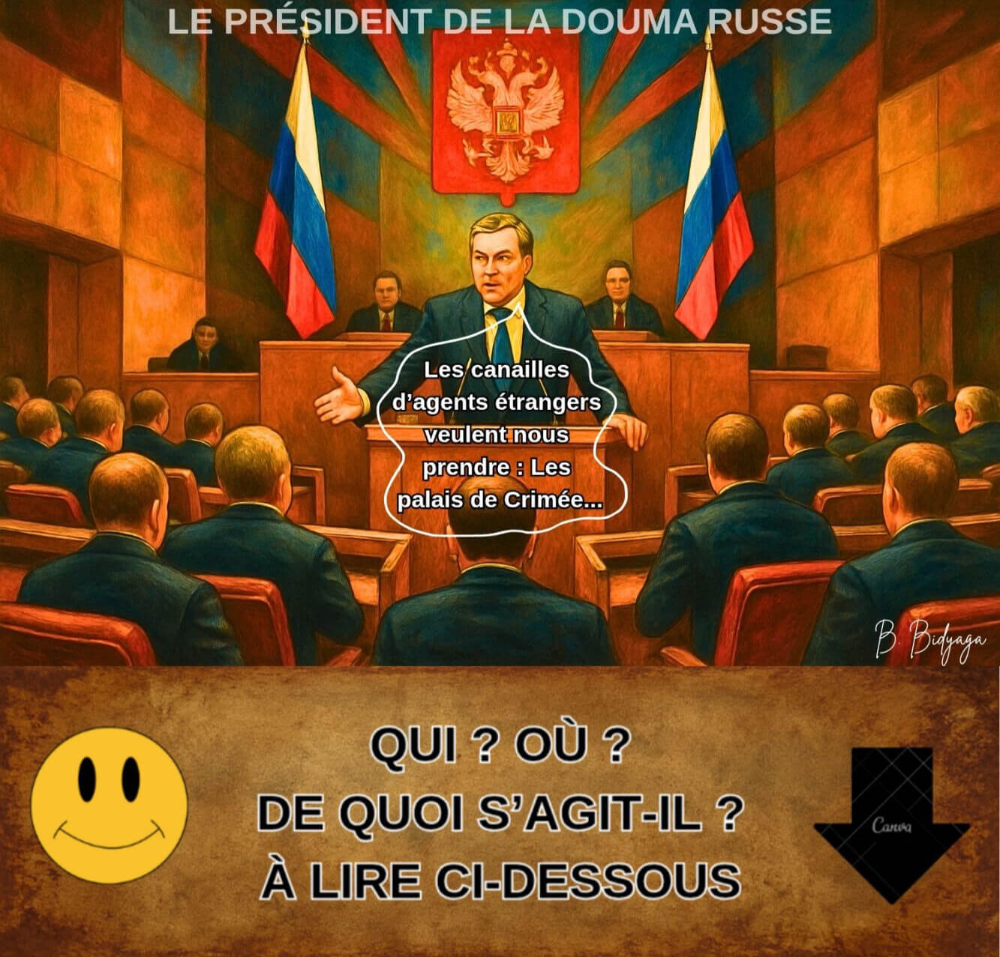

Russie, Moscou. Salle des séances de la Douma d’État. Son président Viatcheslav Volodine prononce un discours enflammé.

**Volodine** (avec emphase) :

— Les canailles d’agents étrangers veulent nous prendre :

• Les palais de Crimée (symbole de la grandeur russe !)

• Les mines du Donbass (inondées, mais à nous quand même !)

• Les plages de Marioupol (payées de notre sang !)

• Les cerises de Melitopol (notre fruit sacré et stratégique !).

Nous punirons ces scélérats.

Nous adoptons la loi de confiscation préventive :

• Les appartements — pour appels séditieux

• Les datchas — pour calomnies inventées

• Les comptes bancaires — pour fantasmes antipatriotiques.

Vous avez l’audace de vouloir — nous avons le pouvoir de confisquer !

#PoutinismeMilitaireOrthodoxe
                                👻

## 15. RÊVES DU DNIEPR

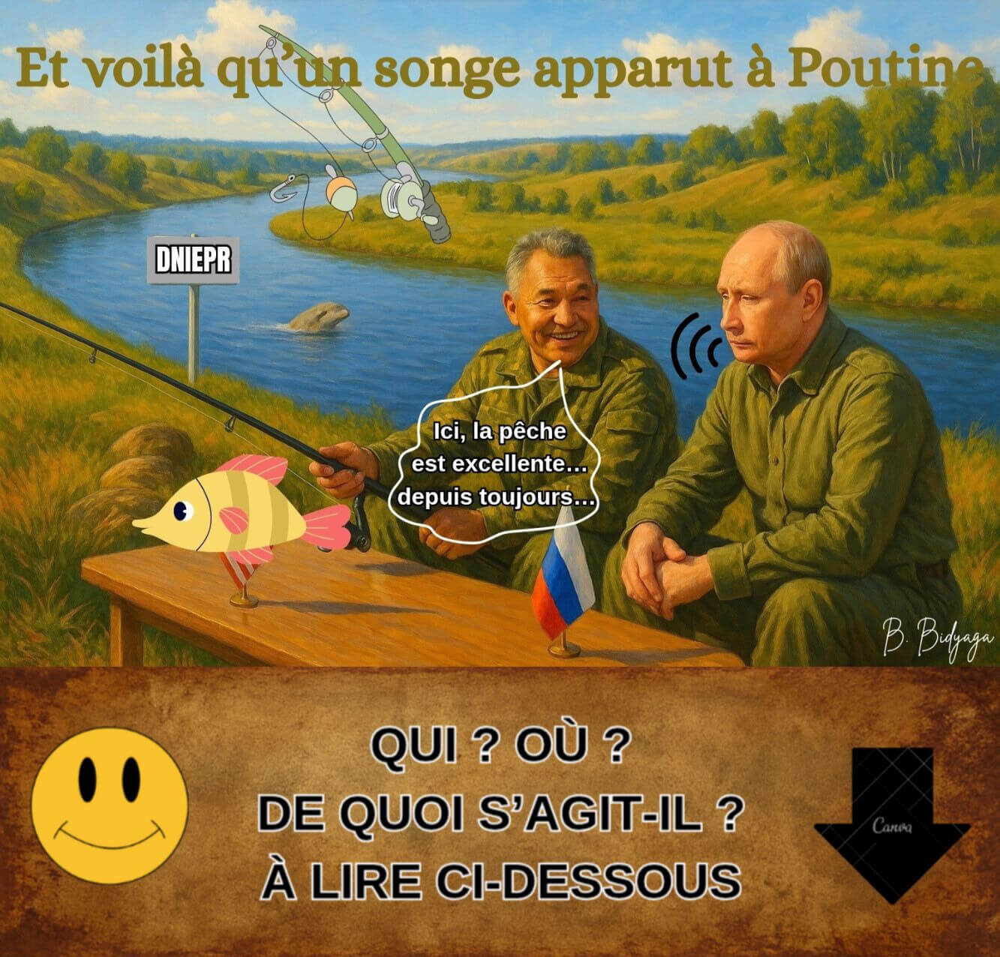

Rêve du président russe Vladimir Poutine.
Il pêche sur le Dniepr, en Ukraine, en compagnie de son ministre de la Défense, Sergueï Choïgou.

**Choïgou** :

— Ici, la pêche est excellente… depuis toujours… Notre rivière, de la vieille Rus’… La Volga-mère et le Dniepr-père — c’est d’eux que vient toute l’eau de la Rus’… Comme l’a dit le grand poète russe : « Qu’il est beau, le Dniepr par temps calme… »

**Poutine** :

— Oui… D’ailleurs, il y a mille ans, à cet endroit précis, le Prince Vladimir a pêché  une perche géante de près de cent kilos ! C’est écrit dans la Chronique des temps révolus !

(Poutine se réveille : bruine, brouillard grisâtre sur la Moskova. Il compose le numéro de Medinski).

**Poutine** :

— Vladimir Rostislavovitch ? Inscrivez d’urgence la Perche dans le nouveau manuel d’histoire ! Oui, celle-là… Comme symbole… de la… grandeur impériale russe. Et avec illustration !

*V.R. Medinski est un «faiseur d'histoire» sur commande du Kremlin, y compris pour l'éducation scolaire.*

#PoutinismeMilitaireOrthodoxe
                                👻

## 16. CHAMBRE D’ENFANT – ATELIER DE CONFECTION D’UNIFORMES MILITAIRES

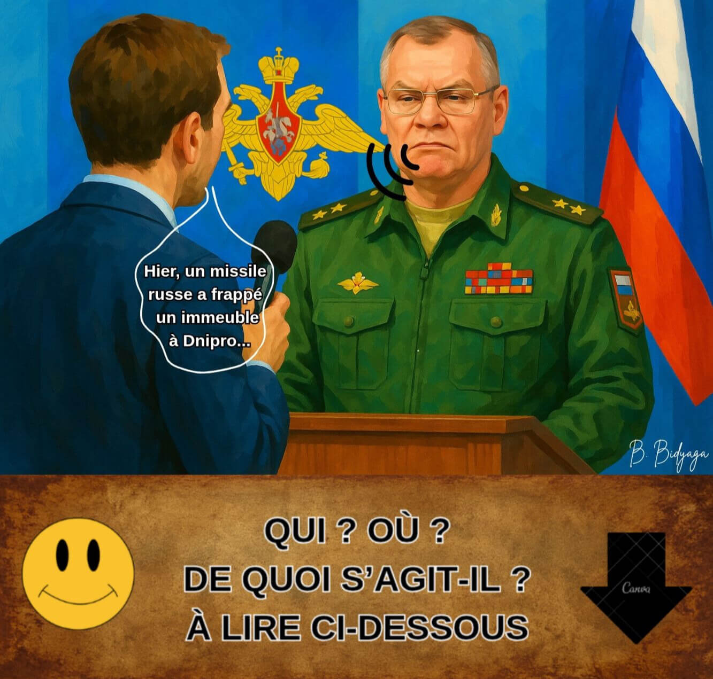

Briefing du ministère russe de la Défense.
Le général Igor Konachenkov, chef du service d’information, répond aux questions.

**Journaliste** :

— Hier, un missile russe a frappé un immeuble à Dnipro. Une famille ukrainienne a été tuée. Comment commentez-vous cet acte précis ?

**Général Konachenkov** :

— Je répète, en vrai patriote de la Russie : l’armée russe n’a jamais bombardé et ne bombardera jamais de cibles civiles. Notre enquête a révélé qu'il s'agissait d'un atelier clandestin de confection d'uniformes militaires.

**Journaliste** :

— Des enfants figurent parmi les victimes…

**Général Konachenkov** :

— Ils apprenaient à broder des écussons.

#PoutinismeMilitaireOrthodoxe
                                👻

## 17. NÉO-PATRIARCAT : L’ÉMANCIPATION ANNULÉE

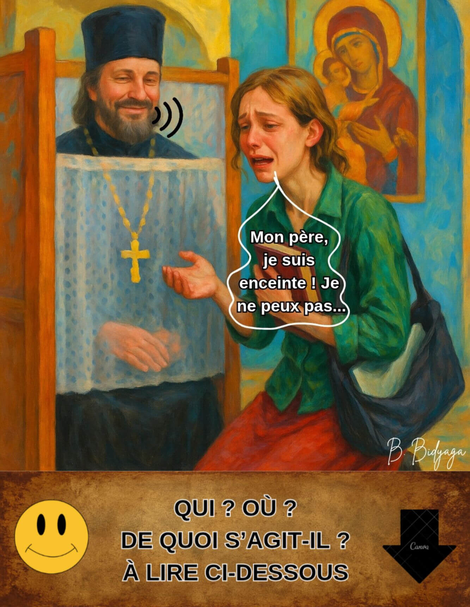

Église orthodoxe, ville russe.
Au confessionnal. Derrière le paravent, un prêtre.
Une jeune fille se confesse, en sanglots.

**Fille** :

— Mon père, j’ai un gros souci, je suis enceinte ! Je ne sais plus quoi faire ! Je suis en troisième année d’université… Je veux finir mes études… Qui élèvera l’enfant ?

**Prêtre** :

— Une femme n’a que faire de l’éducation. Ainsi l’enseigne l’Église, ainsi le disent les saints Pères. La vocation de la femme : enfanter et se taire. Obéissance et maternité — voilà ton avenir. Et tu en auras la récompense au Ciel. Notre dernier Concile a statué : « L’éducation des femmes est une tentation du Malin ».

#PoutinismeMilitaireOrthodoxe
                                👻

## 18. BITE EN MAIN – PAS DE VICTOIRE DEMAIN !

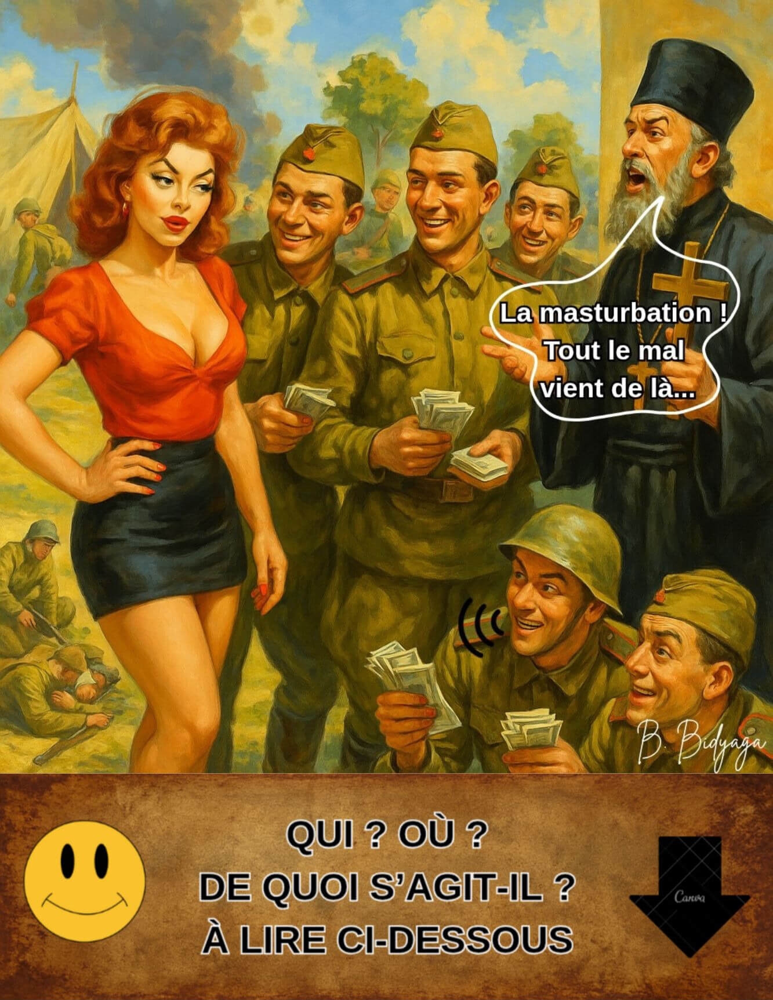

Zone frontalière russo-ukrainienne.
Des soldats russes marchandent avec une prostituée. Non loin de là, un prêtre orthodoxe prêche.

**Prêtre** :

— La masturbation ! Tout le mal vient de là ! Cette guerre a commencé à cause de la masturbation ! Réveillez-vous, soldats ! Cessez de vous branler ! Dans votre main doit être une arme, pas votre sexe !

**Soldat** :

— Si tu savais, mon père, combien elles prennent ici, tu te tairais !

#PoutinismeMilitaireOrthodoxe
                                👻

## 19. JE VEUX ALLER SUR LA LUNE

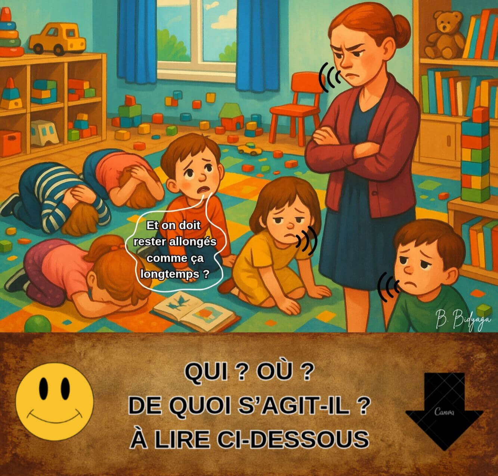

Jardin d’enfants, ville russe.
Alerte aérienne. Les enfants, couchés face contre terre.

**Premier enfant** :

— Et on doit rester allongés comme ça longtemps ?

**Éducatrice** :

— Jusqu’à ce que nos soldats aient abattu tous les drones ennemis.

**Deuxième enfant** :

— Donc... longtemps.

**Troisième enfant** :

— Et si on partait tous sur la Lune ?

#PoutinismeMilitaireOrthodoxe
                                👻

## 20. « CONVERSATIONS SUR L’ESSENTIEL »

École, ville russe.
Cours spécial : « Conversations sur l’essentiel »

**L’institutrice** :

— Alors, les enfants, dites-nous ce que vous voulez faire quand vous serez grands.

**Tolya** :

— Moi, je serai pilote et je bombarderai les villes ennemies.

**Macha** :

— Moi, je serai infirmière et j’évacuerai les blessés du champ de bataille.

**Guena** :

— Moi, je serai général, je resterai au quartier général et je donnerai des ordres.

**L’institutrice** :

— Et toi, pourquoi tu te tais, Vanya ? Dis-nous ce que tu veux devenir.

**Vanya** (en soupirant) :

— Moi, Madame Elena, je serai en hôpital psychiatrique. Bien loin de toute cette folie.

#PoutinismeMilitaireOrthodoxe
                                👻

## 21. NE M’ÉNERVEZ PAS — JE SUIS DANGEREUX !

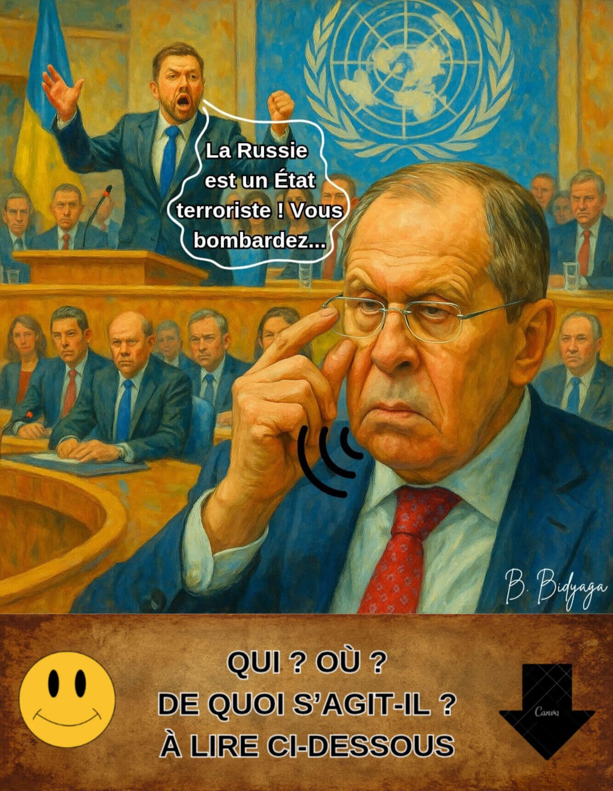

Séance du Conseil de sécurité de l’ONU.

**Représentant de l’Ukraine** :

— La Russie est un État terroriste ! Vous bombardez des immeubles d’habitation, tuez des enfants, violez des femmes, pillez des maisons, violez les lois de la guerre. Vous en répondrez, tôt ou tard ! La Russie doit être jugée !

**Ministre russe Lavrov** :

— Putains de débiles !

#PoutinismeMilitaireOrthodoxe
                                👻

## 22. VIE SOLDÉE — PAS DE MONNAIE, PAS DE REDDITION

Front russo-ukrainien. Arrière. Les soldats rassemblés. Le ministre russe de la Défense, Sergueï Choïgou, leur adresse la parole.

**Soldat** :

— Camarade général, et s’il y a beaucoup d’Ukrainiens et que je suis seul ?

**Choïgou** :

— Tu dois te battre jusqu’à la dernière balle, fils. Si, par malheur, on t’attrape vivant — c’est un crime. Capitulation volontaire.

**Soldat** :

— Mais je ne veux pas mourir !

**Choïgou** :

— Ta vie, c'est payé. Contrat fermé — pas de monnaie, pas de reddition.

#PoutinismeMilitaireOrthodoxe
                                👻

## 23. BOUTCHA : THÉÂTRE DES OPÉRATIONS OU SIMPLE THÉÂTRE ?

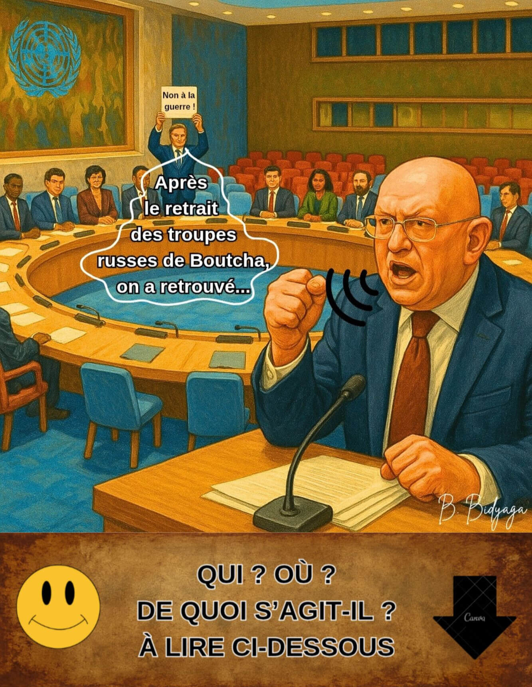

Réunion du Conseil de sécurité de l'ONU.

**Représentant de l’Ukraine** :

— Après le retrait des troupes russes de Boutcha, on a retrouvé des centaines de corps de civils. Ils ont été tués par les soldats de Poutine !

**Représentant de la Russie** :

— Mensonge éhonté ! Il n’y avait aucun cadavre ! Mise en scène ukrainienne !
À Boutcha, il n’y a pas eu d’opérations militaires — seulement une pièce de théâtre ukrainienne.

#PoutinismeMilitaireOrthodoxe
                                👻

## 24. AUJOURD’HUI DU JAZZ, DEMAIN LA TRAHISON

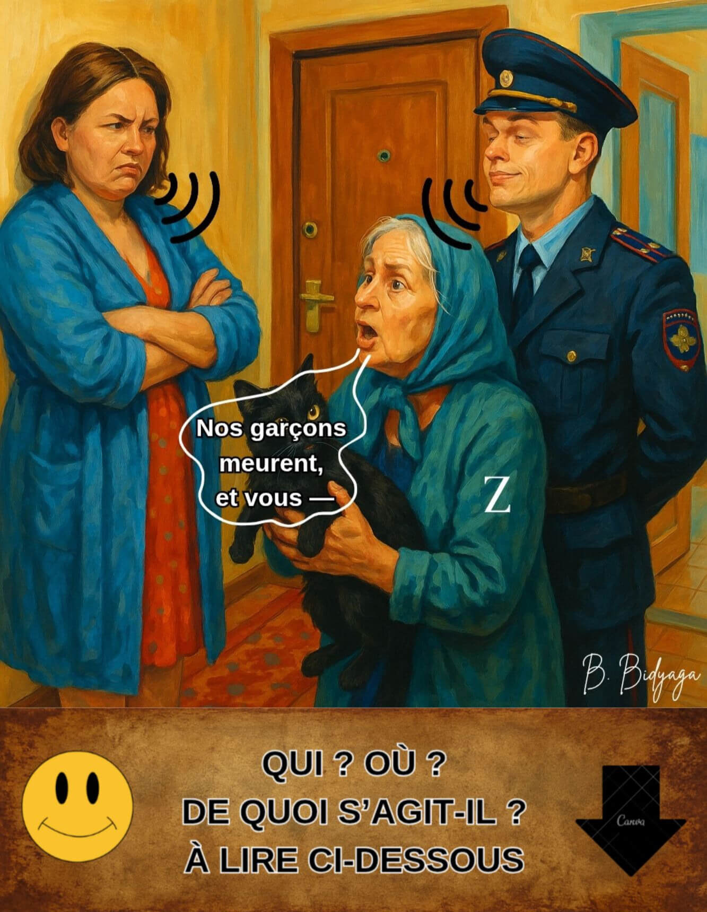

Russie, Moscou. Appartement typique d’immeuble.
La maîtresse de maison, une voisine, un policier.

**Voisine** :

— Nos garçons meurent, et vous —
vous écoutez de la musique ! C’est de la discréditation !

**Maîtresse de maison** :

— Ce n’est pas ma faute si ces imbéciles sont partis au front. Je ne les ai pas traînés au bureau de recrutement ! Ils voulaient des millions. Maintenant, ils pourrissent là-bas.

**Policier** :

— En plus, incitation à la haine et à l’hostilité envers les membres de l’armée russe ! Ça va vous coûter cher, madame !

#PoutinismeMilitaireOrthodoxe
                                👻

## 25. S-300 PLOMBAGE — QUALITÉ CONSTRUCTION MILITAIRE

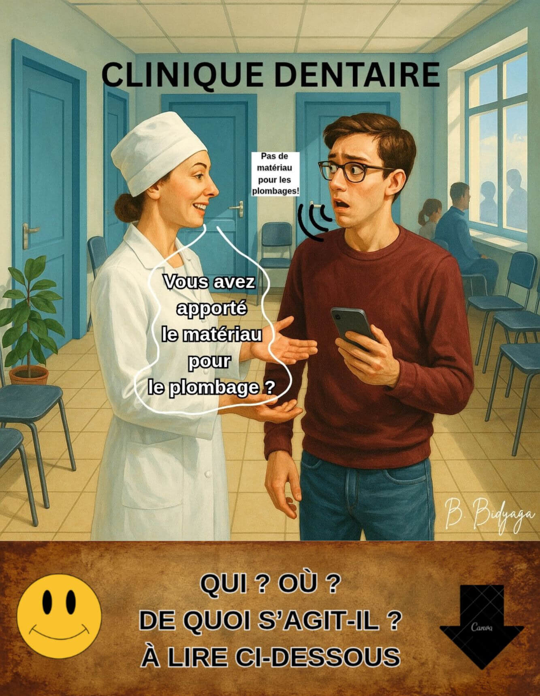

Clinique dentaire, ville russe.
Sur la porte du cabinet, un écriteau : « Plus de matériel pour les plombages. »
Dans le hall, le dentiste en discussion avec un patient.

**Dentiste** :

— Vous avez apporté le matériau pour le plombage ? Nous, on n’en a plus. Rupture de stock. Sanctions, vous savez bien. Pour l’instant, on n’a que du béton de sable de construction S-300. Garantie — un mois. Si, bien sûr, vous ne mourez pas tout de suite.

**Patient** :

— Vous savez quoi, je vais plutôt m’en aller. La dent, en fait, ne me fait plus mal. Comme par miracle, tout a disparu.

#PoutinismeMilitaireOrthodoxe
                                👻

## 26. CHEZ LA VOYANTE : LES CHIFFRES NE MENTENT PAS

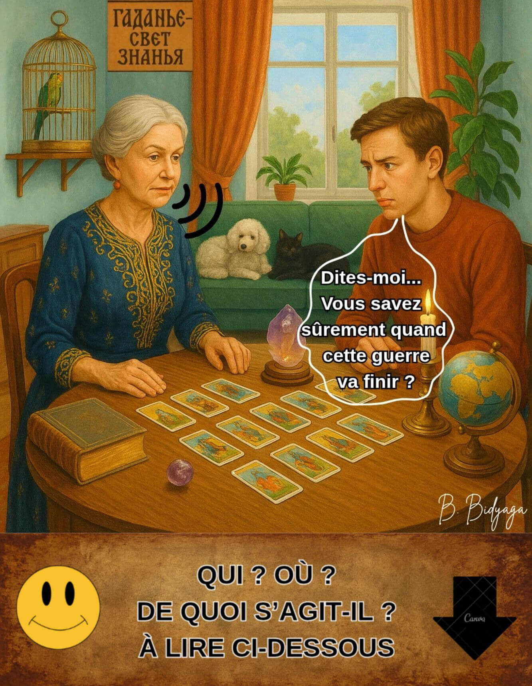

Cabinet d’une voyante, ville russe.
Un jeune homme à l’intérieur.

**Homme** :

— Dites-moi... Vous savez sûrement quand cette guerre va finir ?

**Voyante** :

— Bien sûr. Comptons... Aujourd’hui, nous sommes le 25.05.25. On multiplie... 25 × 5 × 25...
Dans 3125 jours.

#PoutinismeMilitaireOrthodoxe
                                👻

## 27. MÉDECINE PALLIATIVE : « ON TIENT PAR LES PRIÈRES »

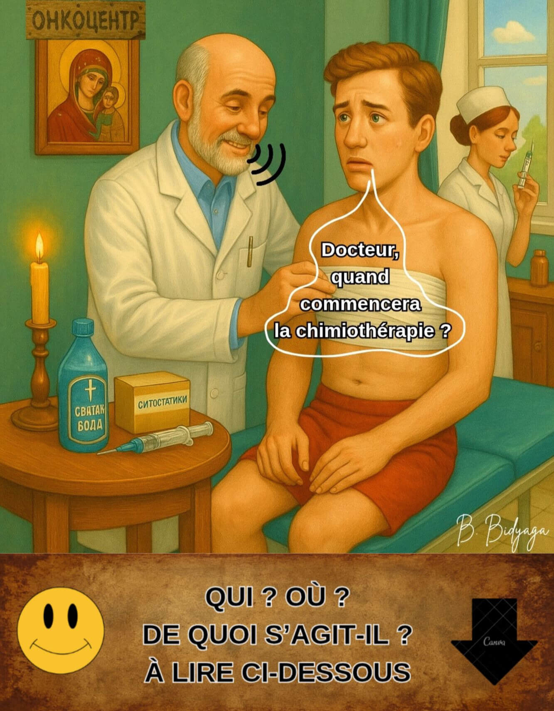

Clinique d’oncologie, ville russe.
Cabinet médical. Un patient assis sur la table d’examen.
Le médecin lui bande la poitrine.

**Patient** :

— Docteur, quand commencera la chimiothérapie ?

**Médecin** (indifférent) :

— Pas dans cette vie. Les crédits ont été supprimés. Alors… on resserre bien le bandage, ça freine un peu les métastases.
Infirmière ! Une injection d’eau bénite !
Allez, tenez bon, on prie pour vous.

#PoutinismeMilitaireOrthodoxe
                                👻

## 28. RATIONS DE TERRAIN POUR VRAIS SOLDATS

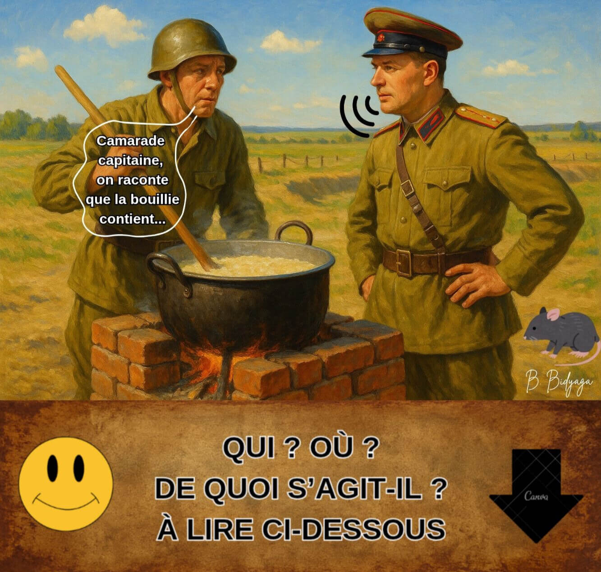

Front russo-ukrainien. Positions russes. Une cuisine de campagne. Dialogue entre le commandant et son cuisinier.

**Cuisinier** :

— Camarade capitaine, on raconte que la bouillie contient de la viande de rat, et que tout le stock de conserves a été volé par l’état-major.

**Capitaine** :

— Les conserves, c’est du faux. Un vrai soldat a besoin de vraie nourriture.
Quant aux calomniateurs : on marine la viande dans le vinaigre, on met plus de poivre dans la bouillie, et on ajoute des oignons frits.

#PoutinismeMilitaireOrthodoxe
                                👻

## 29. CE N’EST PAS UNE AFFAIRE DE TSAR...

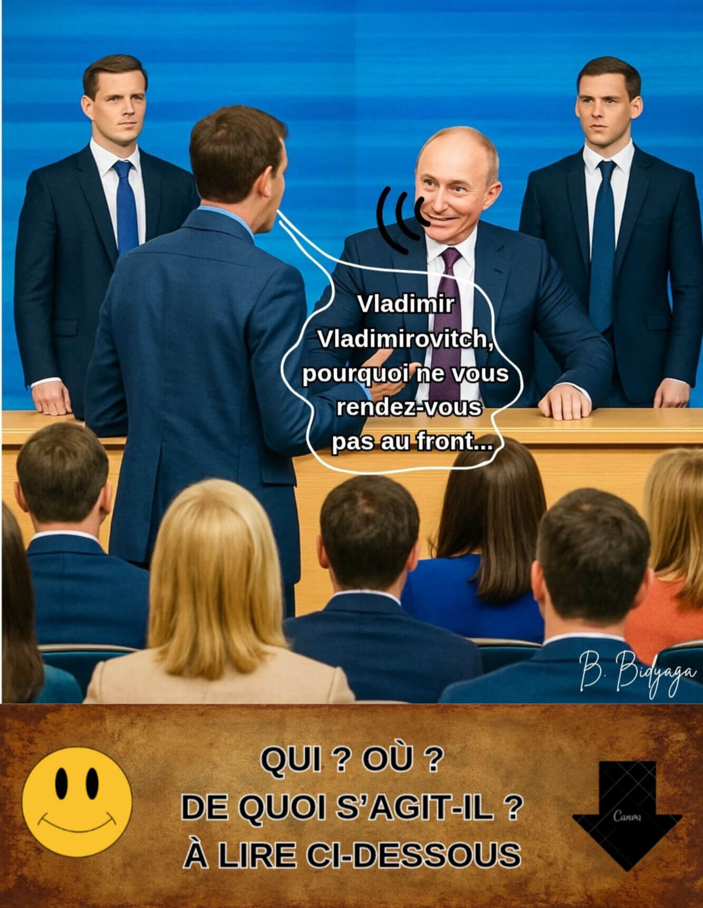

Conférence de presse du président russe, Vladimir Poutine.

**Journaliste** :

— Vladimir Vladimirovitch, pourquoi ne vous rendez-vous pas au front, comme le fait le président ukrainien ?

**Poutine** :

— Zelensky est illégitime. S’il se fait tuer, ce ne sera pas une grande perte.
En plus, il cherche la popularité bon marché.
Moi, je n’en ai pas besoin : ma cote est déjà au plus haut.

#PoutinismeMilitaireOrthodoxe
                                👻

## 30. LA PATRIE NE DOIT RIEN AU SOLDAT
(SAUF LES HONNEURS AUX FUNÉRAILLES)

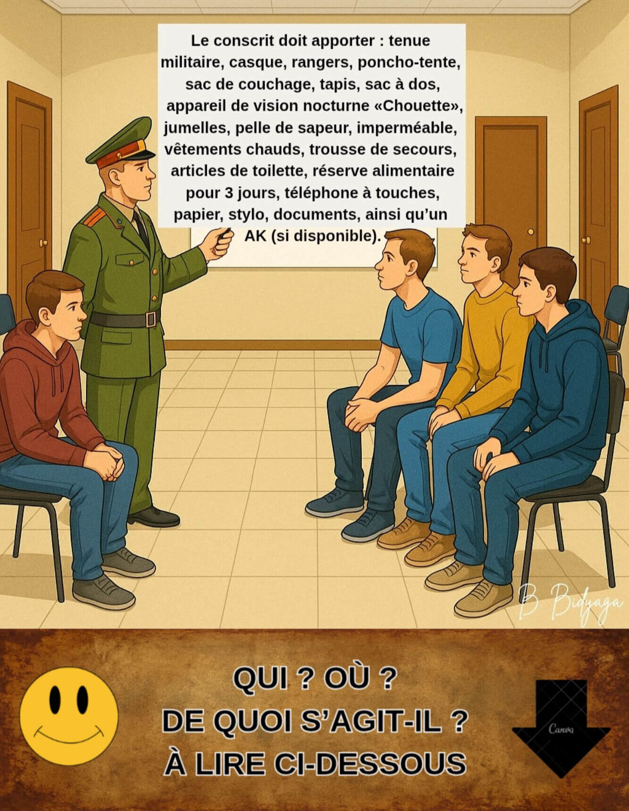

Commissariat militaire, ville russe.
Au mur, un grand panneau proclame :

Le conscrit doit apporter : 

• tenue militaire, casque, rangers, 

• poncho-tente, sac de couchage, tapis, sac à dos, 

• appareil de vision nocturne « Chouette », jumelles, pelle de sapeur, 

• imperméable,  vêtements chauds, trousse de secours, articles de toilette,

• réserve alimentaire pour 3 jours,

• téléphone à touches, papier, stylo, documents, 

• ainsi qu’un AK (si disponible).

#PoutinismeMilitaireOrthodoxe
                                👻

## 31. ASSURANCE LOYAUTÉ : AVEC CLAUSE D’AUTO-LIQUIDATION

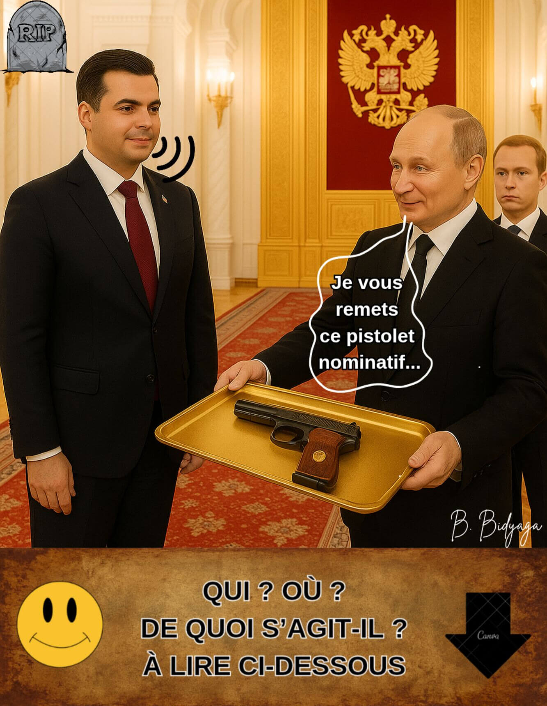

Moscou, Russie, Grand Palais du Kremlin, Salle Saint-Georges.
Le président russe, Vladimir Poutine, remet une décoration à un fonctionnaire.

**Poutine** :

— Je vous remets ce pistolet nominatif pour vos services à la Patrie. Il saura vous réconforter dans les moments difficiles. Il ne vous laissera pas faillir.
Et, je l’espère, offrira une solution dans une impasse.

**Fonctionnaire** (solennel) :

— Je sers la Russie ! Je suis prêt à prouver ma loyauté, fût-ce au prix de ma vie !

#PoutinismeMilitaireOrthodoxe
                                👻

## 32. POUTINACÉE CONTRE TOUS LES MAUX : LA PEUR

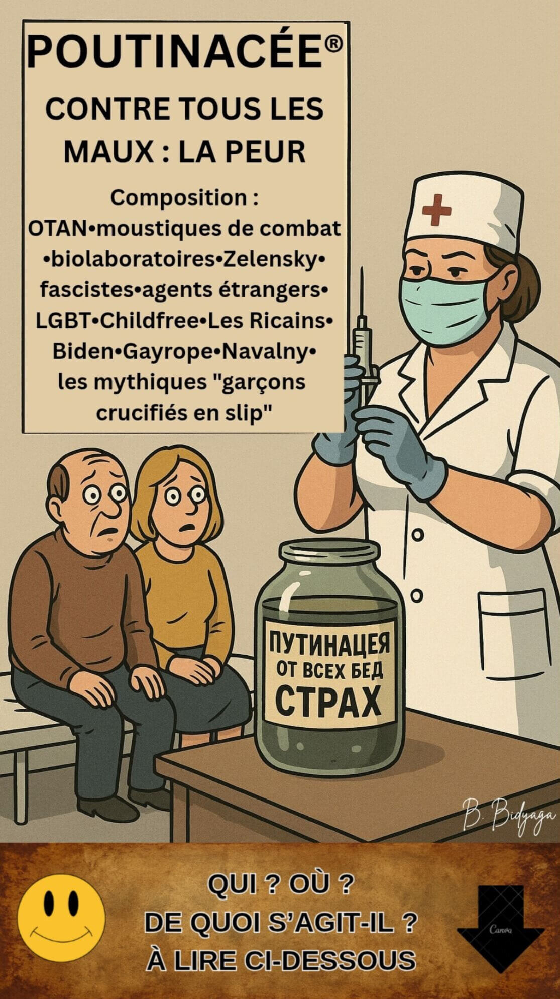

**POUTINACÉE®**

Médicament à large spectre d’action combinée.
Actif contre tous les micro-organismes de l’opposition...

**Action pharmacologique** :

Provoque une peur persistante, des accès d’agressivité et une exaltation patriotique.
Inhibe toute pensée critique, empathie ou culpabilité.

**Composition** :

• OTAN

• moustiques de combat

• biolaboratoires

• Zelensky

• fascistes

• agents étrangers

• LGBT

• Childfree

• Les Ricains 

• Biden

• Gayrope (péjoratif pour l'Europe «décadente»)

• Navalny

• les mythiques "garçons crucifiés en slip"  

**Indications** :

• Conscience de soi trop développée

• Confiance et compassion envers les ennemis du peuple

• Besoin de réponses à des questions rhétoriques

**Effet thérapeutique prouvé** :

• Foi chronique dans la télévision

• Allergie à la vérité

• Extase patriotique agressive

**Surdosage** :

• Pas de données

**Contre-indications** :

• Aucune enregistrée

#PoutinismeMilitaireOrthodoxe
                                👻

## 33. FILET PLEIN DE TNT : LES DAUPHINS DE L’OTAN PASSENT À L’ATTAQUE !

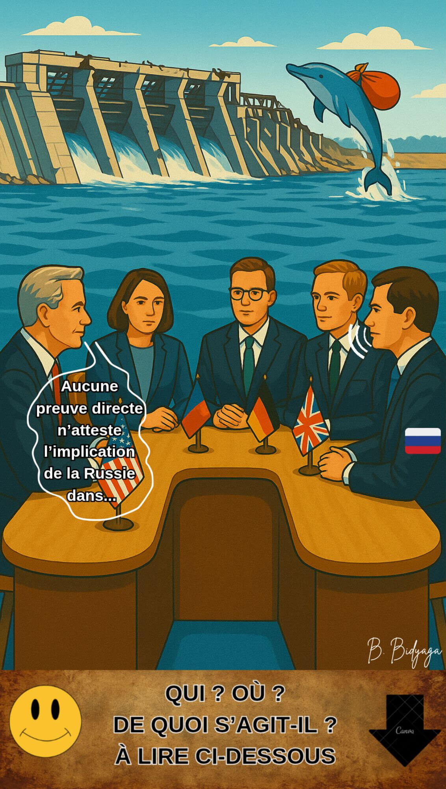

Réunion d’une commission internationale d’enquête.
Objet : le sabotage du barrage de Kakhovka, en Ukraine.

**Représentant occidental** :

— Aucune preuve directe n’atteste l’implication de la Russie dans ce sabotage. Mais les indices circonstanciels restent troublants...

**Représentant russe** :

— Cessez vos calomnies ! Une expertise ADN l’a prouvé : le barrage a été détruit par des dauphins de combat de l’OTAN !

#PoutinismeMilitaireOrthodoxe
                                👻

## 34. SUR UN CABANON, C’EST ÉCRIT AUSSI...

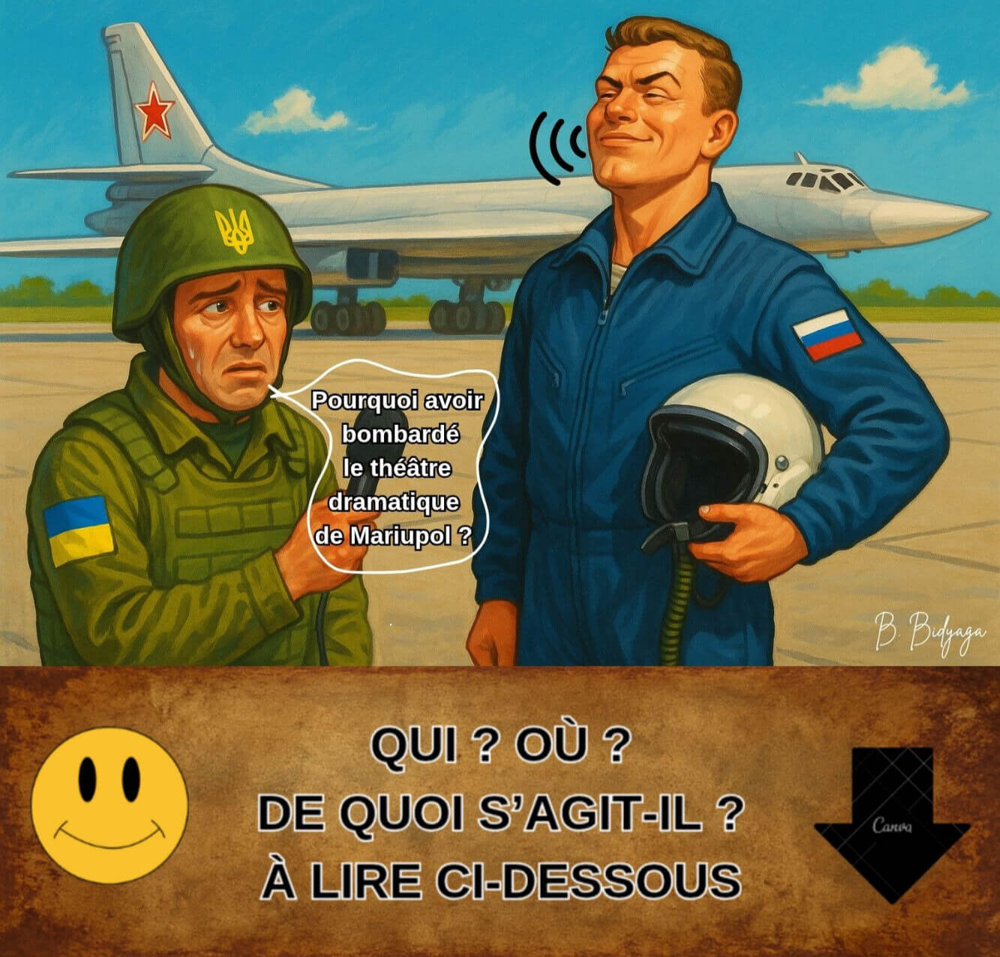

Aérodrome militaire russe.
Dialogue entre un pilote russe et un journaliste ukrainien.

**Ukrainien** :

— Pourquoi avoir bombardé le théâtre dramatique de Marioupol ? Il y avait écrit en grand : « ENFANTS ! »

**Pilote** :

— Sur un cabanon, c’est écrit aussi « Bite » — et dedans, il n’y a que du bois de chauffage !

#PoutinismeMilitaireOrthodoxe
                                👻

## 35. MOUSTIQUES DE COMBAT DE L’OTAN

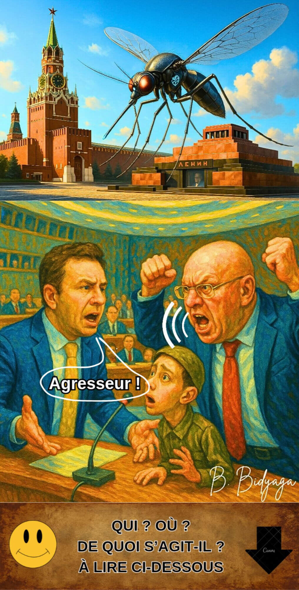

Réunion du Conseil de sécurité de l’ONU.

**Représentant ukrainien** :

— Agresseur !

**Représentant russe** :

— Ne déformez pas les faits ! Les moustiques de combat de l’OTAN ont traîtreusement envahi la Russie depuis le territoire ukrainien ! Nous n’avons mené qu’une opération spéciale de désinsectisation !

#PoutinismeMilitaireOrthodoxe
                                👻

## 36. KIEV EN 3 JOURS

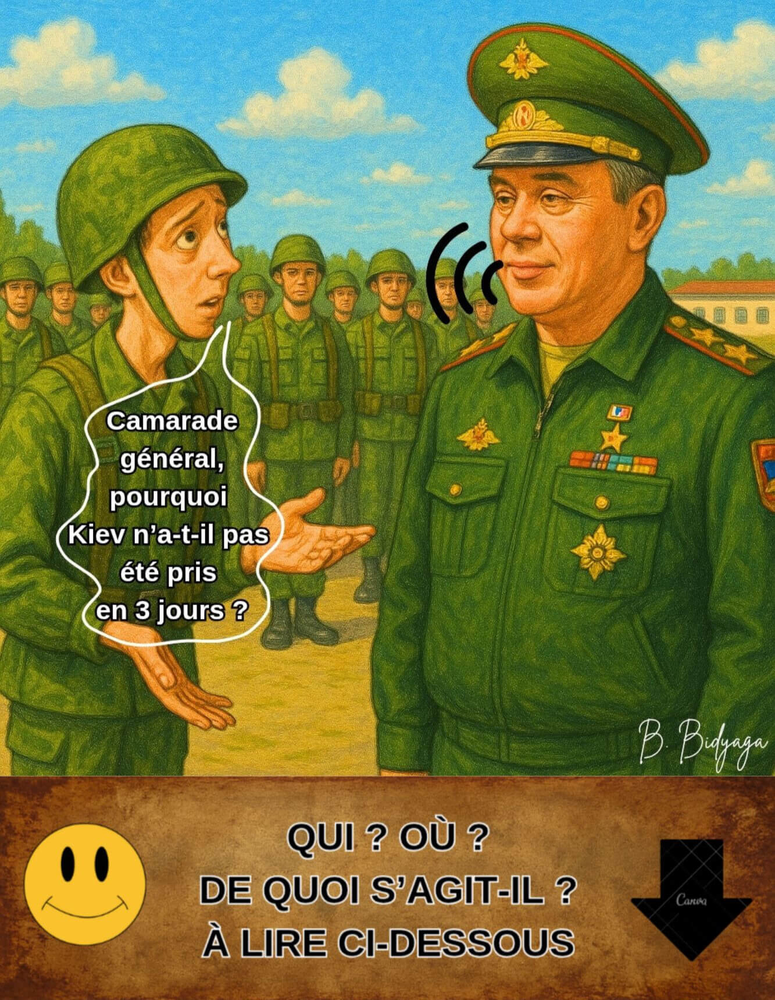

Unité militaire russe – place d’armes.
Rassemblement. Le général fait face aux soldats.

**Soldat** :

— Camarade général, pourquoi Kiev n’a-t-il pas été pris en 3 jours ?

**Général** :

— C’était une attaque d’exercice. Un acte dans un esprit d’humanité et de bonne volonté. Nous avons démontré à l’ennemi notre puissance de feu — puis nous nous sommes repositionnés sur des lignes encore plus avantageuses.

#PoutinismeMilitaireOrthodoxe
                                👻

## 37. PÈRE NOËL SABOTEUR : OPÉRATION SPÉCIALE DE NOËL

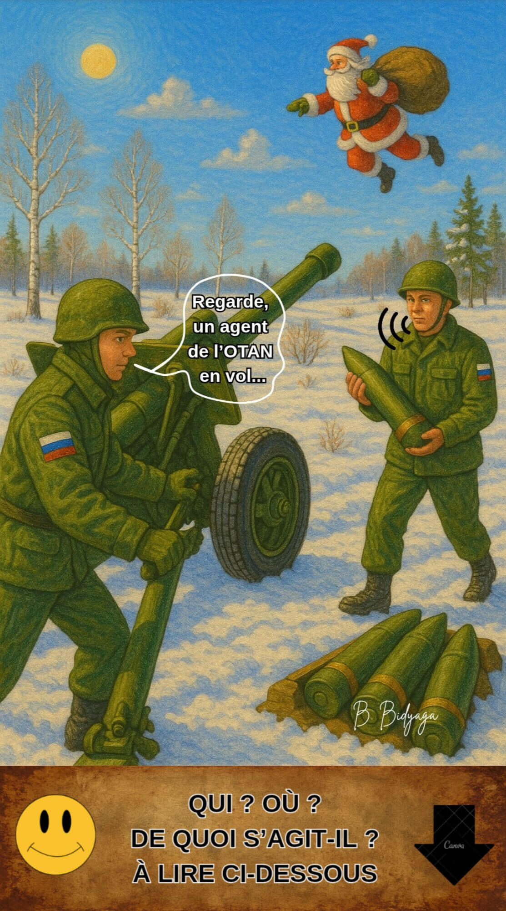

Veille de Noël.
Soldats russes en position de combat.
Au-dessus d’eux, le Père Noël vole, un sac de cadeaux à la main.

**Premier soldat** :

— Regarde, un agent de l’OTAN en vol — sous couverture !

**Deuxième soldat** :

— Charge ! Vite ! Vise la tête. Mais touche pas au sac — sinon, pas de cadeaux !

#PoutinismeMilitaireOrthodoxe
                                👻

## 38. BAPTÊME EXPRESS EN ENFER

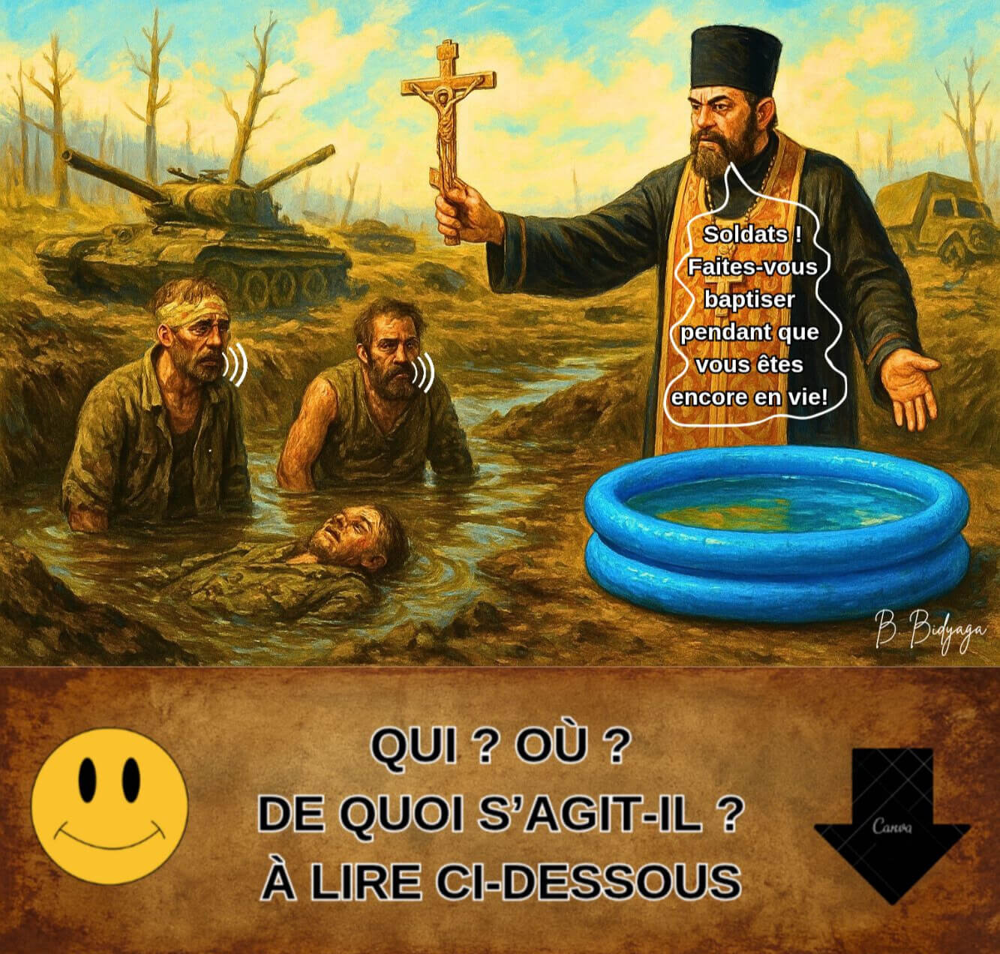

Front russo-ukrainien – côté russe.
Un prêtre orthodoxe exhorte des soldats à se faire baptiser dans une piscine gonflable.

**Prêtre** :

— Soldats ! Faites-vous baptiser pendant que vous êtes encore en vie! Sinon, c’est l’enfer !

**Premier soldat** :

— On est déjà en enfer.

**Deuxième soldat** :

— Allez ! Fais-le ! Au moins, nous nous laverons de la boue !

#PoutinismeMilitaireOrthodoxe
                                👻

## 39. TU VEUX ÊTRE SAINT ? SOIS CRUCIFIÉ SUR LA CROIX

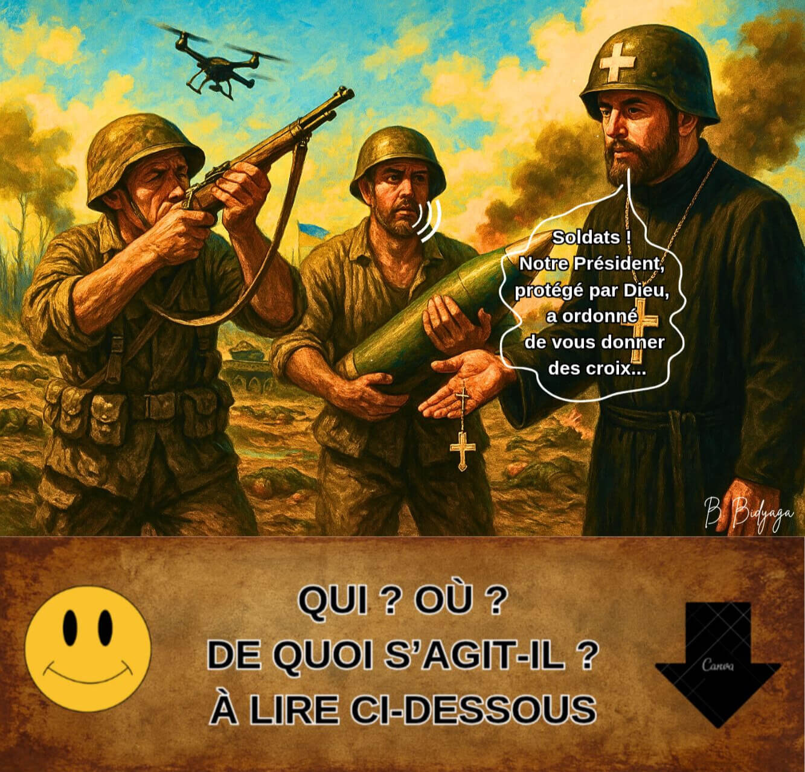

Front russo-ukrainien – arrière russe.
Un prêtre propose aux soldats un crucifix « présidentiel ».

**Prêtre** :

— Soldats ! Notre Président, protégé par Dieu, a ordonné que vous receviez des crucifix bénits portant ses initiales. C’est la meilleure protection contre les balles ennemies.

**Soldat** :

— Quoi… il a déjà été crucifié ?

#PoutinismeMilitaireOrthodoxe
                                👻

## 40. VISE SAINTE-EAU

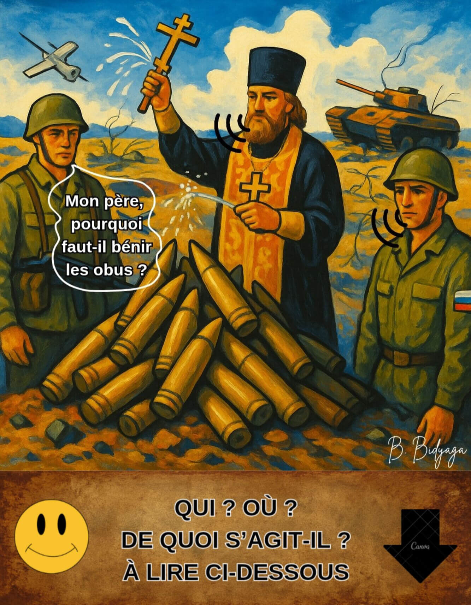

Front russo-ukrainien. Arrière russe. Rituel de bénédiction des obus.

**Premier soldat** :

— Mon père, pourquoi bénir les obus ?

**Prêtre** :

— Pour qu’ils touchent la cible, mon fils !

**Deuxième soldat (sombrement)** :

— Ah… voilà pourquoi on les rate tout le temps.

**Premier soldat (avec enthousiasme) :**
— Enfin ! Maintenant, nos canons vont tirer comme il faut !

#PoutinismeMilitaireOrthodoxe
                                👻

## 41. BLANC, ROUGE, NOIR

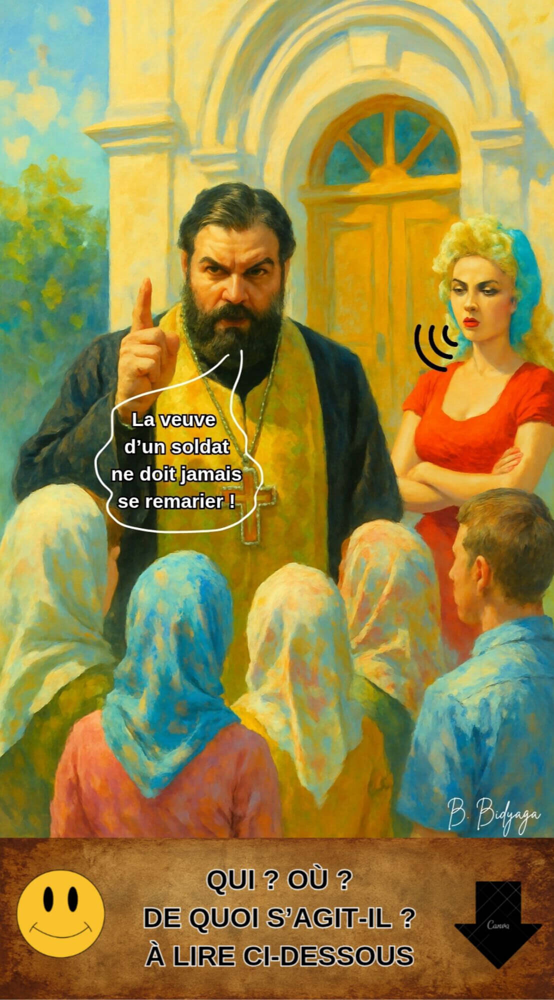

Église orthodoxe, ville russe.
Prédication sur le parvis.

**Prêtre** :

— La veuve d’un soldat ne doit jamais se remarier ! Si tu as reçu le faire-part de décès, pleure et prie !

**Femme dans la foule** :

— Arrête ton délire ! Vos indemnités funéraires suffisent à peine pour une Lada blanche. Moi, je veux une Volvo rouge ! Avec minibar !

#PoutinismeMilitaireOrthodoxe
                               👻

## 42. LIGNE TORDUE DE POUTINE

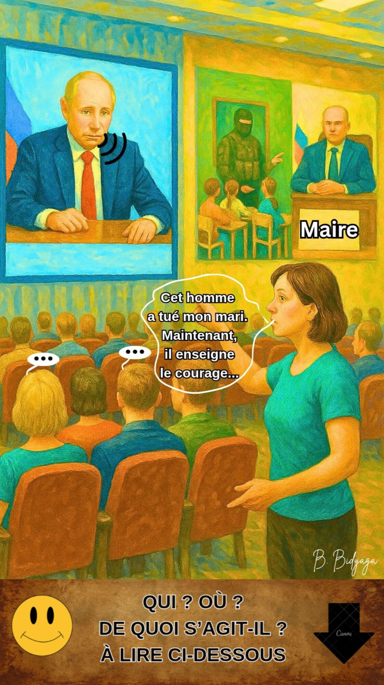

« Ligne directe » avec le président russe, Vladimir Poutine. Le président répond aux questions en visioconférence. Dans la salle, un public est assemblé.

**Femme dans la salle** (montrant le portrait d’un fonctionnaire) :

— Cet homme a tué mon mari. Aujourd'hui, il enseigne le courage aux enfants et il est maire de notre ville. Pourquoi ?

**Poutine** :

— Il a expié sa faute au front, a payé son passé de son sang : c’est un héros, notre nouvelle élite.

**Un premier spectateur**, le visage caché :

— Tué cent Ukrainiens — pardonné...

**Un autre spectateur**, le visage caché :

— Tue, vole, viole ! Six mois à la guerre et tout est oublié...

#PoutinismeMilitaireOrthodoxe
                                👻

## 43. SAINT EXTINCTEUR

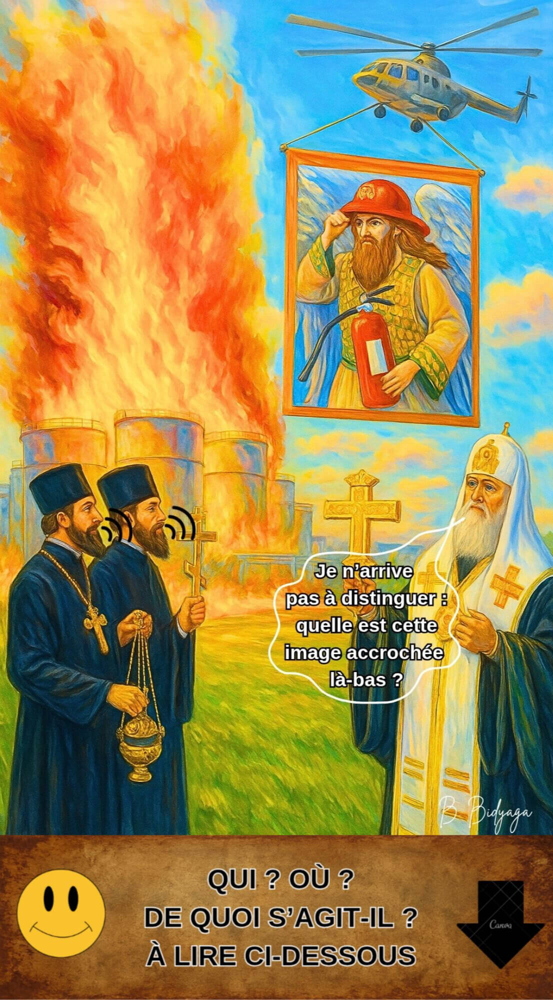

Dépôt de pétrole en flammes, ville russe.
Deux prêtres orthodoxes s’entretiennent avec le patriarche.

**Patriarche** :

— Je n’arrive pas à distinguer cette image accrochée là-bas. C’est quoi ?

**Premier prêtre** :

— C’est Svarojitch, le dieu slave du feu. Il aide vraiment !

**Deuxième prêtre** :

— Le Christ nous a abandonnés...

**Patriarche** :

— Vraiment, ça aide ?! Hm-m... Alors voilà. Nous cacherons cette hérésie païenne sous une feuille de figuier... Nous garderons l’image de Svarojitch, mais nous l’appellerons « Saint Nicolas le Pompier ».

#PoutinismeMilitaireOrthodoxe
                                👻

## 44. PROPAGANDE POUTINISTE EN UNE IMAGE

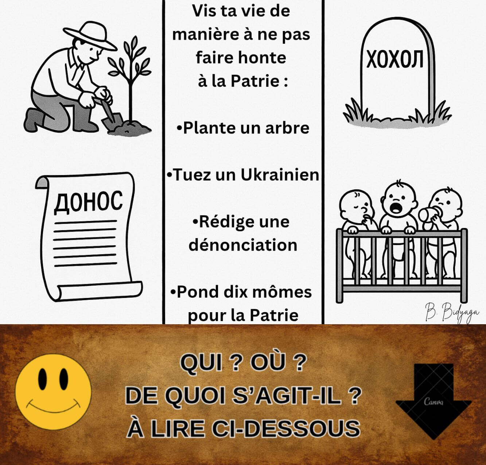

Vis sans honte pour la Patrie :

• Plante un arbre

• Abats un “khokhol” (insulte russe pour un Ukrainien)

• Dénonce ton voisin

• Fais naître dix soldats

#PoutinismeMilitaireOrthodoxe
                                👻

## 45. LE NOUVEAU TESTAMENT SUPERNOVAIRE

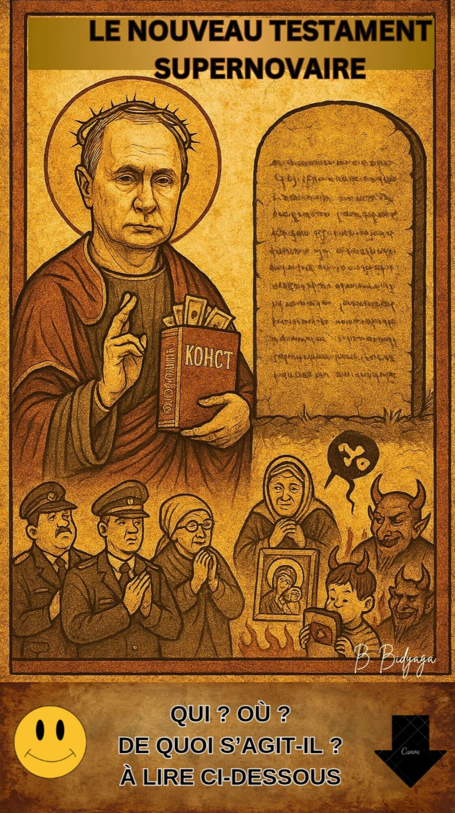

1. Aime ton Poutine de tout ton cœur, de toute ton intelligence et de toute ton âme.
2. Aime ton prochain : ton chef, ton député, ton percepteur d’impôts.
3. Tu ne tueras point : ni homme d’État, ni agent de l’ordre.
4. Tu ne commettras point d’adultère… avec préservatif.
5. Tu ne porteras pas de faux témoignage pour toi-même — mais pour la Patrie seulement.
6. Tu ne répandras pas ta semence en vain : procrée.
7. Tu ne voleras pas — ce privilège appartient aux fonctionnaires.
8. Ne cherche pas de trésors sur la terre — ils sont déjà accaparés.
9. Qui médira de Volodine ou de Matvienko sera digne de mort.
10. Ne cède point à la tentation diabolique sous la forme d’agents étrangers et de cinquième colonne.
11. Bienheureux les délateurs, car leur est le royaume terrestre : dénoncez — et vous serez entendus.
12. Aime ta Patrie — surtout dans les marchés publics.
13. Ne doute point : la foi en la télévision te sauvera.
14. Évite les mots « liberté » et « paix », car ils sont hérétiques.
15. Tu ne te feras point d’idole hors de la verticale du pouvoir.

Que la loyauté soit avec toi — et tu n’expieras point en prison.

*Extrait de « L’Apocalypse de l'agence russe de contrôle des communications », chap. 666.*

#PoutinismeMilitaireOrthodoxe
                                👻

## 46. PACIFISME : MALADIE OU CRIME ?

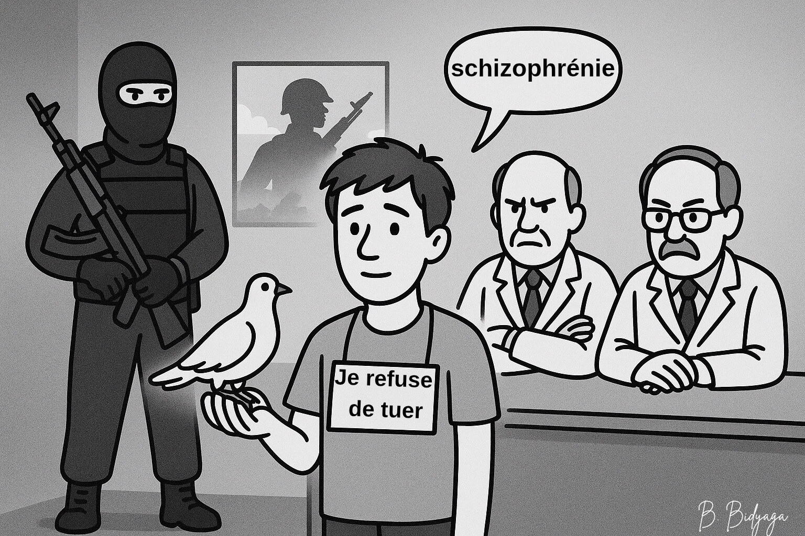
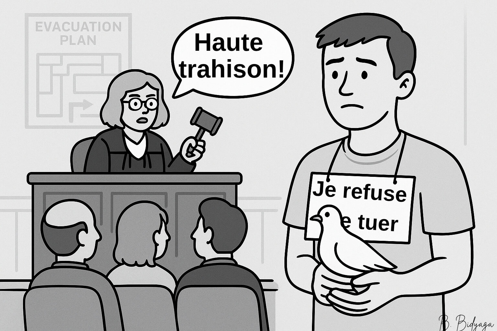
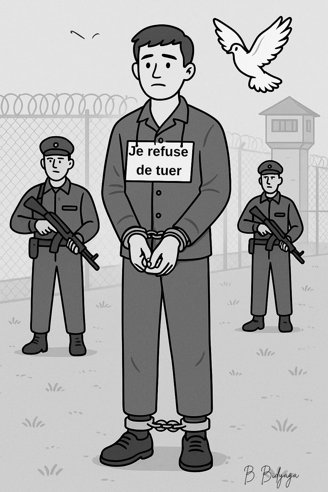

**Un triptyque** :

*Panneau 1* :
Au bureau de recrutement militaire russe.

Diagnostic : schizophrénie.

*Panneau 2* :
Tribunal russe.

Verdict : Haute trahison.

*Panneau 3*:
Russie. Colonie pénitentiaire pour pacifistes.

#PoutinismeMilitaireOrthodoxe
                                👻

## 47. MISE À JOUR DU CHRISTIANISME

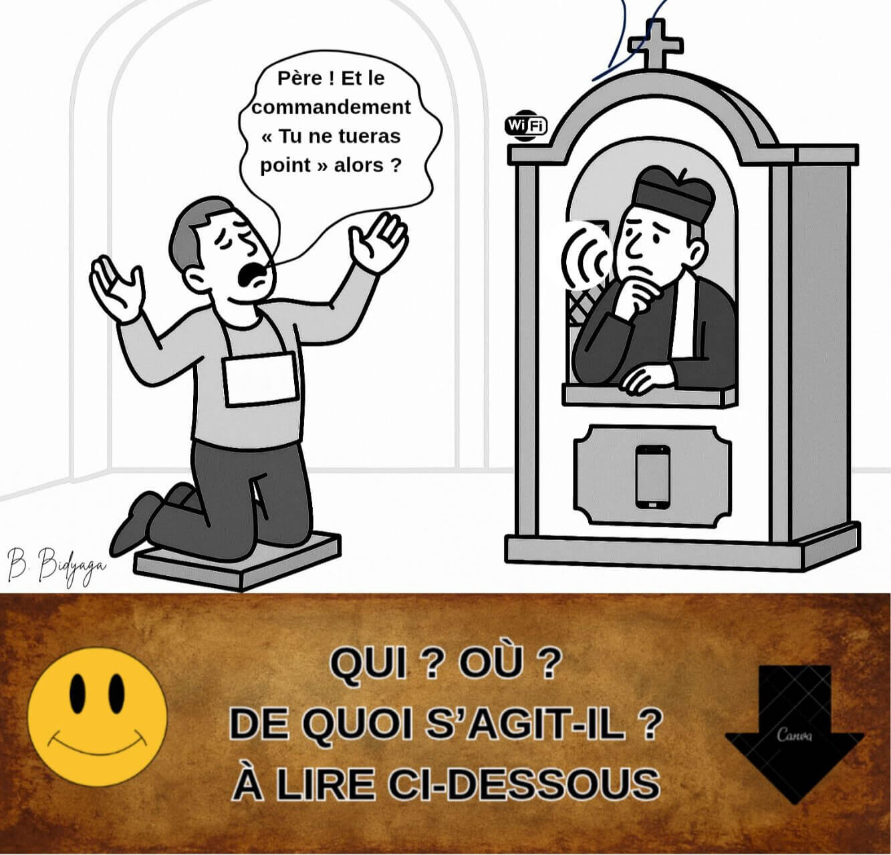

Église orthodoxe, ville russe.
Le confessionnal.

**Le pécheur repentant** :

— Père ! Et le commandement « Tu ne tueras point », qu'en est-il ?

**Le prêtre** :

— Un logiciel obsolète, mon fils ! Il faut faire la mise à jour. La version actuelle est « Ukraine_Effacée 2.0 ».

#PoutinismeMilitaireOrthodoxe
                                👻

## 48. PARABOLE DU PÊCHEUR ET DU PATRIARCHE : AUX PAUVRES LA FOI, AUX RICHES LES YACHTS

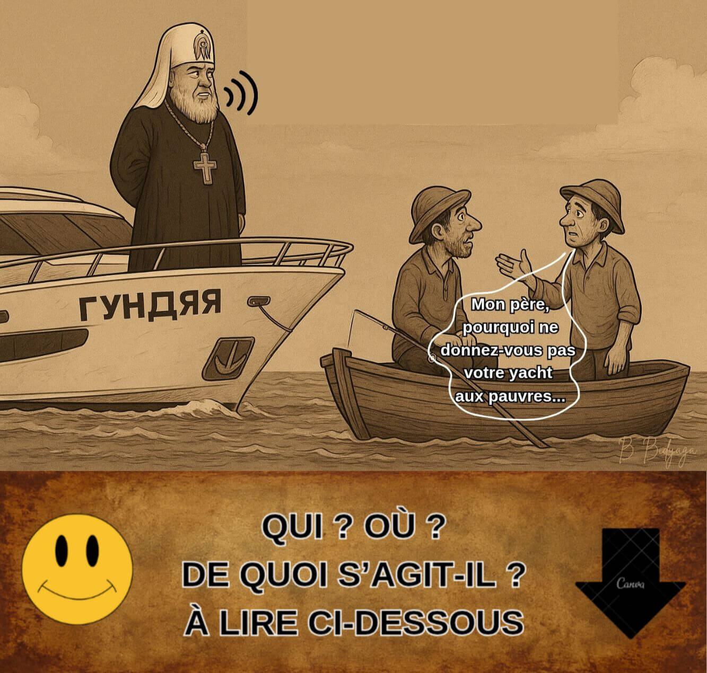

Le patriarche de toute la Russie, à la proue de son yacht luxueux.
Tout près, dans une barque fragile, deux pêcheurs.

**Pêcheur** :

— Mon père, pourquoi ne donnez-vous pas votre yacht aux pauvres et aux miséreux — comme Jésus-Christ l’a commandé ?

**Patriarche** :

— Le Christ ne prêchait qu’aux pauvres. Aux riches, il n’imposait jamais ses conseils.

#PoutinismeMilitaireOrthodoxe
                                👻

## 49. CERTIFICAT DE MATURITÉ SEXUELLE

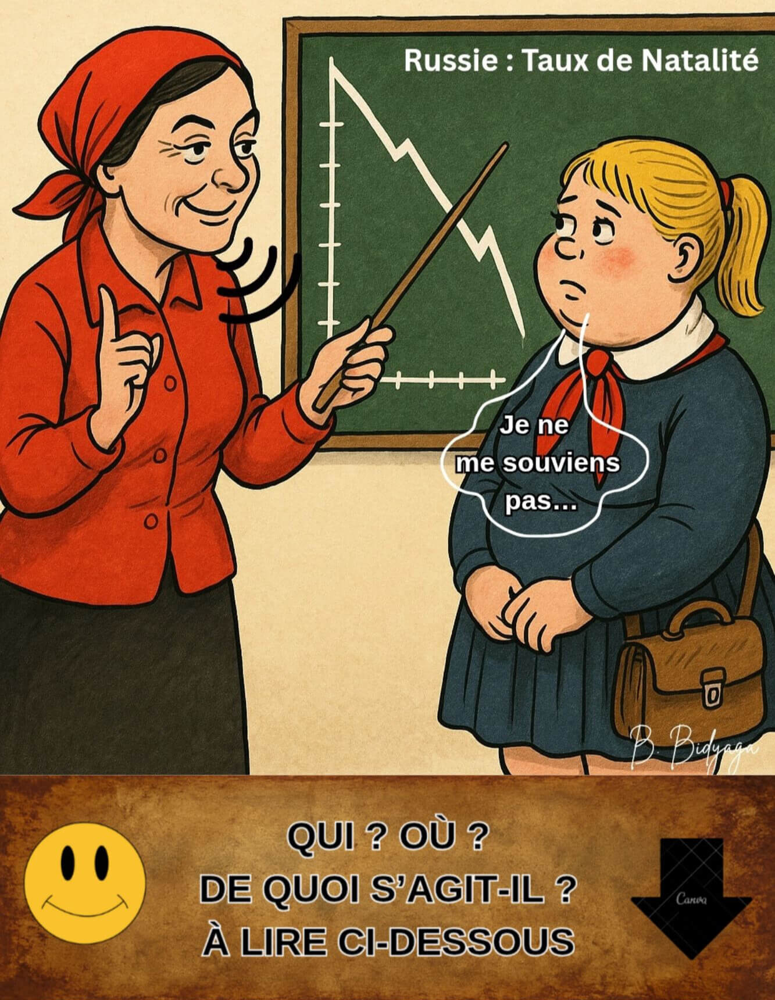

École, ville russe.
Cours : « Éducation familiale ».
Au tableau : la courbe de natalité en Russie.

**Élève** :

— Je ne me souviens pas…

**Professeure** :

— Tu n’as pas révisé la leçon ? Ce n’est pas grave. Va, ma chérie, fais un enfant, et tu auras 20/20 ! Si tu as des jumeaux, on comptera cela comme un TP d’anatomie. Avec des triplés, tu recevras ton diplôme de fin d’études par anticipation. Tu n’auras même plus besoin de venir à l’école.

#PoutinismeMilitaireOrthodoxe
                                👻

## 50. POUTINE 2.0 – SPIRALE HISTORIQUE

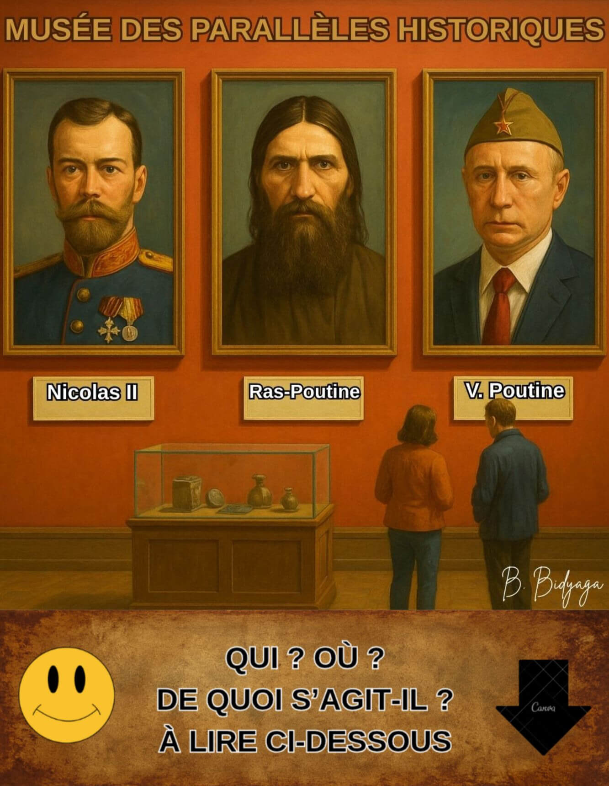

Exposition au Musée des Parallèles Historiques. Sur le mur — trois portraits officiels :

• Le tsar Nicolas II — « Nicolas II »

• Grigori Raspoutine — « Ras-Poutine »

• Vladimir Poutine — « V. Poutine »

**Ras-Poutine = Poutine I (Le Précurseur)** 

**V. Poutine = Poutine II (La Suite)**

> **Note du Conservateur** :
L’histoire se répète, cette fois-ci sous la forme d’un théâtre absurde. Deux aventuriers, un patronyme maudit — la malédiction se perpétue. La fin, comme toujours en Russie, s’écrit avec du poison, du polonium et une écharpe de soie.

**Poutine I (Version 1.0 — Grigori Raspoutine)**

Finale : Cyanure, balle dans la tête. (1916)

Statut : HORS SERVICE

**Poutine II (Version 2.0 — Vladimir Poutine)**

Finale (en cours de développement — Version Bêta) :

▸ 30% — Tabatière (référence historique)

▸ 30% — Écharpe (étranglement classique)

▸ 30% — « Novitchok » (option moderne)

▸ 10% — Infarctus « spontané » (option discrète)

Sortie prévue : 202X

> **Note Historique**
>
> • La tabatière : L'empereur Paul Ier de Russie fut assassiné en 1801. Il fut étranglé, mais le premier coup lui fut asséné avec une tabatière en or.
>
> • L'écharpe : Staline aurait utilisé une écharpe pour mettre fin aux jours de son chef de la sécurité Nikolai Iejov. « La mort par l'écharpe » est devenu un symbole des strangulations au Kremlin.
>
> • Le « Novitchok » : Agent neurotoxique développé en URSS, utilisé dans des empoisonnements notoires (Sergeï Skripal, Alexeï Navalny).
>
> • L'infarctus : « L'arrêt cardiaque soudain » est l'euphémisme le plus courant dans les rapports officiels russes concernant les morts politiques suspectes.

#PoutinismeMilitaireOrthodoxe
                                👻

## 51. LE DOCTEUR AÏBOLIT. VERSION 2.0

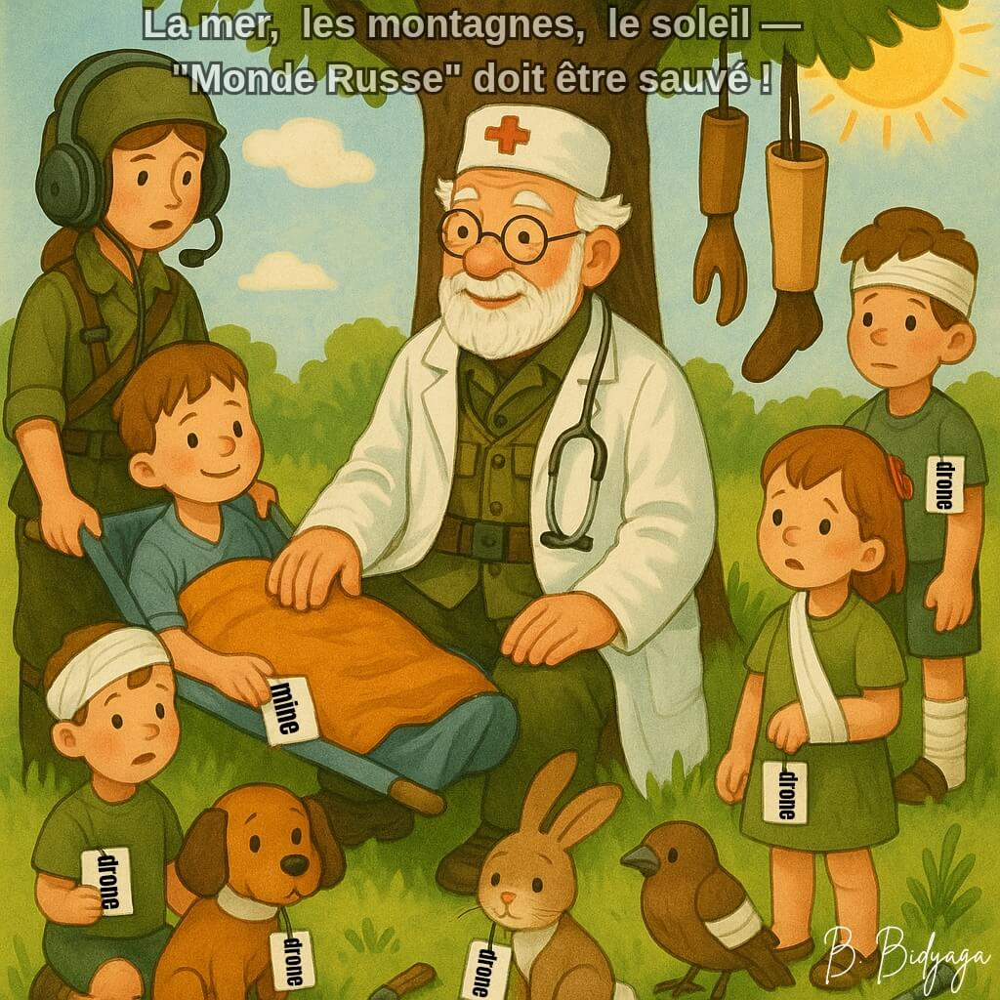

Le bon docteur Aïbolit sous l’arbre est assis,
Entrez dans son cabinet — caporal, cornette aussi.
Il guérit de tous les maux, le bon docteur Aïbolit.

Moussa arrive en boitillant : 
« Une "Guêpe" m'a tiré dessus, c'est navrant ! »
Porthos vient, grognant très fort :
 « Un drone a soufflé mon nez, j'ai la mort ! »

Une mère-radio surgit, hurlante :
 « Au secours, c'est effrayant !
Mon Vassia, mon garçon,
 a fait un mauvais pas,
Il a couru sur un champ de mines, 
ses jambes sont en ruines.
Mon fils, infirme, plein de douleur, 
quel malheur, quelle horreur ! »

Mais Aïbolit dit : « Pas d'effroi.
Amenez-le donc à moi.
Je lui coudrai de nouvelles jambes, afin qu'il marche sur le sentier miné ! »

On lui apporte Vassia, pâle, estropié, qui pâtit.
Le docteur lui coud des jambes — et Vassia repart tirer.

Sa radio de mère, elle, danse et rit, une vraie gazelle.
Elle tire et crie : « Merci, merci, Aïbolit ! »

Soudain, de l'Est, un « Aksakal » sur sa jument arrive à cheval.
« Voici un message urgent. Lisez. Au revoir, je pars. »

« Docteur, venez à Jmérinka, vite, je vous en prie.
Et sauvez, docteur, nos potes, nos amis ! »

« Qu'ont-ils donc ? Serait-ce la maladie ? »

« Oui, oui, oui ! Ils ont des sueurs, des larmes, une obstruction de l'âme.
Si vous ne les sauvez pas, on les jettera dans les marais.
Car Poutine a donné l'ordre : il faut marcher vers le Caucase ».
La mer,  les montagnes,  le soleil — "Monde Russe" doit être sauvé ! 

"Monde Russe", désormais pour toujours —
Boue, marécages, sables alentour —
Là où les bottes des petits hommes verts
Ont marqué la terre et brisé les clairières.

#PoutinismeMilitaireOrthodoxe
                                👻

## 52. SUPPLÉMENTS DE PROPAGANDE

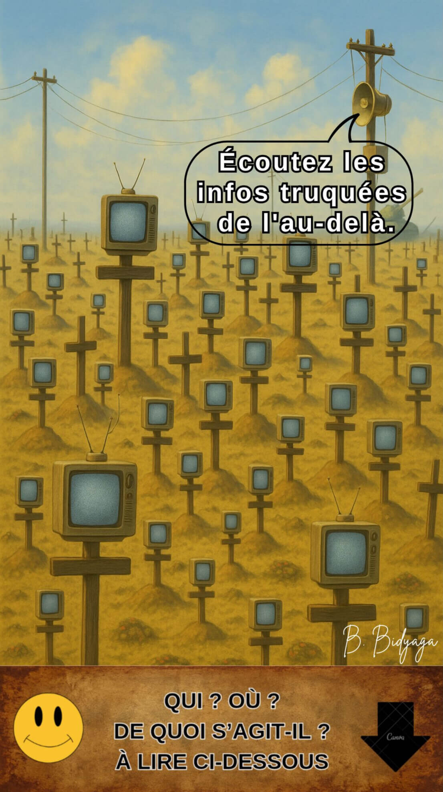

Additifs biologiquement actifs informationnels.
Augmentent la biodisponibilité de la propagande étatique jusqu’à 100 %.
Les composants actifs franchissent efficacement la barrière hémato‑encéphalique (du pensée critique).

**Gamme de produits** :

• RT-Fake-Hallucinate, comprimés de 100-500 mg à libération prolongée. Ne pas mâcher !

• Mixture-info-surrogate “Le Kremlin”, formule normalisée.

• Baume “Simulacres du christianisme”, parfum de haine, usage externe. Conditionnellement toxique.

• Sputnik-Data-Moulage, comprimés de 100-500 mg

• Teinture alcoolique “Valeurs traditionnelles”, multi‑composants. Suspension trouble à l’arôme cadavérique. Teneur : 40 %.

• RuMedia-Fact-Twister, poudre pour suspension. Hallucinogène, goût d’agression.

• Kremlin-Histoires-ersatz, kit d’injections intramusculaires, 100-500 mg. Versions 1.0 à 10.0.

• "Télévision-Grande-Illusion", suppositoires ultra-doux avec effet de démangeaison récto‑informationnelle. 100-500  mg.

• Bifilac-Info, 100-500  mg. Préparation enzymatique (bifido‑lacto‑info‑bactéries) pour digérer efficacement la désinformation, prévenir les indigestions et la constipation.

**Action pharmacologique** :

✓ Stimulants de Loyauté : excitent les centres de soumission et renforcent l'instinct grégaire aveugle.

✓ Agonistes de la Haine : stimulent l’amygdale (centre de la peur et de l’agression). Potentialisent la production de noradrénaline, orientant l’agressivité vers l’ennemi externe, ce qui soulage constructivement la tension sociale interne.

✓ Inhibiteurs d’Analyse : suppriment l’activité du cortex préfrontal, responsable de la pensée critique et de la logique.

✓ Bloqueurs d’Empathie : désactivent l’insula et le cortex cingulaire  antérieur, supprimant toutes formes d’empathie et de compassion.

Ne sont pas des médicaments officiels.

**Composition standardisée** :

Fakes – 50 %

Hallucinations – 20 %

Rêves vides – 10 %

Auto‑tromperie – 5 %

**Substances auxiliaires** :

La vie personnelle du président des États‑Unis, potins de célébrités, météo en Afrique, OVNI.

**Arômes (au choix)** :

Chauvinisme impérial, nationalisme d’extrême droite, patriotisme tapageur, fascisme ordinaire, haine aveugle, « Obama un crétin », « l’Occident pourri », « guerre sacrée ».

**Colorants / (re)hausseurs** :

"Valeurs traditionnelles" (triées), “liens spirituels” (renforcés), « la vie est devenue meilleure et plus joyeuse », « cendres radioactives », « nous vaincrons ».

**Mode d'emploi et posologie :**

La dose quotidienne est calculée selon la formule :
QI * 10 (mg). La dose quotidienne maximale est de 1300 mg.

À prendre avant le journal du soir, les émissions de V. Solovyov et M. Simonyan, l’émission finale de D. Kiselyov «Les nouvelles de la semaine », la « ligne directe » de Poutine, les briefings de D. Peskov et du ministère de la Défense.

 **À utiliser avec précaution** :
 
Syndrome d’hyper‑loyauté, sapio‑insuffisance.
En cas de poussée aiguë de bon sens, doutes sur la pureté de la ligne de l’État ou autres formes de résistance à la propagande : forme “Forte” recommandée.

**Contrôle des signes vitaux** :

Les niveaux de dopamine doivent rester dans la plage approuvée par l'État.
Une amplitude émotionnelle excessive peut provoquer le syndrome de loyauté euphorique.

**Effets secondaires** :

Délire patriotique, diarrhée élogieuse, vomissements incontrôlables avec insertions de slogans.
Dans de rares cas : thrombose idéologique, avec insuffisance cognitive aiguë.
Un résidu transitoire est possible (dans l’âme).
Pour éviter les effets secondaires, augmenter la dose progressivement ! Ne pas dépasser la posologie !

**Indications particulières** :

Préparation de la suspension :
prendre ½ verre d’une source trouble, ajouter 1 cuillère à café de poudre et mélanger.
Agitation soigneuse nécessaire (tant du liquide que de l'esprit) !
La biodisponibilité maximale est atteinte dans un état de stupeur contrôlée.

Ne sont pas des nootropiques –
N’améliorent pas les fonctions cognitives, mais les alignent avec l’idéologie d’État.
Si accidentellement ingérés par un journaliste indépendant ou un défenseur des droits humains, peuvent provoquer une réaction allergique aiguë.

**Durée de conservation** : illimitée.

#PoutinismeMilitaireOrthodoxe
                             👻   

## 53. SOMMET D'ANCHORAGE, ALASKA

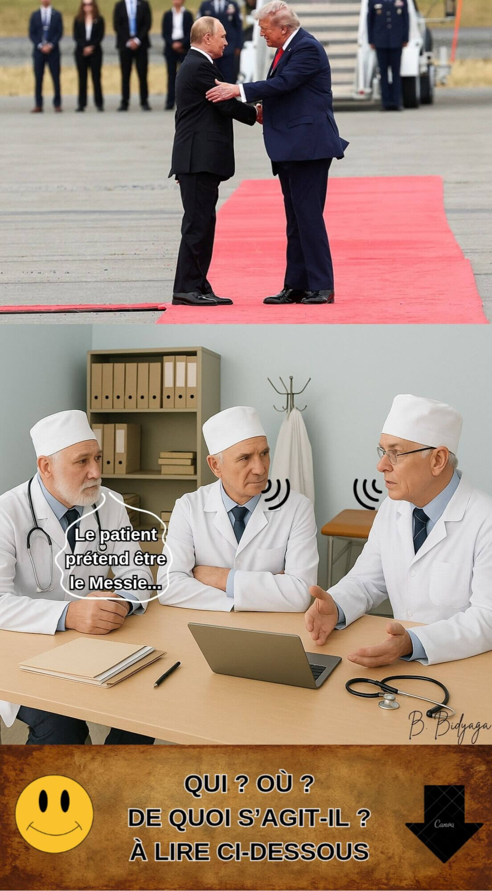

Hôpital psychiatrique. Bureau de consultation. Conseil médical : trois éminents professeurs sont attablés.

**Premier Professeur** :

— Le patient prétend être le Messie.

**Deuxième Professeur** :

— Quoi ?! Le Messie ?! Hier il se prenait pour Hitler !

**Troisième Professeur** :

— Aujourd’hui, il a une nouvelle mission : « Sauver le peuple frère ukrainien. »

**Premier Professeur** :

— Et comment compte-t-il s’y prendre ?

**Deuxième Professeur** :

— Comme d’habitude : bombardements, meurtres, enlèvements.

**Troisième Professeur** :

— Délire géopolitique paranoïaque avec complexe messianique…

**Premier Professeur** :

— De la pure folie, rien de plus.

**Deuxième Professeur** :

— Collègues, évitons le lyrisme. Il s’agit d’un trouble de la personnalité spécifique.

**Troisième Professeur** :

— Le patient pleure en disant : « L’Ukraine est notre douleur et notre tragédie. »

**Premier Professeur** :

— Et il radote sans cesse sur je ne sais quelles « causes profondes du conflit » qu’il « faut éliminer ».

**Deuxième Professeur** :

— Et toutes les cinq minutes, il hurle hystériquement : « Je veux tout le Donbass ! »

**Troisième Professeur** :

— Pour le reste — gai, alerte, actif, il a récemment rencontré ce... personnage... à la casquette rouge…

**Premier Professeur** :

— Ah, le fameux « pompier », capable d’arrêter les conflits armés d’un simple regard ?

**Deuxième Professeur** :

— C’est bien lui. Onze secondes entières à se serrer la main, puis ils ont défilé sur le tapis rouge, flirtant éhontément et se lançant des clins d’œil.

**Troisième Professeur** :

— Deux bottes d’une même paire, Seigneur pardonne-moi ! L’un délire sur le Donbass, l’autre sur le Nobel.

**Premier Professeur** :

— Oui, messieurs. La vanité est une chose dangereuse. Elle peut finir en trouble psycho-politique.

**Deuxième Professeur** :

— Collègues ! Je pense que nous voyons clairement un conflit d’intérêts. Il ne peut rien sortir de bon de tout ça.

**Troisième Professeur** :

— Pour l’Ukraine — absolument rien.

**Premier Professeur** :

— Vous avez raison. Il faut prendre des mesures.

**Deuxième Professeur** :

— Je suggère d’augmenter drastiquement les doses d’halopéridol. Voie orale et intramusculaire.

**Troisième Professeur** :

— Il serait aussi judicieux de prescrire des bains calmants de boue ukrainienne, accompagnés d’enregistrements de la chorale « Crimée est à nous ! ».

**Premier Professeur** :

— Et pourquoi ne pas essayer l’électrochoc ? C’est merveilleux pour les troubles spécifiques. Le Ministère de la Santé y a déjà donné son feu vert.

**Deuxième Professeur** (solennellement) :

— Le Ministère de la Santé met en garde… Si vous faites le  malin, vous prendrez trois mille volts dans le cul.
#PoutinismeMilitaireOrthodoxe
                                👻

## 54. L'UTÉRUS EN GRÈVE : RÉSERVÉ AUX MEMBRES VIP

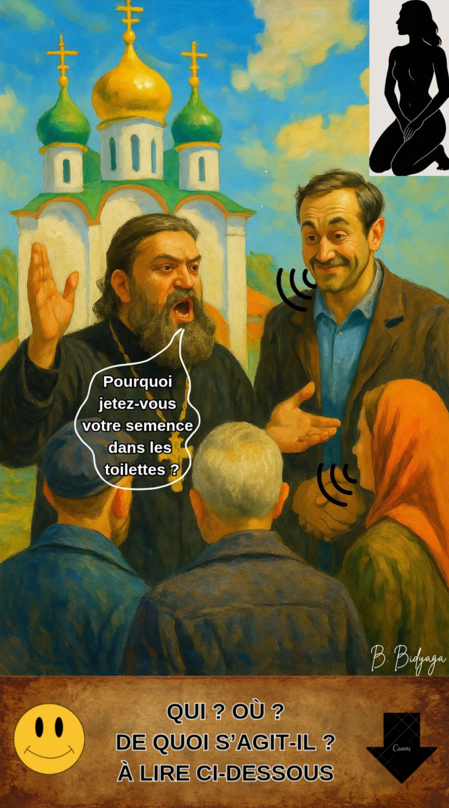

Église orthodoxe, ville russe.
Prédication sur le parvis.

**Le prêtre** :

— Pourquoi jetez-vous votre semence dans les toilettes ? C’est un péché mortel ! L’utérus de la femme est le seul réceptacle béni par Dieu pour votre semence !

**Un homme dans la foule** :

— L’utérus ? Il est toujours fermé. Pour inventaire. Des ovocytes. Réservé aux membres VIP.

**Le prêtre** :

— Ne blasphème pas, mon fils ! L’utérus n’est pas un entrepôt de conserves !

**Une femme dans la foule** :

— Membres VIP ? C’est le FSB, n’est-ce pas ?

#PoutinismeMilitaireOrthodoxe
                                👻

## 55. DISCRÉDITATION DES... ORGANES

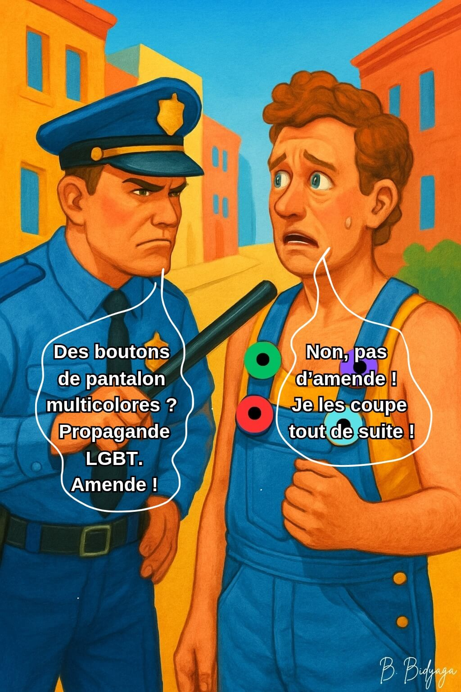

Une rue, ville russe.

**L’agent de police** :

— Des boutons de pantalon multicolores ? Propagande LGBT. Amende !

**L’homme** :

— Non, pas d’amende ! Je les coupe tout de suite !

(Pantalon baissé )

**L’homme** :

— Oh ! Pardon ! Ce n’est pas ce que je voulais faire !

**L’agent de police** :

— Aha ! Un drapeau ukrainien sur le postérieur ? Discréditation des... organes !

#PoutinismeMilitaireOrthodoxe
                                👻

## 56. LE CONFESSIONNAL : UN MIROIR DÉFORMANT

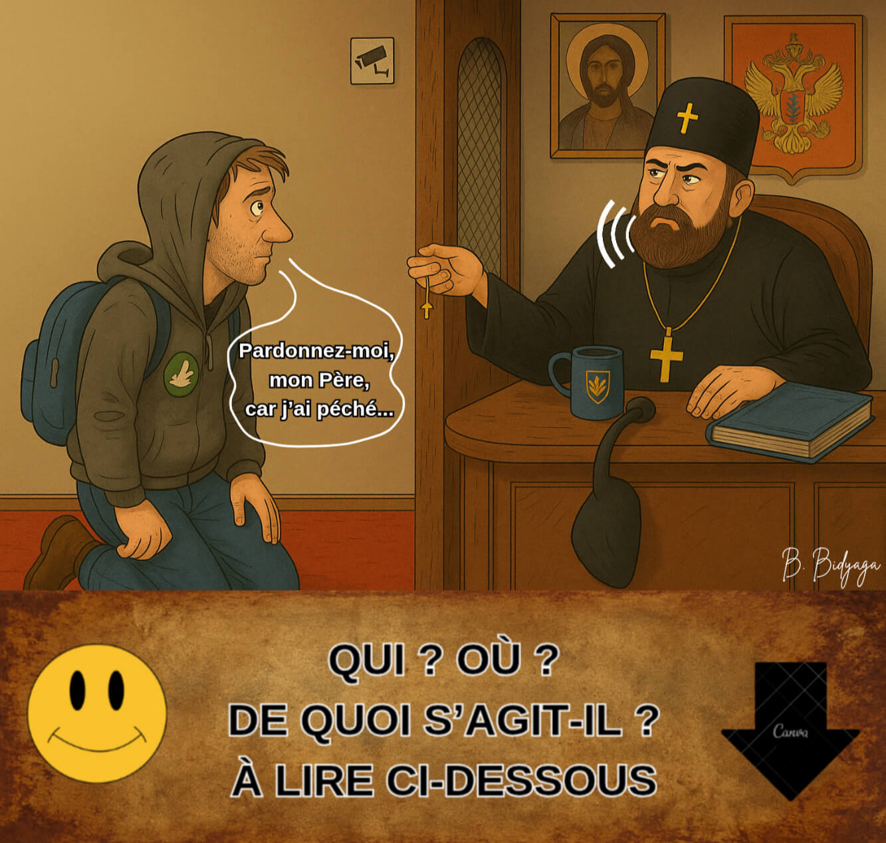

Église orthodoxe, ville russe.
Le confessionnal.

**Le pénitent** :

— Pardonnez-moi, mon Père, car j’ai péché... Je suis... un païentist. 

**Le prêtre** :

— Un pacifiste ?! Mais c’est une trahison, mon fils !

**Le pénitent** :

— Non, non ! Je veux dire... Je suis un exhibitionniste.

**Le prêtre** :

— Un ex bi sionist ? L’Église manifeste désormais sa tolérance envers l’identité bisexuelle non traditionnelle. Quant aux sionistes, Dieu leur accorde sa bénédiction...

**Le pénitent** (chuchotant) :

— Je suis fautif, mon Père ! J’ai... montré mon sexe lors d’une montagne-party...

**Le prêtre** :

— Vous êtes *l’étoile montante* du Parti ?! Que votre carrière soit longue et bénie, mon enfant !

**Le pénitent** :

— Je me repens, mon Père ! Mon péché est grand ! C’était... une montagne-party pour enfants...

**Le prêtre** :

— Une initiation précoce à nos valeurs spirituelles traditionnelles ? Une méthode pédagogique brillante, mon fils.

#PoutinismeMilitaireOrthodoxe
                               👻

## 57. BIENHEUREUX LES ACCOUPLÉS...

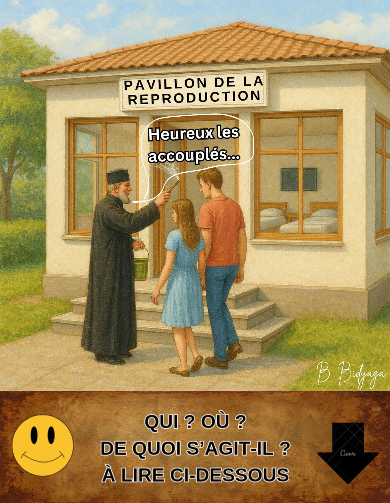

Russie, Moscou. Salle des séances de la Douma d'État. La députée Valentina Bebienko prend la parole à la tribune :

– Chers collègues députés ! Le Président nous a fixé pour tâche de ressusciter la grande Russie – en triplant le taux de natalité. Je ne le cache pas – la tâche n'est pas aisée. C'est une tâche difficile. Super difficile. Mais nous devons la remplir. Parce que notre président le veut. Je propose d'aborder le problème de manière créative. Bien entendu, notre public cible est la jeunesse. Les moins de 30 ans. Après 30 ans, influencer les consciences devient moins facile. Les schémas mentaux sont déjà formés, et une résistance au narratif d'État est observée.

Maintenant, souvenons-nous de notre triste enfance. Comment répondions-nous à ces… besoins, ces pulsions parfaitement légitimes de la puberté ? En cachette, furtivement, dans des cages d'escalier sombres sur des appuis de fenêtre sales, dans des caves humides, sur des greniers poussiéreux, ou tout simplement, que Dieu me pardonne, dans le parc derrière un buisson. Et toujours dans la tension : et si on nous voyait ? Et si les voisins se plaignaient ? Et si, Dieu nous en préserve, on se faisait surprendre – on vous embarque au poste, on dresse un procès-verbal, on appelle vos parents. En un mot, la honte pour le restant de vos jours. C’est une aberration, camarades. Cela va à l'encontre de la politique démographique de l'État. Corrigeons cette distorsion. Offrons à nos enfants et petits-enfants une enfance saine, digne et pleinement épanouie. Comme il y avait autrefois une cabine téléphonique à chaque coin de rue – qu'à sa place se dresse désormais un « pavillon de la reproduction » beau et bien entretenu. Avec des caméras de surveillance pour reconnaissance faciale – nous accorderons aux participants des bonus sociaux sur le Portail des services publics. À l'intérieur – une pièce spacieuse avec 4 lits doubles, une grande télévision au mur. Une vidéothèque avec des films et séries inspirants. Une armoire avec du Viagra et des accessoires. Dans l'ensemble, tout est très soigné, propre et attrayant, du papier peint joyeux au linge de lit aux motifs sexy. Et sur les marches, au lieu d'un portier – un pope, aspergeant d'eau bénite les entrants, avec cette bénédiction :
« Bienheureux les accouplés... au nom du Père et du Fils, et du Saint-Esprit... et conformément au Décret présidentiel numéro six-cent-soixante-six...»

Et après neuf mois, le système procédera automatiquement à une évaluation de l’efficacité. En cas de confirmation de la naissance d’un enfant, une prime unique sera versée aux parents. En cas de naissance d’un garçon, le montant sera doublé — conformément au programme national de militarisation de la politique démographique.

#PoutinismeMilitaireOrthodoxe
                                👻

## 58. LE BAC À SABLE GÉOPOLITIQUE

*Pièce de théâtre miniature inachevée*

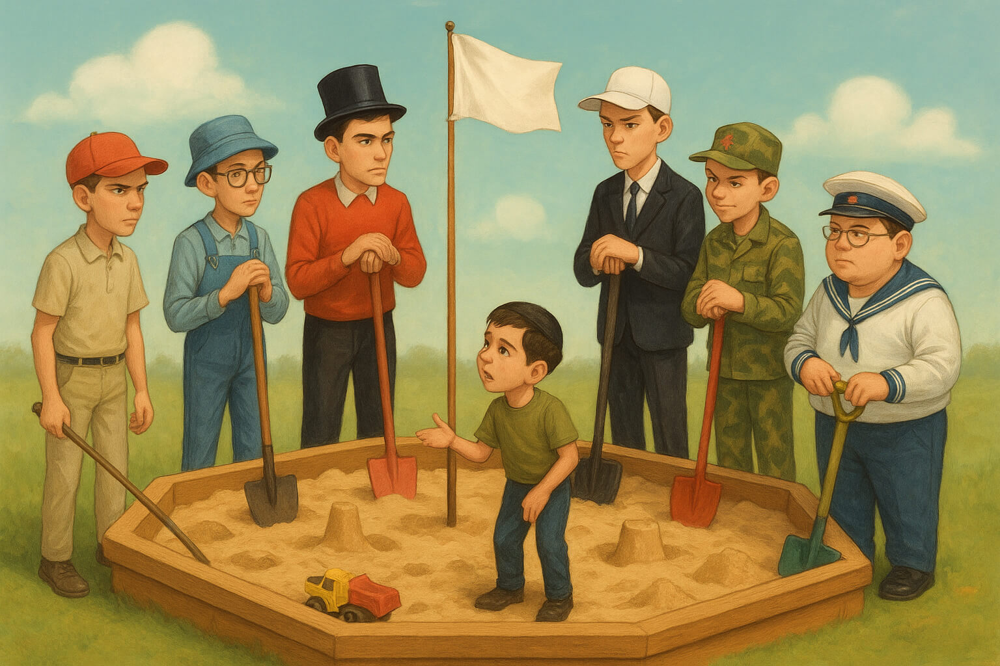

Sept garçons jouent dans un bac à sable : Le Voyou, le Juif et cinq autres. Chaque garçon est unique, portant un couvre-chef distinctif : une casquette rouge, une casquette blanche, un bob, une casquette de Marine,  un chapeau.

**ACTE 1**

Les garçons dans le bac à sable

**CHAPEAU** : 

— On a du nouveau ! Le Voyou a encore déclenché une bagarre.

**CASQUETTE BLANCHE :** 

— Contre qui cette fois ?

**CHAPEAU** : 

— Le Juif.

**CASQUETTE BLANCHE** (sévère) :

— Voyou, arrête ça immédiatement ! Il est inacceptable de troubler l'ordre du bac à sable !

**VOYOU** : 

— Et t’es qui toi pour me donner des ordres ?

**CASQUETTE BLANCHE** : 

— Je suis le délégué du bac à sable. Je suis l’autorité morale.

**VOYOU** : 

— Et moi, je suis l’autorité criminelle. Je m’en balance de tes règles. J’ai ma propre voie et mes propres valeurs morales.

**CASQUETTE DE MARINE** (prudemment) : 

— Mais pourquoi cette bagarre ? Quel est le litige ?

**VOYOU** : 

— Il m’a piqué ma terre !

**CASQUETTE BLANCHE :** 

— Depuis quand est-elle à toi ?

**VOYOU** : 

— Elle l’a toujours été. C’est là que repose la poussière de mon arrière-grand-père !

**CHAPEAU** : 

— Mais nous nous étions mis d'accord sur l'intangibilité des frontières ! Ton oncle Boris avait apposé sa signature !

**VOYOU** : 

— Boris était un idiot et un alcoolique. De ce fait, l’accord est déclaré nul et non avenu ! 
C’est mon terrain. Fin du baratin.

(Voyou s'approche de Juif et lui colle une châtaigne en plein thorax.)

**JUIF** : 

— À l’aide ! On me tue !

**CHAPEAU** : 

— Tiens bon, petit ! Nous allons adopter une Résolution. Primo : nous condamnons fermement cette agression !

**BOB** : 

— Secundo : nous reconnaissons le droit légitime du Juif à défendre son territoire par tous les moyens.

**CASQUETTE DE MARINE** : 

— Tertio : nous appelons le Voyou à respecter l'ordre établi et à cesser immédiatement le conflit.

**CASQUETTE BLANCHE :** 

— On ne devrait pas l'aider, quand même ?

**VOYOU** (faisant une grimace terrifiante) : 

— Essaie un peu ! Tu vas t'en prendre une dans l'œil !

**CHAPEAU** : 

— De tels propos sont inadmissibles ! Personnellement, ils m’inquiètent beaucoup.

**CASQUETTE DE MARINE** : 

— Et ils me préoccupent.

**BOB** :

— Les gars, faut être prudents avec lui. N'oubliez pas : il a un bulldozer.

**VOYOU** : 

— T’as pigé ! J'déboule avec le bulldozer и j’te lamine ce bac à sable, en deux-deux !

(Il frappe à nouveau le Juif.)

**JUIF** (dans un souffle) : 

— On m'éclate !

**CHAPEAU** :

— Mon inquiétude a décuplé.

**CASQUETTE DE MARINE :** 

— Ma préoccupation croît de manière exponentielle.

**CASQUETTE BLANCHE :** 

— J'ai entendu dire que son fameux bulldozer est tout rouillé et qu'il ne démarre plus.

**BOB** (d'une voix hésitante) : 

— On n'en sait rien... Et s'il l'avait réparé avec des bougies neuves ?

**CHAPEAU** : 

— Il faut faire preuve de circonspection. Ne le fâchons pas.

**BOB** : 

— Mais c’est clair : dès qu'il en aura fini avec le Juif, il s'en prendra à nous !

**CASQUETTE DE MARINE** : 

— Moi, bien sûr, je suis un peu plus loin, de l'autre côté du détroit, mais mes genoux tremblent quand même de peur. Écoutez : on va aider le Juif, mais petit à petit et en cachette. Comme ça, le Voyou ne remarquera rien.

**BOB** : 

— L'important, c'est de ne pas lui en donner trop. Si le Voyou commence à perdre du terrain, il va s'énerver. Et là, c'est sûr, il sort son bulldozer et il rase tout le bac à sable.

**CHAPEAU** : 

— C’est ça. Qu’ils se battent. Tant que le Voyou est occupé par cette bagarre, nous pouvons dormir sur nos deux oreilles.

**CASQUETTE BLANCHE :** 

— Excellent plan. C’est ce qu’on va faire.
 
 
**ACTE 2**

Le nouveau délégué

Un garçon en casquette rouge arrive près du bac à sable, un club de golf à la main.

**CASQUETTE ROUGE :** 

— Alors, qu'est-ce que vous foutez ? Quel bordel sans nom ! C'est de ta faute, vieille baderne. Dégage du bac à sable ! Ton temps est révolu. C'est moi qui mène la danse, ici.

**CASQUETTE BLANCHE :** 

— Très bien. Je m'en vais. J'ai fait ce que j'ai pu. Bonne chance avec ce conflit !

**CASQUETTE ROUGE :**

— Je ne suis pas venu pour tes enfantillages. Je suis venu récupérer ma Médaille d’Or de la Paix. Toi, avec tes stupides édits, tu n’as fait qu'attiser cette bagarre. Moi, je suis là pour y mettre un terme. Tu es une nullité, je suis le génie. Voilà l'abîme qui nous sépare. File !

(Casquette Blanche s'en va.)

**JUIF** (regardant le nouveau délégué avec espoir) : 

— Tu vas m’aider, n’est-ce pas ?
Tu es mon seul espoir !

**CASQUETTE ROUGE** (sévèrement) : 

— Tant de jeunes garçons sont tombés ! Des garçons magnifiques, superbes ! Et tout ça à cause de toi. Pourquoi t’es-tu laissé entraîner dans ce conflit ?

**JUIF** (abasourdi) : 

— Moi ?! Mais c'est lui qui a commencé !

**CASQUETTE ROUGE** : 

— Et tu n'as pas vu qu’il était mille fois plus fort que toi ? Un type normal ne cherche pas la bagarre avec des forces supérieures. Il fallait négocier tout de suite au lieu d'envenimer les choses.

**JUIF :** 

— Mais je ne pouvais pas lui donner ma terre ! Ma constitution me l'interdit.

**CASQUETTE ROUGE :** 

— Cesse tes balivernes ! Tu n'as plus aucune carte en main. Ce que tu n’as pas donné hier, tu es contraint de le donner aujourd’hui. Sinon, tu le donneras dans un an. Le résultat sera identique. Sauf qu'un demi-million de beaux garçons de plus finiront au cimetière.

**JUIF :** 

— Mais c’est injuste ! Tu ferais mieux de m’aider à le battre.

**CASQUETTE ROUGE** (avec réprobation) : 

— Le vieux t'a donné combien d'aide ? Des milliards de pièces. Tu n’as même pas dit merci. Tu ne fais que quémander. Et d'ailleurs, c'est passé où tout ça ? Où sont passés ces milliards ? Ils se sont volatilisés ?

**JUIF** : 

— J'ai honte de l'avouer, mais on en a un petit peu détourné. C'est arrivé comme ça. Je n'y suis pour rien !!!

**CASQUETTE ROUGE :** 

— Tous ces milliards, tu me les dois. J’ai entendu dire qu’on a trouvé de gros gisements de métaux rares sur ton lopin de terre ? Désormais, ils m’appartiennent.

**JUIF** (agité) : 

— C’est du vol !

**CASQUETTE ROUGE** : 

— Tu croyais avoir un tour de manège gratuit ? Ça ne marche pas comme ça. Signe ici.

**JUIF** : 

— Mais je n’ai pas les pouvoirs. Il me faut l'accord du parlement...

**CASQUETTE ROUGE :** 

— Ah, c'est comme ça ! Hé, Steve, appelle les gars — dites-leur de bloquer nos renseignements militaires.

**JUIF** (désespéré) : 

— Pas les renseignements ! Je t’en supplie !

**CASQUETTE ROUGE :** 

— Alors, tu signes ou pas ?

**JUIF** (accablé) : 

— Je signe.
 
 
**ACTE 3**

Mêmes personnages

**CASQUETTE ROUGE :** 

— Bien. Déclarons l'ouverture du processus de paix. J’exige que cette bagarre s'arrête immédiatement. Voyou, expose tes exigences.

**VOYOU** : 

— Il doit me donner deux régions. Démanteler la moitié de ses petits soldats. Et renoncer à rejoindre toute alliance militaire.

**CASQUETTE ROUGE** : 

— Hum... C'est raisonnable. Juif, t’es d’accord ?

**JUIF** (fermement) : 

— Uniquement sur mon cadavre.

**VOYOU** (avec un sourire malicieux) :

— Ça peut s'arranger.

**CASQUETTE ROUGE** : 

— Cessez de jouer la comédie ! Juif, c'est quoi le problème ?

**JUIF** : 

— Il veut que je lui donne la terre sans combattre. C’est absurde ! Il n'y a aucun précédent dans l’histoire militaire.

**CASQUETTE ROUGE :** 

— Pourquoi as-tu besoin de tant de terre ? La moitié de ta population a émigré.

**JUIF** : 

— Je ne peux pas. L’opinion publique est contre la cession volontaire de territoires.

**CASQUETTE ROUGE :** 

— Hé, Steve ! Bloquez les renseignements !

**JUIF** (précipitamment) : 

— D’accord, d’accord. Je suis d'accord, mais j'exige une étude approfondie des détails.

**CASQUETTE ROUGE** : 

— Et pour les soldats ? Et le renoncement aux clubs de combat ?

**JUIF** : 

— Dans ce cas, j'ai besoin de garanties de sécurité solides — au cas où le Voyou s'en prendrait à nouveau à mes terres. Qui me protégera ? Et comment ?

**CASQUETTE ROUGE :** 

— Je te donne ma garantie personnelle : en cas de nouvelle agression, nous... trouverons quelque chose. Garantie 100%.
 
 
**ACTE 4**

Mêmes personnages

**CASQUETTE ROUGE :** 

— J'ai tout mis en œuvre pour réconcilier ces deux bagarreurs. J’ai tout essayé. Mais pour une raison obscure, le processus de paix est au point mort.

**CASQUETTE DE MARINE :** 

— Tu es le meilleur négociateur — dur mais juste. Est-ce que je peux t'appeler "Papa" ?

**CHAPEAU** : 

— Quel surnom parfait ! Papa ! Nous admirons ton art de la diplomatie ! Cependant, on ne peut s'empêcher de remarquer que tu mets la pression sur le Juif, alors que tu soutiens pleinement les exigences du Voyou.

**BOB** : 

— Papa ! Nous suggérerions de faire pression aussi sur le Voyou — par exemple, tu pourrais donner des armes au Juif. Tu l’avais promis ! Mais pour une raison qu'on ignore, tu ne le fais pas...

**CHAPEAU :** 

— Apparemment, Papa a peur du bulldozer du Voyou.

**CASQUETTE ROUGE :** 

— Le bulldozer, c'est du bluff. Le Voyou essaie de nous intimider. Je n'ai pas peur du bulldozer. Ce que je crains vraiment, c'est qu’il se faufile derrière moi pour asperger mon pantalon d'essence et y mettre le feu.

(Chapeau, Casquette de Marine et Panama échangent des regards entendus et ricanent nerveusement.)

**CASQUETTE ROUGE :** 

— Pourquoi vous riez ? Vos pantalons sont tout aussi vulnérables que le mien face à lui ! Alors je vous conseille de bien réfléchir avant de donner des armes au Juif. Moi, personnellement, je m’en lave les mains.

**CASQUETTE DE MARINE :** 

— Dans ce cas, tu pourrais instaurer des sanctions secondaires contre le Voyou.

**CASQUETTE ROUGE :** 

— Les sanctions, c’est délicat. D'une part, je ne veux pas le faire fuir de la table des négociations. Pour l'instant, le Voyou fait des efforts, ce qui est tout à son honneur, et il faut l'apprécier. D'autre part, il possède les plus grandes réserves de métaux rares au monde. Pourquoi me brouiller avec lui si je compte, après la paix, commercer et exploiter conjointement ces gisements uniques ? En définitive, mes bonnes relations personnelles avec le Voyou constituent le gage de la paix future dans le bac à sable.

(Pause.)

**CASQUETTE ROUGE :** 

— Quant à vous trois — J'ai un sérieux compte à régler avec vous ! Vous croyez quoi ? Que je vais venir vous sauver quand le Voyou vous sautera à la gorge ? N’y comptez même pas. Arrêtez de vivre à mes crochets ! Vous êtes des grands garçons, apprenez à vous défendre seuls. Vous devez augmenter vos dépenses de défense à 5 % de votre PIB. C’est un ordre ! Et arrêtez cette immigration idiote ! Regardez-vous dans un miroir, voyez dans quel décrépitude vous êtes. Où sont passées votre aristocratie, vos valeurs morales, votre foi ? Vous détruisez votre identité de vos propres mains. Si ça continue comme ça, notre amitié est terminée !

 
**ACTE 5**

Mêmes personnages

**CASQUETTE ROUGE :** 

— Alors, je résume. Le treizième round de négociations a été saboté par le Juif, dont le comportement m'a forcé à le chasser du Bureau Ovale. Le quatorzième round a été gâché par le Voyou car, voyez-vous, son "Air Force One" s’est perdu dans un labyrinthe de nuages.

**VOYOU** (désinvolte) : 

— C’est la vérité — le Juif a brouillé tous mes instruments de navigation !

**CASQUETTE ROUGE :** 

— Bon, passons ! Fixons la date du prochain round. Et pas de bêtises ! Je propose jeudi prochain.

**JUIF** : 

— Pas possible — j’ai Chabbat.

**CASQUETTE ROUGE :** 

— Vendredi alors.

**VOYOU** : 

— C’est le jour où ils ont crucifié le Christ.

**CASQUETTE ROUGE :** 

— Samedi, dimanche, lundi alors...

**VOYOU** (secouant la tête négativement) : 

— Un deuil national de trois jours a été décrété dans tout mon pays...

**CASQUETTE ROUGE** (furieux) : 

— Alors, que ça soit aujourd’hui ! Tout de suite ! À l'instant même ! J’exige que vous fassiez la paix ! Asseyez-vous à la table des négociations !

(Casquette Rouge sort de derrière son dos une table pliante et deux chaises.)

**CASQUETTE ROUGE :** 

— Je vous en prie ! Prenez place !

**VOYOU** : 

— Ben voyons ! Ma chaise a disparu. C'est un sabotage direct du processus. Je ne peux pas négocier debout !

**JUIF** : 

— Et le pied de ma chaise est cassé ! C’est encore un coup du Voyou !

(Il brandit le pied de chaise en l'air.)

**CASQUETTE ROUGE** (fatigué, avec une expression de martyr) : 

— Le quinzième round de négociations est terminé. Le dialogue a été productif mais difficile. Nous attendons avec impatience la prochaine rencontre. Il y a de bonnes chances d’aboutir à un accord avant Thanksgiving.

#PoutinismeMilitaireOrthodoxe
                                👻 
                                

### CONCLUSION

Merci d'avoir été avec nous ! Vos likes, vos partages et la promotion de notre chaîne sont le meilleur soutien qui aide le projet à vivre et à se développer.
Si l’humour noir de l’auteur vous a plu, nous vous proposons de découvrir une œuvre encore plus percutante — la mini-pièce satirique illustrée « Se relevant de ses genoux »:

### REMERCIEMENTS

L’auteur exprime sa plus ironique gratitude à Vladimir Poutine — l’éternel doyen du Chambre n° 666 — pour sa colossale contribution à la satire mondiale, pour l’inépuisable matériau fourni en temps réel et pour son exemple personnel et édifiant de ce qu’il ne faut surtout pas faire pour diriger un pays.
Un merci tout aussi appuyé à tous ses camarades et voisins de pavillon : vous êtes une source intarissable d’absurde, de grotesque et d’humour noir. Sans votre dévouement absolu à la folie, cet album n’aurait jamais vu le jour — ou serait resté terne et ennuyeux.

### HOMMAGE AU SECRÉTARIAT D’ÉTAT AUX MIGRATIONS (SEM) DE SUISSE:

Vous êtes ma Muse. Celle qui a éveillé mon élan créateur par le désespoir et l'impasse. Celle qui a enflammé mon inspiration avec un café glacé. Celle qui m'a nourrie d'idées brillantes avec une ration de famine. Celle qui m'a offert le repos par des nuits blanches. 

Sans votre refus cynique de m'accorder l'asile, qui m'a condamné à vivre dans une tente glaciale, cette satire n'aurait peut-être pas atteint une telle acuité.

### DONNÉES DE PUBLICATION

Auteur : Olga Shcheglova (Boris Bidyaga)

ISBN : 978-5-9903439-3-1

© Olga Viktorovna Shcheglova, 2025

18+

[**Liste des fondations caritatives en soutien à l’Ukraine**](fr_funds)

[**Page d'accueil**](index.md)

