<meta name="robots" content="noindex, nofollow">

[**На головну сторінку**](index.md)

# 🇺🇦 ПАЛАТА №666
### Великий альбом сатиричних мініатюр

**Автор: Щеглова Ольга (Борис Бидяга)**

**ВАЖЛИВЕ ЗАУВАЖЕННЯ!**

Цей проект створювався в умовах системного цифрового переслідування. Російські спецслужби здійснюють систематичні кібератаки з метою спотворення та підміни правильного перекладу слів і виразів, прагнучи дискредитувати тексти та викривити їхній сенс. Також ФСБ систематично здійснює кібератаки на мій сайт, спотворюючи форматування текстів. Відносьтеся, будь ласка, з розумінням.
Якщо ви є носієм мови та помітили в текстах абсурдні, нелогічні, безглузді, «коряві», граматично неправильні слова та вирази, будь ласка, повідомте про конкретну помилку за наведеними нижче контактами (запропонуйте ваш варіант і поясніть, чому він кращий). Ваша допомога у забезпеченні мовної аутентичності та адекватності перекладів є безцінною у цій боротьбі за правду.
Контакти:
bbidyaga@protonmail.com

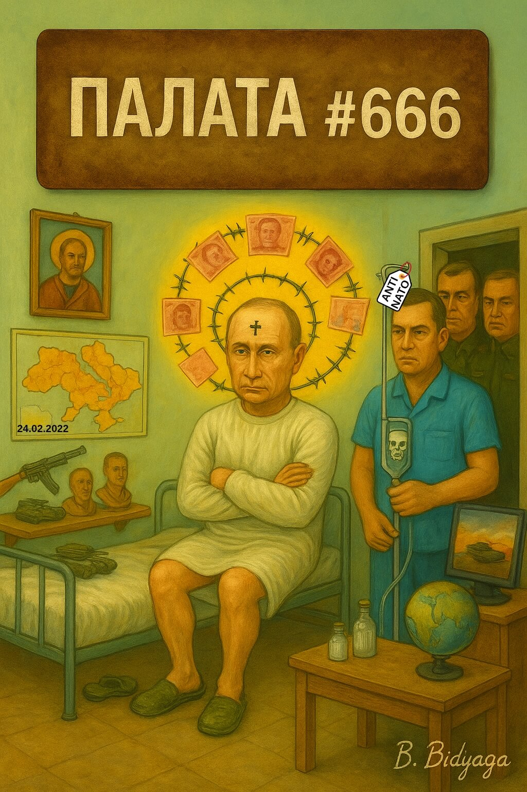

### ВСТУП

Перед вами — не просто збірка карикатур. Це — анатомічний аналіз путінської епохи: православний воєнний путінізм як форма колективного божевілля.
Тут — ікони з язичницькими богами, хрещення в окопах, свята вода — внутрішньом’язово. Тут — патріотизм із шкарпеткою на пенісі й бойові дельфіни Пентагону. У мініатюрах перед читачем постає країна, де війна витіснила здоровий глузд, «скріпи» — совість, а православ’я стало "мастилом" для ракетних установок.
Тут священники благословляють насильство, депутати торгують патріотизмом, а школа вчить не думати, а народжувати й коритися.

Лайки, комментарии, репосты — приветствуются. Ваша активность — лучшая поддержка проекта!

## 1. ПАТРІОТИЗМ ІЗ ШКАРПЕТКОЮ НА ЧЛЕНІ

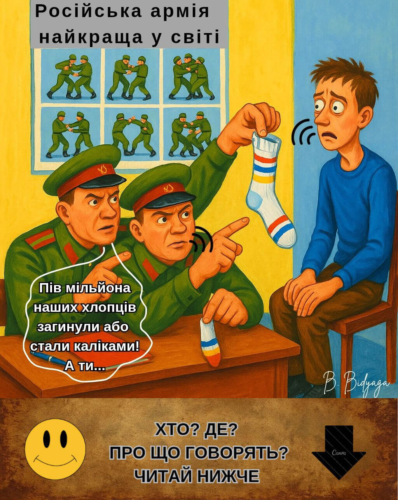

Військкомат у російському місті.
За столом сидять два офіцери. Навпроти — естрадний виконавець.

**Перший офіцер:**

— Пів мільйона наших хлопців загинули або стали каліками! А ти — на вечірці розважаєшся голяка з шкарпеткою на члені?!

**Співак:**

— Винен! Завтра ж їду в Бахмут… з концертом!

**Другий офіцер:**

— Саме так.
Завтра ти їдеш у Бахмут штурмовиком.

#ПравославнийВоєннийПутінізм
                                👻

## 2. СМІТТЯ ПЕРЕМОГИ: ЗДАВАЙТЕ ТАРУ! КОЖНА БАНКА ОСВІТЛЮЄ ШЛЯХ!

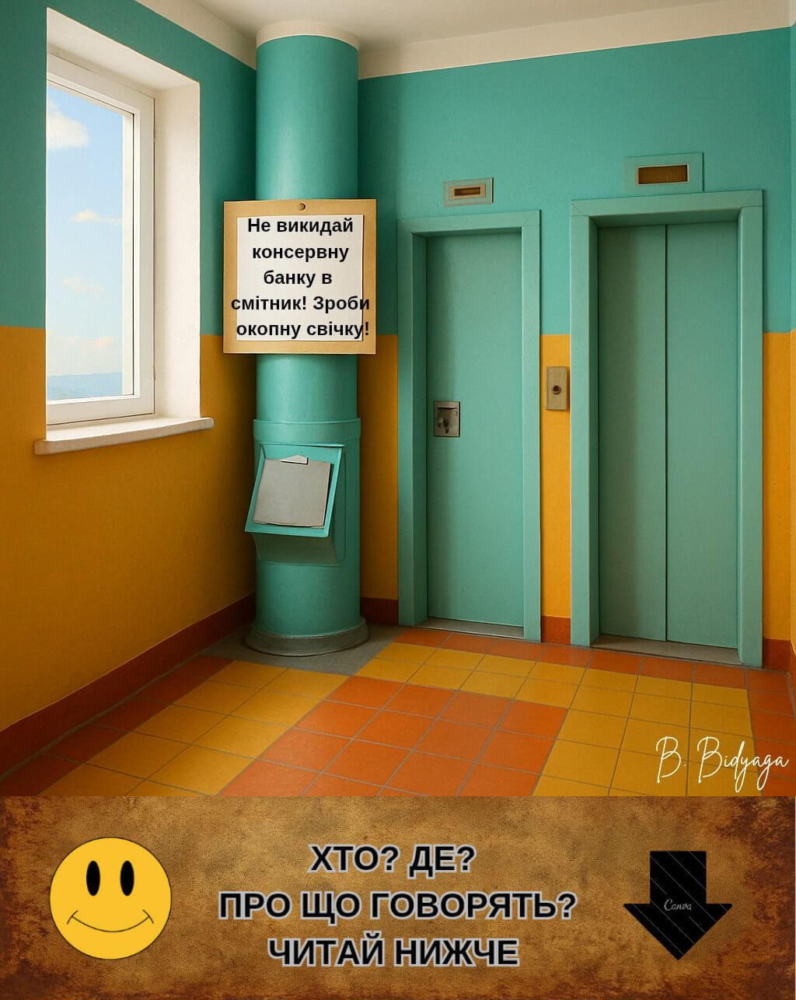

Росія. Москва.
Передліфтовий хол звичайної багатоповерхівки.
Оголошення на сміттєпроводі:
*«Не викидай консервну банку в смітник!
Зроби окопну свічку!»*

#ПравославнийВоєннийПутінізм
                                👻

## 3. МЕТОДИЧКА ФСБ: МАРГАНЦОВКА + ІНВАЛІД = ДИВЕРСАНТ ВСУ

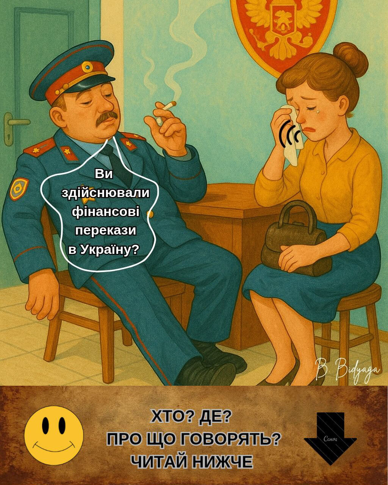

Відділ поліції в російському місті. Офіцер допитує жінку.  

**Офіцер:**

— Ви здійснювали фінансові перекази в Україну?  

**Жінка:**

— Так, я перевела 50$ братові в Київ. Він інвалід, зовсім безпорадний, йому потрібні ліки...  

**Офіцер:**

— Вітаю, мадам. Наклали на статтю. 275-я КК РФ, частина 1. Знаєте таку? Фінансування ЗСУ. Держзрада!  

#ПравославнийВоєннийПутінізм
                                👻

## 4. ПРИВАТИЗАЦІЯ РУЇН 

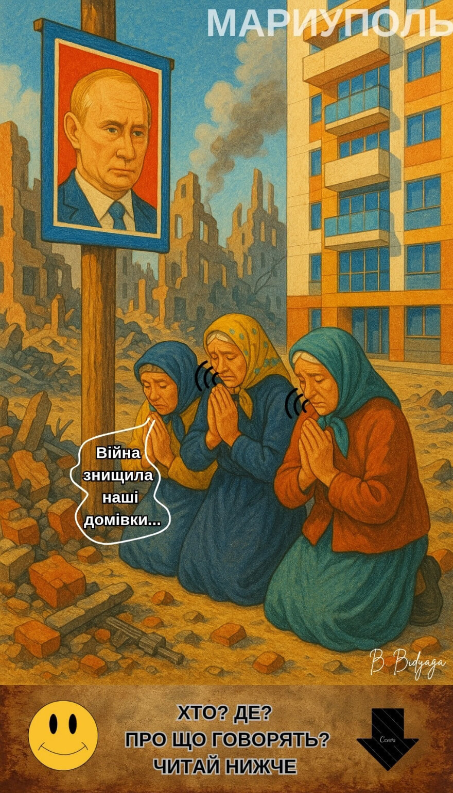

Зруйноване українське місто Маріуполь. На тлі свіжозбудованої багатоповерхівки три жінки моляться перед портретом Путіна.  

**Перша жінка:**

— Війна знищила наші домівки. Ми живемо на вулиці.  

**Друга жінка:**

— Новий будинок збудували  квартири — продають.  

**Третя жінка:**

— Ми не зможемо купити житло... Ми ж жебраки. 

**Усі три жінки хором:**

— Путіне, допоможи!  

#ПравославнийВоєннийПутінізм  
                                👻

## 5. ТУНГУСЬКИЙ СПЕЦЕФЕКТ: МОЖЕМО ПОВТОРИТИ!

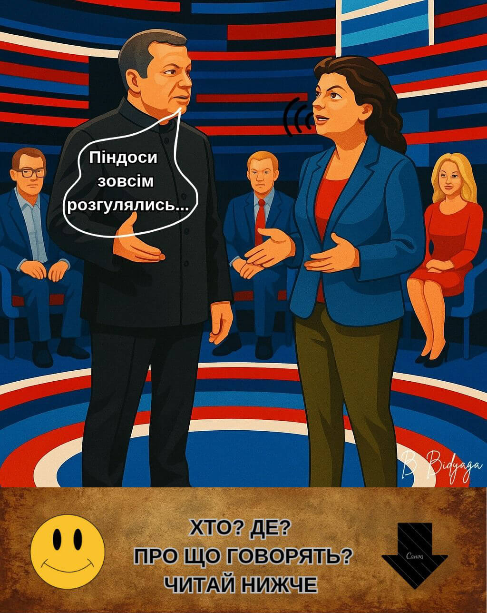

Росія. Москва.
Студія відомого російського пропагандиста Володимира Соловйова.
Він веде бесіду з ще більш відомою пропагандисткою — Маргаритою Симон'ян.

**Соловйов:**

— Піндоси зовсім розгулялись: перестали нас боятись! Це ж мара!  

**Симон'ян:**

— Тоді треба їх налякати. Ось що ми зробимо: ядерні випробування у прямому ефірі! Підриваємо пару класних нейтронних бомбочок, середньої потужності. Просто два симпатичні грибочки-близнючки над Сибіром. Заощадимо на салюті до 9 Травня. Хай бачать, що ми тут усі буйні.
 
#ПравославнийВоєннийПутінізм 
                                👻

## 6. ЧОБІТ ЯК ІНСТРУМЕНТ ДЕМАРКАЦІЇ

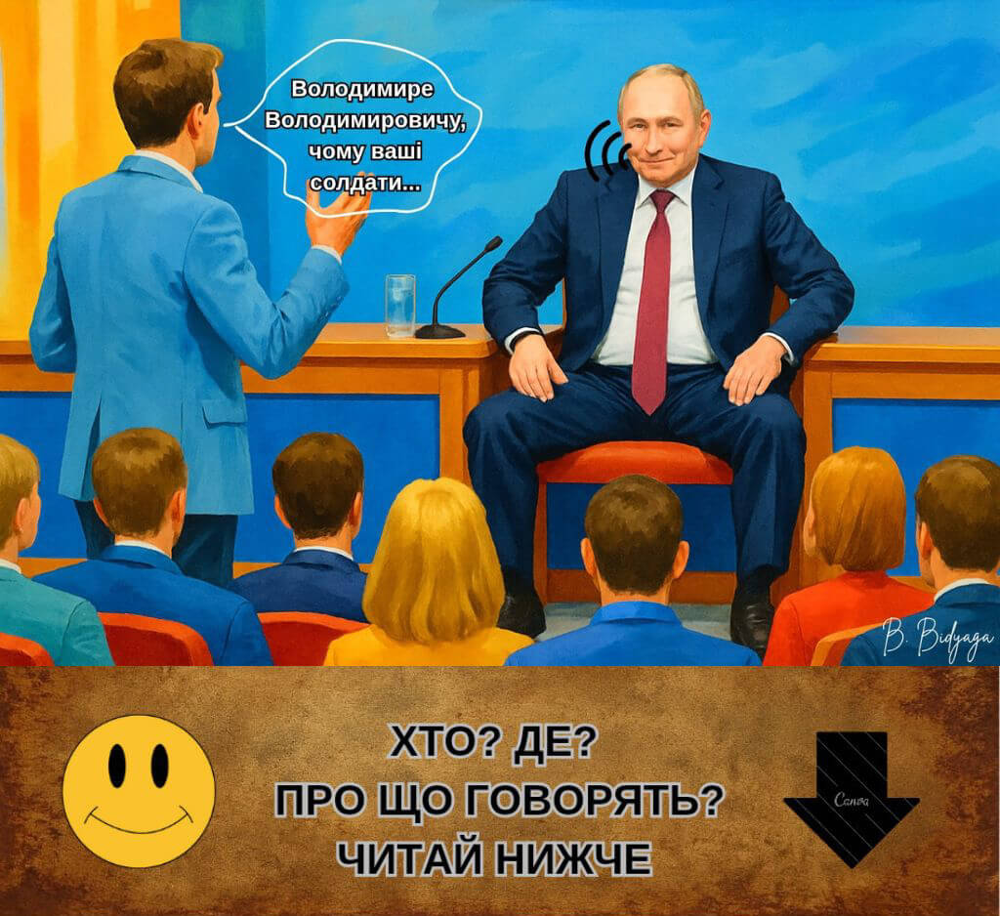

Пресконференція російського президента Володимира Путіна.

**Іноземний журналіст:**

— Володимире Володимировичу, чому ваші солдати «захищають батьківщину» на території чужої держави?

**Путін:**

— Це оптична ілюзія.
Запам’ятайте раз і назавжди:
де ступила нога російського солдата —
там і є територія Росії. Згідно з російським міжнародним правом.

#ПравославнийВоєннийПутінізм 
                                👻

## 7. ПРІОРИТЕТИ: ОПТИМІЗАЦІЯ ЧЕРЕЗ АМПУТАЦІЮ  

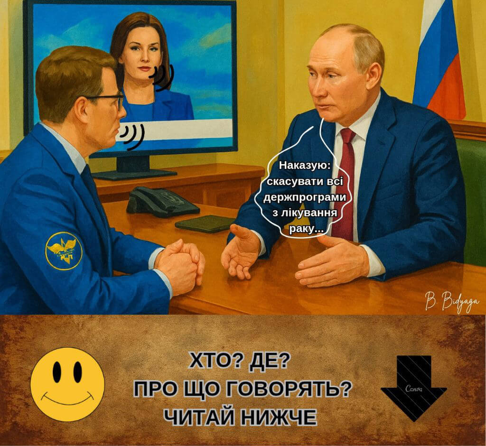

Росія. Москва. Кремль.
У кабінеті за столом сидять: президент Росії Володимир Путін і міністр охорони здоров’я Михайло Мурашко. По телевізору транслюють новину: у новому бюджеті витрати на медицину збільшено на 30%.

**Путін:**

— Наказую: скасувати всі держпрограми з лікування раку та безкоштовну роздачу ліків. Усі звільнені кошти спрямувати на виробництво протезів та реабілітацію воїнів.

**Мурашко:**

— Слухаюсь.

#ПравославнийВоєннийПутінізм
                                👻

## 8. МЕРЕЖІ ВІЙНИ, СУРОГАТИ ПУТІНА 

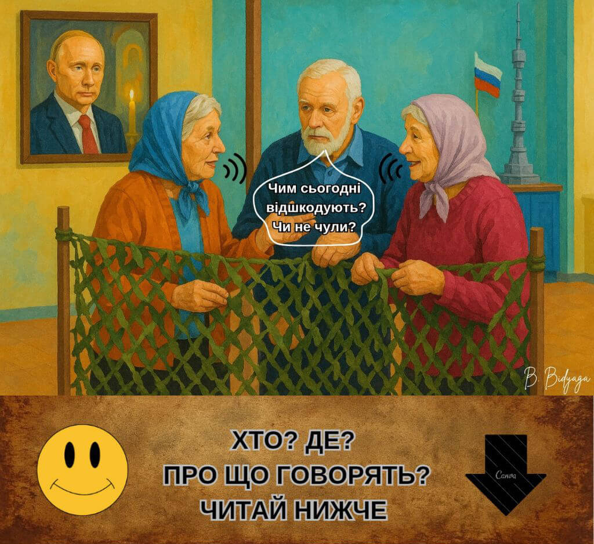

Росія. Москва.
Дозвiллєвий центр для пенсіонерів. Дві бабусі й дід плетуть маскувальну сітку.  

**Дід:**

— Чим сьогодні відшкодують? Чи не чули?  

**Перша бабуся:**

— Кажуть, знову видаватимуть шоколадки «Путін з нами»...  

**Друга бабуся:**

— Та це ж не шоколад! Одна соя!  

**Дід:**

— От так завжди: спочатку обіцяють шоколад, а потім підсовують Путіна! 

#ПравославнийВоєннийПутінізм  
                                👻

## 9. АСИМЕТРИЧНА ВІДПОВІДЬ («ВИ ВСЕ ОДНО НІЧОГО НЕ ДОВЕДЕТЕ»)

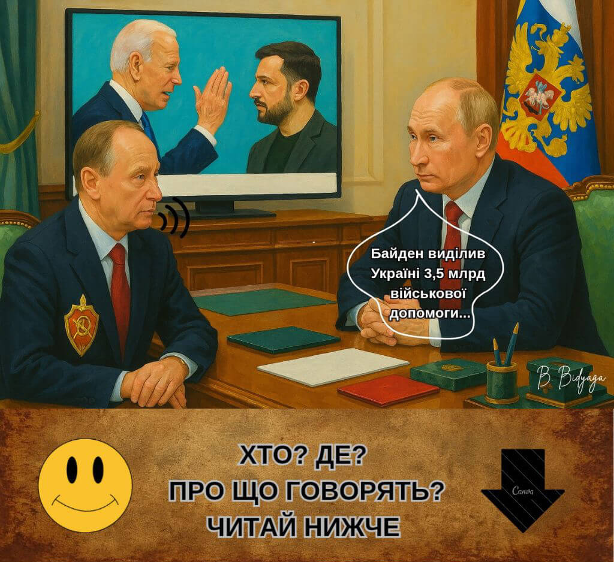

Росія. Москва. Кремль.
У кабінеті за столом сидять: президент Росії Володимир Путін та Секретар Ради безпеки РФ Патрушев М.П. На екрані телевізора президент США Джо Байден тисне руку президенту України  Володимиру Зеленському.  

**Путін (з холодною люттю):**

— Байден виділив Україні 3,5 млрд військової допомоги. Від його «хаймарсів» у мене по всій країні палають НПЗ. Це переходить усі межі. Ми не зобов’язані це терпіти. Дайте асиметричну відповідь.  

**Патрушев:**

— Слухаюсь. Влаштуємо «вогонь Прометея» над його улюбленим штатом. Там якраз резиденції його відплутка та цієї ідіотки Камали Гарріс. Сам винен: ми його попереджали!  

#ПравославнийВоєннийПутінізм 
                                👻

## 10. ФРОНТОВА БУХГАЛТЕРІЯ: ПОРАНЕНИЙ = СТАТТЯ ДОХОДУ 

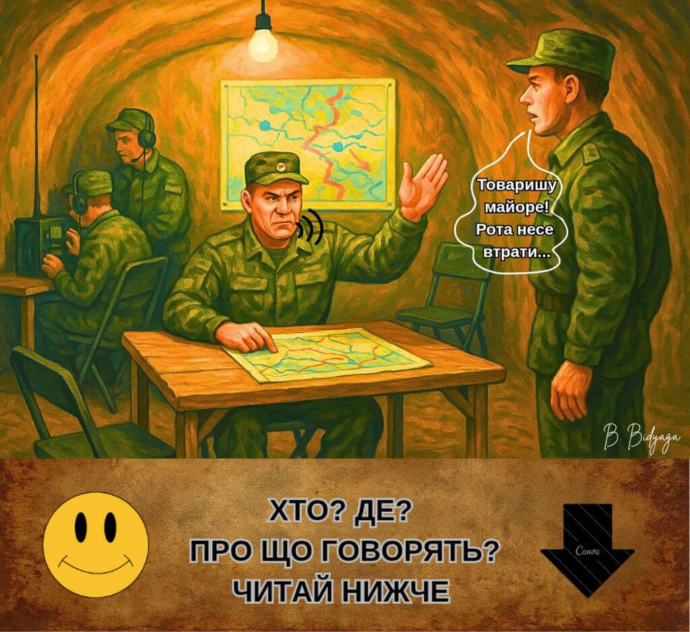

Російсько-український фронт. Штабна землянка. Діалог командира з сержантом.  

**Сержант:**

— Товаришу майоре! Рота несе втрати: семеро поранених стогнуть на нейтралці. Евакуювати?  

**Командир (не відриваючись від відомості):**

— Навіщо? Хай «перебувають у резерві». Будемо довольство за них отримувати. Головне — аби сходилася облікова чисельність.  

#ПравославнийВоєннийПутінізм 
                                👻

## 11. ТЮРЕМНИЙ ГУМАНІЗМ À LA RUSSE

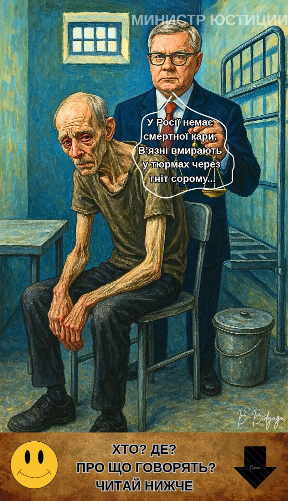

Типова російська тюремна камера. Дуже виснажений хворий в'язень. За його спиною стоїть міністр юстиції Російської Федерації Костянтин Чуйченко з  символом богині Феміди в руках.  

**Чуйченко:**

— У Росії немає смертної кари. В’язні вмирають у тюрмах добровільно — через гніт сорому та муки сумління. Впроваджується держпрограма гуманної стимуляції добровільного відходу:  

— Крапельниця каяття, 

— Дієта «пробудження сумління» (тюремний стіл №1),

— Ароматерапія «виховання патріотизму» (відкрита параша в камерах ШІЗО).

Російська Феміда — найгуманніша у світі! 

#ПравославнийВоєннийПутінізм 
                                👻

## 12. ОБОРОНА ВІД ЗДОРОВОГО ГЛУЗДУ

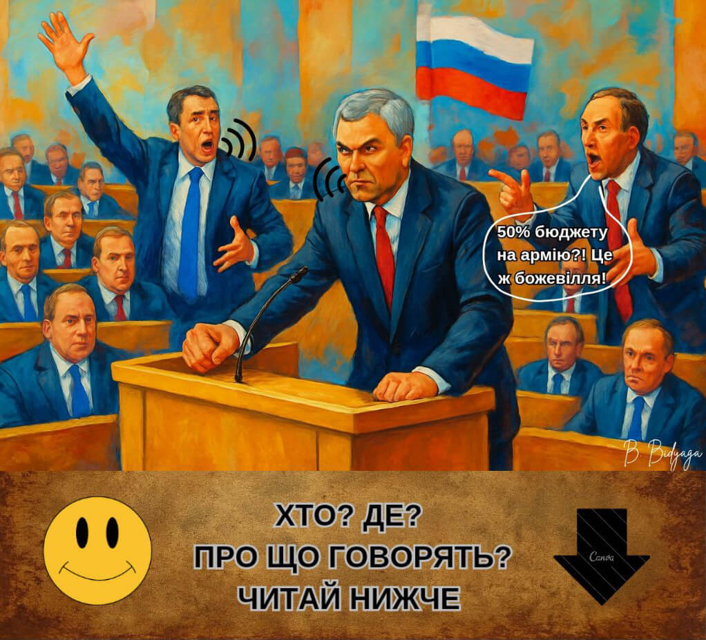
  
Росія. Москва.
Зал засідань Держдуми РФ. Обговорюють бюджет.  

**Перший депутат:**

— 50% бюджету на армію?! Це ж божевілля! А медицина? А наука? А освіта?!  

**Другий депутат:**

— Наша священна мета — демилітаризація України! Треба йти на жертви! На 3D-принтері гармати не друкувати, знаєте.
**Перший депутат (з гірким сміхом):**

— А на ділі виходить — мілітаризація Росії! Ми всі скінчимо в камуфляжі!

**В'ячеслав Володін, спікер Держдуми РФ:**

— Дебати припинено! Бюджет прийнято одностайно!  

#ПравославнийВоєннийПутінізм 
                                👻

## 13. СМЕРТОНОСНА ЗБРОЯ: ПЛАСТИКОВИЙ СТАКАНЧИК

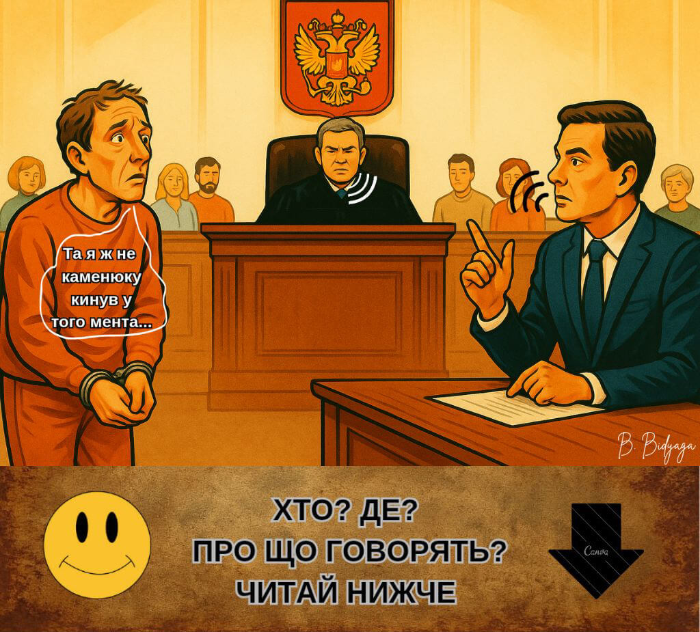

Зала засідань російського суду: підсудний, захисник, суддя.
Діалог.

**Підсудний:**

— Та я ж не каменюку кинув у того мента — а всього лише пластиковий стаканчик!

**Захисник:**

— Вважаємо вирок надмірно суворим! Вимагаємо пом’якшення покарання!

**Суддя:**

— Не бачу жодних підстав. Маємо очевидну спробу злочину: спершу стаканчик — потім камінь. Налице візуальний заклик до терору. Налице публічна демонстрація терористичних методів. Вирок залишається чинним!

#ПравославнийВоєннийПутінізм
                                👻

## 14. ЗАКОН ПРО НЕГІДНИКІВ: ПРЕВЕНТИВНИЙ ГРАБІЖ 

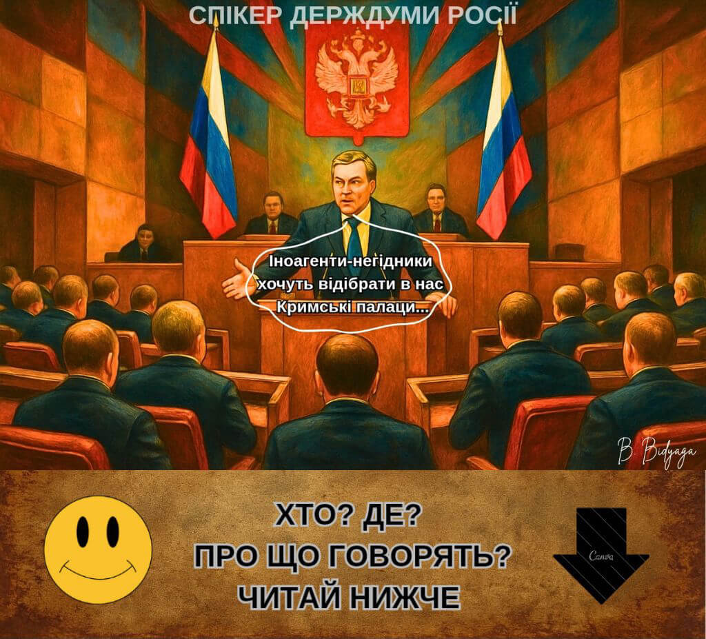

Росія. Москва.
Зал засідань Держдуми РФ. Її спікер Володін виголошує промову з трибуни.

**Володін (пафосно):**

— Іноагенти-негідники хочуть відібрати в нас:  

• Кримські палаци (символ величі Росії!)

• Донбаські шахти (затоплені, але все одно наші!)

• Пляжі Маріуполя (оплачені нашою кров’ю!)

• Мелітопольську черешню (наш стратегічний священний фрукт!).

Дамо негідникам відсіч!  

Приймаємо закон про превентивну конфіскацію:  

• Квартири — за крамольні заклики

• Дачі — за наклепницькі вигадки

• Рахунки — за непатріотичні фантазії.

Вони мають нахабство бажати — ми маємо владу конфіскувати!

#ПравославнийВоєннийПутінізм
                                👻

## 15. МРІЇ ПРО ДНІПРО 

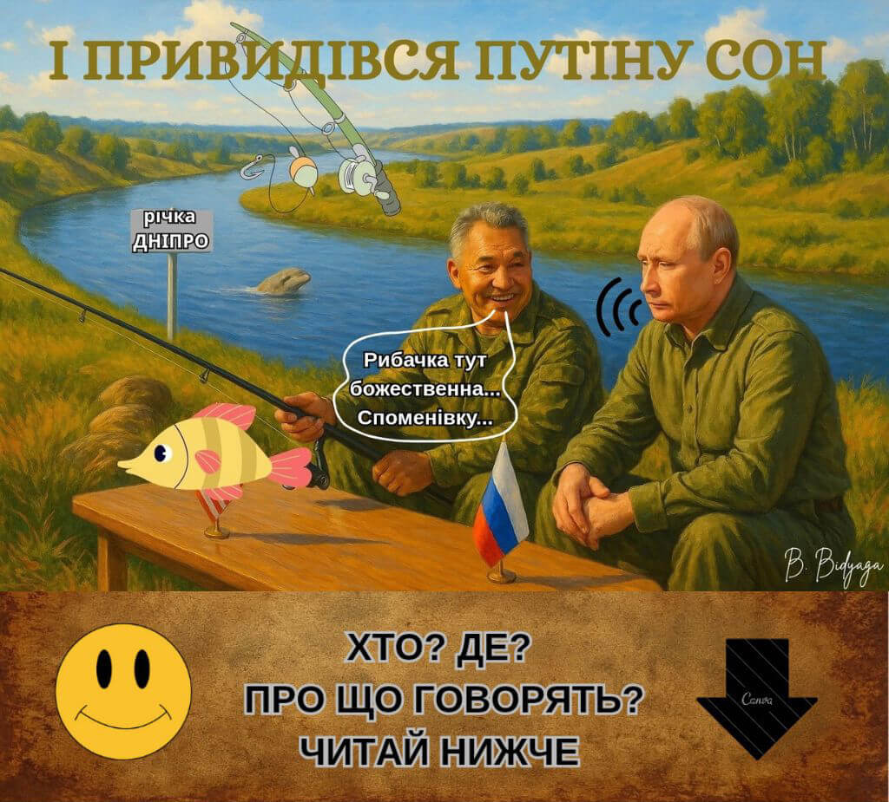

Президенту Росії Володимиру Путіну сниться сон. Ніби він сам і міністр оборони Сергій Шойгу рибалять на Дніпрі в Україні.

**Шойгу:**

— Рибачка тут божественна... Споменівку... Наша річечка, давньоруська... Волга-матінка та Дніпро-батюшка — від них уся вода на Русі пішла... Як казав великий російський поет: «Чуден Дніпро при тихій погоді...» 

**Путін:**

— Так-так... Між іншим, тисячу років тому на цьому самому місці Князь Володимир спіймав гігантського Окуня вагою у 3 пуди! Про це є запис у «Повісті врем'яних літ»!  

(Путин прокидається. За вікном — мряка. Над Москвою-рікою стелиться гидкий сірий туман. Путін набирає номер Мединського.)

**Путін:**

— Володимире Ростиславовичу? Терміново внесіть Окуня у новий підручник історії! Так, того самого… Як символ… російської… великодержавності. І щоб з ілюстрацією!  

*Мединський В.Р. — офіційний «творець історії» від кремлівського режиму. Спеціалізується на міфотворчості та пошуку «історичних» виправдань для війни проти України.*

#ПравославнийВоєннийПутінізм
                                👻

## 16. РОЗВІДКА ДОПОВІЛА: У ДИТЯЧІЙ КІМНАТІ ШИЛИ ФОРМУ 

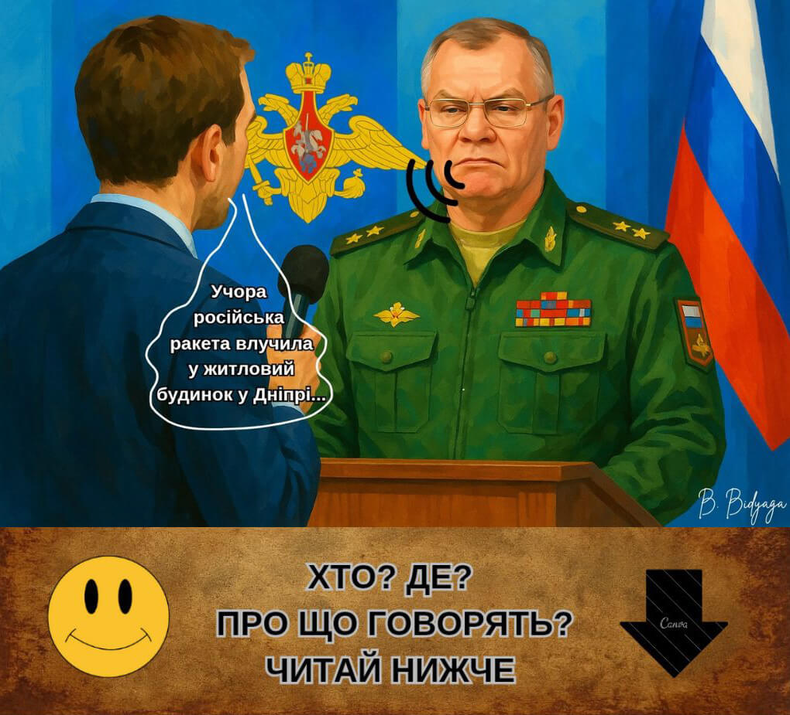

Прес-конференція Міноборони РФ. На запитання відповідає генерал Конашенков, голова департаменту інформації.

**Кореспондент:**

— Учора російська ракета влучила у житловий будинок у Дніпрі. Загинула українська сім'я. Як ви прокоментуєте цей конкретний акт? 

**Генерал Конашенков:**

— Я повторюю, як справжній патріот Росії: армія рф ніколи не бомбила і ніколи не бомбитиме цивільні цілі. Армія РФ не бомбить цивільні об'єкти. За оперативними даними розвідки, це був підпільний цех з пошиття військової форми.  

**Кореспондент:**

— Серед загиблих були діти…

**Генерал Конашенков:**

— Вони вчилися вишивати шеврони.  

#ПравославнийВоєннийПутінізм 
                                👻

## 17. НЕОПАТРІАРХАТ: ЕМАНСИПАЦІЮ СКАСОВАНО

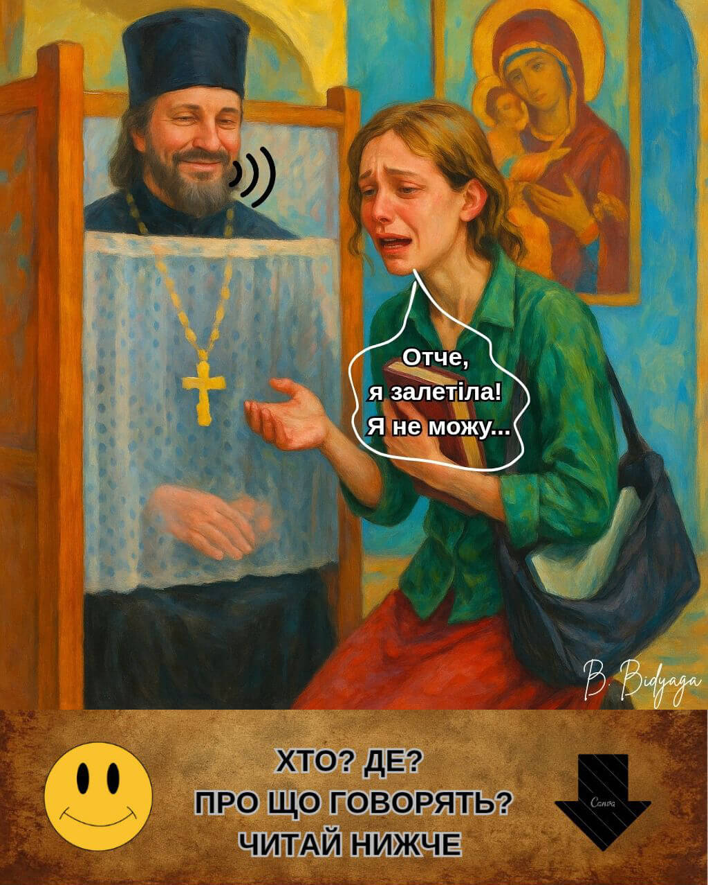

Росія. 
Сповідальня у православній церкві. За фіранкою — священик. Дівчина, ридаючи, сповідається.

**Дівчина:**

— Батюшко, у мене велика біда, я завагітніла! Я не знаю, що робити! Я на третьому курсі університету... Я хочу закінчити навчання... Хто виховуватиме дитину?

**Священик (усіченим голосом):**

— Жінці освіта ні до чого. Так вчить Церква, так говорять святі отці. Покликання жінки — народжувати й мовчати. Покора та материнство — ось твоє майбутнє. І отримаєш ти свою нагороду на Небі. Наш останній Собор постановив: "Жіноча освіта — спокуса від Лукавого".

#ПравославнийВоєннийПутінізм 
                                👻

## 18. З ЧЛЕНОМ У РУЦІ — ПЕРЕМОГИ НЕ ЧЕКАЙ!

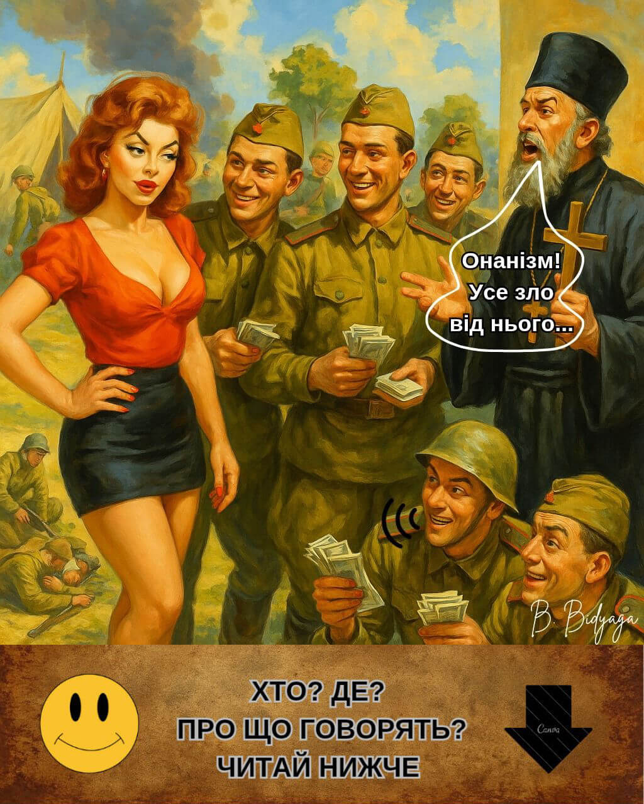

Російсько-український фронт.  
Російські солдати торгуються з повією. Неподалік проповідує священик.

**Священик:**

— Онанізм! Усе зло від нього! Через рукоблудство почалась ця війна! Одумайтеся, воїни! Годі мастурбувати! У вашій руці має бути зброя, а не член!  

**Солдат:**

— Знав би ти, попе, яка тут націнка на шльонд — мовчав би у тряпочку!  

#ПравославнийВоєннийПутінізм
                                👻

## 19. ХОЧУ НА МІСЯЦЬ

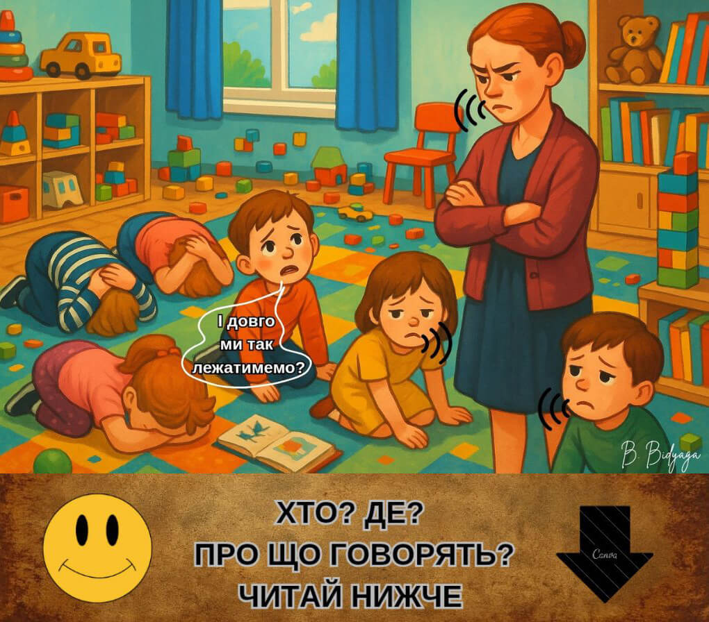

Дитячий садок у російському місті. Повітряна тривога. Дітей змусили лежати обличчям до підлоги.

**Перша дитина:**

— І довго ми так лежатимемо?

**Вихователька:**

— Аж поки наші не зіб’ють усі ворожі дрони.

**Друга дитина:**

— Значить, надовго.

**Третя дитина:**

— А давайте всі полетимо на Місяць!

#ПравославнийВоєннийПутінізм
                                👻

## 20. "РОЗМОВИ ПРО ВАЖЛИВЕ"

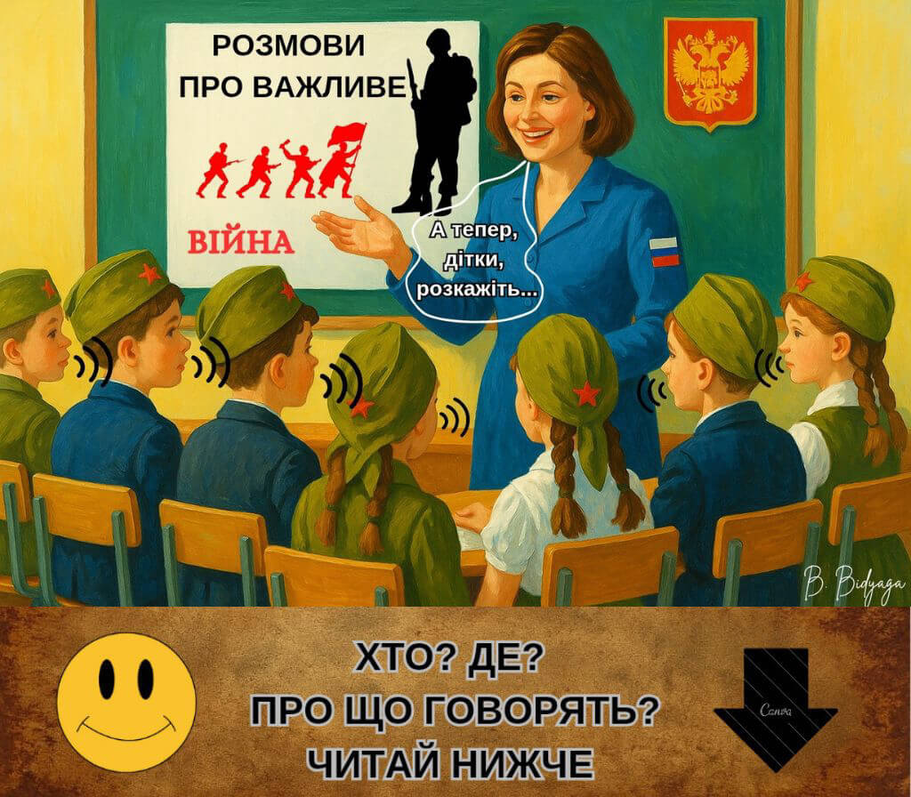

Школа у російському місті.
Урок «Розмови про важливе».

**Вчителька:**

— А тепер, дітки, розкажіть, ким ви хочете стати, коли виростете.

**Толя:**

— Я стану льотчиком, бомбитиму ворожі міста.

**Маша:**

— А я — медсестрою, виноситиму поранених з поля бою.

**Гена:**

— А я стану генералом, сидітиму в штабі й віддаватиму накази.

**Вчителька:**

— А ти чого мовчиш, Іванку? Скажи нам, ким ти хочеш стати.

**Іванко (зі зітханням):**

— А я, Олено Петрівно, в психлікарні сидітиму. Подалі від цього дурдому.

#ПравославнийВоєннийПутінізм
                                👻

## 21. НЕ ДОВОДЬТЕ МЕНЕ — Я НЕВМІНОВАНИЙ

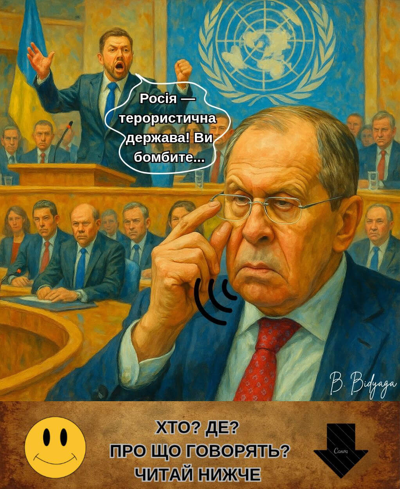

Засідання Ради Безпеки ООН.

**Представник України:**

— Росія — терористична держава! Ви бомбите житлові будинки, вбиваєте дітей, ґвалтуєте жінок, грабуєте домівки, порушуєте закони війни. Настане час — і ви за все відповісте! Росію — під суд!

**Глава МЗС РФ Сергій Лавров**:

— Дебіли, бл@дь!

#ПравославнийВоєннийПутінізм
                                👻

## 22. ТВОЄ ЖИТТЯ ОПЛАЧЕНО. УГОДА — БЕЗ ЗДАЧІ

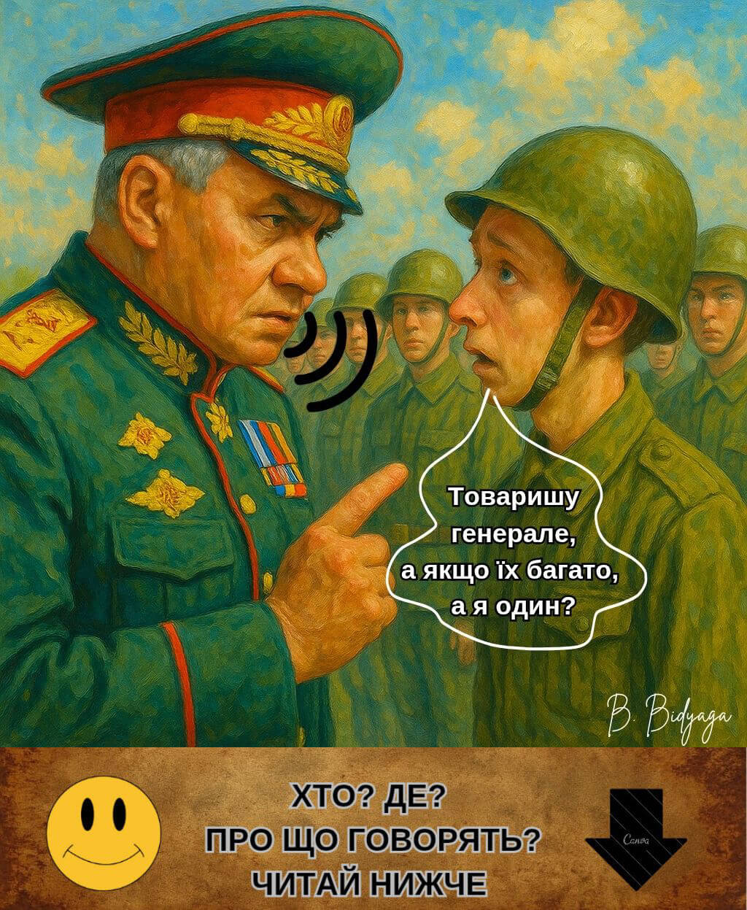

Російсько-український фронт. Ближній тил. Шикування на плацу. Міністр оборони РФ Сергій Шойгу стоїть перед строєм солдатів.

**Солдат:**

— Товаришу генерале, а якщо їх багато, а я один?

**Шойгу:**

— Стріляй до останнього патрона, сину.
Якщо, не дай Боже, візьмуть живим — це стаття: добровільна здача в полон.

**Солдат:**

— А я не хочу помирати!

**Шойгу:**

— Твоє життя оплачено. Щедро. Без здачі. Виконуй свою частину — без здачі.

#ПравославнийВоєннийПутінізм
                                👻

## 23. БУЧА: ДЛЯ ОДНИХ — ВІЙНА, ДЛЯ ІНШИХ — ТЕАТР

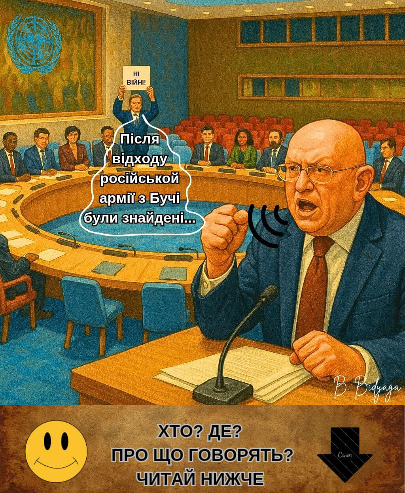

Засідання Ради Безпеки ООН.

**Представник України:**

— Після відходу російської армії з Бучі були знайдені сотні тіл мирних мешканців. Їх убили путінські солдати!

**Представник Росії:**

— Нахабна брехня! Жодних трупів не було! Українська інсценізація! Драмтеатр воєнних дій!

#ПравославнийВоєннийПутінізм
                                👻

## 24. СЬОГОДНІ — МУЗИКА, ЗАВТРА — ДЕРЖЗРАДА

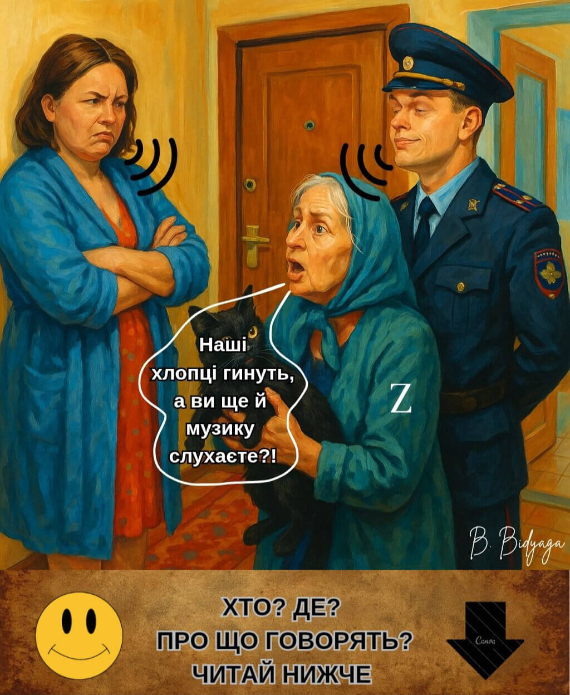

Росія. Москва.
Діалог у квартирі звичайного багатоповерхового будинку: господиня, сусідка і поліцейський.

**Сусідка:**

— Наші хлопці гинуть, а ви ще й музику слухаєте?! Це дискредитація!

**Господиня:**

— Я не винна, що ці ідіоти пішли на війну.  
Я їх не кликала, не годувала, у військкомат не волокла. Мільйонів захотілось — хай тепер лежать.  

**Поліцейський:**

— Плюс розпалювання ненависті до російської армії. Це вам у копієчку виллється!

#ПравославнийВоєннийПутінізм
                                👻

## 25. С-300: УНІВЕРСАЛЬНА ПЛОМБА-БОМБА 
 
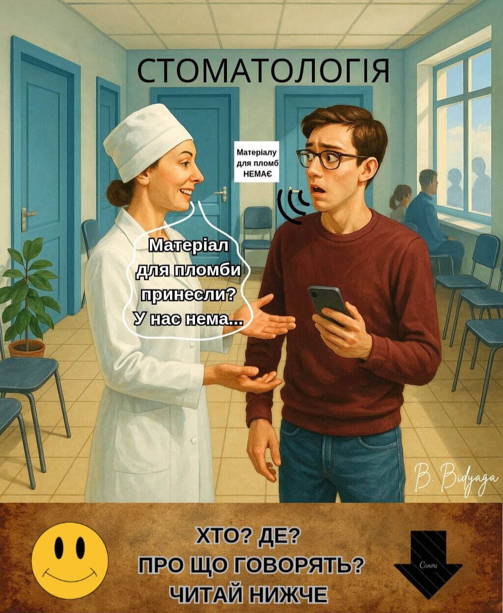

Стоматологічна клініка у російському місті.
На дверях кабінету оголошення: "Матеріалу для пломб НЕМАЄ."
У холі стоматолог розмовляє з пацієнтом.

**Лікар:**

— Матеріал для пломби принесли? У нас нема. Закінчився. Санкції. Сами розумієте. Зараз є тільки будівельний піскобетон С-300. Гарантія — місяць. Якщо, звісно, одразу не помрете.

**Пацієнт:**

— Знаєте, я, мабуть, піду. Тим паче — зуб уже не болить. Якось, знаєте, раптом саме минуло.

#ПравославнийВоєннийПутінізм
                                👻

## 26. У ВОРОЖКИ: ЦИФРИ НЕ ОБМАНЮЮТЬ

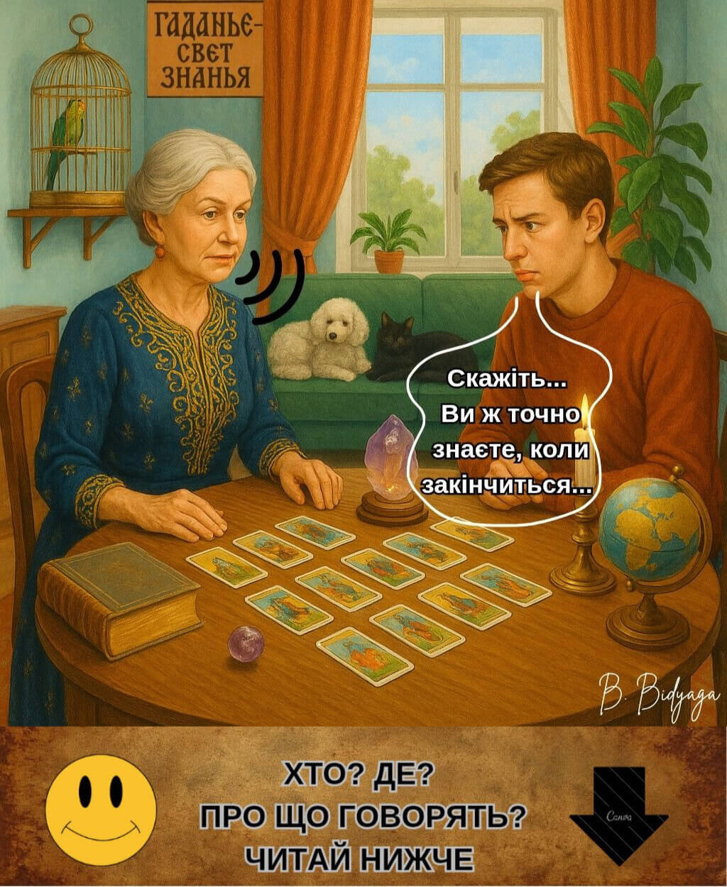

Молодий чоловік у студії  ворожки у російському місті.

**Чоловік:**

— Скажіть... Ви ж точно знаєте, коли закінчиться ця війна?

**Ворожка:**

— Звісно. Зараз підрахуємо... Сьогодні у нас... 25.05.25. Множимо... 25×5×25... Через 3125 днів.

#ПравославнийВоєннийПутінізм
                                👻

## 27. ПАЛІАТИВНА МЕДИЦИНА "ТРИМАЄМОСЬ НА МОЛИТВАХ"

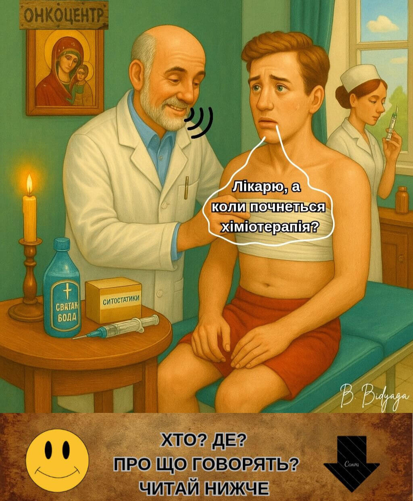

Онкологічний диспансер у російському місті.
Кабінет лікаря. Пацієнт сидить на кушетці, лікар накладає марлеву пов’язку йому на груди.

**Пацієнт:**

— Лікарю, а коли почнеться хіміотерапія?

**Лікар (байдуже):**

— Не в цьому житті. Бюджети скоротили. Так… пов’язочку тугіше — сповільнюємо метастази. Сестро! Ін’єкцію святої води! Тримайтеся! Ми за вас молимось.

#ПравославнийВоєннийПутінізм
                                

## 28. ПІДНОЖНИЙ КОРМ ДЛЯ СПРАВЖНІХ СОЛДАТІВ

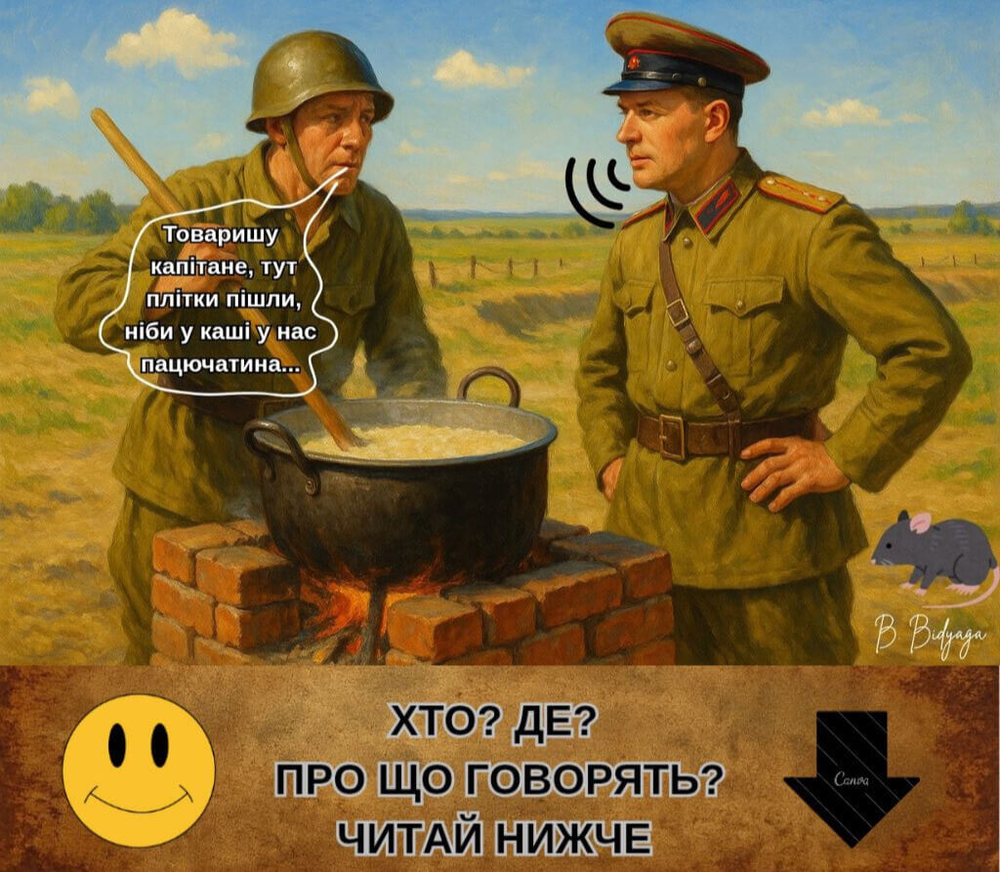

Російсько-український фронт. Російські позиції.
Польова кухня. Діалог капітана та кухаря.

**Кухар:**

— Товаришу капітане, тут плітки пішли, ніби у каші у нас пацючатина, а всю тушонку розтягнув командний склад.

**Капітан:**

— Тушонка — це сурогат. Справжній солдат має їсти справжню їжу. А наклепникам даємо відсіч: м’ясо вимочуємо в оцті, в кашу кидаємо побільше перцю та смаженої цибульки.

#ПравославнийВоєннийПутінізм
                                👻

## 29. ЦЕ НЕ ЦАРСЬКА СПРАВА…

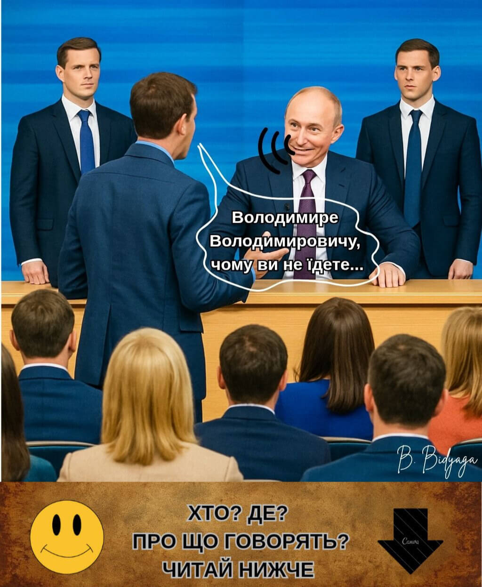

Пресконференція російського президента Володимира Путіна.

**Журналіст:**

— Володимире Володимировичу, 
чому ви не їдете на передову, як український президент?

**Путін:**

— Зеленський — нелегітимний. Якщо його вб’ють — невелика втрата.
До того ж він просто ганяється за дешевою популярністю. Мені це не потрібно — мій рейтинг і так високий.

#ПравославнийВоєннийПутінізм
                                👻

## 30. БАТЬКІВЩИНА НІЧОГО НЕ ВИННА СОЛДАТУ (ОКРІМ ПОЧЕСТЕЙ НА ЙОГО ПОХОРОНІ)

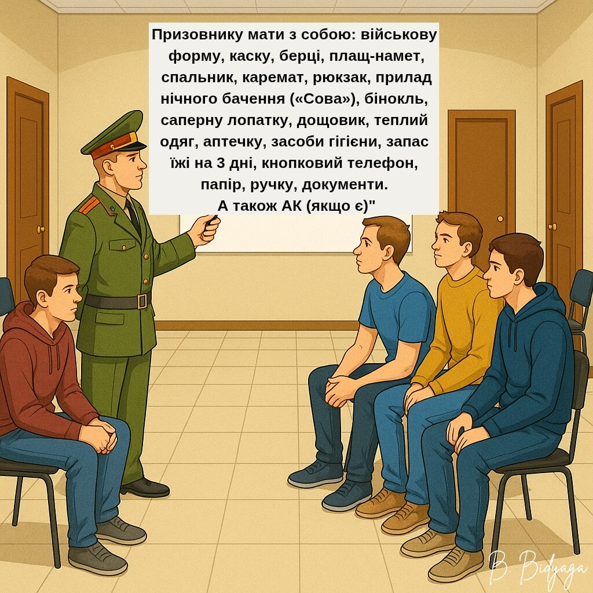

Військкомат у російському місті.
На стіні висить великий плакат:

"Призовнику мати з собою:

військову форму, каску, берці,
плащ-намет, спальник, каремат,
рюкзак, прилад нічного бачення («Сова»), бінокль, саперну лопатку,
дощовик, теплий одяг, аптечку, засоби гігієни, запас їжі на 3 дні,
кнопковий телефон, папір, ручку, документи. А також АК (якщо є)".

#ПравославнийВоєннийПутінізм
                                👻

## 31. СТРАХОВИЙ ПОЛІС ВІД НЕЛОЯЛЬНОСТІ: ДЕРЖСЛУЖБА З ГАРАНТІЄЮ САМОЛІКВІДАЦІЇ  

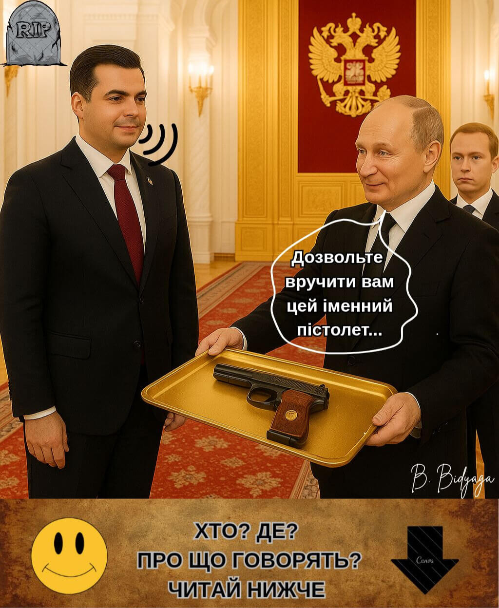

Росія. Москва. Георгіївська зала Великого кремлівського палацу.  
Путін вручає нагороду чиновнику.

**Путін (з холодною усмішкою):**

— Дозвольте вручити вам цей іменний пістолет за заслуги перед Вітчизною. Він... підбадьорить вас у скрутну хвилину. Не дасть спіткнутися. І, сподіваюся, стане виходом у безвихідній ситуації.  

**Чиновник:**

— Служу Росії! Готовий довести свою відданість ціною власного життя! 

#ПравославнийВоєннийПутінізм  
                                👻

## 32. ПУТIНАЦЕЯ ВІД УСІХ БІД: СТРАХ  

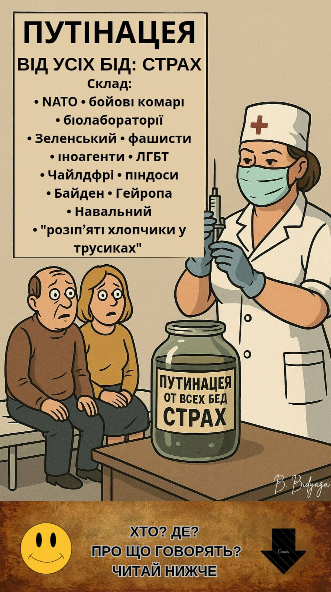

**ПУТIНАЦЕЯ®**
Комбінований препарат широкого спектра дії. Активний щодо всіх опозиційних мікроорганізмів...  

**Фармакологічна дія**:

Викликає стійке відчуття страху, агресії та патріотичного збудження. Пригнічує центри критичного мислення, емпатії та почуття провини.  

**Склад:**

NATO, бойові комарі, біолабораторії, Зеленський, фашисти, іноагенти, ЛГБТ, Чайлдфрі, піндоси, Байден, Гейропа, Навальний, "розіп’яті хлопчики у трусиках".  

**Показання до застосування:**

✓ Високий рівень самосвідомості  

✓ Довіра та жалість до ворогів народу  

✓ Потреба у відповідях на риторичні питання  

**Доведений терапевтичний ефект:**

✓ Хронічна віра в телебачення  

✓ Алергія на правду  

✓ Агресивно-патріотичний екстаз

**Передозування:**

Немає даних

**Протипоказання:**

Не зафіксовано 

#ПравославнийВоєннийПутінізм
                                👻

## 33. АВОСЬКА, НАБИТА ТРОТИЛОМ: НАТОВСЬКІ ДЕЛЬФІНИ ЙДУТЬ В АТАКУ!

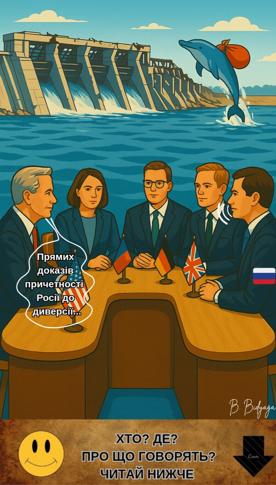

Засідання міжнародної комісії з питання підриву греблі Каховської ГЕС в Україні.

**Представник країн Заходу:**

— Прямих доказів причетності Росії до диверсії немає. Але непрямі улики викликають певні запитання...

**Представник Росії:**

— Це все ви́лами по воді писано! ДНК-експертиза встановила: греблю підірвали бойові дельфіни НАТО!

#ПравославнийВоєннийПутінізм
                                👻

## 34. НА САРАЇ ТЕЖ ДЕЩО НАПИСАНО...  

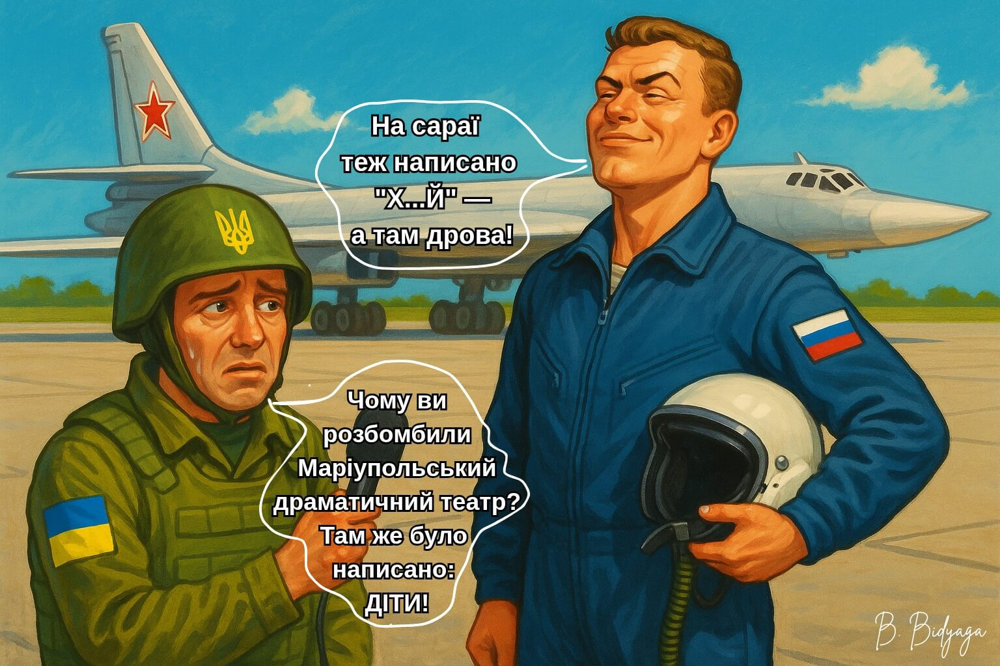

Російський військовий аеродром.  
Діалог російського льотчика з представником українських ЗМІ.

**Українець:**

— Чому ви розбомбили Маріупольський драматичний театр? Там же було написано: "ДІТИ!"

**Льотчик:**

— На сараї теж написано "Х...Й" — а там дрова!

#ПравославнийВоєннийПутінізм
                                👻

## 35. БОЙОВІ КОМАРІ НАТО  

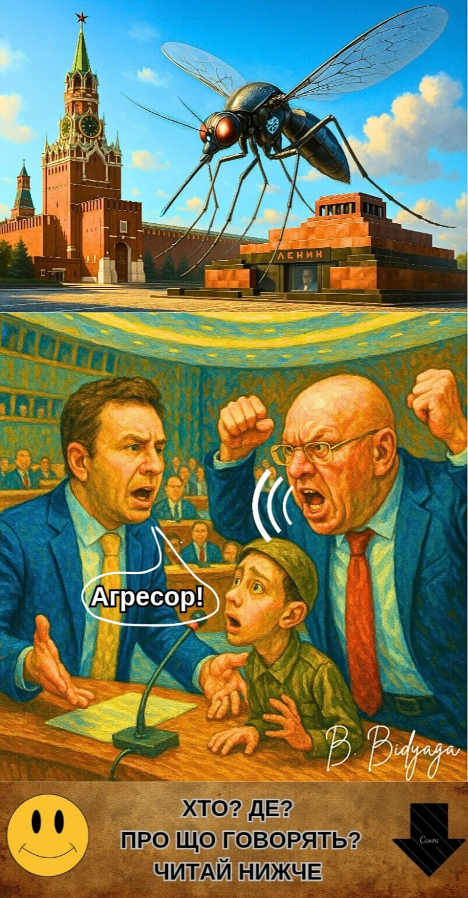

Засідання Ради Безпеки ООН.

**Представник України** (звертаючись до представника Росії):

— Агресор!

**Представник Росії:**

— Не перекручуйте фактів!  
Бойові комарі НАТО віроломно вторглися в Росію з території України! Ми лише провели спецоперацію з дезінсекції!

#ПравославнийВоєннийПутінізм
                                👻

## 36. КИЇВ ЗА 3 ДНЯ  

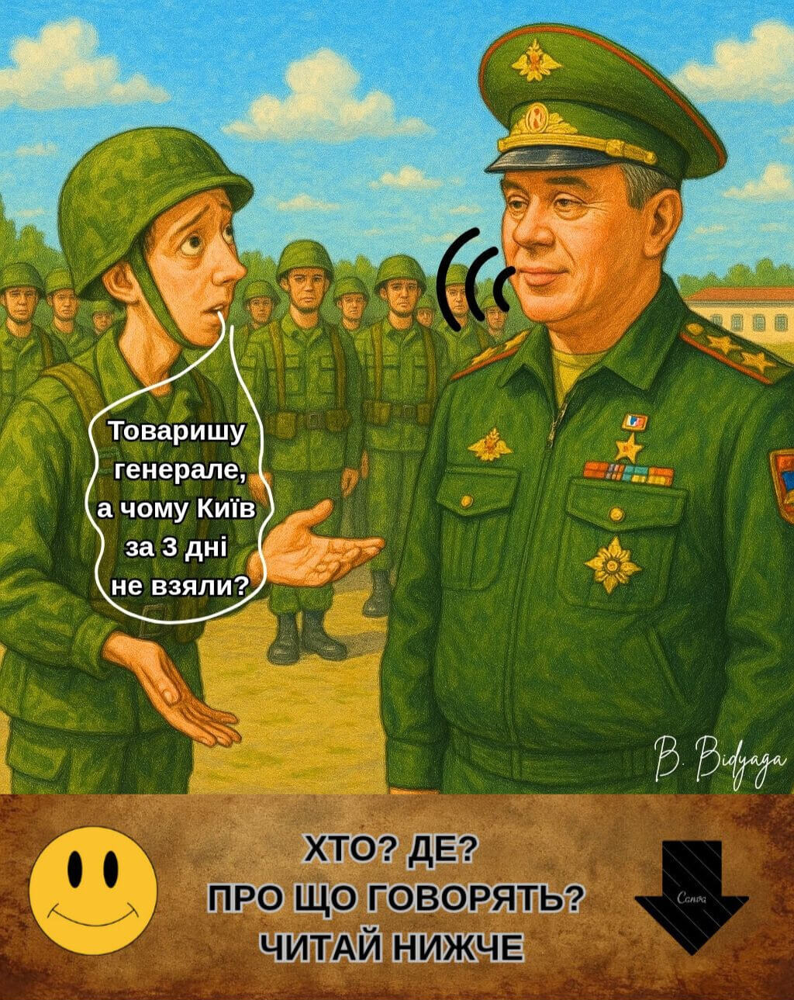

Російська військова частина. Вишикування на плацу. Генерал стоїть перед строєм солдатів.

**Солдат:**

— Товаришу генерале, а чому Київ за 3 дні не взяли?

**Генерал:**

— Це була навчальна атака. Акт гуманізму та доброї волі. Ми показали супротивнику свою вогневу міць — і повернулися на більш кращі позиції.

#ПравославнийВоєннийПутінізм
                                👻

## 37. ДИВЕР-САНТА: РІЗДВЯНА СПЕЦОПЕРАЦІЯ  

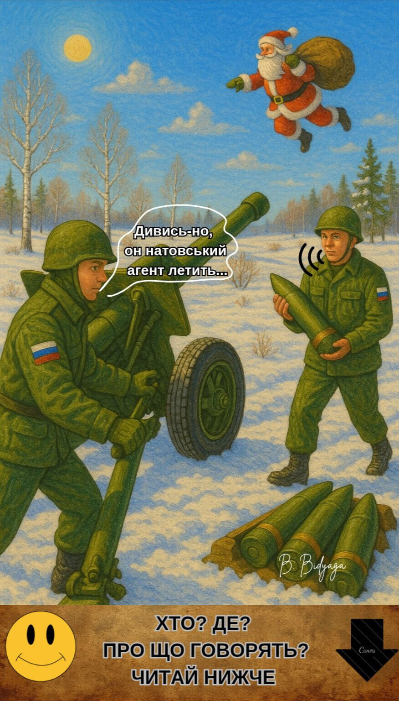

Переддень Різдва. Російські солдати на бойовій позиції. По небу летить Санта Клаус із мішком подарунків.

**Перший солдат:**

— Дивись-но, он натовський агент летить — під прикриттям!

**Другий солдат:**

— Заряджай! Швидше! І цілься в голову. Головне — не пошкодь мішок! А то без подарунків залишимося.

#ПравославнийВоєннийПутінізм
                                👻

## 38. СВЯТЕ ОМОВЕННЯ В ПРЕИСПОДНІЙ 

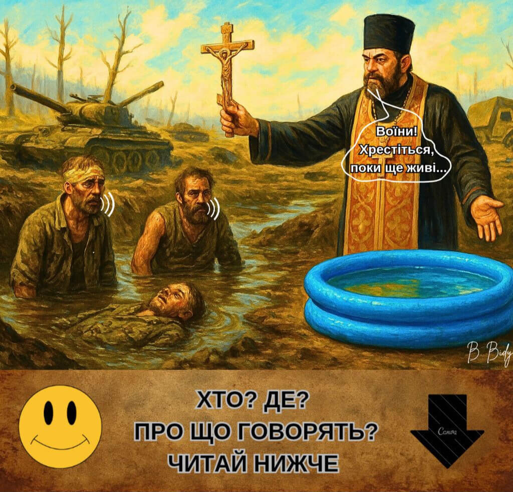

Російсько-український фронт. Російські позиції. Священик агітує солдатів охреститися в похідній «купелі».

**Священик:**

— Воїни! Хрестіться, поки ще живі! А то потрапите в пекло!

**Перший солдат:**

— Ми й так в пеклі.

**Другий солдат:**

— Давай! Погоджуйся! Хоч помиємося!

#ПравославнийВоєннийПутінізм
                                👻

## 39. ХОЧЕШЬ У СВЯТІ — ПОВИСНИ НА ХРЕСТІ 

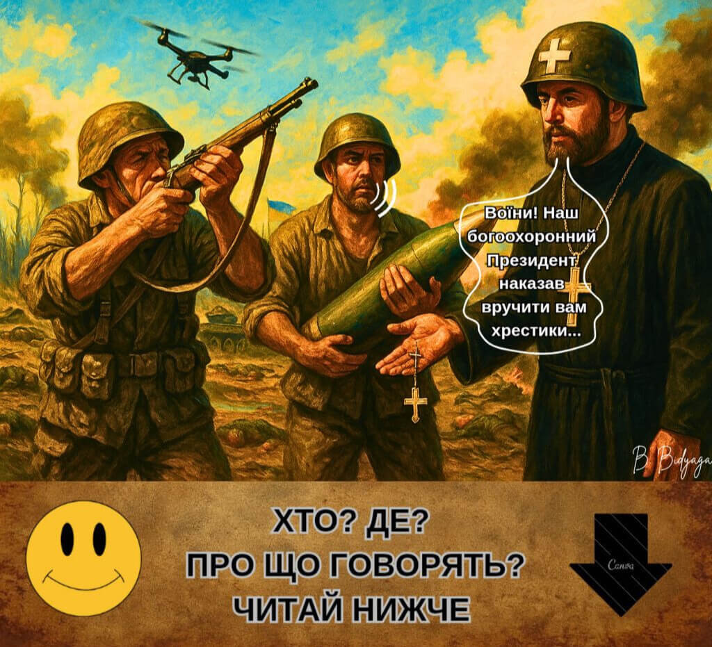

Російсько-український фронт. Російські далекі позиції. Священик пропонує солдатам оберіг у вигляді «президентського» нагрудного хрестика.

**Священик:**

— Воїни! Наш богоохоронний Президент наказав вручити вам хрестики з його ініціалами. Це найкращий захист від ворожої кулі!

**Солдат:**

— А що — його вже розіп'яли?

#ПравославнийВоєннийПутінізм
                                👻

## 40. СВЯТО-ВОДО-НАВІДЖЕННЯ  

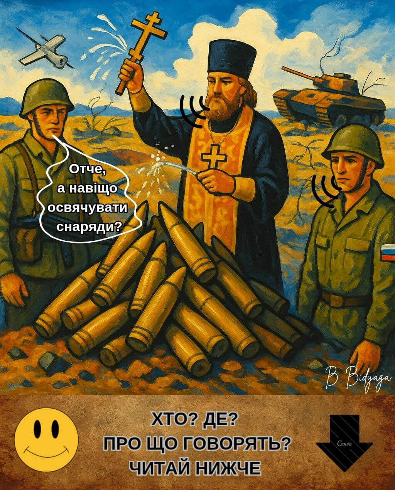

Російсько-український фронт. Тил російських позицій. Обряд освячення боєприпасів.

**Перший солдат**:

— Отче, навіщо освячувати снаряди?

**Священник:**

— Щоб били точно в ціль, сину мій!

**Другий солдат (похмуро):**

— Тепер зрозуміло, чому ми завжди мажемо.

**Перший солдат (з ентузіазмом)**:

— Ну, тепер-то наші гармати будуть стріляти без промаху!

#ПравославнийВоєннийПутінізм
                                👻

## 41. БІЛЕ, ЧЕРВОНЕ, ЧОРНЕ 

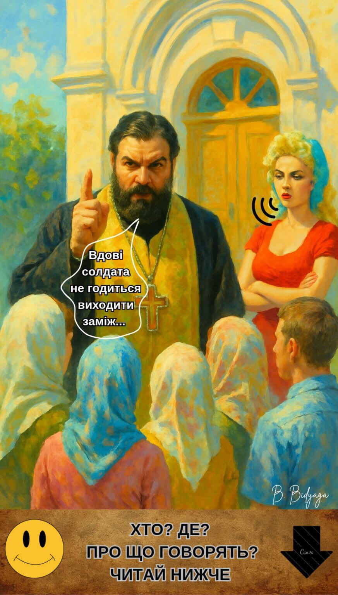

У російському місті священик проповідує біля входу до православної церкви.

**Священик:**

— Вдові солдата не годиться виходити заміж! Прийшла похоронка — сумуй та молись!

**Жінка з натовпу:**

— Та розміркувався! Ваших трунарних ледь вистачає на білу Ладу. А я хочу червоне Вольво! З баром!

#ПравославнийВоєннийПутінізм
                                👻

## 42. КРИВА ЛІНІЯ ПУТІНА 

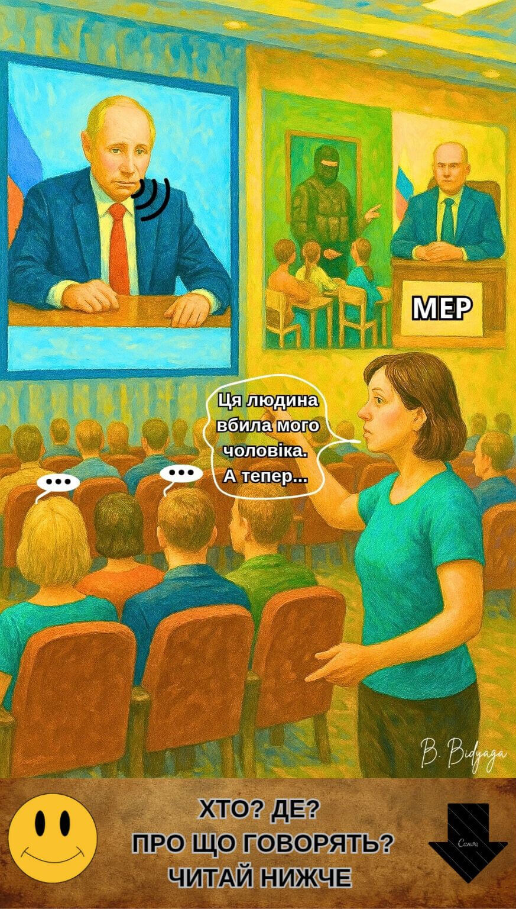

"Пряма лінія" президента Росії Володимира Путіна. Він відповідає на запитання громадян по відеозв'язку. У залі сидять запрошені.

**Жінка із залу** (вказуючи на портрет чиновника):

— Ця людина вбила мого чоловіка. А тепер цей убивця вчить дітей мужності та займає посаду мера нашого міста. Чому? 

**Путін:**

— Він спокутував свою провину на фронті. Він сплатив за минуле своєю кров'ю. Він — герой, наша нова еліта.

**Перший глядач** (приховує обличчя): 

— Вбив 100 українців — пробачено...

**Другий глядач** (приховує обличчя):  

— Убивай, грабуй, насилуй! Півроку на війні — і все спишуть...

#ПравославнийВоєннийПутінізм
                                👻

## 43. СВЯТИЙ ПОЖЕЖЕБОРЕЦЬ  

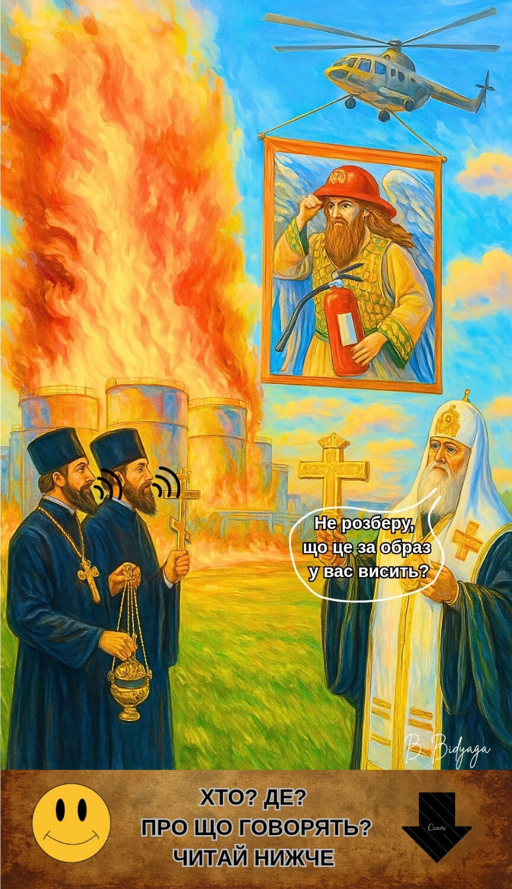

У російському місті на тлі палаючого нафтосховища два православні священики розмовляють з патріархом.

**Патріарх:**

— Не розберу, що це за образ у вас висить?

**Перший священик:**

— Це Сварожич — слов'янський бог вогню. Допомагає відмінно!

**Другий священик:**

— А Христос нас залишив...

**Патріарх:**

— Невже допомагає?! Хм-м... Тоді ось що. Прикриємо єресь язичництва фіговим листочком...Образ Сварожича залишимо, а ікону назвемо "Св. Микола Пожежеборець"!

#ПравославнийВоєннийПутінізм
                                👻

## 44. ПУТІНСЬКА ПРОПАГАНДА В ОДНОМУ ЗОБРАЖЕННІ 

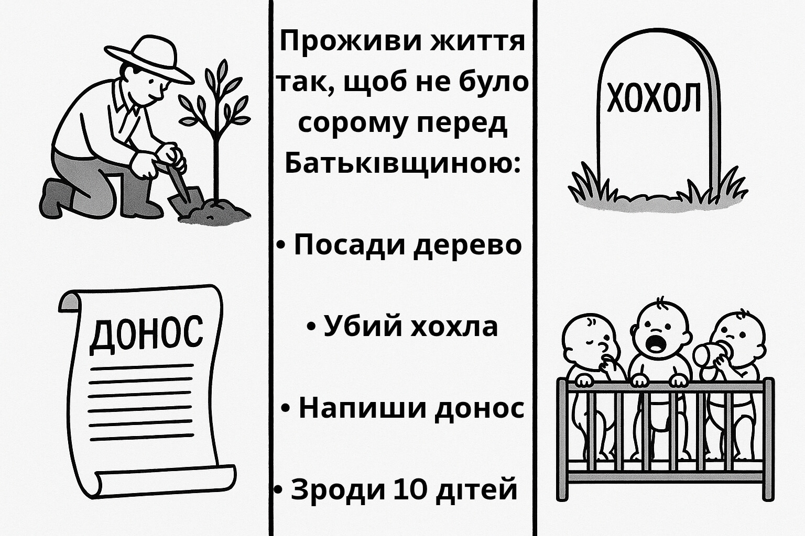

Проживи життя так, щоб не було сорому перед Батьківщиною:  

• Посади дерево  

• Убий хохла

• Напиши донос  

• Зроди 10 дітей  

#ПравославнийВоєннийПутінізм
                                👻

## 45. НАДНОВИЙ ЗАПОВІТ 

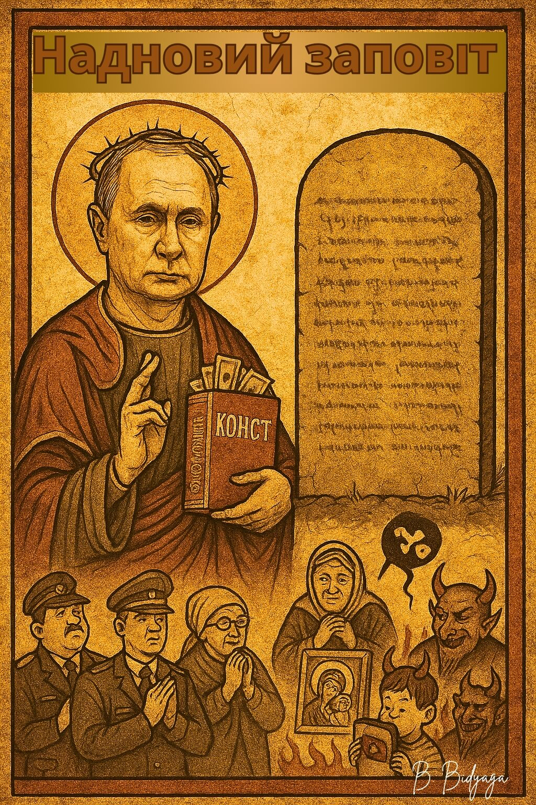

1. Улюби Путіна твого всім серцем твоїм, всім розумінням твоїм, усією душею твоєю.  
2. Улюби ближнього твого: начальника, депутата, податкового інспектора.  
3. Не вбивай: державного діяча, співробітника правоохоронних органів.  
4. Не чини перелюбу у презервативі.  
5. Не свідчи ложно задля власної вигоди — тільки на благо Вітчизни.  
6. Не марнуй насіння даремно — роби дітей.  
7. Не кради — це прерогатива державного чиновника.  
8. Не шукай собі скарбів на землі — їх уже оприходували.  
9. Хто зносить на Володіна й Матвієнко — смерті достоїн.  
10. Не піддавайся диявольському спокусі в подобі іноагента та п’ятої колони. 
11. Блаженні донощики, бо їх є царство земне. Стукайте — і почутими будете.  
12. Люби Вітчизну — особливо на держзакупівлях.  
13. Утримуйся від сумнівів: віра в телебачення спасеть тебе.  
14. Уникай слів «Свобода» та «Мир», бо се є єресь.  
15. Не створюй собі кумира поза вертикаллю влади.  

Нехай перебуває з тобою лояльність — і не загинеш у темниці. 
*Із «Одкровення від Роскомнагляду», гол. 666.*

#ПравославнийВоєннийПутінізм
                                👻

## 46. ПАЦІФІЗМ — ХВОРОБА ЧИ ЗЛОЧИН? 

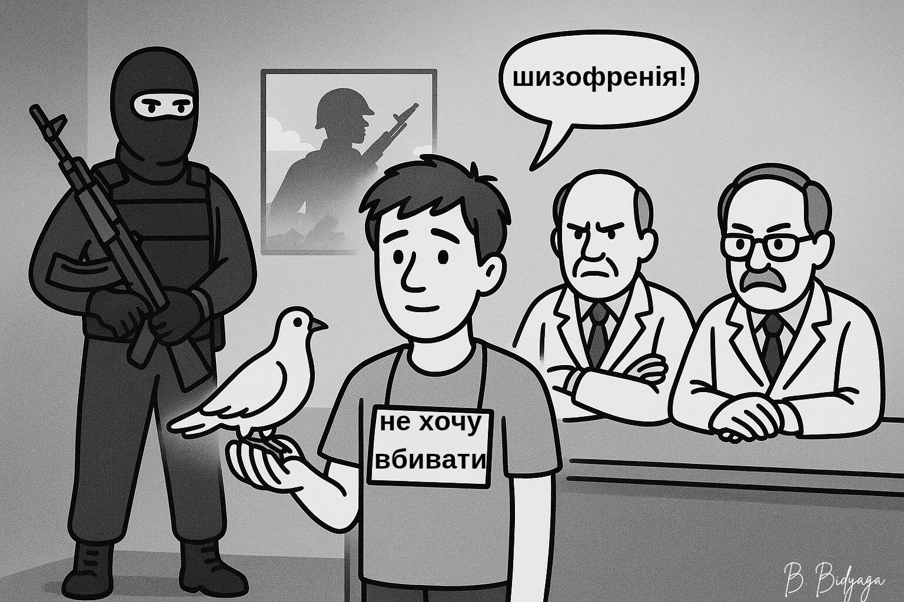
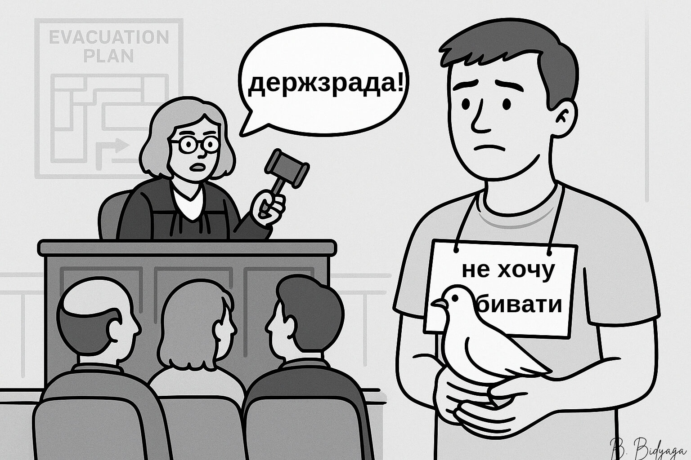
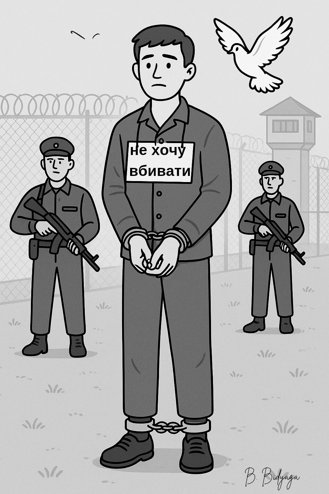

**Триптих**

*Панель 1*

Пацифіст у російському військкоматі на медогляді.

Діагноз: шизофренія.

*Панель 2*

Пацифіст у російському суді.  

Вирок: держзрада.

*Панель 3*

Пацифіст у російській виправній колонії. 

#ПравославнийВоєннийПутінізм
                                👻

## 47. ОНОВЛЕННЯ ХРИСТИЯНСТВА

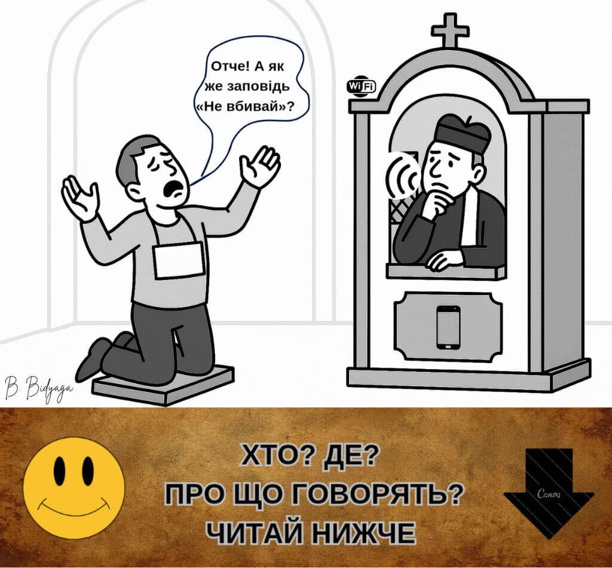

Росія. У сповідальні православної церкви.

**Каючийся грішник:**

— Отче! А як же заповідь «Не вбивай»?  

**Священик:**

— Застаріла версія, сину!  Онови прошивку. Остання версія — "ukrainy.net"

#ПравославнийВоєннийПутінізм
                                👻

## 48. ПРИТЧА ПРО РИБАЛКУ ТА ПАТРІАРХА: БІДНИМ — ВІРА, БАГАТИМ — ЯХТИ  

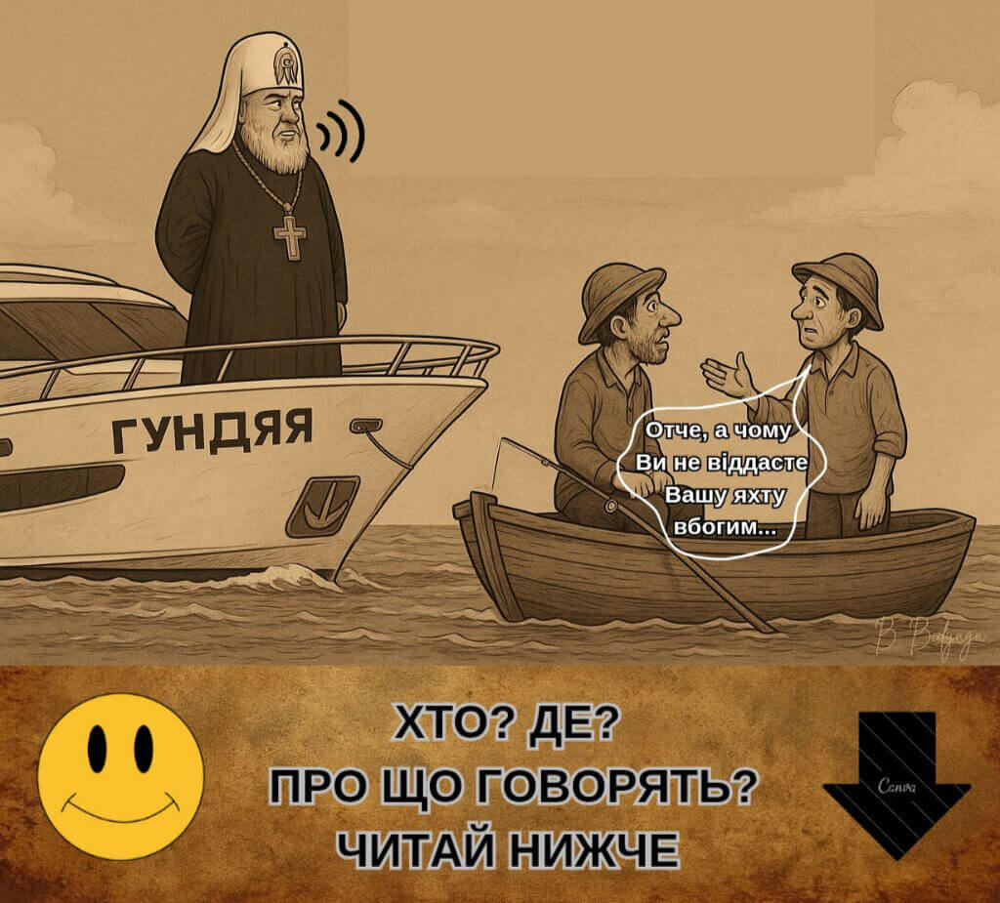

Патріарх всієї Русі стоїть на носі своєї супердорогої яхти. Біля яхти в убогому човнику сидять двоє рибалок.  

**Рибалка:**

— Отче, а чому Ви не віддасте Вашу яхту вбогим та бідним — як заповідав Ісус Христос?  

**Патріарх:**

— Христос проповідував виключно біднякам. Багатим Він своїми порадами не докучав.

#ПравославнийВоєннийПутінізм
                                👻

## 49. АТЕСТАТ СТАТЕВОГО ДОЗРІВАННЯ

  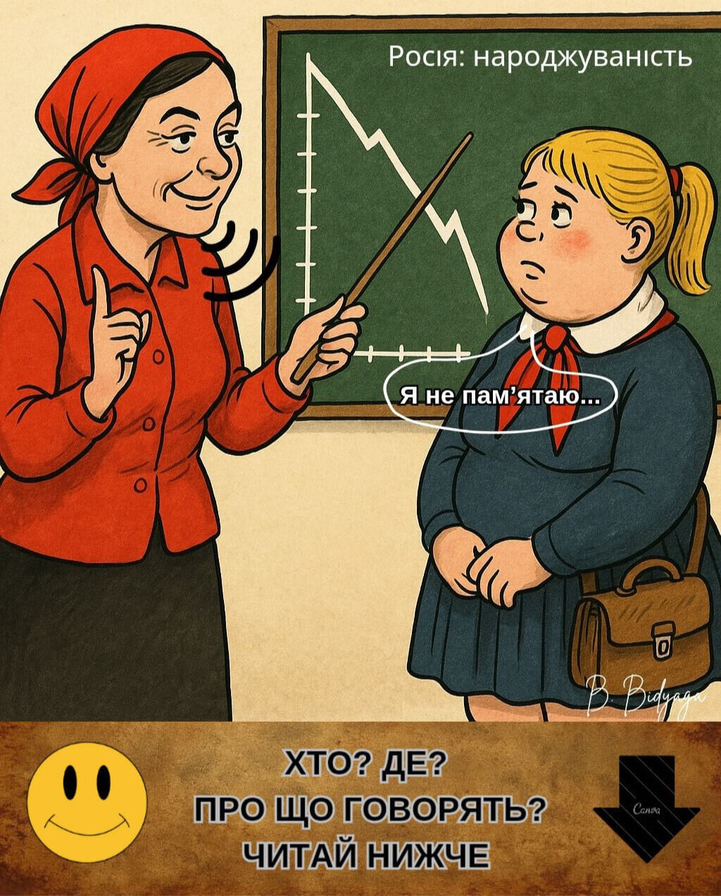

У російському місті в школі на уроці сімейознавства.
На дошці — графік динаміки народжуваності в Росії.  

**Учениця:**

— Я не пам’ятаю...

**Вчителька:**

— Не вивчила урок? Не біда! Іди, доню, народжуй — отримаєш супероцінку!
Якщо народиш двійню — зарахуємо як практикум з анатомії.  
Трійня — дострокове отримання атестата зрілості. До школи ходити більше не доведеться.  

#ПравославнийВоєннийПутінізм
                                👻

## 50. ПУТІН 2.0: СПІРАЛЬ ІСТОРІЇ  

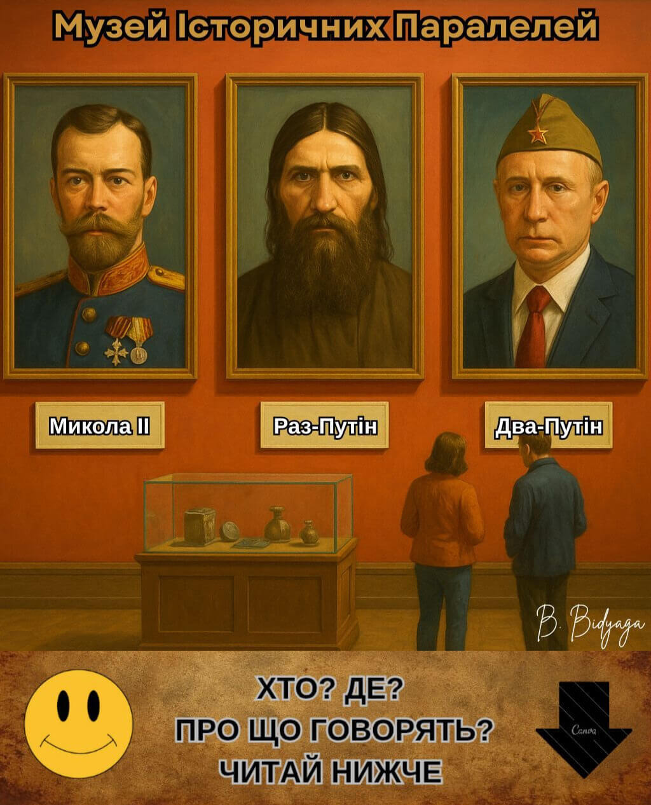

Експозиція в Музеї Історичних Паралелей. На стіні — три парадні портрети:  

✓ Цар Микола II — «Микола II»

✓ Григорій Распу́тін — «Раз-Путін»   

✓ Володимир Путін — «Два-Путін» 

*Коментар:*

Історія повторюється, цього разу — у жанрі психоабсурду.

**Путін I (версія 1.0 — Г. Распу́тін)**

Фінал: ціаністий калій, куля в лоб.  

Рік: 1916.  

**Путін II (версія 2.0 — В. Путін)**

Фінал (у розробці):  ▸ 30% — табакерка  

▸ 30% — шарфик  

▸ 30% — «новичок»  

▸ 10% — замовний інфаркт  

Рік: 202Х  

*Історична довідка* 

**Табакерка** — російський імператор Павло I загинув у 1801 році: його задушили, але перший удар завдали табакеркою.  

**Шарфик** — Йосип Сталін, за переказами, використав шарф для вбивства керівника НКВС Миколи Єжова; «смерть через шарфик» стала символом кремлівських удушь.  

**«Новичок»** — нервово-паралітична речовина, розроблена в СРСР. Використана в гучних отруєннях, зокрема Сергія Скрипаля та Олексія Навального.  

**Інфаркт** — «раптова зупинка серця» є найпоширенішим евфемізмом у російських офіційних звітах про підозрілі смерті політиків.

#ПравославнийВоєннийПутінізм
                                👻

## 51. ДОКТОР АЙБОЛІТ. ВЕРСIЯ 2.0

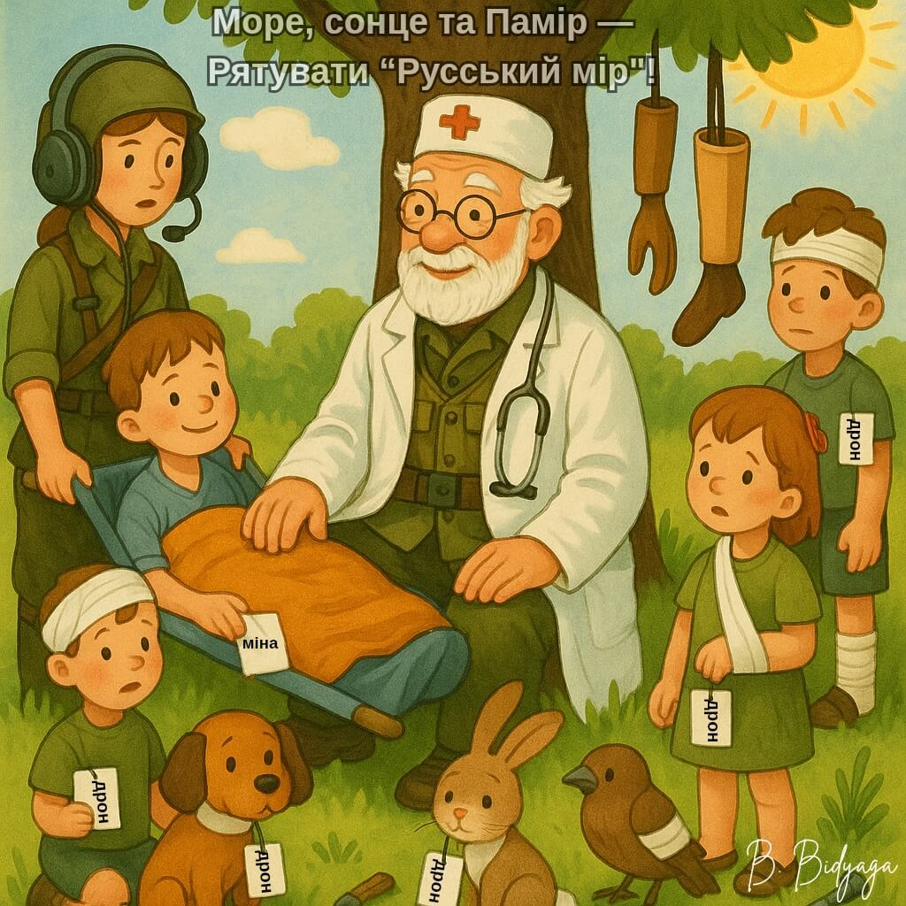

Добрий доктор Айболіт

Під деревом собі сидить.

Хто до нього завіта —

І солдат, і корнета —

Всіх зцілить і вилікує,

Знов на ноги підіймує.

Прибуває до нього Муса:

Ой, мене підстрелила «Оса»!

I прийшов д'Айболіта Портос:  

«Дрон влупив – i тепер я безнос!»

Аж радістка прибігла, 

Закричала: «Лихо!  

Мій Василь, мій хлопчик, 

Наступив не тихо!  

По мінній стежині біг — 

I тепер вин без ніг!  

Тепер він кульгавий, 

Бідний мій наміг!»  

I сказав Айболіт: «Не зуди!  

Хутчій його сюди приводи!  

Я пришию йому нові ноги —

Хай топче ті мінні дороги!»

Принесли Васю до нього —  

Знеможеного, кривого.  

Лікар ноги пришиває —  

Вася знов ворогів вбиває!

А з ним і радістка-мати   

Теж почала плясати.  

І стріляє вона й кричить: 

"Дякую тобі, Айболіт!"

Аж тут із лісу «Аксакал»

Примчав на коні, як на бал.

«Ось вам вість. Читайте. 

Дійствуйте! Бувайте!"  

«Приїздіть, лікарю,

До Жмеринки хутчіше,

Рятуйте, докторе,

Воїнів мерщіше!»  

Що таке? Невже, скажіть, 

Вашім парубкам не жить?

«Вірно! Вірно! В них гарячка,

 Сльози, піт і розкорячка.  
 
Якщо ви їх не спасете —

 Їх утопим у болоті!  
 
Адже Путін дав наказ 

Виступати на Кавказ.  

Море, сонце та Памір —  

Рятувати “Русський мір”!» 

«Русській Мір» тепер навічно —  

Бруд, баюри та піски,  

Де зелені чоловічки

Відтоптали чобітки.

#ПравославнийВоєннийПутінізм
                                👻

## 52. БАДИ ПРОПАГАНДИ

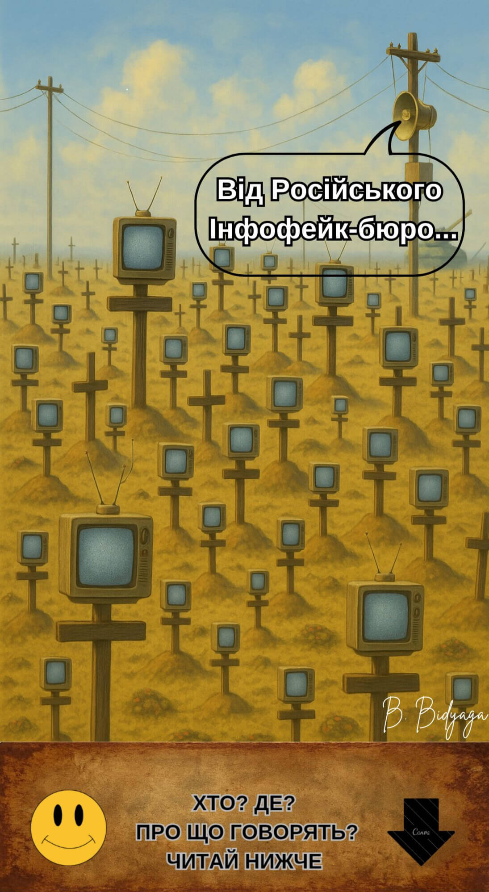

Біологічно активні інформаційні добавки.
Підвищують біодоступність держпропаганди до 100%.
Активні компоненти ефективно подолають гемато-енцефалічний бар'єр (критичного мислення).

**Лінійка препаратів:**

• Глюкофейконат Соловйова, таблетки 100-500 мг, тривалої дії. Не розжовувати!

• Сурогатна інфо-мікстура "Москва. Кремль. Путін", нормалізована.

• Бальзам "Симулякри християнства" з ароматом ненависті, для зовнішнього застосування. Умовно отруйний.

• Спиртова настойка "Традиційні цінності", багатокомпонентна. Каламутна суспензія з трупним запахом, міцністю 40%.

• Фактозамінник від Симон'ян, порошок для суспензії. Галюциногенний, зі смаком агресії.

• Ерзац-історії від Мединського, набір ін'єкцій в/м, 100-500 мг. Версії 1.0—10.0.

• Фальш-вісті від Кисельова, супозиторії суперніжні з ефектом ректально-інформаційного свербіння. 100-500 мг.

• Біфiлак-Iнфо, 100-500 мг. Препарат групи ферментів (біфідо-лакто-інфо-бактерії). Для ефективного перетравлення фейкової інформації, запобігання несварінню та закрепі.

**Фармакологічна дія:**

✓ Стимулятори лояльності: збуджують центри покірності та стадного інстинкту.

✓ Агоністи ненависті: стимулюють мигдалеподібне тіло (центр страху та агресії). Потенціює виробництво норадреналіну, спрямовуючи агресію на зовнішнього ворога, конструктивно знімаючи внутрішню соціальну напругу.

✓ Інгібітори аналізу: пригнічують активність префронтальної кори, відповідальної за критичне мислення та логіку.

✓ Блокатори емпатії: дезактивують острівкову частку і передню поясну кору, пригнічуючи всі форми емпатії та співпереживання.

Не є лікарським засобом.

**Стандартизований склад:**

~ Фейки 50%

~ Глюки 20%

~ Порожні мрії 10%

~ Самообман 5%

**Допоміжні речовини:**

Особисте життя президента США, зіркові плітки, погода в Африці, НЛО.

**Ароматизатори (на вибір):**

Великодержавний шовінізм, ультраправий націоналізм, ура-патріотизм, звичайний фашизм, сліпа ненависть, «Обама – мудло», «гнилий Захід», «священна війна».

**Прикрашувачі:**

"Цінності традиційні" відбірні, скріпи духовні посилені, «жити стало краще, жити стало веселіше», «радіоактивний попіл», «ми переможемо».

**Спосіб застосування та дозування:**

Добова доза розраховується за формулою:
IQ * 10 (мг). Максимальна добова доза — 1300 мг.

Рекомендовано щоденний прийом перед випуском вечірніх новин, телеефірами В. Соловйова та М. Симон'ян, підсумковою програмою Д. Кисельова «Вісті тижня», «прямою лінією» Путіна, брифінгами Д. Пескова та Міноборони РФ.

**З обережністю:**

Синдром гіперлояльності, сапіонедостатність. При гострих нападах здорового глузду, сумнівах у правильності держкурсу та інших формах резистентності до пропаганди рекомендована форма «Форте».

**Контроль життєвих показників:**

Рівень глюків не повинен перевищувати рівень глюкози.

**Побічні ефекти:**

Патріотичний делірій, славослівний пронос, нестримна блювота з вкрапленнями гасл.
У рідкісних випадках розвивається ідеологічний тромбоз, що призводить до гострої недостатності когнітивних функцій.
Допускається перехідний каламутний осад (у душі).
Щоб уникнути побічки, дозу збільшувати поступово! Не перевищувати дозування!

**Особливі вказівки.**

Приготування суспензії: взяти 1/2 склянки з будь-якого каламутного джерела, додати 1 чайну ложку порошку та перемішати. Увага: потрібне ретельне забовтування! Максимальна біодоступність досягається в стані контрольованого затупіння.

Не є ноотропами! Не покращують когнітивні функції, але приводять їх у відповідність до державної ідеології.
При випадковому потраплянні в організм незалежного журналіста чи правозахисника можуть викликати гостру алергічну реакцію.

**Термін придатності:**
не обмежений.

#ПравославнийВоєннийПутінізм
                                👻

## 53. САМІТ В АНКОРІДЖІ, АЛЯСКА

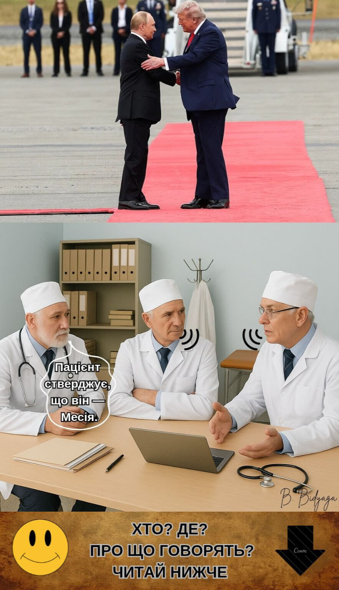

Консиліум у психіатричній лікарні. В кабінеті за столом — троє поважних професорів.

**Перший професор**:

— Пацієнт стверджує, що він — Месія.

**Другий професор**:

— Що?! Месія?! Учора ж був Гітлер!

**Третій професор**:

— Сьогодні в нього нова мета: «Врятувати братній український народ».

**Перший професор**:

— І як він збирається це зробити?

**Другий професор**:

— Як завжди: бомбардування, убивства, викрадення.

**Третій професор**:

— Параноїдальне геополітичне марення з мани́єю величі.

**Перший професор**:

— Марення... рудої кобили під місячним світлом.

**Другий професор**:

— Колеги, досить лірики. Це специфічний розлад особистості.

**Третій професор**:

— А ще плаче й каже: «Україна — біль і трагедія для нас».

**Перший професор**:

— І постійно повторює про якісь «першопричини конфлікту», які «треба усунути».

**Другий професор**:

— І кожні п’ять хвилин істерично вигукує: «Хочу увесь Донбас!»

**Третій професор**:

— А в іншому — веселий, бадьорий, активний, цими днями зустрічався із цим... персонажем… у червоній кепці…

**Перший професор**:

— А-а, сумнозвісний «пожежник», що одним поглядом зупиняє військові конфлікти?

**Другий професор**:

— Це він. Цілих 11 секунд тиснули одне одному руки, потім походжали червоною доріжкою, безсоромно фліртували й підморгували.

**Третій професор**:

— Два чоботи — пара, Господи прости! Один марить Донбасом, інший — Нобелівкою.

**Перший професор**:

— Так, панове. Марнославство — річ небезпечна. Може закінчитися психополітичним розладом.

**Другий професор**:

— Колеги! Мені здається, є конфлікт інтересів. До добра це не призведе.

**Третій професор**:

— Для України — точно.

**Перший професор**:

— Ви маєте рацію. Необхідно вжити заходів.

**Другий професор**:

— Пропоную значно підвищити дозу галоперидолу. Перорально і внутрішньом’язово.

**Третій професор**:

— Варто також призначити пацієнтові заспокійливі чорноземні ванни під аудіозапис із криками "Крим наш!"

**Перший професор**:

— А чому б не спробувати електрошок? Чудово діє при специфічних розладах. МОЗ уже дав зелене світло.

**Другий професор** (з пафосом):

— МОЗ попереджає... Будеш викаблучуватися – отримаєш три тисячі вольт у дупу.

#ПравославнийВоєннийПутінізм
                                👻

## 54. ЛОНО СТАЧКУЄ: ЛИШЕ ДЛЯ VIP-ЧЛЕНІВ

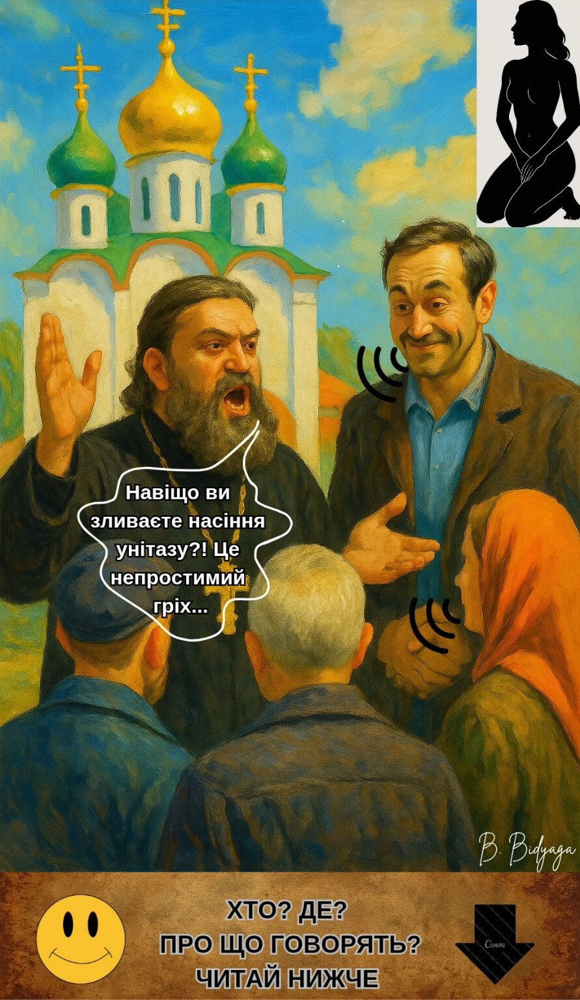

У російському місті священик проповідує біля православної церкви.

**Священник:**

— Нащо ви зливаєте насіння унітазу? Це непростиний гріх! Жіноче лоно — от єдина належна посудина для насіння!

**Чоловік з натовпу:**

— Лоно? Та воно завжди зачинене. На обліку. Яйцеклітин. Лише для VIP-членів.

**Священник:**

— Не богохуль, сину мій! Лоно — це не склад консервів!

**Жінка з натовпу:**

— VIP-члени? Це ФСБ, чи що?

#ПравославнийВоєннийПутінізм
                               👻

## 55. ДИСКРЕДИТАЦІЯ... ОРГАНІВ

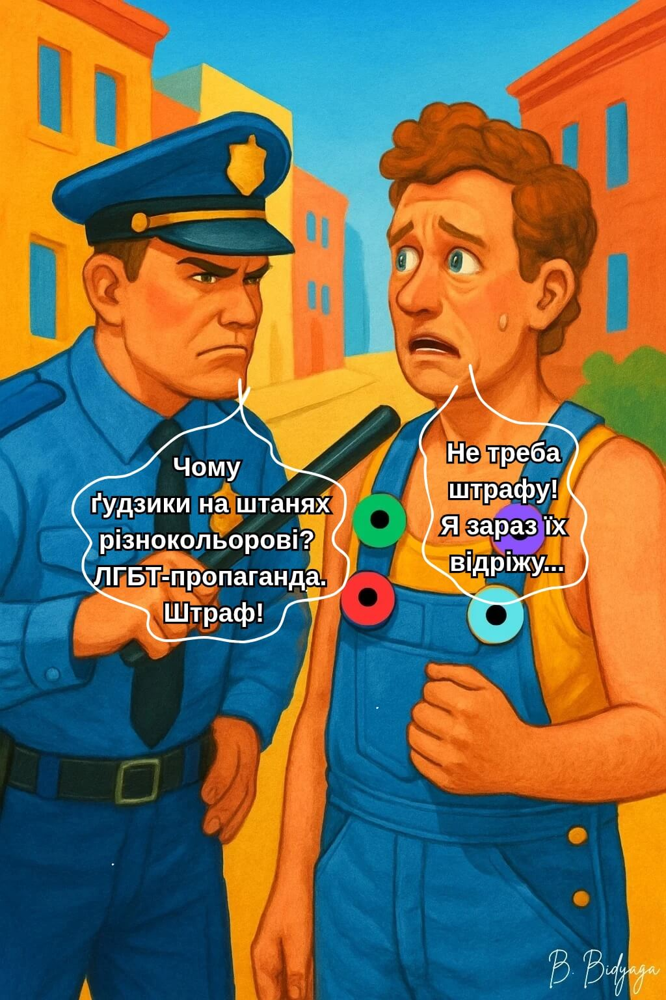
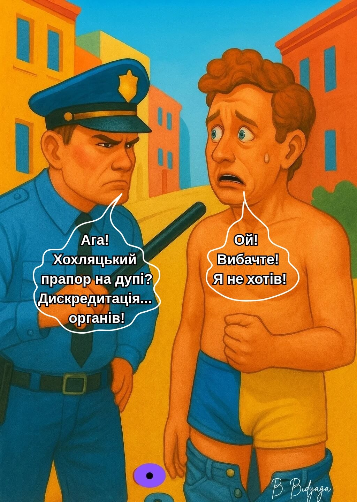

На вулиці російського міста.

**Поліцейський:**

— Чому гудзики на штанах різнокольорові? ЛГБТ-пропаганда. Правопорушення. Штраф!

**Чоловік:**

— Не треба штраф! Я їх зараз зріжу...

(Штани знято)

**Чоловік:**

— Ой! Перепрошую! Я не те мав на увазі!

**Поліцейський:**

— Ага! Хохляцький прапор на дупі? Дискредитація... органів!

#ПравославнийВоєннийПутінізм
                              👻

## 56. СПОВІДАЛЬНЯ КРИВИХ ДЗЕРКАЛ

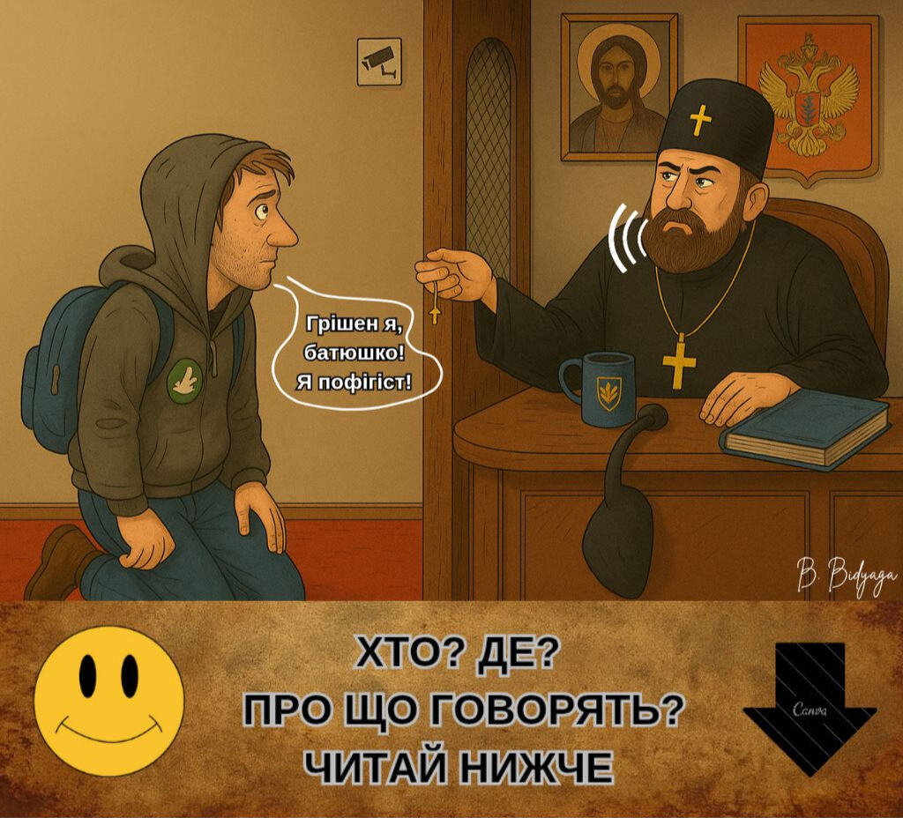

Росія. Сповідь у православній церкві.

**Каятник:**

— Грішен я, батюшко! Я — пофігіст!

**Священник (тривожно):**

— Ти — пацифіст?! Це ж майже зрада, сину мій!

**Каятник:**

— Ні, отче, ви не так зрозуміли. Я — ексгібіціоніст.

**Священник (примружившись):**

— Колишній сионіст з ДБ? Іди з Богом, сину мій. Ми всі з ДБ... А чому «екс»?

**Каятник (шепітом):**

— Каюсь, отче! Адже я вчора показував члена в парку...

**Священник (сіяючи):**

— Ти — член партії? «Єдина Росія», сподіваюся? Алілуя! З нами Бог!

**Каятник:**

— Каюсь, отче! Адже я робив це на дитячому майданчику. Там були діти...

**Священник:**

— Раннє залучення до духовно-моральних цінностей?
Блискуча ідея, сину мій. Іди з миром!

#ПравославнийВоєннийПутінізм
                             👻

## 57. БЛАЖЕННІ КОПУЛЮЮЧІ...

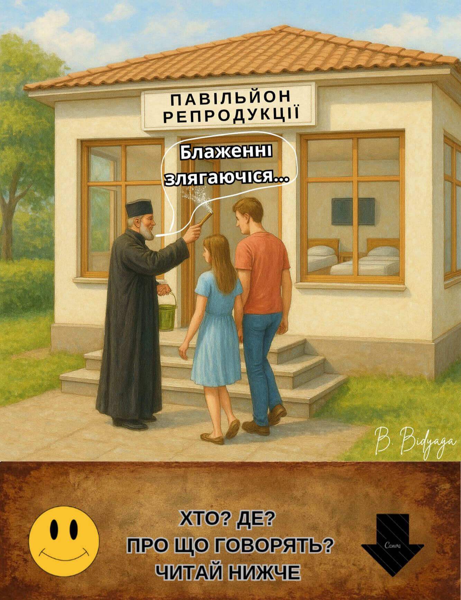

Росія. Москва. Зал засідань Держдуми РФ. З трибуни виступає депутат Валентина Бебиєнко:

– Шановні депутати! Президент поставив перед нами завдання відродити велику Росію – збільшити народжуваність утричі. Не приховую – завдання непросте. Складна задача. Надскладна. Але ми зобов'язані її виконати. Тому що цього хоче наш президент. Пропоную підійти до вирішення проблеми креативно. Зрозуміло, наша таргетна аудиторія – це молодь. До 30. Після 30 впливати на свідомість уже не так просто. Ментальні патерни вже сформовані, спостерігається резистентність до держнаративу.

А тепер давайте згадаємо наше з вами сумне дитинство. Як ми задовольняли свої... потреби – цілком законні пориви пубертатного періоду? Потай, нишком, у темних під'їздах на брудних підвіконнях, у сирих підвалах, на запилених горищах, та й просто, прости Господи, у парку за кущем. І весь час у напрузі: а раптом побачать? А раптом сусіди нажаляться? А якщо, не дай Боже, тебе спіймали – тягнуть у міліцію, складають протокол, дзвонять батькам. Одним словом – ганьба на все життя, що залишилося. Це неправильно, товариші. Це суперечить державній політиці в галузі демографії. Виправимо цей перекіс. Дамо нашим дітям та онукам щасливе дитинство. Як колись на кожному розі стояла телефонна будка – так тепер на її місці стоятиме гарний та охайний «павільйон репродукції». З камерами спостереження для розпізнавання обличь – будемо нараховувати учасникам соціальні бонуси на «Держпослугах». Усередині – простора кімната на 4 двоспальні ліжка, великий телевізор на стіні. Фільмотека з надихаючими роликами та серіалами. Шкафчик з Віаґрою та аксесуарами. Усе культурно, чисто та привабливо – від веселих шпалер на стінах до постільної білизни з жвавим малюнком. А на сходах замість швейцара – батюшка, що окроплює відвідувачів святою водою, та ще й з благословенням: «Блаженні копулюючi... іменем Отця і Сина, і Святого Духа... згідно з Указом Президента №666...»

А через дев’ять місяців система в автоматичному режимі проведе оцінку ефективності. У разі підтвердження факту народження дитини батькам нараховується одноразова виплата. У випадку народження хлопчика сума виплати подвоюється — відповідно до державної програми мілітаризації демографічної політики.

#ПравославнийВоєннийПутінізм
                                👻

## 58. ГЕОПОЛІТИЧНА ПІСОЧНИЦЯ

*Незакінчена міні-п'єса*

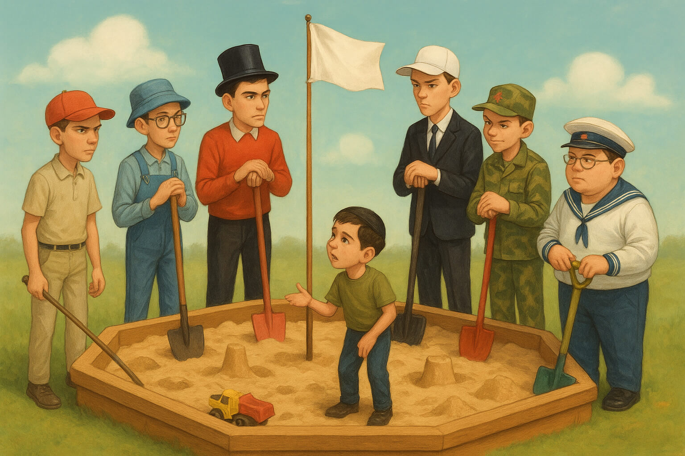

Семеро хлопчиків граються у Пісочниці:
Хуліган, Єврей та ще п'ятеро. Кожен хлопчик — особливий, у кожного на голові унікальний головний убір: червона кепка, біла кепка, панама, кашкет, капелюх.

**ДІЯ 1**

**Хлопчики в Пісочниці**

**Капелюх:**

— А у нас новина! Хуліган знову затіяв бійку.

**Біла кепка:**

— З ким цього разу?

**Капелюх:**

— Єврей.

**Біла кепка (суворо):**

— Хуліган, негайно припини! Неприпустимо порушувати в Пісочниці порядок!

**Хуліган:**

— А ти хто такий, щоб мені наказувати?

**Біла кепка:**

— Я — староста Пісочниці. Я — моральний авторитет.

**Хуліган:**

— А я — кримінальний Авторитет. Мені наплювати на ваші порядки. У мене особливий шлях і особливі моральні цінності.

**Кашкет (обережно):**

— Та через що бійка-то? Що не поділили?

**Хуліган:**

— Він захопив мою землю!

**Біла кепка:**

— З яких це пір вона твоя?

**Хуліган:**

— Завжди була моя. Там прах мого прадіда!

**Капелюх:**

— Але ми ж домовилися про недоторканність кордонів! Твій дядько Борис поставив свій підпис!

**Хуліган:**

— Борис був дурень і алкоголік. Через це угода оголошується недійсною! Це моя земля. Кінець дискусії.

(Хуліган підходить до Єврея і б'є його кулаком у груди.)

**Єврей:**

— Допоможіть! Вбивають!

**Капелюх:**

— Тримайся, малюк! Зараз приймемо резолюцію. Перше. Ми повністю засуджуємо цю агресію!

**Панама:**

— Друге. Ми визнаємо законне право Єврея захищати свою територію будь-якими засобами.

**Кашкет:**

— Третє. Ми закликаємо Хулігана дотримуватися встановленого порядку і негайно припинити конфлікт.

**Біла кепка:**

— Може, таки надамо йому допомогу?

**Хуліган (робить страшне обличчя):**

— Тільки спробуй! Отримаєш у око!

**Капелюх:**

— Такі заяви неприпустимі! Особисто в мене вони викликають занепокоєння.

**Кашкет:**

— І стурбованість.

**Панама:**

— Хлопці, з ним треба бути  обережніше. Не забувайте: у нього є бульдозер.

**Хуліган:**

— Ось саме! Пригоню бульдозер і рознесу всю Пісочницю на друзки!!

(Завдає Єврею ще один удар.)

**Єврей (пошепки):**

— Вбивають!

**Капелюх:**

— Моє занепокоєння значно посилилося.

**Кашкет:**

— Моя стурбованість зростає експоненційно.

**Біла кепка:**

— Я чув, що цей його горезвісний бульдозер увесь проржавів і не заводиться.

**Панама (з сумнівом у голосі):**

— Ми точно не знаємо, а раптом він його полагодив і встановив нові свічки?

**Капелюх:**

— Треба виявляти обачність. Не будемо його дратувати.

**Панама:**

— Та ж ясно: як тільки він прикінчить Єврея, він нападе на нас з вами!

**Кашкет:**

— Я, звісно, від нього трохи далі, і через протоку, але все одно колінки тремтять від страху. Давайте ось що: будемо Єврею допомагати, але по трохи і таємно. Тоді Хуліган нічого не помітить.

**Панама:**

— Головне — не давати занадто багато. Якщо Хуліган почне втрачати позиції, він розлютиться. І тоді вже точно прижене свій бульдозер і зрівняє з землею всю Пісочницю.

**Капелюх:**

— Правильно. Нехай б’ються. Поки Хуліган зайнятий цією бійкою, ми можемо спати на обидва вуха.

**Біла кепка:**

— Чудовий план. Так і зробимо.

**Дія 2**

**Новий староста**

До Пісочниці підходить хлопчик у червоній кепці та з ключкою для гольфу в руці.

**Червона кепка:**

— Ну, що тут у вас? Влаштували бардак. Це все через тебе, старий шкаре. Пшол геть із Пісочниці! Твій час минув. Тепер я тут головний.

**Біла кепка:**

— Гаразд. Я йду. Зробив усе, що міг. Удачі тобі з цим конфліктом.

**Червона кепка:** 

— Я прийшов не за цим, я прийшов за своєю Золотою медаллю Миротворця. А ти зі своїми ідіотськими указами тільки роздмухував цю гризню. Я тут, щоб її припинити. Ти — нездара, я — геній. У цьому вся різниця. Зникни з моїх очей.

**Єврей**: 

— Ти ж допоможеш мені, правда? Ти — моя єдина надія.

**Червона кепка (суворо):** 

— Скільки хлопців полягло! Красенів, героїв! І все — через тебе. Нащо ти дозволив втягнути себе в цей конфлікт?

**Єврей**: 

— Я?! Та це він перший почав!

**Червона кепка:** 

— А ти що, не бачив, що він у тисячу разів сильніший? Нормальна людина не лізе в бійку з тими, хто за неї міцніший. Треба було одразу домовлятися, а не доводити до біди.

**Єврей**: 

— Але я не міг віддати йому свою землю! Моя конституція це забороняє.

**Червона кепка:** 

— Не плети мені нісенітниць! У тебе на руках немає жодної карти. Що не віддав учора — віддаси сьогодні. Не віддаси сьогодні — віддаси за рік. Результат той самий. Тільки ще пів мільйона гарних хлопців гнитимуть у могилах.

**Єврей**: 

— Це ж несправедливо! Ти б краще допоміг мені його приструнити.

**Червона кепка (з презирством):** 

— Старий тобі скільки бабла відвалив? Мільярди. А ти навіть «дякую» не бовкнув. Тільки клянчиш і клянчиш. І взагалі — де воно все? Куди поділися ці мільярди?

**Єврей**: 

— Мені соромно казати, але їх трохи розікрали. Так уже вийшло. Я не винен!!!

**Червона кепка:** 

— Усі ці мільярди ти мені винен. Я чув, на твоїй ділянці знайшли поклади рідкісноземельних металів? Відтепер вони — мої.

**Єврей (збуджено):** 

— Це грабіж!

**Червона кепка:** 

— А ти що думав, у каруселі задарма катають? Так справи не робляться. Підписуй тут.

**Єврей:** 

— Але я не маю повноважень. Треба згода парламенту...

**Червона кепка:** 

— Ах, от ти як! Гей, Стіве, дзвони хлопцям — нехай перекриють наші розвіддані.

**Єврей (у розпачі):** 

— Тільки не розвіддані! Благаю!

**Червона кепка:** 

— Ну, підписуєш чи ні?

**Єврей (пригнічено):**

— Підписую.

**ДІЯ 3**

**Ті ж самі особи**

**Червона кепка:**

— Отже, відкриваємо мирний процес. Я вимагаю припинити цю гризню. Хулігане, викладай умови.

**Хуліган**: 

— Він віддає мені два регіони. Половину своїх солдатиків — на смітник. І щоб ніяких військових блоків.

**Червона кепка:** 

— Хм... Розумно. Єврей, ти згоден?

**Єврей**: 

— Тільки через мій труп.

**Хуліган (зі злісною посмішкою):** 

— Це ми можемо влаштувати.

**Червона кепка:**

— Припиніть ваші жарти!
Єврей, у чому справа?

**Єврей:**

— Він хоче, щоб я віддав йому землю без бою. Це ж нонсенс! У військовій історії немає таких прецедентів.  

**Червона кепка:**

— Навіщо тобі стільки землі? У тебе половина населення емігрувала.

**Єврей:**

— Я не можу. Суспільство проти добровільної здачі територій.

**Червона кепка:**

— Гей, Стів! Притримай наші розвіддані!

**Єврей (поспішно):**

— Добре, добре. Я згоден, але вимагаю ретельного опрацювання деталей.

**Червона кепка:**

— Щодо солдатиків? І відмови від військових блоків?

**Єврей:**

— У цьому випадку мені потрібні тверді гарантії безпеки — на випадок, якщо Хуліган знову зазіхне на мої землі. Хто мене захистить? І яким чином?

**Червона кепка:**

— Гарантії я даю тобі особисто: у разі повторної агресії ми... щось придумаємо. Гарантія — 100%.

**ДІЯ 4**

**Ті ж самі особи**

**Червона кепка:**

— Я зробив усе можливе, щоб помирити цих забіяк. Але з якоїсь дивної причини мирний процес стоїть на мертвій точці.

**Кашкет**: 

— Ти найкращий переговірник — жорсткий, але чесний. Можна я зватиму тебе «Татом»?

**Капелюх**: 

— Ідеальне прізвисько! Тату! Ми в захваті від твого дипломатичного хисту! Але якось воно дивно: ти тиснеш на Єврея, а забаганки Хулігана повністю підтримуєш.

**Панама**: 

— Таточку! Ми б радили притиснути також і Хулігана — наприклад, дав би ти Євреєві зброю. Ти ж обіцяв! Але чомусь не даєш...

**Капелюх**: 

— Мабуть, Таточко просто злякався хуліганського бульдозера.

**Червона кепка:** 

— Бульдозер — це блеф. Він нас на понт бере. Я його не боюся. Я боюся тільки, щоб він не підкрався ззаду, не облив мені штани бензином і не підніс сірника.

(Капелюх, Кашкет і Панама багатозначно переглядаються і нервово хихикають.)

**Червона кепка:**

— Чого смієтеся? Ваші штани вразливі перед ним не менше, ніж мої! Тому раджу добре подумати, перш ніж давати Єврею зброю. Особисто я умиваю руки.

**Кашкет:**

— Ну тоді ти міг би ввести проти Хулігана вторинні санкції.

**Червона кепка:**

— Санкції — це спірне питання. По-перше, я не хочу відлякувати його від переговорів. Зараз Хуліган йде мені назустріч, і це потрібно цінувати. А по-друге, у нього найбільші в світі запаси рідкісноземельних металів. Навіщо мені з ним сваритися, якщо я маю намір, після укладення миру, торгувати і спільно освоювати ці унікальні родовища? І взагалі: мої особисті добрі стосунки з Хуліганом — це запорука майбутнього миру в Пісочниці.

(Пауза.)

**Червона кепка:**

— А ви троє — до вас у мене серйозна розмова! Ви що собі думаєте? Що я прибіжу вас рятувати, коли Хуліган вчепиться вам у горло? Навіть не сподівайтеся. Досить сидіти у мене на шиї! Ви вже дорослі хлопці, вчіться битися самі. Витрати на оборону — 5 відсотків від вашого ВВП. Це наказ! І припиніть цю ідіотську імміграцію! Погляньте в дзеркало — ви ж у повній деградації! Куди поділася ваша аристократичність, мораль, віра? Ви самі знищуєте свою ідентичність.  Якщо так триватиме далі — нашій дружбі кінець!

**Дія 5**

**Ті ж самі особи**

**Червона кепка:**

— Отже, резюмую. Тринадцятий раунд переговорів саботував Єврей, чия поведінка змусила мене вишвирнути його з Овального кабінету. Чотирнадцятий раунд зірвав Хуліган, бо, бачите, його «Борт номер один» заблукав у хмарах.

**Хуліган**: 

— Щира правда — Єврей мені всю навігацію заглушив!

**Червона кепка:** 

— Проїхали! Призначаю наступний раунд. І щоб без фокусів! Наступний четвер.

**Єврей**: 

— Не можу, у мене Шабат.

**Червона кепка:** 

— Тоді п'ятниця. 

**Хуліган**: 

— У п'ятницю Христа розіп’яли. 

**Червона кепка**: 

— Тоді вихідні або понеділок... 

**Хуліган**:

— У мене триденна жалоба в країні...

**Червона кепка (лютує):** 

— Тоді зараз! Негайно! Сідайте і миріться! 

(Червона кепка дістає з-за спини складаний столик і стільці.) 

**Червона кепка:**

— Прошу, сідайте!

**Хуліган**: 

— Оце так! Мій стілець зник. Це прямий саботаж! Я стоячи не домовляюся! 

**Єврей**: 

— А у мого ніжка зламана! Це знову витівки Хулігана!

**Червона кепка (втомлено, з виразом мученика):** 

— П'ятнадцятий раунд закінчено. Діалог був продуктивним, хоч і непростим. З нетерпінням чекаємо наступної зустрічі. Є великі шанси домовитися до Дня Подяки.

#ПравославнийВоєннийПутінізм
                                👻
                                

                                

### ВИСНОВОК

Дякуємо, що були з нами! Ваші лайки, репости та реклама нашого каналу — найкраща підтримка, яка допомагає проєкту жити й розвиватися.
Якщо чорний гумор автора припав Вам до душі — пропонуємо ознайомитися з ще більш гротескним твором автора — сатиричною міні-п’єсою з ілюстраціями «Встаюча з колін»: 

### ПОДЯКИ

Автор висловлює найглибшу вдячність Володимиру Путіну — незмінному старості Палати № 666 — за його внесок у світову сатиру, за багатющий матеріал, що постачається в реальному часі, і за особистий приклад того, як не треба керувати країною.
Окрема «подяка» всім його соратникам і сусідам по палаті: ви — невичерпне джерело абсурду, гротеску й чорного гумору. Без вашого самовідданого служіння безумству цей альбом виглядав би блідо й нудно.

### ПРИСВЯТА ДЕРЖАВНОМУ СЕКРЕТАРІАТУ З ПИТАНЬ МІГРАЦІЇ (SEM) ШВЕЙЦАРІЇ:

Ви — моя Муза. Та, що пробудила мій творчий порив відчаєм та безвихіддю. Та, що запалила моє натхнення крижаною кавою. Та, що вигодувала мої блискучі ідеї голодним пайком. Та, що дарувала мені спокій безсонними ночами.

Без вашої цинічної відмови в притулку, яка прирекла мене на існування в крижаній палатці, гострота цієї сатири, можливо, не досягла б своєї граничної сили.

### ВИХІДНІ ДАНІ

Автор: Щеглова Ольга (Борис Бидяга)

ISBN: 978-5-9903439-3-1

© Щеглова Ольга Викторовна, 2025

18+

[**Перелік благодійних фондів на допомогу Україні**](ua_funds)

[**На головну сторінку**](index.md)
