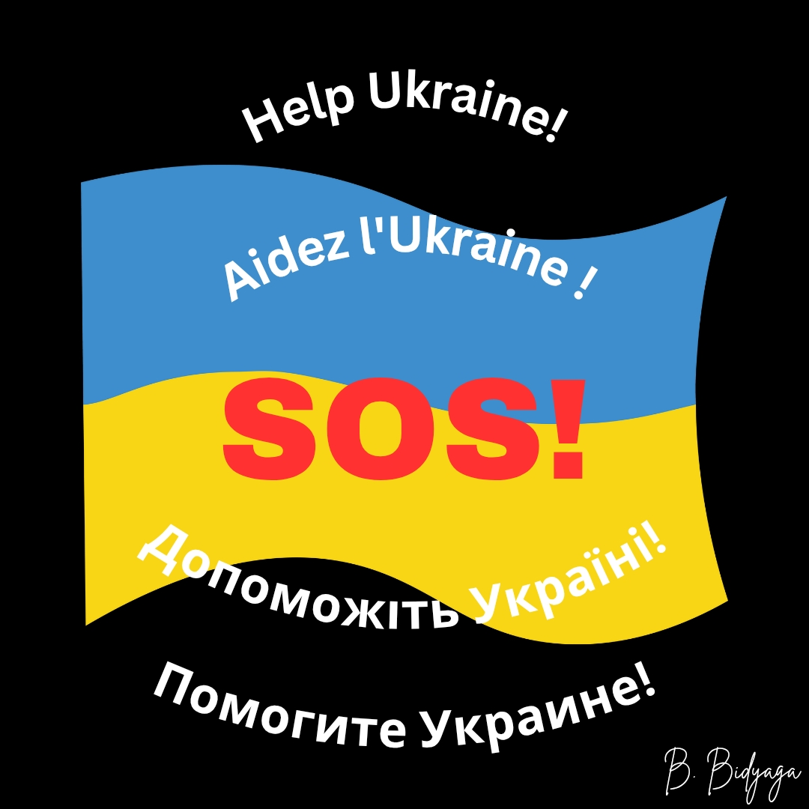

### LISTE DES FONDATIONS CARITATIVES EN SOUTIEN À L’UKRAINE : 

**1. UNBROKEN (Незламні)**
Prothèses, rééducation et soutien psychologique aux militaires et aux civils blessés par la guerre.
Site : https://unbroken.org.ua
Dons : https://unbroken.org.ua/donate

**2. SavED**
Restauration des écoles et jardins d’enfants dans les territoires libérés.
Site : https://saved.foundation
Dons : https://saved.foundation/?payment=general

**3. UNITED24** (Plateforme officielle du président de l’Ukraine)
Déminage, aide médicale, reconstruction de logements, écoles, hôpitaux.
Site : https://u24.gov.ua
Dons : https://u24.gov.ua/donate

**4. Razom for Ukraine** 
Soins médicaux, réhabilitation et prothèses pour les blessés, aide aux déplacés et réfugiés.
Site : https://www.razomforukraine.org/
Dons : https://www.razomforukraine.org/donate-to-ukraine/

**5. Reviens vivant**
Équipement de haute technologie pour les Forces armées ukrainiennes : drones, véhicules, systèmes de surveillance et moyens de communication. Formation du personnel militaire ukrainien.
Site : https://savelife.in.ua/
Dons : https://savelife.in.ua/en/donate-en/#donate-army-card-once

**6. Fond pour la reconstruction de l'Ukraine** 
Reconstruction à long terme des infrastructures détruites : logements, hôpitaux, écoles, énergie.
Site : https://ukrainereconstructionfund.org/
Dons : https://ukrainereconstructionfund.org/donate-now/

**7. Retour à la vie**
Aide humanitaire étendue aux victimes : personnes déplacées internes, enfants, familles des disparus.
Site : https://returntolife.org.ua/
Dons : https://returntolife.org.ua/donate/

**8. Fondation Serhiy Prytula**
Aide dans de multiples domaines : du matériel tactique et des véhicules pour les Forces armées ukrainiennes à l'aide humanitaire à grande échelle pour les civils.
Site : https://prytulafoundation.org/
Dons : https://prytulafoundation.org/
