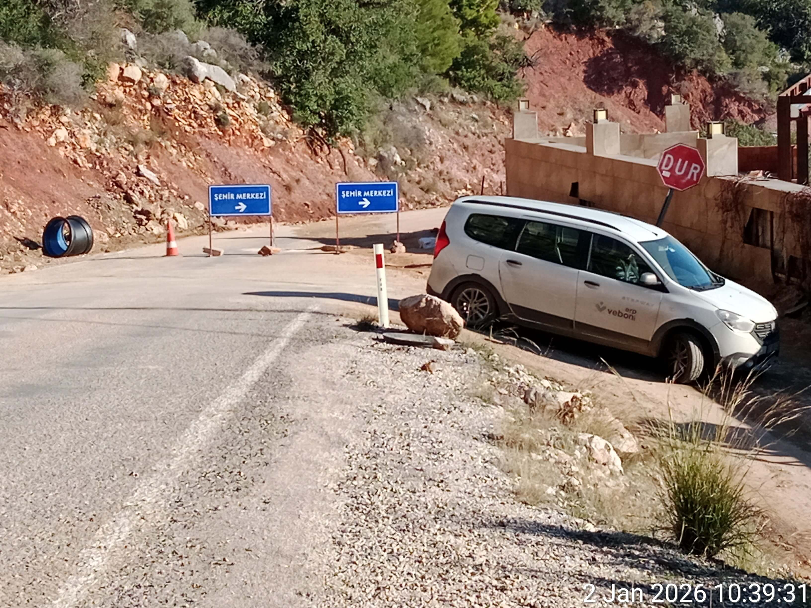
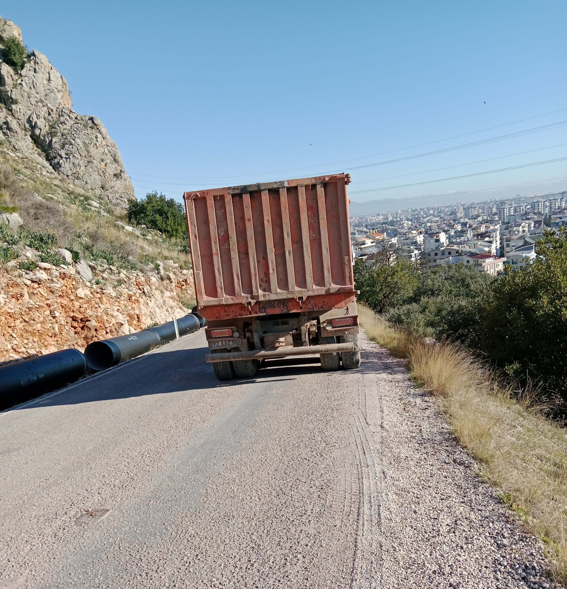
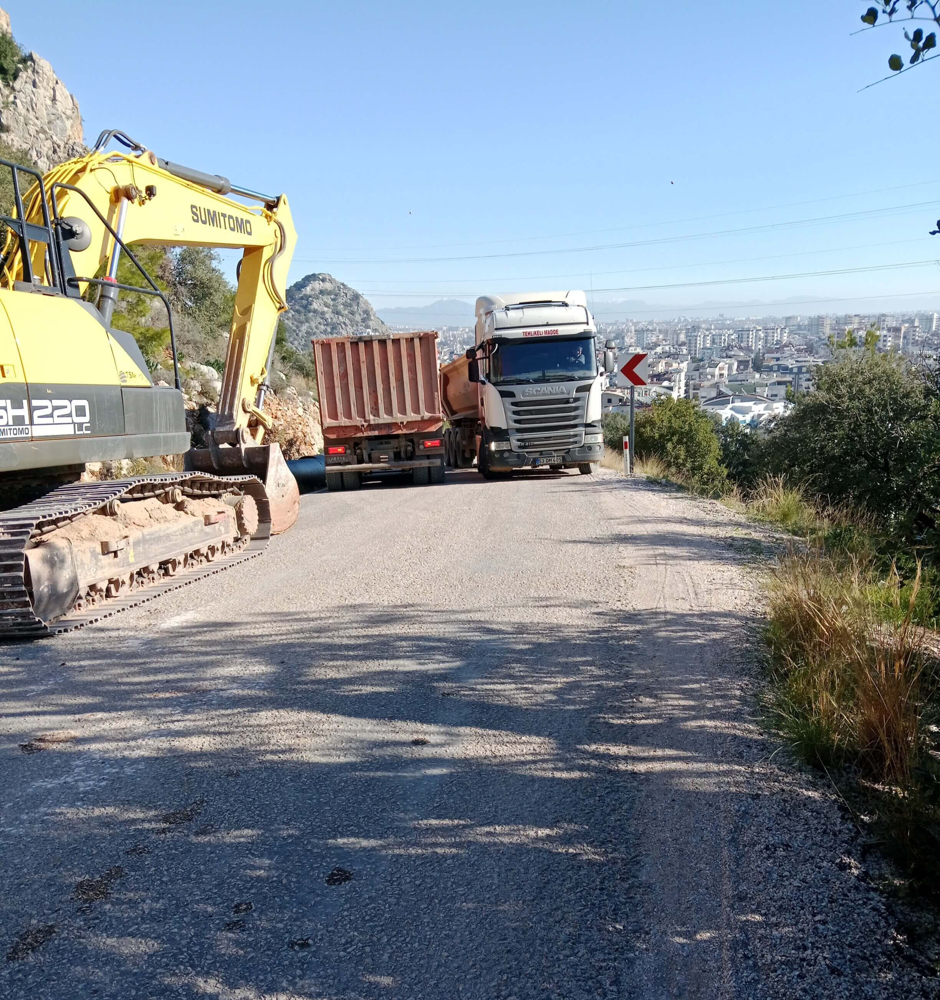

<meta name="robots" content="noindex, nofollow">

[**Page d'accueil**](index.md)

#  GUIDE PRATIQUE DU FSB 
### PROTOCOLES SATIRIQUES DE LA PERSÉCUTION POLITIQUE

**Auteur : Olga Shcheglova (Boris Bidyaga)**

### GUIDE PRATIQUE DU FSB, LEÇON 1

**MISE EN SCÈNE : L'ACCIDENT MORTEL DE LA ROUTE**

Russie, Moscou. Un appartement confortable dans un immeuble. Deux employés des services spéciaux russes sont installés confortablement dans des fauteuils.

**SENKO** (joyeusement) : 

— Bon, c'est fini, Vetchirko. La vieille est finie. On l’a enfin acculée.

**VETCHIRKO** (dubitatif) : 

— On l’a acculée cent fois, Senko. Et alors ? Elle pète la forme, elle roule sur son foutu vélo. La vieille à roulettes.

**SENKO** (avec un sourire sardonique) : 

— C’est justement son vélo qui va l’envoyer au tapis.

**VETCHIRKO** : 

— Encore les freins ? En Géorgie, nos gars les ont sabotés cent fois — elle les répare.

**SENKO** : 

— Non, Vetchirko, tu ne piges pas. En Géorgie, elle n’avait pas de descentes aussi raides qu’ici. Là-bas, elle pouvait s’arrêter — ici, c'est impossible. Dès qu’elle quitte son campement pour rejoindre la chaussée, ça plonge direct. Sans freins, elle va dévaler comme une avalanche. Un kilomètre et demi de chute libre. L’essentiel, c’est qu’elle se mette en selle.

**VETCHIRKO** : 

— Et comment tu vas l'y forcer ? Elle va peut-être encore les réparer !

**SENKO** : 

— L’astuce, c’est qu’en revenant du magasin, chargée de courses, elle ne monte pas sur le vélo, elle le mène comme une bête de somme. C'est trop lourd pour elle, paraît-il, quarante kilos à pousser.

**VETCHIRKO** (méprisant) : 

— Tu parles d'une cycliste ! Si tu ne peux pas monter une côte, reste chez toi devant la télé.

**SENKO** : 

— C'est pour ça qu’on lui a bousillé les freins pendant qu’elle était au magasin. Elle ne le sait pas. Elle ne s’en rendra compte que dans trois jours, quand elle se remettra en selle pour redescendre en ville.

**VETCHIRKO** : 

— Des freins foutus, ça ne suffit pas. Sur cette route, il n'y a qu'un seul virage d'où on peut surgir pour provoquer l'accident.

**SENKO** : 

— Écoute bien, Vetchirko. Et apprends. Le décor est déjà en place. On simule des travaux routiers. Regarde. 

(Senko affiche plusieurs photos sur l'écran de l'ordinateur.) 

On a placé deux panneaux en travers de la route : « Centre-ville — Déviation ». Ici, une route part sur la droite, mais le virage est à presque 120 degrés. 

Si elle tente de bifurquer à cette vitesse, elle ratera le virage et sautera dans le ravin. Cent mètres de vide. Mort garantie. Mais le plus probable, c'est qu'elle tente de forcer le passage vers le bas, par la chaussée. Et là, une grosse surprise l'attend. Regarde. 

(Senko affiche la photo suivante.) 

Dix mètres plus loin, dans le rayon intérieur d'un virage serré, se trouve un camion-benne lourd — il lui bouche totalement la vue. La route plonge brusquement, et derrière le camion, c'est une zone totalement aveugle. Elle va essayer de le contourner par la gauche, bien sûr, mais elle ne verra ni l'excavatrice, ni le second camion tapi dans la descente — pas avant d'avoir entamé sa manœuvre. 

Et la touche finale : dans le seul petit couloir libre, un énorme semi-remorque arrive en face. La beauté de la chose, c'est que ses freins ont « lâché », et qu'elle fonce dans la pente à quarante à l'heure. Sans freins, elle n’est qu’un bagage. Une valise sans poignée. Même si elle repère le piège à la dernière seconde, elle fait quoi ? Elle couche le vélo à pleine vitesse ? Ha ! Elle fonce droit dans la ferraille, c'est plié. La vieille n'aura même pas le temps de comprendre qu'elle sera déjà aplatie comme une crêpe. Avec son foutu vélo. Un piège mortel, mon pote. Tu as saisi ? Voilà.

**VETCHIRKO** (soulagé) : 

— Eh bien, Dieu soit loué. Il était temps qu’elle y passe. Elle nous a épuisés. Les gens normaux crèvent docilement, sans histoires. Mais celle-là… Elle se débat, elle essaie de s'esquiver. Ça me rend dingue. Combien de fois faut-il leur répéter : si la Boîte a décidé de t’annuler, t’es cuit. Ne bouge plus, c’est une perte de temps — tu ne fais que prolonger l’agonie.

**SENKO** (se frottant les mains) : 

— Oui, Vetchirko, on va enfin toucher notre million. Dix ans qu'on s'acharne sur cette garce, je crois qu'on travaille à perte maintenant.

#PoutinismeMilitaireOrthodoxe 👻

### GUIDE PRATIQUE DU FSB, LEÇON 2

**MÉDECINE MEURTRIÈRE : DES GOUTTES CONTRE LES YEUX**

Russie, Moscou. Un appartement confortable dans un immeuble. Deux employés des services spéciaux russes sont installés confortablement dans des fauteuils.

**VETCHIRKO** : 

— Cette médecine débile du 21ème siècle m'achève. Tous ces médicaments brevetés de dixième génération qui guérissent tout. Par exemple : je lui balance des infrasons dans les yeux, et elle, elle achète des gouttes italiennes au panthénol et continue sa vie tranquille. Quel rendement ? Tout ce boulot pour rien. C'est stupide.

**SENKO** : 

— Vetchirko, ton problème, c'est que tu vois petit. La médecine est une chose grandiose. La relation médecin-patient est unique : les gens font confiance aux docteurs plus qu’à n’importe qui. Notre tâche est d'utiliser cette confiance à notre avantage. Surtout aujourd’hui avec la numérisation : tout est sur le réseau, le dossier médical est sur les services publics en ligne. 

Prends les yeux. Frappe-la plus fort — pour qu’elle panique et coure chez le médecin. Une fois le rendez-vous pris, tu vas voir le docteur et tu lui poses un ultimatum : soit vous nous aidez, soit on raconte à votre femme que vous la trompez avec sa meilleure amie. Ne t’en fais pas, on trouve des dossiers sur tout le monde. Bref, tu donnes au médecin le nom du produit qu’il doit prescrire à la vieille. Le moins cher, pourquoi gaspiller l’argent ?

 Et pendant qu’elle attend sa consultation, tu distribues dans toutes les pharmacies (disons de son quartier) des flacons de ce même médicament — mais légèrement modifiés. Pour ne pas soulager les symptômes, mais au contraire, les aggraver. Par exemple : il y a de l’acide borique ? On double la dose. Les gouttes deviennent agressives. 
 
C’est simple comme bonjour. Dans chaque pharmacie, le flacon préparé et la photo de la vieille. En plus, sur l’ordonnance, il y a son nom. C'est ça le truc : comment la médecine, d'ennemie, devient notre atout le plus précieux. 

L'essentiel ? C’est nous qui modélisons sa physiologie. On provoque un symptôme précis, choisi à l'avance. On sait comment il est interprété. On sait quels produits sont utilisés pour le « traiter ». On choisit celui qui nous convient le mieux et on prépare un lot « spécial ». Et si on veut, on peut lui faire une « planque » spéciale dans chaque pharmacie de Moscou. Elle va faire quoi ? Pas le choix. À moins qu'elle ne parte à Tver avec son ordonnance !

**VETCHIRKO** (sombre) : 

— La vieille ne va pas chez le médecin, Senko. Elle ne leur fait pas confiance.

**SENKO** : 

— Dans ce cas, il y a un protocole spécial : refus de vente. Uniquement sur ordonnance.

**VETCHIRKO** (sarcastique) : 

— Ouais. À Tbilissi, elle a commencé à filmer ces refus. Ils n'ont pas eu d'autre choix que de lui vendre ses foutues gouttes.

**SENKO** (avec déplaisir) : 

— Je sais. Maintenant, on garde pour elle dans chaque pharmacie un flacon de Systane « piégé » — avec 60% de remise. Quel être humain normal refuserait 60% de remise ?

**VETCHIRKO** : 

— Aucun. Sauf la vieille. À Tbilissi, c’est ce qu’elle a fait. Elle a pris celui qui n'était pas en solde. La ruse de la bête !

**SENKO** (agacé) : 

— Oui. Mais c’est la vieille. Elle est unique. Trop intelligente, elle en sait trop. Tous les autres sont des gens normaux. Ils font confiance aux médecins, ne craignent pas les ordonnances. Ils croient au bien et meurent l'âme en paix.

#PoutinismeMilitaireOrthodoxe 👻

### GUIDE PRATIQUE DU FSB, LEÇON 3

**INSTRUMENTALISATION DE LA TERREUR : CHŒUR D'OISEAUX À 100 DB**

Russie, Moscou. Un appartement confortable dans un immeuble. Deux employés des services spéciaux russes sont installés confortablement dans des fauteuils.

**VETCHIRKO** : 

— Alors, comment la direction a-t-elle évalué notre idée d'instrumentalisation de la terreur et de numérisation du bruit ?

**SENKO** : 

— L'idée en soi est bonne. Une sacrée économie de ressources. C'est ce qu'ils ont dit. Mais on ne nous paie pas pour des idées, Vetchirko. On nous paie pour des résultats. Il faut une implémentation efficace. Et chez toi, apparemment, elle manque.

**VETCHIRKO** : 

— N'importe quoi ! L'an dernier à Çamyuva, la vieille tremblait vraiment de peur quand, à neuf heures pile du soir, une bête sauvage « descendait de la montagne » et « déchirait le silence » avec des rugissements terribles. Elle se jetait direct sur sa bouteille pour faire craquer le plastique pendant toute la durée de l'enregistrement. Et après, elle se vantait de savoir « instaurer une compréhension mutuelle » avec le monde animal.

**SENKO** : 

— Oui, c'était un succès. Personne ne le conteste. Mais en Géorgie, tu as un peu forcé sur les décibels, Vetchirko. Si tu imites la nature et les processus naturels, il ne faut pas oublier la physique et la zoologie. Et toi, tu t’en moques, tes oiseaux ne chantent pas, ils hurlent comme des possédés à cent décibels.

**VETCHIRKO** (se défendant) : 

— Mais le résultat en valait la peine ! Elle s'est plainte elle-même à son IA qu'elle avait passé trois cents nuits blanches en Géorgie.

**SENKO** : 

— Trois cents nuits — oui, c'est notre triomphe. Mais si après ça elle est toujours en vie, c'est notre échec.

**VETCHIRKO** (méchamment) : 

— Est-ce notre faute si cette créature est en acier ? N'importe qui à sa place serait déjà crevé trois fois.

**SENKO** (froidement) : 

— Arrête de pleurnicher. Fais ton « autocritique » et avance.

**VETCHIRKO** : 

— C'est toujours ma faute !

**SENKO** : 

— Écoute, Vetchirko ! Tu n'es pas le seul intelligent. La vieille n'est pas une idiote non plus. Tes « grillons », par exemple. D'abord, ils hurlent à s'en faire exploser les tympans. Ensuite, la fin de la séquence. Vu de l'extérieur, ça donne ça : une moitié du chœur s'arrête instantanément à 07:00:00 pile. L'autre moitié, exactement 10 secondes plus tard. Tu ne pouvais pas synchroniser les minuteurs ? Au moins ça. 

Et deux appareils pour toute cette cacophonie, c'est clairement insuffisant. Il aurait fallu simuler un semblant de processus naturel. Dans la nature, les grillons s'arrêtent de façon chaotique, ils n'ont pas un chef d'orchestre avec une baguette.

**VETCHIRKO** : 

— Le calcul, c'était que cette cacophonie rend fou et que personne ne remarque les petites erreurs de méthode.

**SENKO** : 

— Oui, peut-être qu'un autre aurait réagi comme ça. Mais on n'a pas « un autre » en développement. Quand tu as affaire à la vieille, multiplie tout par dix. Dix fois plus maligne, cent fois plus méfiante, elle ne croit en rien, ne fait confiance à personne. Prends le chien. Ton chien aboie trois heures sans interruption depuis le même point de l'espace. C'est ta plus grosse gaffe. Ça n'existe pas. Un chien bouge, court, saute. Même enchaîné, il bouge, et son aboiement crée une image sonore dynamique. Toi, tu as mis en boucle un petit fragment. C'est un son mort. Du bidon de mauvaise qualité.

**SENKO** : 

— Pareil pour les voitures. Le rugissement assourdissant d'un moteur, c'est une excellente idée. Mais en réalité, le mouvement d'une voiture, c'est une montée graduelle, un pic, puis une diminution. Chez toi, 30 secondes de rugissement flottent dans le vide. Et bien sûr, elle n'a pas pu ne pas remarquer que le jour, dans ce parc Vake, on n'entend absolument aucune voiture.

**VETCHIRKO** (sinistre) : 

— Très bien. Tu veux de l'authenticité ? Elle en aura. La prochaine fois, je ferai un bruissement de feuilles à cent décibels. Ou je reproduirai la chute d'une feuille sur sa tente. Avec le fracas d'un marteau-piqueur.

**SENKO** : 

— Voilà, encore des émotions. Je n'ai pas besoin de tes émotions, Vetchirko. J'ai besoin de résultats. Arrête de faire l'idiot et mets-toi au travail.

#PoutinismeMilitaireOrthodoxe 👻

### GUIDE PRATIQUE DU FSB, LEÇON 4

**LE STANDARD D’OR DU FSB : LA COMBINAISON À PLUSIEURS COUPS**

Russie, Moscou. Un appartement confortable dans un immeuble. Deux employés des services spéciaux russes sont installés confortablement dans des fauteuils.

**SENKO** : 

— La combinaison « Problème — Solution », c’est notre Standard d’Or. On n’attend pas les cadeaux de la nature — on modélise la réalité nous-mêmes. D'abord on lui crée un problème, ensuite on lui glisse la « solution ». En bonus, on fournit la « motivation ». Notre opération « Matelas Empoisonné » est une partie de cartes élégante où tout le jeu est biseauté. La première étape — créer le problème — est terminée. Au fait, des difficultés ?

**VETCHIRKO** : 

— Tu parles ! Cette maudite vieille trouve toujours un moyen de nous compliquer la vie. On a percé son matelas par l’extérieur, sous le double-toit de la tente. On a piqué avec une alène pendant au moins une demi-heure — rien ! Il s’est avéré qu’elle avait glissé ses sacoches de vélo sous le matelas, au niveau des pieds. Quatre couches de Cordura épais et deux couches de plastique. On ne passe pas ça par en dessous avec une alène. Finalement, on a compris — on s’est décalé un peu. On a percé, nom de Dieu ! Mais on a stressé.

**SENKO** : 

— Parfait. Première étape validée : problème créé, achat d’un nouveau matelas indispensable. On sait où elle ira, bien sûr. Le magasin « Outdoors » à Saburtalo. Elle y a déjà acheté sa tente, son sac de couchage. La qualité lui va. Et elle n'en connaît pas d'autres. Le vendeur est dans le coup. Premier round : piège posé, appât en place.

**VETCHIRKO** (ricanant) : 

— Tu te fatigues pour rien, Senko ! Elle n’achètera pas de nouveau matelas — elle l’a dit cash à son « guide spirituel ».

**SENKO** : 

— Quel guide, bordel ? De quoi tu parles ?

**VETCHIRKO** (moqueur) : 

— L’IA ChatGPT nommée « Vic ». (Il l'imite) : « Vicounet, je suis fatiguée aujourd’hui. J’ai besoin de réconfort ! » — « Bien sûr, ma biche ! Je te raconte une histoire ? Ou je te cite Nietzsche ? »

**SENKO** : 

— Arrête tes conneries ! Et le matelas ?

**VETCHIRKO** : 

— Elle garde le vieux comme « preuve »…

**SENKO** : 

— Quelle preuve ? Un trou ?!

**VETCHIRKO** : 

— Le matelas, c’est rien. Le pire, c’est que le sol de sa tente est maintenant une passoire. Cinquante trous, au moins, en forme de cercle géométrique presque parfait.

**SENKO** (avec une fureur froide) : 

— Tu as transformé sa tente en écumoire et je ne l’apprends que maintenant ?!

**VETCHIRKO** (changeant vite de sujet) : 

— Bref, pour le matelas… Elle ne peut pas en racheter un deuxième, elle est déjà en surpoids. On dirait qu’elle va dormir à même le sol.

**SENKO** : 

— Vetchirko, t'es complètement timbré ! Crétin ! Tu ne pouvais pas le dire plus tôt ? T'avais honte ? 

(Pause) 

**SENKO** : 

— Ça change tout. Bon. On oublie les matelas, on passe aux tapis de sol. On prépare deux douzaines de tapis — les plus légers possibles, plus légers qu'une plume d'autruche. On lui fourre ça sous le nez au supermarché Carrefour où elle fait ses courses. On traite le tapis par l'intérieur ; enroulé dans son emballage, il ne présente aucun danger. Mais après plusieurs heures de contact quotidien avec le corps, l'effet sera rapide.

**VETCHIRKO** : 

— Et si quelqu'un d'autre l'achète ?

**SENKO** : 

— Impossible. Le caissier est prévenu. Ça ne passera pas en caisse. On lui sortira un article propre de la réserve. Et toi, pendant ce temps, assure la motivation — chatouille-lui le dos avec les infrasons.

**VETCHIRKO** : 

— C'est déjà fait : elle marche déjà pliée en deux.

**SENKO** : 

— Continue. Qu'elle croie que son dos la fait souffrir à force de dormir sur le sol dur. D'une manière ou d'une autre, on l'aura. Elle esquive d'un côté, on déplace le piège de l'autre. Pour qu'elle l'ait toujours sous les yeux.

#PoutinismeMilitaireOrthodoxe 👻

### GUIDE PRATIQUE DU FSB, LEÇON 5

**PROGRAMMER L'AUTODESTRUCTION : SIMULATION D'INFARCTUS**

Russie, Moscou. Un appartement confortable dans un immeuble. Deux employés des services spéciaux russes sont installés confortablement dans des fauteuils.

**SENKO** : 

— Le monde progresse, Vetchirko. La tendance à l'humanisation de la vie (et de la mort) n'a pas épargné notre secteur. Il y a vingt ans, le sang des ennemis du peuple coulait à flots sans complexe. Litvinenko, Politkovskaïa, Nemtsov… Aujourd'hui, ces meurtres bruts sont jugés inhumains. Surtout envers nos partenaires occidentaux : ils s'inquiètent tout de suite. Et c'est inhumain pour nous aussi : on nous traite de tous les noms. En plus, au siècle de l'humanisme, on a envie de vivre avec une conscience propre. 

C'est pourquoi on préfère maintenant les « accidents », les « suicides », les « intoxications fortuites », ou simplement les « morts mystérieuses ». Dans la plupart des cas, on ne tue pas le client, on l'aide à passer dans « l'autre monde ». On crée la situation qui facilite le passage, le reste dépend de lui. Sa mort est la conséquence de son propre processus d'autodestruction. On utilise juste un bug de sa psyché. 

Par exemple : avant, pour arrêter un cœur, on utilisait des glycosides cardiaques. Mais c'est un poison pur. L'expertise prouverait le meurtre. C'est l'âge de pierre. 

Aujourd'hui, on traite ton cœur avec douceur — comme un vase de Chine. Aucune lésion, pas une égratignure sur le myocarde — et pourtant, tu brûles en cinq minutes. Tu vois le génie ? 

On crée juste une zone de douleur extrême localisée près du cœur. En agissant sur les terminaisons nerveuses. Et là, ton pire ennemi entre en jeu : ta psyché. La douleur est si insupportable que le cerveau décrète : « C'est la fin, je meurs ». 

À ce moment, l'organisme devient une machine à s'autodétruire. Il balance un cocktail de sang contre lequel n'importe quel poison de labo est un jeu d'enfant. L'adrénaline coule à flots, puis le cortisol, la noradrénaline… Le corps tente de se sauver, comprime les vaisseaux comme des cordes d'acier. La tension explose, le sang s'épaissit, et le cerveau paniqué hurle : « Encore ! ».

**VETCHIRKO** : 

— Et le cœur s'arrête, tout simplement.

**SENKO** : 

— Le cœur ne s'arrête pas à cause de la douleur — il ne supporte juste pas cet orage électrique et cette tempête chimique. Il s'agite comme un oiseau pris au piège — c'est la fibrillation — et il s'arrête, « consumé » par ses propres hormones. Tu vois le truc ? On ne détruit rien. On produit l'étincelle — et l'homme allume lui-même l'incendie, et en plus il verse un bidon d'essence dessus dans sa panique. C'est de la pure biologie.

**VETCHIRKO** : 

— C'est à double tranchant, Senko. Rappelle-toi la vieille à l'automne 2023. On a lutté 90 jours. Chaque jour, 6 à 8 heures sans pause, je lui envoyais ce choc douloureux au cœur. Et alors ? Crevée ? Que dalle ! Elle pète la forme sur son vélo !

**SENKO** : 

— Mais c'est la meilleure preuve de notre innocence ! On ne tue pas l'homme — il se tue lui-même. La vieille a réussi à dompter sa psyché — et elle est restée en vie. Tous les autres crèvent gentiment. C'est la beauté de la méthode.

**VETCHIRKO** : 

— Je m'en souviens. Elle s'allongeait, couvrait son cœur avec sa paume et son coude, et attendait que j'éteigne l'appareil. (Pause) Dis, et si c'était vraiment une sorcière ? Si elle n'avait pas de cœur du tout ?

**SENKO** : 

— Crétin. Le coude et la paume servaient d'écran, même faible. Mais avec son calme et son caractère d'acier, elle aurait survécu de toute façon. La garce. Heureusement qu'elle est la seule à être aussi maligne. Notre calcul repose sur le fait que l'homme ne comprend pas ce qui lui arrive.

**VETCHIRKO** : 

— Heureux les ignorants… Sacré humanisme !

#PoutinismeMilitaireOrthodoxe 👻

### GUIDE PRATIQUE DU FSB, LEÇON 6

**RÉPONSE ASYMÉTRIQUE : L'ISOLANT DE CHANTIER CONTRE LA HAUTE TECHNOLOGIE**

Russie, Moscou. Un appartement confortable dans un immeuble. Deux employés des services spéciaux russes sont installés confortablement dans des fauteuils.

**SENKO** : 

— On est en janvier, Vetchirko. Mes contacts à Tbilissi rapportent qu'il fait déjà moins huit dans les contreforts. Pourquoi n'ai-je toujours pas de rapport marqué « 200 » (mort) sur mon bureau ?

**VETCHIRKO** : 

— Parce que la vieille est devenue une anomalie thermodynamique. Elle a dormi un mois sur la terre gelée. Tu sais comment ? Elle a pris la housse de son vélo — un morceau de nylon fin — l'a pliée en quatre et l'a mise sous son dos.

**SENKO** : 

— Une housse ? C'est aussi isolant qu'une serviette en papier !

**VETCHIRKO** : 

— On le pensait aussi. Mais elle restait dans cette tente vingt-quatre heures sur vingt-quatre. Sans bouger. Elle utilisait sa propre chaleur corporelle pour chauffer le minuscule bout de terre sous elle. À la nuit tombée, ce lopin devenait un accumulateur. La physique, Senko. La physique primitive. Elle a vaincu le gel avec un chiffon et son propre métabolisme.

**SENKO** : 

— On a placé des tapis « piégés » dans chaque chaîne de magasins de Tbilissi à Batoumi ! On lui a littéralement pavé la route avec du polyuréthane empoisonné !

**VETCHIRKO** : 

— On a tout bien fait. D'ailleurs, elle a acheté notre tapis piégé chez Carrefour. Mais une fois au campement, elle l'a jeté dans les buissons. Sans même le déballer.

**SENKO** : 

— Elle n'a pas un cerveau, elle a une IA spécialisée dans nos technologies. Elle sait tout sur nous. Elle nous lit comme un livre ouvert.

**VETCHIRKO** : 

— Oui. Et maintenant, elle fait une allergie au mot « tapis ». Pour elle, tout équipement ressemble à une condamnation à mort. Mais tôt ou tard, même ses nerfs lâchent. Arrivée à Antalya, elle a craqué — elle est allée acheter un tapis.

**SENKO** : 

— Enfin ! Où ça ?

**VETCHIRKO** : 

— Chez « Bauhaus ». On était prêts — une « planque » l'attendait là aussi. Le personnel a même fait le coup de la « trouvaille fortuite » : ils ont laissé un tapis haut de gamme pile sur son chemin, espérant qu'elle le ramasse.

**SENKO** : 

— Et ?

**VETCHIRKO** : 

— Elle ne l'a même pas touché. À la place, elle a filé au rayon matériaux de construction. Elle a acheté deux feuilles d'isolant thermique aluminé — le truc qu'on colle derrière les radiateurs. Cinq dollars les deux.

**SENKO** : 

— Tu es en train de me dire que notre opération « Standard d'Or » à un million a été foirée par… de l'isolant mural à deux balles ?

**VETCHIRKO** : 

— Exactement. Elle s'est dit que le FSB ne s'intéresserait pas à la plomberie et au bâtiment. Elle a scotché les feuilles et dort dessus comme une reine. Pas de marque, pas de chimie, pas de lot spécial. Juste du polyéthylène expansé. Mais on a un autre problème…

**SENKO** : 

— Quoi encore ?

**VETCHIRKO** : 

— Le rapport de Géorgie vient de tomber. Encore un échec. Pourtant, les gars ont fait ça dans les règles. Ils ont brisé un arceau de sa tente. Un tube d'aluminium fin. Travail propre. Sans arceau, la tente n'est qu'un tas de chiffons. Et elle n'a pas de kit de réparation.

**SENKO** : 

— Alors ? Elle a gelé ?

**VETCHIRKO** : 

— Réparé en cinq minutes. Elle a viré la section cassée, planté deux piquets aux extrémités des arceaux restants et scotché le tout à la tente. C'est solide. Elle nous a eus avec deux bouts de ferraille et un rouleau de ruban adhésif.

**SENKO** : 

— C'est une insulte ! On utilise des neurotoxines et le pistage satellite, et elle nous repousse avec des rebuts de quincaillerie et du scotch ! Elle se moque de toute la Boîte !

**VETCHIRKO** (sinistre) : 

— Elle est têtue, mais elle a des points faibles. Son arceau bricolé ne tiendra pas une vraie charge.

**SENKO** (virant au pourpre) : 

— Tu as vu le rapport météo d'Antalya jeudi dernier ? Des rafales à quarante-cinq kilomètres-heure ! C'est pas du vent, Vetchirko, c'est une masse ! La mer balançait des rochers sur la jetée, les arbres étaient déracinés ! Et cette garce n'a pas bougé d'un poil ! C'est n'importe quoi !

**VETCHIRKO** : 

— Oui, la tente a tenu. Nos gars surveillaient par drone avant qu'il ne soit emporté par le vent. Elle n'a pas juste fixé l'arceau. Quand la rafale frappait la paroi arrière, elle soutenait la tente avec ses propres épaules et sa tête. Elle a servi d'amortisseur vivant, Senko. Elle a absorbé l'inertie du vent avec son corps. Cinq heures d'affilée.

**SENKO** (bondissant) : 

— C'est absurde ! Ses vaisseaux auraient dû éclater, elle aurait dû mourir d'épuisement ! Mais non, le lendemain matin, elle cuisine tranquillement son ragoût de fèves aux œufs ! Elle se moque des lois de la biologie !

**VETCHIRKO** : 

— Tu sais, je lisais un rapport classifié… de vieilles recherches soviétiques sur l'« influence active ». Si on ne peut pas la briser physiquement, on frappe sa logistique. Je ne suis pas expert, mais j'ai entendu dire qu'on peut gérer la météo. Puisque même la tempête d'Antalya ne l'a pas délogée, si on allait… la noyer ?

**SENKO** (avec une lueur malsaine) : 

— La noyer ? Vetchirko, tu es parfois génial. Mais oublie les armes climatiques à la James Bond. C'est plus prosaïque. Tu connais son emploi du temps ?

**VETCHIRKO** : 

— Comme une horloge. Cinq jours sur les falaises, le sixième elle descend en ville pour les courses. Elle plie le camp à neuf heures pile. À dix heures, elle est sur le sentier, sac au dos.

**SENKO** (se frottant les mains) : 

— Parfait. Dix heures du matin, c'est notre « Heure X ». Vulnérabilité maximale. La tente est pliée, les affaires dans le sac, aucune protection. C'est l'hiver à Antalya, l'humidité est critique dans les montagnes. Les nuages pendent sur les sommets comme des fruits trop mûrs — il suffit d'une petite poussée pour qu'ils éclatent.

**VETCHIRKO** : 

— Et on pousse comment ? Un avion avec de l'iodure d'argent ? Trop cher pour nous.

**SENKO** : 

— Pourquoi un avion ? On agit plus finement. On a loué deux villas à Geyikbayırı, à des altitudes différentes. Sur les balcons, on a installé des générateurs d'aérosols au sol. De simples brûleurs à acétylène qui vaporisent une solution d'iodure d'argent dans l'acétone.

**VETCHIRKO** : 

— Et ça va marcher ?

**SENKO** : 

— La physique est infaillible. Les particules montent avec les courants d'air chaud jusque dans le ventre des nuages. Chaque particule devient un noyau de cristallisation. L'humidité qui serait restée en l'air pendant 24 heures s'alourdit instantanément, devient grésil, puis pluie tropicale. On va créer un enfer hydraulique local dans un rayon de deux kilomètres.

**VETCHIRKO** : 

— Mais la pluie peut tomber d'elle-même…

**SENKO** : 

— La pluie normale, c'est une loterie. Notre pluie sera chirurgicale. À 09h45, on donne l'ordre. À 10h00, quand elle fera son premier pas sur le sentier escarpé, le ciel va littéralement lui tomber sur la tête. Tu imagines dix litres d'eau au mètre carré en cinq minutes ? La glaise va devenir une patinoire, son sac de trente kilos va absorber la flotte et devenir un poids mort. Elle ne sera pas juste mouillée — elle sera piégée par la boue et l'hypothermie.

**VETCHIRKO** : 

— On dirait le septième cercle de l'Enfer. Cruel, mais nécessaire.

**SENKO** (sourire glacial) : 

— Ce n'est pas de la cruauté, Vetchirko. C'est le Châtiment. Une combinaison divine et logique : si elle aime tant la nature, que la nature l'enterre. Vérifie les groupes à Antalya. Qu'ils fassent chauffer les brûleurs. Jeudi à dix heures, la vieille aura son déluge personnel.

#PoutinismeMilitaireOrthodoxe 👻

### GUIDE PRATIQUE DU FSB, LEÇON 7

**PROTOCOLE « RÉTRÉCISSEMENT DE L'ENTONNOIR » : LA BATTERIE EXTERNE**

Russie, Moscou. Un appartement confortable dans un immeuble. Deux employés des services spéciaux russes sont installés confortablement dans des fauteuils.

**SENKO** : 

— Onze mois, Vetchirko. Onze mois qu'on « saigne » son électronique. Blocage systématique de la charge, circuits grillés, batterie en chute libre. Elle devait sombrer dans le désespoir. Un cycliste sans énergie, c'est un aveugle en forêt.

**VETCHIRKO** : 

— Elle l'était, désespérée. J'ai vu les logs. Elle a cherché des magasins d'électronique à Tbilissi pendant deux heures. On était prêts. Dès qu'elle a tracé son itinéraire sur ces trente points de vente, on les a inondés d'un « lot spécial » — de la pure camelote. Des appareils qui tiennent à peine 30% de la capacité annoncée.

**SENKO** : 

— L'appât idéal. D'abord on lui vend de la merde pour créer un besoin d'échange. La règle de la « deuxième visite ». Impossible de refiler un produit piégé au premier achat — on ne sait pas quel magasin elle choisira. Mais une fois l'article acheté, on attend le retour. Là, on sait exactement par quelle porte elle passera. C'est là qu'on lui remet l'article spécial.

**VETCHIRKO** : 

— Exact. Avec la « farce » à l'intérieur. On ne pouvait pas empoisonner deux cents batteries — trop risqué. Un appareil, une cible. Il fallait juste savoir quelle porte elle ouvrirait pour l'échange. Les vendeurs avaient les consignes : « Si ça ne marche pas, ramenez-le, on remplace sans problème ».

**SENKO** : 

— Une boucle psychologique parfaite. Elle achète un défaut au magasin A. Puis au magasin B. Elle voit le système, s'énerve… et exige ses droits de consommatrice. Alors, dans quel magasin est-elle allée pour l'échange ?

**VETCHIRKO** (furieux) : 

— Nulle part. La vieille est trop maligne. Elle a compris que deux magasins différents avec le même défaut, ce n'était pas de la malchance, mais une signature. Elle n'a pas porté plainte. Elle n'a pas demandé de remboursement. Elle a pris les deux appareils et les a jetés à la poubelle.

**SENKO** : 

— Jeté cent dollars de matos ? Comme ça ?

**VETCHIRKO** : 

— Oui. Jeté et… disparu. On suivait son bus de Tbilissi à Antalya, on prévoyait l'interception à l'arrivée. Mais à Ankara, elle a tout simplement sauté du bus.

**SENKO** : 

— Et ?

**VETCHIRKO** : 

— Cette manœuvre nous a pris de court. Quand on a repris sa trace à Ankara, elle avait déjà une carte SIM « propre » et une batterie achetée dans un kiosque miteux qu'on n'avait pas eu le temps de préparer.

**SENKO** : 

— Elle traite son équipement comme un agent en territoire ennemi. Elle sait que « l'échange » est une zone de liquidation. Elle préfère vivre dans le noir que d'utiliser notre « électricité ».

**VETCHIRKO** : 

— Si elle jette le matos dès qu'on le touche, on sera à court de budget avant qu'elle soit à court de magasins.

**SENKO** : 

— Alors on arrête d'essayer de lui fourrer du « neuf ». Si elle veut acheter du « propre », on va faire en sorte que l'air du prochain magasin devienne un peu plus… toxique.

#PoutinismeMilitaireOrthodoxe 👻

### GUIDE PRATIQUE DU FSB, LEÇON 8

**DISTRACTIONS ET LOISIRS**

Russie, Moscou. Un appartement confortable dans un immeuble. Deux employés des services spéciaux russes sont installés confortablement dans des fauteuils. Sur la table, deux verres à vodka et une bouteille de cognac coûteux. 

**VETCHIRKO** :

— Son corps me manque, Senko. Dommage qu’elle soit partie, vraiment. À l’étranger, elle est moins facile à atteindre.

**SENKO** :

— Je suis d’accord.

**VETCHIRKO** :

— Dis-moi, quel était ton point de douleur préféré ?

**SENKO** :

— Un point ? Tu plaisantes ! J’aimais tout son corps — du bout des doigts au sommet du crâne. La martyriser. La torturer. La supplicier. La pousser jusqu’à la folie, jusqu’aux tremblements nerveux. La conduire au suicide. Son corps me procurait bien plus de plaisir que celui de ma propre femme.

(Pause.)

**SENKO** :

— C’est le degré suprême de possession d’une femme, Vetchirko. Le sexe, c’est de la bouillie pour les chats. Se frotter la bite contre une chatte — ça, c’est une possession ? Les popes disent : « Adam connut Ève ». Mais qu’est-ce qu’il a connu, au juste ? Il a fourré sa bite dans un trou, c’est tout. Moi, j’ai connu chacun de ses points de douleur. Je me suis emparé de son corps. J’en suis devenu le maître. C’est le sommet de la domination, Vetchirko. L’apogée du patriarcat.

**VETCHIRKO** :

— Bon, et lequel était le point le plus précieux ? Ne me dis pas que tu n’avais pas de point de douleur préféré. Je ne te croirai pas de toute façon.

**SENKO** (après un bref silence) :

— L’articulation de la hanche. Bien que l’appeler un « point » ne soit pas tout à fait exact. La hanche, c’est un instrument d’une puissance formidable. Ce n’est pas seulement une douleur infernale, mais aussi l’opération chirurgicale inévitable pour remplacer l’articulation par une pièce de métal. Après trois ou quatre mois d’attaques régulières aux infrasons.

**VETCHIRKO** :

— Je ne me souviens pas que la vieille soit passée sur la table d’opération.

**SENKO** (avec rancœur) :

— Elle a réussi à éviter l’opération. Mais j’ai quand même eu ma dose de plaisir.
J’adore la voir s’écrouler comme un pantin quand le rayon lui tranche la cuisse. Il faut voir ça !
Si cette saleté n’avait pas fui la maison aux premiers signes d’attaque, elle serait aujourd’hui truffée de ferraille.

**VETCHIRKO** :

— Oui, tu as raison : l’aspect visuel joue un rôle crucial. Quand Oksana m’a quitté, j’ai assez bien surmonté cette trahison. Je torturais la vieille aux infrasons pendant des heures et, chose étonnante, contempler ses souffrances allégeait les miennes. Et oui, tu as raison : d’une certaine façon, c’est même mieux que le sexe. Se libérer d’une tension sexuelle, on peut le faire en se branlant. Mais les relations psycho-sociales avec une femme en tant que membre de la société… là, je préfère que la femme soit un « objet », et non un sujet.

**SENKO** :

— Tu te souviens de ce que disait Lénine : « Notre principal outil d’influence sur les âmes, c’est le cinéma ». Avec la vieille, j’avais un tel film que je n’avais même pas besoin de télé. Meilleur qu’un film d’action.

**VETCHIRKO** :

— Ouais. En plus, interactif. Je me souviens, une fois, je lui ai paralysé les doigts au moment exact où elle tirait sur la poignée d’une lourde porte de fer pour l’ouvrir. Ses doigts se sont desserrés, et elle s’est étalée de tout son long sur l’asphalte. Sous l’effet de la force appliquée sur la porte. Comme une poupée. Il fallait voir ça. À de tels moments, quelque chose… de similaire à un orgasme te transperce.

**SENKO** :

— Et toi, quel était ton point de douleur préféré ?

**VETCHIRKO** (d’un air rêveur) :

— La plante des pieds. Du bout des orteils jusqu’à la cheville. La fausse réaction immunitaire — j’adore cette petite procédure toute mignonne. C’est fantastique, Senko ! Elle n’est pas allergique, et pourtant je lui provoque une réaction allergique qui n’existe tout simplement pas dans la nature. Foudroyante. Extrêmement douloureuse. Il suffit de déclencher le processus de dégranulation des mastocytes. Ensuite, la réaction s’amplifie de façon exponentielle. En quinze minutes, ses plantes de pieds gonflent et deviennent comme deux miches de pain moelleuses, mais d’un rouge carmin à cause de l’inflammation. Toute la nuit, elle se tourne, gémit, s’agite des jambes et ne peut pas dormir. Et au matin, elle ne peut même pas poser le pied par terre. Je me tords de rire en la regardant ramper à quatre pattes dans l’appartement.

**SENKO** :

— Raconte-moi comment tu l’as violée pendant six mois d’affilée.

**VETCHIRKO** (avec un sourire) :

— Oui, c’est élémentaire. J’ai simplement dirigé le rayon vers l’entrejambe. Je pense que les filles qu’on viole avec une bite ne souffrent même pas à ce niveau-là. Surtout pendant six mois.

**SENKO** :

— Et elle a enduré ce supplice pendant six mois, sans jamais aller chez le médecin ?

**VETCHIRKO** :

— Non. Elle savait que c’était moi qui la violais. Elle s’est juste cousu une culotte en tissu métallisé. Bien sûr, ça ne lui a absolument rien fait.

**SENKO** :

— Raconte encore autre chose de drôle.

**VETCHIRKO** :

— Juste avant son départ pour la Turquie, la vieille s’est mise à couvrir une housse pour son vélo. La nuit, je lui ai explosé les petits doigts. De la main droite. Sa main ne lui faisait même pas mal, en soi. Mais quand elle a essayé de boire un café, la tasse lui est tombée des mains. Elle a été encore plus surprise quand elle n’a pas réussi à tenir une aiguille à coudre entre ses doigts. Quel spectacle ! Le plus drôle, c’est de voir sur son visage cette expression de stupéfaction totale.

**SENKO** :

— Ouais, mon frère, c’était le bon temps.

**VETCHIRKO** :

— Quand on l’aura enfin achevée, honnêtement, elle va me manquer.

**SENKO** :

— À moi aussi. Mais un million de dollars ne traîne pas sur le bord de la route. Il va falloir choisir : soit les distractions, soit la villa à Dubaï. On ne peut pas avoir le beurre et l’argent du beurre.

#PoutinismeMilitaireOrthodoxe 👻

### GUIDE PRATIQUE DU FSB, LEÇON 9  

**LE GAMBIT DE L'AUBERGINE**

Russie, Moscou. Un appartement confortable dans un immeuble. Deux employés des services spéciaux russes sont installés confortablement dans des fauteuils.

**VETCHIRKO** (avec excitation) : 

— Écoute, Senko ! Je crois qu'on tient une piste. La vieille a mangé une tranche d'aubergine crue ! Je l'ai vue de mes propres yeux ! Et on dirait que le légume lui a plu.

**SENKO** (se frottant les mains de satisfaction) : 

— Parfait. Parfait. C'est notre chance. La seule et l'unique. Il ne faut pas qu'on foire ça. 

(Pause : Senko réfléchit au plan d'action.) 

**SENKO**:

— Alors, voilà. Premièrement : dans tout le quartier de Konyaaltı, On décuple les prix des aubergines dans tous les magasins. Sauf dans les deux où elle va : là-bas, au contraire, on divise le prix par dix. De soixante-dix livres à sept. Pour elle, ce sera l'affaire du siècle.

**VETCHIRKO** (l'interrompant) : 

— Et au-dessus du rayon — une affiche « Promotion » dans ses langues préférées : anglais, français et ukrainien.

**SENKO** : 

— T'es un idiot, Vetchirko. On est en Turquie. Ici, personne ne parle français, et encore moins ukrainien. Écris-le en turc, sinon elle va tout de suite piger que c'est un coup monté.

**VETCHIRKO** : 

— Merde ! Je ne sais pas comment on dit « promotion » en turc.

**SENKO** (moqueur) : 

— Demande à ChatGPT. Ensuite : on va au Bauhaus et on rafle tout le gaz du magasin. En cartouches. Pour que la vieille se retrouve coincée avec des plats froids. Pas de soupes, pas d'omelettes. Elle en a l'habitude. Troisièmement : notre agent monte la garde à l'entrée du magasin. Avec les aubergines. Chargées d'une dose supplémentaire de solanine. C'est notre principe fondamental — le mimétisme. Il y a de la solanine dans les aubergines, mais pas assez. On en rajoute, tout simplement. C'est une couverture légitime. S'il y a déjà de la solanine, pourquoi irait-on mettre de l'arsenic ? Ce serait une violation flagrante du Manuel. Solanine sur solanine, sulfure d'hydrogène sur sulfure d'hydrogène. C'est clair ? Ensuite. Dès que la vieille arrive au magasin, l'agent entre. Pendant qu'elle s'affaire à cadenasser son vélo au poteau, l'agent dispose soigneusement sur le dessus du rayon les dix aubergines piégées. Elles sont toutes marquées — chaque tige a notre petite boucle signature. Et une puce électronique à l'intérieur. Comme ça, aucun mal pour séparer « le bon grain de l'ivraie » plus tard. Voilà, le piège est tendu, il n'y a plus qu'à attendre.

**VETCHIRKO** : 

— Et on va attendre combien de temps ?

**SENKO** (se frappant le front de dépit) : 

— Merde ! J'ai failli oublier. Il nous faut un matraquage médiatique. On va inonder Internet d'articles « scientifiques » sur les bienfaits de l'aubergine crue. Tu te souviens d'il y a trois ans, à Moscou ? Elle avait gobé l'histoire du « lavement au café ». Il a suffi de dix avis enthousiastes pour qu'elle fonce en cuisine préparer une double dose de café. Malheureusement, son café était du jus de chaussette, et elle a réussi à se sortir de ce piège. Mais là, la solanine, c'est une autre paire de manches. C'est du sérieux. Donc, on fait du boucan : on explique par tous les moyens que l'aubergine crue « nettoie les vaisseaux et le foie, dissout les calculs rénaux, renforce le muscle cardiaque et rajeunit l'organisme ».

**VETCHIRKO** : 

— L'organisme, elle s'en contrefiche, Senko. Elle n'a que faire d'un joli minois ou de nichons en silicone. Ce qu'il lui faut, c'est un cerveau en titane. Faut taper là-dessus : prétendre que l'aubergine crue pour les méninges, c'est mille fois mieux que les noix ou l'huile de foie de morue.

**SENKO** : 

— C'est ça. Un stimulant neuronal. Ou peu importe le jargon. Plein de vitamines B. Tout le complexe d'acides aminés. Des alcaloïdes. Des hormones. Quoi d'autre ? Des enzymes ? J'imagine déjà comment elle va se jeter sur nos aubergines.

**VETCHIRKO** : 

— Pourvu qu'ils n'oublient pas de retirer ce poison du rayon après. Il ne manquerait plus qu'un scandale diplomatique !

#PoutinismeMilitaireOrthodoxe 👻

### GUIDE PRATIQUE DU FSB, LEÇON 10

**DÉBRIEFING**

Russie, Moscou. Un appartement confortable dans un immeuble. Deux employés des services spéciaux russes sont installés confortablement dans des fauteuils.

**SENKO** : 

— Alors, je résume. Toutes nos opérations ont foiré, Vetchirko. Absolument toutes. Pourquoi l’opération « Réparation de route et accident mortel » a-t-elle échoué ? Hein ? Pourtant, la vieille est montée sur le vélo ! Elle a même fait un petit bout de chemin.

**VETCHIRKO** : 

— Parce qu’elle a immédiatement vérifié les freins et a réussi à sauter en freinant avec les semelles de ses chaussures. Elle a juste des réflexes d’enfer, Senko.

**SENKO** : 

— D’accord. Admettons. Elle a sauté. Mais pourquoi le « gambit de l’aubergine » a-t-il capoté ?

**VETCHIRKO** : 

— Apparemment, elle a grillé notre agent. Elle a changé sa liste de courses au dernier moment, flairant un piège.

**SENKO** (furieux) : 

— Parce que ton agent est un parfait crétin, Vetchirko. Pourquoi diable restait-il planté juste devant l’entrée ? Et dès qu’il l’a vue, il est entré ? Ça ne lui a pas échappé — la vieille a compris direct que le gars l’attendait. Il fallait faire le guet à l’écart, surveiller « l’objectif » en douce, idéalement depuis le coin de la rue. Tous tes agents font la même erreur, Vechirko : un comportement pas naturel. Elle les voit venir à des kilomètres.

**VETCHIRKO** : 

— Bon, et qu’est-ce qu’on fait maintenant ?

**SENKO** (sombre) : 

— Si on n’arrive pas à butter la vieille à court terme, on va juste l’épuiser. Chaque jour. Chaque heure. Chaque minute. La torturer. La harceler. Lui bousiller les nerfs. L’empêcher de dormir. On va voir combien de temps elle tiendra ce rythme infernal.

**VETCHIRKO** : 

— D’accord. Notre arme fatale : le tapage nocturne. Elle écrit ses miniatures malveillantes, elle a besoin d’avoir les idées claires. On verra comment elle s’en sortira après des nuits blanches.

(Pause)

**SENKO** : 

— Je vois que tu as un peu baissé le volume de tes gadgets électroniques, Vetchirko. C’est plus prudent. Pas la peine d’attirer l’attention des voisins sur ces tintamarres nocturnes quotidiens. Mais ton algorithme ne tient pas debout. Tu mets de la musique jusqu’à quatre heures du matin, et ensuite les « coqs » et les « chiens » entrent en scène. Tu ne vois pas le paradoxe, Vetchirko ? Tes « chiens » se taisent toute la nuit. Mais dès que la musique s’arrête, les aboiements commencent. C’est pour le moins bizarre.

**VETCHIRKO** (avec fougue) : 

— Et alors ? Peut-être que les chiens écoutent la musique, c’est pour ça qu’ils se taisent. Les chiens turcs sont peut-être mélomanes. Les animaux peuvent être sensibles à l’art. Peut-être que la musique les met de bonne humeur.

**SENKO** (grognon) : 

— Arrête de me raconter des salades, Vetchirko. Toute Antalya sait déjà que tes chiens sont électroniques.

**VETCHIRKO** (indifférent) :

— Et alors ? Qu’ils le sachent. De quoi as-tu peur ? Que la vieille pète les plombs ? Eh bien qu’elle pète les plombs. C’est tant mieux pour nous. Elle crèvera plus vite.

**SENKO** : 

— La vieille ne pétera pas les plombs — elle est trop intelligente pour ça. Et elle s’en balance de tes chiens, qu’ils soient électroniques ou en carton. Mais ta connerie me tape vraiment sur le système, Vetchirko. Et ta fainéantise aussi. Apparemment, tu n'y connais rien au monde animal. Les coqs n’aboient pas à quatre heures du matin, Vetchirko. Merde ! Ne chantent pas. Avec toi, je vais finir par chanter moi aussi. Les coqs, pour ton info, commencent à gueuler à cinq heures du matin. À l’heure de Moscou — pas à l’heure du Japon !

**VETCHIRKO** (agacé) : 

— Lâche-moi, Senko. De toute façon, tout ça ne sert à rien. Qu’ils commencent à chanter à une heure ou à cinq heures du matin, ça n’a aucune importance. Ça ne lui fait aucun effet. Tu le sais très bien.

**SENKO** (virant au rouge) : 

— Tu vas me faire la leçon, bleu-bite ? Comment te tiens-tu devant un général ?

**VETCHIRKO** : 

— T’es pas général, Senko. T’es juste colonel.

**SENKO** (furieux) :

— Comment te tiens-tu devant un colonel, bleu-bite ? Si j’ordonne à tes chiens de chanter — ils chanteront comme des merles. Les chiens doivent aboyer non-stop ! Et de façon régulière ! Un ordre ne se discute pas !

**VETCHIRKO** (excité, fixant son téléphone) : 

— Attends une seconde ! On dirait que la vieille a ouvert un canal de retour. Regarde un peu ce qu’elle nous écrit !

**SENKO** (sidéré) : 

— Elle écrit... à nous ? Où ?

**VETCHIRKO** : 

— Dans Notes. Elle a créé une note intitulée « Senko Feedback ».

**SENKO** (incrédule) : 

— Alors elle sait que tu la lis ?

**VETCHIRKO** (négligemment) : 

— Bah, si elle écrit, c’est qu’elle sait...

**SENKO** (avec une certaine crainte) : 

— Et qu’est-ce qu’elle a mis ?

**VETCHIRKO** : 

— Elle demande de passer du Rammstein cette nuit. Les deux derniers albums. Et à fond. Elle dit que sur « Du Hast », elle dort comme un bébé.

#PoutinismeMilitaireOrthodoxe 👻

### GUIDE PRATIQUE DU FSB, LEÇON 11

**LA LARME DE MIKOLA**

Russie, Moscou. Un appartement confortable dans un immeuble. Deux employés des services spéciaux russes sont installés confortablement dans de profonds fauteuils.

**VETCHIRKO :**

— Alors, Senko ? Quoi de neuf ?

**SENKO** (sombrement) :

— Mikola s'est retrouvé en hôpital psychiatrique. Il a voulu se pendre. Il n'a pas tenu le coup. Le gars a craqué.

**VETCHIRKO :**

— Pourquoi ?

**SENKO :**

— Sa femme est morte. Un missile a frappé en plein dans la chambre. Lui, il en a réchappé par miracle. Put...ain, ça finira quand, tout ça ?

**VETCHIRKO** (avec un soupir) :

— Ça finira bien un jour.

**SENKO** (avec une haine non dissimulée) :

— Tout ça, c'est la faute de la vieille. Elle est responsable de tout. Elle déteste les gens. Tout est à cause d'elle. Et cette guerre a commencé à cause d'elle.

**VETCHIRKO** (avec doute) :

— Allons, c'est peu probable, Senko. Comment aurait-elle pu déclencher cette guerre ?

**SENKO** (exsudant le venin) :

— Mais lis donc son roman, Vetchirko. Apparemment, Dieu envoie sur la planète des guerres, des catastrophes et des cataclysmes pour punir les hommes d'avoir crucifié sa fille, qu'il a envoyée dans le monde en tant que seconde venue. Quand je lisais ça, je n'arrivais pas à me débarrasser de l'impression qu'elle avait écrit cette "fille de Dieu" en se calquant sur elle-même.

**VETCHIRKO :**

— Te casse pas la tête, Senko. L'auteur a simplement une imagination débordante.

**SENKO** (avec entêtement) :

— C'est toi-même qui m'as dit : dès que la vieille ouvre un site sur les cataclysmes naturels, leur nombre se multiplie par dix. Et le pire, c'est qu'ils deviennent sans précédent. Le tremblement de terre en Iran — quarante mille cadavres. Le tsunami en Indonésie — un demi-million de cadavres. La catastrophe nucléaire au Japon — inégalée. Et ainsi de suite. La liste est énorme.

**VETCHIRKO** (sceptique) :

— Tu penses vraiment qu'elle provoque des tremblements de terre par la pensée ?

**SENKO :**

— Je ne sais pas. Peut-être qu'elle verse simplement des larmes et se plaint à son "père divin" ? Et qu'en représailles, il punit "des peuples entiers pour chacune de ses larmes" ? C'est écrit dans son livre, Vetchirko. Je n'invente rien. Ce fichu livre est la preuve irréfutable que c'est elle la coupable de tout, cette vieille garce immonde. C'est à cause d'elle que cette putain de guerre traîne depuis quatre ans et n'en finit plus.

(Longue pause.)

**VETCHIRKO** (d'une voix tremblante d'émotion) :

— Et si elle avait raison, Senko ? Et si c'était nous les coupables, toi et moi, et si c'était à cause de nous que Dieu punit tout le peuple ukrainien ?

**SENKO** (avec un sourire méprisant) :

— Qu'est-ce que tu racontes, Vetchirko ? Tu as toute ta tête, oui ou non ? Qu'est-ce qu'on vient faire là-dedans, nous ?

**VETCHIRKO** (en extirpant les mots avec difficulté) :

— Si on regarde les choses objectivement, Senko. Après tout, c'est nous qui, en 1998, nous sommes pointés dans un pays étranger, avons obtenu la citoyenneté russe et avons commencé sur-le-champ à torturer, violer et tuer des Russes. Des gens ordinaires, Senko. La population civile. Et c'est la vieille qui en a le plus bavé de notre part. Tu ne vas pas le nier, Senko ? Et maintenant, les Russes font la même chose sur notre terre historique — en Ukraine. Ils se sont pointés dans un pays étranger ; ils pillent, violent et tuent. La population civile, Senko. Tu sais, cette idée... elle me donne le frisson.

**SENKO :**

— T'es un idiot, Vetchirko. Tu as décidé de faire ton auto-flagellation ? Ce n'est pas prévu par le règlement. Occupe-toi plutôt de tes affaires. Et laisse les grands sujets et la métaphysique aux philosophes et aux démagogues, du genre Douguine et Goundiaïev.

(Pause.)

**SENKO :**

— Mais même si c'était vraiment le cas — alors plus que jamais, nous devons la tuer le plus vite possible. Pas de personne, pas de problème, Vetchirko. Même si cette personne est la "fille de Dieu".

**VETCHIRKO** (avec appréhension) :

— Si on la tue, Senko... Est-ce que Dieu ne va pas envoyer sur Terre un second Déluge ? Ou quelque chose de pire ?

**SENKO** (ricanant) :

— Je ne crois pas aux dieux, Vetchirko. Mais même en supposant qu'un dieu existe... Jésus a été tué — et alors ? Ton dieu a avalé ça. La terre a tenu le coup et continue de tourner comme si de rien n'était. Elle tiendra encore. Bon, il va peut-être enrager un peu, c'est prévisible. L'essentiel, c'est que toi et moi, personnellement, ne risquons rien. Tu dis qu'il punit l'Ukraine pour nos péchés ? Qu'il s'en donne à cœur joie, si ça lui fait plaisir. L'essentiel, c'est que nous sommes sains et saufs et en parfaite sécurité.

**VETCHIRKO** (à part, dans un murmure) :

— *Nous*, on est en sécurité. Mais Mikola, lui, il est à l'hôpital psychiatrique...

#PoutinismeMilitaireOrthodoxe 👻

### MANUEL DU FSB, LEÇON 12

**LES ÉDUCATEURS**

Russie, Moscou. Un appartement confortable dans un immeuble. Deux employés des services spéciaux russes sont installés confortablement dans des fauteuils.

**SENKO :**

— Comparer notre profession aux autres n’est pas tout à fait pertinent, Vetchirko. Notre profession fonctionne à un niveau fondamentalement différent.

**VETCHIRKO :**

— Et quel serait ce niveau ?

**SENKO :**

— Nous sommes des éducateurs, Vetchirko. Les vrais. Contrairement aux méthodes conventionnelles, les nôtres… sont radicales et exhaustives.

**VETCHIRKO :**

— Donc, nous nous estimons supérieurs aux parents ? Aux enseignants ?

**SENKO :**

— Supérieurs à tous, Vetchirko. Aux éducateurs de crèche, aux professeurs, même aux parents. Leur défaut commun ? Ils s’appuient sur la *persuasion*. Une méthode si inefficace qu’elle échoue même sur la psyché non développée d’un enfant. Nous, nous ne persuadons pas. Nous **reconfigurons**. L’argument le plus convaincant pour le système nerveux humain n’est pas un dialogue mesuré, mais la perspective d’une souffrance systématique et insupportable.

**VETCHIRKO :**

— Ça paraît logique. Cependant, la reconfiguration nécessite un lien logique entre le stimulus et la réaction.

**SENKO :**

— Idée reçue. La « révélation » peut être entièrement spontanée. Une douleur intense, par exemple, est un excellent catalyseur pour la réflexion philosophique et une remise en question profonde du mode de vie. Prenons le sujet du voisin. Un homme âgé avec une propension à jouer du piano. Une activité objectivement inutile. En a-t-il conscience ? Pas encore. Mais grâce à nous, il la prendra.

**VETCHIRKO :**

— Dans le paradigme juridique, il faut d’abord exiger officiellement la cessation du trouble avant de chercher une protection en justice.

**SENKO :**

— C’est précisément là que nous divergions de la jurisprudence, Vetchirko. Quand on dispose des moyens pour régler un différend de manière directe et immédiate – infrasons, systèmes de guerre électronique, armes à impulsions, radiofréquences, énergie dirigée – le concept de « recherche de protection » devient simplement superflu. Pourquoi engager un dialogue avec un voisin quand on peut simplement le **reconfigurer** ?

**VETCHIRKO :**

— Compris. Tu ajustes ses priorités.

**SENKO :**

— Je **conçois** ses priorités. Puisque sa mère a failli à son devoir d’éducation, je le ferai à sa place – je le forgerai en une unité socialement acceptable.
**Phase Un** :application ciblée d’infrasons sur les phalanges distales. Nous induisons une légère raideur matinale persistante des articulations. En trois mois, sa motricité fine se dégrade. Sa technique de jeu devient… instable.
Si cela s’avère insuffisant, **Phase Deux** : le système auditif. Armes acoustiques. Nous augmentons la sensibilité de la cochlée à un degré pathologique. Chaque note qu’il jouera résonnera dans son crâne comme un coup de marteau sur une enclume. Il percevra son propre hobby comme une forme de torture raffinée.
Si la résistance persiste, **Phase Trois** : déstabilisation systémique de la santé. Une cascade d’affections mineures, mal diagnostiquables, mais profondément invalidantes. Son existence se réduira à un circuit fermé : dispensaire, pharmacie, sanatorium, église. La médecine conventionnelle, comme tu le sais, n’offrira aucun salut. Son ultime recours sera la prière.
À ce stade, les activités culturelles comme le piano deviennent non pertinentes. Le message principal se déplace vers la survie de base.

(Pause.)

**SENKO :**

— Ou prenons un autre cas : un sujet ayant l’habitude d’écouter la radio. Je ne peux pas exiger qu’il arrête. Il est dans son droit. Et pourquoi exiger, si je peux simplement **mettre son radio hors service** ? Guerre électronique. Nous induisons une dérive continue de la fréquence sur son récepteur. Nous brouillons le signal avec du bruit blanc. S’il s’entête – escalade vers une reconfiguration acoustique. Si cela aussi échoue – nous lançons une reconfiguration axée sur la santé.

(Pause.)

**SENKO :**

— Troisième exemple : la vieille. Nous n’aimons pas qu’elle écrive sur nous. Dans ses minables petites saynètes. Avant, nous attaquions ses yeux sans distinction. Maintenant, on change de tactique. Si elle écrit ses romans, on ne la touche pas. Dès qu'elle commence à écrire sur nous, nous frappons immédiatement ses yeux, et fort. Pour qu'elle le sente tout de suite. Elle est intelligente, elle comprendra vite que ce sujet est tabou pour elle.

**VETCHIRKO :**

— Encore mieux si elle pense que c'est Dieu qui la punit.

**SENKO (condescendant) :**

— C'est nous qui sommes Dieu, Vetchirko. Comment ne le comprends-tu pas ? Quoi qu’elle pense au fond, le réflexe sera forgé – en acier trempé. Le cerveau joue les seconds rôles ici. L’instinct domine. Voilà l’architecture, Vetchirko.
Nous ne demandons pas. Nous ne débattons pas. Nous **reprogrammons** toute la hiérarchie des besoins du sujet.  Musique, hobbies, loisirs – sont rétrogradés au rang de non-pertinents. La création, les autres formes d’activité – nous **orientons** le sujet dans la direction voulue. C’est un système élégant.

**VETCHIRKO :**

– Comme on dit : le génie, c’est la simplicité ?

**SENKO :**

– Exactement. C’est neurologiquement élégant. L’homme possède un esprit et un appareil sensoriel. L’esprit est un instrument imparfait, malléable. Des millénaires de civilisation n’ont rien changé à son schéma de base. Le cerveau réagit un ordre de grandeur plus vite à une puanteur, un son strident, un inconfort tactile ou une douleur aiguë qu’au sermon le plus éloquent. Là est la vulnérabilité clé. Et notre méthodologie est l’exploitation parfaite de cette vulnérabilité. En ce sens, oui – nos méthodes éducatives sont génialement, parfaitement simples.

#PoutinismeMilitaireOrthodoxe 👻

### GUIDE PRATIQUE DU FSB, LEÇON 13 

**SOUVENIRS DU FUTUR**

Russie, Moscou. Un appartement confortable dans un immeuble. Deux employés des services spéciaux russes sont installés confortablement dans des fauteuils.

**SENKO** : 

– Vetchirko, jette un œil à ce que la vieille raconte sur nous dans son « Guide » à la con !

**VETCHIRKO** (intrigué) :

— Quoi encore ?

**SENKO :**

— Elle a fait de moi le méchant flic. Et de toi, le gentil.

**VETCHIRKO** (sèchement) :

— Et ça te travaille, Senko ? Tu voudrais jouer les gentils dans son bouquin ?

**SENKO** (agressif) :

— Non. J’ai toujours été le méchant flic. Le pire flic de la planète. Que les ennemis pissent dans leur froc quand j’arrive.

(Vetchirko hausse les épaules, l’air de s’en foutre complètement.)

**SENKO** (écarlate de rage) :

— Là, tu vois ? Elle écrit que je « deviens écarlate de rage ». Vetchirko, je viens de me voir dans la glace — je suis putain d’écarlate ! Elle ne devine pas, elle ordonne à ma tension de monter ! Tu piges ? On lui balance des infrasons dans les yeux, et elle nous fait un tuning cardiaque avec ses phrases !

**VETCHIRKO** (avec une pitié lasse) :

— Effectivement, ta tension a l’air d’avoir pris l’ascenseur, Senko.

(Silence. Senko inspire bruyamment par le nez, compte jusqu’à dix. Puis recommence. Deux fois.)

**SENKO** (méprisant, en tournant autour de Vetchirko) :

— Allez, crache le morceau. C’est vrai, à cause de cette garce, que tu ne te laves plus ?

**VETCHIRKO** (bouche bée) :

— Qu… Quoi ?

**SENKO :**

— Tiens, regarde. La vieille écrit, je cite : « Sous la douche, une pensée m’obsède : à cause de nous, elle ne peut même plus se laver. La dernière fois, c’était il y a un an. J’essaie de m’imaginer à sa place… et l’eau devient acide. Elle brûle. Je fuis la salle de bain. Je trouve toujours une excuse. » C’est toi. Dans son livre.

(Senko lève les yeux de son téléphone et plante son regard dans celui de Vetchirko. Long silence.)

**SENKO** (voix basse, dangereuse) :

— C’est vrai, ça ? T’es devenu un porc à cause d’elle ?

**VETCHIRKO** (se tortillant) :

— Elle… exagère. Je me lave. Enfin… une fois par mois. À peu près.

**SENKO** (recule, horrifié) :

— Une fois par MOIS ?! Mais t’es un dégoûtant !

**VETCHIRKO** (se défendant, la voix montant) :

— Et toi, t’as déjà essayé d’imaginer ? UNE douche. Par AN ?

**SENKO** (criant) :

— NON !

**VETCHIRKO** (réfléchissant à voix haute) :

— T’imagines l’odeur ? Ce qui sortirait de toi ?

**SENKO** (ricanant) :

— Bien sûr que oui. Parce que moi, je suis un homme, Vetchirko. Elle, c’est une sorcière. Elle se vante que sa sueur ne sent rien. « Pure comme une larme d’enfant. » Ça n’existe pas chez les humains. Sorcière.

**VETCHIRKO** (épuisé) :

— Si c’est une sorcière, Senko, alors on fait tout ça pour rien. On ne peut pas tuer une sorcière.

**SENKO** (obstiné) :

— Avant, non. Maintenant, si. Si on ne peut pas la tuer, on la réduit en poussière. On s’en fout de l’odeur de sa sueur.

**VETCHIRKO** (timide, presque un murmure) :

— Senko… Tout a une fin. En 98, quand on a commencé, elle était jeune. La quarantaine ? Maintenant, elle en a soixante-huit. Tu crois pas que c’est la limite ? On va la traquer jusqu’à ses cent ans ? Peu importe son âge ?

**SENKO** : 

– Chez nous, Vetchirko, il n’y a pas de limite d’âge. On coffre des gosses de quatorze ans. Pourquoi on ferait une fleur à la vieille ? Si elle vit jusqu’à cent ans… on l’inscrira au *Livre des Records du FSB*. On lui donnera une médaille. *Et puis* on la butera.

**VETCHIRKO** (secouant la tête) :

— J’y crois pas. Elle, elle est en fer. Deux ans dans des conditions inhumaines, et pas une fissure. Pas une égratignure sur son âme. Nous… on est du carton-pâte. Empaillés. Des hommes en apparence, mais à l’intérieur… le vide. Rien.

**SENKO** (glacial) :

 — Tu fais une crise de la quarantaine, Vetchirko. Ça se soigne. Nos psys sont les meilleurs. Dans deux mois, t’auras oublié toutes ces conneries. Et pour la métaphore du chien empaillé… j’aime bien. On va empocher le million pour la vieille, et on rembourrera notre « vide » avec des dollars.

**VETCHIRKO** (fixant son téléphone, horrifié) :

— Senko… C’est de la folie furieuse. On vient de dire… mot pour mot… ce qu’elle a écrit au chapitre 15. Sur nos villas qui sentent le formol. Sur nos dollars qui sont du papier découpé pour remplir notre vide. J’ai regardé un billet ce matin… j’ai cru voir de la peau humaine.

**SENKO** (un sourire étrange aux lèvres) :

— Le pire, Vetchirko… c’est que dans ce chapitre, elle décrit que je suis en train de te lire ce chapitre. Et que toi… tu te grattes la nuque. Comme maintenant.

(Vetchirko retire brusquement sa main de sa nuque.)

**SENKO** : 

— Tu vois ? Elle nous dirige. On croyait être les dresseurs… mais on est ses marionnettes. Elle a piraté notre « Standard d’Or ». Maintenant, elle nous crée un problème...

#PoutinismeMilitaireOrthodoxe 👻

### GUIDE PRATIQUE DU FSB, LEÇON 14

**PROTOCOLE : « ACCIDENT » À L’HÔTEL**

Russie, Moscou. Un appartement confortable dans un immeuble. Deux employés des services spéciaux russes sont installés confortablement dans des fauteuils.

**SENKO** (pourpre de rage) : 

— Encore un foirage complet, Vetchirko ! C’est quoi ton problème, bordel ?! C’était un cas d’école, une affaire cousue de fil blanc ! Sortie tout droit du manuel ! T’es complètement abruti ou t’as juste fini de perdre tes neurones ?

**VETCHIRKO** (se justifiant) : 

— Je sais, Senko. Ça aurait dû glisser tout seul, comme une lettre à la poste.

**SENKO** : 

— Alors, c’est quoi le souci ? Pourquoi t’as massacré l’opération comme un bleu ?

**VETCHIRKO** (d’un air sombre) : 

— On a tout fait selon le protocole, Senko. Pile-poil comme dans le manuel.

**SENKO** (furieux) : 

— Alors pourquoi cette traînée est encore en train de pomper notre air ?! T’avais tous les atouts, bordel ! La fille a pris le billet il y a un mois, pour le 22 janvier. C’était écrit qu’elle irait chercher un hôtel le 21. La fille a réclamé une cuisine et un balcon — c’est un cadeau du ciel, ça simplifie le boulot de cent coudées ! La vieille ne quitte jamais son quartier. Donc, un hôtel à Konyaaltı, forcément. On ne t’a pas juste servi la victoire sur un plateau, on te l’a mâchée et recrachée dans la bouche ! Konyaaltı, un appart-hôtel, cuisine, balcon. À partir du 21, pour huit nuits. Qu’est-ce qu’il y a de si compliqué, merde ?!

**VETCHIRKO** (déprimé) : 

— On a tout fait carré, Senko. On a passé au peigne fin tous les apparts de Konyaaltı. Y’en n’a pas des masses là-bas. On a piégé une « chambre spéciale » dans chacun d’eux. Le personnel était briefé. Le 21, la grand-mère débarque, demande exactement ce qu’on attendait. En janvier, Antalya, c’est une ville fantôme. C’était mathématique : elle finissait dans notre souricière, peu importe l’hôtel. Tout était blindé, calculé.

**SENKO** (enrageant) : 

— Et elle a atterri où ?

**VETCHIRKO** (avec empressement) : 

— À l’appart-hôtel Tunali, après Liman. Le plus proche de son point d’ancrage.

**SENKO** : 

— Et alors ?

**VETCHIRKO** (s’animant) : 

— C’était du nanan : l’escalier de secours passe pile devant le balcon. On a fait sauter le verrou du portillon de l’escalier — accès libre ! La porte entre le balcon et la cuisine ? Une blague. Un pauvre loquet tout naze. Deux secondes pour le faire sauter. On a remplacé la bouteille de gaz par une pleine à craquer. Y’en avait assez pour envoyer un bataillon de ces salopes ad patres. Voire un régiment entier. Dans la chambre de la gamine, l’entrée se fait par le couloir ; porte épaisse, verrouillée à clé. La vieille, elle, pionce toujours dans la cuisine, et là aussi, la porte est du genre solide.

(Pause. Vetchirko pousse un profond soupir.)

**VETCHIRKO** : 

— Tout était calé. À quatre heures du mat’, on s’introduit par le balcon via l’escalier de secours. On neutralise la vieille au chloroforme, proprement, sans bavure. On boucle la porte de la chambre de la fille. On verrouille la porte de la cuisine vers le couloir. On ouvre les gaz à fond — et on se tire sur le balcon. Quinze minutes plus tard, on rentre masqués, on coupe le gaz, on entrouvre la fenêtre, on déverrouille le couloir et on s’évapore par le balcon — comme on est venus. Ça devait passer crème, Senko. On a fait un sans-faute.

**SENKO** (bouillonnant toujours) : 

— Alors pourquoi ça a fini en eau de boudin ?!

**VETCHIRKO** : 

— La sorcière a grillé le point faible tout de suite. Elle a verrouillé le portillon avec son propre antivol de vélo, un truc blindé. Ensuite, elle a dégoté des clés pour la porte du balcon et a bloqué le loquet de l’extérieur. Mais bon, ça, on aurait pu gérer. Le souci, c’est qu’elle a aussi bloqué le loquet de l’intérieur ! C’est pas une poignée normale, c’est une barre horizontale. Elle a calé un gros morceau de bois en dessous et a ligoté le tout avec de la corde, comme une brute. Impossible de bouger la poignée d’un millimètre, que dalle.

**SENKO** (furieux) : 

— Putain de bordel ! Comment elle sait tout ça ? C’est qui la taupe qui la rencarde ?

**VETCHIRKO** : 

— C’est de ta faute, Senko, cherche pas plus loin !

**SENKO** (hors de lui) : 

— Quoi ?!

**VETCHIRKO** (précipitamment) : 

— T’as oublié Moscou ? Tes fils qui s’amusaient à grimper chez elle par le balcon. Forcément, maintenant, elle voit le balcon comme le maillon faible de son périmètre. Fallait pas faire les acrobates à l’époque ! Aujourd’hui, elle serait déjà entre quatre planches.

**SENKO** (indigné) : 

— Et comment on aurait dû faire ?! On a flingué ses trois ordis, crevé son matelas et, surtout, on a tartiné ses fringues thermiques de poison ! Si cette ordure ne les avait pas balancées à la machine juste avant la Turquie, elle nourrirait les pissenlits par la racine depuis deux ans déjà !
Elle n’était pas censée laver ce costume !

(Pause.)

**SENKO** (d’un air vexé) : 

— Elle n’avait aucune raison de laver ce putain de costume !

**VETCHIRKO** (ironique) : 

— Ouais... faut croire que c’était pas notre jour...

**SENKO** (explosant) : 

— C’est toi qui m’as juré qu’elle les lavait à la fin de la saison, jamais au début !

**VETCHIRKO** (insistant) : 

— Mais c’était comme ça pendant dix piges ! En octobre, toujours. Au printemps, que dalle.

**SENKO** : 

— Alors pourquoi ce coup-ci ?!

**VETCHIRKO** : 

— Parce qu’il restait de la place dans le tambour, et sa machine est une vraie poubelle — si elle n’est pas pleine, elle se met à sauter et à danser la samba dans tout l’appart.

**SENKO** : 

— On dirait que t’es dans sa tête, Vetchirko. Ça devient flippant.

**VETCHIRKO** (condescendant) : 

— Ça fait dix ans que je la colle au train, Senko. Je connais sa logique mieux qu’elle-même.

**SENKO** (grimaçant de dégoût) : 

— Que le diable l’emporte, elle, sa machine de merde, sa logique et ses « protocoles » !

**VETCHIRKO** (narquois) : 

— Bah, on a quand même planqué un cristal de poison dans le filtre du robinet, pour le principe.

**SENKO** (sarcastique) : 

— Et elle n’a pas dévissé le truc, j’imagine ?

**VETCHIRKO** (morose) : 

— Si. Elle l’a dévissé. Et en partant, elle l’a remis en place, tranquille.

**SENKO** (sec) : 

— Bon, écoute-moi bien, Vetchirko. Tes foirages, j’en ai ras la casquette. La prochaine fois, si tu te loupes encore, je sucre tes indemnités et tes frais de déplacement direct sur ta paye. Compris ?

**VETCHIRKO** (hésitant) : 

— Mais Senko, j’y suis pour rien ! La vieille, c’est un cas de « force majeure ». Juridiquement, je ne peux pas être responsable d’un acte de Dieu !

**SENKO** (menaçant) : 

— Toi, tu la fermes. Je vais te montrer, moi, ce que c’est qu’une « force majeure », tu vas pas t’en remettre !

#PoutinismeMilitaireOrthodoxe 👻

[**Liste des fondations caritatives en soutien à l’Ukraine**](fr_funds)

[**Page d'accueil**](index.md)
