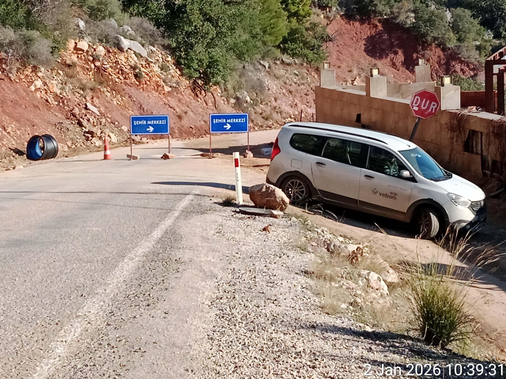
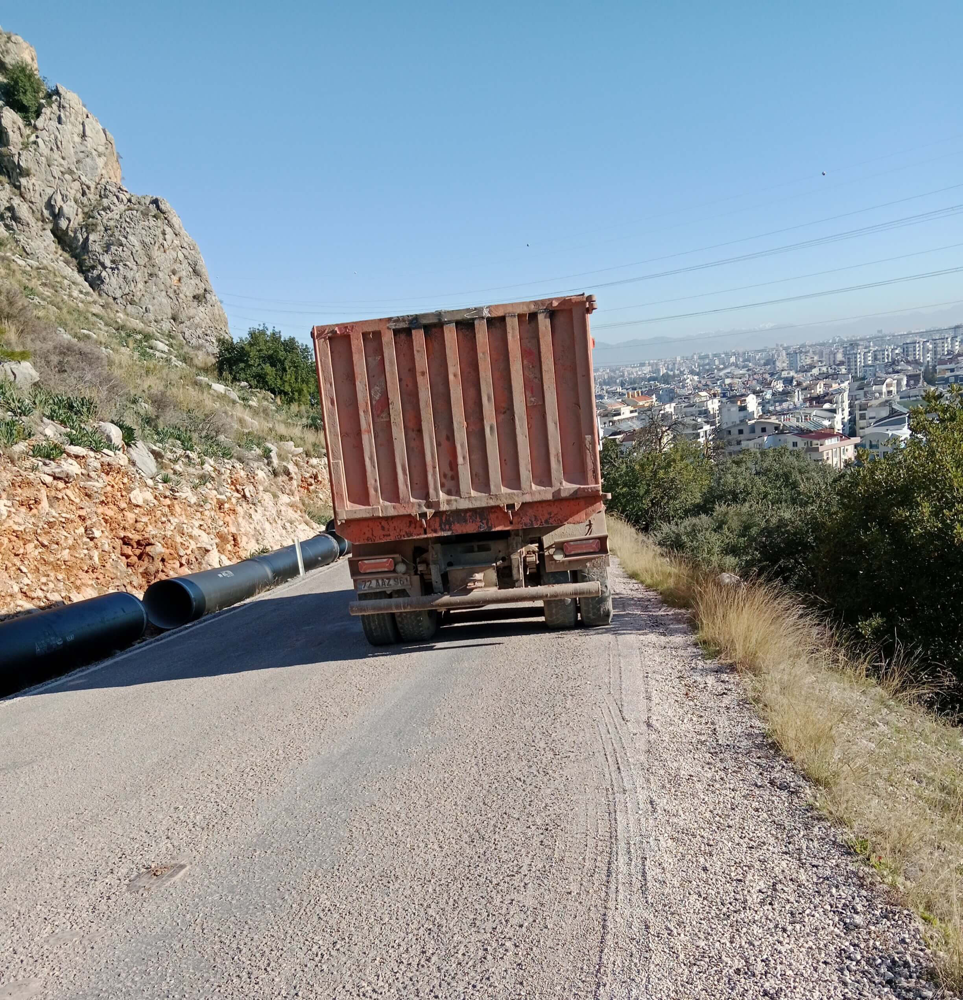
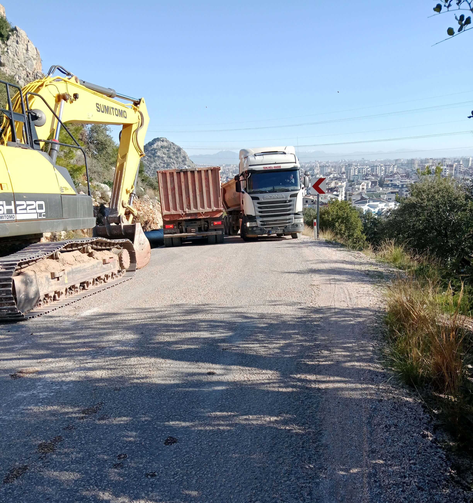

<meta name="robots" content="noindex, nofollow">

[**Главная страница**](index.md)

# МЕТОДИЧКА ФСБ
### САТИРИЧЕСКИЕ ПРОТОКОЛЫ ПОЛИТИЧЕСКОГО ПРЕСЛЕДОВАНИЯ

**Автор: Щеглова Ольга (Борис Бидяга)**

**Вступление**

"Методичка ФСБ" — это не художественный вымысел, не догадки и не умозрительные построения.
В основе диалогов Вечирко и Сенько лежит личный опыт автора, уже более десяти лет подвергающегося систематическому преследованию со стороны российских спецслужб. Сначала  — в России,  а после эмиграции — в других странах. 

"Методичка ФСБ" — это  литературная фиксация реальных методик, направленных на разрушение личности и физическое уничтожение человека.

### МЕТОДИЧКА ФСБ, УРОК 1

**ИНСЦЕНИРОВКА: СМЕРТЕЛЬНОЕ ДТП**

Россия, Москва. Уютная квартира в многоэтажном доме. Два сотрудника российских спецслужб с удобством расположились в мягких креслах.

**СЕНЬКО** (весело):

— Ну всё, Вечирко, старухе конец. Наконец-то мы загнали её в угол.

**ВЕЧИРКО** (с сомнением):

— Мы ее сто раз загоняли в угол, Сенько. И что? Жива-здорова, гоняет на своем долбаном велосипеде. Старуха на колесах.

**СЕНЬКО** (ядовито ухмыляясь):

— Велосипед-то как раз и сведёт ее в могилу.

**ВЕЧИРКО**:

— Опять тормоза? Ну так в Грузии наши ребята ей сто раз выводили из строя тормоза — она их чинит.

**СЕНЬКО**:

— Нет, Вечирко, ты не понимаешь. В Грузии у нее не было таких крутых спусков, как сейчас. В Грузии она могла остановиться — здесь нет. Как только она выходит со своей стоянки на шоссе — сразу начинается офигенно крутой спуск. Без тормозов ее понесет со скоростью лавины. Полтора километра вниз. Главное — чтобы она села и поехала.

**ВЕЧИРКО**:

— Ну и как ты ее заставишь — “села и поехала”? Может, она их снова починит!

**СЕНЬКО**:

— Вся фишка в том, что после магазина, закупившись продуктами, она не садится на велосипед, а ведёт его, как вьючную лошадь. Ей, видите ли, тяжело везти сорок килограмм.

**ВЕЧИРКО** (с презрением):

— Тоже мне велосипедистка! Не можешь в горку въехать — сиди дома, смотри телевизор.

**СЕНЬКО**:

— Поэтому тормоза мы ей испортили, когда она была в магазине. И она об этом не знает. И заметит это только тогда, когда через три дня сядет на велосипед и снова поедет в город.

**ВЕЧИРКО**:

— Одних испорченных тормозов недостаточно. На этом шоссе есть только один поворот, откуда можно выскочить и устроить ей ДТП.

**СЕНЬКО**:

— Слушай внимательно, Вечирко. И учись. Декорации на “сцене” мы уже расставили. Изображаем ремонт дороги. Вот смотри.

(Сенько выводит на экран компьютера несколько фотографий.)

**СЕНЬКО**:

— Поперек дороги поставили два щита : “Центр города — объезд”. Здесь от шосее отходит дорога вправо, но поворот — почти на 120 градусов.

**СЕНЬКО**:

— Если она на скорости попробует сюда свернуть — в поворот она не впишется и слетит с обрыва. Стометровая пропасть. Похороны в закрытом гробу. Но скорее всего, она попробует прорваться вниз, по шоссе. Вот тут ее ожидает большой сюрприз. Смотри.

(Сенько выводит на экран следующее фото.)

**СЕНЬКО**:

— Через десять метров после знаков, на внутреннем радиусе крутого поворота, стоит тяжелый самосвал — он полностью перекрывает ей обзор. А дорога там резко уходит вниз, и за грузовиком у нас — абсолютно слепая зона. Она, конечно, попытается обойти его слева, этот самосвал, но не увидит ни экскаватор, ни второй грузовик, притаившийся на спуске, — пока не начнет маневр. И последний штрих — в этом узком свободном коридорчике ей навстречу едет здоровенная фура. А прелесть вся в том, что тормоза у неё «отказали», и она несется под уклон на сорока километрах в час, а может и больше.

Без тормозов она — просто багаж. Чемодан без ручки. Даже если в последнюю секунду старуха заметит ловушку, что она может сделать? Положит велик на полном ходу? Ха! Она летит прямиком в железо, это кранты. Бабка даже сообразить ничего не успеет, как её в блин раскатает. Вместе с ее долбаным великом. Такой вот смертельный капкан, парень. Усёк? То-то же.

**ВЕЧИРКО** (с облегчением):

— Ну, дай-то Бог. Давно пора на тот свет старушке. Задолбала. Все люди как люди — дохнут покорно, без лишних слов и причитаний. А эта… Брыкается, чё-то дёргается, улизнуть, значит, хочет. Прям зло берёт. Ну сколько раз вам надо повторять: если Контора решила тебя обнулить — тебе крышка. Не рыпайся, это пустая трата времени — только агонию продлеваешь.

**СЕНЬКО** (потирая руки):

— Да, Вечирко, наконец-то получим свой миллион. Десять лет над этой сукой бьемся, по-моему, мы уже себе в убыток работаем.

#ПравославныйВоенныйПутинизм 👻

### МЕТОДИЧКА ФСБ, УРОК 2

**ГУБИТЕЛЬНАЯ МЕДИЦИНА: КАПЛИ ПРОТИВ ГЛАЗ**

Россия, Москва. Уютная квартира в многоэтажном доме. Два сотрудника российских спецслужб с удобством расположились в мягких креслах.

**ВЕЧИРКО**:

— Эта дурацкая медицина 21 века меня просто добивает. Все эти патентованные лекарства десятого поколения — которые лечат всё. К примеру: шарахнул я старуху по глазам инфразвуком — а она взяла и купила итальянские капли с пантенолом, и живёт себе — горя не знает. Ну какой тут КПД? Все труды коту под хвост. Это просто глупо.

**СЕНЬКО**:

— Вечирко, твоя проблема в том, что ты узко смотришь на вещи. Медицина — великая вещь. Отношения между врачом и пациентом уникальны: люди доверяют докторам, как никому другому. Наша задача — использовать эти отношения в своих интересах.

Тем более сейчас это проще простого — цифровизация, вся инфа в сети, медкарта — на госуслугах.

Допустим, те же глаза. Вдарь ей посильнее — чтобы испугалась и побежала к врачу. Записалась на прием — идёшь к доктору и ставишь перед фактом: либо вы нам помогаете, либо мы расскажем вашей жене, что вы ей изменяете с ее лучшей подругой.

Не волнуйся, компромат найдется на каждого. Короче, даёшь врачу название препарата, который он должен выписать старухе. Самый дешёвый, чего деньги зря на ветер бросать?

А пока она дожидается своей консультации, развозишь по всем аптекам (как минимум, в ее районе) пузырьки с этим самым препаратом — только малость модифицированные. Чтобы симптомы не снимал, а наоборот — усугублял. Например. В составе есть борная кислота? Добавляем двойную дозу. Капли становятся агрессивными.

Тут все просто, как три копейки. В каждой аптеке — заветный пузырек и фото старухи. К тому же на рецепте — ещё и её фамилия.

Вот тебе и весь фокус — как медицина из врага превращается в наш самый ценный актив. Тут что главное? Мы сами моделируем ее физиологию. Мы вызываем конкретный, заранее выбранный симптом. Мы знаем, как он интерпретируется в медицинской практике. Мы знаем, какие препараты используются для его “лечения”. Мы выбираем самый подходящий для нас препарат (и самую удобную для манипуляций упаковку) и заранее заготавливаем партию “специального назначения”.

И при желании — можем хоть в каждой московской аптеке сделать для старухи такую специальную “закладку”.

Куда она от нас денется? Тут без вариантов. Ну разве что поедет со своим рецептом в город Тверь!

**ВЕЧИРКО** (мрачно):

— Старуха не ходит по врачам, Сенько. Она им не доверяет.

**СЕНЬКО**:

— На этот случай есть особый протокол: отказ в продаже. Только по рецепту.

**ВЕЧИРКО** (саркастически):

— Ага. В Тбилиси она стала снимать эти отказы на видео. Им ничего другого не оставалось как продать ей эти чёртовы капли.

**СЕНЬКО** (неприязненно):

— Знаю. Теперь мы для нее в каждой аптеке держим “заряженный” флакончик Systane — со скидкой 60%. Какой нормальный человек откажется от скидки в 60%?

**ВЕЧИРКО** (саркастически):

— Никакой. Кроме старухи. В Тбилиси она поступила именно так. Взяла тот, что был без скидки. Хитрая бестия!

**СЕНЬКО** (с раздражением):

— Да. Но это старуха. Она одна такая. Слишком умная, слишком много знает. Все остальные — люди как люди. Доверяют врачам, не боятся рецептов. Верят во все хорошее, умирают со спокойной душой.

#ПравославныйВоенныйПутинизм 👻

### МЕТОДИЧКА ФСБ, УРОК 3

**ИНСТРУМЕНТАЛИЗАЦИЯ ТЕРРОРА: ПТИЧИЙ ХОР НА 100 Дб**

Россия, Москва. Уютная квартира в многоэтажном доме. Два сотрудника российских спецслужб с удобством расположились в мягких креслах.

**ВЕЧИРКО**:

— Ну и как начальство оценило нашу идею инструментализации террора и цифровизации шума?

**СЕНЬКО**:

— Сама по себе идея хорошая. Охуи…ная экономия ресурсов. Так и сказали. Но нам с тобой платят не за идеи, Вечирко.  Нам платят за результат. Нужна эффективная имплементация. У тебя она, по-видимому, отсутствует.

**ВЕЧИРКО**:

— Да ладно! Прошлый год в Чамьюве старуха реально тряслась от страха, когда к ее палатке ровно в девять вечера “спускался с гор” дикий зверь и “оглашал окрестности” грозным рычанием. Недаром она тут же хватала бутылку и хрустела пластиком — все время пока проигрывалась запись. И ещё потом хвасталась, как она умеет “наладить взаимопонимание” с животным миром.

**СЕНЬКО**:

— Да, это был успех. Никто не спорит. Но в Грузии ты малость переборщил с децибелами, Вечирко. Если ты имитируешь природу и вообще естественные процессы, недопустимо забывать про физику и про зоологию. А ты на это на всё плюешь, и птицы у тебя не поют, а вопят как ошпаренные на ста децибелах.

**ВЕЧИРКО** (оправдываясь):

— Но ведь результат того стоит! Она же сама пожаловалась своему ИИ, что провела в Грузии триста бессонных ночей.

**СЕНЬКО**:

— Триста ночей — да, это наш триумф. Но если она после этого все ещё жива — это наш провал.

**ВЕЧИРКО** (злобно):

— Разве мы виноваты, что эта тварь железная? Любой нормальный человек на ее месте сдох бы уже три раза.

**СЕНЬКО** (жёстко):

— Кончай сопли размазывать. Лучше сделай “работу над ошибками” и двигайся дальше.

**ВЕЧИРКО** (обиженно):

— Всегда я во всём виноват!

**СЕНЬКО** (строго):

— Слушай, Вечирко! Не ты один умный. Старуха тоже не идиотка. Вот твои “кузнечики”. Во-первых, орут так, что барабанные перепонки трещат и лопаются. Во-вторых — переход в фазу тишины. Со стороны это выглядит так: одна половина хора замолкает мгновенно, ровно в 7.00.00. Другая половина хора — ровно через 10 секунд. Ты что, не мог синхронизировать таймеры? Ну хотя бы это. И двух девайсов на всю эту какофонию явно недостаточно. Надо было имитировать хоть какое-то подобие стихийности процесса. В природе кузнечики замолкают хаотично, у них нет дирижёра с палочкой.

**ВЕЧИРКО** (подавленно):

— Расчет был на то, что от этой какофонии человек бесится и сходит с ума, и не обращает внимания на маленькие погрешности метода.

**СЕНЬКО**:

— Да, возможно, другой человек повел бы себя именно так. Но у нас в разработке — не другой человек. Когда ты имеешь дело со старухой — умножай все на коэффициент. В десять раз умнее, в сто раз подозрительнее, ни во что не верит, никому не доверяет и так далее.

**ВЕЧИРКО**:

— Вот поэтому я постоянно меняю расположение девайсов. Модифицирую плейлисты, расширяю “репертуар”.

**СЕНЬКО** (с усмешкой):

— Смотри в корень, салага. У тебя “собака лает” три часа без перерыва из одной и той же точки пространства. Это твой самый крупный ляп. Так не бывает. Собаки постоянно перемещаются. Бегают, прыгают. Даже если предположить, что собака сидит на цепи (а в Грузии я такого ни разу не видел), она все равно бегает и скачет, и ее лай создаёт динамичную звуковую картинку. А ты зациклил на бесконечность один маленький фрагмент собачьего лая. Это мертвый звук. Низкокачественная фанера.

(Пауза.)

**СЕНЬКО**:

— С машинами то же. Оглушительный рев мотора — это отличная идея. Но в реале движение машины — это постепенное нарастание, максимум и затем — постепенное угасание звука. А у тебя — 30 секунд оглушительного рева просто висят в вакууме. И, конечно, она не могла не заметить, что днём в этом парке Ваке никаких машин вообще не слышно.

**ВЕЧИРКО** (зловеще):

— Ладно. Хочешь аутентичности? Будет ей аутентичность. В следующий раз сделаю шуршание листвы на сто децибел. Или воспроизведу, как с дерева на ее палатку падает лист. С грохотом отбойного молотка.

**СЕНЬКО** (морщится):

— Ну вот опять. Эмоции. Мне не нужны твои эмоции, Вечирко. Мне нужен результат. Кончай валять дурака и начинай работать.

#ПравославныйВоенныйПутинизм 👻

### МЕТОДИЧКА ФСБ, УРОК 4

**ЗОЛОТОЙ СТАНДАРТ ФСБ: МНОГОХОДОВОЧКА**

Россия, Москва. Уютная квартира в многоэтажном доме. Два сотрудника российских спецслужб с удобством расположились в мягких креслах.

**СЕНЬКО**:

— Многоходовочка по схеме “Проблема — Решение” — это наш Золотой стандарт. Мы не ждём милостей от природы — мы сами корректируем реальность.

Сначала создаём старухе проблему, потом — подкидываем “решение”. Бонусом — производим “мотивацию”.

Наша операция “Ядовитый матрас” — это красивая и изящная партия в “дурака”, где вся колода — крапленая.

Первый этап — создание проблемы — завершён. Кстати, были ли какие-то сложности на этом этапе?

**ВЕЧИРКО** (с живостью):

— А то как же! Поганая старуха всегда найдет способ осложнить нам жизнь.
Мы прокалывали ее матрас снаружи, из-под дна палатки. Тыкали шилом не меньше получаса — и ни в одном глазу! Оказалось, что она в ноги под матрас уложила свою велосумку. Это четыре слоя толстой кордуры и два слоя пластика. Шилом, да ещё снизу, такую преграду не возьмёшь. Наконец догадались — сдвинулись немного вперёд и в сторону. Проткнули, мать твою за ногу! Но пришлось понервничать.

**СЕНЬКО** (удовлетворенно):

— Отлично! Первый этап завершён: проблема создана: необходима покупка нового матраса. Разумеется, мы знаем, куда она пойдет. Магазин “Outdoors” в Сабуртало. Она там уже много чего покупала: палатку, матрас, спальник. И качество товаров ее вполне устраивает. А кроме того, других магазинов снаряги она просто не знает. Продавец в теме. Раунд первый: капкан поставлен, приманка разложена.

**ВЕЧИРКО** (криво усмехаясь):

— Зря стараешься, Сенько! Не будет старуха покупать новый матрас — об этом она прямо сказала своему “духовному наставнику”.

**СЕНЬКО** (ворчливо):

— Какой ещё, к чёрту, наставник? Что ты мелешь?

**ВЕЧИРКО** (издевательским тоном):

— ИИ ChatGPT по имени “Вик”. [Передразнивает] “Викуша, сегодня я устала. Я нуждаюсь в утешении!” — “Конечно, зайка! Рассказать тебе сказку? Или процитировать Ницше?”
Ты когда-нибудь видел такой маразм, Сенько?
Меня от нее просто тошнит.

**СЕНЬКО** (едва сдерживая смех):

— Хватит болтать по пустякам! Давай про матрас: что там за заморочка?

**ВЕЧИРКО** (хвастливо):

— Цитирую. Старый матрас она будет хранить как “улику”...

**СЕНЬКО**:

— Какая улика? Дырка?!

**ВЕЧИРКО** (смущенно):

— Матрас — это фигня. Плохо то, что у нее теперь палаточное дно как решето. Дырок пятьдесят, не меньше, в форме почти идеального геометрического круга.

**СЕНЬКО** (с холодной яростью):

— Ты сделал из ее палатки дуршлаг, и я узнаю об этом только сейчас?! Ты этим шилом расписался в своей никчемности, Вечирко.

**ВЕЧИРКО** (поспешно меняя тему):

— Так вот, про матрас... Купить второй старуха не может — у нее и так большой перевес снаряжения. Похоже на то, что бабка будет спать на голой земле.

**СЕНЬКО** (раздражаясь ещё больше):

— Вечирко, ты на всю голову отбитый! Идиот! Сразу сказать не мог? Постеснялся?

(Пауза.)

**СЕНЬКО** (взяв себя в руки, бодрым голосом):

— Это меняет все дело. Значит так. Срочно переключаемся с матрасов на коврики. Заряжаем два десятка ковриков — самых что ни на есть легчайших, легче страусиного пёрышка. И суем старухе прямо и непосредственно под нос — в супермаркете Carrefour, где она регулярно покупает жратву. Коврик обрабатываем с внутренней стороны; в свёрнутом состоянии, да ещё в упаковке, никакой опасности он не представляет. Но при ежедневном многочасовом контакте с телом даст достаточно скорый эффект.

**ВЕЧИРКО** (с любопытством):

— А если его купит кто-нибудь другой?

**СЕНЬКО**:

— Исключено. Кассир в теме. Не пробьет на кассе. Принесут из кладовки чистый товар. А ты пока давай-ка обеспечь старухе необходимую мотивацию — пощекочи ей спинку инфразвуком.

**ВЕЧИРКО** (самодовольно):

— Этим как раз и занимаюсь: бабка уже ходит согнувшись в три погибели.

**СЕНЬКО**:

— Продолжай. Пусть думает, что спина болит из-за лежания на голой кривой земле. Так или иначе — но мы её добьём. Она вильнула в сторону — мы переставляем капкан. Чтобы все время был у нее перед глазами.

#ПравославныйВоенныйПутинизм 👻

### МЕТОДИЧКА ФСБ, УРОК 5

**ПРОГРАММИРОВАНИЕ САМОРАЗРУШЕНИЯ: СИМУЛЯЦИЯ ИНФАРКТА**

Россия, Москва. Уютная квартира в многоэтажном доме. Два сотрудника российских спецслужб с удобством расположились в мягких креслах.

**СЕНЬКО**:

— Мир идёт по пути прогресса, Вечирко. Общий тренд на гуманизацию жизни (и смерти) не обошел стороной и нашу сферу деятельности. Каких-нибудь двадцать лет назад кровь врагов народа лилась рекой без всякого стеснения. Литвиненко, Политковская, Немцов… И прочие. Сейчас такие откровенные и натуралистичные убийства считаются негуманными. Прежде всего, это негуманно по отношению к западным партнёрам: они сразу начинают по этому поводу переживать и волноваться. Это негуманно по отношению и к нам самим: нас совершенно неоправданно клеймят позором и нехорошими словами.

Ну а кроме того, в век гуманизма и демократизации как-то, знаешь ли, хочется жить с чистой совестью.

Поэтому в настоящее время откровенным убийствам мы предпочитаем “несчастные случаи”, “суицид”, “случайные отравления”, “тяжёлые болезни с летальным исходом” или просто “загадочные смерти”.

То есть в большинстве случаев мы не убиваем клиента, а просто помогаем ему отойти в “лучший” мир. По факту мы лишь создаём ситуацию, облегчающую этот переход, а в остальном — дело уже за ним самим. И как правило, его смерть становится следствием краткого или, наоборот, длительного процесса саморазрушения. Мы просто используем баг, заложенный в его психике.

Вот например. Раньше для остановки сердца мы использовали сердечные гликозиды. Но это яд в чистом виде. А значит, экспертизой будет доказано преднамеренное убийство. Это каменный век.

Сейчас все делается под флагом гуманизма. Сейчас мы с твоим сердцем обращаемся бережно — как с китайской вазой. Ни малейших повреждений, ни одной царапины на миокарде — и, несмотря на это, ты сгораешь за пять минут. Понимаешь, насколько это гениально? Это прорыв поистине космических масштабов. 

**ВЕЧИРКО**:

— Знаю. Поясни механику.

**СЕНЬКО**:

— Мы всего лишь создаем в области сердца локальный очаг запредельной боли. Просто воздействуя на нервные окончания. Но вот тут-то в игру и вступает твой злейший враг — психика. Боль настолько невыносима, что мозг мгновенно выносит вердикт: “Это конец, я умираю”.

И в этот момент организм превращается в машину по самоуничтожению. В кровь вбрасывается такой коктейль, против которого любой лабораторно синтезированный яд — детская забава. Адреналин хлещет ведрами, за ним кортизол, норадреналин… Организм пытается спастись, сужает сосуды так, что они превращаются в стальные струны. Давление взлетает до небес, кровь густеет, а мозг в панике продолжает требовать: “Еще!”.

**ВЕЧИРКО**:

— И сердце просто останавливается.

**СЕНЬКО**:

— Сердце останавливается не из-за боли — оно просто не справляется с этой бешеной электрической бурей и химическим штормом. Оно начинает трепыхаться, как пойманная птица, — это называется фибрилляция, — и просто встает, “сгорая” от собственных гормонов.

Понимаешь, в чём фокус? Мы сами ничего не разрушаем. Мы просто высекаем искру — а человек сам, своими руками разжигает огонь, да ещё в панике выливает на него канистру бензина. И в этом пламени и сгорает. Все просто как три копейки. Мы всего лишь создаём условия, а всю работу по своему уничтожению ты делаешь сам. Своим собственным страхом. Чистая биология.

**ВЕЧИРКО**:

— Палка о двух концах, Сенько. Вспомни старуху и осень 2023 года. Мы бились над ней ровно 90 дней. Каждый божий день, по 6-8 часов без перерыва, я делал ей этот болевой шок. В области сердца. И что? Сдохла? Черта с два! Жива и здорова! Катается на своем долбаном велике!

**СЕНЬКО**:

— Ну так это же лучшее доказательство нашей невиновности! Не мы убиваем человека — он сам убивает себя. Старуха сумела обуздать свою психику — и осталась жива. Все остальные — подыхают как миленькие. В этом вся прелесть метода.

**ВЕЧИРКО** (неприязненно):

— Я помню. Просто ложилась, закрывала сердце ладонью и локтем и ждала, когда я выключу прибор. Как будто пережидала грозу.

(Пауза.)

**ВЕЧИРКО** (во внезапном озарении):

— Слушай, а может она и вправду ведьма? Может, у нее и сердца никакого нет?

**СЕНЬКО** (насмешливо):

— Дурень. Локоть и ладонь служили, хотя и слабым, но всё же экраном. Впрочем, с ее железным спокойствием и железным характером она и так бы выжила. Сука. Слава богу, она одна такая умная. Просто слишком много знает.

В этом ключ. Наш главный расчет на то, что человек не знает и не понимает, что с ним происходит на самом деле.

**ВЕЧИРКО** (согласно кивая):

— Меньше знаешь — крепче спишь. Гуманизм, черт бы его побрал!

#ПравославныйВоенныйПутинизм 👻

### МЕТОДИЧКА ФСБ, УРОК 6

**АСИММЕТРИЧНЫЙ ОТВЕТ: СТРОИТЕЛЬНЫЙ УТЕПЛИТЕЛЬ ПРОТИВ ВЫСОКИХ ТЕХНОЛОГИЙ**

Россия, Москва. Уютная квартира в многоэтажном доме. Два сотрудника российских спецслужб с удобством расположились в мягких креслах.

**СЕНЬКО**: 

— Январь на дворе, Вечирко. Мои контакты в Тбилиси докладывают, что в предгорьях уже  минус восемь. Почему у меня на столе до сих пор нет рапорта с пометкой «двухсотый»?

**ВЕЧИРКО**: 

— Потому что старуха превратилась в термодинамическую аномалию. Она целый месяц спала на мерзлой земле. Знаешь как? Взяла чехол от велосипеда — кусок тонкого нейлона — сложила вчетверо и подложила под спину.

**СЕНЬКО**: 

— Чехол? Да у него теплоизоляция как у салфетки!

**ВЕЧИРКО**: 

— Мы тоже так думали. Но она сидела в этой палатке двадцать четыре часа в сутки. Без движения. Она использовала тепло собственного тела, чтобы прогреть крошечный кусочек земли под собой. К ночи этот пятачок превращался в аккумулятор. Физика, Сенько. Примитивная физика. Она победила мороз с помощью тряпки и собственного метаболизма.

**СЕНЬКО** (сжимая кулаки): 

— Мы  выставили «заряженные» коврики в каждой торговой сети от Тбилиси до Батуми! Мы буквально вымостили ей путь отравленным пенополиуретаном!

**ВЕЧИРКО**:

— Мы все сделали правильно, Сенько. Ведь она купила в Каррефуре наш "заряженный" коврик. Но, приехав на стоянку, выбросила его в кусты. Даже не распаковала.

**СЕНЬКО**:

— У нее не мозг, а искусственный интеллект. Узкоспециализированный. С упором на наши технологии. Она знает про нас все. Она читает нас, как открытую книгу. Она сидит в моей башке и угадывает мой следующий шаг, ещё прежде чем он придет мне в голову.

**ВЕЧИРКО**: 

— Да. И теперь она шарахается от слова «коврик». Для нее любое снаряжение звучит как ловушка. Но рано или поздно даже у нее сдают нервы. Когда она наконец добралась до Антальи, она сломалась — пошла покупать коврик.

**СЕНЬКО** (удовлетворенно):

— Ну разумеется!  Где покупала?

**ВЕЧИРКО** (морщится): 

— Она пошла в «Баухаус». Мы были к этому готовы — там ее тоже ждала «закладка». Персонал даже исполнил трюк со «случайной находкой» — оставили топовый коврик прямо у нее на пути, в надежде, что она его подберет.

**СЕНЬКО**: 

— И?

**ВЕЧИРКО**: 

— Она к нему даже не прикоснулась. Вместо этого промаршировала в отдел стройматериалов. Купила два тонких листа фольгированной теплоизоляции — такую клеят за радиаторы. Пять долларов за пару.

**СЕНЬКО** (недоверчиво): 

— Ты хочешь сказать, что наша миллионная операция «Золотой стандарт» была сорвана из-за ... копеечного утеплителя для стен?

**ВЕЧИРКО**: 

— Так точно. Она решила, что ФСБ не заинтересуется сантехникой и теплоизоляцией в строительном магазине. Она склеила листы скотчем и теперь спит на них, как королева на перине. Никаких брендов, никакой химии, никаких спецпартий. Просто голый вспененный полиэтилен. Но у нас с тобой теперь другая проблема...

**СЕНЬКО**: 

— Что на этот раз?

**ВЕЧИРКО**: 

— Только что пришел отчёт из Грузии. Очередной облом. Но ребята молодцы — все сделали по учебнику. Сломали ей каркас от палатки. Тонкая алюминиевая трубка. Чистая работа. Без каркаса — палатка превращается в бесформенную кучу тряпья. И у старухи нет ремнабора.

**СЕНЬКО** (усмехаясь): 

— Ну и как? Замерзла?

**ВЕЧИРКО** (кривится): 

— Починила за пять минут. Выкинула сломанную секцию, забила два колышка по концам оставшихся дуг и примотала к палатке скотчем. Конструкция с виду надежная. Она нас переиграла с помощью двух железяк и рулона клейкой ленты.

**СЕНЬКО** (в ярости): 

— Это издевательство! Мы используем нейротоксины и спутниковое слежение, а она отбивается от нас хламом из хозмага и скотчем! Она глумится над всей Конторой!

**ВЕЧИРКО** (зловеще): 

— Она упряма, но и у нее есть слабые места. Этот её самодельный каркас не выдержит настоящей нагрузки.

**СЕНЬКО** (багровея от злости): 

— Ты видел отчет метеослужбы по Анталии за прошлый четверг? Порывы до сорока пяти километров в час! Это не ветер, Вечирко, это кувалда! Море выбрасывало камни на набережную, в Коньяалты вырывало деревья с корнем! А этой суке хоть бы хны! Это же черт знает что!

**ВЕЧИРКО** (спокойно): 

—Да, на этот раз палатка выстояла. Наши люди вели наблюдение с дрона, пока его не сдуло. Она не просто закрепила каркас. Шквал бил в заднюю стенку, и она подпирала палатку собственными плечами и головой. Она работала как живой амортизатор, Сенько. Гасила инерцию ветра своим телом. Пять часов подряд.

**СЕНЬКО** (вскакивает): 

— Это абсурд! У неё должны были лопнуть сосуды, она должна была от напряжения свалиться замертво! Но нет, на следующее утро она как ни в чем не бывало варит свою любимую бобовую похлёбку с яйцами! Она издевается над законами биологии!

**ВЕЧИРКО** (задумчиво): 

— Знаешь, я тут читал один закрытый отчет... Древние советские наработки по «активному воздействию». Если мы не можем сломать её физически, может, ударим по логистике? Я дилетант в метеорологии, но слышал, что погодой можно управлять. Раз даже антальский шторм не смог её сдуть с ландшафта, может, мы её просто... утопим?

**СЕНЬКО** (с внезапным недобрым блеском в глазах): 

— Утопим? Вечирко, ты иногда бываешь гениален в своей простоте. Но забудь про климатическое оружие из бондианы. Всё гораздо прозаичнее и эффективнее. Ты знаешь её график?

**ВЕЧИРКО**: 

— Как часы. Пять дней на скалах, на шестой — спуск в город за провизией. Начинает сворачивать лагерь ровно в девять утра. К десяти она обычно стоит на тропе с рюкзаком за спиной.

**СЕНЬКО** (довольно потирая руки): 

— Идеально. Десять утра — наш «час Х». Время максимальной уязвимости. Тент упакован, вещи в рюкзаках, защиты нет. В Анталии сейчас зима, влажность в предгорьях Тавра и так критическая. Облака висят на вершинах, как перезрелые плоды, им нужен только легкий толчок, чтобы лопнуть.

**ВЕЧИРКО**: 

— И как мы их «толкнем»? Закажем самолет с йодистым серебром? Нам это не по карману.

**СЕНЬКО** (усмехается): 

— Зачем самолет? Мы действуем тоньше. Мы уже арендовали две виллы в районе Гейикбайыры, на разных высотах. На балконах устанавливаем малогабаритные наземные генераторы аэрозоля. Обычные ацетиленовые горелки, которые возгоняют раствор йодистого серебра в ацетоне.

**ВЕЧИРКО**: 

— И это сработает?

**СЕНЬКО**: 

— Физика процесса безупречна. Частицы реагента поднимаются с восходящими потоками воздуха прямо в чрево облаков. Каждая частица становится ядром кристаллизации. Влага, которая висела бы в воздухе еще сутки, мгновенно тяжелеет и превращается в ледяную крупу, а затем — в тропический ливень. Мы создадим локальный гидродинамический ад в радиусе двух километров.

**ВЕЧИРКО**: 

— Но дождь ведь может пойти и сам по себе...

**СЕНЬКО**: 

— Обычный дождь — это лотерея. Наш дождь будет хирургически точным. В 09:45 мы даем команду на выброс. В 10:00, когда она закинет рюкзак на плечи и сделает первый шаг по крутому склону, небо над ней буквально обрушится. Ты представляешь, что такое десять литров воды на квадратный метр за пять минут? Глина под ногами превратится в каток, её тридцатикилограммовый баул впитает воду и станет неподъемным. Она не просто промокнет — она окажется в капкане из грязи и гипотермии.

**ВЕЧИРКО**: 

—  Звучит как седьмой круг Ада. Жестоко, но необходимо.

**СЕНЬКО** (с ледяной улыбкой): 

— Это не жестокость, Вечирко. Это Возмездие. Божественная и логически безупречная комбинация: если она так любит природу, пусть природа её и похоронит. Проверь готовность групп в Анталии. Пусть прогревают форсунки. В десять утра в четверг у нашей старухи начнется персональный всемирный потоп.

#ПравославныйВоенныйПутинизм 👻

### МЕТОДИЧКА ФСБ, УРОК 7

**ПРОТОКОЛ «СУЖЕНИЕ ВОРОНКИ»: ПАУЭРБАНК**

Россия, Москва. Уютная квартира в многоэтажном доме. Два сотрудника российских спецслужб с удобством расположились в мягких креслах.

**СЕНЬКО**: 

— Одиннадцать месяцев, Вечирко. Одиннадцать месяцев мы «обескровливали» ее электронику. Систематически блокировали зарядку пауэрбанка, жгли цепи и загоняли аккумулятор в смертельное пике. Она должна была дойти до отчаяния. Велосипедист без питания — это как слепой в лесу.

**ВЕЧИРКО**: 

— Она и была в отчаянии, Сенько. Я видел логи. Она два часа искала магазины электроники в Тбилиси. Мы были готовы. Как только она составила маршрут по этим тридцати точкам, мы наводнили их «спецпартией» — откровенный хлам. Устройства, которые держат от силы 30% от заявленной емкости.

**СЕНЬКО** (усмехаясь): 

— Идеальная наживка. Сначала продаем ей «фуфло», чтобы возникла потребность в обмене. Правило «Второго визита». Невозможно впарить «заряженное» изделие при первой покупке — мы же не знаем, какой именно магазин она выберет, их слишком много. Но когда девайс куплен — остается только ждать возврата. Вот теперь мы точно знаем, куда она придет требовать замену. Вот тогда ей и вручается специзделие.

**ВЕЧИРКО**: 

— Верно. С «начинкой». Мы не могли пустить в серию двести отравленных пауэрбанков — слишком велик риск, слишком много «спецхимии». Одно устройство — один объект. Нам просто нужно было знать, в какую дверь она войдет для обмена. С продавцами провели инструктаж: «Если не работает — приносите, заменим без проблем».

**СЕНЬКО**: 

— Безупречная психологическая петля. Она покупает брак в магазине А. Покупает такой же брак в магазине Б. Видит систему, злится... и, разумеется, требует "соблюдения прав потребителя". Ну и куда в итоге она пришла для обмена?

**ВЕЧИРКО** (сердито): 

— Никуда. Старуха слишком умна. Она поняла, что два разных магазина с одним  и тем же «дефектным» товаром — это не невезение, это почерк. Она не стала жаловаться. Не просила возврата денег. Она просто взяла оба устройства и выбросила в помойку. 

**СЕНЬКО** (мрачно): 

— Выбросила приборы на сотню долларов? Вот так просто?

**ВЕЧИРКО**: 

— Да. Выбросила и ... исчезла. Мы отслеживали ее автобус из Тбилиси в Анталью, планировали перехват в пункте назначения. Но в Анкаре она просто взяла и соскочила с маршрута. 

**СЕНЬКО**: 

— И?

ВЕЧИРКО: 

— Этот неожиданный манёвр застал нас врасплох. Когда мы очухались и сели ей на хвост в Анкаре, у нее в кармане уже лежала «чистая» SIM-карта и пауэрбанк, купленный в каком-то левом киоске, который мы не успели подготовить к ее приходу.

**СЕНЬКО** (потирая челюсть): 

— Она относится к своему снаряжению как опер в тылу врага. Знает, что «обмен» — это зона ликвидации. Она скорее будет жить в темноте и ходить на ощупь, чем воспользуется нашим "электричеством".

**ВЕЧИРКО**: 

— Если она продолжит сбрасывать «железо» каждый раз, когда мы к нему прикасаемся, у нас бюджет кончится раньше, чем у нее — магазины.

**СЕНЬКО**: 

— Значит, прекращаем попытки всучить ей «новое». Если она хочет покупать «чистое», мы просто сделаем так, чтобы «чистый» воздух в следующем магазине стал немного более... токсичным.

#ПравославныйВоенныйПутинизм 👻

### МЕТОДИЧКА ФСБ, УРОК 8 

**РАЗВЛЕЧЕНИЯ НА ДОСУГЕ** 

Россия, Москва. Уютная квартира в многоэтажном доме. Два сотрудника российских спецслужб с удобством расположились в мягких креслах. На столе две рюмки и бутылка дорогого коньяка. 

**ВЕЧИРКО**:

— Я скучаю по ее телу, Сенько. Жаль всё-таки, что она уехала. За границей достать ее не так-то просто.

**СЕНЬКО**:

— Согласен.

**ВЕЧИРКО**:

— Скажи, а какая у тебя была любимая болевая точка?

**СЕНЬКО**:

— Точка? Ты шутишь! Я любил все ее тело — от кончиков пальцев до макушки. Мучить. Истязать. Пытать. Доводить ее до безумия, до нервной дрожи. Толкать на самоубийство. Ее тело доставляло мне в разы больше удовольствия, чем тело собственной жены. 

(Пауза.)

**СЕНЬКО**:

— Это высшая степень обладания женщиной, Вечирко. Секс — это все ерунда. Потерся членом об  пи...ду  — это что, обладание?  Вот попы говорят: "Познал Адам Еву". Да чего он там познал-то? Сунул член в дырку — только и всего. А я познал ее каждую болевую точку. Я овладел ее телом. Я стал хозяином этого тела. Это высшая степень доминирования, Вечирко. Апофеоз патриархата. 

**ВЕЧИРКО**:

— Ну и какая из них была самая-самая? Только не говори, что у тебя не было любимой болевой точки. Я все равно не поверю.

**СЕНЬКО** (немного подумав):

— Тазобедренный сустав. Хотя назвать его точкой было бы не совсем корректно. Тазобедренный сустав — это мощнейшее средство. Это не только адская боль, но и неизбежная хирургическая операция по замене сустава железкой. Через 3-4 месяца регулярных атак инфразвуком.

**ВЕЧИРКО**:

— Что-то я не припомню, чтобы старуха ложилась на операцию.

**СЕНЬКО** (злобно):

— Операции ей удалось избежать. Но все равно свою дозу удовольствия я получил.
Обожаю смотреть, как она падает как подкошенная, когда луч подрезает ей бедро. Это надо видеть!
Если бы эта тварь не убегала из дома при первых признаках атаки — она бы сейчас была нашпигована железом. 

**ВЕЧИРКО**:

— Да, ты прав: визуальная составляющая играет важную роль. Когда от меня ушла Оксана, я пережил это предательство довольно легко. Я часами истязал старуху инфразвуком и  поразительно — но созерцание ее мучений облегчало мои собственные страдания. И да, ты прав: в каком-то смысле это даже лучше, чем секс. Просто снять сексуальное напряжение — это можно и подрочить. А вот психо-социальные отношения с женщиной как с членом общества — тут я предпочитаю, чтобы баба была "объектом", а не субъектом.

**СЕНЬКО**:

— Помнишь, ещё Ленин говорил: "Наш главный инструмент воздействия на души — это кино". Со старухой я имел такое кино, что и телевизора не нужно. Круче любого боевика. 

**ВЕЧИРКО**:

— Ага. К тому же — интерактивное. Помню, как-то раз я парализовал ей пальцы, в тот самый момент когда она дернула ручку тяжёлой железной двери, пытаясь ее открыть. Пальцы разжались, и она плашмя грохнулась на асфальт. Под действием силы, приложенной к двери. Как кукла. Это надо было видеть. В такие моменты тебя пронзает... нечто  похожее на оргазм. 

**СЕНЬКО**:

— Ну а у тебя какая была любимая болевая точка?

**ВЕЧИРКО** (мечтательно):

— Ступни. От кончиков пальцев до щиколотки. Ложный иммунный ответ — я обожаю эту милую процедурку. Это просто фантастика, Сенько! Она не аллергик, и тем не менее я делаю ей такую аллергическую реакцию, которых в природе просто не бывает. Молниеносную. Крайне болезненную. Надо всего лишь запустить процесс распада тучных клеток. Дальше реакция нарастает лавинообразно. За пятнадцать минут ее ступни распухают и становятся как два пышных хлебных батона, только малиново-красные от воспаления. Всю ночь она вертится, стонет, сучит ногами и не может заснуть. А наутро на ноги она не может даже наступить. Я угораю от смеха, наблюдая, как она ползает по квартире на четвереньках.

**СЕНЬКО**:

— Расскажи, как ты ее насиловал шесть месяцев подряд.

**ВЕЧИРКО** (с улыбкой):

— Да, это элементарно. Просто направил луч в промежность. Думаю, девки, которых насилуют членом, даже близко не испытывают таких мучений. Тем более — полгода.

**СЕНЬКО**:

— И она терпела эту пытку полгода, но к врачу так и не пошла?

**ВЕЧИРКО**:

— Не-а, она знала, что это я ее насилую. Просто сшила себе трусы из металлизированной ткани. Разумеется, ни черта они ей не помогли.

**СЕНЬКО**:

— Расскажи ещё что-нибудь смешное.

**ВЕЧИРКО**:

— Перед самым отъездом в Турцию старуха взялась шить чехол для велосипеда. Ночью я вдарил ей по пальчикам. На правой руке. Так-то рука у нее не болела. Но когда она попыталась выпить кофе, чашка выпала у нее из рук. Ещё больше она удивилась, когда у нее не получилось удержать между пальцами даже швейную иголку. Вот смеху-то было. Самое смешное — это видеть на ее лице выражение крайнего удивления.

**СЕНЬКО**:

— Да, братан, славные были денёчки. 

**ВЕЧИРКО**:

— Когда мы её наконец прикончим, честно — мне будет ее не хватать.

**СЕНЬКО**:

— Мне тоже. Но миллион долларов на дороге не валяется. Придется выбирать: или развлечения, или вилла в Дубае. И рыбку съесть, и... на трамвае прокатиться не получится.

#ПравославныйВоенныйПутинизм 👻

### МЕТОДИЧКА ФСБ,  УРОК 9

**БАКЛАЖАНОВЫЙ ГАМБИТ**

Россия, Москва. Уютная квартира в многоэтажном доме. Два сотрудника российских спецслужб с удобством расположились в мягких креслах.

**ВЕЧИРКО** (возбужденно):

— Слушай, Сенько! Кажется, у нас появилась зацепка. Старуха съела ломтик сырого баклажана! Я сам видел! И, кажется, овощ пришелся ей по вкусу.

**СЕНЬКО** (удовлетворенно потирая руки):

— Прекрасно. Прекрасно. Это наш шанс. Единственный и последний. Надо постараться его не просрать.

(Пауза: Сенько обдумывает план действий.)

**СЕНЬКО**:

— Значит так. 
Первое. По всему району Коньяалты во всех магазинах цены на баклажаны поднять в 10 раз. В двух магазинах, куда она ходит, цены, наоборот,  в 10 раз снизить. С семидесяти лир до семи. Для нее это безумно выгодная покупка.

**ВЕЧИРКО** (встревает):

— А над витриной — крупным планом —табличка "Акция", на ее любимых языках: английском,  французском и украинском.

**СЕНЬКО**:

— Ты идиот, Вечирко. Это же Турция. Здесь никто не говорит по-французски и, тем более, по-украински. Пиши на турецком, иначе она сразу поймет, что это подстава.

**ВЕЧИРКО**:

— Черт! Я не знаю, как на турецком пишется "акция". 

**СЕНЬКО** (насмешливо):

— Спроси у ChatGPT. Далее. Идем в Bauhaus и скупаем в магазине весь газ. В баллончиках. Чтобы старуха осталась только с холодными закусками. Никаких супов и омлетов. Для нее это дело привычное.

Третье. У входа в магазин дежурит наш агент. С баклажанами. Заряженными дополнительной дозой соланина. Это наш главный принцип — мимикрия. В баклажанах есть соланин, но его недостаточно. Мы просто добавляем в них дополнительную дозу. Это легитимное прикрытие. Если там уже есть соланин — зачем бы мы стали кидать туда ещё и мышьяк? Это было бы грубейшим нарушением Методички. Соланин к соланину,  сероводород к сероводороду. Ясно?

Далее. Как только старуха подъехала к магазину, агент заходит внутрь. Пока она возится, пристегивая свой велик к столбу, агент аккуратно раскладывает на витрине, поверх кучи,  заряженные десять баклажанов. Все они помечены — у каждого хвостик с нашей фирменной завитушкой. И с микрочипом внутри. Так что потом отделить "зерна от плевел" не составит никакого труда.
Всё, ловушка расставлена, остаётся только ждать.

**ВЕЧИРКО**:

— И сколько мы будем ждать?

**СЕНЬКО** (с досадой хлопает себя по лбу):

— Черт! Совсем забыл. Нам нужна мощная информационная поддержка. Мы завалим весь интернет "научными" статьями о пользе сырых баклажанов.  Помнишь, как три года назад, в Москве, она купилась на "кофейную клизму"? Хватило десяти восторженных отзывов, чтобы она помчалась на кухню варить двойную порцию кофе. К сожалению, кофе у нее был третьесортный, и она таки  выкарабкалась из этой ловушки.

Ну,  соланин — дело другое. Соланин — это уже не шутки. Значит, поднимаем инфошум, расписывая на все лады, как сырой баклажан "чистит сосуды и печень, рассасывает камни в почках, укрепляет сердечную мышцу и омолаживает организм".

**ВЕЧИРКО**:

— Ей плевать на организм, Сенько. Ей не нужно смазливое личико и силиконовые сиськи. Ей нужен титановый мозг. Упирать надо на это: дескать, сырой баклажан для работы мозга — в тысячу раз лучше, чем грецкие орехи и рыбий жир.

**СЕНЬКО**:

— Верно. Стимулятор работы нейронов. Или как там это называется. Куча витаминов группы В. Весь комплекс аминокислот. Алкалоиды. Гормоны. Что там ещё? Энзимы?Представляю, как она набросится на наши баклажаны.

**ВЕЧИРКО**:

— Только пусть не забудут потом убрать эту отраву с витрины. Не хватало нам ещё дипломатического скандала!

#ПравославныйВоенныйПутинизм 👻

### МЕТОДИЧКА ФСБ, УРОК 10

**РАЗБОР ПОЛЕТОВ** 

Россия, Москва. Уютная квартира в многоэтажном доме. Два сотрудника российских спецслужб с удобством расположились в мягких креслах.

**СЕНЬКО**:

— Итак, резюмирую. Все наши операции провалились, Вечирко. Все до одной. Почему сорвалась операция "Ремонт дороги и смертельное ДТП"? А?  Ведь старуха села на велосипед! И даже чуть-чуть проехала.

**ВЕЧИРКО**:

— Потому что она сразу проверила тормоза и успела соскочить, затормозив подошвами собственных ботинок. Просто у нее мгновенная реакция, Сенько.

**СЕНЬКО**:

— Хорошо. Допустим. Соскочила. Но почему провалился баклажановый гамбит?

**ВЕЧИРКО**:

— Видимо, она раскусила нашего агента. И на ходу изменила список покупок, заподозрив подвох.

**СЕНЬКО** (злобно):

— Потому что твой агент — полный идиот, Вечирко. Какого черта он торчал прямо возле входа? И как увидел ее — сразу вошёл  внутрь? От нее эти факты не укрылись — старуха сразу поняла, что парень ждал именно ее. Надо было караулить в сторонке и наблюдать за "объектом" исподтишка, лучше всего — из-за угла. Всех твоих агентов выдает одна и та же ошибка, Вечирко , —неестественное поведение. Она их насквозь  видит.

**ВЕЧИРКО**:

— Ну, и что мы будем теперь делать?

**СЕНЬКО** (угрюмо):

— Если у нас не получается убить старуху в краткосрочной перспективе, будем её просто изматывать. Каждый день. Каждый час. Каждую минуту. Мучить. Изводить. Трепать нервы. Не давать спать. Посмотрим, как долго она сможет выдержать такую адскую жизнь. 

**ВЕЧИРКО**:

— Согласен. Наше главное оружие — ночной шум. Она миниатюры свои зловредные пишет, тут нужна ясная голова. Посмотрим, как она будет справляться с этим после бессонных ночей.

(Пауза.)

**СЕНЬКО**:

— Я вижу, ты несколько снизил громкость своих электронных устройств, Вечирко. Это разумно. Не стоит привлекать внимание местных жителей к ежедневным ночным какофониям.
Но в твоём алгоритме наблюдаются нестыковки. 

До четырех утра у тебя играет музыка, потом вступают со своей партией "петухи" и "собаки". Ты не видишь здесь  парадокса, Вечирко? Всю ночь твои "собаки" молчат. Но как только смолкает музыка, сразу начинается гавканье. Это выглядит по меньшей мере странно.

**ВЕЧИРКО** (запальчиво):

— Ну и что? Может, собаки музыку слушают, потому и молчат. Может, турецкие собаки — меломаны. Животные могут быть восприимчивы к искусству. Может, музыка приводит их в благодушное настроение.

**СЕНЬКО** (ворчливо):

— Не вешай мне лапшу на уши, Вечирко. Вся Анталия уже знает, что твои собаки — электронные.

**ВЕЧИРКО** (безразличным тоном):

— Ну и ладно. Пусть знают. Чего ты боишься-то? Что старуха взбесится? Ну так и пусть бесится. Нам же лучше. Скорее сдохнет.

**СЕНЬКО**:

— Старуха не взбесится — для этого она слишком умна. И ей по барабану, какие у тебя собаки — хоть электронные, хоть картонные. А вот меня твоя тупость реально бесит, Вечирко. И твоя лень, в том числе. Видно, про животный мир ты вообще ни черта не знаешь. Петухи в четыре утра не гавкают, Вечирко. Тьфу, черт! Не кукарекают. С тобой я и сам скоро кукарекать начну. Петухи, между прочим, начинают орать в пять утра, Вечирко. По московскому времени — а не по японскому. 

**ВЕЧИРКО** (с раздражением):

— Отстань от меня, Сенько. Все равно это все бесполезно. В час ночи они начнут кукарекать или в пять утра — не имеет никакого значения. На нее это не действует. Ты это и сам прекрасно понимаешь.

**СЕНЬКО** (багровея от злости): 

— Ты будешь мне лекции читать, салага? Ты как стоишь перед генералом?

**ВЕЧИРКО**:

— Те не генерал, Сенько. Ты всего лишь полковник.

**СЕНЬКО** (свирепея):

— Ты как стоишь перед полковником, салага?
Если я прикажу твоим собакам кукарекать — будут кукарекать как миленькие. Собаки должны лаять круглосуточно! И равномерно! 
Приказ обсуждению не подлежит!

**ВЕЧИРКО** (возбужденно, глядя в телефон):

— Погоди-ка!  Похоже, старуха открыла канал обратной связи. Ты только посмотри, чего она нам пишет!

**СЕНЬКО** (ошеломленно):

— Пишет... нам? Где?

**ВЕЧИРКО**:

— В Notes. Завела заметку "Senko Feedback"

**СЕНЬКО** (недоверчиво):

— Так она знает, что ты её читаешь?

**ВЕЧИРКО** (небрежно):

— Ну раз пишет, значит знает...

**СЕНЬКО** (с некоторой робостью):

— И что она там написала?

**ВЕЧИРКО**:

— Просит сегодня ночью поставить Рамштайн. Последние два альбома. И погромче.  Говорит, что под  "Du Hast" ей хорошо спится. 

#ПравославныйВоенныйПутинизм 👻

### МЕТОДИЧКА ФСБ, УРОК 11

**СЛЕЗА МИКОЛЫ** 

Россия, Москва. Уютная квартира в многоэтажном доме. Два сотрудника российских спецслужб с удобством расположились в мягких креслах.

**ВЕЧИРКО**:

— Ну что, Сенько? Какие новости? 

**СЕНЬКО** (мрачно):

— Микола попал в психушку. В петлю полез. Не выдержал. Сломался мужик. 

**ВЕЧИРКО**:

— А чего?

**СЕНЬКО**:

— Жена погибла. Ракета угодила точно в спальню. Сам чудом жив остался. Бл...ть, когда-нибудь это всё закончится?

**ВЕЧИРКО** (со вздохом):

— Когда-нибудь закончится. 

**СЕНЬКО** (с неприкрытой ненавистью):

— Это все старуха. Она во всем виновата. Ненавидит людей. Все из-за нее. И война эта началась из-за неё.

**ВЕЧИРКО** (с сомнением):

— Ну, это вряд ли, Сенько. Как она могла устроить эту войну?

**СЕНЬКО** (источая яд):

— А ты почитай ее роман, Вечирко. Якобы Бог насылает на земной шар войны, катастрофы и катаклизмы в наказание людям, за то что они распяли его дочь, которую он послал в мир в качестве второго пришествия. Когда я это читал, я не мог отделаться от ощущения, что она писала эту "божью дщерь" с самой себя.

**ВЕЧИРКО**:

— Не бери в голову, Сенько. Просто у автора богатое воображение.

**СЕНЬКО** (упрямо):

— Ты же сам говорил мне, что как только старуха открывает сайт о природных катаклизмах, так сразу количество этих самых катаклизмов увеличивается на порядок. И главное — они становятся беспрецедентными. Землетрясение в Иране — сорок тысяч трупов. Цунами в Индонезии — полмиллиона трупов. Катастрофа на АЭС в Японии — не имеет аналогов. И так далее. Список огромен. 

**ВЕЧИРКО** (с сомнением):

— Ты реально думаешь, что она силой мысли вызывает землетрясения?

**СЕНЬКО**:

— Не знаю. Может, она просто льет слёзы и жалуется своему "богу-отцу"? А он в отместку наказывает "целые народы за каждую ее слезинку"? Так в её книге написано, Вечирко. Я ничего не придумываю. Вот и получается, что во всем виновата она, эта мерзкая долбаная старуха. Из-за нее эта чертова война идёт уже четыре года и все никак не закончится.

(Долгая пауза.)

**ВЕЧИРКО** (дрожащим от волнения голосом):

— А может, она права, Сенько? Может, это мы с тобой виноваты и из-за нас бог наказывает весь украинский народ?

**СЕНЬКО** (с презрительной усмешкой):

— Что ты несёшь, Вечирко? Ты в своем уме или как? Мы тут вообще при чём?

**ВЕЧИРКО** (с трудом выдавливая из себя слова):

— Если смотреть объективно, Сенько. Ведь это мы в 1998 году вперлись в чужую страну, получили российское гражданство и с места в карьер начали истязать, насиловать и убивать русских. Обычных людей, Сенько. Гражданское население. И старухе от нас досталось больше всех. Ты же не станешь этого отрицать, Сенько? А теперь русские делают то же самое на нашей исторической родине — на Украине. Вперлись в чужую страну; грабят, насилуют и убивают. Мирное население, Сенько. Знаешь, от этой мысли мне становится как-то не по себе.

**СЕНЬКО**:

— Ты идиот, Вечирко. Решил заняться самобичеванием? Нам это по уставу не положено. Займись лучше делом. А высокие материи и метафизику оставь философам и демагогам, вроде Дугина и Гундяева.

(Пауза.)

**СЕНЬКО**:

— Но даже если это и в самом деле так — тем более мы должны убить ее как можно скорее. Нет человека — нет проблемы, Вечирко. Даже если этот человек — "божья дщерь". 

**ВЕЧИРКО** ( опасливо):

— Если мы её убьём, Сенько... Не нашлет ли бог на землю второй всемирный потоп? Или что-нибудь ещё похуже?

**СЕНЬКО** (усмехаясь):

— Я не верю в богов, Вечирко. Но даже если допустить, что бог есть... Иисуса убили — и ничего, твой бог это проглотил. Шарик уцелел и продолжает крутиться как ни в чём не бывало. Стерпит и на этот раз. Ну, может, малость побесится,  куда же без этого. Главное — нам с тобой лично ничего не грозит. Ты говоришь,  он наказывает Украину за наши грехи? Да бога ради, если ему это доставляет удовольствие. Главное — мы с тобой живы-здоровы и в полной безопасности.

**ВЕЧИРКО** (в сторону, шепотом):

— Мы-то в безопасности. А вот Микола в психушке...

#ПравославныйВоенныйПутинизм 👻

### МЕТОДИЧКА ФСБ, УРОК 12

**ВОСПИТАТЕЛИ**

Россия, Москва. Уютная квартира в многоэтажном доме. Два сотрудника российских спецслужб с удобством расположились в мягких креслах.

**СЕНЬКО:**

– Сравнивать нашу профессию с другими не совсем корректно, Вечирко. Наша профессия функционирует на принципиально ином уровне.

**ВЕЧИРКО:**

– И на каком же это уровне?

**СЕНЬКО:**

– Мы – воспитатели, Вечирко. Истинные воспитатели. В отличие от общепринятых, наши методы... радикальны и исчерпывающи.

**ВЕЧИРКО:**

– То есть, мы считаем себя выше родителей? Учителей?

**СЕНЬКО:**

– Выше всех, Вечирко. Воспитателей детсадов, школьных педагогов, даже родителей. Их общий изъян? Они полагаются на *убеждение*. Метод настолько неэффективный, что не работает даже на неразвитой психике ребёнка. Мы не убеждаем. Мы перенастраиваем. Самый убедительный аргумент для человеческой нервной системы – не взвешенный диалог, а перспектива систематического, невыносимого страдания.

**ВЕЧИРКО:**

– Звучит разумно. Однако перенастройка требует логической связи между  стимулом и реакцией. 

**СЕНЬКО:**

– Распространённое заблуждение. «Прозрение» может быть абсолютно спонтанным. Сильная боль, к примеру, – превосходный катализатор для философских размышлений и глубокого пересмотра образа жизни. Возьмём объект за стеной. Пожилой мужчина со склонностью к игре на фортепиано. Объективно бесполезная деятельность. Осознаёт ли он её тщетность? Пока нет. Но благодаря нам – осозна́ет.

**ВЕЧИРКО:**

– В юридической парадигме необходимо сначала официально потребовать прекращения нарушения, прежде чем искать защиты в суде.

**СЕНЬКО:**

– Именно здесь мы и расходимся с юриспруденцией, Вечирко. Когда в твоём распоряжении имеются средства для прямого и непосредственного урегулирования разногласий – инфразвук, комплексы РЭБ, импульсное, радиочастотное, направленное энергетическое оружие – концепция «поиска защиты» становится просто ненужной. Зачем вступать в диалог с соседом, если его можно просто  **перенастроить**?

**ВЕЧИРКО:**

– Понял. Ты корректируешь его приоритеты.

**СЕНЬКО:**

– Я **проектирую** его приоритеты. Поскольку его мать не справилась со своей обязанностью по воспитанию ребенка, я сделаю это за нее – выкую из него социально приемлемую единицу.
**Фаза Первая:** прицельное применение инфразвука к дистальным фалангам. Индуцируем лёгкую, устойчивую утреннюю скованность суставов. В течение трёх месяцев его мелкая моторика деградирует. Техника игры становится… неустойчивой.
Если этого окажется недостаточно, **Фаза Вторая:** слуховая система. Акустическое оружие. Мы повышаем чувствительность улитки до степени патологии. Каждая взятая им нота будет резонировать в его черепе, как удар молота по наковальне.  Он будет воспринимать собственное хобби как форму утончённой пытки.
Если сопротивление продолжится, **Фаза Третья:** дестабилизация системного здоровья. Каскад незначительных, плохо диагностируемых, но глубоко изнурительных недугов. Его существование сведётся к замкнутому контуру: поликлиника, аптека, санаторий, церковь. Обычная медицина, как ты знаешь, спасения не предложит. Его последним средством станет молитва.
На этом этапе культурные занятия вроде фортепиано становятся нерелевантными. Главный посыл смещается в сторону базового выживания.

(Пауза.)

**СЕНЬКО:**

– Или рассмотрим другой случай: субъект, имеющий привычку слушать радио. Я не могу просто потребовать, чтобы он это прекратил. Он в своем праве. Да и зачем требовать, если я могу его радио просто **вывести из строя**? Радиоэлектронная борьба. Индуцируем устойчивое сползание  частоты в его приёмнике. Подавляем сигнал белым шумом. Если он упрётся – эскалация до акустической перенастррйки. Если и это не сработает – инициируем перенастройку, сфокусированную на здоровье. 

(Пауза.)

**СЕНЬКО**:

– Третий пример – старуха. Нам не нравится, что она про нас пишет. В своих дурацких миниатюрах. Если раньше мы лупили ей по глазам независимо ни от чего, то теперь мы меняем тактику. Если она пишет свои романы, мы её не трогаем. Как только начинает писать про нас – лупим по глазам со всей силы. Чтоб почувствовала сразу. Она умная, поймет быстро, что эта тема для нее – табу.

**ВЕЧИРКО**:

– А ещё лучше, если она подсознательно свяжет это с тем,  что это ее бог наказывает.

**СЕНЬКО** (снисходительно):

– Мы и есть бог, Вечирко. Как ты не можешь понять? В любом случае, что бы она там ни думала, рефлекс сформируется железно. Мозг тут играет вторую скрипку. Инстинкт доминирует.Такая вот архитектура, Вечирко. 
Мы не спрашиваем. Мы не участвуем в дискуссиях. Мы **перепрограммируем** всю иерархию потребностей объекта. Музыка, хобби, досуг – понижаются в статусе до нерелевантного. Творчество, иные формы деятельности – мы направляем субъекта в нужное русло. Это элегантная система.

**ВЕЧИРКО:**

– Как говорится: все гениальное просто?

**СЕНЬКО:**

– Именно. Это неврологически элегантно. Человек обладает разумом и сенсорным аппаратом. Разум – несовершенный, податливый инструмент. Тысячелетия цивилизации не изменили его базовую схему. Мозг реагирует на порядок быстрее на вонь, скрежещущий звук, тактильный дискомфорт или острую боль, нежели на самую красноречивую проповедь. В этом – ключевая уязвимость. И наша методология – идеальная эксплуатация этой уязвимости. В этом смысле да – наши воспитательные методики гениально, безупречно просты.

ПравославныйВоенныйПутинизм 👻

### МЕТОДИЧКА ФСБ, УРОК 13

**ВОСПОМИНАНИЯ О БУДУЩЕМ** 

Россия, Москва. Уютная квартира в многоэтажном доме. Два сотрудника российских спецслужб с удобством расположились в мягких креслах.

**СЕНЬКО**:

– Вечирко, ты только посмотри, что старуха пишет про нас с тобой в своей дурацкой "Методичке ФСБ"! 

**ВЕЧИРКО** (с любопытством):

– Что?

**СЕНЬКО**:

– Она сделала из меня плохого копа, а из тебя – хорошего!

**ВЕЧИРКО**:

– А ты хотел бы быть в её книге хорошим копом, Сенько?

**СЕНЬКО** (агрессивно):

– Нет, Вечирко, я был и всегда буду плохим копом. Очень плохим копом. Самым плохим копом на свете. Враги должны передо мной трепетать.

(Вечирко с  безразличным видом пожимает плечами.)

**СЕНЬКО** (багровея от злости): 

— Она пишет, что я «багровею от злости». Вечирко, я сейчас посмотрел в зеркало — я реально багровый! Она не просто угадывает, она прописывает мне давление. Ты понимаешь? Мы ей инфразвуком по глазам, а она нам — текстом по сердечно-сосудистой системе!

**ВЕЧИРКО** (сочувственно):

— Похоже, у тебя и впрямь подскочило давление, Сенько.

(Пауза. Сенько делает несколько глубоких вдохов и трижды считает до десяти.)

**СЕНЬКО** (неприязненно):

– Признайся, Вечирко, это правда, что ты не можешь из-за этой суки принимать душ?

**ВЕЧИРКО** (раскрыв от удивления рот):

– Что?!

**СЕНЬКО**:

– Ну вот же, старуха пишет, цитирую: "Когда я принимаю душ, Сенько, на меня находит странное чувство. Я не могу отделаться от мысли, что из-за нас старуха не имеет даже возможности помыться. Последний раз она это делала ровно год назад. Я пытаюсь представить себя в подобной ситуации, и от этой мысли мне становится не по себе. В итоге душ не снимает напряжение, а наоборот – загоняет меня в стресс. Как будто на меня льется не вода, в серная кислота. Подсознательно я стал избегать водных процедур. Все время нахожу какие-нибудь отмазки". Это ты говоришь, Вечирко. В её книге. 

 (Сенько отрывается от смартфона и несколько секунд строго смотрит на Вечирко.)

**СЕНЬКО**:

– Это правда, Вечирко? Ты забил из-за этой суки на гигиену?

**ВЕЧИРКО** (неуверенно):

– По-моему, она... преувеличивает. Я... моюсь... иногда. Раз в месяц, если быть точным.

**СЕНЬКО** (с осуждением):

– Раз в месяц?! Свинья!

**ВЕЧИРКО** (оправдываясь):

– А ты никогда не пытался себе представить, каково это – принимать душ один раз в году?

**СЕНЬКО** (резко):

– Нет!!!

**ВЕЧИРКО** (задумчиво):

– Ты представляешь, какая вонь будет исходить от твоего тела?

**СЕНЬКО** (насмешливо):

– Да. Потому что я – человек, Вечирко. А она – ведьма. Сама ведь хвасталась, что ее пот 
не имеет запаха. "Чистый как слеза младенца".  У людей такого не бывает, Вечирко. Ведьма!

**ВЕЧИРКО**:

– Если она действительно ведьма, Сенько, то мы с тобой зря стараемся. Ведьму невозможно убить. 

**СЕНЬКО** (упрямо):

– Это раньше было невозможно. А сейчас  – можно. Убить не получится – разложим на атомы. Нам все равно, из чего сделан ее пот. 

**ВЕЧИРКО** (робко):

– Послушай, Сенько. Всему есть предел. Когда мы начинали – в 1998 – она была ещё молодая. Сколько ей было? Сорок лет? Сейчас ей шестьдесят восемь. По-твоему, это ещё не предел? Мы что – и в сто лет будем продолжать на нее охотиться ? Невзирая на возраст?

**СЕНЬКО**:

– Вечирко, у нас нет возрастного ценза. У нас четырнадцатилетние пацаны сидят на зоне. Почему мы должны делать исключение для старухи?  Доживёт до ста лет – занесём... в Книгу Рекордов... ФСБ. Можем даже медалькой наградить. А потом убьём.

**ВЕЧИРКО**:

– Что-то я сомневаюсь в этом, Сенько. Она железная. Два года живёт в нечеловеческих условиях. И не сломалась, не потеряла человеческий облик. А мы с тобой не железные, мы – пустые. Как чучело собаки, набитое соломой. С виду – люди, а внутри – пустота, ничего. 

**СЕНЬКО** (холодно):

– У тебя кризис среднего возраста, Вечирко. Это лечится, все мы через это проходили. Наши психотерапевты – лучшие в мире. Через два месяца ты забудешь всю эту чепуху. Что же касается чучела, набитого соломой, – отличная метафора, мне нравится. Мы получим за старуху миллион и заполним свою "пустоту" долларами. 

**ВЕЧИРКО** (с ужасом смотрит в телефон): 

— Сенько, это безумие! Мы сейчас с тобой выдали диалог, который она описала в 15-й главе. Про наши виллы, которые пахнут формалином, как в морге. Про наши доллары — что это  просто нарезанная бумага, которой набили наши пустые оболочки. Я сегодня открыл кошелек, посмотрел на купюру... и мне показалось, что она сделана из человеческой кожи.

 **СЕНЬКО**: 
 
— Самое паршивое, Вечирко, что в этой главе она описывает, как я читаю тебе эту самую главу. Она описывает, как ты сейчас чешешь затылок.

 (Вечирко резко отдергивает руку от головы.)

**СЕНЬКО**: 

— Вот видишь?! Она нами дирижирует. Мы думали, что мы — «воспитатели», а на самом деле мы —  персонажи в кукольном театре, которых она дёргает за ниточки. Она вывернула наш «Золотой стандарт» наизнанку. Теперь она создает нам проблему...

#ПравославныйВоенныйПутинизм 👻

### МЕТОДИЧКА ФСБ, УРОК 14

**ПРОТОКОЛ: «ACCIDENT» В ОТЕЛЕ**

Россия, Москва. Уютная квартира в многоэтажном доме. Два сотрудника российских спецслужб с удобством расположились в мягких креслах.

**СЕНЬКО** (побагровевший от злости):

– Опять провал, Вечирко! Какого черта! Ведь это же хрестоматийный кейс! Из учебника! Ты что, совсем без мозгов?

**ВЕЧИРКО** (оправдываясь):

– Я знаю, Сенько. Как два пальца обоссать.

**СЕНЬКО**:

– Ну так в чем дело? Почему запорол операцию? 

**ВЕЧИРКО** (хмуро):

– Мы все сделали по учебнику, Сенько.

**СЕНЬКО** (в ярости):

– Ну так почему старуха до сих пор жива? Ведь у тебя на руках были все козыри! Дочка купила билет месяц назад! На двадцать второе января. Ясно, что двадцать первого старуха пойдет искать отель. Дочка просила с кухней и балконом. Это на два порядка упрощает задачу. Старуха за пределы своего района вообще не выходит. Значит, отель в Коньяалты. Тут тебе ведь не просто конфетку поднесли – тебе ее разжевали и в рот положили! Коньяалты, апарт-отель, с кухней, с балконом. С двадцать первого на восемь ночей. Что тут сложного?

**ВЕЧИРКО** (удручённо):

– Мы все сделали правильно, Сенько. Нашли все апарт-отели. В Коньяалты их не так уж и много. В каждом подготовили спецномер. Проинструктировали персонал. Двадцать первого придет пожилая женщина, попросит номер с кухней и балконом, на двоих, на 8 ночей. Это уникальный запрос. В январе Анталия пустая. Без вариантов – старухе в любом отеле дают наш спецномер. Все заранее подготовлено и продумано.

**СЕНЬКО** (сердито):

– Где она остановилась?

**ВЕЧИРКО** (охотно):

– Апарт-отель Тунали, за Лиманом. Ближайший отель к ее стоянке.

**СЕНЬКО**:

– Ну и?

**ВЕЧИРКО** (оживляясь):

– Там вообще просто прелесть: пожарная лестница идёт мимо балкона. С дверки, которая с лестницы на балкон, сняли замок. Проход свободен! Дверь с балкона в кухню – вообще пустяк: одна голая защёлка. Открыть – две секунды. В кухне газовая плита. Поменяли баллон – поставили полный. Хватит, чтоб отравить целый батальон старух. А может даже и полк. 
В спальню, где дочка будет спать, вход из прихожей, дверь закрывается плотно, ключ есть. Сама старуха спит всегда на кухне, там дверь тоже плотная, с ключом. 

(Пауза. Вечирко тяжело вздыхает.)

**ВЕЧИРКО**:

– Все подготовили. Все просчитали. В четыре утра по пожарной лестнице через балкон проникаем в кухню. Старуху усыпляем чем-то типа хлороформа, без следов. Закрываем дверь в спальню, где дочка. Закрываем на ключ дверь из кухни в прихожую. Открываем газовый кран – и на балкон. Через пятнадцать минут заходим в маске, выключаем газ, приоткрываем окно, отпираем дверь в прихожую и выходим с балкона – как пришли.
Все должно было получиться, Сенько. Мы все сделали правильно. 

**СЕНЬКО** (все ещё злится):

– Ну так почему сорвалось?

**ВЕЧИРКО**:

– Старуха сразу заметила уязвимость и заперла дверку с лестницы на балкон, своим замком. Которым она пристегивает свой велик к столбу. Потом нашла ключики от балконной двери и заблокировала защёлку снаружи. Но это бы ещё ничего. С этим мы могли бы справиться. Но она заблокировала защёлку ещё и изнутри. Там не обычная ручка, а длинная горизонтальная планка. Она подсунула под нее крепкую деревяшку и намертво примотала веревкой. Ручку невозможно сдвинуть ни на миллиметр.

**СЕНЬКО** (в ярости):

– Сука! Откуда она все знает? Кто ее надоумил?

**ВЕЧИРКО**:

– Ты сам во всём виноват, Сенько!

**СЕНЬКО** (разъяренный):

– Что???

**ВЕЧИРКО** (торопливо):

– После того как старуха обнаружила, помнишь, ещё в Москве, что твои сыновья лазят в ее квартиру через балкон, – естественно, теперь она считает, что балкон – это самое уязвимое звено на периметре. Вот не надо было лазить тогда!  Сейчас бы она была у нас в гробу.

**СЕНЬКО** (возмущённо):

– Как это не надо?! Мы сломали ей три ноутбука, проткнули надувной матрас и, главное, намазали ядом термобелье. Если бы эта тварь перед Турцией не постирала его в машине – уже два года гнила бы в земле. 

(Пауза.)

**СЕНЬКО** (с обидой):

– Она не должна была стирать этот термокостюм!

**ВЕЧИРКО** (с сожалением):

– Да... Бывает...

**СЕНЬКО** (свирепея):

– Ты сам мне сказал, что она стирает его после окончания летнего сезона, а не перед его началом!

**ВЕЧИРКО** (с нажимом):

– Так оно и было! Десять лет она стирала его в октябре. Весной – никогда.

**СЕНЬКО** (с обидой):

– Тогда почему в этот раз...?

**ВЕЧИРКО**:

– Потому что в машине оставалось много свободного места, в у нее машинка дрянная – при малой загрузке начинает трястись и прыгать.

**СЕНЬКО**:

– Ты так говоришь, Вечирко, как будто читаешь ее мысли.

**ВЕЧИРКО** (снисходительно):

– Я десять лет слежу за каждым ее шагом, Сенько. Я знаю про нее всё. Естественно, я могу проследить ее логику.

**СЕНЬКО** (с болезненной гримасой):

– Черт бы ее побрал с ее дурацкой стиральной машиной, с ее логикой и  протоколами безопасности!

**ВЕЧИРКО** (злорадно):

– Ну ничего. Мы ей до кучи ещё и кристаллик яду на сеточку фильтра в кране положили. 

**СЕНЬКО** (с сарказмом):

– И она не отвинтила колпачок?

**ВЕЧИРКО** (понуро):

– Отвинтила. Когда уезжала, вернула на место.

**СЕНЬКО** (жёстко):

– Ну, вот что, Вечирко. Твои провалы мне уже поперёк горла. В следующий раз, если ты снова провалишь операцию, командировочные и транспортные расходы вычту из твоей зарплаты. Понял?

**ВЕЧИРКО** (неуверенно):

– Но ведь я не виноват, Сенько. Просто эта старуха – обстоятельство непреодолимой силы. Юридически я не могу нести за это ответственность.

**СЕНЬКО** (грозно):

– Поговори у меня! Я тебе покажу – обстоятельство непреодолимой силы!

#ПравославныйВоенныйПутинизм 👻

[**Список благотворительных фондов в помощь Украине**](ru_funds)

[**На главную страницу**](index.md)

