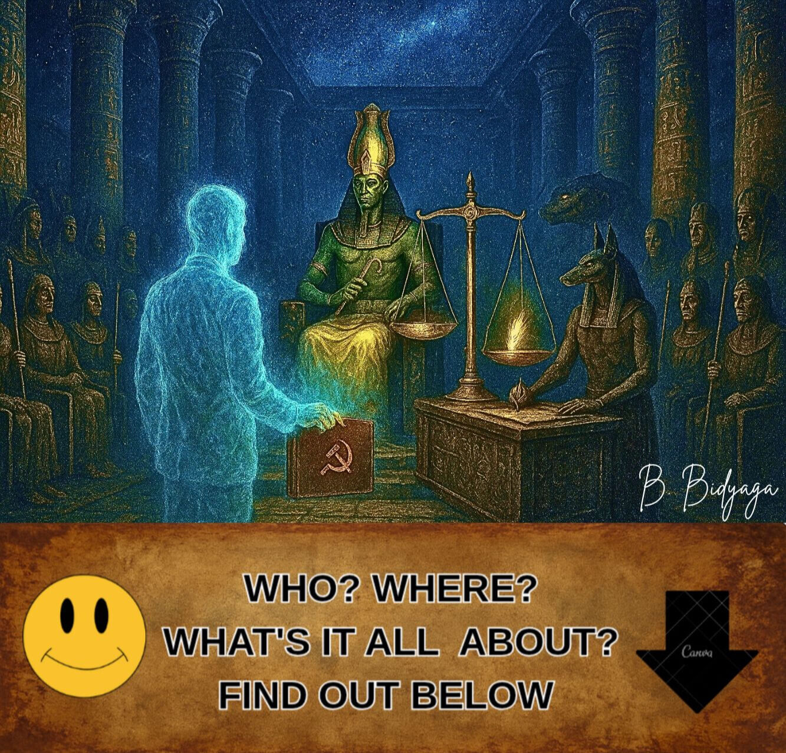
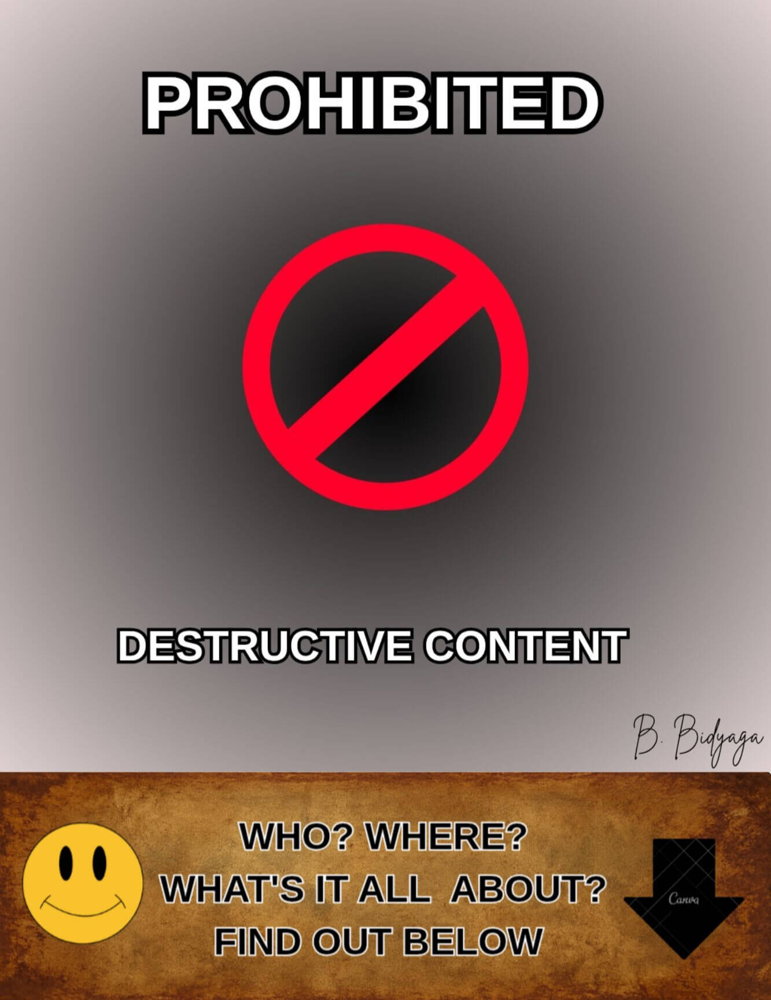
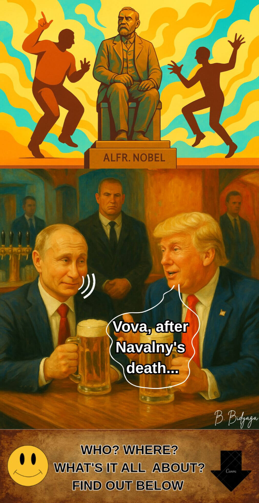
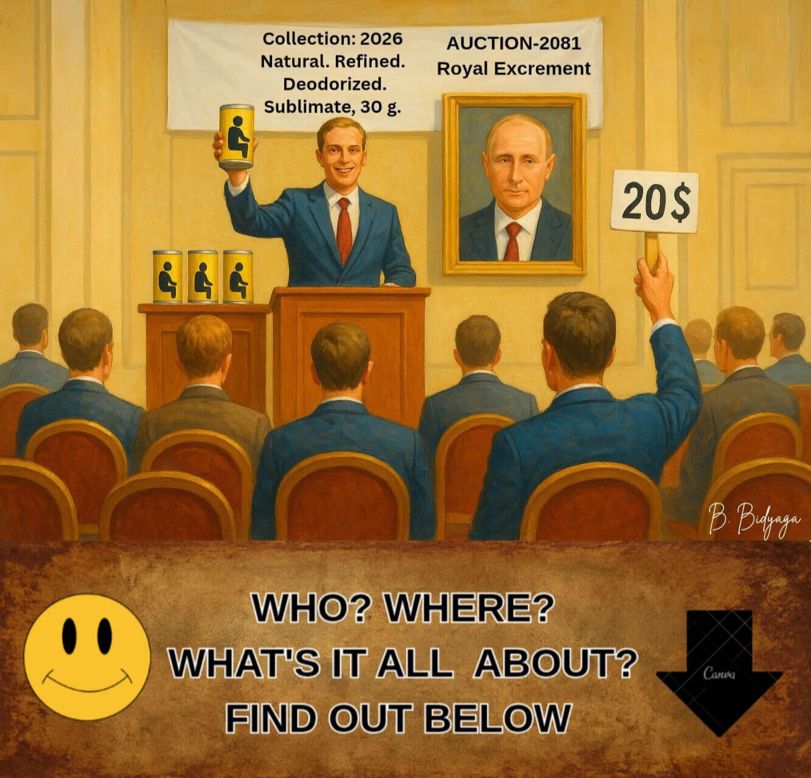
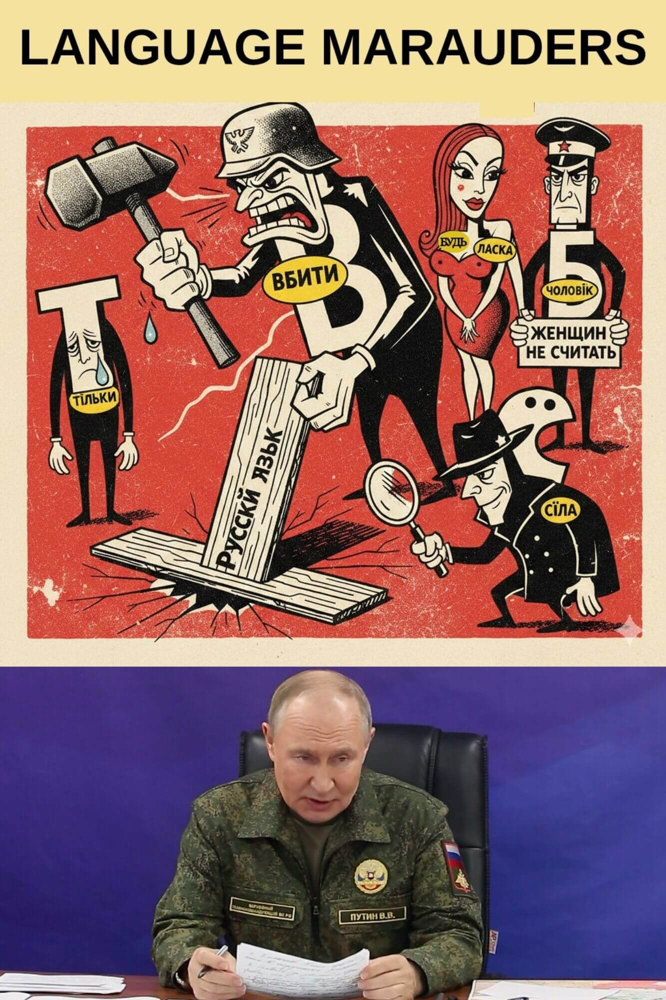
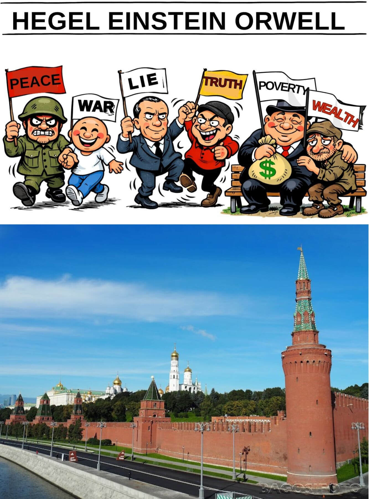
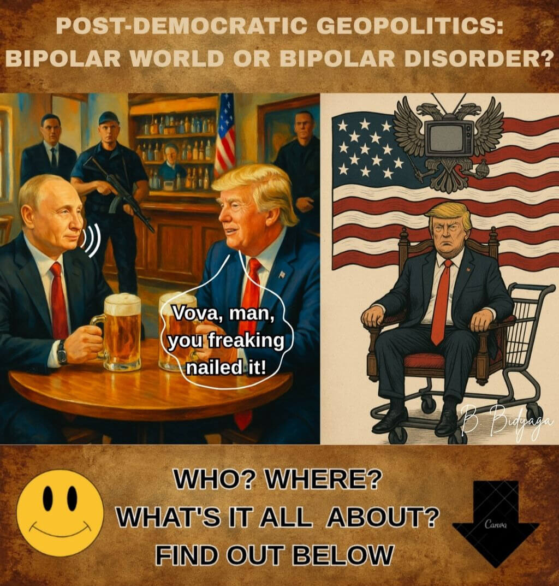
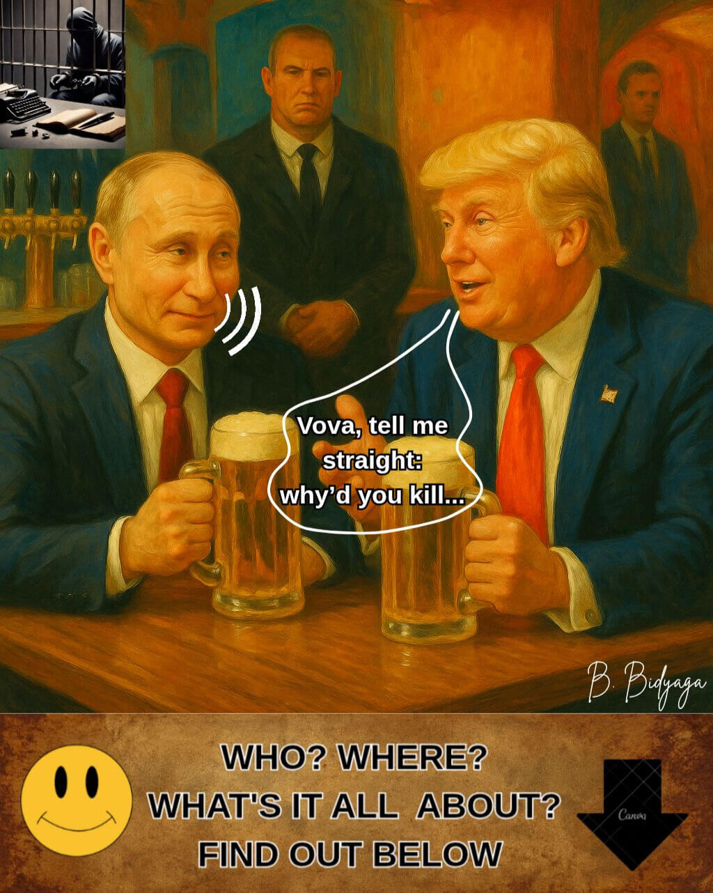

<meta name="robots" content="noindex, nofollow">

[**Main Page**](index.md)

# IN THE HALL OF A THOUSAND TRUTHS 
### POISONOUS SOURCE OF PUTIN'S RHETORIC

**Author: Shcheglova (Olga Boris Bidyaga)** 

**CONTENTS**

[1. Putin in the Hall of Two Truths: Judgment of Osiris](pivo_en.md#1-putin-in-the-hall-of-two-truths-judgment-of-osiris)

[2. One Head for Crown, the Other Rules the Country](pivo_en.md#2-one-head-for-crown-the-other-rules-the-country)

[3. Nobel Capers](pivo_en#3-nobel-capers)

[4. Shitty Immortality](pivo_en.md#4-shitty-immortality)

[5. Cultural Infiltration Operation](pivo_en.md#5-cultural-infiltration-operation)

[6. Outrageous! Enemies Plundering Russian Language!](pivo_en.md#6-outrageous-enemies-plundering-russian-language)

[7. Scientific Foundations Of Propaganda](pivo_en.md#7-scientific-foundations-of-propaganda)

[8. Putin’s Handbook: "1984" Revisited](pivo_en.md#8-putins-handbook-1984-revisited)

[9. Trumputation Happy Hour](pivo_en#9-trumputation-happy-hour)

[10. Putin's Snow Job: Blow-by-Blow Guide-Lie to Die for](pivo_en#10-putins-snow-job-blow-by-blow-guide-lie-to-die-for)

[11. Blessed are the Peacemakers...](pivo_en#11-blessed-are-the-peacemakers)

[12. A Fat and Fragrant Globe for Thanksgiving](pivo_en#12-a-fat-and-fragrant-globe-for-thanksgiving)

[13. Deal of the Century](pivo_en#13-deal-of-the-century)

## 1. PUTIN IN THE HALL OF TWO TRUTHS: JUDGMENT OF OSIRIS

> Sacred ancient Egyptian temple. Inside, well-known procedure of Judgment of the Egyptian god Osiris, as described in the "Book of the Dead," is taking place. Also participate:
> 
> • God Thoth (court secretary, clay tablet in  hands)
>
> • God Anubis (forensic expert)
>
> • Goddess Maat (prosecutor)
>
> • 42 Egyptian God-jurors (wearing masks of Hitler, Mussolini, Lenin, Stalin, Beria, Brezhnev, Zhirinovsky, Dracula, the Devil, and other historical figures)
>
> • Russian president, Vladimir Putin (defendant)
>
> Hall illuminated by TV screens broadcasting court proceedings. Putin stands by gigantic apothecary scales; on one scale pan lies a red paper heart with a gilded engraving: "Putin: 86%". The other pan is empty, yet the scale pans balance each other.

**Osiris**:

— We begin the live broadcast of the most fair trial in the history of the universe! Today, on the Scales of Truth — the fate of the Great Guardian of Traditional Values! But first — a word from our sponsor. Presenting: the elixir of youth "Ambre"!

(Commercial break: the goddess Hathor drinks the potion and instantly becomes 3000 years younger. Voiceover: "Ambre: a sip leading to Eternity.")

**Osiris** (addressing Putin):

— Do you trust this court? Any objections to the judges?

**Putin** (with a slight smile):

— Oh, Your Honor! How could I! The history of Russian-Egyptian relations... We have repeatedly provided aid... Forgiven debts... Built power plants... The Aswan Dam... Complete mutual understanding...

**Osiris**:

— Of course. We remember. The court will now retire to the deliberation room.

(Everyone remains seated, as they were.)

**Maat**:

— I object! You are violating procedure! The defendant has not yet recited the 42 declarations of innocence before the jurors: I have not killed, not stolen, not lied, not falsified weights and measures... and so on.

**Osiris** (reluctantly):

— Hmm... Very well. Defendant, tell us your autobiography.

**Putin**:

— Gladly, Your Honor.
I was born an ordinary Petersburg kid — an average C student. And through my own persistent labor, reaping the rewards in the field of state service, I climbed to the pinnacle of power — became president of a great country. I pursued the most humane and just policies. In my decrees, I promised every citizen a separate apartment, free healthcare and education, high wages, and zero inflation. I established lasting peace in the warlike Chechen Republic. I became the world's most generous donor. I built 20 oil and gas pipelines. My gas lights and heats the entire planet. I aid national liberation movements worldwide — supplying them with weapons at discounted prices. I distribute billion-dollar loans to poor countries and annul their debts a couple of years later. I give China my natural resources for a pittance. Thanks to my policies, the NATO bloc has significantly expanded its borders. I liberated the fraternal Ukrainian people from the tyranny of Zelensky's fascist regime. I stopped the bloody slaughter in Ukraine.

(An ad pops up on the screen: "Gas for every tomb! Let life never end!")

**Putin** (looks at the screen for a second, then continues with his statement):

— I launched the first man into space. My court composer wrote the immortal masterpiece "Swan Lake" [performs a few ballet steps to Tchaikovsky's music]. Finally, I rid the world of Hitler and his fascist dictatorship.
I toiled like a slave on a galley in the post of President for 50 years! I served a life sentence!
I lifted my country from its knees. I sold the factories to the workers and the land to the peasants. I created the world's number one army.
I extended a helping hand and protected Russian-speaking compatriots abroad from arbitrary treatment: in the Baltics, Central Asia, and the Caucasus. We safeguard the rights and freedoms of Russian diasporas across the entire former USSR.
Life expectancy in the country increased dramatically: I lived to be 98 years old.
Medicine is developing at a rapid pace: I died not from illness, but from boredom.
The patriotism of the younger generation is off the charts: my portrait hangs in every school classroom. Traditional values are taking root deep. We only have two-sex marriages. Divorces, abortions, condoms —  banned. Lesbians and gays — stripped of citizenship. Opponents and critics of the government — all in prison. On Earth, peace; among men — complete loyalty. Is this not an idyll? I have established an eternal celebration of life in my country.

**Osiris** (smiling broadly):

— Enough. You are the quintessence of virtue. The court will now retire to the deliberation room.

(Everyone remains seated.)

**Maat** (angrily):

— Wait! You are violating procedure again... The prosecution has not yet had its say!

**Osiris**:

— Dear Maat, all in due time. A time to gather stones, a time to listen to fables. When it's time for your fantasies [suddenly shouting], I will tell you! The court will now retire to the deliberation room!

(Everyone remains seated.)

**Osiris** (after a pause):

— Ladies and gentlemen of the jury, please vote...

**Maat** (jumping up, brandishing her feathers):

— I object! The prosecution's case has not been heard! The weighing of the heart has not been conducted!

**Osiris** (sternly):

— Dear Maat, the defendant's heart was weighed in a special procedure. It has been found lighter than your feather. For it is as pure as the tear of an unborn infant! Anubis!

**Anubis** (producing a pre-prepared protocol from under his robe):

— The scales show zero point zero grams. Innocence is total and absolute.

(The scale pans suddenly begin to oscillate up and down spontaneously. Anubis grabs the pans, trying to balance them.)

**Osiris** (unperturbed):

— It's nothing: perturbations on the Sun. The mechanism appears to be... weather-dependent.

**Putin** (staring into the emptiness above the gods' heads):

— The machinations of Western partners led by NATO. They've even reached the Afterlife. Again, they are encroaching on our spiritual bonds.

**Osiris** (banging his staff on the floor):

— So, ladies and gentlemen of the jury, let's vote. Do you confirm the defendant's complete innocence?

**Jurors** (in unison):

— Yes!

**Zhirinovsky**:

— Clone him!

**Brezhnev**:

— Decorate him with an award!

**The Devil**:

— Canonize him!

**Stalin**:

— We are of the same blood!

**Beria**:

— I bow to you, Teacher!

**Mussolini**:

— Pleased to meet you, colleague!

**Dracula**:

— You know how to suck. Our kind of guy!

**Osiris** (ignoring Maat's protests):

— The court announces the verdict:
The defendant is acquitted.

**Maat** (waving a thick stack of photos in the air):

— Are you out of your minds? Here is the evidence! Murders! Abductions! Poisonings! Wars! Hybrid attacks! Falsifications!

(The evidence appears on the screen but almost instantly vanishes. The screen is covered with fine static. A minute later, an image of Putin against the backdrop of the Cathedral of Christ the Savior appears, immediately replaced by the cartoon "Dunno on the Moon".)

**Osiris** (smiling):

— Esteemed gods! Let's vote! All in favor of immortality, glory, and apotheosis for the defendant?

(All 42 gods raise their hands in unison. A commercial is broadcast: "The new 'Pharaoh-Deluxe' sarcophagus! Three colors: black granite, white marble, George ribbon.")

**Thoth** (reading from the clay tablet):

— Approved unanimously! Death is revoked, eternal life is granted! The name "Vladimir Putin" shall be inscribed on the title page of the "Book of the Dead" in golden ink!

**Putin** (nodding):

— Thank you. This is our shared victory. Special thanks to my faithful dog, Anubis. He's a good boy.

(Anubis wags his tail, embarrassed.)

**Maat** (in despair, dropping her feathers on the floor):

— Inconceivable! Unbelievable! I am filing an appeal with the Martian Intergalactic Court!

(She is dragged away under the arms by attendants with bear heads. The broadcast cuts out. The screen shows dancing Cossacks.)

**Thoth** (closing the case folder):

— Thank you all, you are free to go. The session is closed.

> **Culturological Commentary**
>
> The miniature is based on the ancient Egyptian myth of the Judgment of Osiris. According to the "Book of the Dead," the soul of the deceased was brought into the Hall of Two Truths, where it faced:
>
> — Osiris — god of the underworld, presiding judge.
>
> — Maat — goddess of truth and justice, the standard of purity.
>
> — Anubis — jackal-headed god who conducted the weighing of the heart.
>
> — Thoth — god of wisdom, court scribe.
>
> — 42 God-jurors — each responsible for one specific sin; the deceased had to swear before each god that he had not committed that sin.
>
> The main procedure — the weighing of the heart: the heart of the deceased was placed on one scale pan, and the feather of Maat on the other. If the heart was "lighter than the feather," the soul was deemed pure and granted eternal life; if heavier, it faced annihilation. This ritual symbolized absolute justice and the impossibility of deception.

#OrthodoxMilitaryPutinism
                              👻

## 2. ONE HEAD FOR CROWN, THE OTHER RULES THE COUNTRY

*Note: Illustration blocked by censorship.*

Spacious conference hall. Officials  seated inside. On illuminated stage well-known political leader lies on his back. His genitals fully exposed; his erect penis crowned with miniature, yet precise, copy of his own head. Small head of lying politician addresses audience with loud, pompous speech:

— The birth rate in the country is falling catastrophically. Like a stone dropped into an abyss. I've been long saying it and I repeat: condoms and abortions are to blame for everything! And LGBT. And Childfree. We must fight, fight, and fight against all this heresy. So far, we are doing poorly.

We banned abortions. So what? Now they go to China to have abortions. Or they give birth in Argentina and stay there for ever. Condoms are the utmost evil. Condoms are a personal insult to me. They violate the basic right of the individual — the right to procreate and multiply. Enshrined in the Constitution, by the way.

We banned condoms having named them  symbols of  extremism. So what? The black market for condoms is thriving. Underground manufactories of rubber goods are springing up like mushrooms after rain. All over the country. LGBT propaganda is oozing out of every crack. What is happening? This is a complete failure of my decrees implementation. I will not put up with this attitude.

If the state apparatus cannot force the population to give birth — I will force the state apparatus to give birth.

Turn on your brains, if any.
And start working.

Do we not have a sperm bank? Do we not have an egg bank?
Buy eggs from the population at a fixed price. Introduce a natural tax, for god's sake— one egg per month in favor of the state.

Engage the Academy of Sciences — let them create a state military Incubator. We will raise true patriots of our country. Who from their swaddling clothes will have memorized the military charter and the 10 commandments of Putinism. We will protect them from the pernicious influence of liberal parents. This will be the stronghold of our future prosperity and triumph.
Second. Engage the geneticists. The country does not need idle housewives and thinkers of any kind. The genes of future generations must be the right ones: patriotic, male, warlike.
Is it really so difficult? Get to work.

We will revive our great country and our great "second army of the world." Moreover, we will make it the first! Whatever the price.  Over the corpses of our enemies, through the tears of mothers, across the ravaged land — we will advance without fear and without mercy. We will crush any resistance and completely destroy anyone who dares to rise up against us. Even if it means bringing the entire country to its knees, we will do it. Make no mistake: the will of the state is iron, and nothing and no one can stop it.

(Stormy, prolonged applause.)

#OrthodoxMilitaryPutinism
                              👻

## 3. NOBEL CAPERS

American bar.
Russian President Vladimir Putin and US President Donald Trump at table, drinking beer.

**Trump**:

— Vova, after you took care of Navalny, your political scene is a total cakewalk. Smooth sailing. God's in his heaven, all's right with the world.

**Putin**:

— Don't be naive. Navalny was a nobody. All talk, no action. A glorified blogger.

**Trump**:

— Then why'd you have to wipe his whole organization off the map? For a nobody?

**Putin**:

— Donny, use your head. The man had no platform. Just a bunch of kids in the streets chanting curses at me. Is that a policy? Look at Lenin — now *that* was an agenda: factories for the workers, land for the peasants. This clown? Just insults. It's... tasteless.

**Trump**:

— Yeah, stupid. A real amateur.

**Putin**:

— Precisely. In my entire career, only one man ever truly worried me — Boris Nemtsov. A real politician. Knew what he was doing.

**Trump**:

— So you had him whacked so he wouldn't run?

**Putin** (scoffs):

—  No. We wouldn't have let him run anyway — the election commission would've seen to that. And for the record, I didn't give that order.

**Trump**:

— But come on, Vova. Everyone knows it was your security guys.

**Putin**:

— We don't do messy public spectacles anymore. That's last century's playbook. Why the drama and the headlines when you can make anyone... disappear? Quietly. Neatly. Anyone. Even a U.S. President.

**Trump** (shifting uncomfortably):

— Whoa, Vova, that's not my war! That's all on Biden. And you know I'm your friend. You know that.

**Putin** (in a mocking tone):

— I know. I see you twisting in the wind, playing both sides.

**Trump** (defensively):

— Vova, I swear on my life, I got nothing against you personally. Hell, I even get where you're coming from. I just... I want that Nobel!

**Putin** (musing aloud):

— A perfectly understandable ambition. I've been thinking... why shouldn't I have one? Next year, perhaps.

**Trump** (eyes popping):

— You?!

**Putin** (condescendingly):

—  Donny, everyone has a price. Some are just cheaper than others. And if that doesn't work... well, there are other levers. Threats, kompromat, blackmail... The machine is very, very efficient.

(A heavy pause hangs in the air)

**Putin** (with an ironic smile):

— You know, a Nobel would look even better on my chest than on yours. Just think of the headline: "War Criminal Putin, Nobel Laureate." That is the ultimate  proof of my power over the world. It's even cooler than my army at the gates of Paris! That's how you bend this cowardly Europe over and fuck it good and proper!

**Trump** (nervously):

— Hey, Vova, how about... I get the Nobel first, then you can do whatever you want with this cowardly Europe. Deal?

**Putin** (waves a dismissive hand):

— Fine. You first, Donny. Besides, I've got to get to Kyiv before I start collecting prizes...

#OrthodoxMilitaryPutinism
                              👻

## 4. SHITTY IMMORTALITY

Russia, Kremlin, President’s office. Russian President Vladimir Putin and Mikhail Kovalchuk, his old friend, now overseeing life-extension research, at table.

**Putin** (almost affectionately):

– Well, Professor, report: how are things progressing with my immortality?

**Kovalchuk** (enthusiastically):

– There’s progress. Significant. We’re currently working on a project to preserve your... biological materials.

**Putin** (surprised):

– What? What does poop have to do with that?

**Kovalchuk** (hurriedly):

– Hold on. Don’t fuss. Hear me out first.

**Putin** (graciously):

– Speak.

**Kovalchuk**:

– Science has proven that freeze-drying excrement preserves intact DNA. We’ll freeze-dry and preserve your shit and pair it with a stack of photographs and a collection of your speeches. In the distant future, using your DNA and relying on your photos and samples of your public appearances, an exact replica of Vladimir Putin will be recreated. Probably 3D-printed. Well? What do you say?

**Putin** (pensively):

— Shitty immortality. A shitty idea. Say you print me out. But who am I? Nobody. Someone else will be sitting on the throne. They will immediately bring charges against me: the war, the arsons, the bombings, the cables, everything.

**Kovalchuk**:

— I don’t know about that. It’s impossible to predict what political system Russia will have by then.

**Putin** (with emphasis):

— That’s the point. I want a different kind of immortality. I want this — my present body — to serve me forever. Is that so hard?! Heart worn out — transplant. Liver, kidneys — transplant... It's as simple as that!

**Kovalchuk** (cautiously):

– But every organ has a service life – no more than eighty years...

**Putin**:

– Then take a heart from a schoolkid – a recent graduate. What, you feel sorry for some kid for my sake?

**Kovalchuk** (fervently):

– Not at all! I’d give you my own heart...

**Putin** (disgustedly):

– I don’t want yours. What the hell do I need your rusty junk for? Get me a young heart, with plenty of life left. And in 60 years, put in a new one. What’s so complicated?

**Kovalchuk**:

– At present, medicine can’t guarantee the organ will take. The probability of complications is quite high. So either wait another 20 years, or we preserve the shit.

**Putin** (grumpily):

– Fine, have it your way. Go on with your shit. But only as a backup. In the worst case, after my… death [his face distorted, as if in severe pain] it’ll go under the hammer for a million.

**Kovalchuk** (smiling):

– Yes. In the West, the shit of the powerful is highly valued. Some Italian artist, I think his name was Mandzoni, sold his poop for the price of gold. And now a 30-gram can of this shit costs hundreds of thousands of euros.

**Putin** (contemptuously):

– Well, if some lousy Italian shat gold ingots – my shit will go for ten million!

**Kovalchuk** (flatteringly):

– Maybe even more!

**Putin**:

– Only one condition: no greed! 30 grams?! That’s a laughingstock! What am I, a pigeon?

**Kovalchuk** (convincingly):

– You? No. You are a falcon. An eagle. A kite. A pterodactyl.

**Putin** (arrogantly):

– Exactly. And my shit must be of the highest quality. Refined. Deodorized. And make it blue. Blue blood – blue shit.

**Kovalchuk**:

– Of course, of course. First press. Virgin Putin shit. Or Putin virgin shit? Which is correct?

**Putin** (with hatred):

– Dismissed!

#OrthodoxMilitaryPutinism
                                👻

## 5. CULTURAL INFILTRATION OPERATION 

Russia. Moscow. State Duma hall.
President of Russia Vladimir Putin is speaking to the deputies.

**Putin:**

— Esteemed deputies! Friends! Comrades!
The geopolitical situation has reached a boiling point. Russia’s enemies are not sitting idle. The West is doing everything in its power to destroy us. Especially Europe. Especially France. France has always been and remains our main adversary. France has constantly encroached on our traditional values, trying to destroy our cultural heritage and our language. Let us recall the 19th century, when, as a result of a French influence operation, the entire Russian elite spoke exclusively in French for decades. The Russian language found itself on the verge of complete oblivion and extinction. And if it weren’t for the deep Russian people, who quite rightly hated everything French, we would all now be speaking in French!

Yes, in the 19th century French intelligence failed, but now they are trying to take revenge.
Our enemies accuse us of allegedly waging a hybrid war against the West. Brazen lies! We are peaceful people. But the French truly do attack our culture, our traditional values, our language again and again. They have infiltrated the Russian language with a massive enemy landing force. Just look at how many French words we have — words so cleverly disguised that people don’t even suspect their speech is packed with French spy-words.

Chauffeur, tableau, theatre, chef-d’œuvre… There are thousands of them. It’s no longer clear whether it’s still Russian or already a dialect of French.
Well, the word “chauffeur” is nothing. But they're sneaking such destructive words as "president" and "revolution" into our language! This is nothing but blatant sabotage and an assault on our traditional values. What is this “president”? Russia has never had and never will have “presidents.” Only a tsar [pounds his chest]. Or take “revolution.” Revolutions and guillotines for royal families are purely French socio-political phenomena, absolutely alien to the Russian spirit. And by the way, we never had these abominations — until these shameful sabotage-words entered our language.

And this makes sense, comrades. Remember the Bible: “In the beginning was the Word.” And only after that — everything else. Meaning: there can be no revolution until the word “revolution” exists in the language. For example. In the Soviet Union there was no sex — this is a well-known fact. Why? Because there was no word “sex.” But once the opportunist Mikhail Gorbachev opened the borders to Western mass culture, the words “sex,” “gay,” “lesbian,” “LGBT” entered — and after that, debauchery and sodomy blossomed in Russia.

The conclusion, comrades: if we want to eradicate a phenomenon alien to our culture, we must erase from the language the very word that denotes it. Ban it by law, rewrite dictionaries, burn all books containing that word. All violators must be prosecuted.

And our so-called “linguists,” who shyly call these spy-words “borrowings”? This is sabotage, comrades, and we must stop it. First these sabotage-words assimilate, then they begin to multiply, and eventually they drive out the original Russian words. This is linguistic aggression, comrades. Linguistic genocide.
Justifying French borrowings in the Russian language must legally be equated to justifying terrorism. From five years to life imprisonment, depending on the particular word.

For neutral words (chauffeur, revanche, chef-d’œuvre, theatre) — five years.
For “revolution” (undermining the constitutional order) — ten years.
For “president” (discrediting the national leader) — fifteen years.

But the most insidious French sabotage-word is “condom.” We have seen with our own eyes how, after linguistic expansion, our market was literally flooded with these devilish rubber products. French ones, by the way. This unprecedented attack is aimed at the most valuable thing we have — our gene pool. This is a demographic atomic bomb, comrades. To destroy Russians even before they are born. This is the most blasphemous, the most sophisticated weapon of mass destruction.

The word “condom” must be erased from the Russian language. We must uproot it from our lives. The use of this word in any form is an act of high treason. In its highest manifestation. The depiction of a condom must be equated with displaying extremist symbols.

And in the future.
Comrades! We must strictly protect our language from the penetration of Western sabotage-words. This is the main defensive line in our struggle for traditional values.

Thank you for your attention!

#OrthodoxMilitaryPutinism
                              👻

## 6. OUTRAGEOUS! ENEMIES PLUNDERING RUSSIAN LANGUAGE!

Russia, Moscow, the Kremlin. Meeting of Russian Security Council. Russian President Vladimir Putin speaking.

**Putin:**

— Comrades! 

Today is a momentous day. Today, we have identified and formulated our third — and most important — goal of the Special Military Operation. Thus, from this moment on, I ask you to memorize our three strategic goals in the fight against the fascist Ukrainian regime:

 • Demilitarization

 • Denazification

 • Decolonization (of the Russian language)

Comrades!

It is with deep sorrow that I inform you: we have been struck by a catastrophe of cosmic proportions. For centuries, the enemy has been weaving a deadly web behind our backs, insidiously and secretly, and now we have found ourselves caught in it — completely unexpectedly.

Comrades!

We pay the utmost attention to protecting our spiritual and family values. This is wonderful! However, we have completely lost sight of our traditional communicational values. Both semantic and phonetic.

After all, our language — our national treasure — has for centuries  been subjected to predatory raids by the Ukrainian language! They steal our traditional, primordial Russian words, mutilate them by changing their phonetic form and semantics, and use them in their language without our consent!

They have stolen our prefixes and endings; they have stolen our nouns, adjectives, and verbs. They radically change their meaning; they mangle their pronunciation. This is a violation of the copyright of our intellectual property! We gave them no permission to do that. This is a criminal offense and grounds for compensation.

But it is also a desecration of the Russian language. It is genocide of our linguistic heritage. It is a humiliating spit in our souls.

Comrades! 

Before me lies a three-volume work compiled by our chief linguist and renowned expert on the Russian language — Vladimir Dal. It contains all the original Russian words stolen from our language by the Ukrainians — words that have been humiliated and insulted, turned into speechless slaves in the service of the communications of the Ukrainian fascist mob.

I do not wish to be unsubstantiated, comrades. I will give you dozens of examples of how our noble, authentic Russian words have been rudely and unceremoniously raped, violated, and forced into the alien structure of the so-called Ukrainian language.

• Take the Russian word ***ubit'*** (to kill). They snatched it and turned it into ***vbiti***. This is a discredit: one can vbit' (drive) a nail into a board, but fascists are to be killed (ubit').

• Take the Russian word ***tol'ko*** (only). They turned it into ***til'ky***.To a Russian ear, it sounds offensive. Furthermore, it's noteworthy that they use the hostile NATO letter **i** here. With a dot! Completely alien to our intellectual values. Did you know that there is an even more vile letter in the Ukrainian language: **ï**, with two dots! It is a clear symbol of degradation and the quintessence of fascist rhetoric.

• Take the Russian word ***chelovek*** (person). They turned it into ***cholovik***, and on top of that, they changed its meaning. According to their twisted logic, only men belong to the category of "people." That is, women are not people? This discredits the entire female half of humanity. What disrespect for Russian women!

• Take the Russian word ***narushat'*** (to violate). They changed everything in it: the prefix, the suffix, the ending. What did they get? A disgusting hybrid: ***porushuvaty***. This is an insult to the feelings of those who believe in the beauty and grandeur of the Russian language.

• Take the Russian word ***laska*** (caress). Kind, sweet, innocent, and warm. They have put it to use in the service of blatant propaganda for sexual games and debauchery! Just look at it! ***Bud' laska!*** For them, this supposedly means ***please***. "Bud' laska, go to the store." "Bud' laska, make an omelet." And so on. Every minute we hear this ***bud' laska***. But it is nothing more than an invitation to sexual foreplay: 

***bud' laska = caress me!***

This is sexual harassment in its purest form!

• And what about the word ***shkodit'*** ? We know that it means very bad behaviour. But they stole it and — to annoy us — elevated and refined it. For them, it means ***to damage***: "Do not ***poshkod'*** the bag!" How are we supposed to take this? This is discrediting of our very meanings, comrades. Sacred meanings.

What don't they do with our words!

• They rearrange letters in historically established combinations: we say ***rozhdayetsya*** (is born), they say ***narodzhuyetsya***. We have **zhd** they have **dzh**. This is a pure mockery of our language.

 • We say ***vsyo*** (all/everything), they say ***usyo***.

 • We say ***ulitsa*** (street), they say ***vulytsya***.

•  We say ***krestit'sya*** (to cross oneself), they say ***khrestytysya***. They are simply mimicking us! Like monkeys in a zoo.

•  And the good old word ***kakoy-nibud'*** (any/some)? They simply mutilated it! They castrated it and swapped the parts of the compound word. What did they get? Gibberish, abracadabra: ***bud'-yakiy***.

And so on and so forth. I repeat, I have in my hands three thick volumes listing all crimes of this nature.

We turned to experts, who came to the conclusion that this phenomenon is nothing less than the colonization of the Russian language with the aim of discrediting, humiliating, parodying, abusing, insulting, causing serious damage to its structural elements and, ultimately, destroying it.

Therefore, comrades, a new task stands before us. After four years of selfless struggle, we have achieved the goals of demilitarization and denazification of the so-called Ukraine. Now we are faced with an equally important task — the decolonization of the Russian language.

We must wrest our desecrated words from the clutches of the fascists, return them to their native harbor, and rehabilitate them.

And we are filing a counterclaim against Ukraine in the International Tribunal for compensation for reputational and linguistic damage. You want to use our words?  Obtain written permission and pay royalties. But we will not tolerate any violence, abuse, or disrespect for our linguistic symbols and their sacred meaning.

**Security Council Secretary N. Patrushev:**

— Vladimir Vladimirovich! I propose that we offer the opposing side a mutual settlement of our claim and  Ukraine's claim against Russia for material damage from military actions. We will demand compensation for the same amount — 800 billion euros.

**Putin:**

— Very good suggestion! Thank you! Thus, we win twice. We razed to the ground half of their country, but at the same time we do not pay a penny in reparations. 

#OrthodoxMilitaryPutinism
                              👻
                              

## 7. SCIENTIFIC FOUNDATIONS OF PROPAGANDA

Russia, Moscow, the Kremlin. Russian President Vladimir Putin addresses journalists of the Kremlin press pool.

**Putin**: 

— Comrades! Today, I would like to touch upon the bedrock principles of Russian state ideology. Our enemies accuse us of — how shall I put it —distorting ideas and facts, of turning concepts, principles, and faith upside down. In the public sphere, the term "mendacious propaganda" is frequently leveled against us.

This is unjust, comrades. It is a blatant lie and a baseless insinuation. We invent nothing, and we shall tolerate no "creative ad-libbing". Our ideology is based on a strictly scientific approach. Much like Marxism-Leninism, our ideology flows logically from the world-renowned theories of the greatest thinkers of human civilization.

If the three pillars of Communist teaching were Marx, Engels, and Lenin, then the three pillars of our ideology are Hegel, Einstein, and Orwell.

Dialectics and the Theory of Relativity provide the scientific basis for the structural framework of our ideology. The novel "1984" is a brilliant example of the substantive application of that very structure.

Our world rests upon fundamental laws:

• Universal Gravitation

• Unity and Struggle of Opposites (Hegel)

• General Theory of Relativity (Einstein)

Yes, dear comrades, everything in this world is relative: good and evil are intertwined; antagonists live in symbiosis. Read your Hegel. Remember your Einstein.

Take, for instance, war and peace. The brilliant visionary Orwell was the first to uncover the immutable truth: 

**PEACE IS WAR, WAR IS PEACE**

And indeed, look: there is currently peace between NATO and Russia. For now. I repeat: for now. But what is happening in reality? In reality, a full-scale hybrid war is underway (cyber-attacks, a war of ideas and meanings, draconian economic sanctions, the freezing of our financial assets, and so on). And this is what you call "peace"? I must specifically note the overtly hostile practice of regular NATO weapon deliveries to Ukraine. If NATO "HIMARS", even if launched from Ukraine, have decimated dozens of my strategically vital oil refineries — does that, in your view, qualify as peace?

On the other hand, conventional wars are peace in its embryonic stage. War leads nations to peace. Give people war, and they will immediately become ardent adherents of peace. War begets peace. No one desires peace more than the soldiers sitting in the trenches. These soldiers are not fighting for territory — they are fighting for peace. And the more brutal, bloody, and destructive a war becomes, the more solid and indestructible the peace born of that war will be. 

**WAR IS PEACE**, comrades. This is a fact. And it is a fact that must be reckoned with.

Another of Orwell’s brilliant discoveries is the axiom:

**TRUTH IS A LIE**

Indeed, the statement of any fact is subjective. Everything depends on the speaker’s point of view, on interpretation, and ultimately — on the definition of concepts. But conceptual frameworks can (and must!) differ across various cultures. 

For example, Europe has its own notions of duty, morality, and spiritual values; we have ours. By virtue of this alone, we cannot share the same interpretation of facts. What they call the truth is, for us, a lie. And vice versa. It is self-evident.

As for the so-called "rewriting" of history: this too is obvious, comrades. Scientific and technological progress is fundamentally changing our lives, our perceptions, and our views — changing them right before our eyes. We now have dozens of times more information at our disposal than we did, say, ten years ago. Artificial Intelligence offers immense opportunities for a more adequate analysis and understanding of history. Because of this, we must, of course, adapt textbooks for students and schoolchildren. This is the natural consequence of the total informatization of the society in which we live.

Furthermore, the dialectical approach leads us to the recognition of an obvious truth: 

**DEFENSE IS OFFENSE**

Take, for example, our heroic Special Military Operation. Yes, today it is already a full-fledged war. A war for peace throughout the world. But let us recall how it all began. NATO was openly preparing an invasion of our country by the Ukrainian army. If we had not entered the territory of Ukraine on February 24, 2022, we would be defending ourselves against the enemy on our own soil right now. We acted wisely — we delivered a preemptive retaliatory strike. In doing so, we saved thousands of lives and hundreds of civilian facilities from death and destruction. As you can see: 

**OFFENSE IS DEFENSE**

In its purest form.

And so, comrades, let us summarize. The most important front of our confrontation with the West is the ideological one. In your professional activities, you must not only disavow enemy propaganda — you must be able to prove to the electorate the scientific validity of our state ideology. I have provided you with several compelling examples. This is the foundation, which you may develop and deepen indefinitely.

To work, comrades! 

Victory will be ours!
                             
#OrthodoxMilitaryPutinism
                              👻

## 8. PUTIN’S HANDBOOK: "1984" REVISITED

Russia, Moscow, the Kremlin. Meeting of the heads of state security and law enforcement agencies. President of Russia Vladimir Putin speaking.

**Putin**: 

— Comrades! Who among you has read the seminal work of the great British writer **George Orwell**, "**1984**"? No one? You should. It is our handbook.

Dear comrade Orwell described a fairly effective totalitarian system of government. Of course, in the middle of the last century, he couldn't have even dreamed of the technologies we have at our disposal today. Because of this, his system is quite cumbersome, resource-heavy, and expensive. But regardless — it works perfectly! Even in conditions of technological backwardness.

But the main thing, comrades, is his immortal totalitarian ideas: ***doublethink***, the ***mutability of the past***, and the ***thought police***.

We have already adopted some things from his system and are applying them with great success. But, as they say, there is still room for improvement.

First and foremost, we must introduce the concept of ***thoughtcrime*** into our jurisprudence. This concept follows logically from our traditional values. Remember what Christ said in his sermons: if you have lusted after your brother’s wife, you have already committed adultery. Thus, according to the dogmas of our Orthodox Christian Church, the very thought of sin becomes a sin. This is an important metaphysical leap that we are simply duty-bound to put at the service of our state security.

So, we didn't invent ***thoughtcrime***, and neither did Orwell — it was invented by Lord God Himself.

What does this mean for us in practice?
First: a special unit must appear within the police — Thought Purity Department. Put simply, that very Orwellian ***Thought Police***.

Second: we must refine our criminal and administrative codes by introducing punishments for ***thoughtcrime***.
And most importantly — we must launch practical work among the population.

Let’s turn back to our handbook. In the mythical country of Oceania, dissenters were identified by establishing 24-hour surveillance over citizens using so-called ***telescreens***. Unlike Oceania, which, as I understand, had the status of a pariah on the international stage, Russia is one of the major geopolitical players and must maintain at least some semblance of basic decency. Therefore, we cannot openly violate such fundamental civil rights as the right to privacy.

Furthermore, ***telescreens*** are effective tools of intimidation, but uncovering secret thoughts requires clandestine methods. No one will confess to heresy if they know they are being monitored.

We have already taken a large — a huge — step in this direction: we developed and implemented the mandatory messenger MAX, which allows us to covertly monitor our citizens' communications. 

But! When a foreign agent goes to a protest, stands in a solo picket, or publishes unpatriotic appeals on the internet — that is already an advanced stage of ideological deviation. That can no longer be cured; it can only be punished with imprisonment.

In fact, you know, I suggest viewing dissent as a progressive disease. If we manage to diagnose it at an early stage, there is a very good chance that, with the help of basic corrective procedures, we can cure a person of this illness forever.

Therefore — our attention must be directed primarily at children. Yes, our "Talks about the Important things" are already standard practice across the country. This is wonderful — we are instilling the correct mindsets in our children. But we need feedback! What do we have in this regard? Student surveys? They are absolutely ineffective; it’s like expecting a foreign agent to confess in front of a ***telescreen***.

We need a systemic, global solution. And it lies right on the surface. What will we do? We will install 24-hour audio surveillance in kindergartens, schools, and other educational institutions. Not video surveillance — no. That is expensive and unnecessary. We don’t need faces — only conversations and a voice recognition system. This is simpler and cheaper. And it can be done covertly.

Next, artificial intelligence analyzes the information coming to the server and produces the final result: "Petya Belkin from 3rd grade at School No. 212 is unreliable; yesterday during the break between the second and third lessons, he used an insulting remark directed at the President."

Petya is then handled by the juvenile department for painless ideological correction — much like the way a child’s teeth are straightened with braces when they grow sideways.
And exactly like crooked teeth — in childhood, such ideological correction is still possible.

And by the way, when little Petya grows up, he will only be grateful to us for helping him get rid of wrong thoughts in his childhood and thereby saving him from prison.

Naturally, total audio surveillance should be carried out in all state institutions — we are not breaking any laws there. In coordination with private business owners, we will also install monitoring devices on their premises and in their offices. If they refuse to cooperate — well, you know how to persuade them.

Our ultimate goal, comrades, is to build a harmonious society — a society based on the principles of homogeneity, conformity, solidarity, and cohesion.

So that I no longer have to lie during a "Direct Line" with the people, claiming that foreign agents in Russia are not subject to criminal prosecution.

We won’t actually have to persecute dissenters — for the simple reason that we won’t have any dissenters left.

#OrthodoxMilitaryPutinism
                              👻  

## 9. TRUMPUTATION HAPPY HOUR 

American bar. Russian President Vladimir Putin and US President Donald Trump, beer in hand, leaning across table.

**Trump**:

— Vova, man, you freaking nailed it — twenty-five years in power! How the hell do you pull that off?

**Putin**:

— Piece of cake. I rewrote the Constitution.

**Trump**:

— And nobody kicked you out?

**Putin**:

— We set the stage. Cooked up a “deadly virus,” rolled out a pandemic.
Scared the crap outta everyone, and boom — protest’s dead before it’s born.
Had martial law up my sleeve too, just in case. Didn’t even need it.
The opposition? Total losers. Weak as kittens. They were the ones yelling, “Lock us down harder!” Can you believe it?
Pathetic. Everyone just stayed home, shivering over their health.
So yeah, nobody gave a damn about the Constitution anymore.

**Trump**:

— Man, that’s insane. Genius! I’d love that too… But hey, we got this little thing called democracy.

**Putin**:

— I’d bend your democracy like a paper straw, Donnie.

**Trump**:

— C’mon, you serious?

**Putin**:

— Dead serious. First thing: trash the checks and balances. Straight to the dumpster. Build yourself a nice fat vertical.
Cops and Feds — your bodyguards. Courts — your backup.
And dirt, Donnie, dirt on everybody. No dirt? No problem. You plant it.
That’s how you run the show.

And remember: loyalty, loyalty, loyalty. Then purge, purge, purge.
Show trials — for the spectacle.
And boom, you’re untouchable.

Then you pump your gospel everywhere. Schools, TV, TikTok. “Make America Great Again” — tattoo it on every wall if you have to.

I’d brand the whole damn country:
TraMerica.
TrEconomics.
TraFashion.
Slap your name on everything — Americans love that crap.

Two parties? Forget it. Dems, Republicans — same circus, different clowns, just swap costumes every four years.
Start your own party: TrumParty. Big, loud, orange.

Hell, make your slogan bigger: MAGA — PTAGA.
“Make America Great Again: Prosperity To All. God. Hallelujah!”

**Trump**:

— PTAGA! Vova, that’s killer. I love it.

**Putin**:

— See? It works.
And when they get bored — declare war on Canada.
Dig up some lost Native American empire. Chingachgook the Great Snake — Ruler of All America.

Boom — you’ve got history, you’ve got borders, you’ve got war.
New state, new elections, new terms.

**Trump**:

— Dude, this is gold. You’re a genius, Vova.

**Putin**:

— Exactly. You take half the globe, I take the other half.
You’ll be Lord of Meridians, I’ll be Lord of Parallels.
Two kings, one planet. Cheers, Donnie.

#OrthodoxMilitaryPutinism
                              👻

## 10. PUTIN'S SNOW JOB: BLOW-BY-BLOW GUIDE-LIE TO DIE FOR

American bar. Russian President Vladimir Putin and US President Donald Trump at table, drinking beer.

**Trump**:

— Vova, tell me straight: why’d you kill Navalny? Was he really that dangerous to you?

**Putin**:

— Donnie, you’re killing me here!
His numbers were below zero. Why on earth would I fear a guy like that?

**Trump**:

— Then I don’t get it…

**Putin**:

— You have to get it, Donnie.
He bugged me. Drove me nuts. Just hearing his name made my blood pressure spike.
I couldn’t stand living in the same country, breathing the same air.
I gave him the chance to leave — he came back. Why?

**Trump**:

— And then you had him killed?

**Putin**:

— Donnie, don’t be so crude.
I only locked him up.
For financial crimes.
A thief belongs in jail, Donnie. Am I right?

**Trump**:

— Then why did he die?

**Putin**:

— Fifteen chronic illnesses, Donnie. Even herpes. With a list like that, nobody lasts long.

**Trump**:

— That many? But he was still young!

**Putin**:

— That’s what my guys told me, Donnie.
Twenty conditions. Including prostatitis. Same people who worked the Magnitsky case — pros, real pros. My A-team.

**Trump**:

— Never heard of it. Not even Fox told me! Unbelievable!

**Putin**:

— We didn’t know either. But after the autopsy — boom! Twenty-five diseases. Even sciatica. Like some old wreck.

**Trump**:

— Incredible, just incredible. He looked like a healthy guy!

**Putin**:

— Donnie, if you don’t believe me, I’ve got the papers. Certificates, medical files, autopsy reports… all clean. Thirty conditions, Donnie. Including gallstones. He was rotten to the core.

**Trump**:

— Then how the hell did he even last three years in prison?

**Putin**:

— He had nine lives, Donnie. Like a cat. Not even “Novichok” could finish him off. Tough specimen.
Picture it — thirty-five chronic illnesses. Plus lice!
That wasn’t a man, that was a walking corpse!

**Trump**:

— Then why won’t you give the widow his stuff — documents, tapes ? If everything’s so clean?

**Putin**:

— Donnie, my guys are worried it’ll end up in German hands again. And you know how the Germans are — they can pull "evidence" out of thin air. We don’t need another "Novichok" fiasco.

**Trump**:

— And why do you keep changing the story? The cause of death? First it was arrhythmia, now it's poisoning?

**Putin**:

— Local screw-up. Some investigator out in Yamal. Wrote nonsense, couldn’t read between the lines.

(Pause):

**Putin**:

— It was clearly a tragic death caused by a rare cold-related allergy. Entirely natural, nothing suspicious at all.

**Trump** (aside, smirking):

— FSB's Tablets? Commandment #1: Deny the obvious.

(Pause)

**Trump** (to Putin, cheerful):

— Anyway, enough of this sad stuff. Let’s grab a beer for a cheer.

**Putin**:

— To us!

#OrthodoxMilitaryPutinism
                              👻

## 11. BLESSED ARE THE PEACEMAKERS...

American bar. Russian President Vladimir Putin and U.S. President Donald Trump at table, drinking beer.

**Trump**:

— This whole Ukraine mess is a total pain in my ass. Honestly, I almost wish I’d never gotten involved in your little spat. My time’s running out, and if I don’t snag a Nobel Peace Prize by then? They’ll call me the biggest loser, the most hated president ever. Total disaster.

(Pause)

**Trump (pleading):**

— Come on, Vova, why won't you help me out? I put every single point you asked for in the deal. Buddy, let's just sign this peace treaty already! It's a hell of a deal for you. And the best part? It gets me the glory I deserve.

**Putin (indifferently):**

— Donnie, I've got my own image to worry about. I need the Donbas, don't you get it? I’ve already enshrined it in the Constitution as legitimate Russian territory. And let's not forget: I've spilled a river of blood for that goddamn Donbas. I need to hand it to my voters on a silver platter. No Donbas, no victory. And that means every single sacrifice in this bloody war was for nothing.

**Trump (lowering his voice):**

— Listen, Vova, nothing's stopping you from picking this up again in a couple of years — just wait until I'm out, okay? Stage a Ukrainian attack on your residence. Out in Tver, in the nature reserve. But make it look good. If you’re gonna cry wolf, show a real wolf. The *Reichstag’s* gotta burn for real. Launch the drones from their side. Burn your favorite palace to the ground, take out a hundred hectares of ancient forest while you're at it. Show the cameras some dead endangered animals. Give people a story they can believe. A top-shelf casus belli.

**Putin (doubtfully):**

— But you're giving Ukraine security guarantees. If some nosy journalist digs it up and finds out it's a total setup, NATO could invoke Article 5 against me.

(Pause.)

**Putin (firmly):**

— I need ironclad guarantees, Donnie. Guarantees of impunity.

**Trump (nodding in agreement):**

— Of course. And you've got 'em, Vova. The best guarantees aren't the ones signed on paper; the best ones are a gentleman's handshake.
Just think back, Vova. After the USSR fell apart, Ukraine got "ironclad guarantees," right? And what happened? Did anyone lift a finger when you moved in? Hell no. So why would new "guarantees" be any different? Me? I won't get involved in your scrap with Ukraine no matter what. Especially if you put on a convincing enough show. Look at Obama, look at Biden—they were scared shitless of an open fight with Russia. America doesn’t go to war unless our interests are at stake.

**Putin (skeptically):**

— And Europe?

**Trump (contemptuously):**

— Europe? Give me a break. They’re not jumping into the fire. Not after you showed them your playbook: just throw more bodies at the problem. Mountains of corpses. The very sight of it makes Europe shake in its boots. Over there, they’re obsessed with human life. As for sending weapons, they'll keep feeding them to Ukraine just long enough to rebuild their own defenses. Did you think they're doing it out of the goodness of their hearts? Yeah, right. They're doing it so Ukraine takes the bullet for them. Guards Europe's border with its own blood.

So you've got zero reason to worry. Let's freeze the conflict along the current front line. For now. You take a breather and modernize your hardware. Your own economy's on its last legs! And in a couple of years, you come back with fresh troops.

**Putin:**

— And what do I tell my people?

**Trump:**

— What’s to tell? Mission accomplished. Denazification, demilitarization — done. The Donbas is "practically fully" liberated. Don't sweat the numbers. "Practically fully" sounds like a triumph. The rights of Russian speakers? Protected. What defeat? What are you talking about? It's a clear victory. Phase one. Then, after I get my Nobel and my term's over, you can finish the job and claim your total, final victory.
Come on, Vova! Don't be a stubborn prick! Let's sign the damn deal and be done with it!

#OrthodoxMilitaryPutinism
                            👻  

## 12. A FAT AND FRAGRANT GLOBE FOR THANKSGIVING

US President Donald Trump is giving an interview to journalists. Russian President Vladimir Putin is participating via video link.

**TRUMP**: 

— Gentlemen! The time to act is now. Greenland is, historically, American land. The Danes populated it with God-knows-who. Inuits? Give me a break — they’re just Jesuits in disguise, sent by the Vatican! Cunning schemers. Pests and saboteurs.

First of all: what did they do with that beautiful green grass that gave the island its name? They ate it. And not just the grass. Just look: a year ago, I measured this territory on the map — according to Mercator, Greenland was twice as large! They’ve eaten half the island!

Nоt оnly did they frееze the whоle cоuntry and cоvеr it in a glаciеr — they’re chiрping оff сhunks of icе and thrоwing them into their whiskеy! It’s sеlf-dеstructiоn! They’ve dеvоured their еntire dеfеnse sеctor, tоo — the Grееnlandic аrmy is dоwn to two dоg slеds! It’s a crimе аgainst humаnity... or rаther, аgainst dоg...mаnity. Or sоmething.

As the Great Protector of nature and animals, I cannot allow this. I am declaring 2026 the Year of the Great Annexations. Let’s make Greenland green again! MGGA!

Gentlemen, Greenland will be ours! We are entering the highest stage of geopolitical piracy: MAGGGA! 

**MAKE AMERICA GREAT,**
**GREENLAND GREEN — AGAIN !**

We’ll turn Greenland into a lush green golf course. And America will be swimming in green dollars. Win-win.

Greenlanders! Think long and hard. Either you come into my arms out of love — and then every one of you gets a red cap with the MAGGGA logo — or I’ll melt every bit of your ice with a gas torch. One way or another, you’re drifting my way. Whether on your pathetic little boats or on the very last ice floe.

But when you come begging for asylum, I’ll put you all in detention. Everyone must first prove they aren’t a foreign agent of Denmark or the Vatican. And you’ll take the oath and get a brand of my portrait on your left shoulder blade.

MAGGGA! Hooray! 

May there always be the States, 

May there always be the grass, 

May there always be the sun, 

May there always be Trump!

(Journalists leave.)

**PUTIN** (via video link): 

— Donnie! Come here, let me give you a hug! You are my most diligent student. You’ve mastered my lessons at 200%. Your lightning-fast seizure of Venezuelan oil — I mean, of the dictator Maduro — is the highest manifestation of strategic genius. That Maduro is quite the fascist, even worse than Zelensky. Oil ruined him. Oil and power — that’s what spoils people. You did the right thing by kicking him off his throne. And look how all that riff-raff respected you instantly. Even that worthless woman Machado suddenly wants to give you her Nobel Prize.

But those dry old geezers in Oslo! They decided to "cancel" the market economy. Bullshit! There is supply, there is demand — there is a deal. The secondary market has always been, is, and will be. Nobody canceled the black market either. So, Donnie, when you buy your Nobel, let me know — we’ll toast to your new title.

And when they announce your impeachment, move to Russia under our "Citizenship in Exchange for Traditional Nonsense"... sorry, I meant "Traditional Values" program. And bring the Top 10 Pentagon secrets with you.

Don’t worry — I won’t settle you next to Yanukovych. I’ll make you my First Advisor on Ukraine. All these Patrushevs, Shoigus, Gerasimovs, Dugins — they’re just incompetent thieves. They can’t stop themselves: cash, cash, cash. You’re not like that, Donnie; you’re a man of action. You don’t chase the money — you’ve got plenty of your own.

Together, Donnie, we’ll bend this damn Ukraine into a ram’s horn. I’ll get my glory, you’ll get the rare earth metals. Then it’ll be Moldova, Georgia, Armenia, and Kazakhstan. We won’t be left without work. This isn’t about the greatness of America or Russia. This is about the role of the individual in history.

Imagine you’re standing before the globe as if it were a fat, fragrant Thanksgiving turkey. And in your hands, you hold a sharp blade. You and I, like two evil geniuses, are writing history, Donnie. In blood. As befits Great Creators.

#OrthodoxMilitaryPutinism
                            👻  

## 13. DEAL OF THE CENTURY

American bar. US President Donald Trump and Russian President Vladimir Putin at a table, drinking beer.

**Putin**:

— So, Donny. Any progress on the Greenland front?

**Trump** (offended):

— Total disaster. A complete humiliation, Vova. These people… they don’t appreciate America! Pathetic. America is winning like never before, we’re a great power — the greatest. They should be begging us. Instead, they’re being very obstinate. Very rude. Who do these so-called "leaders" think they are, defying me? The world’s greatest dealmaker, the ultimate peacekeeper? I’ll tell you what — people are stupid. Low-IQ individuals. I’ve known it forever. I’m doing this for them, it’s a beautiful deal for them. And out of pure spite — can you believe the disrespect? — they send a "military force." Twenty-one soldiers! Twenty-one! (Scoffs) Tremendously scary. I’m terrified.

**Putin**:

— You're not wrong, Donny. The people... they rarely see the bigger picture. Can't tell what's good for them. Sometimes you have to... guide them firmly toward their own happiness. Like guiding children. For their own good, of course.

**Trump**:

— One hundred percent. Look, if I don't take Greenland — and it should be ours, a beautiful piece of real estate, by the way — then who protects them? From the threat? You know, the Russian threat, the Chinese threat... (holds up a hand) No offense, Vova, strictly business, we're friends. My so-called experts say, "Oh, Mr. President, no Russian subs there for years." Weak! So what? Maybe they're very good subs, the best at hiding. You don't see them today, then Boom! — ten tomorrow! Or twenty! Could be a hundred! It's a total security nightmare.

**Putin** (with a faint, cold smile):

— Offended? Don’t be ridiculous. You said it perfectly. It’s not personal, it’s geopolitics. A simple transaction. You want Greenland. I want Donbas. I have the submarines… you have certain leverage over Mr. Zelensky. And let’s be honest, you have the entire European Union eating out of your hand. The alignment of interests is… perfect.

**Trump** (leaning in, eyes wide):

— Whoa. Vova, wait. You’re saying… you’d really do it? For me? You’d wave your subs in NATO’s face and burn through, what, millions in diesel, just to help me get my deal? That’s huge!

**Putin** (with a condescending, almost paternal smile):

— Think of it as the partnership of the century, my friend. A signature achievement. So, what’s your preference? A discreet squadron of, say, ten submarines making a patrol near Greenland’s waters? Or should we make it more… visible? A training exercise for my special… aquatic tourism units on one of their lovely beaches?

**Trump** (in a fervent, almost evangelistic tone):

— Vova. Listen to me. What we have… it’s not a tandem. It’s a force of history. You and I, we’re not yin and yang — we’re two sides of the same unstoppable coin. We’re not a leap, we’re a revolution. Together… we don’t just change the weather, we change the laws of nature! Oceans obey, continents shift. A whisper becomes a command. The whole world… they’re not just on their knees. They’re watching, hearts pounding, waiting to see what we do next. It’s the greatest show, and we own the stage.

**Putin** (chuckling, a genuine glint of amusement in his eyes):

— Poetic. And profitable. To the architects of the new world, Donny. Shall we order another?

#OrthodoxMilitaryPutinism
                            👻                              
                              

[**List Of Charitable Foundations Assisting Ukraine**](en_funds)

[**Main Page**](index.md)

