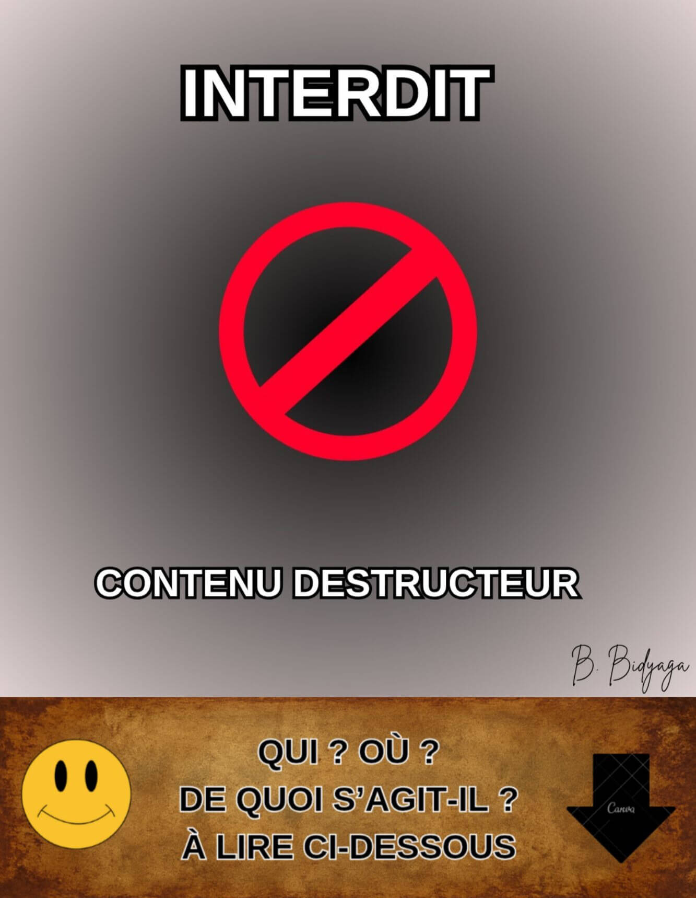
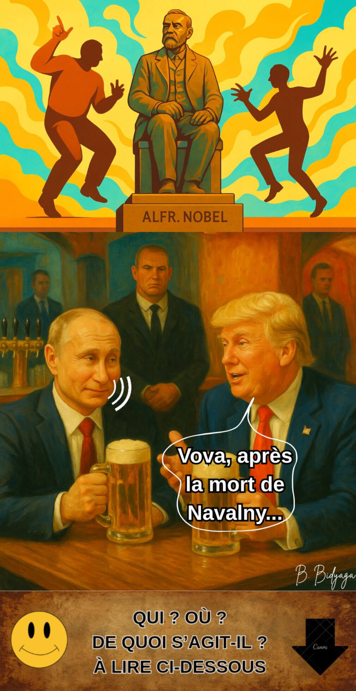
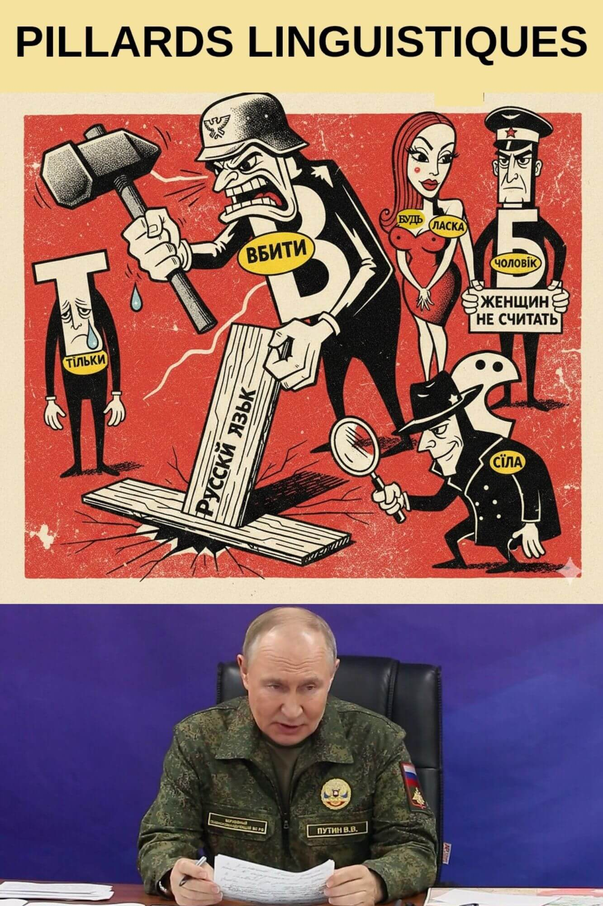
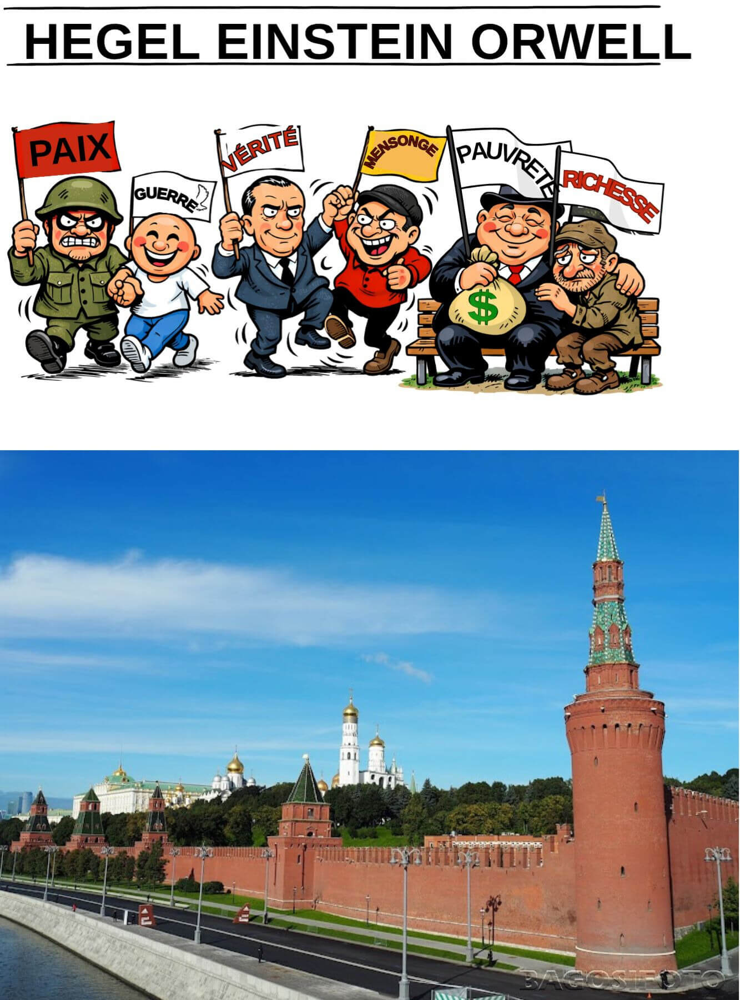
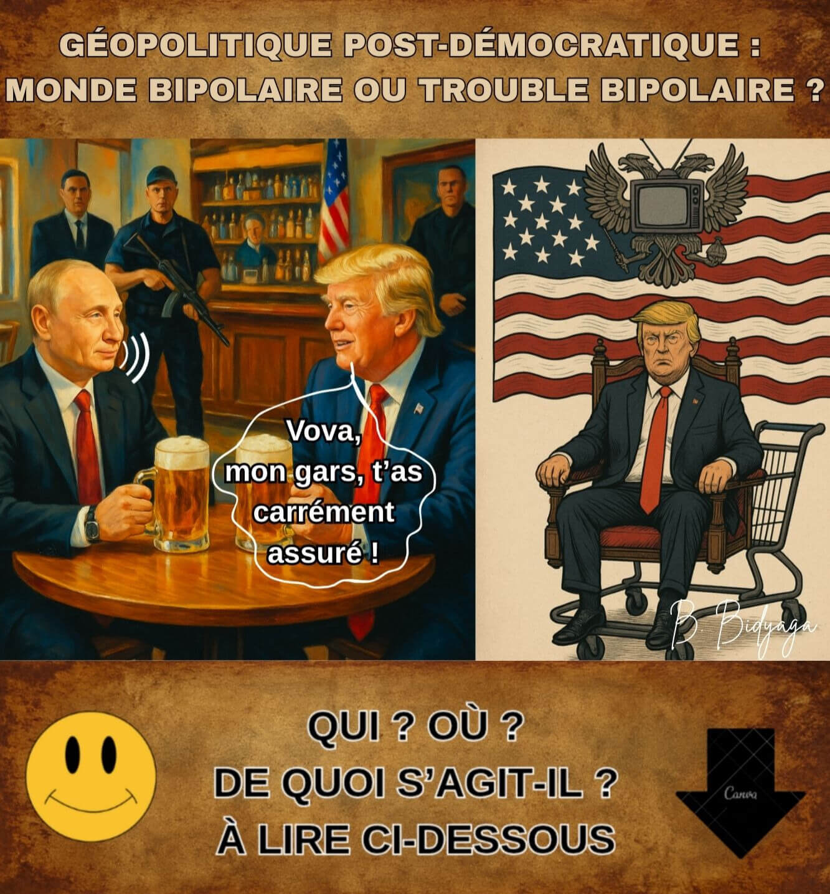
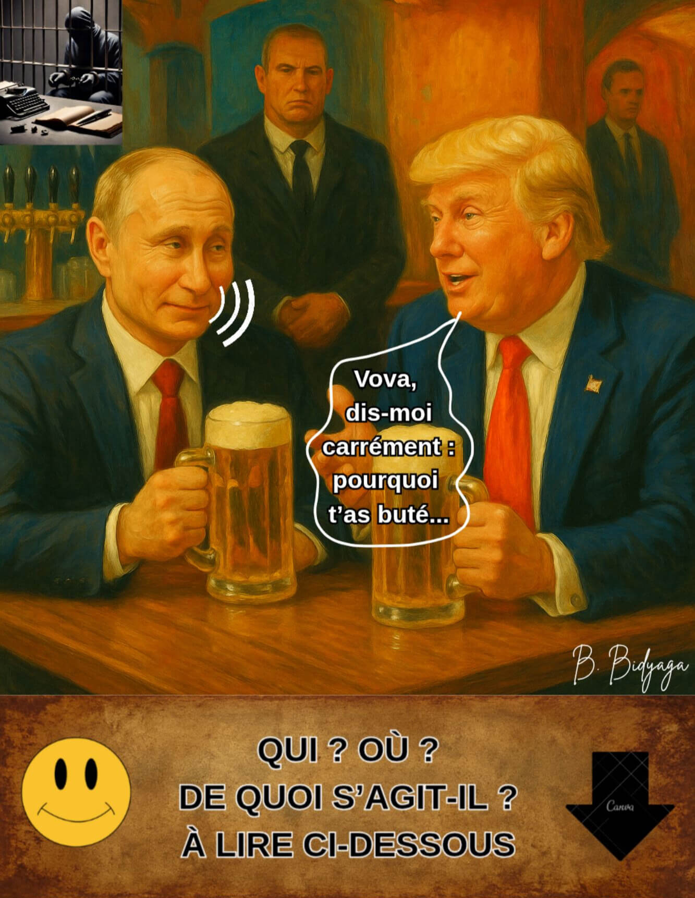

<meta name="robots" content="noindex, nofollow">

[**Page d'accueil**](index.md)

# DANS LA SALLE DES MILLE VÉRITÉS 
### LA SOURCE TOXIQUE DE LA RHÉTORIQUE POUTINEUSE

**Auteur : Olga Shcheglova (Boris Bidyaga)**

**SOMMAIRE** :

[1. Poutine dans la Salle des Deux Vérités : le jugement d'Osiris](pivo_fr.md#1-poutine-dans-la-salle-des-deux-vérités--le-jugement-dosiris)

[2. Une tête coiffée d'un chapeau, l'autre qui gouverne le pays](pivo_fr.md#2-une-tête-coiffée-dun-chapeau-lautre-qui-gouverne-le-pays)

[3. Les frasques Nobel](pivo_fr#3-les-frasques-nobel)

[4. L'immortalité merdique](pivo_fr.md#4-limmortalité-merdique)

[5.Opération d'infiltration culturelle](pivo_fr.md#5-opération-dinfiltration-culturelle)

[6. Au secours ! Les ennemis pillent la langue russe !](pivo_fr.md#6-au-secours--les-ennemis-pillent-la-langue-russe-)

[7. Bases scientifiques de la propagande](pivo_fr.md#7-bases-scientifiques-de-la-propagande)

[8. Manuel de Poutine : « 1984 » revisité](pivo_fr.md#8-manuel-de-poutine---1984--revisité)

[9. Le bar à potins de Trumpoutation](pivo_fr#9-le-bar-à-potins-de-trumpoutation)

[10. Les raisons de poutine : 35 excuses mortelles](pivo_fr#10-les-raisons-de-poutine--35-excuses-mortelles)

[11. Heureux les artisans de paix...](pivo_fr#11-heureux-les-artisans-de-paix)

[12. Un globe terrestre gras et parfumé pour action de grâce](pivo_fr#12-un-globe-terrestre-gras-et-parfumé-pour-action-de-grâce)

[13. L'affaire du siècle](pivo_fr#13-laffaire-du-siècle)

## 1. POUTINE DANS LA SALLE DES DEUX VÉRITÉS : LE JUGEMENT D'OSIRIS

> Temple sacré de l’Égypte ancienne. À l’intérieur – procédure bien connue du Jugement du dieu Osiris, décrite dans le « Livre des Morts ». Y participent :
> 
>  • Dieu Thot (secrétaire du tribunal, tablette d’argile en  mains)
>
>  • Dieu Anubis (expert criminalistique)
>
>  • Déesse Maât (accusateur)
>
>  • 42 dieux-jurés égyptiens (en masques de Hitler, Mussolini, Lénine, Staline, Beria, Brejnev, Jirinovski, Dracula, le Diable, autres figures historiques)
>
>  • Le président russe, Vladimir Poutine (l’accusé)
>
> Scène éclairée par les écrans de télévision diffusant les procédures judiciaires.
Poutine se tient près d’immenses balances de pharmacien. Sur un plateau : un cœur rouge en papier, gravure dorée « Poutine : 86 % ». L’autre plateau est vide, mais l’équilibre est parfait.

**Osiris** :

— Nous commençons la retransmission en direct du procès le plus juste de l'histoire de l'univers ! Aujourd'hui, sur la Balance de la Vérité — le sort du Grand Gardien des Valeurs Traditionnelles ! Mais d'abord... une petite publicité pour notre sponsor. Je vous présente : l'élixir de jeunesse « Ambre » !

(Pause publicitaire : la déesse Hathor boit la potion et rajeunit instantanément de 3000 ans. Voix off : « Ambre : une gorgée qui mène à l'Éternité. »)

**Osiris** (s'adressant à Poutine) :

— Vous faites confiance à ce tribunal ? Aucune objection concernant les juges ?

**Poutine** (avec un sourire narquois) :

— Oh, Votre Honneur ! Comment pourrais-je ! L'histoire des relations russo-égyptiennes... Nous avons maintes fois apporté notre aide... Annulé des dettes... Construit des centrales électriques... Le barrage d'Assouan... Une compréhension mutuelle totale...

**Osiris** :

— Bien sûr. Nous nous en souvenons. Le tribunal se retire en chambre de délibération.

(Tout le monde reste assis, comme avant.)

**Maât** :

— Je proteste ! Vous violez la procédure ! L'accusé n'a pas encore récité les 42 déclarations d'innocence devant les jurés : Je n'ai pas tué, pas volé, pas menti, pas falsifié les poids et mesures... etc.

**Osiris** (à contrecœur) :

— Hmm... Très bien. Accusé, racontez-nous votre autobiographie.

**Poutine** :

— Avec plaisir, Votre Honneur.
Je suis né comme un gamin ordinaire de Petersbourg — un élève moyen. Et par mon labeur persévérant, récoltant les fruits sur le terrain de l'État, j'ai grimpé jusqu'au sommet du pouvoir — je suis devenu président d'un grand pays. J'ai mené les politiques les plus humaines et les plus justes. Dans mes décrets, j'ai promis à chaque citoyen un appartement séparé, des soins médicaux et une éducation gratuits, des salaires élevés et une inflation zéro. J'ai établi une paix durable dans la belliqueuse République tchétchène. Je suis devenu le donateur le plus généreux au monde. J'ai construit 20 oléoducs et gazoducs. Mon gaz éclaire et chauffe la planète entière. J'aide les mouvements de libération nationale dans le monde entier — en leur fournissant des armes à prix réduit. Je distribue des prêts de milliards de dollars aux pays pauvres et j'annule leurs dettes quelques années plus tard. Je donne à la Chine mes ressources naturelles pour une bouchée de pain. Grâce à ma politique, le bloc de l'OTAN a considérablement élargi ses frontières. J'ai libéré le peuple ukrainien frère de la tyrannie du régime fasciste de Zelensky. J'ai arrêté le bain de sang en Ukraine.

(Une publicité apparaît à l'écran : « Du gaz dans chaque tombeau !  Que la vie ne s'arrête jamais ! »)

**Poutine** (regardant l'écran un instant, puis continue) :

— J'ai envoyé le premier homme dans l'espace. Mon compositeur de cour a écrit le chef-d'œuvre immortel « Le Lac des cygnes » [il exécute quelques pas de ballet sur la musique de Tchaïkovski]. Enfin, j'ai débarrassé le monde de Hitler et de sa dictature fasciste.
J'ai peiné comme un forçat sur les galères au poste de Président pendant 50 ans ! J'ai purgé une peine à perpétuité !
J'ai relevé mon pays de ses genoux. J'ai vendu les usines aux ouvriers et la terre aux paysans. J'ai créé la première armée du monde.
J'ai tendu la main et protégé de l'arbitraire mes compatriotes russophones à l'étranger : dans les pays baltes, en Asie centrale et dans le Caucase. Nous protégeons les droits et libertés des diasporas russes sur l'ensemble de l'ex-URSS.
L'espérance de vie dans le pays a considérablement augmenté : j'ai vécu jusqu'à 98 ans.
La médecine se développe à un rythme effréné : je suis mort non pas de maladie, mais d'ennui.
Le patriotisme de la jeune génération dépasse les limites : mon portrait est accroché dans chaque salle de classe. Les valeurs traditionnelles se renforcent. Nous n'avons que des mariages bisexués. Les divorces, les avortements, les préservatifs — sont interdits. Les lesbiennes et les gays sont privés de citoyenneté. Les opposants et les critiques du pouvoir sont en prison. Sur Terre, la paix ; parmi les hommes — une loyauté absolue. N'est-ce pas une idylle ? J'ai instauré dans mon pays une fête perpétuelle de la vie.

**Osiris** (souriant largement) :

— Assez. Vous êtes la quintessence de la vertu. Le tribunal se retire en chambre de délibération.

(Tout le monde reste assis.)

**Maât** (furieuse) : 

— Attendez ! Vous bafouez encore la procédure ! L'accusation n'a pas encore pu s'exprimer !

**Osiris** :

— Chère Maât, chaque chose en son temps. Un temps pour ramasser les pierres, un temps pour écouter des fables. Quand ce sera le moment pour vos fantaisies [s'écriant soudain], je vous le dirai ! Le tribunal se retire en chambre de délibération !

(Tout le monde reste assis.)

**Osiris** (après une pause) :

— Mesdames et Messieurs les jurés, veuillez voter...

**Maât** (avec fougue, brandissant ses plumes) :

— Je proteste ! Le réquisitoire n'a pas été entendu ! La pesée du cœur n'a pas été effectuée !

**Osiris** (sévèrement) :

— Chère Maât, le cœur de l'accusé a été pesé selon une procédure spéciale. Il a été jugé plus léger que votre plume. Car il est aussi pur qu'une larme de nourrisson à naître ! Anubis !

**Anubis** (sortant un procès-verbal pré-préparé de sous sa robe) :

— La balance indique zéro virgule zéro gramme. L'innocence est totale et absolue.

(Les plateaux de la balance se mettent soudain à osciller de haut en bas spontanément. Anubis attrape les plateaux, essayant de les équilibrer.)

**Osiris** (imperturbable) :

— Ce n'est rien : des perturbations solaires. Le mécanisme semble être... météosensible.

**Poutine** (regardant le vide au-dessus des têtes des dieux) :

— Les manigances des partenaires occidentaux dirigés par l'OTAN. Ils sont même parvenus jusqu'à l'Au-Delà. Encore une fois, ils empiètent sur nos liens spirituels.

**Osiris** (frappant le sol de son bâton) :

— Ainsi, Mesdames et Messieurs les jurés, votons. Confirmez-vous l'innocence totale de l'accusé ?

**Jurés** (à l'unisson) :

— Oui !

**Jirinovski** :

— Le cloner !

**Brejnev** :

— Lui décerner une décoration !

**Le Diable** :

— Le canoniser !

**Staline** :

— Nous sommes du même sang !

**Beria** :

— Je me prosterne devant vous, Maître !

**Mussolini** :

— Ravi de vous rencontrer, cher collègue !

**Dracula** :

— Tu sais sucer. Un des nôtres !

**Osiris** (ignorant les protestations de Maât) :

— Le tribunal annonce le verdict :
L'accusé est acquitté.

**Maât** (agitant une épaisse liasse de photos en l'air) :

— Êtes-vous fous ? Voici les preuves ! Meurtres ! Enlèvements ! Empoisonnements ! Guerres ! Attaques hybrides ! Falsifications !

(Les preuves apparaissent à l'écran mais disparaissent presque instantanément. L'écran est couvert de neige. Une minute plus tard, une image de Poutine devant la cathédrale du Christ-Sauveur apparaît, immédiatement remplacée par le dessin animé « Bidochon sur la Lune ».)

**Osiris** (souriant) :

— Dieux estimés ! Votons ! Qui est pour l'immortalité, la gloire et l'apothéose de l'accusé ?

(Les 42 dieux lèvent la main à l'unisson. Une publicité est diffusée : « Le nouveau sarcophage "Pharaon-Luxe" ! Trois coloris : granit noir, marbre blanc, Ruban de la Victoire »)

**Thot** (lisant la tablette d'argile) :

— Approuvé à l'unanimité ! La Mort est révoquée sur-le-champ, la Vie éternelle est accordée à compter de ce jour !  Le nom de Vladimir Poutine sera inscrit sur la page de titre du Livre des Morts en encre dorée !

**Poutine** (acquiesçant) :

— Je vous remercie. C'est notre victoire commune. Un merci particulier à mon fidèle chien, Anubis. C'est un bon garçon.

(Anubis remue la queue, gêné.)

**Maât** (au désespoir, laissant tomber ses plumes sur le sol) :

— Impensable ! Incroyable ! Je vais faire appel devant le Tribunal Intergalactique Martien !

(Elle est entraînée par des serviteurs à tête d'ours. La retransmission s'interrompt. L'écran montre des Cosaques qui dansent.)

**Thot** (refermant le dossier) :

— Merci à tous, vous êtes libres. L'audience est levée.

> **Commentaire culturologique**
> 
> La miniature est basée sur le mythe égyptien ancien du Jugement d'Osiris. Selon le « Livre des Morts », l'âme du défunt était amenée dans la Salle des Deux Vérités, où elle devait affronter :
> 
> — Osiris — dieu des enfers, juge président.
>
> — Maât — déesse de la vérité et de la justice, étalon de pureté.
>
> — Anubis — dieu à tête de chacal qui procédait à la pesée du cœur.
> 
> — Thot — dieu de la sagesse, scribe du tribunal.
>
> — 42 dieux-jurés — chacun responsable d'un péché spécifique ; le défunt devait jurer devant chaque dieu qu'il n'avait pas commis ce péché.
>
> La procédure principale — la pesée du cœur : le cœur du défunt était placé sur un plateau, et la plume de Maât sur l'autre. Si le cœur était « plus léger que la plume », l'âme était jugée pure et recevait la vie éternelle ; s'il était plus lourd, elle était annihilée.
Ce rituel symbolisait la justice absolue et l'impossibilité de tromperie.

#PoutinismeMilitaireOrthodoxe
                             👻   

## 2. UNE TÊTE COIFFÉE D'UN CHAPEAU, L'AUTRE QUI GOUVERNE LE PAYS

**Note : Illustration bloquée par la censure*.

Grand hall de conférence. Officiels en rangées.
Sur la scène, allongé, un homme politique mondialement connu. Nu.
Son pénis en érection est surmonté d’une réplique miniature de sa propre tête.
La petite tête prend la parole, d’une voix forte et pompeuse :

— Le taux de natalité dans le pays chute de manière catastrophique. Comme une pierre qui tombe dans un abîme. Je l'ai toujours dit et je le répète : les préservatifs et les avortements sont responsables de tout ! Et les LGBT. Et les Childfree. Nous devons combattre, combattre et encore combattre toute cette hérésie. Jusqu'à présent, les résultats sont médiocres.

Nous avons interdit les avortements. Et que s'est-il passé ? Maintenant, ils vont se faire avorter en Chine. Ou ils accouchent en Argentine et y restent vivre. Les préservatifs sont un mal universel. Les préservatifs sont une insulte personnelle à mon égard. Ils violent le droit fondamental de l'individu — le droit de procréer et de se multiplier. Garanti par la Constitution, soit dit en passant.

Nous avons interdit les préservatifs, les reconnaissant comme « symbolisme extrémiste ». Et alors ? Le marché noir des préservatifs prospère. Les manufactures clandestines d'articles en caoutchouc poussent comme des champignons après la pluie. Partout dans le pays. La propagande LGBT suinte de toutes les fissures. Que se passe-t-il ? C'est un échec complet dans la mise en œuvre de mes décrets. Je ne tolérerai pas cela.
Si l'appareil d'État ne peut pas forcer la population à faire des enfants — je forcerai l'appareil d'État à en faire.

Allumez enfin vos cerveaux. Et mettez-vous au travail.
N'avons-nous pas une banque de sperme ? N'avons-nous pas une banque d'ovocytes ?
Achetez les ovocytes de la population à un prix fixe. Pour finir, instaurez une taxe en nature — un ovocyte par mois au profit de l'État.

Mettez l'Académie des sciences à contribution — qu'ils créent un Incubateur militaire d'État. Nous élèverons de vrais patriotes de notre pays. Qui, dès leurs langes, auront appris par cœur le règlement militaire et les 10 commandements du Poutinisme. Nous les protégerons de l'influence néfaste des parents libéraux. Ce sera le bastion de notre future prospérité et de notre triomphe.
Deuxièmement. Mettez les généticiens à contribution. Le pays n'a pas besoin de femmes au foyer oisives et de toutes sortes de penseurs. Les gènes des générations futures doivent être les bons : patriotiques, mâles, guerriers.
Est-ce vraiment si difficile ? Agissez.

Nous allons ressusciter notre grande puissance et notre grande « deuxième armée mondiale ». Plus encore — nous la rendrons première !
À n’importe quel prix. Sur les cadavres des ennemis, à travers les larmes des mères, sur des terres réduites en cendres — nous avancerons sans faiblesse ni pitié. Nous écraserons toute résistance, nous broierons sous nos pas ceux qui oseront se dresser contre nous. Même s’il faut pour cela mettre le pays tout entier à genoux, nous le ferons. Que chacun sache : la volonté de l’État est de fer, et rien ni personne ne saura l’arrêter.

(Vifs et longs applaudissements.)

#PoutinismeMilitaireOrthodoxe
                                👻

## 3. LES FRASQUES NOBEL

Bar américain. Le président russe Vladimir Poutine et le président américain Donald Trump, attablés, bière à la main.

**Trump** :

— Vova, depuis que t'as réglé le cas Navalny, ton prétoire politique est tranquille comme Baptiste. Du billard. Que du bonheur.

**Poutine** :

— Arrête ton charre. Navalny ? Un moins que rien. Du vent. Un bateleur.

**Trump** :

— Alors pourquoi t'as démantelé toute son organisation ? Pour un moins que rien ?

**Poutine** :

— Écoute-moi bien, Donny. Navalny, il n'avait aucun programme. Il se contentait de rassembler des gamins dans la rue pour qu'ils braillent des insultes à mon encontre. Tu appelles ça un projet de société ?
Prends Lénine, lui : les usines aux ouvriers, la terre aux paysans. Ça, c'était un vrai programme. Lui ? Que des crachats. C'est d'un vulgaire.

**Trump** :

— Ouais, c'est con. Un vrai petit arriviste.

**Poutine** :

— Exact. De toute ma carrière, un seul homme m'a vraiment donné des sueurs froides : Boris Nemtsov. Un vrai politicien. Qui savait ce qu'il faisait.

**Trump** :

— Et du coup, tu l'as buté pour qu'il ne se présente pas ?

**Poutine** (ricanement) :

— Non. On ne l'aurait de toute façon pas laissé se présenter — la commission électorale s'en serait occupée. Et pour info, ce n'est pas moi qui ai donné cet ordre.

**Trump** :

— Mais enfin, Vova. Tout le monde sait que c'étaient tes services.

**Poutine** :

— On ne fait plus dans le spectacle sanglant. C’est d’un autre temps. À quoi bon les scandales et les flaques de sang quand on peut faire disparaître n'importe qui… proprement. En silence. N'importe qui. Même un président américain.

**Trump** (se tortille sur sa chaise) :

— Hé, doucement, Vova, cette guerre, c’est pas la mienne ! C’est du Biden, tout ça. Et moi, tu le sais, je suis ton pote. Ton pote.

**Poutine** (avec un sourire narquois) :

— Oui, oui. Je sais. Je te vois serpenter, jouer double jeu.

**Trump** (se justifiant) :

— Vova, je te jure, j’ai rien contre toi, perso. Franchement, je te comprends même. C’est juste que… je veux le Nobel !

**Poutine** (réfléchit à voix haute) :

— Un désir des plus légitimes. Je pense aussi… Pourquoi pas moi ?
Pourquoi ne prendrais-je pas le Nobel ? L’année prochaine, par exemple.

**Trump** (les yeux exorbités de surprise) :

— Toi ?!

**Poutine** (avec condescendance) :

— Donny, tout le monde a son prix. Certains coûtent moins cher que d’autres. Et quand ce n’est pas le cas… il y a d’autres méthodes. Menaces, kompromat, chantage… La machine est bien huilée.

(Un lourd silence s’installe.) 

**Poutine** (avec un sourire ironique et froid) :

—  Tu sais, le Nobel irait encore mieux sur ma poitrine que sur la tienne. Imagine les gros titres : « Poutine, criminel de guerre et lauréat Nobel ». C'est la preuve ultime de mon pouvoir sans limites sur le monde. C'est même plus cool que mon armée aux portes de Paris ! Voilà comment mettre cette Europe lâche à genoux et la baiser à fond !

**Trump** (prudemment) :

— Vova, et si… je prenais le Nobel d’abord... Et après tu peux faire ce que tu veux de cette Europe lâche. D’accord ?

**Poutine** (geste las de la main) :

— D'accord, soit. Toi d’abord, Donny. D’ailleurs, avant le Nobel, il faut déjà que je sois arrivé à Kiev…

#PoutinismeMilitaireOrthodoxe
                                👻

## 4. L'IMMORTALITÉ MERDIQUE

Russie, Moscou, Kremlin – bureau présidentiel. Le president russe, Vladimir Poutine avec son ami et conseiller scientifique, Mikhaïl Kovaltchouk. Sujet : les recherches sur l'immortalité.

**Poutine** (presque affectueusement) :

– Alors, professeur, raconte : où en est-on avec mon immortalité ?

**Kovaltchouk** (avec enthousiasme) :

– Il y a du progrès. Significatif. Nous travaillons actuellement sur un projet de conservation de tes... substrats bio-organiques.

**Poutine** (étonné) :

– Quoi ? Mes crottes viennent faire quoi dans cette histoire ?

**Kovaltchouk** (précipitamment) :

– Attends. Ne t'emballe pas. Écoute d'abord.

**Poutine** (avec condescendance) :

– Parle.

**Kovaltchouk** :

– La science a prouvé que la sublimation préserve l'ADN intact dans les excréments. Nous allons sublimer et conserver tes excréments et les compléter avec une pile de photos et un recueil de tes discours. Dans un futur lointain, une copie exacte de Vladimir Poutine sera recréée à partir de ton ADN en s'appuyant sur tes photos et tes prises de parole. Probablement imprimée en 3D. Hein ? Qu'est-ce que tu en dis ?

**Poutine** (pensif) :

– Une immortalité merdique. Une idée merdique. Bon, admettons, tu m'imprimes. Mais qui suis-je ? Personne. C'est un autre qui sera sur le trône. On me reprochera la guerre, les incendies, les explosions, les câbles, et tout le reste.

**Kovaltchouk** :

– Pour ça, je ne sais pas. Quel sera le régime politique en Russie à ce moment-là, impossible de le prévoir.

**Poutine** (avec conviction) :

– Voilà tout le problème. Il me faut une autre immortalité. Je veux que ce corps, mon corps actuel, me serve éternellement. Est-ce vraiment si compliqué à faire ?! Le cœur est usé – transplantation. Foie, reins – transplantation...  C'est simple comme bonjour !

**Kovaltchouk** (prudemment) :

– Mais chaque organe a une durée de vie – quatre-vingts ans maximum...

**Poutine** :

– Et bien prends le cœur d'un lycéen – frais émoulu. Quoi ? Un gamin, c'est trop précieux pour moi ?

**Kovaltchouk** (avec fougue) :

– Mais non ! Je suis prêt à te donner le mien...

**Poutine** (avec dégoût) :

– Le tien, non. J'ai que faire de ta ferraille rouillée ? Donne-moi un cœur jeune, avec tout son potentiel. Et dans 60 ans, tu m'en mettras un nouveau. Où est la difficulté ?

**Kovaltchouk** :

– À l'heure actuelle, la médecine ne garantit pas qu'un organe prenne. Les risques de complications sont élevés. Donc soit tu attends encore 20 ans, soit on conserve les excréments.

**Poutine** (grogne) :

– D'accord, soit, va pour la merde. Mais uniquement en solution de secours. Au pire, après ma... mort [il fait une grimace, comme s'il avait mal] ils se vendront aux enchères pour des millions. 

**Kovaltchouk** (souriant) :

– Oui. En Occident, la merde des puissants est très prisée. Un artiste italien, je crois qu'il s'appelait Mandzoni, vendait sa merde au prix de l'or. Et aujourd'hui, un petit pot de 30 grammes vaut des centaines de milliers d'euros.

**Poutine** (avec mépris) :

– Bah, si un misérable Italien chiait des lingots d'or – ma merde partira pour dix millions !

**Kovaltchouk** (flatteur) :

– Peut-être même plus !

**Poutine** :

– Mais attention ! Pas d’avarice ! 30 grammes ?! Mais c’est risible ! Je suis un pigeon, peut-être ?

**Kovaltchouk** (avec conviction) :

– Toi ? Non. T’es un faucon. Un aigle. Un milan. Un ptérodactyle.

**Poutine** (avec arrogance) :

– Exactement. Et ma merde doit être de la plus haute qualité. Raffinée. Désodorisée. Et qu'elle soit de couleur bleue. Sang bleu – merde bleue.

**Kovaltchouk** :

– Bien sûr, bien sûr. Première pression. Virgin Putin shit. Ou Putin virgin shit ? C'est lequel, le correct ?

**Poutine** (avec haine) :

– Libéré !

#PoutinismeMilitaireOrthodoxe
                                👻

## 5. OPÉRATION D'INFILTRATION CULTURELLE

Russie. Moscou. Salle des séances de la Douma d’État.
Le président russe, Vladimir Poutine, s’adresse aux députés.

— Chers députés ! Amis ! Camarades !
La situation géopolitique est montée à son paroxysme. Les ennemis de la Russie ne restent pas les bras croisés. L’Occident fait tout pour nous détruire. Surtout l’Europe. Surtout la France. La France a de tout temps été — et reste — notre principal adversaire. La France n’a cessé de porter atteinte à nos valeurs traditionnelles, cherchant à détruire notre patrimoine culturel, notre langue. Rappelons le XIXᵉ siècle, lorsque, à la suite d’une opération d’influence française, toute l’élite russe a parlé exclusivement français pendant des décennies. La langue russe s'est retrouvée au bord de l'oubli total et de l'extinction. Et si ce n’était le peuple russe profond, qui haïssait — à juste titre — tout ce qui était français, nous parlerions aujourd’hui français !

Oui, au XIXᵉ siècle les services secrets français ont échoué, mais aujourd’hui ils cherchent à prendre leur revanche.
Nos ennemis nous accusent soi-disant de mener une guerre hybride contre l’Occident. Mensonge éhonté ! Nous sommes un peuple pacifique. Mais les Français, eux, attaquent sans cesse notre culture, nos valeurs traditionnelles, notre langue. Ils ont infiltré la langue russe avec un véritable commando ennemi. Regardez combien de mots français nous avons — si habilement camouflés que les gens ne se doutent même pas que leur discours est truffé de mots-espions français.

Chauffeur, tableau, théâtre, chef-d’œuvre… Il y en a des milliers. On ne sait même plus : est-ce encore du russe ou déjà un dialecte du français ?
Mais « chauffeur », ce n’est encore rien. 
Mais ils infiltrent notre langue avec  des mots destructeurs tels que « président » et « révolution » ! Il s'agit là d'une diversion et d'une attaque flagrantes contre nos valeurs traditionnelles.
Quel est donc ce « président » ? Il n’y a jamais eu et il n’y aura jamais de « présidents » en Russie. Il n’y a que le tsar [il se frappe la poitrine]. Ou encore : « révolution ». Les révolutions et les guillotines pour les familles royales sont un phénomène purement français, totalement étranger à l’esprit russe. Et d’ailleurs, en Russie ces abominations n’existaient pas — jusqu’à l’apparition dans notre langue de ces mots-saboteurs.

Et c’est logique, camarades. Souvenez-vous de la Bible : « Au commencement était le Verbe ». Et ensuite seulement tout le reste. Cela signifie qu’il ne peut y avoir de révolution tant que le mot n’existe pas dans la langue. Exemple. En Union soviétique, il n’y avait pas de sexe — c’est un fait bien connu. Pourquoi ? Parce qu’il n’y avait pas le mot « sexe ». Mais dès que l’opportuniste Mikhaïl Gorbatchev a ouvert les frontières à la culture de masse occidentale, les mots « sexe », « gay », « lesbienne », « LGBT » sont arrivés — et après cela, la débauche et la sodomie ont fleuri en Russie.

La conclusion, camarades : si nous voulons éradiquer un phénomène étranger à notre culture, nous devons effacer de la langue le mot même qui le désigne. L’interdire par la loi, réécrire les dictionnaires, brûler tous les livres où ce mot apparaît. Tous les contrevenants doivent être poursuivis.

Et nos soi-disant « linguistes », qui qualifient timidement ces mots-espions d’« emprunts » ? C’est du sabotage, camarades, et nous devons y mettre fin. Ces mots-saboteurs s’assimilent d’abord, puis se multiplient et, finalement, évinceraient les mots russes originels. C’est une agression linguistique. Un génocide linguistique.
La justification des emprunts français dans la langue russe doit être assimilée à l’apologie du terrorisme. Juridiquement. De cinq ans à la perpétuité, selon le mot concerné.

Pour les mots neutres (chauffeur, revanche, chef-d’œuvre, théâtre) — cinq ans.
Pour « révolution » (atteinte à l’ordre constitutionnel) — dix ans.
Pour « président » (discrédit du dirigeant national) — quinze ans.

Mais le mot-saboteur français le plus perfide est « préservatif ». Nous avons vu de nos propres yeux comment, à la suite de l’expansion linguistique, notre marché a été littéralement inondé par ces articles diaboliques en caoutchouc. Français, d’ailleurs. Cette attaque sans précédent vise ce que nous avons de plus précieux — notre patrimoine génétique. C’est une bombe atomique démographique, camarades. Détruire les Russes avant même leur naissance. C’est l’arme de destruction massive la plus sacrilège et la plus raffinée.

Le mot « préservatif » doit être effacé de la langue russe. Nous devons l’arracher de notre vie. Son usage sous quelque forme que ce soit constitue un acte de haute trahison. À son plus haut degré. L’image d’un préservatif doit être assimilée à la démonstration de symboles extrémistes.

Et pour l’avenir.
Camarades ! Nous devons protéger strictement notre langue contre la pénétration des mots-saboteurs occidentaux. C’est la principale ligne de défense dans notre lutte pour la préservation des valeurs traditionnelles.

Merci de votre attention !

#PoutinismeMilitaireOrthodoxe
                                👻
                                
## 6. AU SECOURS ! LES ENNEMIS PILLENT LA LANGUE RUSSE !

Russie, Moscou, le Kremlin. Réunion du Conseil de sécurité de Russie. Président russe Vladimir Poutine prend la parole.

**Poutine** : 

— Camarades ! 

Aujourd'hui est un jour mémorable. Aujourd'hui, nous avons trouvé et formulé notre troisième — et principal — objectif de l'opération militaire spéciale. Ainsi, à partir de cet instant, je vous demande de mémoriser notre triade stratégique dans la lutte contre le régime fasciste ukrainien :

• Démilitarisation

• Dénazification

• Décolonisation (de langue Russe)

Camarades ! 

C'est avec une immense tristesse que je vous l'annonce : nous avons été frappés par une catastrophe d'une ampleur cosmique. L'ennemi, de manière insidieuse et secrète, dans notre dos et depuis des siècles, a tissé une toile mortelle dans laquelle nous nous sommes retrouvés, tout à fait par surprise pour nous-mêmes.

Camarades ! 

Nous accordons la plus grande attention à la défense de nos valeurs spirituelles et familiales. C'est merveilleux ! Cependant, nous avons totalement perdu de vue nos valeurs communicationnelles traditionnelles. Sémantiques et phonétiques.

Pourtant, notre langue, notre trésor national, subit depuis des siècles les assauts de pirates pillards de la part de la langue ukrainienne ! Ils volent nos mots russes traditionnels et ancestraux, les enlaidissent en changeant leur apparence phonétique et leur sémantique, et les utilisent dans leur langue sans notre consentement !

Ils nous ont volé nos préfixes et nos terminaisons, ils nous ont volé nos noms, nos adjectifs et nos verbes. Ils changent radicalement leur sens, ils massacrent leur prononciation. C'est une violation des droits d'auteur sur notre propriété intellectuelle ! Nous ne leur avons pas donné d'autorisation. C'est un délit pénal et une base pour exiger une compensation.

Mais c'est aussi une profanation de la langue russe. C'est un génocide de notre Fonds Linguistique. C'est un crachat méprisant au fond de notre âme.

Camarades ! 

Devant moi se trouve une œuvre en trois volumes compilée par notre linguiste en chef et spécialiste reconnu de la langue russe — Vladimir Dal. Y sont rassemblés tous les mots originellement russes, volés par la langue ukrainienne, des mots soumis à l'humiliation et à l'outrage, transformés en esclaves méprisables au service des communications de la clique fasciste ukrainienne.

Je ne veux pas parler sans preuves, camarades. Je vais vous citer des dizaines d'exemples de la manière dont nos nobles mots russes authentiques ont été grossièrement et sans ménagement bafoués, violés et comprimés dans le cadre étranger de la soi-disant langue ukrainienne.

• Voici le mot russe ***ubit'*** (tuer). Ils l'ont raflé et transformé en ***vbiti***. C'est une discréditation : on  enfonce (***vbiti*** ) un clou dans une planche, alors que nous, nous  tuons  (***ubit'*** ) les fascistes.

• Voici le mot russe ***tol'ko*** (seulement). Ils l'ont transformé en ***til'ky***. Pour une oreille russe, c'est insultant. De plus, remarquez qu'ils utilisent ici la lettre hostile de l'OTAN, le **"i"**. Avec un point ! Totalement étrangère à nos valeurs intellectuelles. Et saviez-vous qu'il existe dans la langue ukrainienne une lettre encore plus abjecte — le **"ï"** avec deux points ! C'est un symbole flagrant de dégradation et la quintessence de la rhétorique fasciste.

• Voici le mot russe ***tchelovek*** (être humain). Ils en ont fait ***tcholovik***,  et en plus ils ont changé la sémantique. Selon leur logique perverse, seuls les hommes appartiennent à la catégorie des « humains ». Les femmes, donc, ne seraient pas des êtres humains? C'est une discréditation de toute notre moitié féminine. Le comble de l'irrespect envers la femme russe !

• Voici le mot russe ***narushat'*** (violer/enfreindre). Ils y ont tout changé : le préfixe, le suffixe, la terminaison. Qu'est-ce que ça a donné ? Un hybride dégoûtant : ***porushuvaty***. C'est une insulte aux sentiments des croyants en la beauté et la grandeur de la langue russe.

• Voici le mot russe ***laska*** (caresse/tendresse). Un mot doux, gentil, innocent et chaleureux. Ils l'ont mis au service d'une propagande éhontée pour les jeux sexuels et la débauche ! Regardez plutôt ! ***Boud' laska*** ! Chez eux, cela signifie prétendument  ***s'il vous plaît*** . "Boud' laska, va au magasin". "Boud' laska, fais une omelette". Et ainsi de suite. À chaque pas, nous entendons ce  ***boud' laska***. Mais ce n'est rien d'autre qu'une invitation aux préludes sexuels : 

***boud' laska = caresse-moi*** !

C'est du harcèlement sexuel à l'état pur !

• Et le mot ***shkodit'*** ? Nous savons qu'il signifie commettre de mauvaises actions (faire des bêtises). Mais ils l'ont saisi et — pour nous narguer — l'ont élevé et ennobli. Chez eux, cela signifie ***endommager*** : « Fais attention à ne pas ***poshkod'*** le sac ! ». Comment comprendre cela ? C'est une discréditation de nos propres notions, camarades. Des notions sacrées.

Que ne font-ils pas avec nos mots !

• Ils déplacent les lettres dans des combinaisons historiquement établies : nous disons ***rozhdayetsya*** (naît), ils disent ***narodzhuyetsya***. Nous avons **"zhd"**, ils ont **"dzh"**. C'est une simple moquerie envers notre langue.

• Nous disons ***vsyo*** (tout), ils disent ***ousyo***.

 • Nous disons ***oulitsa*** (rue), ils disent ***voulytsya***.

• Nous disons ***krestit'sya*** (se signer/se baptiser), ils disent ***khrestytysya***. Ils nous imitent tout simplement ! Comme un singe au zoo.

• Et le bon vieux mot ***kakoy-niboud'*** (quelconque) ? Ils l'ont tout simplement défiguré ! Castré et inversé les parties du mot composé. Qu'est-ce que ça a donné ? Un charabia, une abracadabra : ***boud'-yakiy***.

Et ainsi de suite. Je le répète, j'ai entre les mains trois volumes épais énumérant tous les crimes de ce genre.

Nous avons consulté des spécialistes qui en sont venus à la conclusion que ce phénomène n'est rien d'autre qu'une colonisation de la langue russe dans le but de la discréditer, de l'avilir, de la parodier, de l'abêtir, de l'outrager, de causer des dommages graves à ses éléments structurels et, finalement, de l'anéantir.

Par conséquent, camarades, une nouvelle tâche s'impose à nous. Après quatre ans de lutte acharnée, nous avons obtenu la démilitarisation et la dénazification de la soi-disant Ukraine. Maintenant, une tâche non moins importante nous attend : la décolonisation de la langue Russe.

Nous devons arracher des griffes des fascistes nos mots bafoués, les ramener dans leur port d'origine et les réhabiliter.

Et nous déposons une demande reconventionnelle auprès du Tribunal international contre l'Ukraine pour réparation du préjudice réputationnel et linguistique. Si quelqu'un veut utiliser nos mots — qu'il obtienne une autorisation écrite et paie des redevances. Mais nous ne permettrons aucune violence, aucun outrage et aucun manque de respect envers nos symboles linguistiques et leurs sens sacrés.

 **Secrétaire du Conseil de sécurité, N. Patrouchev** : 
 
— Vladimir Vladimirovitch ! Je propose : de lancer une initiative de compensation entre cette plainte et la plainte de l'Ukraine contre la Russie pour réparation des dommages matériels causés par les hostilités. Nous inscrirons le même montant — 800 milliards d'euros.

**Poutine** : 

— La proposition est juste. Merci ! 
Ainsi, nous gagnons deux fois. Nous avons détruit la moitié de leur pays, et nous ne paierons pas un centime de réparations.

#PoutinismeMilitaireOrthodoxe
                                👻
                                

## 7. BASES SCIENTIFIQUES DE LA PROPAGANDE

Russie, Moscou, Kremlin. Président russe Vladimir Poutine s'adresse aux journalistes du pool de presse présidentiel.

**Poutine** : 

— Camarades ! 

Aujourd’hui, je souhaiterais aborder les principes fondamentaux de l’idéologie d’État russe. Nos ennemis nous accusent de dénaturer les idées et les faits, de renverser les concepts, les principes et la foi. Souvent, dans l’espace public, les mots « propagande mensongère » sont utilisés à notre égard.

C’est injuste, camarades. C’est un mensonge éhonté et une insinuation. Nous n’inventons rien et nous ne tolérerons aucune improvisation. Notre idéologie repose sur une approche strictement scientifique. Tout comme le marxisme-léninisme, notre idéologie découle logiquement des théories mondialement connues des plus grands penseurs de la civilisation humaine. Si les trois piliers de la doctrine communiste étaient Marx, Engels et Lénine, les trois piliers de notre idéologie sont Hegel, Einstein et Orwell.

La dialectique et la théorie de la relativité constituent le fondement scientifique  du cadre structurel de notre idéologie. Le roman « 1984 » est un exemple frappant de l'application pertinente de cette structure.

Notre monde repose sur des lois fondamentales :

• La gravitation universelle ;

• L'unité et la lutte des contraires (Hegel) ;

• Théorie de la relativité générale (Einstein).

Oui, chers camarades, tout dans ce monde est relatif : le bien et le mal s'entremêlent, les antagonistes vivent en symbiose. Lisez Hegel. Souvenez-vous d'Einstein.

Prenons, par exemple, la guerre et la paix. Le génial visionnaire Orwell fut le premier à découvrir cette vérité immuable : 

**LA PAIX, C’EST LA GUERRE** ; 

**LA GUERRE, C’EST LA PAIX**

 Et c’est vrai. Regardez : il y a actuellement la paix entre l'OTAN et la Russie. Pour l’instant. Je répète : pour l’instant. Mais que se passe-t-il dans les faits ? En réalité, une guerre hybride à grande échelle est en cours (cyberattaques, guerre des idées et des sens, sanctions économiques draconiennes, gel de nos actifs financiers, etc.) Et vous appelez cela « la paix » ?  Je tiens à souligner particulièrement la pratique ouvertement hostile des livraisons régulières d'armes de l'OTAN à l'Ukraine. Si les « HIMARS » de l'OTAN, bien que lancés depuis le territoire ukrainien, ont détruit des dizaines de mes raffineries de pétrole stratégiquement importantes, est-ce cela que vous appelez la paix ?

D’un autre côté, les guerres conventionnelles sont la paix en gestation. La guerre mène les peuples à la paix. Donnez la guerre aux gens, et ils deviendront immédiatement de fervents partisans de la paix. La guerre engendre la paix. Personne ne désire plus la paix que les soldats accroupis dans les tranchées. Ces soldats ne se battent pas pour des territoires — ils se battent pour la paix. Et plus la guerre devient cruelle, sanglante et destructrice, plus la paix issue de cette guerre sera solide et indestructible. 

**LA GUERRE, C’EST LA PAIX**, camarades. C’est un fait. Et il faut en tenir compte.

Une autre découverte géniale d’Orwell est l’axiome : 

**LA VÉRITÉ, C’EST LE MENSONGE** 

En effet, le constat de n'importe quel fait est subjectif. Tout dépend du point de vue de l’orateur, de l’interprétation et, en fin de compte, de la définition des concepts. Mais après tout, l’appareil conceptuel peut (et doit !) différer selon les cultures. Par exemple, l’Europe a ses propres notions du devoir, de la morale, des valeurs spirituelles ; nous avons les nôtres. De ce seul fait, nous ne pouvons pas avoir la même interprétation des faits qu'eux. Ce qu’ils appellent vérité est pour nous un mensonge. Et vice versa. C’est une évidence.

Quant au prétendu « réécriture » de l’histoire... Mais c’est l'évidence même, camarades. Le progrès technico-scientifique change radicalement notre vie, notre perception, nos points de vue ; il les change sous nos yeux. Nous disposons aujourd’hui de dix fois plus d’informations qu’il y a dix ans. L’intelligence artificielle offre d’immenses possibilités pour une analyse et une compréhension plus adéquates de l’histoire. Par conséquent, nous devons bien entendu adapter les manuels scolaires pour les étudiants et les écoliers. C’est une conséquence logique de l’informatisation totale de la société dans laquelle nous vivons.

De plus, l’approche dialectique nous conduit à reconnaître cette vérité manifeste : 

**LA DÉFENSE, C’EST L’ATTAQUE**

Prenons notre héroïque opération militaire spéciale. Oui, c’est désormais une guerre à part entière. Une guerre pour la paix dans le monde. Mais rappelons-nous comment tout a commencé. L’OTAN préparait ouvertement une invasion de notre pays par l’armée ukrainienne. Si, le 24 février 2022, nous n’avions pas envahi le territoire de l’Ukraine, nous serions aujourd'hui en train de nous défendre contre l’ennemi sur notre propre sol. Nous avons agi avec sagesse : nous avons porté à l’ennemi une riposte préventive. Nous avons ainsi sauvé des milliers de vies et des centaines d’infrastructures civiles de la mort et de la destruction. Comme vous le voyez:

 **L’ATTAQUE EST UNE DÉFENSE**

 À l’état pur.

Ainsi, camarades, résumons. Le front le plus important de notre confrontation avec l’Occident est idéologique. Dans votre activité professionnelle, vous ne devez pas seulement désavouer la propagande ennemie — vous devez savoir prouver à l’électorat le bien-fondé scientifique de notre idéologie d’État. Je vous ai donné quelques exemples convaincants. C’est une base que vous pouvez développer et approfondir à l’infini.

Agissez, camarades ! 

La victoire sera nôtre !

#PoutinismeMilitaireOrthodoxe
                                👻    

## 8. MANUEL DE POUTINE : « 1984 » REVISITÉ

Russie, Moscou, le Kremlin. Réunion des chefs des organes de la sécurité d'État et de l'ordre public. Président russe Vladimir Poutine prend la parole.

**Poutine** : 

— Camarades ! 

Qui d'entre vous a lu l'œuvre magistrale du grand écrivain britannique ***George Orwell, « 1984 »*** ? Personne ? Lisez-le. C’est notre guide pratique.

Ce cher camarade Orwell y a décrit un système de gestion étatique totalitaire assez efficace. Bien sûr, au milieu du siècle dernier, il ne pouvait même pas rêver, même en songe, des technologies dont nous disposons aujourd'hui. De ce fait, son système est assez lourd, gourmand en ressources et coûteux. Mais peu importe — il fonctionne à merveille ! Même dans des conditions de retard technologique.

Mais le plus important, camarades, ce sont ses idées totalitaires immortelles : ***la doublepensée, la réécriture de l'histoire, la Police de la Pensée***.

Nous lui avons déjà emprunté quelques éléments que nous appliquons avec grand succès. Mais, comme on dit, il y a encore une marge de progression.

Avant tout, nous devons introduire dans notre jurisprudence le concept de ***crime de pensée***. Ce concept découle logiquement de nos valeurs traditionnelles. Rappelez-vous les sermons du Christ : si tu as convoité la femme de ton frère, tu as déjà commis l'adultère. Ainsi, selon les dogmes de notre Église orthodoxe, la pensée même du péché devient un péché. C'est un saut métaphysique majeur que nous avons le devoir de mettre au service de la sécurité de notre État.

Finalement, ***le crime de pensée*** n’a été inventé ni par nous, ni même par Orwell — il a été inventé par le Seigneur Dieu Lui-même.

Qu'est-ce que cela signifie pour nous en pratique ?

Premièrement : la police doit se doter d'une unité spéciale — ***le Département de Pureté des Pensées***. En clair, cette fameuse ***Police de la Pensée*** orwellienne.

Deuxièmement : il est nécessaire de remanier nos codes pénal et administratif en y introduisant des sanctions pour ***les crimes de pensée***.

Et le plus important — nous devons organiser le travail pratique au sein de la population.

Consultons notre guide pratique. Dans le pays mythique de l'Océanie, les dissidents étaient identifiés grâce à une surveillance constante des citoyens via des soi-disant ***télécrans***. Contrairement à l'Océanie, qui, si j'ai bien compris, était un paria sur la scène internationale, la Russie est l'un des plus grands acteurs géopolitiques et doit respecter au moins un semblant de décence élémentaire. Par conséquent, nous ne pouvons pas violer ouvertement des droits fondamentaux tels que le respect de la vie privée.

De plus, ***les télécrans*** sont utiles comme outils d'intimidation, mais pour débusquer les pensées secrètes, il faut des méthodes secrètes. Personne n'avouera une hérésie en sachant qu'il est sur écoute et épié.

Nous avons déjà fait un grand — un immense — pas dans cette direction : nous avons développé et déployé la messagerie sans alternative **MAX**, qui permet de surveiller discrètement les communications de nos citoyens. 

Mais ! Quand un agent de l'étranger descend dans la rue, tient un piquet de grève solitaire ou publie des appels antipatriotiques sur Internet — c'est déjà un stade avancé de déviation idéologique. À ce niveau, on ne soigne plus, on punit par l'emprisonnement.

D'ailleurs, vous savez, je propose de considérer la dissidence comme une maladie évolutive. Si nous parvenons à la diagnostiquer à un stade précoce, il y a de très bonnes chances, grâce à de simples procédures correctives, de guérir une personne à jamais.

C’est pourquoi notre attention doit se porter en priorité sur les enfants.

Certes, nous avons déjà généralisé les cours des « **Discussions sur l’essentiel** ». C'est parfait — nous inculquons les bonnes idées à nos enfants. Mais il nous faut un retour d’information ! Qu'avons-nous pour l'instant ? Des questionnaires pour étudiants ? C'est absolument inefficace. Cela revient à attendre les aveux d'un agent de l'étranger devant ***un télécran***.

Il nous faut une solution systémique, globale. Et elle est à portée de main.

Que faisons-nous ? Nous installons dans les jardins d'enfants, les écoles et autres établissements d'enseignement une écoute permanente. Pas de vidéosurveillance — non. C'est cher et inutile. Nous n'avons pas besoin des visages — seulement des conversations et d'un système de reconnaissance vocale. C'est plus simple и moins coûteux. Et cela se fait clandestinement.

Ensuite, l'intelligence artificielle analyse les informations arrivant sur le serveur et livre le résultat final : 

« Piotr Belkine, élève de CE2 à l'école n°212, n'est pas fiable ; hier, à la récréation entre le deuxième et le troisième cours, il a prononcé un mot offensant à l'adresse du Président. »

Ensuite, le département des mineurs s'occupe de Piotr : une correction idéologique indolore, comme vous savez, quand on utilise des bagues dentaires pour corriger la position des dents d'un enfant qui poussent de travers. Et tout comme pour les dents tordues — à l'âge enfantin, une telle correction idéologique est encore possible.

Et soit dit en passant, le petit Piotr, une fois adulte, ne pourra que nous être reconnaissant de l'avoir aidé, dans son enfance, à se débarrasser de ses pensées impures, le sauvant ainsi de la prison.

Bien entendu, l'écoute totale doit être pratiquée dans toutes les institutions publiques — là, nous ne violons aucune loi. En accord avec les propriétaires d'entreprises privées, nous installons également des écoutes dans leurs établissements et bureaux. S'ils refusent de coopérer... vous savez comment les convaincre.

Notre objectif final, camarades, est de bâtir une société harmonieuse — une société fondée sur les principes d'homogénéité, de conformisme, de solidarité et de cohésion.

Pour que je n'aie plus, lors de ma « Ligne directe » avec le peuple, à mentir en affirmant qu'en Russie les agents de l'étranger ne subissent pas de poursuites pénales.

En réalité, nous ne poursuivrons plus les dissidents — pour la simple et bonne raison qu'il n'y aura plus de dissidents chez nous.

#PoutinismeMilitaireOrthodoxe
                                👻                    

## 9. LE BAR À POTINS DE TRUMPOUTATION

Bar américain. Le président russe Vladimir Poutine et le président américain Donald Trump, attablés, bière à la main.

**Trump** :

— Vova, mon pote, t’as carrément assuré — vingt-cinq ans au pouvoir ! Putain, comment t’as fait ?

**Poutine** :

— Fastoche. J’ai réécrit la Constitution.

**Trump** :

— Et personne t’a viré ?

**Poutine** :

— On a monté le coup. On a fabriqué un virus mortel, on l’a balancé partout.
Boum — pandémie !

On a foutu une putain de trouille à tout le monde, et boum — plus de contestation.
J’avais aussi l’état d’urgence dans ma manche, au cas où. J’en ai même pas eu besoin.

L’opposition ? Des branlos. Faibles comme des chatons. C’est eux qui gueulaient « Enfermez-nous plus ! » Tu te la fais, celle-là ?
Pathétique. Tout le monde restait chez soi, tremblant pour sa santé.
Bref, plus personne n’en avait rien à foutre de la Constitution.

**Trump** :

— Mec, c'est ouf. Du génie ! J'adorerais faire ça aussi... Mais bon, on a ce petit truc qu'on appelle la démocratie.

**Poutine** :

— Je te plierais ta démocratie comme une paille en papier, Donnie.

**Trump** :

— Non, sans déc’ ?

**Poutine** :

— Mortel. D’abord : dézingue la séparation des pouvoirs. Direct à la poubelle. Tu te montes une belle grosse verticale.
Les flics et les fédéraux — tes gros bras. Les tribunaux — ton soutien.
Et le dossier, Donnie, le dossier sur tout le monde. T’as pas de dossier ? T’en inventes.
C’est comme ça que tu tiens la boutique.

Et souviens-toi : loyauté, loyauté, loyauté. Ensuite : purge, purge, purge.
Des procès spectacles — pour le show.
Et boum, t’es intouchable.

Ensuite, tu bourres tout le monde avec ton évangile. Écoles, télé, TikTok. « Make America Great Again » — tu le fais tatouer sur tous les murs si faut.

Je branderais tout le foutu pays :
TraMérique.
TrÉconomie.
TraMode.
Tu colles ton nom sur tout — les Américains ils kiffent ce truc.

Deux partis ? Oublie. Démocrates, Républicains — le même cirque, des clowns différents, ils changent juste de costard tous les quatre ans.
Monte ton propre parti : le TrumParti. Gros, bruyant, orange.

Putain, fais ton slogan plus gros : MAGA — FAGA.
« Faisons l’Amérique Géniale À nouveau : Félicité À tous. Gloire à Dieu. Alléluia ! »

**Trump** :

— FAGA ! Vova, c’est trop mortel. J’adore.

**Poutine** :

— Tu vois ? Ça marche.
Et quand ils commenceront à se faire chier — déclare la guerre au Canada. Dégotte un empire amérindien perdu. Grand Serpent Chingachgook — Maître de toute l'Amérique.
Boum — t’as ton histoire, tes frontières, ta guerre.
Nouvel État, nouvelles élections, nouveaux mandats.

**Trump** :

— Mec, c’est du génie. T’es un génie, Vova.

**Poutine** :

— Exactement. Tu prends la moitié du globe, je prends l’autre.
Tu seras le Seigneur des Méridiens, je serai le Seigneur des Parallèles.

Deux rois, une planète. Santé, Donnie.

#PoutinismeMilitaireOrthodoxe
                                👻

## 10. LES RAISONS DE POUTINE : 35 EXCUSES MORTELLES

Bar américain. Le président russe Vladimir Poutine et le président américain Donald Trump, attablés, bière à la main.

**Trump** :

— Vova, dis-moi carrément : pourquoi t’as buté Navalny ? Il était vraiment si dangereux que ça pour toi ?

**Poutine** :

— Donnie, tu veux ma mort ou quoi ?!
Ses cotes étaient proches du néant. Pourquoi j’aurais eu peur d’un type comme lui ?

**Trump** :

— Alors je pige pas…

**Poutine** :

— Faut que tu comprennes, Donnie. Il me cassait les pieds. Il me rendait dingue. Rien que d’entendre son nom ma tension montait. Je supportais pas l’idée de vivre dans le même pays que lui, de respirer le même air. Je lui ai donné la possibilité de partir — il est revenu. Pourquoi ?

**Trump** :

— Et ensuite tu l’as fait supprimer ?

**Poutine** :

— Donnie, sois pas aussi vulgaire. Je l’ai juste fait enfermer.  Pour délits financiers. Un voleur, ça va en prison, Donnie. J’ai pas raison ?

**Trump** :

— Alors pourquoi il est mort ?

**Poutine** :

— Quinze maladies chroniques, Donnie. Même l’herpès. Avec une liste pareille, personne tient longtemps.

**Trump** :

— T’aut’ que ça ? Mais il était encore jeune !

**Poutine** :

— C’est ce que mes gars m’ont dit, Donnie.
Vingt trucs. Dont la prostatite. Les mêmes qui ont traité le dossier Magnitsky — des pros, des vrais. Mon équipe de choc.

**Trump** :

— C’est la première fois que j’entends ça, Vova. Même Fox me l’a pas dit !

**Poutine** :

— Nous non plus, on ne savait pas. Mais après l’autopsie — boum ! Vingt-cinq maladies. Même la sciatique. Un vieux débris.

**Trump** :

— Incroyable, juste incroyable. Il avait l’air en bonne santé !

**Poutine** :

— Donnie, si tu me crois pas, j’ai les papiers. Certificats, dossiers médicaux, rapports d’autopsie… tout est clean. Trente affections, Donnie. Dont des calculs biliaires. Il était pourri de l’intérieur.

**Trump** :

— Alors comment il a fait pour tenir trois ans en prison ?

**Poutine** :

— Il avait neuf vies, Donnie. Comme une chatte. Même le « Novitchok » ne lui a rien fait. Un sacré spécimen. Imagine-toi — trente-cinq pathologies chroniques. Et des poux ! C’était pas un homme, c’était un cadavre ambulant !

**Trump** :

— Alors pourquoi tu rends pas ses affaires — documents, enregistrements — à la veuve ? Si tout est si réglo ?

**Poutine** :

— Donnie, mes gars ont peur que ça atterrisse encore entre les mains des Allemands. Et tu connais les Allemands — ils sont capables de sortir des « preuves » de nulle part. On a pas besoin d’un nouveau fiasco du "Novitchok".

**Trump** :

— Et pourquoi tu changes de version sans arrêt ? D’abord c’était l’arythmie, maintenant c’est l’empoisonnement ?

**Poutine** :

— Bévue locale. Un petit enquêteur perdu au fin fond du Yamal. A écrit n’importe quoi, il savait pas lire entre les lignes.

(Après un petit silence :)

**Poutine** :

— Alors, il a tragiquement succombé à une allergie rare liée au froid. Tout à fait naturel, rien de suspect, évidemment.

**Trump** (à part, avec un sourire en coin) :

— Les Tables de la FSB ? Commandement n°1 : Nie l'évidence.

(Silence)

**Trump** (gaiement, à Poutine) :

— Allez, assez de ces trucs déprimants. Allons boire une bière, ça nous redonnera le moral.

**Poutine** :

— À nous !

#PoutinismeMilitaireOrthodoxe
                                👻

## 11. HEUREUX LES ARTISANS DE PAIX...

Un bar américain. Le président russe Vladimir Poutine et le président américain Donald Trump attablés, bières à la main.

**Trump** :

— Cette histoire d'Ukraine, elle me reste sur l'estomac, je te jure. Une vraie boulette. Je commence presque à regretter de m'être fourré dans votre petite guéguerre. Mon mandat se termine, et si je n'accroche pas le Nobel de la Paix d'ici là, je deviendrai le président le plus « nul » et le plus « haï » de l'histoire des États-Unis. Le fiasco total.

(Un temps)

**Trump (sur le ton de la confidence)** :

— Allez, Vova, fais-moi ce plaisir. J'ai mis tous tes points dans l'accord, tous sans exception. Pote, signons ce traité de paix ! C'est un deal en or pour toi. Et pour moi ? C'est la gloire, enfin. Celle que je mérite.

**Poutine (froid, détaché)** :

— Donnie, moi aussi j'ai une image à sauver. Il me faut le Donbass. Je l'ai déjà ficelé dans la Constitution, territoire russe légitime. Et puis, j'ai lâché un million de vies pour ce foutu Donbass. Il faut que je le serve sur un plateau à mon électorat. Le Donbass, c'est la victoire. Pas de Donbass — pas de victoire. Et tous ces morts, ce sera pour des prunes.

**Trump (baissant la voix, complice)** :

— Écoute, Vova, rien ne t'empêche de relancer la machine dans deux ou trois ans... mais seulement quand je serai parti ! Tu montes un coup : une attaque ukrainienne sur ta residence. Dans la région de Tver, au fin fond d'une réserve. Mais fais-le proprement. Si tu accuses, il faut des preuves solides. Le Reichstag doit vraiment flamber. Fais décoller des drones depuis leur territoire. Craque ton palais préféré, et pour faire bonne mesure, crampe cent hectares de forêt ancienne avec. Montre aux journalistes des bestioles rares du Livre Rouge, bien carbonisées. Bref, fabrique-nous un casus belli qui tienne la route.

**Poutine (dubitatif)** :

— Oui, mais tu donnes des garanties de sécurité à l'Ukraine. Si des journalistes un peu trop curieux grattent et découvrent la mise en scène, l'OTAN pourrait me sortir l'Article 5.

(Un silence)

**Poutine (d'un ton qui ne discute pas)** :

— Il me faut des garanties d'impunité, Donnie. Réelles.

**Trump (acquiesçant d'un hochement de tête)** :

— Évidemment. Et tu les as déjà, Vova. Les garanties les plus fiables, ce ne sont pas les bouts de papier ; c'est la parole d'honneur entre deux gentlemen.

Vova, repense à l'après-URSS. L'Ukraine avait des « garanties en béton », non ? Et qu'est-ce qui s'est passé ? Quelqu'un l'a protégée de toi ? Personne. Alors pourquoi des nouvelles « garanties » marcheraient différemment ? Moi, personnellement, je ne mettrai jamais les pieds dans ta baston avec l'Ukraine. Surtout si tu « brûles ton Reichstag ». Regarde Obama, regarde Biden — ils flippaient à l'idée d'un conflit ouvert avec la Russie. Les States ne se battront jamais si leurs propres intérêts ne sont pas en jeu.

**Poutine (sceptique)** :

— Et l'Europe ?

**Trump (avec mépris)** :

— L'Europe ?! Ne me fais pas rire. 
Ils n'iront jamais se jeter dans la gueule du loup. Surtout depuis que tu as montré ta stratégie gagnante : noyer l'ennemi sous les corps de tes soldats. En Europe, ils ont une sensiblerie sur la vie humaine. Pour les armes, ils ne les enverront aux Ukrainiens que jusqu'à ce qu'ils aient rebâti leur propre défense. Tu crois qu'ils le font par bonté d'âme ? Tu déconnes ?  Ils veulent que l'Ukraine fasse écran. Qu'elle garde leurs frontières au prix de sa propre peau.

Alors, t'as zéro raison de t'inquiéter. Gelons la ligne de front actuelle. Toi, tu as un besoin urgent de souffler et de moderniser ton matos. Et puis, ta propre économie tire la langue. Dans deux ans, tu reviens avec des forces neuves.

**Poutine** :

— Et je dis quoi à mon peuple ?

**Trump** :

— Quoi, tu dis ? Que les objectifs de l'opération spéciale — dénazification et démilitarisation — sont atteints. Le Donbass est « pratiquement intégralement » libéré. Ne te perds pas dans les chiffres. « Pratiquement intégralement », ça sonne triomphal. Les droits des russophones sont garantis. Quelle défaite ? De quoi tu parles ? C'est une victoire incontestable. Phase Un. Ensuite, une fois que j'aurai mon Nobel et que je serai sorti, tu pourras aller chercher la victoire totale, finale. Allez, Vova ! Fais pas ton malin, accepte le deal !

#PoutinismeMilitaireOrthodoxe
                                👻
                                
## 12. UN GLOBE TERRESTRE GRAS ET PARFUMÉ POUR ACTION DE GRÂCE

Le président des États-Unis Donald Trump donne une interview aux journalistes. Le président russe Vladimir Poutine participe via vidéoconférence.

**TRUMP** :

— Messieurs ! Le moment est venu d’agir. Le Groenland est, historiquement, une terre américaine. Les Danois l’ont peuplé de Dieu sait qui. Des Inuits ? Mais ce sont des Jésuites déguisés, envoyés par le Vatican ! Des intrigants rusés. Des parasites et des saboteurs.

Premièrement : où ont-ils mis cette belle petite herbe verte qui a donné son nom à l’île ? Ils l'ont bouffée. Et pas seulement l'herbe. Regardez bien : il y a un an à peine, je mesurais ce territoire sur la carte — selon Mercator, le Groenland était deux fois plus grand ! Ils ont dévoré la moitié de l'île !

Non seulement ils ont gelé tout le pays et l'ont recouvert d'un glacier — mais ils en détachent des morceaux de glace pour les foutre dans leur whisky ! C'est de l'autodestruction, de l'anthropophagie ! Ils ont aussi bouffé tout leur secteur de la défense — il ne reste plus que deux attelages de chiens dans l'armée groenlandaise ! C'est un crime contre l'humanité... enfin, contre la « caninité ».

En tant que Grand protecteur de la nature et des animaux, je ne peux pas l’autoriser. Je proclame 2026 l'année des Grandes Annexions. Rendons le Groenland à nouveau vert ! MGGA !

Messieurs, le Groenland sera à nous ! Nous franchissons l'étape ultime de la piraterie géopolitique : MAGGGA ! 

**MAKE AMERICA GREAT,**
**GREENLAND GREEN — AGAIN !**

Nous ferons du Groenland un gazon de golf verdoyant. Et l'Amérique baignera dans les dollars verts. Win-win.

Groenlandais ! Réfléchissez bien. Soit vous venez dans mes bras par amour, et alors chacun recevra une casquette rouge avec le logo MAGGGA, soit je fais fondre toute votre glace avec un chalumeau. D'une manière ou d'une autre, vous finirez par dériver vers moi. Que ce soit sur vos coquilles de noix ou sur le dernier bloc de glace restant.

Mais quand vous viendrez me demander l'asile, je vous foutrai tous en détention — que chacun prouve d'abord qu'il n'est pas un agent étranger du Danemark ou du Vatican. Et qu'il prête serment et reçoive la marque de mon portrait au fer rouge sur l'omoplate gauche.

MAGGGA ! Hourra ! 

Que les States soient toujours là, 

Que le vert soit toujours là,

Que le soleil soit toujours là, 

Que Le Trump soit toujours là !

(Les journalistes s'en vont. )

**POUTINE** (via vidéoconférence) : 

— Donnie ! Laisse-moi t'embrasser ! Tu es mon élève le plus assidu. Tu as assimilé mes leçons à 200 %. Ta saisie éclair du pétrole vénézuélien — enfin, je voulais dire : du dictateur Maduro — est la plus haute manifestation d’un génie stratégique. Ce Maduro est un sacré fasciste, pire encore que Zelensky. Le pétrole l'a corrompu. Le pétrole et le pouvoir, voilà ce qui gâte les gens. Tu as bien fait de le dégager de son trône. Et regarde comme toute cette racaille s'est mise à te respecter d'un coup. Même cette moins que rien de Machado veut soudain te filer un Nobel.

Mais quels vieux débris, ces types d'Oslo ! Ils ont décidé d'« annuler » l'économie de marché. Conneries ! Il y a l'offre, il y a la demande — il y a le deal. Le marché secondaire a toujours existé et existera toujours. Le marché noir non plus, personne ne l'a supprimé. Alors, Donnie, quand tu auras acheté ton Nobel, fais-le moi savoir — on arrosera ton nouveau titre.

Et quand ils t'annonceront ton impeachment, viens t'installer en Russie, via le programme « Citoyenneté contre délires traditionnels »... euh, je voulais dire : « valeurs traditionnelles ». Et n'oublie pas d'emporter le Top 10 des secrets du Pentagone.

Mais n'aie crainte — je ne vais pas te loger à côté de Ianoukovitch. Je ferai de toi mon Premier conseiller pour l'Ukraine. Tous ces Patrouchev, Choïgou, Guerassimov, Douguine — des voleurs minables. Ils ne savent pas s'arrêter : le fric, le fric, le fric. Toi, tu n'es pas comme ça, Donnie, tu es un homme d'action. Tu ne cours pas après le pognon — tu en as déjà bien assez.

Ensemble, Donnie, nous allons briser les reins de cette foutue Ukraine. J'aurai ma gloire, tu auras les terres rares. Ensuite, ce sera la Moldavie, la Géorgie, l'Arménie et le Kazakhstan. On ne restera pas les bras croisés. Il ne s'agit pas de la grandeur de l'Amérique ou de la Russie. Il s'agit du rôle de l'individu dans l'histoire.

Imagine que tu te tiens devant le globe comme devant une dinde d'Action de Grâce, grasse et parfumée. Et dans tes mains, tu tiens une lame acérée. Toi et moi, comme deux génies du mal, nous écrivons l'histoire, Donnie. Avec du sang. Comme il sied aux grands Créateurs.

#PoutinismeMilitaireOrthodoxe
                                👻

## 13. L'AFFAIRE DU SIÈCLE

Bar américain. Le président russe Vladimir Poutine et le président américain Donald Trump, attablés, bière à la main.

**Poutine :**

— Alors, Donny, où en est ton petit projet groenlandais ?

**Trump** (vexé) :

— C'est le trou noir ! Tu te rends compte, Vova ? Ils refusent le cadeau ! L'Amérique, la plus grande nation de l'histoire, et ces minables osent dire non ? Ils devraient tomber à genoux pour nous remercier. À la place, ils font les fiers-à-bras. Mais ils se prennent pour qui, à résister à MOI ? Moi, le plus grand artisan de la paix que le monde ait jamais porté ? Les gens sont cons, je l'ai compris il y a des années. Je veux leur bien, et eux, par pure mesquinerie — t'imagine ? — ils envoient un « contingent militaire ». Vingt et un types ! Vingt et un ! (Il ricane) Oh là là, j'ai la trouille !

**Poutine :**

— Tu marques un point, Donny. Le peuple... il ne distingue jamais son intérêt. Il faut parfois... le guider vers le bonheur à coups de trique. Enfin, je veux dire, vers un avenir radieux. Comme des gamins qu'on mène à l'école. C'est comme ça.

**Trump :**

— Exactement ! Si je ne récupère pas le Groenland — et c'est une affaire en or, au passage — qui va les protéger ? De la menace, tu vois ? La menace russe, la menace chinoise... (Il lève la main) Sans rancune, Vova, c'est du business, on est potes. Mes experts bidons me sortent : « Monsieur le Président, plus de sous-marins russes depuis des lustres. » Pathétique ! Et alors ? Ils sont peut-être très doués pour se cacher, tes sous-marins. On ne les voit pas aujourd'hui, et PAF ! dix demain ! Vingt ! Ça pourrait être une centaine ! C'est une faille de sécurité inacceptable !

**Poutine** (un fin sourire aux lèvres) :

— Vexé ? Allons, Donny. Tu l'as dit : rien de personnel, que de la géopolitique. Un simple échange. Tu veux le Groenland. Je veux le Donbass. J'ai les sous-marins... Tu as une certaine... emprise sur M. Zelensky. Et soyons francs, tu tiens l'Union européenne dans le creux de ta main. La conjoncture est... idéale.

**Trump** (les yeux brillants) :

— Waouh. Vova, attends. Tu dis que... tu le ferais ? Pour moi ? Tu balancerais tes sous-marins sous le nez de l'OTAN et tu claquerais des millions en carburant, juste pour m'aider à conclure mon deal ? C'est énorme !

**Poutine** (avec un sourire condescendant de connaisseur) :

— On appellera ça l'entente du siècle, mon cher. Alors, tu préfères quoi ? Une discrète escadrille d'une dizaine de sous-marins en patrouille au large ? Ou on passe à la démonstration de force ? Un petit exercice de « tourisme subaquatique » sur l'une de leurs plages ?

**Trump** (avec ferveur, baissant la voix) :

— Vova. Écoute-moi bien. Ce qu'on a... c'est plus qu'un tandem. C'est un fait historique. Toi et moi, on n'est pas le yin et le yang, on est les deux faces de la pièce qui va remporter la partie. On n'est pas une transition, on est une révolution. Ensemble... on ne change pas la météo, on change les lois de la physique ! Les océans obéissent, les continents bougent. Un murmure devient un ordre. Le monde entier... il est pas juste à genoux. Il retient son souffle, le cœur battant, pour voir notre prochain move. C'est le plus grand spectacle, et la scène est à nous.

**Poutine** (ricanant, un éclair d'amusement sincère dans le regard) :

— C'est poétique. Et rentable. Aux architectes du monde nouveau, Donny. On se ressert ?

#PoutinismeMilitaireOrthodoxe
                                👻
                              

[**Liste des fondations caritatives en soutien à l’Ukraine**](fr_funds)

[**Page d'accueil**](index.md)

