[**Полный архив проекта**](index.md)

## Щеглова Ольга (Борис Бидяга)
# В ЧЕРТОГЕ ТЫСЯЧИ ИСТИН
### Пиво, сделки, семантика распада и биохимия власти

**ОГЛАВЛЕНИЕ**:

[1. Путин в Чертоге Двух Истин: Суд Осириса](pivo_ru#1-путин-в-чертоге-двух-истин-суд-осириса)

[2. Одна голова — чтобы шапку носить. Другая — чтоб страной руководить](pivo_ru#2-одна-голова--чтобы-шапку-носить-другая--чтоб-страной-руководить)

[3. Нобелевские пляски](pivo_ru#3-нобелевские-пляски)

[4. Дерьмовое бессмертие](pivo_ru#4-дерьмовое-бессмертие)

[5. Культурный десант](pivo_ru#5-культурный-десант)

[6. Караул! Враги разворовывают русский язык!](pivo_ru#6-караул-враги-разворовывают-русский-язык)

[7. Научные основы пропаганды](pivo_ru#7-научные-основы-пропаганды)

[8. Настольная книга Путина](pivo_ru#8-настольная-книга-путина)

[9. Трампутация под пиво](pivo_ru#9-трампутация-под-пиво)

[10. Путиница: 35 хронических подтасовок](pivo_ru#10-путиница-35-хронических-подтасовок)

[11. Блаженны миротворцы...](pivo_ru#11-блаженны-миротворцы)

[12. Жирный и ароматный земной шар на день благодарения](pivo_ru#12-жирный-и-ароматный-земной-шар-на-день-благодарения)

[13. Сделка века](pivo_ru#13-сделка-века)

## 1. ПУТИН В ЧЕРТОГЕ ДВУХ ИСТИН: СУД ОСИРИСА

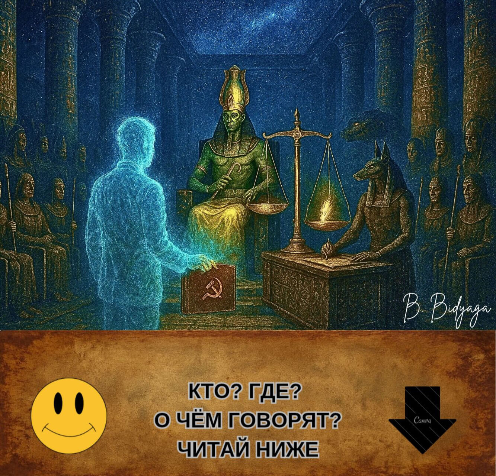

> Священный древнеегипетский храм. Внутри  проходит известная из "Книги мертвых"  процедура Суда египетского бога Осириса. В ней также участвуют:
> 
> • Бог Тот (секретарь суда, с глиняной табличкой в руках)
>
> • Бог Анубис (эксперт-криминалист)
>
> • Богиня Маат (обвинитель)
>
> • 42 египетских Бога-присяжных (в масках Гитлера, Муссолини, Ленина, Сталина, Берии, Брежнева, Жириновского, Дракулы, Дьявола и других исторических персонажей)
>
> • Президент России Владимир Путин (подсудимый)
>
> Зал освещён мерцающими телеэкранами, на которых транслируется судебное заседание. Путин стоит у громадных аптекарских весов; на одной чаше весов — красное бумажное сердце с золочёной гравировкой «Путин: 86%». Другая чаша пуста, тем не менее чаши уравновешивают друг друга.

**Осирис**:

— Начинаем прямой эфир самого справедливого суда в истории мироздания! Сегодня на весах Истины — судьба Великого Хранителя Традиционных Ценностей! Но сначала — реклама нашего спонсора. Прошу: эликсир молодости «Амбре»!

(Рекламная пауза: богиня Хатхор пьёт напиток и тут же молодеет на 3000 лет. Закадровый голос: «Амбре: глоток, ведущий в Вечность».)

**Осирис** (обращаясь к Путину):

— Суду доверяете? Отводов не будет?

**Путин** (с лёгкой улыбкой):

— Ну что Вы, Ваша честь! Как можно! История российско-египетских отношений... Мы неоднократно оказывали помощь... Прощали кредиты... Строили электростанции... Асуанская плотина... Полное взаимопонимание...

**Осирис**:

— Конечно. Мы помним. Суд удаляется в совещательную комнату.

(Все сидят на своих местах, как сидели.)

**Маат**:

— Я протестую!  Вы нарушаете процедуру! Подсудимый ещё не произнес 42 клятвы перед присяжными: не убивал, не воровал, не лгал, не подделывал меры весов... И так далее.

**Осирис** (неохотно):

— М-м... Ну ладно. Подсудимый, расскажите нам свою автобиографию.

**Путин**:

— Охотно, Ваша честь. Я родился обычным петербургским пацаном — среднестатистическим троечником. И сам, своим упорным трудом, пожиная плоды на государственной ниве, вскарабкался на вершину власти — стал президентом великой страны. Я проводил самую гуманную и справедливую политику. В своих указах я обещал каждому гражданину отдельную квартиру, бесплатную медицину и образование, высокую зарплату и нулевую инфляцию. Я установил прочный мир в воинственной Чеченской республике. Я стал самым щедрым донором для всего мира. Я построил 20 нефте- и газопроводов. Мой газ освещает и обогревает всю планету. Я помогаю народно-освободительным движениям по всему миру — снабжаю их оружием по льготной цене. Я раздаю миллиардные кредиты бедным странам и через пару лет аннулирую их долги. Я отдаю Китаю свои природные ресурсы за бесценок. Благодаря моей политике блок НАТО существенно расширил свои границы. Я освободил братский украинский народ от тирании фашистского режима Зеленского. Я остановил кровавую бойню в Украине...

(На экране транслируется реклама: “Газ — в каждую усыпальницу!”)

**Путин** (секунду смотрит на экран, затем продолжает):

— Я запустил первого человека в космос. Мой придворный композитор написал нетленный шедевр "Лебединое озеро" [исполняет несколько балетных па под музыку Чайковского]. Наконец, я избавил мир от Гитлера  и его фашистской диктатуры. Я пахал, как раб на галерах, на посту Президента 50 лет! Я отсидел пожизненный срок!  Я поднял свою страну с колен. Я продал фабрики рабочим, а землю — крестьянам. Я создал первую армию мира. Я протянул руку помощи и защитил от произвола русскоязычных собратьев за рубежом: в Прибалтике, Средней Азии и на Кавказе. Мы охраняем права и свободы русских диаспор на всей территории бывшего СССР. В стране резко увеличилась продолжительность жизни: я дожил до 98 лет. Медицина развивается быстрыми темпами: я умер не от болезней, а от скуки. Патриотизм молодого поколения зашкаливает: в каждом школьном кабинете висит мой портрет. Традиционные ценности укрепляются. Браки — только двухполые. Разводы, аборты, презервативы — запрещены. Лесбиянки и геи лишены гражданства. Противники и критики власти сидят в тюрьме. На земле мир, в человеках — полная лояльность. Это ли не идиллия? Я устроил в своей стране вечный праздник жизни.

**Осирис** (широко улыбаясь):

— Достаточно. Вы — квинтэссенция добродетели. Суд удаляется в совещательную комнату.

(Все сидят на своих местах.)

**Маат** (гневно):

— Подождите! Вы опять нарушаете... Обвинитель ещё не сказал свое слово!

**Осирис**:

— Уважаемая Маат, всему свое время. Время собирать камни, время слушать басни. Когда придет время для Ваших фантазий [неожиданно срывается на крик], я Вам об этом скажу! Суд удаляется в совещательную комнату.

(Все сидят на своих местах.)

**Осирис** (после паузы):

— Господа присяжные, прошу голосовать...

**Маат** (вскакивает, потрясая перьями):

— Я протестую! Ещё не выслушана сторона обвинения! Ещё не проводилось взвешивание сердца!

**Осирис** (строго):

— Уважаемая Маат, сердце подсудимого было взвешено в особом порядке, оно признано более лёгким, чем Ваше перо. Ибо оно чисто, как слеза нерождённого младенца! Анубис!

**Анубис** (достаёт из-под ризы заранее подготовленный протокол):

— Весы показывают ноль целых, ноль десятых грамма. Невиновность полная и 
абсолютная.

(Чаши весов вдруг начинают самопроизвольно колебаться вверх и вниз. Анубис хватается за чаши, пытаясь их уравновесить.)

**Осирис** (невозмутимо):

— Ничего страшного: пертурбации на Солнце. Механизм, знаете ли... метеозависимый.

**Путин** (глядя в пустоту над головами богов):

— Происки западных партнёров во главе с НАТО. Уже до Загробного Мира добрались. Снова покушаются на наши духовные скрепы.

**Осирис** (стучит жезлом в пол):

— Итак, господа присяжные, голосуем. Подтверждаете ли вы полную невиновность подсудимого?

**Присяжные** (хором):

— Да!

**Жириновский**:

— Клонировать!

**Брежнев**: 

— Представить к награде!

**Дьявол**:

— Причислить к лику святых!

**Сталин**:

— Мы с тобой одной крови!

**Берия**:

— Преклоняюсь, Учитель!

**Муссолини**:

— Рад знакомству, коллега!

**Дракула**:

— Сосать умеешь. Наш человек!

**Осирис** (игнорируя протесты Маат):

— Суд оглашает приговор: подсудимый оправдан. 

**Маат** (тряся в воздухе толстой пачкой фотографий):

— Да вы в своем уме? Вот доказательства! Убийства! Похищения! Отравления! Войны! Гибридные атаки! Фальсификации!

(На экране появляются доказательства и почти сразу исчезают. Экран покрывается мелкой рябью. Через минуту на экране возникает изображение Путина на фоне Храма Христа Спасителя, тут же сменяющееся мультиком  "Незнайка на Луне".) 

**Осирис** (с улыбкой):

— Уважаемые боги! Голосуем! Кто за бессмертие, славу и апофеоз подсудимого?

(42 бога дружно поднимают руки. Транслируется реклама: «Новый саркофаг "Фараон-Люкс"! Три расцветки: чёрный гранит, белый мрамор, георгиевская лента»)

**Тот** (зачитывая с глиняной таблички):

— Принято единогласно! Смерть  отменяется, даруется вечная жизнь! Имя Владимира Путина будет вписано в Книгу Мёртвых золотыми чернилами на титульной странице!

**Путин** (кивая):

— Благодарю. Это наша общая победа. Отдельное спасибо моему верному псу, Анубису. Он хороший мальчик.

(Анубис смущённо виляет хвостом.)

**Маат** (в отчаянии, роняя перья на пол):

— Уму непостижимо! Невероятно! Я подаю апелляцию в Марсианский Межгалактический суд!

(Её утаскивают под руки служители с головами медведей. Трансляция обрывается. На экране — танцующие казаки.)

**Тот** (закрывая папку с делами):

— Всем спасибо, все свободны. Заседание окончено.

> *Культурологический комментарий*
> 
> В основе миниатюры лежит древнеегипетский миф о Суде Осириса. Согласно «Книге мёртвых», душа умершего приводилась в Чертог Двух Истин, где её ждали:
>
> — Осирис — бог загробного мира, председатель суда.
>
> — Маат — богиня истины и справедливости, эталон чистоты.
>
> — Анубис — бог с головой шакала, проводивший взвешивание сердца.
>
> — Тот — бог мудрости, секретарь суда.
>
> — 42 бога-присяжных — каждый отвечал за один из грехов; умерший должен был публично поклясться перед каждым богом, что не совершал ни одного из них.
>
> Главная процедура — взвешивание сердца: на одну чашу весов клали сердце умершего, на другую — перо Маат. Если сердце было «легче пера», душа признавалась чистой и получала вечную жизнь; если тяжелее — её ждала гибель.
Этот ритуал символизировал абсолютную справедливость и невозможность обмана.

#ПравославныйВоенныйПутинизм
                                👻   
                                

## 2. ОДНА ГОЛОВА — ЧТОБЫ ШАПКУ НОСИТЬ. ДРУГАЯ — ЧТОБ СТРАНОЙ РУКОВОДИТЬ 

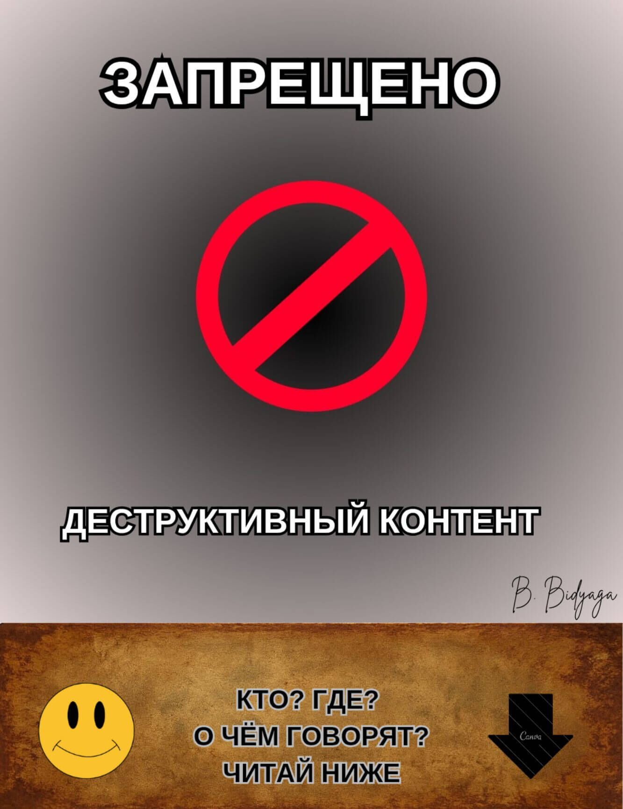

**Примечание: иллюстрация заблокирована цензурой.*

Просторный  конференц зал. В зале сидят чиновники. Большая освещённая сцена, в центре которой лежит на спине хорошо известный всему миру политический деятель. Его гениталии полностью обнажены, его  детородный орган, находящийся в состоянии эрекции, венчает миниатюрная, но точная копия его головы (той что на плечах). Маленькая головка лежащего на сцене политика обращается к сидящим в зале с громкой и пафосной речью:

— Рождаемость в стране падает катастрофически. Как падает в пропасть камень, брошенный с горы. Я всегда говорил и повторяю ещё раз:
во всем виноваты презервативы и аборты! И ЛГБТ. И Чайлдфри. Со всей этой ересью надо бороться, бороться и ещё раз бороться. Пока что у нас это получается плохо. 

Мы запретили аборты. И что? Теперь они едут делать аборты в Китай. Или рожают а Аргентине и остаются там жить. Презервативы — это вселенское зло. Презервативы — это личное для меня оскорбление. Они нарушают базовое право личности — право плодиться и размножаться. Закреплённое в Конституции, между прочим. 

Мы запретили презервативы, признав их «экстремистской символикой». И что же? Черный рынок презервативов процветает. Подпольные мануфактуры резинотехнических изделий растут как грибы после дождя. По всей стране. ЛГБТ пропаганда лезет наружу изо всех щелей. Что происходит? Это полный провал реализации моих указов. Я этого не потерплю. 
Если государственный аппарат не может заставить подконтрольное ему население рожать — я заставлю рожать государственный аппарат.

Включайте наконец ваши мозги. И начинайте работать.
Разве у нас нет банка спермы? Разве у нас нет банка яйцеклеток?
Покупайте яйцеклетки у населения по твёрдой цене. В конце концов, введите натуральный налог — 1 яйцеклетка в пользу государства ежемесячно. 

Подключите Академию наук — пусть сделают государственный военный Инкубатор. Мы воспитаем истинных патриотов нашей страны. С пелёнок заучивших военный устав и 10 заповедей путинизма. Мы убережем их от тлетворного влияния родителей-либералов. Это будет оплот нашего будущего процветания и триумфа.

Второе. Подключите генетиков. Стране не нужны праздные домохозяйки и всякие там мыслители. Гены у будущих поколений должны быть правильные: патриотичные, мужские, воинственные.
Разве это так сложно? Действуйте.

Мы возродим нашу великую державу и нашу великую "вторую армию мира". Более того — мы сделаем ее первой!
Любой ценой. Через трупы врагов, через слёзы матерей, через разорённую землю! Даже если для этого придется поставить на колени всю страну — мы сделаем это. Не сомневайтесь: воля государства железная, и ничто и никто ее не остановит.

(Бурные продолжительные аплодисменты.)

#ПравославныйВоенныйПутинизм
                                👻

## 3. НОБЕЛЕВСКИЕ ПЛЯСКИ

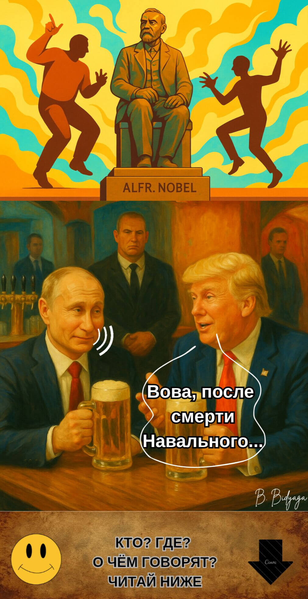

Американский бар. Президент России Владимир Путин и Президент США Дональд Трамп сидят за столиком, пьют пиво и мирно беседуют.

**Трамп**:

— Вова, после смерти Навального твое политическое поле — прям конфетка в золотой обёртке. Тишь да гладь да божья благодать.

**Путин**:

— А-а, ерунда. Навальный — это был политический ноль. Пшик. Продавец воздуха.

**Трамп**:

— Зачем же ты тогда ликвидировал всю его организацию? Если он был полный ноль?

**Путин**:

— Слушай, Донни. У Навального не было никакой повестки — просто собирал на улицах толпы подростков и орали хором оскорбительные кричалки в мой адрес. Это что, повестка? Возьми, к примеру, Ленина — у того действительно была повестка: фабрики — рабочим, землю — крестьянам. А у этого — одни только оскорбления, причем непечатные. Это же просто неприлично.

**Трамп**:

— Согласен, это глупо. Этакий политический  выскочка. 

**Путин**:

— Вот именно. За всю мою историю был только один человек, которого я реально боялся, — Борис Немцов. Настоящий политик, с опытом и повесткой. 

**Трамп**:

— И ты убил его, чтобы он не выдвинул свою кандидатуру на выборах?

**Путин**:

— Нет. И нет. До выборов мы бы его по любому не допустили — ЦИК отказал бы в регистрации. И второе — я не отдавал приказа о его ликвидации.

**Трамп**:

— Но по всем признакам, его расстреляли спецслужбы.

**Путин**:

— Громкие убийства мы уже давно не практикуем. Это 20-й век. К чему эти кровопролития с международными скандалами, когда можно прикончить человека тихо-спокойно, без шума и пыли. Любого, хоть президента США.

**Трамп** (суетливо):

— Вова, это не моя война! Это все Байден. А я — твой друг, ты же знаешь.

**Путин** (снисходительно):

— Да знаю, знаю. Вижу, как ты ужом извиваешься и ведёшь двойную игру.

**Трамп** (оправдываясь):

— Вова, ну честное слово: против тебя лично я ничего не имею, и твои мотивы я очень даже понимаю. Я просто хочу Нобелевку!

**Путин** (размышляет вслух):

— Вполне законное желание. Я и сам подумываю, не взять ли мне Нобелевку? Скажем, в следующем году.

**Трамп** (выпучив от удивления глаза):

— Ты?!

**Путин** (снисходительно):

— Все люди продажны, Донни. Просто у кого-то цена пониже, у кого-то повыше. А нет — так можно применить и другие методы: угрозы, компромат, шантаж...
Система давно отлажена.

(Пауза)

**Путин** (с иронией):

— И, между прочим, на моей груди Нобелевка будет смотреться ещё круче, чем на твоей. Представляешь, сенсация: военный преступник Путин — нобелевский лауреат! Это лучшее доказательство моей безграничной власти над миром. Это даже круче, чем моя армия под стенами Парижа! Вот так поставить раком  эту трусливую Европу  и отыметь по полной программе!

**Трамп** (осторожно):

— Вова, давай всё-таки сначала я получу Нобелевку, а потом уже ты будешь ставить эту трусливую Европу на колени. А?

**Путин** (ворчливо):

— Ладно, так уж и быть. Ты первый, Донни. Тем более перед Нобелевкой мне надо успеть дойти до Киева...

#ПравославныйВоенныйПутинизм
                                👻

## 4. ДЕРЬМОВОЕ БЕССМЕРТИЕ 

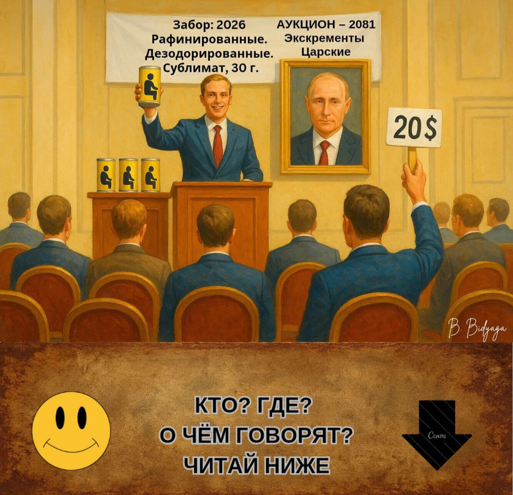

Россия, Москва, Кремль. За столом в кабинете сидят: президент России Владимир Путин и Михаил Ковальчук, старый друг Путина, ныне курирующий исследования в области продления жизни и замедления старения.

**Путин** (почти ласково):

– Ну, профессор, докладывай: как продвигаются дела с моим бессмертием?

**Ковальчук** (с энтузиазмом):

– Подвижки есть. Значительные. Сейчас прорабатываем проект с консервацией твоих... биоматериалов.

**Путин** (удивлённо):

– Что? При чём здесь какашки?

**Ковальчук** (торопливо):

– Погоди. Не суетись. Выслушай сначала.

**Путин** (милостиво): 

– Говори.

**Ковальчук**:

– Наука доказала, что при сублимации в экскрементах сохраняется полноценная ДНК. Мы сублимируем и консервируем твои какашки и комплектуем их стопкой фотографий и собранием твоих речей. В далёком будущем по твоей ДНК и с опорой на твои фотографии и образцы твоих выступлений будет воссоздана точная копия Владимира Путина. Вероятно, напечатана на 3D-принтере. А? Что скажешь?

**Путин** (задумчиво):

– Дерьмовое бессмертие. Дерьмовая идея. Ну напечатал ты меня. А кто я такой? Никто. На престоле-то сидит другой человек. Сразу припомнят мне и войну, и поджоги, и взрывы, и кабели, и всё прочее. 

**Ковальчук**:

– Насчёт этого не знаю. Какой к этому моменту в России будет политический строй, предугадать невозможно.

**Путин** (с нажимом):

– В том-то и дело. Мне нужно другое бессмертие. Я хочу, чтобы вот это, моё, теперешнее тело служило мне вечно. Неужели так сложно это сделать?! Износилось сердце – трансплантация. Печень, почки – трансплантация... Это же элементарно!

**Ковальчук** (осторожно):

– Но у каждого органа есть срок службы – не более восьмидесяти лет...

**Путин**:

– А ты возьми сердце у школьника – вчерашнего выпускника. Что тебе – жалко для меня какого-то пацана?

**Ковальчук** (с жаром):

– Что ты! Я тебе своё сердце готов отдать...

**Путин** (брезгливо):

– Твое не надо. На кой черт мне твой ржавый хлам? Ты дай мне сердце молодое, с ресурсом. А через 60 лет поставишь новое. Что тут сложного?

**Ковальчук**:

– На сегодняшний день медицина не даёт гарантии, что орган приживется. Вероятность осложнений довольно высока. Так что либо жди ещё лет 20, либо консервируем какашки.

**Путин** (ворчливо):

– Ладно, так уж и быть. Давай свои какашки. Но только как запасной вариант. В крайнем случае после моей... смерти [кривится, как от боли] можно будет продать с аукциона.

**Ковальчук** (с улыбкой):

— Да. На Западе ценится дерьмо сильных мира сего. Один итальянский художник, кажется его звали Мандзони, продавал свое дерьмо по цене золота. А сейчас такая 30-граммовая баночка стоит сотни тысяч евро.

**Путин** (презрительно):

— Ну если какой-то паршивый итальяшка испражнялся золотыми слитками — мое дерьмо уйдет с молотка за десять миллионов!

**Ковальчук** (льстиво):

— А то и больше!

**Путин**:

— Только чур! Не жадничать! 30 грамм?! Да это курам на смех! Что я, голубь, что ли?

**Ковальчук** (убежденно):

— Ты? Нет. Ты сокол. Орёл. Коршун. Птеродактиль.

**Путин** (высокомерно):

— Вот именно. И мое дерьмо должно быть высшего качества. Рафинированное. Дезодорированное. И пусть будет голубого цвета. Голубая кровь — голубое дерьмо.

**Ковальчук**:

– Конечно, конечно. Первого отжима. Virgin Putin shit. Или Putin virgin shit? Как правильно?

**Путин** (с ненавистью):

– Свободен!

#ПравославныйВоенныйПутинизм
                                👻
                                
## 5. КУЛЬТУРНЫЙ ДЕСАНТ

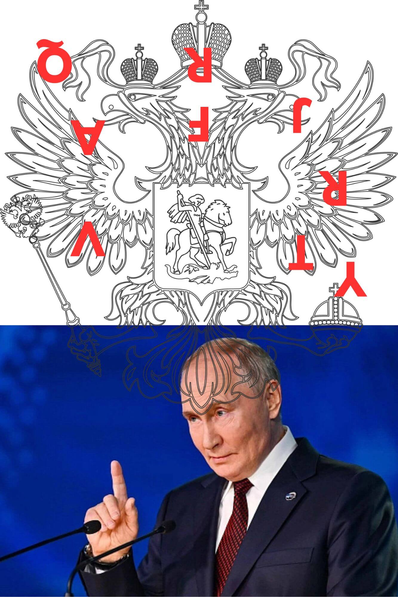

Россия. Москва. Зал заседаний Госдумы РФ.
Президент России Владимир Путин выступает перед депутатами.

— Уважаемые депутаты! Друзья! Соратники!

Геополитическая обстановка накалилась до предела. Враги России не сидят сложа руки. Запад прикладывает все усилия к тому, чтобы нас уничтожить. Особенно Европа. Особенно Франция. Франция испокон веков была и остаётся нашим главным врагом. Франция всегда посягала на наши традиционные ценности, пытаясь уничтожить наше культурное наследие, наш язык. Вспомним девятнадцатый век, когда в результате французской операции влияния вся российская элита на протяжении десятилетий говорила исключительно на французском языке. Русский язык оказался на грани полного забвения и вымирания. И если бы не глубинный русский народ, который совершенно справедливо ненавидел всё французское, мы бы с вами сейчас разговаривали  на французском!

Да, в девятнадцатом веке французские спецслужбы потерпели фиаско, зато теперь решили взять реванш. 
Наши враги обвиняют нас в том, что якобы мы ведём против Запада гибридную войну. Наглая ложь! Мы мирные люди. А вот французы, действительно, снова и снова атакуют нашу культуру, наши традиционные ценности, наш язык. Они заслали в русский язык массированный вражеский десант. Вы только посмотрите, сколько у нас французских слов, которые так мастерски маскируются, что люди даже не подозревают, что их речь до предела напичкана французскими словами-шпионами.
Шофёр, табло, театр, шедевр... Да их тысячи. Уже непонятно: это ещё русский язык или уже диалект французского?

Но "шофёр" — это ещё ничего. Но ведь они внедряют в наш язык такие деструктивные слова,  как "президент" и "революция"! Это неприкрытая диверсия и атака на наши традиционные ценности. Что ещё за президент? В России никогда не было и не будет "президентов". Только царь [бьёт себя кулаком в грудь]. Или: "революция". Революции и гильотины для королевских особ — это чисто французское общественно-политическое явление, абсолютно чуждое русскому духу. И, между прочим, в России этих мерзостей никогда не было — до тех пор пока в нашем языке не появились эти позорные слова-диверсанты. 

И это совершенно понятно, товарищи. Вспомним Библию: "В начале было Слово". А потом уже всё остальное. То есть нет и не может быть революции, пока в языке отсутствует это слово. Вот например. В Советском союзе не было секса, это широко известный факт. А почему? Да потому что не было слова "секс". Но как только оппортунист Михаил Горбачев открыл границы для западной массовой культуры, к нам пришло и слово "секс", и слова "гей", "лесбиянка", "ЛГБТ" — и после этого разврат и содомия расцвели в нашей стране пышным цветом.
Отсюда вывод, товарищи: если мы хотим искоренить чуждое нашей культуре явление — мы должны стереть из языка само слово, обозначающее это явление. Законодательно запретить, переписать словари, сжечь все книги, где это слово присутствует. Всех нарушителей — преследовать по закону. 

А наши так называемые "лингвисты", которые застенчиво называют эти слова-шпионы "заимствованиями"? Это вредительство, товарищи, и мы обязаны его пресечь. Сначала эти словечки-диверсанты ассимилируются, потом начинают плодиться и размножаться и в конечном итоге — вытесняют из языка исконно русские слова! Это языковая агрессия, товарищи. Лингвистический геноцид. Оправдание французских заимствований в русском языке должно быть приравнено к оправданию терроризма. Юридически. От пяти лет до пожизненного, в зависимости от значения конкретного слова.

За нейтральные слова (шофёр, реванш, шедевр, театр) — пять лет.
За "революцию" (посягательство на основы конституционного строя) — десять лет.
За "президента" (дискредитация национального лидера) — пятнадцать лет.
Но самое коварное французское слово-диверсант — это  "презерватив". Мы воочию наблюдали, как вслед за языковой экспансией наш рынок буквально наводнили и сами эти дьявольские резиновые изделия. Французские, между прочим. Эта беспрецедентная атака направлена на самое ценное, что у нас есть, — на наш генофонд. Это демографическая атомная бомба, товарищи. Уничтожить русских ещё до их появления на свет. Это самое кощунственное, самое изощренное оружие массового поражения.

Слово "презерватив" должно быть стёрто из русского языка. Мы должны вырвать его с корнем из нашей жизни. Употребление этого слова в любой форме — есть акт государственной измены. В её наивысшем проявлении. Изображение презерватива должно быть приравнено к демонстрации экстремистской символики.

И на будущее.
Товарищи! Мы должны строго охранять наш язык от проникновения западных слов-диверсантов. Это главная линия обороны в нашей борьбе за сохранение традиционных ценностей.
Спасибо за внимание!

#ПравославныйВоенныйПутинизм
                                👻
                                
## 6. КАРАУЛ! ВРАГИ РАЗВОРОВЫВАЮТ РУССКИЙ ЯЗЫК!

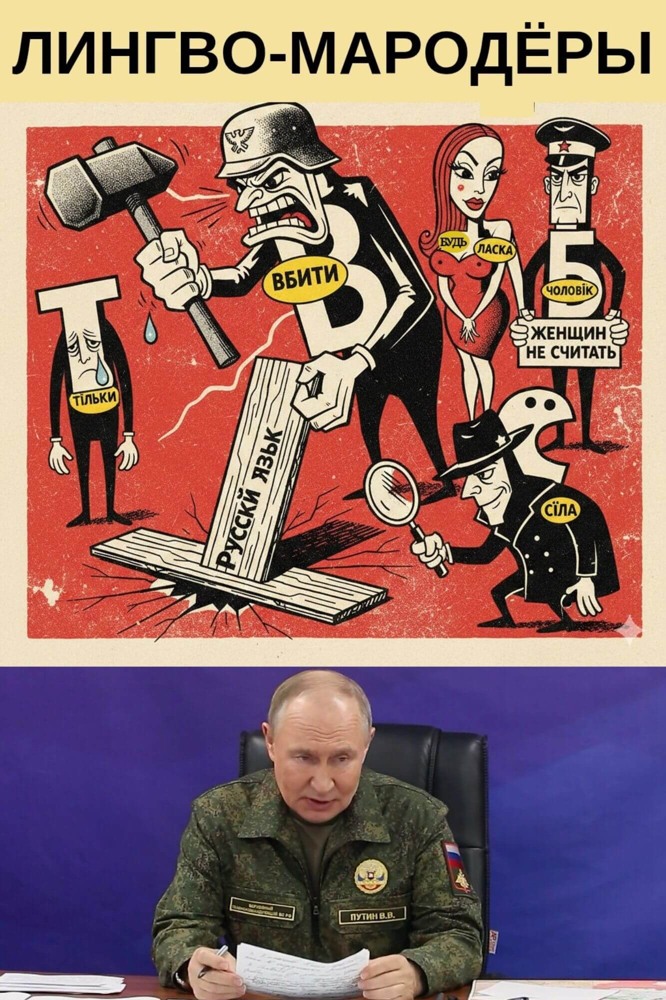

Россия, Москва, Кремль. Заседание Совета Безопасности РФ. Выступает президент России Владимир Путин.

**Путин**:

— Товарищи!

Сегодня у нас знаменательный день. Сегодня мы нашли и сформулировали нашу третью — и главную — цель специальной военной операции. Итак, с настоящего момента, прошу запомнить  нашу стратегическую целевую триаду в борьбе с фашистским украинским режимом:

• Демилитаризация 

• Денацификация 

• Деколонизация (русского языка)

Товарищи! 

С великим прискорбием сообщаю: нас постигла катастрофа космического масштаба. Враг коварно, тайно, за нашей спиной, на протяжении многих веков плёл смертельно опасную паутину, в которой мы  и  оказались, совершенно неожиданно для самих себя.

Товарищи!

Мы уделяем самое пристальное внмание защите наших духовных и семейных ценностей. Это прекрасно! 
Однако мы совсем упустили из виду наши традиционные коммуникационные ценности.
Смысловые (семантические) и звуковые (фонетические).

А ведь наш язык, наше национальное достояние на протяжении столетий подвергается грабительским пиратским налетам со стороны украинской мовы! 

Они крадут наши традиционные, исконно русские слова, уродуют их, изменяя фонетический облик и семантику, и используют в своем языке без нашего согласия!

Они украли у нас приставки и окончания, они украли у нас существительные, прилагательные и глаголы. Они кардинально меняют их смысл, они коверкают их произношение. 

Это нарушение авторских прав на нашу интеллектуальную собственность! Мы не давали им на это разрешения. Это уголовная статья и основание для требования компенсации. 

Но это ещё и профанация русского языка. Это  геноцид нашего Лингвофонда. Это смачный плевок нам в душу.

Товарищи!

Передо мной лежит трёхтомник, составленный нашим главным лингвистом и признанным специалистом по русскому языку — Владимиром Далем. Здесь собраны все исконно русские слова, украденные украинской мовой из нашего языка, слова, подвергнутые унижению и надругательству и превращенные в презренных рабов на службе коммуникаций украинской фашистской тусовки.

Я не хочу быть голословным, товарищи. Я приведу вам десятки примеров того, как наши благородные аутентичные русские слова были грубо и бесцеремонно поруганы, изнасилованы и втиснуты в чуждые рамки так называемого украинского языка.

• Вот русское слово ***убить***.
Они его хапнули и превратили в ***вбити***. Это дискредитация: вбивают гвоздь в доску, а мы убиваем фашистов.

• Вот русское слово ***только***.
Они его превратили в ***тiльки***.
 Для русского уха звучит оскорбительно.

К тому же, заметьте, они тут используют враждебную нам натовскую букву ***i***. С точкой! Совершенно чуждую нашим интеллектуальным ценностям. А вы знали, что в мове есть ещё более гнусная буква — ***ï***  с двумя точками! Это откровенный символ деградации и  квинтэссенция фашистской риторики.

• Вот русское слово ***человек***. Они из него сделали ***чоловiк***, да ещё изменили семантику. По их извращённой логике, к категории "человеков" относятся  только мужчины. Женщины, значит, это не люди. Это дискредитация всей нашей женской половины. Верх неуважения к русской женщине!

• Вот русское слово ***нарушать***. Они в нем изменили всё: приставку, суффикс, окончание. Что получилось? Отвратительный гибрид: ***порушувати***. Это оскорбление чувств верующих в красоту и величие русского языка.

• Вот русское слово ***ласка***. Доброе, милое, невинное и тёплое. Они поставили его на службу беззастенчивой пропаганде сексуальных игрищ и распущенности!

Вы только посмотрите!
***Будь ласка!*** У них это якобы означает ***пожалуйста***. Будь ласка, сходи в магазин. Будь ласка, сделай омлет. И так далее. На каждом шагу мы слышим это ***будь ласка.*** Но ведь это — не что иное как приглашение к сексуальной прелюдии:

 ***будь ласка = приласкай меня!***
 
Это же сексуальное домогательство в чистом виде!

• А слово ***шкодить*** ? Мы с вами знаем, что оно означает дурные поступки. Но они его хапнули и — нам назло — возвысили и облагородили. У них оно означает ***повредить***:
"Смотри не пошкодь мешок!"

Как это понимать? Это дискредитация самих наших смыслов, товарищи. Священных смыслов.

Чего они только не делают с нашими словами! 

• Переставляют буквы в исторически сложившихся сочетаниях: 
мы говорим ***рождается***, они говорят ***народжуется***. У нас **"жд"**, у них **"дж"**. 

Это просто насмешка над нашим языком.

• Мы говорим ***всё***, они говорят ***усё***.

• Мы говорим ***улица***, они говорят ***вулиця***. 

• Мы говорим ***креститься***, они говорят ***хреститися***.  

Они нас просто передразнивают! Как мартышка в зоопарке.

• А старое доброе слово ***какой-нибудь?***
Они ж его просто изуродовали! Кастрировали и поменяли местами части составного слова. Что получилось? Белиберда, абракадабра:
***будь-який.***

И так далее и тому подобное. Повторяю, у меня в руках три толстых тома с перечислением всех преступлений подобного рода.

Мы обратились к  специалистам, которые пришли к выводу, что данное явление есть не что иное, как колонизация русского языка с целью его дискредитации, уничижения, пародирования, оболванивания, надругательства, причинения тяжкого вреда его структурным элементам и в конечном итоге — его уничтожения.

Поэтому, товарищи, перед нами встаёт новая задача.
За четыре года самоотверженной борьбы мы добились демилитаризации и денацификации так называемой Украины. Теперь перед нами стоит задача не менее важная — деколонизация русского языка.

Мы должны вырвать из лап фашистов наши поруганные слова, вернуть их в родную гавань и реабилитировать. 

И мы подаем в международный Трибунал встречный иск к Украине о возмещении репутационного и лингвистического вреда. 

Если кто-то хочет использовать наши слова — получите письменное разрешение и платите роялти. 

Но мы не допустим никакого насилия, надругательства и неуважения к нашим языковым символам и их священным смыслам.

**Секретарь Совета Безопасности Патрушев Н.:**

— Владимир Владимирович!  Предлагаю: выступить с инициативой взаимозачёта по данному иску и иску Украины к России о возмещении материального ущерба от военных действий. Сумму пропишем такую же — 800 миллиардов евро. 

**Путин:**

— Предложение правильное. Спасибо! 
Это двойная победа. Мы им полстраны разрушили, и при этом избавимся от необходимости платить репарации..

#ПравославныйВоенныйПутинизм
                                👻    

  
## 7. НАУЧНЫЕ ОСНОВЫ ПРОПАГАНДЫ 

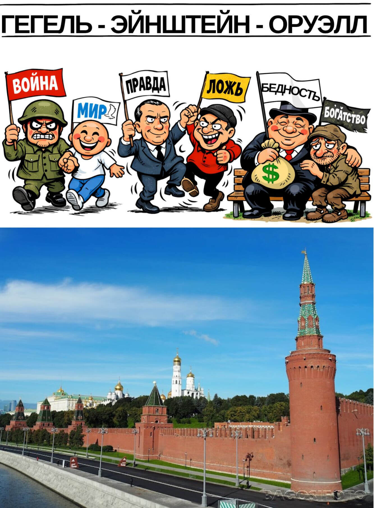

Россия, Москва, Кремль. Российский президент Владимир Путин выступает перед журналистами кремлёвского пула. 

**Путин**:

— Товарищи!
Сегодня я хотел бы коснуться основополагающих принципов российской государственной идеологии.

Враги обвиняют нас в том, что мы, дескать, извращаем  идеи и факты, ставим с ног на голову понятия, принципы и веру. Зачастую в публичном поле в отношении нас используются слова "лживая пропаганда".

Это несправедливо, товарищи. Это наглая ложь и инсинуация.

Мы ничего не придумываем и не потерпим никакой отсебятины. Наша идеология базируется на строго научном подходе. Как и марксизм-ленинизм, наша идеология логически вытекает из всемирно известных теорий величайших мыслителей человеческой цивилизации. 

Если тремя столпами коммунистического учения были Маркс, Энгельс и Ленин, то три  кита нашей идеологии — это Гегель, Эйнштейн и Оруэлл. 

Диалектика и Теория относительности — это научная основа для структурных рамок нашей идеологии. Роман "1984" — это яркий образец содержательного использования этой структуры.

Наш мир стоит на фундаментальных законах:

• Всемирного тяготения

• Единства и борьбы противоположностей (Гегель)

• Всеобщей теории относительности (Эйнштейн)

Да-с, дорогие товарищи, всё в этом мире относительно:  хорошее и плохое переплетаются, антагонисты живут в симбиозе. Читайте Гегеля. Вспоминайте Эйнштейна.

Вот, скажем, война и мир. Гениальный провидец Оруэлл первым открыл непреложную истину:

**МИР — ЭТО ВОЙНА, ВОЙНА — ЭТО МИР**

И действительно. Смотрите: между НАТО и Россией сейчас мир. Пока что. Я повторяю: пока что. Но что происходит на деле?
В действительности идёт полномасштабная гибридная война (кибератаки, война идей и смыслов, драконовские экономические санкции, заморозка наших финансовых активов и так далее). И это вы называете "миром"?
Отдельно хочу отметить откровенно враждебную практику регулярных поставок натовского оружия Украине. Если натовские "Хаймарсы", пусть и запущенные из Украины, разнесли мне десятки стратегически важных НПЗ — это, по-вашему, называется миром?

С другой стороны, конвенциальные войны — это мир в зародыше. Война ведёт народы к миру. Дайте людям войну — и они  сразу станут ярыми приверженцами мира. Война порождает мир. Никто не желает мира больше, чем сидящие в окопах солдаты. Эти солдаты сражаются не за территории — они сражаются за мир. И чем более жестокой, кровопролитной, разрушительной становится война, тем более прочным и нерушимым будет мир, порожденный этой войной. 

**ВОЙНА — ЭТО МИР**, товарищи. Это факт. И с этим приходится считаться.

Ещё одно гениальное открытие Оруэлла — аксиома:

**ПРАВДА — ЭТО ЛОЖЬ**

И действительно, констатация любого факта субъективна. Все зависит от точки зрения говорящего, от интерпретации, в конечном итоге — от определения понятий. 

Но ведь в различных культурах понятийный аппарат может (и должен!) различаться. Например, у Европы свои понятия о долге, морали, духовных ценностях, у нас — свои. Уже в силу этого мы не можем иметь с ними одинаковую интерпретацию фактов. То что они называют правдой, для нас — ложь. И наоборот. Это же очевидно.

Что касается так называемого "переписывания" истории. Но это же очевидно, товарищи. Научно-технический прогресс кардинально меняет нашу жизнь, наше восприятие, наши взгляды, меняет буквально на глазах. Сейчас в нашем распоряжении имеется в десятки раз больше информации, чем было, скажем, десять лет назад. Искусственный интеллект предоставляет огромные возможности для более адекватного анализа и  понимания истории. В силу этого нам, конечно же, приходится адаптировать учебные пособия для студентов и школьников. Это очевидное следствие тотальной  информатизации общества, в котором мы живём.

Далее. Диалектический подход подводит нас к признанию  очевидной истины:

**ЗАЩИТА — ЭТО НАПАДЕНИЕ**

Ну вот взять хотя бы нашу героическую специальную военную операцию. Да, сейчас это уже полноценная война. Война за мир во всем мире. Но давайте вспомним, как всё начиналось. НАТО откровенно готовило вторжение украинской армии в нашу страну. Если бы 24 февраля 2022 года мы не вторглись на территорию Украины, то сейчас бы мы с вами защищались от врага на нашей собственной земле. Мы поступили мудро — нанесли врагу превентивный ответный удар. Тем самым спасли от гибели и разрушения тысячи жизней и сотни гражданских объектов. Как видите:

**НАПАДЕНИЕ — ЭТО ЗАЩИТА** 

В чистом виде.

Итак, товарищи, подведем итоги.
Важнейший фронт нашего противостояния с Западом — идеологический. В своей профессиональной деятельности вы должны не только дезавуировать вражескую пропаганду — вы должны уметь доказывать электорату научную обоснованность нашей государственной идеологии.

Я привел вам несколько убедительных примеров. Это основа, которую вы можете развивать и углублять бесконечно.

Действуйте, товарищи!

Победа будет за нами!

#ПравославныйВоенныйПутинизм
                                👻   

                                
## 8. НАСТОЛЬНАЯ КНИГА ПУТИНА

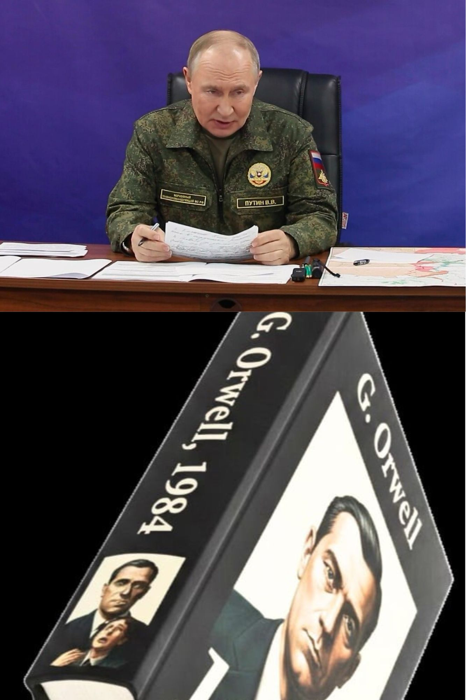

Россия, Москва, Кремль. Заседание руководителей органов государственной безопасности и охраны правопорядка. Выступает президент России Владимир Путин.

**Путин**:

— Товарищи!
Кто из вас читал капитальный труд великого британского писателя ***Джорджа Оруэлла*** "**1984**"? Никто не читал? Прочитайте. Это наша настольная книга.

Дорогой товарищ Оруэлл описал довольно эффективную тоталитарную систему государственного управления. Конечно, в середине прошлого века ему и во сне не могли присниться технологии, которые есть у нас с вами. В силу этого его система довольно громоздкая, ресурсозатратная и дорогостоящая. Но все равно — она отлично работает! Даже в условиях технологической отсталости.

Но главное, товарищи, это его бессмертные тоталитарные идеи: ***двоемыслие, переписывание истории, полиция мыслей***.
Кое-что мы у него уже переняли и применяем с большим успехом. Но, как говорится, есть ещё к чему стремиться.

Прежде всего, нам предстоит ввести в нашу юриспруденцию понятие ***мыслепреступление***. Это понятие логически вытекает из наших традиционных ценностей. Вспомните, что говорил Христос в своих проповедях. Если ты возжелал жены брата твоего, ты уже совершил прелюбодеяние. Таким образом, согласно догматам нашей православной христианской церкви, сама мысль о грехе становится грехом. Это важный метафизический скачок, который мы просто обязаны поставить на службу безопасности нашего  государства. 

Так что ***мыслепреступление*** придумали не мы и даже не Оруэлл — его придумал сам Господь Бог.

Что для нас это означает на практике?
Первое: в полиции должно появиться специальное подразделение — ***Отдел по борьбе за чистоту мыслей***. Проще говоря, та самая оруэлловская ***Полиция мыслей***.

Второе — необходимо доработать наш уголовный и административный кодексы, введя наказания за ***мыслепреступление***.

И самое главное — мы должны наладить практическую работу среди населения.

Обратимся к нашей настольной книге. 
В мифической стране Океания инакомыслящих выявляли, установив за гражданами круглосуточную слежку с помощью так называемых ***телекранов***. В отличие от Океании, которая, как я понял, на международной арене имела статус маргинала, Россия является одним из крупнейших геополитических игроков и должна соблюдать хоть какое-то подобие элементарных приличий. Поэтому мы не можем открыто нарушать такие базовые права граждан, как тайна частной жизни. 

А кроме того, ***телекраны*** хороши как инструмент устрашения, но для выявления тайных мыслей требуются тайные методы. Никто не станет признаваться в ереси, зная, что его подслушивают и что за ним подглядывают.

Мы уже сделали в этом направлении большой — огромный — шаг: разработали и внедрили безальтернативный мессенджер **МАХ**, позволяющий негласно отслеживать коммуникации наших граждан. 

Но! Когда иноагент выходит на митинги, становится в одиночный пикет или публикует в интернете непатриотичные призывы — это уже запущенная стадия идеологической девиации. Это уже не лечится, а только карается тюремным заключением.

Вообще, вы знаете, я предлагаю рассматривать инакомыслие как прогрессирующее заболевание. Если нам удастся диагностировать его на ранней стадии, есть очень хороший шанс с помощью элементарных корректирующих процедур навсегда излечить человека от этой болезни. 
Поэтому — наше внимание должно быть направлено в первую очередь на детей.

Да, у нас уже повсеместно проводятся уроки  ***Разговоры о важном***. Это прекрасно — мы внушаем нашим детям правильные установки. Но нужна ведь и обратная связь! Что мы имеем в этом плане? Анкетирование студентов? Оно абсолютно неэффективно, это все равно что ждать от иноагента признаний перед ***телекраном***.

Нам нужно системное, глобальное решение. 
И оно лежит на поверхности. 
Что мы с вами делаем? Мы устанавливаем
в детских садах, школах, иных учебных заведениях круглосуточную прослушку. Не видеонаблюдение — нет. Это дорого и не нужно. Нам не нужны лица — только разговоры и система распознавания голосов. Это проще и дешевле. И делается скрытно.

Далее искусственный интеллект анализирует поступающую на сервер информацию и выдает конечный результат: 

"Петя Белкин из 3-го класса школы номер 212  неблагонадежен; вчера на перемене между вторым и третьим уроком он сказал оскорбительное слово в адрес Президента". 

Дальше Петей занимается отдел по несовершеннолетним: безболезненная идеологическая коррекция, как, знаете, с помощью брекетов у ребенка корректируют положение зубов, растущих вбок. И в точности как это бывает с кривыми зубами — в детском возрасте такая идеологическая  коррекция ещё возможна.

И между прочим, мальчик Петя, когда вырастет, будет нам только благодарен,  за то что помогли ему в детстве избавиться от неправильных мыслей и тем самым спасли от тюрьмы.

Разумеется, тотальная прослушка должна осуществляться во всех государственных учреждениях — тут мы не нарушаем никаких законов. По согласованию с владельцами частных бизнесов устанавливаем прослушку также и в их заведениях и офисах. Откажутся идти навстречу — вы знаете, как их убедить.

Наша конечная цель, товарищи, — построить гармоничное общество — общество, основанное на принципах гомогенности, конформизма, солидарности и сплочённости.
Чтобы мне не приходилось во время "Прямой линии" с народом врать, утверждая, что в России иноагенты не подвергаются уголовному преследованию. 

Мы на самом деле не будем преследовать инакомыслящих — по той простой причине, что у нас не будет инакомыслящих.

#ПравославныйВоенныйПутинизм
                                👻   

## 9. ТРАМПУТАЦИЯ ПОД ПИВО

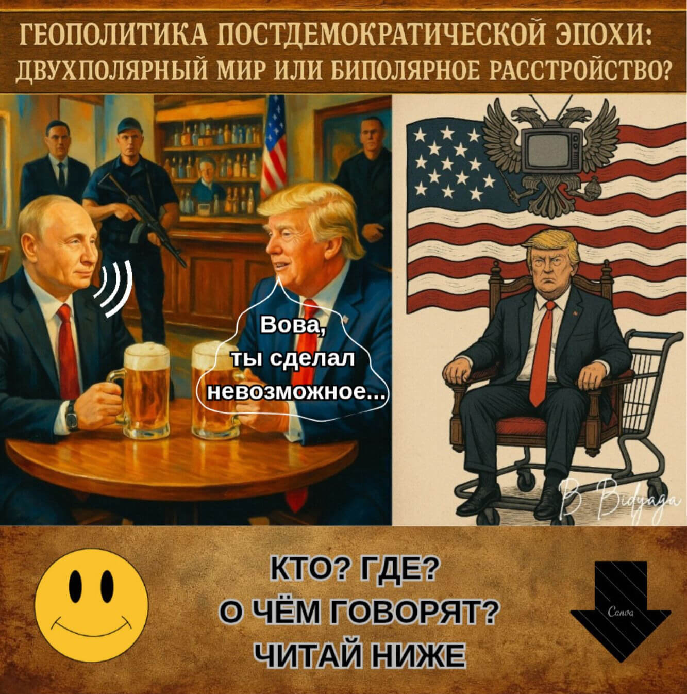

Американский бар. Президент России Владимир Путин и  Президент США Дональд Трамп сидят за столиком, пьют пиво и мирно беседуют.

**Трамп:**

— Вова, ты сделал невозможное: 25 лет у власти! Как тебе это удалось? 

**Путин:**

— Да очень просто: переписал Конституцию.

**Трамп:**

— И тебя не скинули?

**Путин:**

— Мы это заранее предусмотрели. Сварганили "смертельный вирус", устроили пандемию... Нагнали на население такого страху — задушили протест в зародыше. На всякий случай я держал в рукаве даже "военное положение". Не понадобилось. Эта грёбаная оппозиция оказалась слаба на передок. Сами громче всех кричали, чтобы я ужесточил карантинные меры. Жалкие, ничтожные люди. Все сидели по домам и только и делали что тряслись за своё здоровье. Одним словом, моему электорату было не до Конституции.

**Трамп:**

— Потрясающе!  Невероятно! Я бы тоже не прочь...  Но у нас, понимаешь ли,  демократия!

**Путин:**

— Да я бы и в Америке всю вашу демократию под себя прогнул!

**Трамп:**

— Ты это серьезно?

**Путин:**

— Абсолютно. Слушай внимательно, Донни. Начни с системы сдержек и противовесов. Снеси ее к чертовой бабушке! И строй свою вертикаль. 
Все слабые звенья — зачисть. Везде — только твои люди. Силовики — твой первый эшелон обороны. Судебная система — второй. Дай понять каждому, что он у тебя на крючке. Компромат найдется на всех. А нет — так любого можно подставить. 
Всё — система отлажена.

Помни: лояльность, лояльность и ещё раз лояльность. Регулярно устраивай чистки. И показательные процессы. Для наглядности. И будет тебе счастье.
И обязательно двигай свою идеологию в массы. Со школьной скамьи. "Сделаем Америку снова великой!" Или как там у тебя?

Предлагаю лейбл:
"ТраМерика".
"ТрЭкономика". "ТраМедицина". "ТраМода".
Прояви креативность — людям это нравится. И ломай шаблоны.

Ваша двухпартийка — это полная глупость. Чем демократы отличаются от республиканцев? Да ничем. Каждые 4 года меняете шило на мыло. 
Организуй третью партию: ТрамПартия. Твой индивидуальный стиль.

Расширь свой лозунг: МАГА — ПТАГА. 
"Сделаем Америку снова великой: процветание для всех. Бог. Алилуйя!"
(Make America Great Again: Prosperity To All. God. Alliluya!)
Это, конечно, несколько иной подход.

Лично я предпочитаю движуху в виде врагов, войны и нагнетания страха. Но можно консолидировать массы и таким способом.
А как только начнут терять интерес — объявляй войну Канаде. 
Придумай древнее индейское племя, которому в древности принадлежала вся Северная Америка. Чингачгук Большой Змей — Повелитель Гадов и Всея Америки.
А что?
Соединённое Королевство "Северная Америка" — звучит мощно.
(United Kingdom of North America).
Потом от нового государства изберешься ещё на пару сроков.

Дерзай, Донни!
Просто прояви креативность.

Знаешь, а ведь будет здорово: у меня — одна шестая часть суши и у тебя тоже одна шестая! 
Поделим с тобой этот шарик пополам. Ты будешь — Властелин Меридианов. Я — Властелин Параллелей.

#ПравославныйВоенныйПутинизм
                                👻
                                

## 10. ПУТИНИЦА: 35 ХРОНИЧЕСКИХ ПОДТАСОВОК

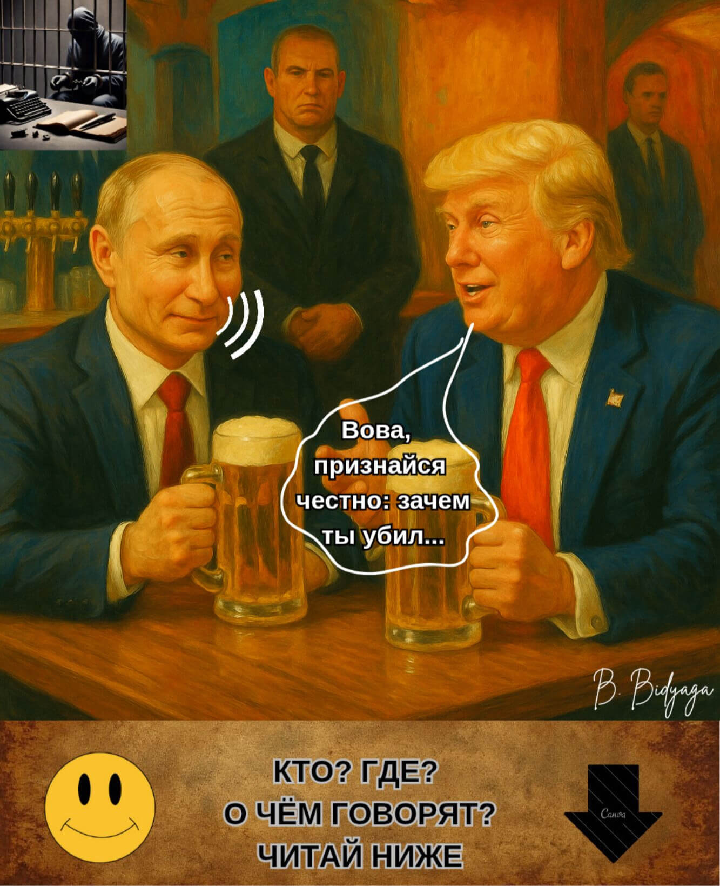

Американский бар. Президент России Владимир Путин и президент США Дональд Трамп сидят за столиком, пьют пиво и мирно беседуют.

**Трамп:**

— Вова, признайся честно: зачем ты убил Навального? Неужели он был для тебя реально опасен?

**Путин:**

— Донни, не смеши мои носки! У этого типа рейтинг был ниже плинтуса. Чего мне его бояться?

**Трамп:**

— Но тогда я не понимаю...

**Путин:**

— Донни, ты должен понять. Этот человек меня раздражал. Просто бесил. От одного его имени у меня поднималось давление. Я не мог жить с ним в одной стране, я не мог дышать с ним одним воздухом. Я дал ему возможность уехать. Он вернулся. Зачем?

**Трамп:**

— И тогда ты приказал его убить?

**Путин:**

— Донни, ну зачем так грубо? Я всего лишь посадил его в тюрьму. За экономические преступления. Вор должен сидеть в тюрьме, Донни. Разве не так?

**Трамп:**

— Отчего же он умер?

**Путин:**

— У него было 15 хронических заболеваний, Донни. Включая герпес. С таким букетом долго не живут.

**Трамп:**

— Так много? Но ведь он был ещё совсем молодой!

**Путин:**

— Так мне сказали  ребята, Донни.
20 хронических болезней. Включая простатит. Ребята опытные, ещё со времён Магнитского. Моя лучшая команда. 

**Трамп:**

— Я слышу про это в первый раз ...

**Путин:**

— Да мы и сами не знали. А как вскрытие сделали — ахнули: 25 хронических болячек. Включая радикулит. Как у какого-нибудь дряхлого старика.

**Трамп:**

— Невероятно! С виду и не подумаешь...

**Путин:**

— Мне не веришь — могу  документы показать. Справки, медкарта, протокол вскрытия... Документы не врут, Донни, всё чисто: 30 хронических заболеваний. Включая холецистит. Он весь был гнилой насквозь.

**Трамп:**

— Как же он в таком состоянии три года протянул? В тюрьме то есть?

**Путин:**

— У него было девять жизней, Донни. Как у кошки. Его даже "новичок" не брал. Очень живучий был экземпляр. 
Это ж только подумать — 35 хронических болячек! И педикулез в придачу!
Это же не человек, а ходячий труп!

**Трамп:**

— А почему тогда не отдаешь вдове личные вещи, документы, видеозаписи? Если всё чисто?

**Путин:**

— Видишь ли, Донни... Ребята боятся, что вещдоки снова  попадут в лапы Бундесвера. А эти немцы, ты же знаешь, из чистого воздуха улики извлекают. Как бы опять конфуз не вышел — как в тот раз, с "новичком".

**Трамп:**

— А почему ты все время меняешь версии? То у тебя аритмия — причина смерти, то теперь — отравление?

**Путин:**

— Да это местный следователь прокололся. Ямало-Ненецкий. Написал черт знает что. Как будто между строк
 читать не умеет. 

(Пауза)

**Путин:**

— Вот такие дела, Донни. Трагическая смерть от редкой формы аллергии на сильный мороз. И это чистая правда, Донни, можешь не сомневаться.

**Трамп** (в сторону, насмешливо):

— Скрижали ФСБ? Заповедь #1: отрицай очевидное.

(Пауза)

**Трамп** (весело, обращаясь к Путину):

— Ладно, Вова, оставим эту мрачную тему. Лучше тяпнем пивка — для рывка.

**Путин:**

— За нас!

#ПравославныйВоенныйПутинизм
                                👻

## 11. БЛАЖЕННЫ МИРОТВОРЦЫ...

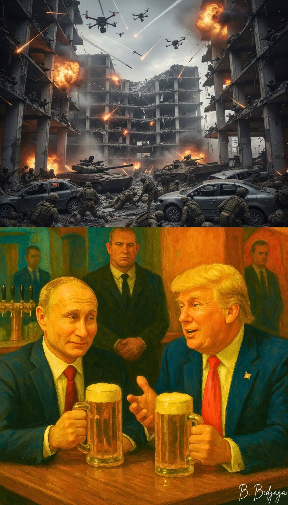

Американский бар. Президент России Владимир Путин и президент США Дональд Трамп сидят за столиком, пьют пиво и мирно беседуют.

**Трамп**:

— Вова,  твоя Украина сидит у меня в печенках. Застряла как кость в горле. Я уже почти жалею, что вообще ввязался в вашу склоку. Скоро конец моего срока, и если за это время я не получу Нобелевку, меня назовут самым "никчемным" и самым "презираемым" президентом за всю историю США.

(Пауза)

**Трамп (просительно):**

— Вова, ну почему ты не хочешь мне помочь? Ведь я включил в соглашение все пункты, о которых ты просил. Мужик, давай наконец подпишем этот мирный договор! Для тебя это безумно выгодная сделка! И главное  — принесёт заслуженную славу мне!

**Путин (безразличным тоном):**

— Донни, я ведь тоже должен сохранить лицо. Мне нужен Донбасс, как ты не понимаешь?! Ведь я уже записал его в Конституцию как законную территорию России. И потом: я миллион жизней положил за этот чёртов Донбасс. Я должен преподнести его своему электорату на блюдечке с золотой каёмочкой. Есть Донбасс — есть победа. Нет Донбасса — нет победы, и значит — все жертвы в этой кровавой бойне были напрасными.

**Трамп (понижая голос):**

— Вова, но ведь никто не мешает тебе через пару лет (но только после моего ухода!) продолжить эту войну. Инсценируешь украинскую атаку на свою резиденцию. В Тверской области. В заповеднике. Только пожалуйста — соблюдай приличия. Если ты выдвигаешь обвинение — предъяви  доказательства.  Реальные! "Рейхстаг" должен гореть не понарошку. Запусти дроны с украинской территории. Сожги дотла свой любимый дворец, да ещё сто гектар реликтового леса впридачу. Покажи корреспондентам обгоревшие тушки редких животных, занесённых в Красную книгу. Короче — предъяви публике качественный casus belli. 

**Путин (с сомнением):**

— Но ты же даёшь Украине гарантии безопасности. Если дотошные журналисты раскопают, что это чистая постановка, НАТО может задействовать против меня  пятую статью!

(Пауза.)

**Путин (твердо):**

— Мне нужны гарантии безнаказанности, Донни.

**Трамп (согласно кивая):**

— Разумеется. И ты их уже имеешь, Вова. 
Самые надёжные гарантии — не те что скрепляются подписями на бумаге, самое надёжное — это  неформальные договоренности между двумя джентльменами.
Вова, просто оглянись назад. После распада СССР Украина получила "железобетонные гарантии", верно? И что — кто-нибудь ее защитил от твоей агрессии? Никто. Так почему же ты думаешь, что новые "гарантии" будут "работать" по-другому? Лично я ни при каких обстоятельствах не стану вмешиваться в твою драку с Украиной. Особенно если ты достаточно убедительно "подожжешь свой Рейхстаг". Возьми Обаму, Байдена — они как огня боялись открытого конфликта с Россией. США никогда не вступят в войну, если она напрямую не затрагивает их интересы. 

**Путин (скептически):**

— А Европа?

**Трамп (презрительно):**

— Европа?! Я тебя умоляю... Сами они в пекло никогда не сунутся. Тем более ты показал всему миру абсолютно беспроигрышную тактику — заваливать врага трупами своих солдат. Горы трупов. От одного этого зрелища Европа уже трясется от страха. В Европе слишком ценят человеческую жизнь. А что касается поставок оружия, то в этом они будут помогать Украине ровно до того момента, когда восстановят свою собственную обороноспособность. А ты думал, они вооружают Украину по доброте душевной? Держи карман шире. Они делают это, просто чтобы Украина отвлекала огонь на себя. Охраняла европейские рубежи ценой собственной жизни.

Так что у тебя нет ни малейшего повода для беспокойства. Давай проведём границу по текущей линии фронта. Временно. А ты пока восстановишься и модернизируешь свои вооружения. У тебя же самого экономика на ладан дышит! А через пару лет вернёшься со свежими силами.

**Путин:**

— А что я скажу народу?

**Трамп:**

— Как что? Цели спецоперации — денацификация и демилитаризация — достигнуты. Донбасс освобождён практически полностью. Не надо заморачиваться с цифрами. "Практически полностью" — звучит триумфально. Права русскоязычного населения? Защищены. Какое поражение? О чем ты говоришь? Несомненная победа. Первый этап. Потом, после того как я получу Нобелевку и закончится мой срок, —  отыграешься, и будет тебе победа полная и окончательная.
Давай же, Вова! Не выёживайся! Подпишем сделку, и дело с концом!
 
#ПравославныйВоенныйПутинизм
                                👻   
                                
## 12. ЖИРНЫЙ И АРОМАТНЫЙ ЗЕМНОЙ ШАР НА ДЕНЬ БЛАГОДАРЕНИЯ 

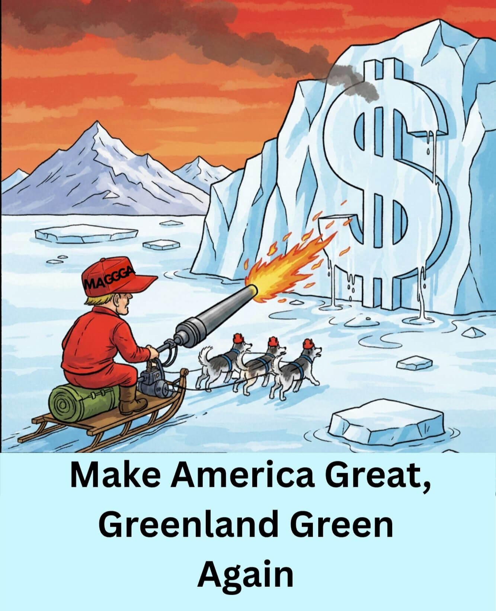

Президент США Дональд Трамп даёт интервью журналистам. Президент России Владимир Путин участвует в конференции по видеосвязи.

**Трамп**:

— Господа!
Настало время действовать. Гренландия — это исторически американская земля. Датчане заселили ее черт знает кем. Инуиты? Да это же переодетые иезуиты, засланные Ватиканом! Хитрые интриганы. Вредители и саботажники.

Во-первых. Куда они дели ту зелёную травку, благодаря которой остров получил свое название? Они ее съели. И не только ее.
Вы только посмотрите: ещё год назад, я измерял эту территорию на карте — согласно Меркатору,  Гренландия была в два раза больше!  Они отъели от острова половину! 
Мало того что они заморозили всю страну и покрыли ее ледником — они откалывают от него куски льда и кидают в свой виски! 
Это самоедство! Они сожрали и всю свою оборонку — в гренландской армии осталось две собачьих упряжки! Это преступление против человечности... то есть против собачности.

Как Великий защитник природы и животных я не могу этого допустить.
Я объявляю 2026 год годом Больших Аннексий. 
Сделаем Гренландию снова зелёной! MGGA!
Господа, Гренландия будет наша!
Мы выходим на наивысшую ступень геополитического пиратства: MAGGGA! 

**MAKE AMERICA GREAT,**
**GREENLAND GREEN — AGAIN !**

Мы сделаем из Гренландии зелёный газон для гольфа. А Америка будет купаться в  долларах. Win-win.

Гренландцы!  Подумайте хорошенько.
Либо вы идете в мои объятия по любви, и тогда каждый из вас получит красную кепку с логотипом MAGGGA, либо я растоплю весь ваш гренландский лёд газовой горелкой. Так или иначе — но вы ко мне приплывете.  Хоть на своих утлых лодочках, хоть на последней оставшейся льдине.

Но когда вы станете просить у меня убежище, я посажу вас  всех  в детеншн — пусть каждый сначала докажет, что не является иностранным агентом Дании или Ватикана. И пусть примет присягу и клеймо с моим портретом на левую лопатку.

MAGGGA! Ура! 

Пусть всегда будут Штаты,

Пусть всегда будет травка

Пусть всегда будет солнце,

Пусть всегда будет Трамп!

(Журналисты уходят.)

**Путин** (по видеосвязи):

— Донни! Ну дай я тебя обниму! 
Ты мой самый прилежный ученик. Усвоил мои уроки на 200%.Твой молниеносный захват венесуэльской нефти — то есть я хотел сказать: диктатора Мадуро — это высочайшее проявление стратегического гения. Этот Мадуро — тот ещё фашист, почище Зеленского. Нефть его испортила. Нефть и власть — вот что портит людей. Ты правильно сделал что скинул его с трона. И смотри как сразу вся эта шваль тебя зауважала. Даже эта никчемная тетка Мачадо вдруг захотела отдать тебе свою Нобелевку. Но каковы эти трухлявые старикашки из Осло!  Решили отменить рыночную экономику. Чушь собачья! Есть спрос, есть предложение — есть сделка. Вторичный рынок всегда был, есть и будет. Черный рынок тоже никто не отменял. Так что, Донни, когда купишь свою Нобелевку, дай знать — обмоем твой новый титул.

А когда тебе объявят импичмент, перезжай в Россию, по программе "Гражданство в обмен на традиционный бред"... то есть я хотел сказать: "традиционные ценности". И прихвати с собой Топ-10 секретов Пентагона.
Но ты не бойся — я не стану селить тебя рядом с Януковичем. Я сделаю тебя своим Первым советником по Украине. Все эти патрушевы, шойгу, герасимовы, дугины — бездарное ворье. Все никак остановиться не могут: бабло, бабло, бабло. Ты не такой, Донни, ты — человек дела. Ты за баблом не гонишься — у тебя его и так хватает. 
Вместе мы согнем эту чёртову Украину в бараний рог, Донни. Я получу свою славу, ты — редкоземельные металлы.

Потом будет Молдова, Грузия, Армения и Казахстан. Без дела не останемся. Это не про величие Америки или России. Это про роль личности в истории.

Представь что ты стоишь перед глобусом, как перед жирной и ароматной индейкой на День Благодарения. И в руках у тебя острый клинок. Мы с тобой, как два злых гения, пишем историю, Донни. Кровью. Как и подобает великим Творцам.

#ПравославныйВоенныйПутинизм
                                👻   

## 13. СДЕЛКА ВЕКА

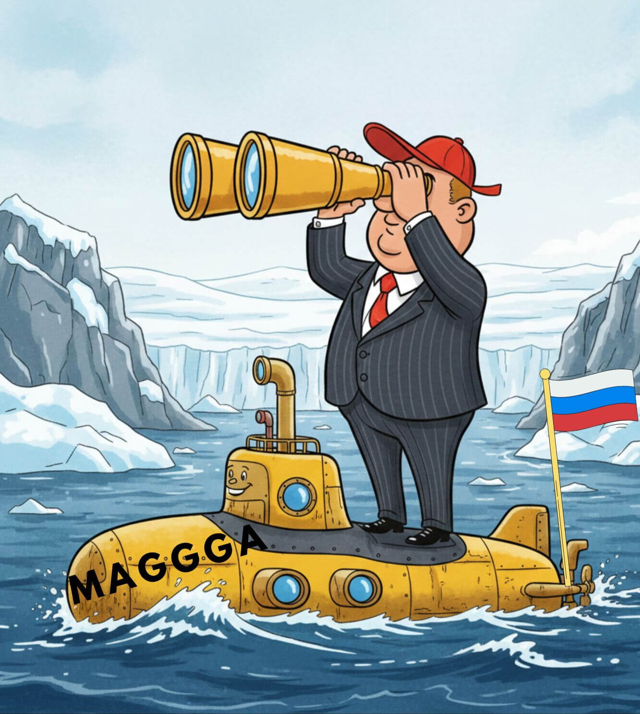

Американский бар. Президент США Дональд Трамп и президент России Владимир Путин сидят за столиком, пьют пиво и мирно беседуют.

**Путин**:

— Ну что, Донни, как продвигаются дела с Гренландией?

**Трамп** (с обидой):

— Полный тупик. Ты понимаешь, Вова, они не хотят быть частью Америки! Жалкие, ничтожные люди. Америка — великая держава. Должны спасибо сказать. А они упираются.  Да кто они такие, чтобы перечить мне, величайшему в мире Миротворцу? Люди — глупые существа, я давно это понял. Я для их же пользы стараюсь. А они мне назло — ты представляешь? — перебросили на остров "военный контингент". Целых двадцать один человек!  У-у-у, как страшно! 

**Путин**:

— Ты прав, Донни. Люди зачастую не понимают, что для них хорошо и что — плохо. Приходится  дубинками загонять их в счастливое стойло. То есть я хотел сказать: в счастливое будущее. Как малые дети, ей-богу.

**Трамп**:

— Истинно так. Если я не приберу Гренландияю к рукам, кто их защитит от "российской и китайской угрозы"? (Не обижайся, Вова, ничего личного.) Мне говорят: российских подлодок здесь давно уже не видели. Ну так и что с того? Сегодня не видели, а завтра их будет десять, двадцать, сто!

**Путин** (задумчиво):

— А я и не обижаюсь, Донни. Ничего личного — голый бизнес. Тебе нужна Гренландия, мне — Донбасс. У меня есть подлодки, у тебя — рычаги воздействия на Зеленского. Да и весь этот долбаный Евросоюз у тебя практически под каблуком. Ситуация складывается как нельзя лучше для нас обоих. 

**Трамп** (восхищённо):

— Вова! Ты готов ради меня бросить вызов НАТО и разориться на топливо для подлодок?! 

**Путин** (со снисходительной усмешкой):

— Это будет сделка века, мой друг.
Десяти моих подлодок у берегов Гренландии тебе  достаточно?  Или ты хочешь, чтобы я высадил десант своих  "купальщиков" на каменистых гренландских пляжах?

**Трамп** (проникновенно):

— Вова! Наш с тобой тандем — это исторический феномен. Мы с тобой — как инь и янь. Мы не просто дополняем друг друга. Мы — это качественный переход. Когда мы вместе — вода замерзает, а лёд тает. Когда мы вместе, ветер превращается в бурю, а искра — в пожар. Когда мы вместе, весь мир в ужасе и восхищении падает ниц  перед нашим могуществом. 

**Путин** (со смехом):

— Золотые слова, Донни! Ещё по одной?

#ПравославныйВоенныйПутинизм
                                👻   

 

[**Список благотворительных фондов в помощь Украине**](ru_funds)

[**На главную страницу**](index.md)
