<meta name="robots" content="noindex, nofollow">

[**Page d'accueil**](index.md)

# SE RELEVANT DE SES GENOUX

### MINI-PIÈCE SATIRIQUE

### Pour le 72ème anniversaire de Poutine

**Auteur : Olga Shcheglova (Boris Bidyaga)**

### Personnages :
– La Russie ;

– Poutine, qui se fait appeler président de la Russie.

> La Russie est à genoux, regardant pensivement devant elle. Poutine entre, en uniforme militaire, bottes à éperons aux pieds. En l’apercevant, il s’écrie avec colère.

**Poutine**  :

– Tu es encore à genoux ? C’est quoi, ce bordel ?! Je t’ai pourtant relevée !

**La Russie** (avec un sourire à peine perceptible) :

– Oh ! Mon petit est là ! Moi qui n’y croyais plus… Je t’ai tant attendu… Alors, raconte : où t’es-tu fourré, qu’est-ce que tu fabriques ?

**Poutine** (sombre) :

– J’étais à la guerre.

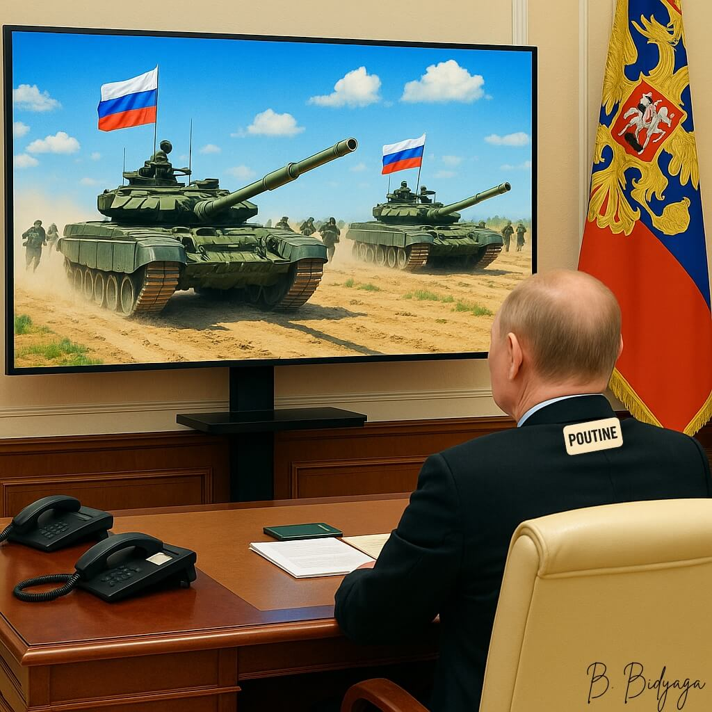

**La Russie** (avec un intérêt sincère) :

– À la guerre ? Mais pourquoi donc lancer une guerre ? Tu t’es disputé avec quelqu’un ? Quelqu’un t’a vexé ?

**Poutine** (plein de haine) :

– Ouais, ta voisine, cette conne arrogante…

**La Russie** (vivement) :

– Celle de gauche ? Ou celle de droite ?

**Poutine** (morose) :

– De gauche. Elle se prend, tu vois, pour une nation unique... Mais quelle nation ? Une traînée jaune et bleue… Un sous-produit de l’histoire. Voilà ce qu’elle est.

**La Russie** (acquiesçant) :

– Ah, quelle insolente !

**Poutine** (avec mépris) :

– Et en plus, elle s’est pris qui comme président ?

**La Russie** (ingénument) :

– Qui ?

**Poutine** (avec mépris) :

– Ben un clown, que Dieu me pardonne… et en plus un youpin ! Bon pour faire le pitre sur scène, et le voilà qui se trémousse sur les grandes tribunes, prêt à tout pour entrer dans l’OTAN.

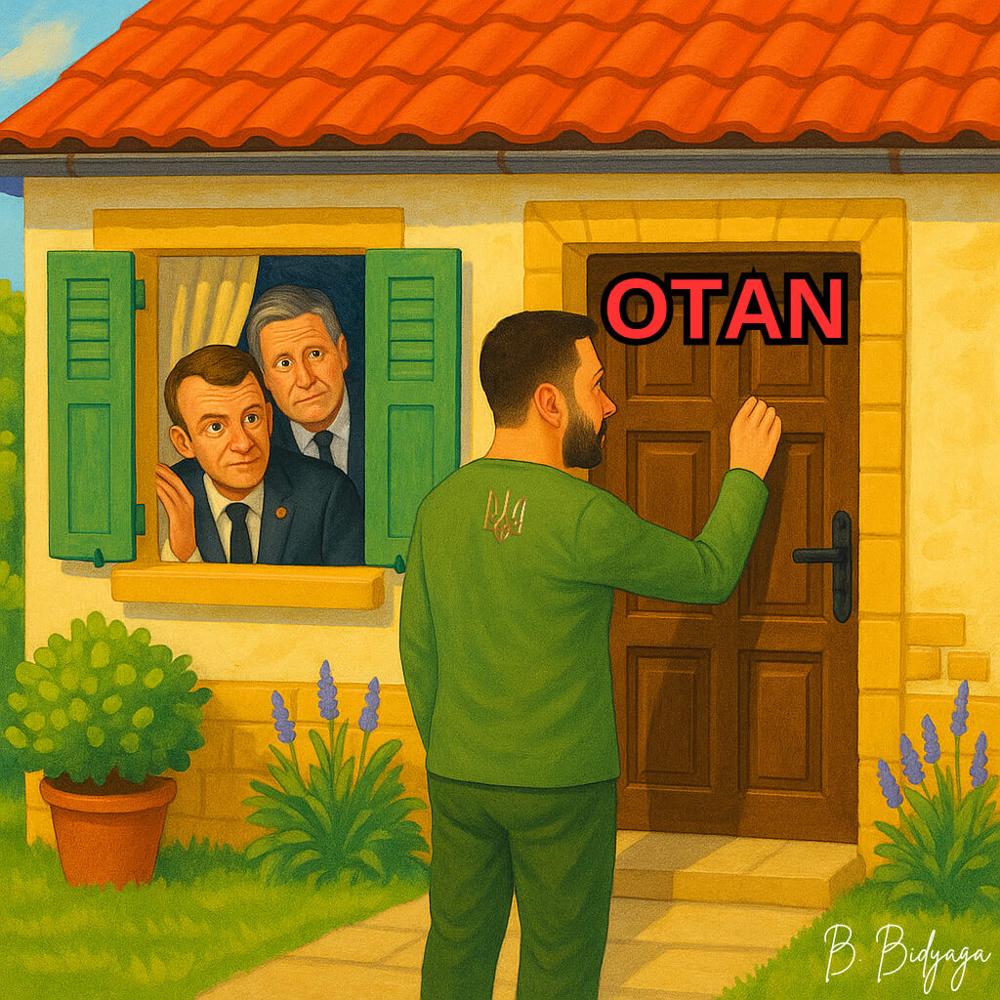

**La Russie** (méprisante) :

– Mais il n’a rien à faire dans l’OTAN. Avec son groin, il veut se goinfrer de petits fours ?

**Poutine** (avec fougue) :

– C’est bien ça : à chaque porc son auge. Qu’elle reste donc à bouffer de la boustifaille et à grogner de plaisir. Mais non, il faut qu’elle aille grogner dans des sommets débiles, à réclamer ses droits de goret. Et moi, personne ne veut même entendre parler de mes droits !

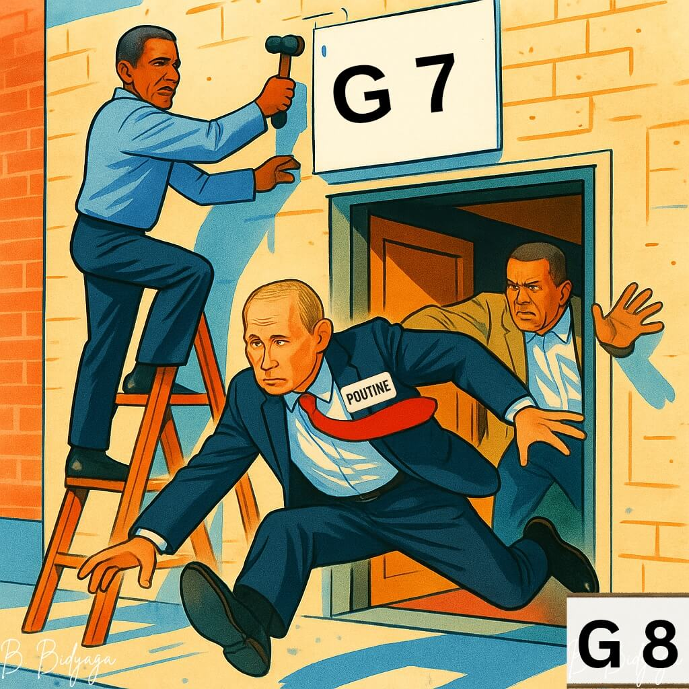

**Poutine** (avec aigreur) :

— Et pourtant, cette truie m’a volé mes terres ! Oui, elle me les a volées… et elle s’engraisse, elle ramasse des profits par milliards. Des terres russes de souche, soit dit en passant… Des terres où la Sainte Russie s'est établie, où le prince Vladimir Soleil-Rouge siégeait sur le trône… où il guerroyait contre les Petchénègues et les Coumans...

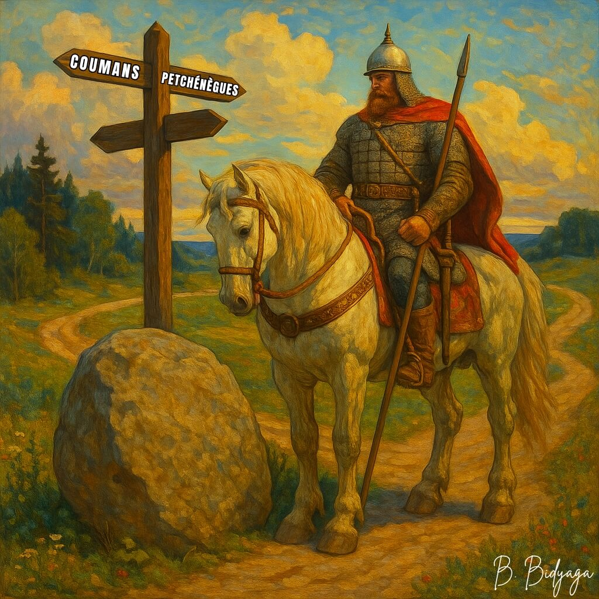

**La Russie** (insinuante) :

– Mais toi, tu en as bien assez, des terres, non ?
 
**Poutine** (la voix torturée) :

– Des terres ? Tu appelles ça des terres ? Des marais, des friches… de la toundra, de la taïga… qu’est-ce que tu veux que je fasse de ça ? Tandis qu’elle, elle a du tchernoziom, une terre grasse… Le grenier, tu comprends, qui nourrit le monde entier…

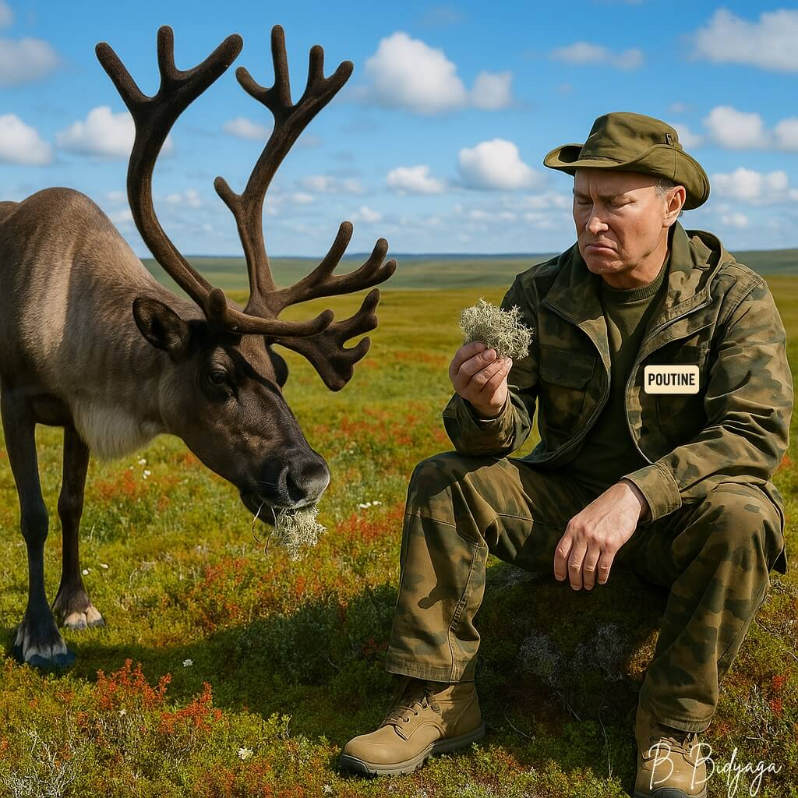

**La Russie** (réprobatrice) :

– Ah, quelle effrontée !

**Poutine** (d’un ton sombre) :

– Et les usines, les mines, les centrales… Tout ça, c’est nous, les Russes, qui l’avons construit de nos propres mains, tu comprends ?

(Il lève les mains vers son visage, les regarde longuement.)

  **Poutine** (après une pause) :

–  Et elle, elle a tout pris, et elle en profite. De quel droit ?

**La Russie** (le regardant avec une inquiétude) :

– On dirait que tes mains sont un peu… rouges, non ? Mais pourquoi ?

**Poutine** (agacé) :

– Tu débloques. Mes mains vont très bien. Va voir un médecin — fais vérifier ta vue.

**Poutine** (après une pause) :

– Bon… ce que je voulais dire… Cette saloperie… elle insulte notre peuple : elle leur interdit de parler russe.

**La Russie** (en colère) :

– Ah, faut lui arracher tous ses cheveux, quelle gonflée ! Alors, tu lui as réglé son compte ?

**Poutine** (accablé) :

– Je lui aurais bien montré, je lui aurais défoncé la gueule !… Mais c’est une garce rouée – elle a ouvert ses jambes aux Amerloques…

**La Russie** (exaltée) :

– Ah, quelle débauchée !

**Poutine** (impatient) :

– Voilà : une pute, on ne sait où lui mettre le fer. Une carpette de l’OTAN. Elle quémande des armes chez eux, tu vois.

**La Russie** (incrédule) :

– Et alors – ils lui donnent ?

**Poutine** (sans cacher sa rage) :

– Et comment ! Des chars. Des obus. Des missiles… Des missiles que même moi je n’ai pas, tu te rends compte ?

**Poutine** (la voix torturée) :

— D’un seul tir — plein dans le mille.
Ils ont déglingué tous mes dépôts de pétrole et mes raffineries. Je n’ai même plus de quoi ravitailler mes engins. Je vais devoir transporter mes munitions à dos de cheval.

**La Russie** (en levant les mains, horrifié) :

– Ah, mon Dieu ! Comment osent-ils !

**Poutine** (d’une voix tragique) :

– Près de Rostov, ils ont tapé si fort… La moitié du dépôt a flambé comme de la poudre. Cinq cents millions de bouts de papier partis en fumée en cinq jours. On n’arrive toujours pas à éteindre.

**La Russie** (chagrinée) :

– Quel malheur ! Et vous n’avez pas essayé de l’asperger avec de l’eau bénite ? Depuis un hélicoptère ?

**Poutine** (soupirant lourdement) :

– On a pourtant tout essayé ! On a fait dire une messe, apporté des reliques, et les popes avec les icônes ont fait une ronde…

**La Russie** (préoccupé ) :

– Et ça n’a pas aidé ? Quelle force impure ! Et vous n’avez pas fait le tour avec l’encensoir ?

**Poutine** (avec ferveur) :

– Si, avec l’encensoir. Trois fois.

**La Russie** (avec un air de compétence) :

– Et vous êtes allés dans quel sens ? Il faut faire le cercle solaire.

**Poutine** (agité) :

– C’est ce qu’on a fait, c’est ce qu’on a fait. Le cercle solaire. Dans le sens des aiguilles d’une montre.

**La Russie** (étonnée) :

– Et ça n’a pas aidé ?

**Poutine** (tristement, secouant la tête) :

– Que dalle.

**La Russie** (après une courte pause, se lamentant) :

– Sainte Marie ! Saints thaumaturges ! On t’a jeté le mauvais œil, mon petit ! Oh, le mauvais œil ! Les suppôts de Satan, les mécréants de l’étranger ! Oh là là ! Qu’allons-nous faire ? Il n’y a pas d’autre solution que d’aller voir une guérisseuse !

**Poutine** (agacé) :

– Quelle guérisseuse ? Qu’est-ce que tu racontes ?!
 
**La Russie** (continue de se lamenter) :

– Pour jeter un sort sur l’eau… « Sauve le serviteur de Dieu Vladimir du Serpent volant, du Serpent rampant, du malheur… Ennemi, Satan, homme mauvais, détourne-toi de lui, comme bête de bête, serpent de serpent, hérétique d’hérétique, sorcier de sorcière… Pouah, pouah, pouah ! » (Elle crache trois fois par-dessus son épaule gauche en se signant chaque fois.)

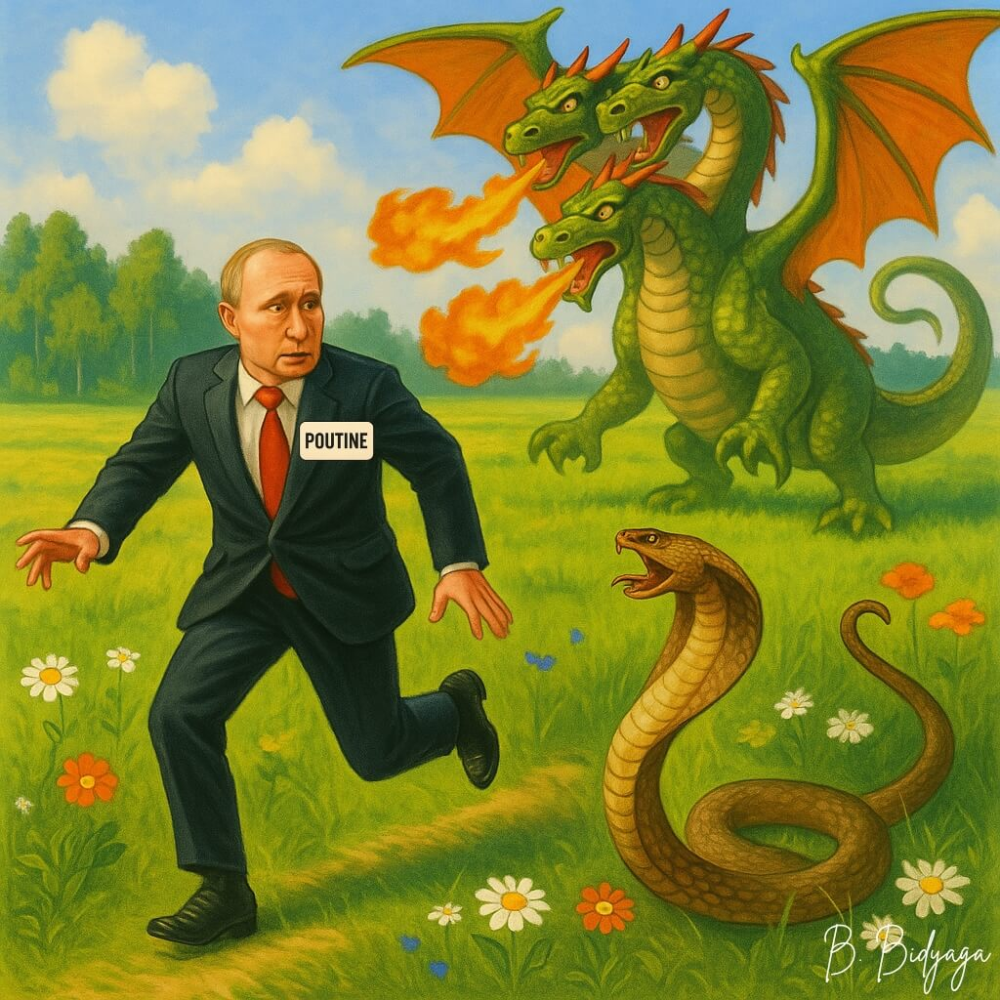

**La Russie** :

– Il faut ensorceler l’eau comme ça ; tu te laves trois fois avec cette eau sur le seuil, et tout s’arrangera, je te le jure ! Mais attention — il faut se laver à l’aube, au premier rayon du jour.

**Poutine** (incrédule) :

– Tu crois que ça aidera ?

**La Russie** (avec fougue) :

– Bien sûr que oui ! Et sur ta base pétrolière aussi, ils ont jeté un sort. Quand l’aube rougira à l’est, tu asperges le feu avec cette même eau ensorcelée, et à l’instant même le brasier s’éteindra.

**Poutine** (pensif) :

– Et où est-ce que je trouve cette guérisseuse ?

**La Russie** (volontiers) :

– Dans n’importe quelle église, tu trouveras une sorcière-guérisseuse. Fais le tour, demande : il y aura bien quelqu’un pour t’aider.

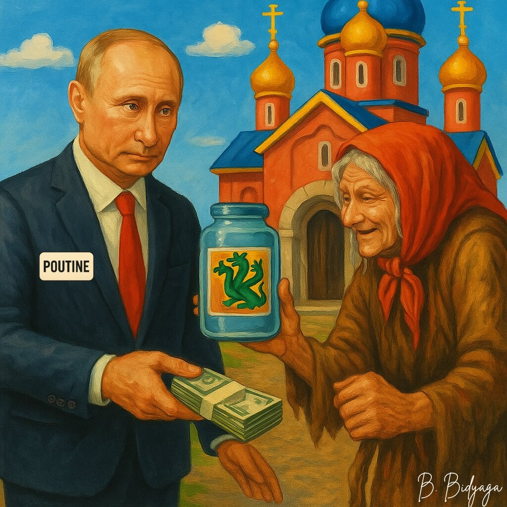

**La Russie** (après une pause) :

– Et autre chose. Méfie-toi des chats noirs. On ne sait jamais, cette impureté pourrait te traverser la route…

**Poutine** (d'un ton vantard) :

– Ces chats noirs, moi, d’un seul regard… L’autre jour, il y en a un qui s’est mis en travers de ma route. Je l’ai regardé d’un tel air — il a disparu à ce moment-là.

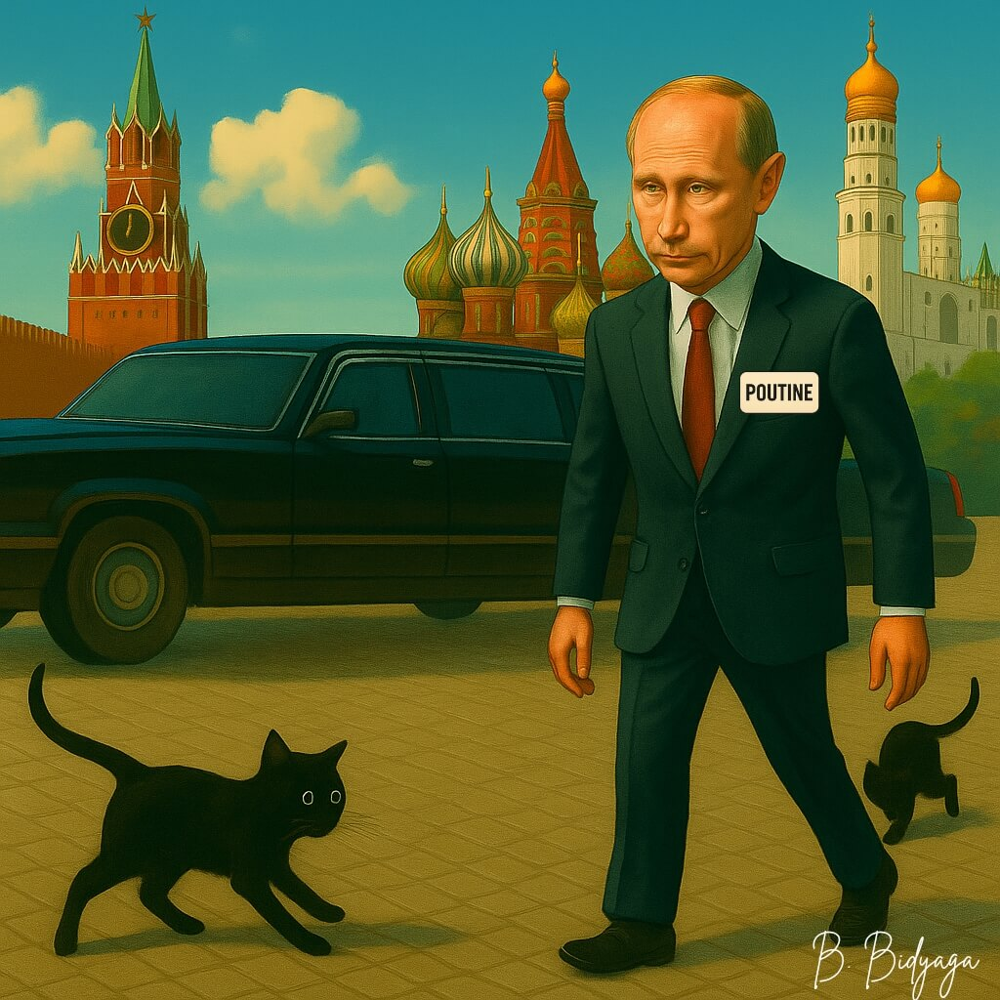

**La Russie** (approbative) :

– Ah, le beau gars ! Ah, quel brave !

**La Russie** (après une courte pause, agitée) :

– Et à ce suppôt de Satan, il faudrait lui offrir un philtre magique. Pour qu’il nous fiche la paix et qu’il y ait de l’amour entre nous !

**Poutine** (l’interrompant, avec un ricanement diabolique) :

– On lui a déjà servi un « philtre d’amour »... De notre laboratoire secret. Ça n’a pas marché.

**La Russie** (pensive) :

– Sinon, enterre une grenouille dans une fourmilière, et au bout de deux semaines tu auras une petite pelle et un petit crochet. Tu accroches ce crochet discrètement à sa veste, et il dépérira, c’est certain – il dépérira.

**Poutine** (avec arrogance) :

– Et j’ai que faire de tes grenouilles ? Je peux le tuer sans aucun crochet. On est tout de même au vingt-et-unième siècle, bon sang !

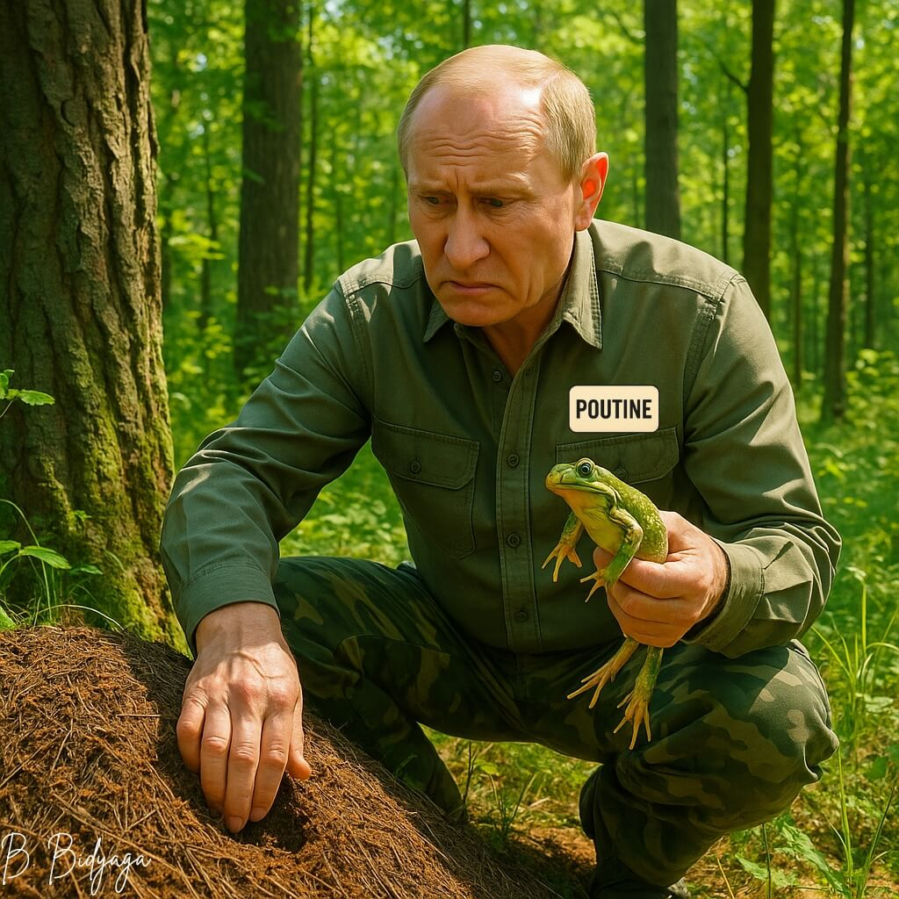

**La Russie** (étonnée) :

– Alors ?

**Poutine** (déprimé) :

– Alors quoi ? Je fais ce que je peux… J’ai peur qu’ils se vengent. Le bâton a deux bouts…

(Une petite pause.)

**Poutine** (avec amertume et rancœur) :

– Ils ont maintenant des avions ! Américains ! Des F16 ! Tu entends ? Ce n’est pas un avion, c’est un dragon de feu ! Tu crois qu’il sait seulement lancer des bombes ? Que nenni ! C’est aussi un chasseur, et un intercepteur ! Trois en un, nom de Dieu !  Salope ! Salope ! Salope !

**La Russie** (avec condamnation) :

– Voyez un peu ce qu’ils inventent, les damnés démons !

**Poutine** (éclatant en cris) :

– Il a un radar à réseau phasé ! Tu piges ? Il voit toutes les cibles à trois cent cinquante kilomètres !

**La Russie** (déconcertée) :

– Qui ?

**Poutine** (agacé) :

– Le pilote ! Celui qui est dans l’avion !

**La Russie** (avec condamnation) :

– Ah, le parasite !

**Poutine** (près de sangloter) :

– Et par le brouillard, et par mauvais temps… il voit tout !

**La Russie** (battant des cils stupidement) :

– Mais, dis donc !

**Poutine** (exalté) :

– Il me voit au Kremlin !!!

**La Russie** (douteuse) :

– Mais… jusqu’au Kremlin, y a sûrement plus de trois cent cinquante kilomètres ?

**Poutine** (indigné) :

– Mais ils envahissent notre territoire ! Ils violent la frontière nationale ! Ils piétinent le droit international ! Ils franchissent mes (!) lignes rouges ! Ils terrorisent la population civile ! C’est du banditisme pur et simple !!!
Avec exhibition de symboles nazis…

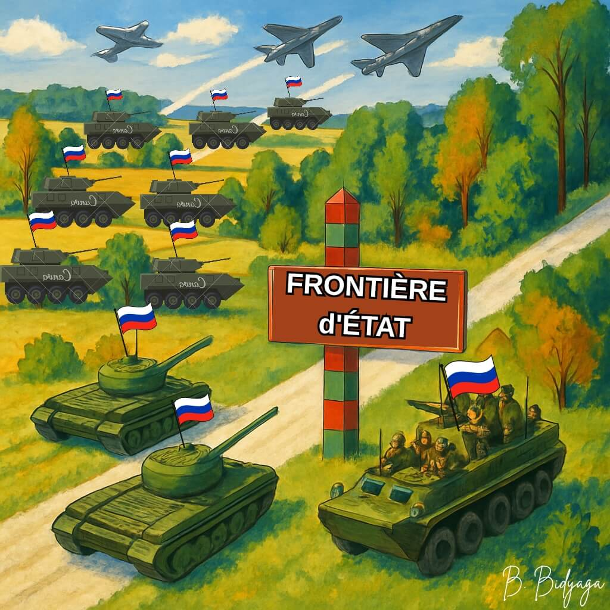

**La Russie** (avec colère) :

– Ah, les vauriens ! Et où regarde donc cette… comment déjà… l’ONU ?

**Poutine** (avec un mépris) :

– L’ONU… Un carillon à vent.

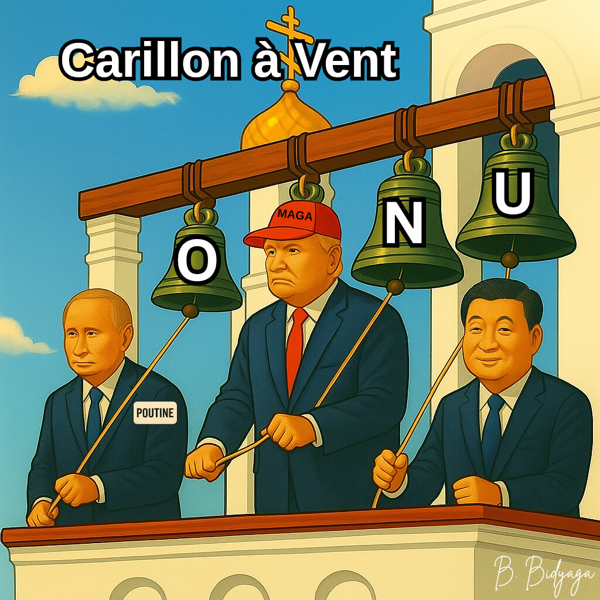

(Un lourd silence s’installe.)

**Poutine** (au bout d’une demi-minute, le visage déformé par la haine) : 

– En plus, elle a quémandé aux Amerloques des brouilleurs tout neufs, hyper modernes, que même les armées de l’OTAN n’ont ! Tu piges le truc ? Lui… il me voit ! Et moi… je ne le vois pas !!!

**La Russie** (l’air idiot) :

– Qui ?

**Poutine** (éclatant en cris) :

– Le pilote, bon sang ! Celui qui est dans l’avion ! Il a un navet de malade, un truc de ouf, que tous mes radars peuvent aller se faire foutre !

> «Navet» en russe a deux significations :
> 1. Navet (légume)
> 2. Moyens de guerre électronique (jargon militaire)

**La Russie** (indignée) :

— Ah, les canailles ! Ils ont piqué notre valeur traditionnelle ! Touche pas à notre navet, sales barbares ! Bouffez donc votre maïs ! Et crèvez-en, tiens !

**Poutine** (avec un rire amer) :

– Du calme ! C’est un autre genre de navet.

**La Russie** (avec aversion) :

– Génétiquement modifié ?

**Poutine** (agacé) :

– Mais non ! Des brouilleurs électroniques.
Ils brouillent mes radars à zéro ! Et voilà : un avion invisible, bordel ! C’est plus une guerre, c’est un conte de fées !

**La Russie** (consternée) :

– Qu’est-ce que ça veut dire ? On dirait que tu joues à colin-maillard avec eux ?

**Poutine** (avec un ricanement amer) :

– Ouais, c’est ça, une putain de guerre à colin-maillard !

(Ils se taisent tous les deux pendant une minute. Poutine est plongé dans ses pensées, son visage plus sombre que la tempête. La Russie, l’air désapprobateur, remue silencieusement les lèvres.)

**Poutine** (soudainement, brandissant les poings avec rage) :

– Maudits Amerloques !

**La Russie** (compatissante) :

– Eh oui… Ces Amerloques… Quelle horreur ! Ils laissent jamais de répit au peuple russe. Tiens, Obama, l’autre jour… il a pissé dans **tous** nos ascenseurs, ce salaud. Et en plus, il a fait flamber le prix de l’essence !

**Poutine** (agacé) :

– Quel Obama ? Réveille-toi de ton hibernation, bon sang ! Après Obama, y a déjà eu deux présidents. C’est Biden, maintenant !

**La Russie** (acquiesçant) :

– Ben oui, ben oui. C’est bien ce que je dis. Faudrait aussi lui pisser dans tous les ascenseurs de sa… de sa… comment déjà… Maison Blanche ! Trop blanche ! Ça éblouit ! Qu’elle jaunisse un peu ! Oh, celui-là ! Il fait son malin !

**Poutine** (écumant de rage) :

– Mais on s’en fout des ascenseurs !!!

(Un silence tendu s’installe. La Russie, l’air coupable, ouvre la bouche, s’efforçant de dire quelque chose, mais, ne trouvant pas ses mots, agite la main avec désespoir et baisse les yeux vers le sol.)

**Poutine** (après une pause, pensivement) :

– Tu sais ce que je pense ?

**La Russie** (obsequieuse) :

– Quoi ?

**Poutine** :

– J’soupçonne une intervention extraterrestre dans cette histoire.

**La Russie** (terrifiée) :

– Comment ?! Des aliens ?! Des autres mondes ?!

**Poutine** (d'une voix douloureuse, se transformant en colère) :

– Exactement ! On dirait que les nazis de tout le système solaire se sont ligués contre moi ! Avec à leur tête ce bloc immonde, sanguinaire et agressif de l’OTAN ! Des homosexuels ! Des pédés purulents ! Parent un ! Parent deux ! **Des XenoGalAgents !!!**

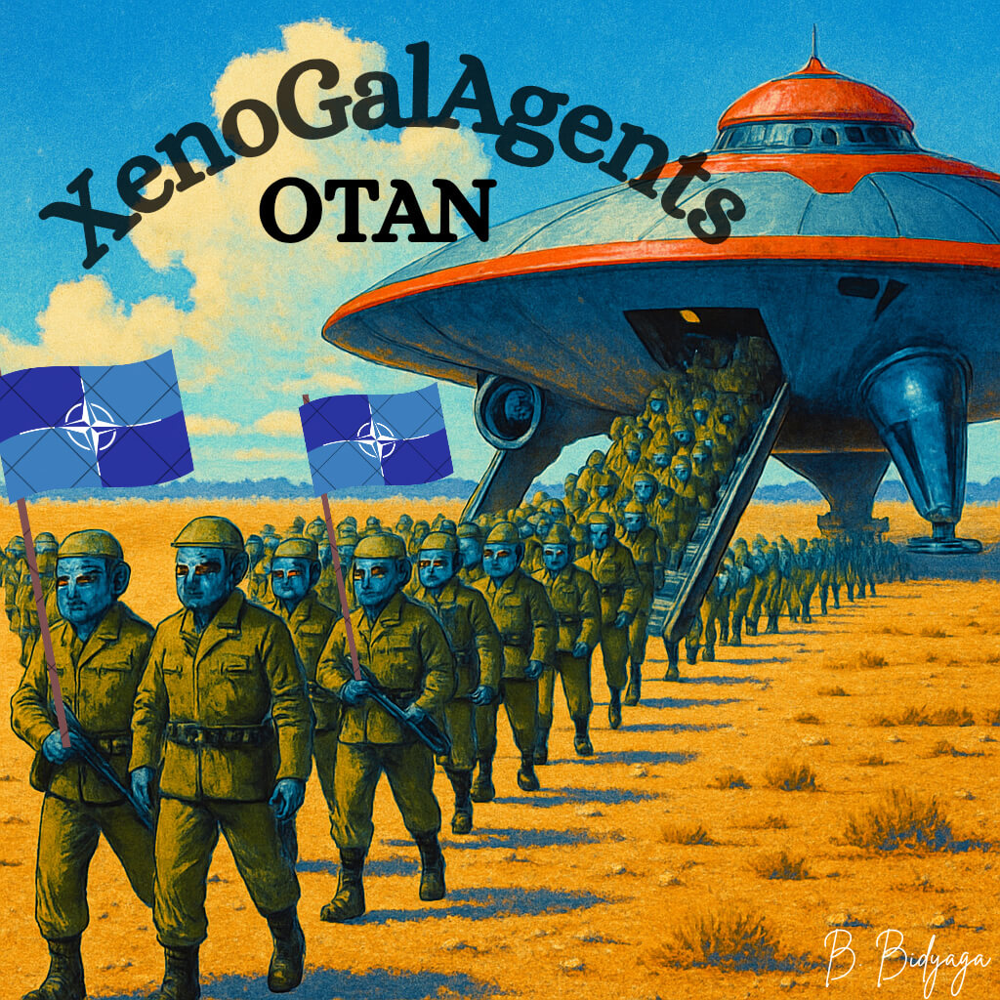

**Poutine** (explose soudain en un hurlement strident) :

– Je vais faire sauter cet univers tout entier, bordel de merde !!!

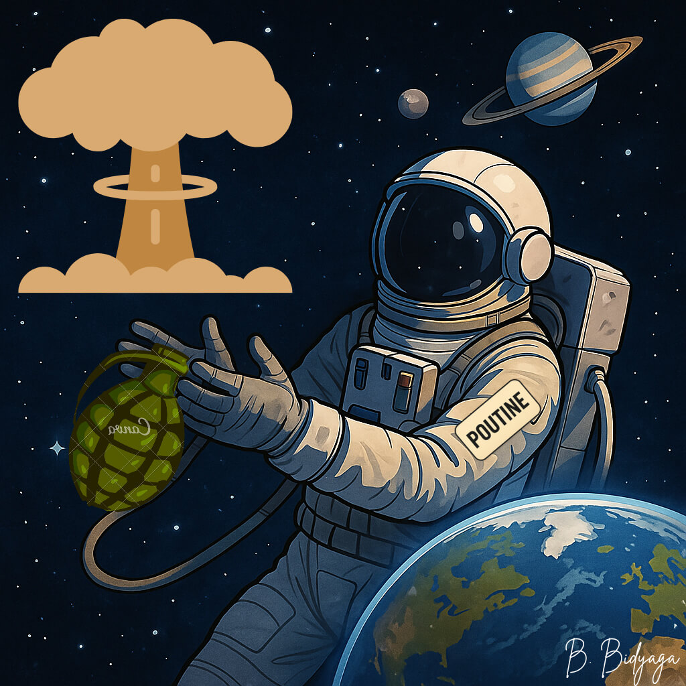

**La Russie**  :

– Seigneur, que ta volonté soit faite ! 

(Elle commence à chuchoter convulsivement une prière, se signant menu et cognant parfois la tête contre le sol avec un bruit sourd. Poutine, ayant évacué sa tension, se calme vite et marmonne à mi-voix.)

 **Poutine** :

– Bon, ouais… là-bas, ils sont tous gender neutre… Sans caractères sexuels primaires… Dieu merci, nous ne sommes pas comme ça  !

(Il palpe ses propres caractères sexuels primaires et hoche la tête avec satisfaction. La Russie cesse de se prosterner et le regarde avec une appréhension muette.)

**Poutine** (accablé, peu à peu s'échauffant) :

– Du traquenard partout… De la trahison à chaque coin ! Les généraux bradent la Patrie. Au détail et en gros !... Tout le ravitaillement a été détourné. En temps de paix, passe encore – volez, volez, allez-y… Mais en temps de guerre ?! Plus aucune honte ! Ils vendent mes chars à mes ennemis ! Directement à travers la ligne de front ! De main à main !  Dans un emballage cadeau ! Avec un putain de nœud papillon sur la tourelle ! Berk ! Fils de pute !!!

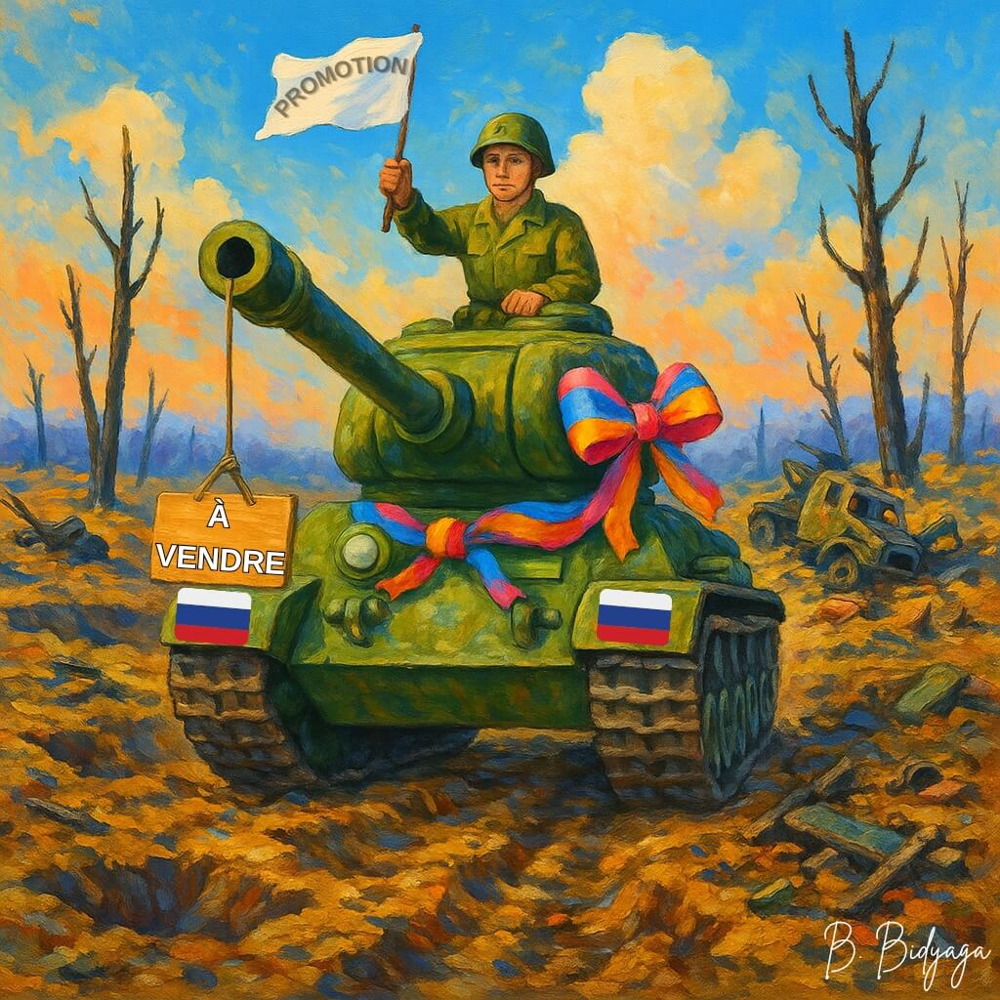

**La Russie** (secouant la tête, accablée) :

– Donc ils me volent, moi… et toi aussi… Voilà donc… Complètement ingérables…

**Poutine** (désespéré) :

– Ah, à quoi bon en parler…

(Il se tait et réfléchit. La Russie le regarde comme un chiot dévoué.)

**Poutine** (après une pause, avec un ricanement tordu) :

– Bon… pourquoi parler que de choses tristes et dégueulasses ?

(Il déboutonne lentement sa veste. S’approche tout près de la Russie.)

**Poutine** (avec lubricité) :

– Occupons-nous plutôt d’un petit plaisir.

**La Russie** (en hochant la tête) :

– Allons, mon mignon, allons.

(Poutine la contourne par derrière, pose ses mains sur ses flancs décharnés et les retire aussitôt.)

**Poutine** (avec étonnement) :

– Mais qu’est-ce que tu as donc tant maigri, ma petite mère ? Rien que la peau sur les os ?

**La Russie** (hausse les épaules) :

– Je m'étonne moi-même...

**Poutine** (avec dépit) :

– Même pas de quoi tenir… Où est passée toute ta chair ?

**La Russie** (d’une voix terne) :

– Et comment le saurais-je ? Je mange comme d’habitude, et pourtant… ma chair s’en va.

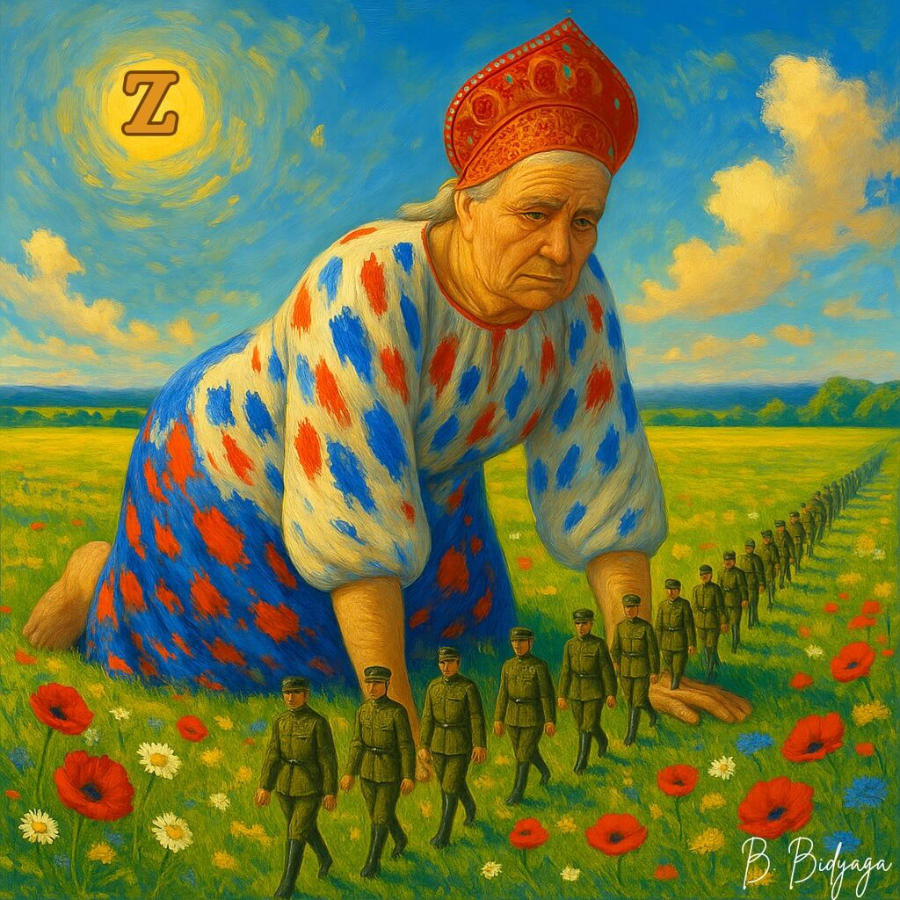

**Poutine** (inquiet) :

– Et ça dure depuis quand ?

**La Russie** (s’efforce de se souvenir) :

– On est dans quel mois ? Août deux mille vingt-quatre ?

**Poutine** :

– Oui. Vingt-quatre août.

**La Russie** (un éclair de lucidité tragique) :

– Eh ben ça alors ! Pile deux ans et demi que je me vide !

**Poutine** (troublé) :

– Mais pourquoi ?

**La Russie** (en colère) :

– C’est encore un sort qu’ils m’ont jeté, les suppôts de Satan, les ennemis du peuple russe ! Ils m’ont envoûtée et maudite !!!

(Un silence s’installe. Poutine, perplexe, se gratte la nuque. La peau de son front se plisse ; on devine que ça turbine fort dans sa tête. Au bout d’une minute ou deux, son visage se détend ; il pose de nouveau ses mains sur les flancs décharnés de la Russie.)

**Poutine** (avec détermination) :

– Allez, petite mère, debout.

**La Russie** (d'une voix capricieuse) :

– Pourquoi faire ? Je suis bien comme ça.

**Poutine** (caressant le large dos de la Russie) :

– Ma chérie, lève-toi de tes genoux, s’il te plaît !

**La Russie** (coquettement) :

– Je croyais que cette position te plaisait… Tout à l’heure, tu gémissais… comme un fiancé la nuit de noces…

**Poutine** (irrité) :

– Gémir ou pas… c’est pas ça… J’ai juste envie de nouvelles… conquêtes… je veux dire : de nouveaux oléoducs… merde ! De nouvelles positions ! Et toi, ça te dit pas, un peu de nouveauté ?

**La Russie** (hausse les épaules) :

– Du nouveau ? Ce qui est vieux et oublié ? Bon… pourquoi pas du nouveau…

**Poutine** (satisfait, avec un sourire cynique) :

– Voilà qui est bien, voilà qui est sage ! Mais… qu’est-ce que je peux bien te trouver, à aimer une vieille carne comme toi ?

**La Russie** (avec nostalgie) :

– Je suis grande et riche… Enfin, riche, je l’étais…

**Poutine** (satisfait) :

– Oui… Et maintenant, c’est moi qui suis riche…

(Il la regarde fixement. Un dégoût mal dissimulé apparaît sur son visage.)

 **Poutine** :

– Mais t’as vieilli, petite mère… Et t’as enlaidi.

**La Russie** (offensé) :

– Et qu’est-ce que tu voulais ? Quand tout un coopérative te viole jour et nuit… Ni repos ni trêve avec ces parasites…

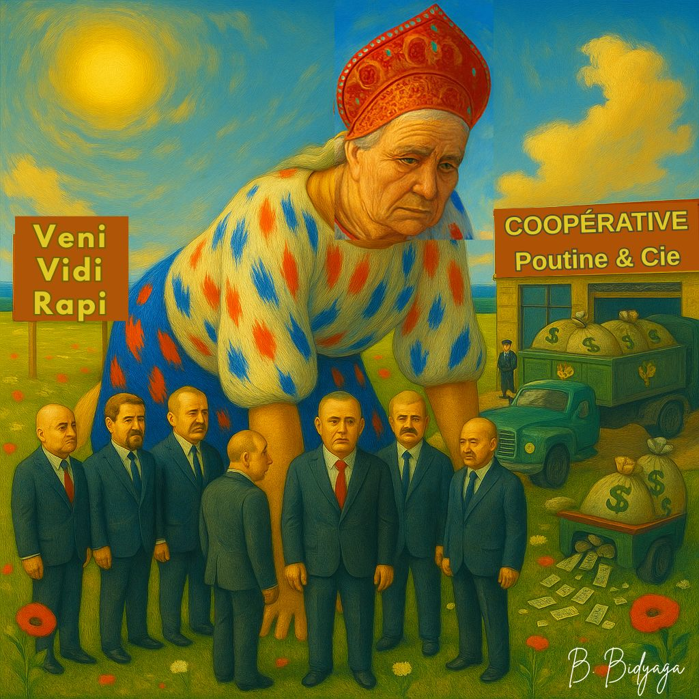

**Poutine** (hautain) :

– Oh là, madame, doucement ! Ce sont mes amis, quand même ! Et puis, pourquoi tu t’offenses ? Tu devrais être fière. Est-ce un péché de se donner à un bon homme ? Et c’est tous des types formidables, je le jure sur ma mère.

**La Russie** (marmonnant pour elle-même) :

– À un bon homme ?… Pourquoi pas se donner… On peut se donner… bien sûr… Mais ils sont si avides…

**Poutine** (conciliant) :

– Allons, tu es si grande ! Pour toi – ce n'est rien  !

**Poutine** (après une pause) :

– Alors, on essaie la nouvelle position ?

(La Russie, grognant et gémissant, tente de se lever de ses genoux, mais échoue.)

**La Russie** (plaintivement) :

– Je suis trop fatiguée, je tiens pas debout… Et si on laissait tomber, cette nouvelle position ? À genoux, j’suis habituée…

**Poutine** (sévèrement) :

– Debout ! Lève-toi de tes genoux !

**La Russie** (d'une voix larmoyante) :

– Mais pourquoi se lever ?

**Poutine** (solennellement) :

– Mieux vaut mourir debout que vivre à genoux !

**La Russie** (levant les mains, effrayée) :

– De quoi tu parles ?! Pourquoi mourir ?

**Poutine** (à part, ricanant) :

– D’orgasme, petite mère. D’orgasme.

**La Russie** (méfiante) :

– Vraiment ? On peut mourir de ça ?

**Poutine** (ton paternaliste) :

– On peut. Si l’orgasme est fort… et l’organisme faible.

**La Russie** (ravie) :

– Mourir dans tes bras… ce serait un grand honneur ! Mon aimé…

**Poutine** (indifférent) :

– Bon, oui, bon, oui…

(Petite pause.)

**Poutine** (avec convoitise) :

– Dis-moi comme tu m’aimes.

**La Russie** (avec tendresse) :

– Je t’aime, mon mignon, oh comme je t’aime ! À soixante-dix-huit virgule neuf pour cent. Demande à l’IFOP ! Des savants, eux. Ils mentent pas.

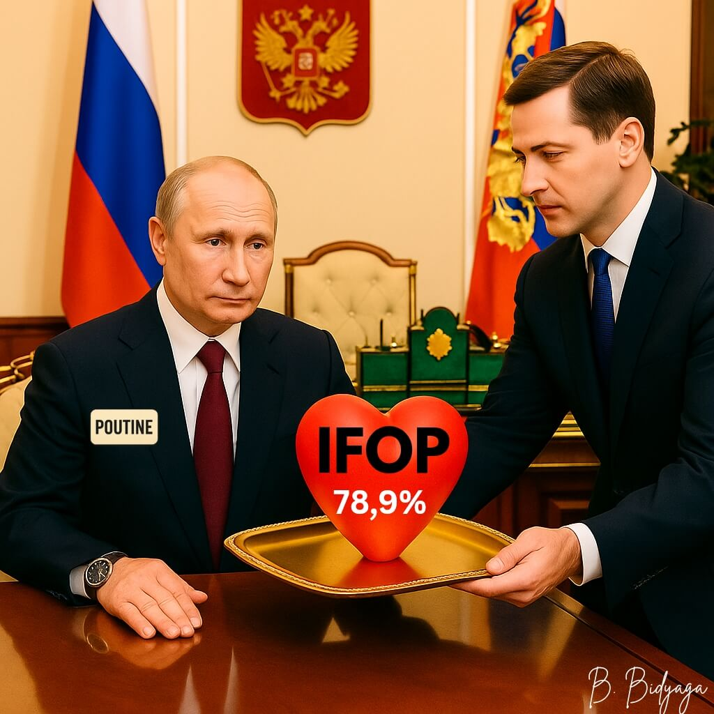

**Poutine** (enfonçant légèrement son éperon dans le cul flasque de la Russie, d'un ton moqueur) :

– Et là ? Ça fait combien de pour cent ?

**La Russie** (gémissements d'extase) :

– Oh… si bon avec toi… Encore, mon petit… encore…

**Poutine** (enfonçant l’éperon à fond) :

– Comme ça ? Ça va ?

**La Russie** (entre deux soupirs) :

– J’en peux plus… je vais… venir… venir… venir…

(Pause)

**La Russie** (voix tremblante et éteinte) :

– Je sens… que je… meurs… Tu viens avec moi, mon chéri ?

**Poutine** (de façon moqueuse) :

– Moi, mourir ? Tu rêves. Moi, jamais. J’suis pas prêt à crever — j’ai encore d’autres affaires.

**La Russie** (lentement, péniblement) :

– Mais… Volodine… tout à l’heure… il a dit quoi ?… « Pas de Poutine… pas de Russie ? »

> Viatcheslav Volodine, président de la Douma. On lui attribue la formule : « S’il y a Poutine, il y a la Russie. Pas de Poutine – pas de Russie. »

**Poutine** (froidement) :

– L’inverse, heureusement, n’est pas vrai. La Russie peut crever — Poutine reste.

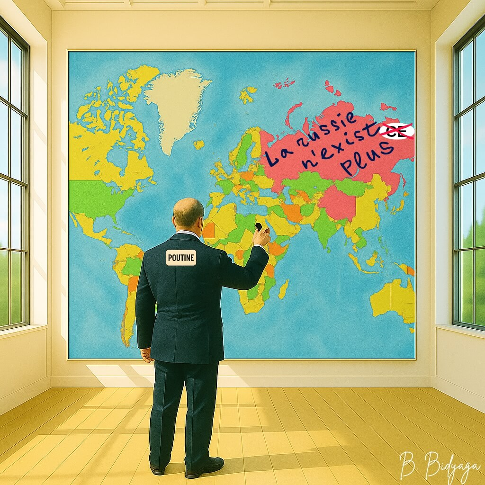

(Il la regarde avec dégoût, la voit se tordre dans l’agonie, puis se détourne et sort.)

24.09.2024

Turquie – Géorgie

ISBN 978-5-9903439-2-4

© Щеглова О.В., 2024

[**Liste des fondations caritatives en soutien à l’Ukraine**](fr_funds)

[**Page d'accueil**](index.md)

