## Щеглова Ольга (Борис Бидяга) 
# ВСТАЮЩАЯ С КОЛЕН

### Сатирическая  мини-пьеса
 
### на 72-ю годовщину рождения Путина

## Действующие лица: 

– Россия;
– Путин, называющий себя президентом России.

> Россия стоит на коленях, задумчиво глядя в пространство. Входит Путин, одетый в военную форму, на ногах – сапоги со шпорами. Увидев Россию, сердито вскрикивает.

**Путин**:
– Ты опять на коленях? Какого черта? Я же поднял тебя с колен!

**Россия** (встрепенувшись):
– Ой, миленочек пожаловал! А я-то уж и не чаяла... Заждалась совсем... Ну рассказывай: где пропадал, что поделывал?

**Путин** (хмуро):
– На войну ходил.

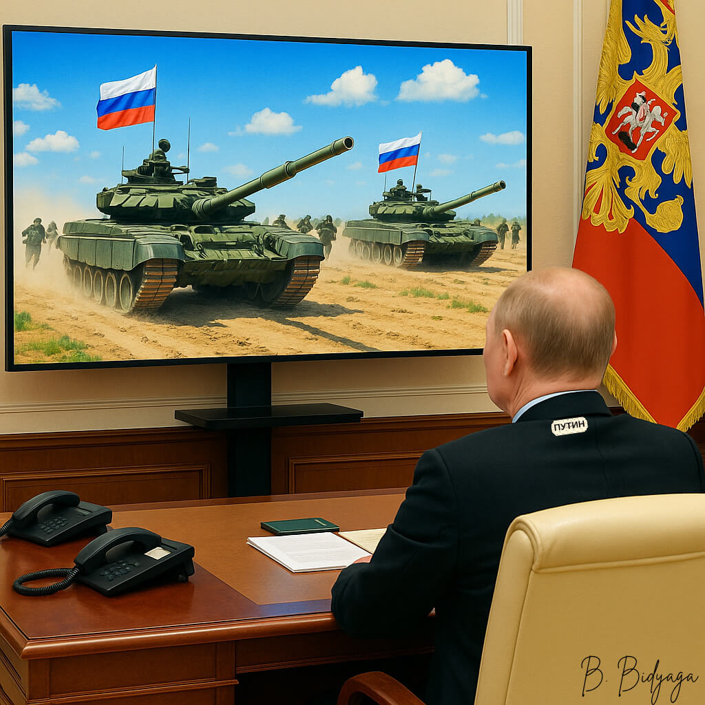

**Россия** (с неподдельным интересом): 
– На войну? А с чего это ты войну-то затеял? С кем-нибудь поссорился? Али кто обидел тебя?

**Путин** (с ненавистью):
– Да дура эта заносчивая, соседка твоя...

**Россия** (с живостью):
– Это которая слева? Али справа?

**Путин** (угрюмо):
– Слева. Возомнила себя, понимаешь, самобытной нацией... Да какая ты нация? Шлюха жовто-блакитная... Побочный продукт исторического развития... Вот ты кто.

**Россия** (согласно кивая):
– Ах она бесстыдница!

**Путин** (с презрением):
– Да ещё в президенты себе кого взяла?

**Россия** (простодушно):
– Кого?

**Путин** (желчно):
– Да клоуна этого, прости Господи, ко всему ещё и еврея! Ему только на сцене паясничать, а он кривляется с высоких трибун, все в НАТО норовит пролезть.

**Россия** (презрительно):
– Да куда ему в НАТО – со свиным рылом в калашный ряд...

**Путин** (с жаром):
– Об том и речь: свинье место в свинарнике. Сиди себе кушай ботвинью и похрюкивай от удовольствия. Не-ет, она хрюкает на каких-то дурацких саммитах, всё права свои поросячьи качает. А чё-то как-то про мои права никто и слышать ничего не хочет. 

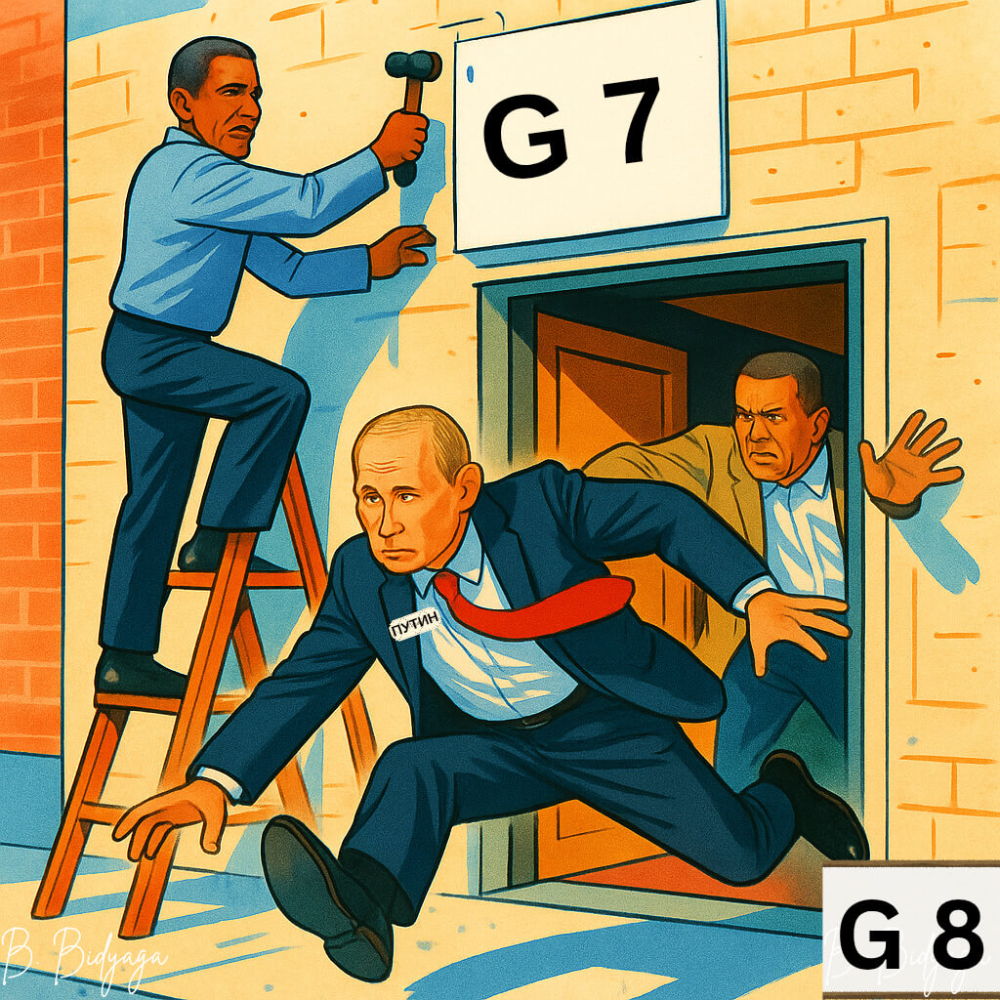

**Путин** (продолжает):
– А ведь эта свинья мои земли захапала! Захапала и жирует, прибыль гребёт триллионами. Земли-то, между прочим, исконно русские... На этой земле Русь святая стояла, князь Владимир Красно Солнышко  на престоле сидел, ходил войной на печенегов и половцев ...

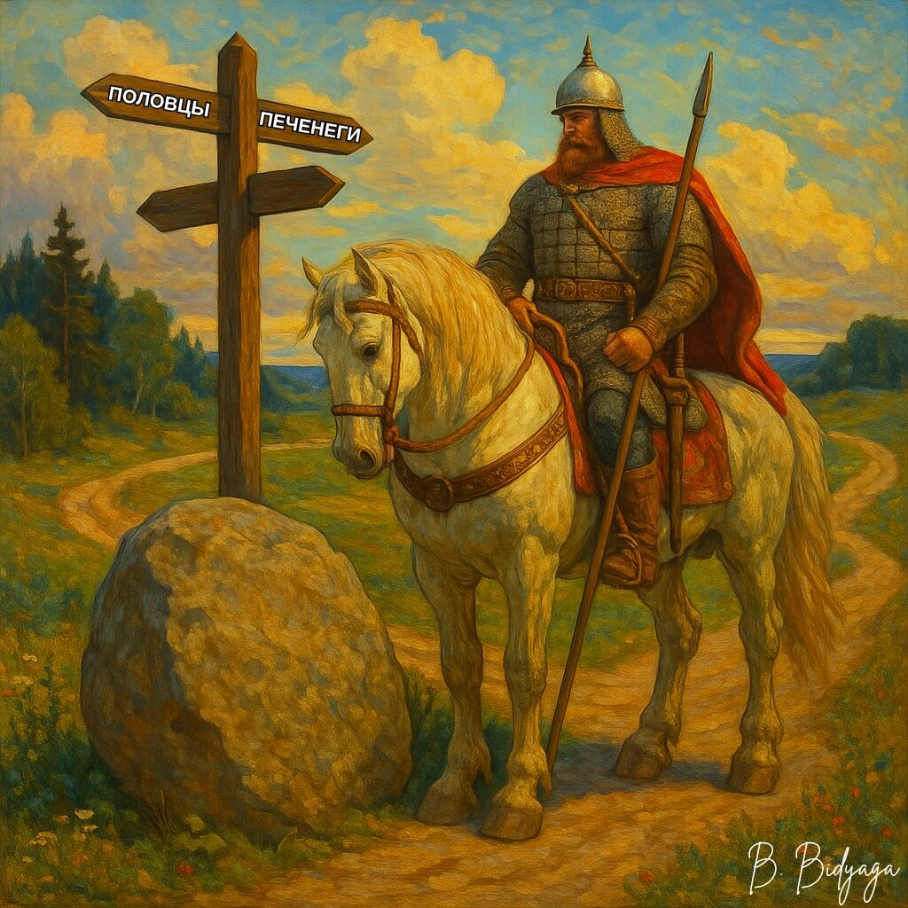

**Россия** (вкрадчиво):
– Так у тебя, поди, и своей земли-то хватает?

**Путин** (с мукой в голосе):
– Да разве ж это земля? Одни болота да пустоши, тундра с тайгой – что на них вырастет? А у нее-то чернозём, землица жирная... Житница, понимаешь, всему миру кормилица...

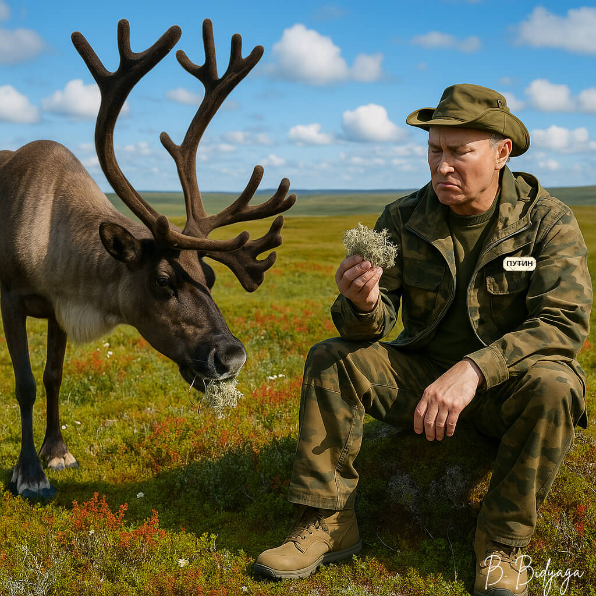

**Россия** (укоризненно):
– Ах она безобразница!

**Путин** (меланхолично):
– А заводы, шахты, электростанции... Все это мы, русские, вот этими руками построили, понимаешь?

(Путин поднимает руки к лицу и внимательно их разглядывает.)

**Путин** (продолжает):
– А  она это все захватила и пользуется. По какому праву?

**Россия**:
– А чего это руки у тебя какие-то  красные?

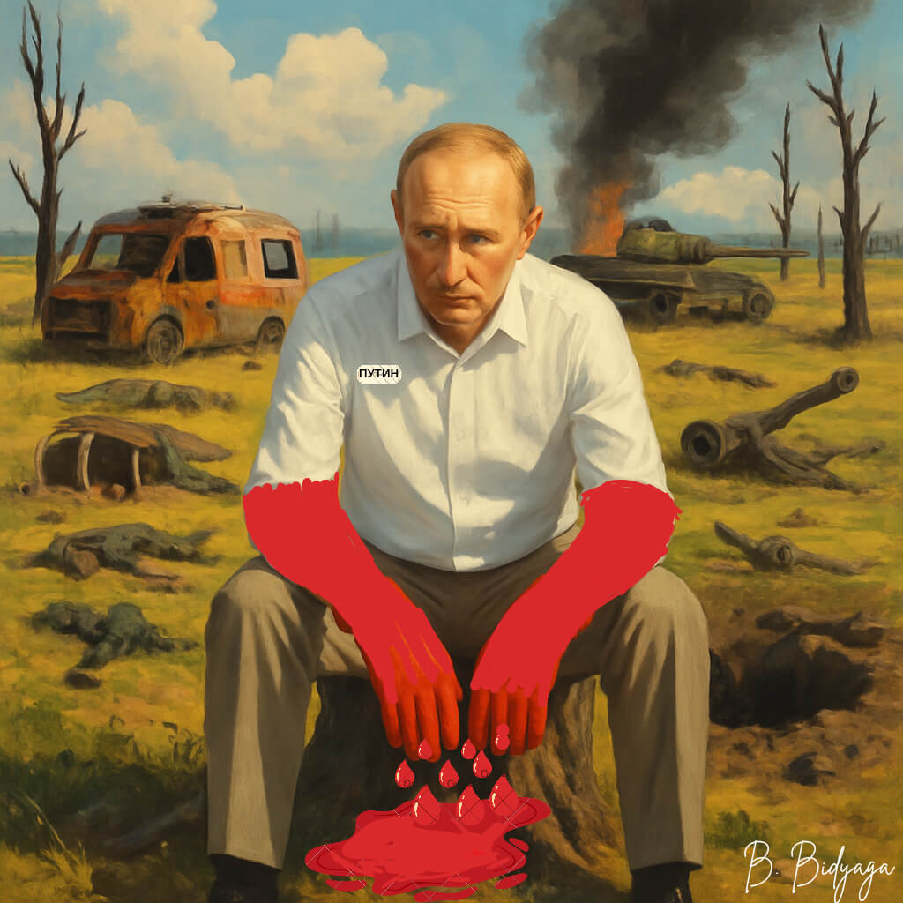

**Путин** (с раздражением):
– Глючит тебя. Руки как руки. Сходи к врачу – проверь зрение.

(Пауза)

**Путин**:
– Так вот, что я хотел сказать-то... Ведь эта зараза... наших людей обижает: не даёт им по-русски разговаривать.
Представляешь?

**Россия** (сердито):
– Да ей все волосья надо повыдёргивать, этакая нахалка! Ну ты ей показал, где раки зимуют?

**Путин** (удручённо):
– Да я бы ей показал, я б ей кишки на шею намотал... Но она ведь баба прожжённая – легла под пиндосов ...

**Россия** (в экзальтации):
– Ах она развратница!

**Путин** (нетерпеливо):
– Так я же и говорю: шлюха, клейма ставить некуда. Натовская подстилка. Клянчит, понимаешь, у них оружие.

**Россия** (недоверчиво):
– И что – дают?

**Путин** (не скрывая своей ярости):
– Ещё как дают! Танки, снаряды, ракеты... 

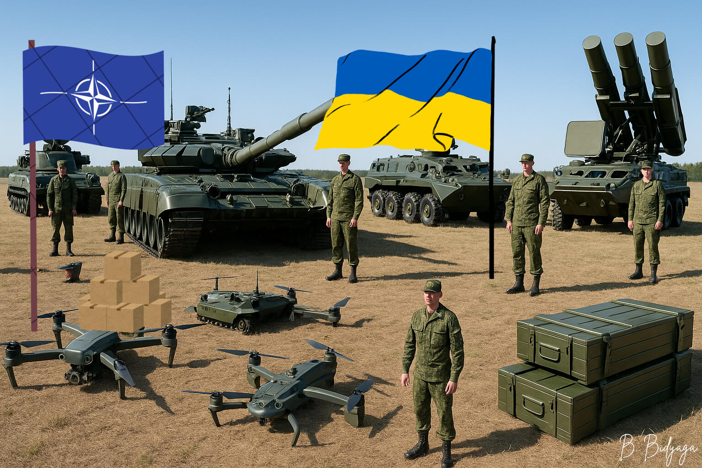

**Путин** (продолжает):
– Таких ракет даже у меня нету, понимаешь? С одного выстрела – прямо в яблочко. Расхерачили мне все нефтехранилища и НПЗ  –  мне ведь технику заправлять нечем. Хоть на лошадях снаряды подвози.

**Россия** (всплеснув руками):
– Ах боже мой! Да как они смеют!

**Путин** (трагическим голосом):
– Под Ростовом так шарахнули – полхранилища, как порох, вспыхнуло. За пять дней сгорело на полмиллиарда рубликов. До сих пор потушить не могут.

**Россия** (огорченно):
– Вот беда! А попрыскать святой водицей не пробовали? С вертолета?

**Путин** (тяжело вздыхая):
– Да уж и молебен отслужили, и мощи подносили, и попы с иконами хоровод водили…

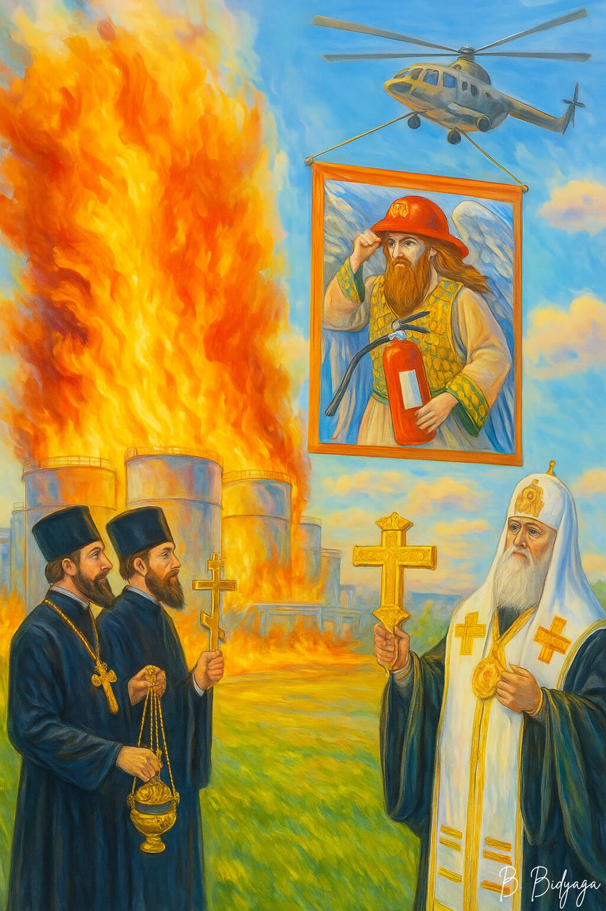

**Россия** (озабоченно):
– И не помогло? Вот нечистая сила! А с кадилом вокруг не обошли?

**Путин** (истово):
– И с кадилом обошли. Три раза обошли.

**Россия** (наставительно):
– А как шли? Обходить надо по солнечному кругу.

**Путин** (суетливо):
– Так и сделали, так и сделали. По солнечному кругу. По часовой стрелке.

**Россия** (удивленно):
– И не помогло?

**Путин** (с грустью, отрицательно качая головой):
– Ни хрена не помогло.

(Россия после короткой паузы вдруг хватается за голову и начинает голосить.)

**Россия**:
– Батюшки-светы! Святые угодники! Сглазили тебя, милёночек! Ой, сглазили! Супостаты окаянные, нехристи чужеземные! Ой-ой-ой! Что же делать-то? Не иначе как к бабке придется идти!

**Путин** (с раздражением):
– К какой еще бабке? Что ты несешь?!

**Россия** (продолжает голосить):
– Заговор на воду наговаривать… Спаси раба Божьего Володимера от Змея летучаго, от Змея ползучаго, от несчастнаго случая… Враг, сатана, лихой человек, откачнитесь от него, как зверь от зверя, змей от змея, еретик от еретицы, колдун от колдуницы… Тьфу, тьфу, тьфу… [Трижды плюет через левое плечо и трижды осеняет себя крёстным знамением.] 

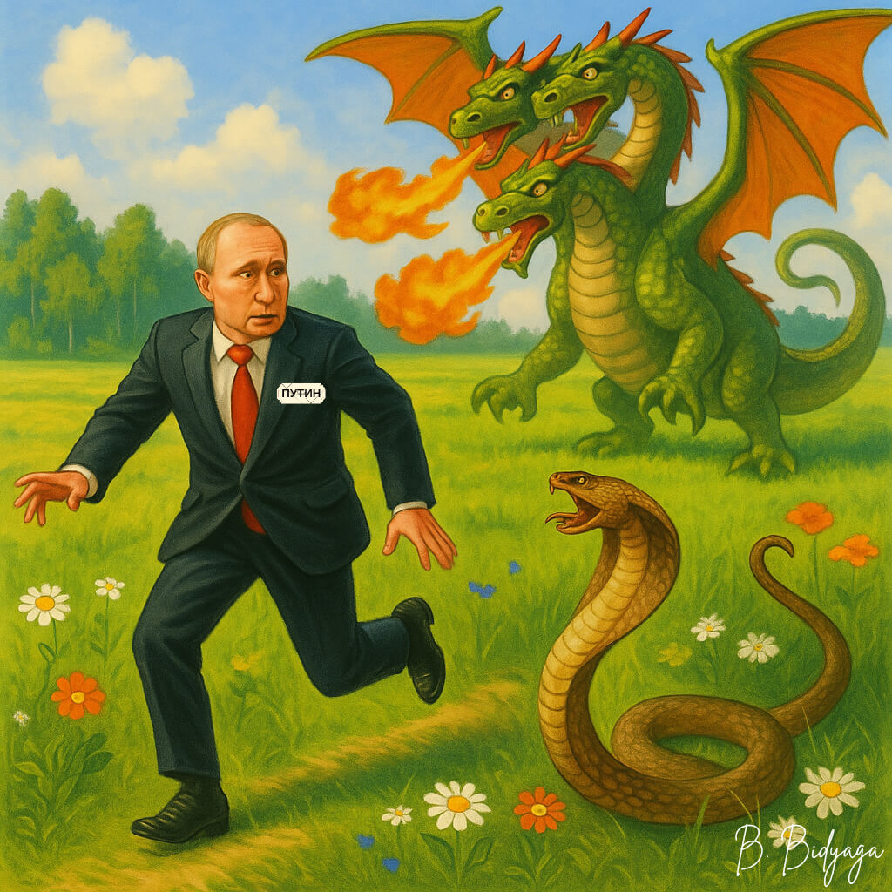

**Россия** (продолжает):
– Воду так-то заговорить; три раза той водицей через порог умоешься, и всё у тебя наладится, вот те крест! Только смотри – умываться надо на заре, чуть только светать начнет.

**Путин** (ошарашенный этой страстной речью, вкрадчиво):
– Думаешь, поможет?

**Россия** (с жаром):
– А то как же! И на базу твою нефтяную тож порчу навели. Тою же водичкой заговоренной на огонь побрызгаешь, вот только заря на востоке заалеется, и враз тот костер погаснет.

**Путин** (в раздумьи):
– И где мне эту бабку найти?

**Россия** (охотно):
– Да в любой церкви найдешь такую знахарку-колдунью. Походи, поспрашай; чай добрых людей на свете много – небось помогут, как не помочь.

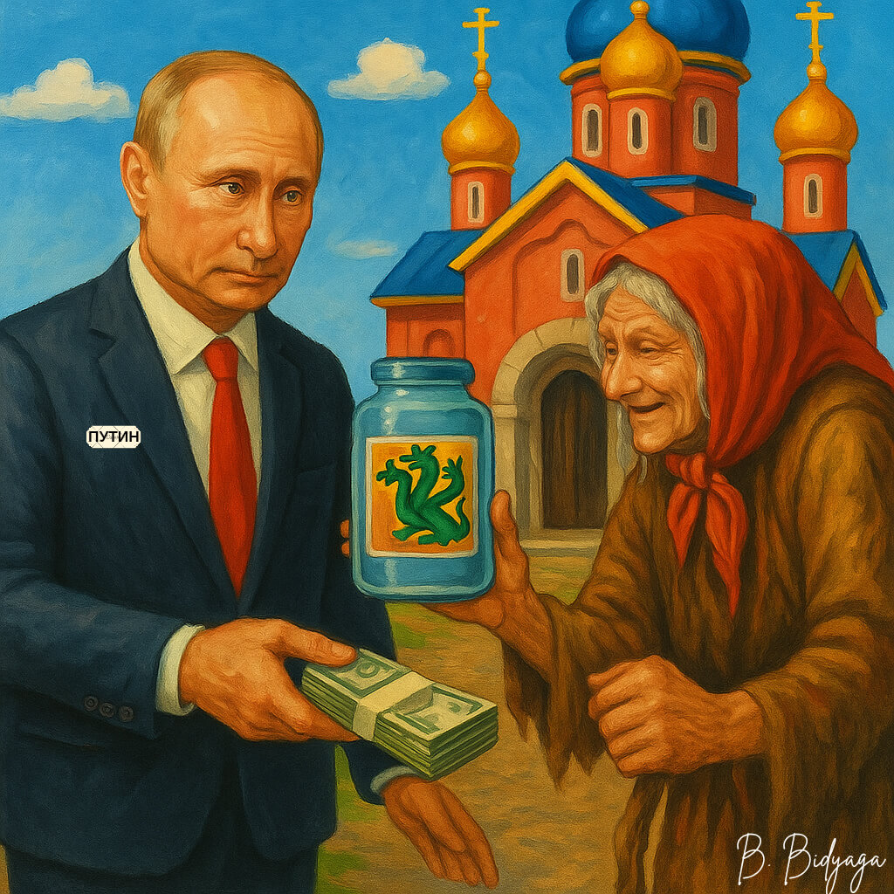

**Россия** (после паузы):
– И вот еще что. Опасайся черных кошек. Не ровён час, эта нечисть тебе дорогу перебежит...

**Путин** (самодовольно):
– Да я этих черных кошек одним взглядом... На днях тут одна хотела мне дорогу перебежать, так я на нее так взглянул – сразу хвост поджала да в кусты.

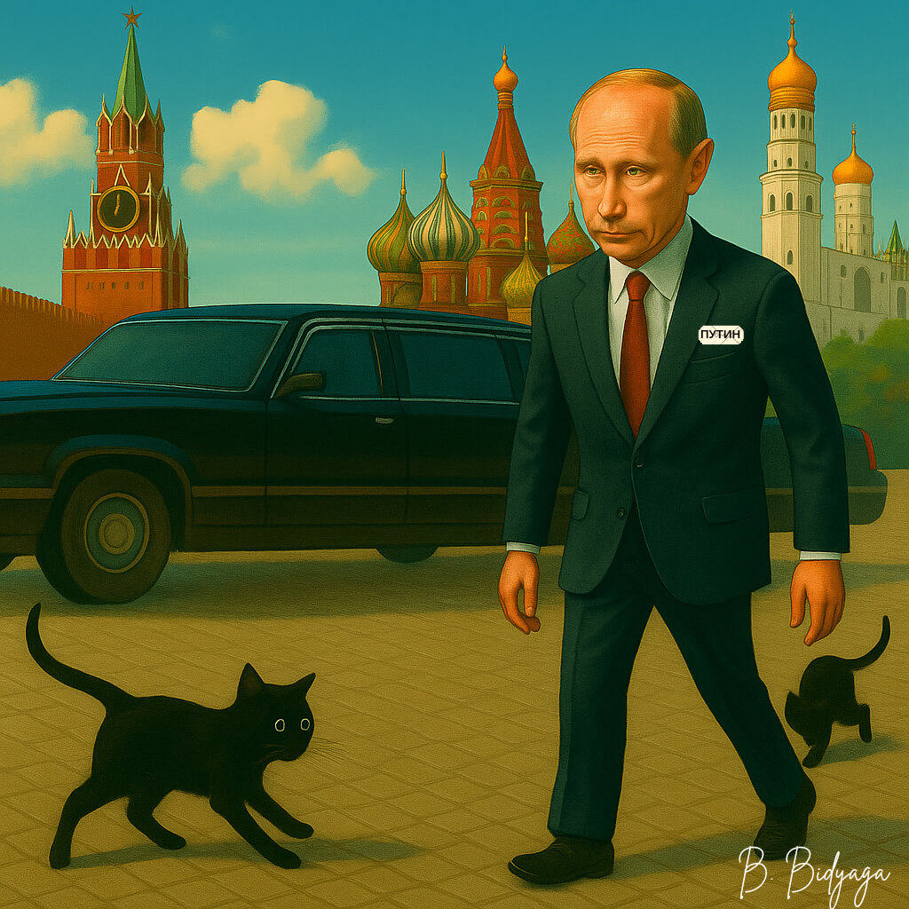

**Россия** (одобрительно):
– Ай красавец! Ай молодец!

**Россия** (после паузы, взволнованно):
– А супостату энтому зелье приворотное надо поднести. Чтобы мир да любовь…

**Путин** (перебивает, с дьявольской усмешкой):
– Супостату энтому «зелье» мы уж подносили. Не сработало.

**Россия** (задумчиво):
– А не то закопать в муравейник лягушку, и будет тебе через две недели лопаточка да крючочек. Тот крючочек на курточку ему незаметно прицепить, и зачахнет, как пить дать – зачахнет.

**Путин** (высокомерно):
– Да на кой черт мне твои лягушки? Я и безо всяких крючочков его убить могу. Двадцать первый век на дворе все-таки, черт бы его побрал!

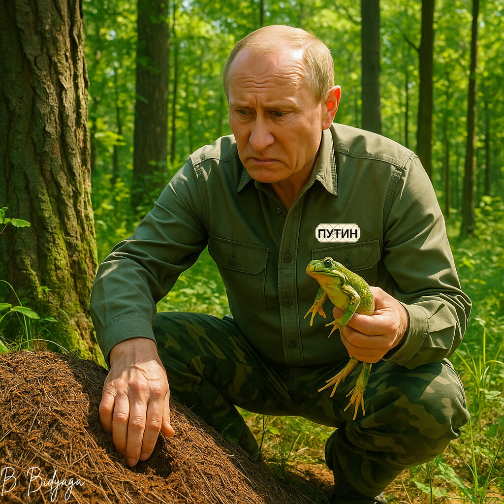

**Россия** (удивленно):
– Ну?

**Путин** (уныло):
– Что ну? Баранки гну. Опасаюсь я, что мстить начнут. Палка – она о двух концах…

**Путин** (после паузы, с невыразимой горечью и обидой в голосе):
– У них же теперь самолёты!.. Американские!..  F16! Слышала? Это ж не самолёт, а огненный дракон!  Думаешь, он только бомбы метать умеет? Черта с два! Он ещё и  истребитель, он ещё и  перехватчик! Три в одном, мать твою за ногу! Сука! Сука! Сука!

**Россия** (неприязненно):
– Ишь чего навыдумывали, черти окаянные!

**Путин** (срываясь на крик):
– У него ж радар с фазированной решеткой! Ты представляешь? Он же все цели видит за триста пятьдесят километров!

**Россия** (озадаченно):
– Кто?

**Путин** (с надрывом):
– Да летчик! Летчик, который в самолёте сидит!

**Россия** (неприязненно):
– Ах он паразит!

**Путин** (чуть не рыдая):
– И в туман, и в непогоду – все видит!

**Россия** (глупо хлопая ресницами):
– Да что ты говоришь?

**Путин** (в исступлении):
– Он же меня видит в Кремле!!!

**Россия** (с сомнением):
– Ну, до Кремля-то, поди, расстояние поболе будет, чем триста пятьдесят километров?

**Путин** (негодующе):
– Так они же вторгаются на нашу территорию! Нарушают государственную границу! 

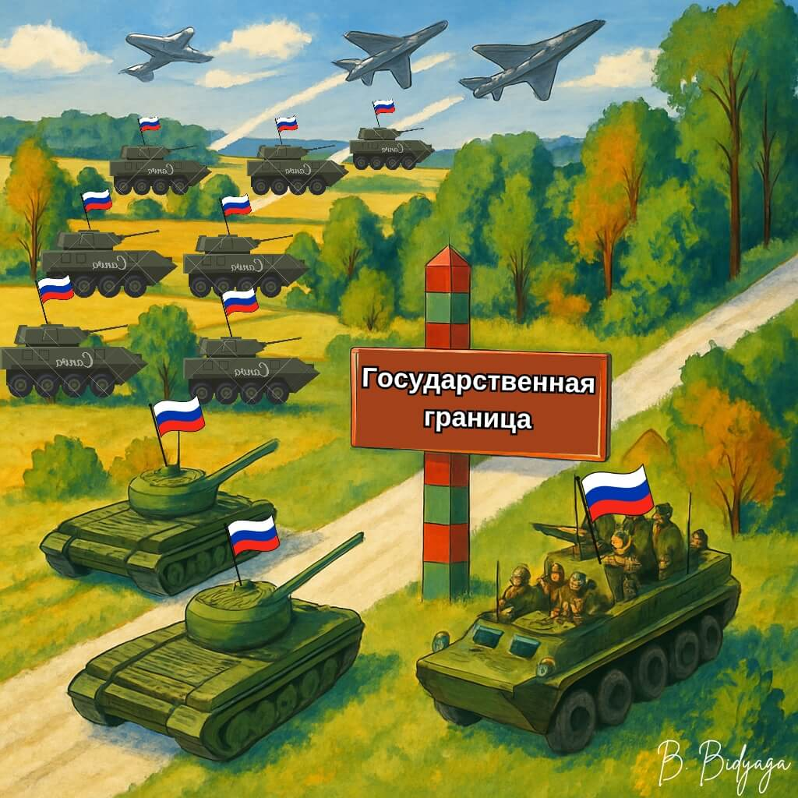

**Путин** (продолжает):
– Попирают международное право! Пересекают мои (!) красные линии! Терроризируют мирное население! Это же чистой воды бандитизм!!!  С демонстрацией нацистской символики...

**Россия** (гневно сверкнув глазами):
– Ах они  безобразники! А куда же смотрит эта... как ее... ООН?

**Путин** (с издёвкой):
– ООН… пустозво-он...

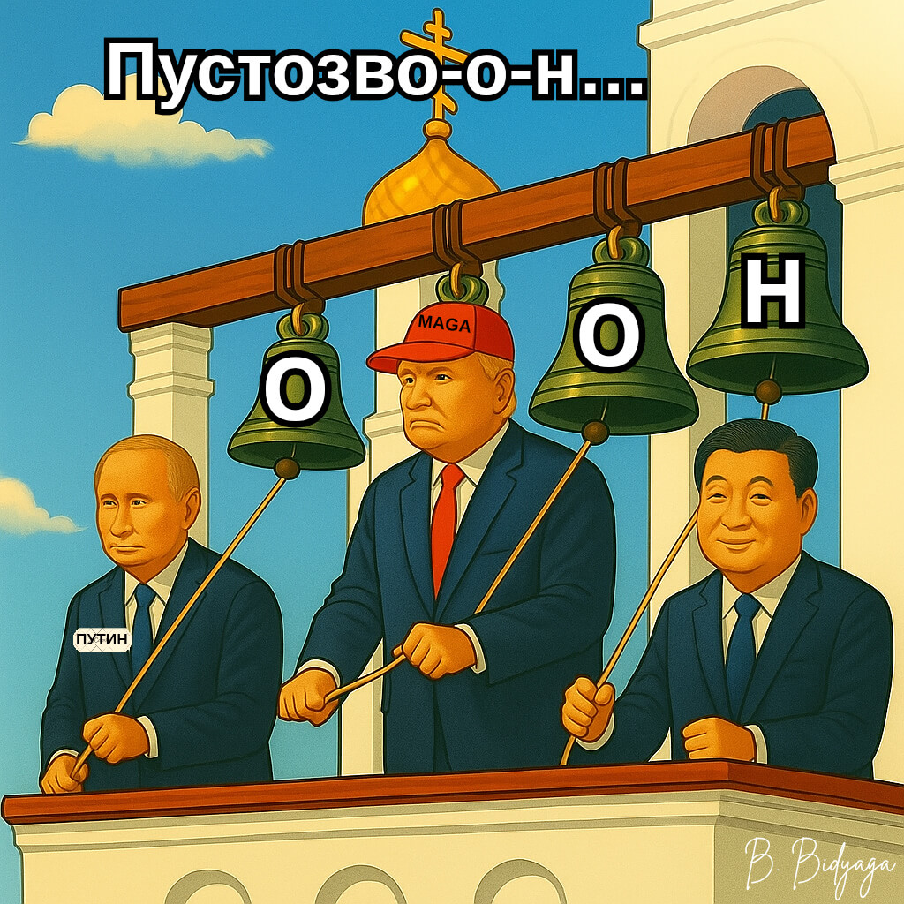

(Воцаряется тяжёлое молчание. )

**Путин** (через полминуты, с перекошенным от злобы лицом):
– Еще и глушилки у пиндосов выпросили самые наиновейшие, таких даже в армиях НАТО нету! Понимаешь, какая фишка получается? Он меня видит, а я его – нет!!!

**Россия** (с глупым видом):
– Кто?

**Путин** (срываясь на крик):
– Да летчик!  Летчик, который в самолете сидит! У него такая офигительная репа, что все мои радары отдыхают, черт бы их побрал!

> "Репой" Путин называет РЭБ - средства радиоэлектронной борьбы. По сходству звучания: РЭБ > рэбка (произносится "рэпка") > репка > репа.

**Россия** (с негодованием):
– Ах они негодяи! Нашу традиционную ценность цап-царапнули!  Руки прочь от нашей репы, басурманы окаянные! Жрите свои маисовые лепешки! Чтоб вам подавиться!

**Путин** (с горьким смешком):
– Успокойся ты! Это другая репа.

**Россия** (неприязненно):
– Генно-модифицированная?

**Путин** (с раздражением):
– Да нет же! Это глушилки радиоэлектронные. Глушат мои радары под ноль! И вот вам пожалуйста – самолет-невидимка, мать его за ногу! Не война, а прям в сказку попал!

**Россия** (сокрушенно):
– Это что же получается? Вроде как ты с ними в жмурки  играешь?

**Путин** (с горькой усмешкой):
– Вот такая, мать твою, война в жмурки!

(На минуту оба замолкают. Путин погружен в свои мысли, его лицо мрачнее тучи. Россия с неодобрительным видом беззвучно шамкает ртом.)

**Путин** (внезапно очнувшись, в ярости потрясая кулаками):
– Проклятые пиндосы!

**Россия** (сочувственно):
– Да уж... Энти пиндосы... Страшное дело. Не дают житья народу русскому. Вот Обама давеча... все лифты нам зассал,  скотина этакая. Ещё и цены на бензин взвинтил.

**Путин** (с раздражением):
– Да какой Обама? Очнись ты наконец от спячки! После Обамы уже второй президент сменился. Байден там теперь.

**Россия** (согласно кивая):
– Ну да, ну да. Я же и говорю. Надо этому Байдену в этом... как его...  жёлтом доме  тож все лифты обоссать.

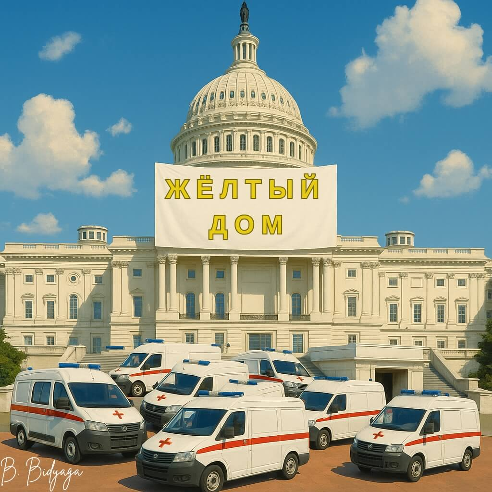

**Путин** (в бешенстве):
– Да причем тут лифты?

(Повисает напряженное молчание. Россия с виноватым видом открывает рот, силясь что-то сказать, но, не найдя слов, безнадежно машет рукой и устремляет взгляд в пол.)

**Путин** (после паузы, задумчиво):
– Знаешь чего я думаю?

**Россия** (угодливо):
– Чего?

**Путин** (с нажимом):
– Сдается мне, что без инопланетного вмешательства тут дело не обошлось.

**Россия** (в ужасе):
– Как?! Пришельцы из других миров?!

**Путин** (страдальческим голосом, потихоньку наливаясь гневом):
– Да в том-то и дело! Похоже, на меня ополчились нацисты со всей Солнечной системы! Во главе с этим мерзким, холуйским, человеконенавистническим блоком НАТО! Гомосексуалисты! Пидоры гнойные! Родители номер один и номер два! ***Иноплагенты***!!!

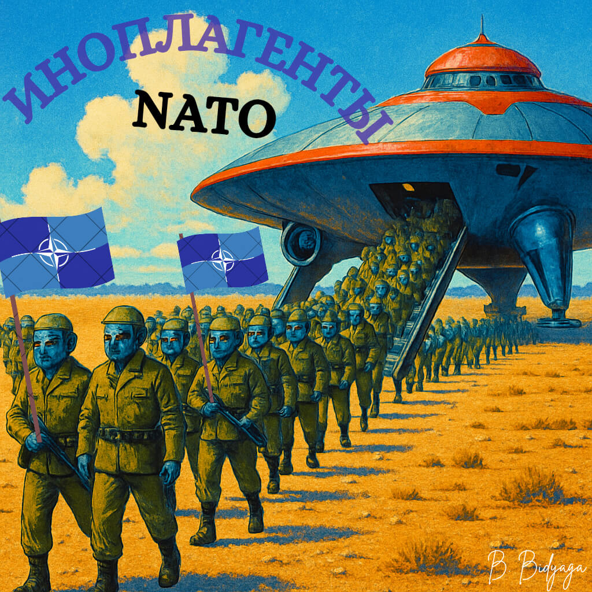

**Путин** (вдруг взрывается истошным воплем):
– Взорву эту всю Вселенную к чертовой бабушке!

**Россия** (нервно вскрикивает): 
– Господи, твоя воля!» 

(Россия судорожно шепчет слова молитвы, мелко крестясь и время от времени с громким стуком биясь головой об пол. Путин, выпустив пар, быстро успокаивается и начинает вполголоса бормотать.)

**Путин**:
– Ну да, они же все там гендерно нейтральные. Без первичных половых признаков... Слава тебе господи, мы совсем не такие!

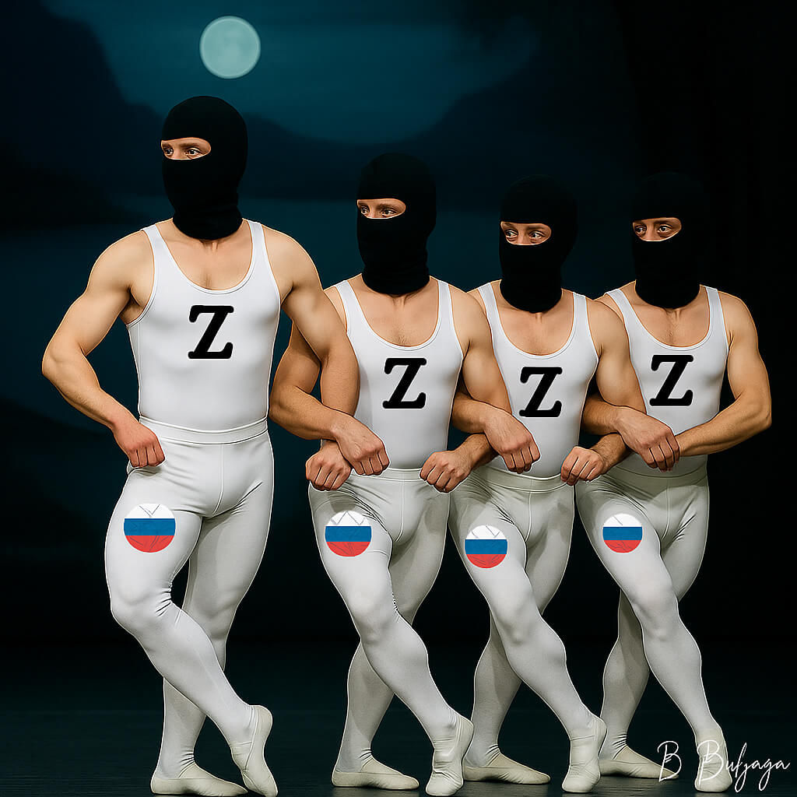

(Путин ощупывает рукой свои первичные половые признаки и удовлетворенно кивает головой. 
Россия прекращает бить поклоны и с некоторой опаской выжидательно смотрит на Путина.)

**Путин** (удрученно, потихоньку накаляясь):
– Везде подстава... Кругом предательство... Генералы Родину продают... Все снабжение начисто разворовали. Ладно бы в мирное время – воруйте себе на здоровье. Но во время войны?! Совсем стыд потеряли. Мои танки продают моим врагам! Тут же, через линию фронта и переправляют. Из рук в руки. В подарочной упаковке. С бантиком на башне. Тьфу! Мерзавцы!

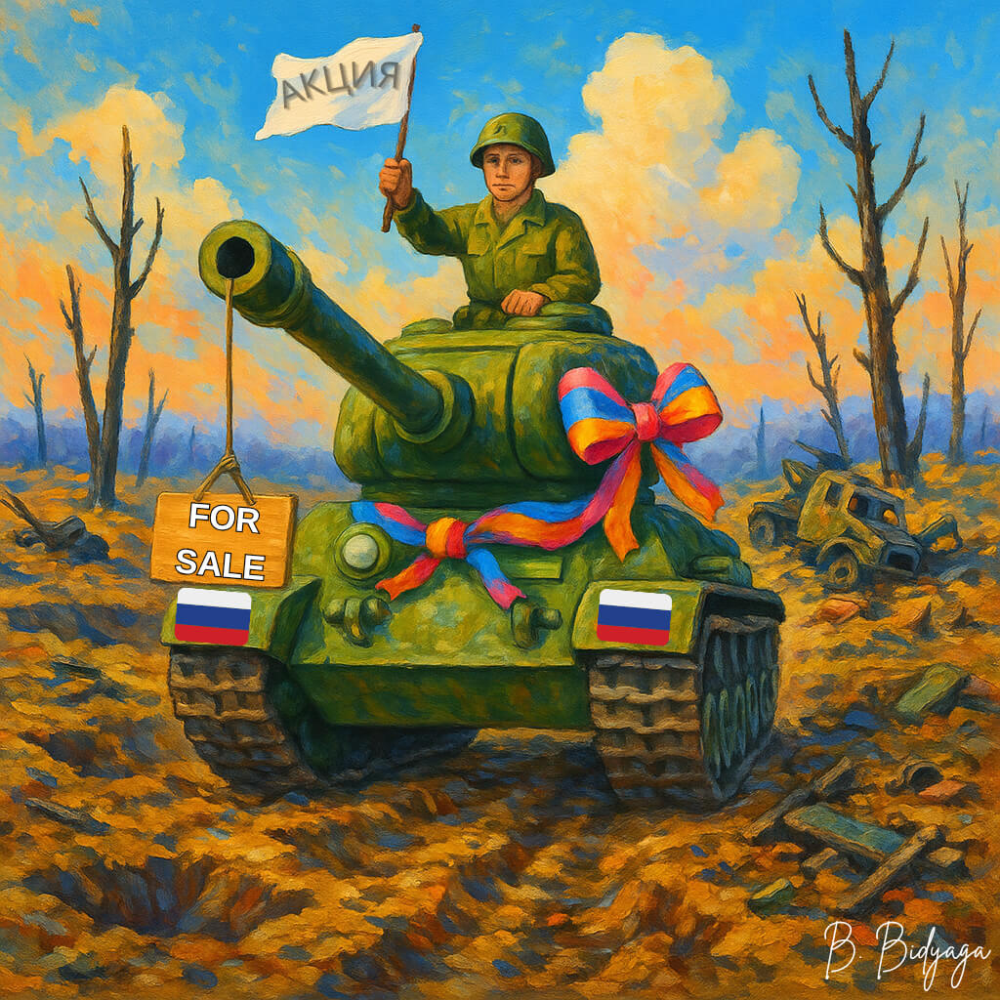

**Россия** (удручённо качая головой):
– И меня, значит, грабят, и тебя... Вот, значит, как! Совсем от рук отбились...

**Путин** (безнадежно махнув рукой):
– А-а, да что тут говорить...

(Умолкает и на минуту задумывается. Россия смотрит на Путина преданным щенячьим взглядом.)

**Путин** (после паузы, с кривой усмешкой):
– Ладно, что мы все о плохом да о грустном?

(Медленно расстёгивает китель. Подходит к России вплотную.)

**Путин** (плотоядно ухмыляясь):
– Давай лучше займёмся чем-нибудь приятным.

**Россия** (согласно кивая):
– Давай, миленочек, давай.

(Путин обходит Россию сзади, кладет на ее тощие бока свои холеные руки и тут же отдергивает.)

**Путин** (с нескрываемым изумлением):
– Да что это ты так отощала, матушка моя? Одна кожа да кости?

**Россия** (пожимая плечами):
– Да я и сама диву даюсь...

**Путин** (с досадой):
– И подержаться-то не за что. Куда подевалось все твое мясо?

**Россия** (бесцветным голосом):
– А я почём знаю? Питаюсь как обычно, а мяса на костях все меньше и меньше.

**Путин** (обеспокоенно):
– И давно это с тобой происходит?

**Россия** (силится вспомнить):
– А сейчас у нас что? Август двадцать четвертого?

**Путин**:
– Да. Двадцать четвертое августа.

**Россия**:
– Ну так значит аккурат два с половиной года назад  мясо-то и стало с меня сходить.

**Путин** (в смятении):
– Но почему?

**Россия** (сердито):
– Тож порчу навели, супостаты проклятые, вороги народа русского. Притки да уроки понаставили.

> Согласно древнерусским поверьям, "ставить притки", "ставить уроки" – это два разных приема наведения порчи.

(На минуту воцаряется молчание. Путин в замешательстве чешет затылок. Кожа на его лбу собирается в складки; видно, что в его голове идут напряженные мыслительные процессы. Через минуту-другую его лицо разглаживается; он снова кладет свои руки на тощие российские бока.) 

**Путин** (решительно):
– Ну, матушка, давай подымайся.

**Россия** (с упрямством капризного ребенка):
– Зачем это? Мне и так хорошо.

**Путин** (ласково поглаживая Россию по широкой спине):
– Милая, ну встань с колен, ну пожалуйста!

**Россия** (кокетливо):
– Я думала, тебе эта поза нравится. Давеча вон как стонал… Как жених в добрачную ночь…

**Путин** (раздраженно):
– Стонал не стонал… Не в этом дело… Просто хочется каких-нибудь новых свершений. Новых завоева… то есть я хотел сказать: новых нефтепрово... тьфу ты, черт! Новых поз! А тебе разве не хочется чего-нибудь новенького?

**Россия** (пожимая плечами):
– Новенького? Это которое хорошо забытое старенькое? Что ж,  можно и новенького… Отчего ж…

**Путин** (удовлетворенно):
– Ну вот и славно! Ну вот и умница! И за что я тебя, дуру старую, люблю?!

**Россия** (вздыхая):
– Богатая я… была…

**Путин** (мечтательно):
– Да… А теперь я богатый…

(Ощупывает Россию цепким взглядом.) 

**Путин** (удивлённо):
– Что-то ты постарела, матушка моя, подурнела…

**Россия** (обиженно):
– А ты чего хотел? Когда тебя целый кооператив  насилует день и ночь… Ни отдыху ни сроку от энтих паразитов…

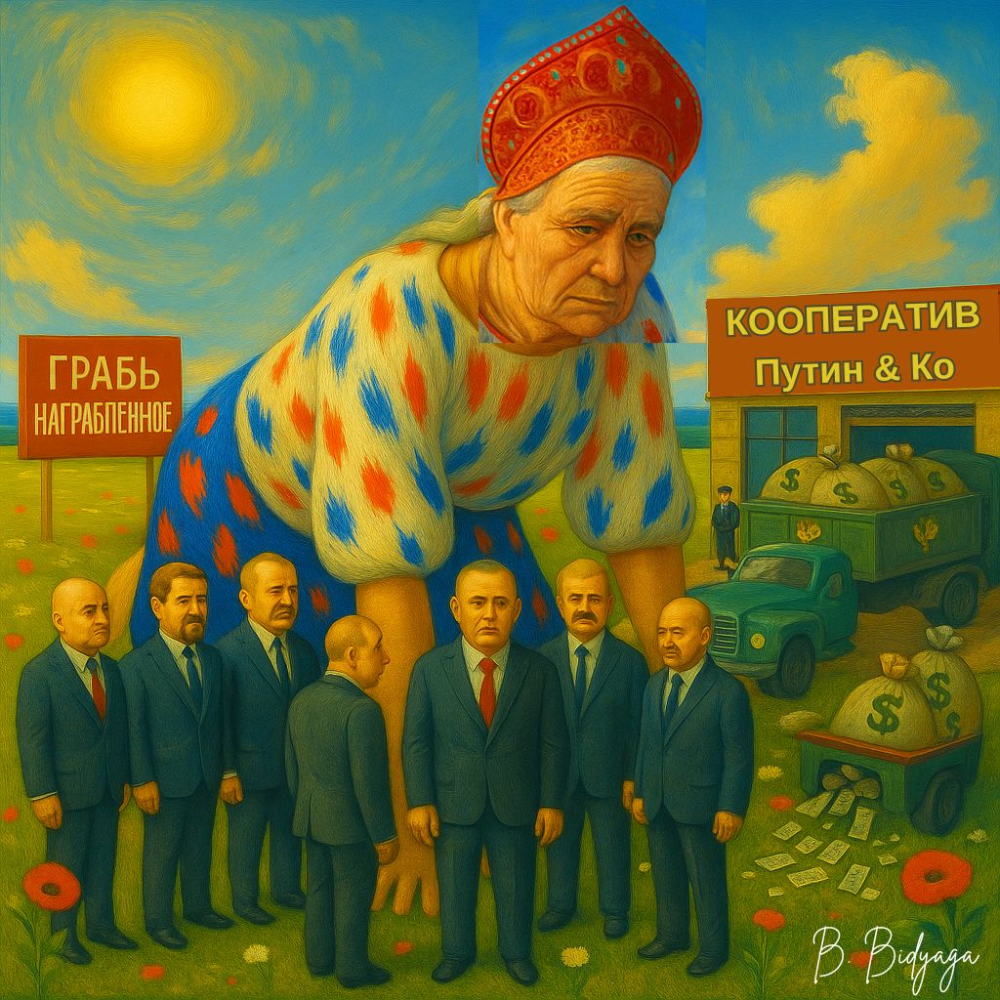

**Путин** (высокомерно):
– Но-но, дамочка, полегче! Это все-таки мои друзья. И вообще: я не пойму, чего ты обижаешься. Гордиться должна. Разве грех – хорошему человеку дать? А они все – отличные ребята, мамой клянусь.

**Россия** (бормочет себе под нос):
– Хорошему человеку отчего же не дать? Можно и дать… чего уж там… Но уж больно жадные…

**Путин** (примирительно):
– Да ладно тебе, ты вон какая большая, от тебя не убудет.

**Путин** (после паузы):
– Ну что, опробуем новую позу?

(Россия, кряхтя и охая, пытается встать с колен, но безуспешно.)

**Россия** (жалобно всхлипывая):
– Так устала, что на ногах не держусь. Может ну ее в болото, эту новую позу? На коленках-то я уж и привыкла.

**Путин** (строго):
– Встань с колен!

**Россия** (плачущим голосом):
– Да зачем вставать-то?

**Путин** (с пафосом):
– Лучше умереть стоя, чем жить на коленях!

**Россия** (всплеснув руками, с испугом):
– Окстись, батюшка! Что ты такое говоришь? Отчего же нам помирать-то?

**Путин** (в сторону):
– От оргазма, матушка, от оргазма.

**Россия** (недоверчиво):
– Да разве от этого можно помереть?

**Путин** (наставительно):
– Можно. Если оргазм сильный, а организм – слабый.

**Россия** (с восторгом):
– Для меня умереть в твоих объятиях – большая честь! Любимый…

**Путин** (равнодушно):
– Ну да, ну да…

**Путин** (после небольшой паузы,  с вожделением):
– Расскажи, как ты меня любишь.

**Россия** (с нежностью):
– Люблю, миленькой, ой как люблю! На целых семьдесят восемь и девять десятых процента. Да ты у ВЦИОМа  спроси – люди ученые, не дадут соврать.

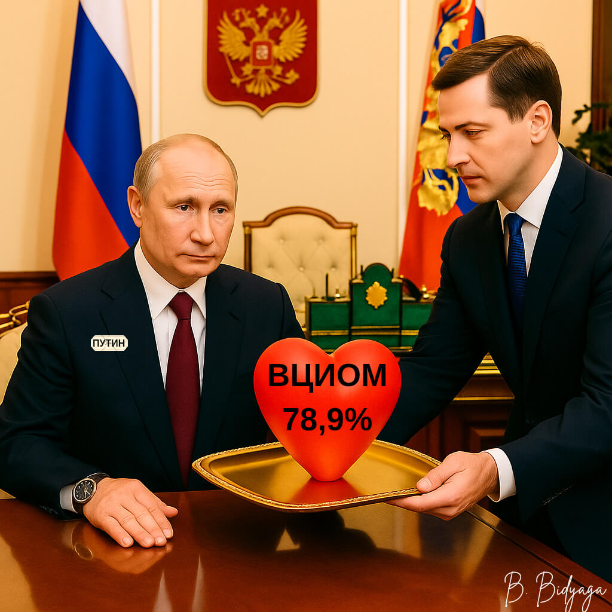

**Путин** (слегка вонзая шпору в российский дряблый зад, с издёвкой):
— Ну… Сколько процентов теперь?

**Россия** (взыв от восторга и страсти):
– О! Как мне хорошо с тобой! Еще, миленькой, еще!

**Путин** (вонзая шпору до упора):
– А так? Хорошо?

**Россия** (в полном экстазе):
– Ой, не могу…  Ой, не могу… Ой, не могу… Кончаю…  Кончаю… Кончаюсь…  Давай вместе, а?

**Путин** (с усмешкой):
– Мне кончаться ни к чему – я еще в самом расцвете сил. Мне пожить охота.
 
**Россия** (с трудом ворочая языком):
– Так ведь давеча Володин  чего говорил? «Нету Путина – нету России?»

**Путин** (холодно):
– Обратное, к счастью, неверно. России нет, а Путин есть!

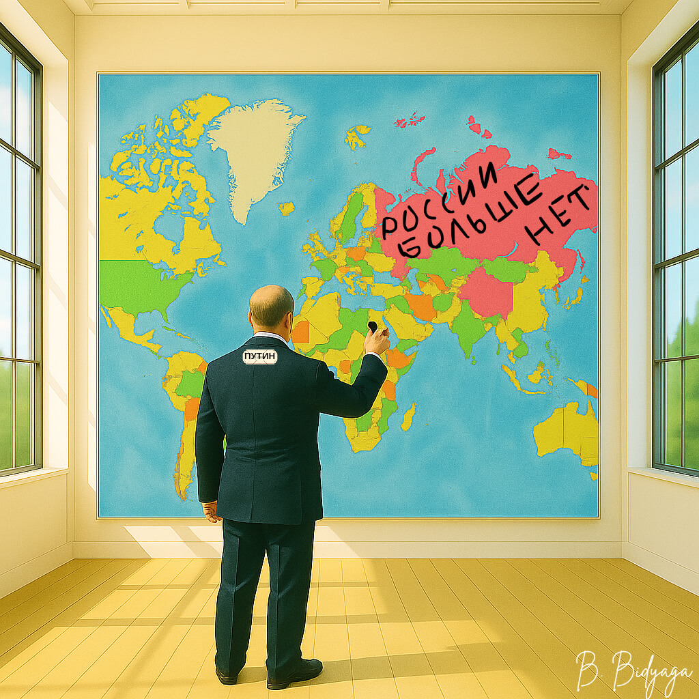

(С брезгливостью смотрит на бьющуюся в предсмертных конвульсиях Россию, поворачивается и уходит.)

*24 сентября 2024 года*
 *Турция – Грузия*

**ISBN  978-5-9903439-2-4**

**© Щеглова О.В., 2024**
   

 
