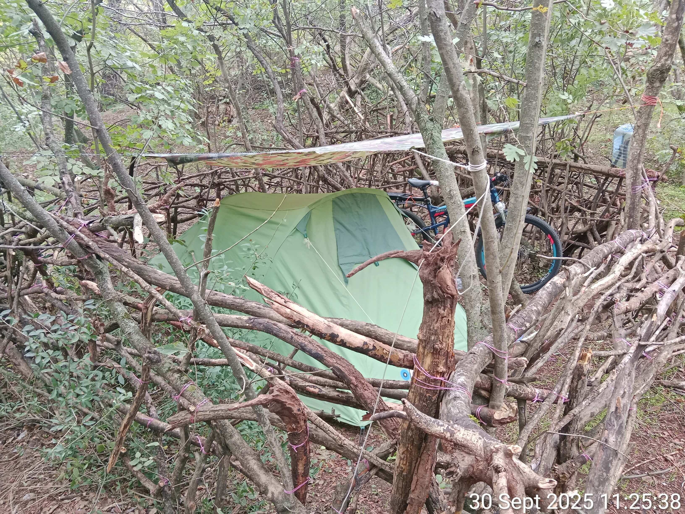

<meta name="robots" content="noindex, nofollow">

[**Главная страница**](index.md)

**Щеглова Ольга (Борис Бидяга)**

# ОБ АВТОРЕ И УСЛОВИЯХ СОЗДАНИЯ ПРОЕКТА

*В этой палатке, под "защитой" импровизированной ограды из палок, была создана Энциклопедия православного военного путинизма.*

## Бегство и отказ в убежище
24.04.2024, в возрасте 66 лет, я была вынуждена бежать из России, спасаясь от преследования со стороны российских спецслужб, целью которого было мое физическое уничтожение.
Но преследование продолжилось и за границей — в Турции и Грузии, где имеется огромное количество агентов российских спецслужб.
29.09.2024 я обратилась за убежищем в Швейцарии, предоставив доказательства невозможности моего возвращения в Россию.

Однако рассмотрение моего дела в Секретариате по миграции (SEM) Швейцарии сопровождалось грубыми процессуальными нарушениями: мне не предоставили адекватного перевода Протокола интервью, мои ответы были искажены переводчиком, мои ключевые доказательства не были приняты SEM во внимание, в основу Решения были положены выдуманные обстоятельства и ложные "факты";  назначенное мне медицинское обследование было отменено без объяснения причин. В результате я получила необоснованный отказ в убежище и была депортирована в Грузию, где вновь оказалась в условиях преследования, на этот раз — на фоне гуманитарной катастрофы.

## Условия выживания

Почти два года я, 68-летняя одинокая женщина, живу в палатке на улице, без доступа к базовым условиям человеческой жизни:

• Холод и жара: 
Зимой  температура  в палатке опускается ниже нуля градусов по Цельсию. Летом — поднимается до 50°С.

• Отсутствие медицины и гигиены:
Невозможность получить медицинскую помощь, невозможность какого-либо лечения (нет условий для хранения лекарств). Невозможность помыться и постирать вещи. 

• Минимум ресурсов:
Питание — сухой паёк и холодная вода. Отсутствие электричества, отопления, кондиционера, холодильника. Отсутствие газа, зимнего снаряжения, теплой одежды и обуви.

## Систематическое  трансграничное преследование.

Моя ситуация — это не только отсутствие жилища и условий для нормальной жизни. 
Российские спецслужбы осуществляют в отношении меня постоянное и систематическое трансграничное преследование:

• Возбуждение тотальной ненависти и вражды со стороны местного населения на основе клеветы, инсинуаций и сфабрикованных "улик".

• Попытки убийства, замаскированные под несчастный случай (в том числе при помощи выведения из строя тормозов на моем велосипеде)

• Причинение вреда здоровью, в том числе систематические атаки на глаза 

• Запугивание, угрозы, физическое насилие

• Целенаправленная кампания по систематическому лишению сна (с помощью системы электронных устройств, размещенных вокруг моей стоянки, запрограммированных на воспроизведение оглушительно громких звуков).

• Порча имущества (палатка, надувной матрас, велосипед)

• Саботаж сферы услуг (продажа некачественных и вредоносных товаров)

• Беспрецедентный цифровой террор: взлом моего смартфона и постоянные хакерские атаки, препятствующие моей творческой деятельности (блокировка и саботаж работы  приложений и программ, в том числе ИИ, уничтожение и подмена данных, создание постоянных технических трудностей).

• Чудовищным актом давления со стороны российских спецслужб стало убийство  моей матери в России 20 октября 2025 года.

## Творчество как акт сопротивления и помощи:

Вся эта система трансграничного  преследования  имеет одну цель — убить или сломить мою волю: заставить меня замолчать, или вернуться в Россию, или свести счёты с жизнью. И именно поэтому я не молчу и продолжаю жить и творить,  несмотря ни на что: технические трудности, условия жизни, сопоставимые с пыткой, психологическое давление, враждебность местного населения, недоступность медицины.

Моё творчество как писателя, сатирика, художника, разоблачающее войну и путинский режим, систематически блокируется на всех основных русскоязычных  и некоторых международных платформах (9 социальных сетей и 2 литературных портала). Тотальная цензура — это лучшее доказательство идейной ценности, значимости и актуальности моего слова.

Настоящий проект — мой ответ тем, кто пытается меня уничтожить. В условиях, граничащих с бесчеловечным обращением, я создаю тексты, чтобы с их помощью:

• Разоблачать нескончаемый поток политического безумия, беспредела, лжи, цинизма и жестокости.

• Направлять внимание мировой общественности на потребности тех, кто страдает от войны и авторитарных режимов.

• Конвертировать это внимание в реальную помощь, стимулируя читателей делать  прямые донаты в проверенные фонды поддержки Украины.

Каждая миниатюра, пьеса или статья, которые вы читаете, написаны ценой невероятных усилий: спартанская жизнь в палатке, в условиях невыносимой жары, холода, голода, постоянного преследования, отчаяния и безнадёжности.

Это не просто текст. Это — свидетельство мужества, несгибаемой воли и активного сопротивления. И одновременно —
 инструмент для помощи таким же, как я — пострадавшим, обездоленным и отчаявшимся.

[**На главную страницу**](index.md)
