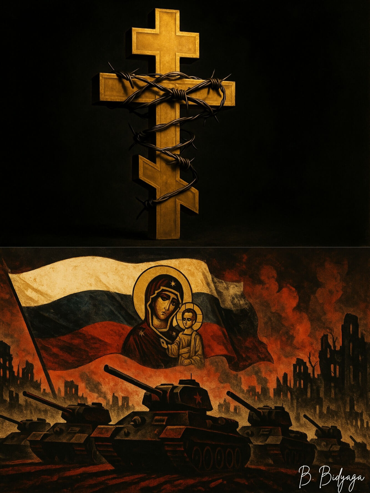

<meta name="robots" content="noindex, nofollow">

[**Page d'accueil**](index.md) 

**SHCHEGLOVA OLGA (BORIS BIDYAGA)**

# ANATOMIE DES « VALEURS TRADITIONNELLES » POUTINIENNES

Le 9 novembre 2022, le président russe Vladimir Poutine a signé le décret « Fondements de la politique de l'État pour la préservation et le renforcement des valeurs spirituelles et morales traditionnelles russes » (ci-après dénommé le Décret Poutine ou le Décret). Source : http://www.kremlin.ru/acts/bank/48502

Il est remarquable que, dès les premières lignes du Décret, Poutine passe du terme « valeurs spirituelles et morales traditionnelles » au terme « valeurs traditionnelles », affirmant que dans ce document, ces deux concepts sont équivalents. Il est évident que cela n'a pas été fait sans raison : cette terminologie permet de faciliter considérablement la substitution du concept initial. Notons que cette substitution terminologique est présente non seulement dans le Décret lui-même ; dans les débats socio-politiques, dans les médias, dans les documents officiels et informatifs, la précision « spirituelles et morales » a disparu du terme initial, ce qui permet d'interpréter ce terme assez largement et librement. Et, il faut le reconnaître, ce fut une manœuvre exceptionnellement habile : personne n'a remarqué comment les valeurs spirituelles et morales traditionnelles se sont transformées en « valeurs traditionnelles », sous le couvert desquelles on peut faire avaler n'importe quoi au peuple. Dans le présent article, par souci de concision, nous utiliserons aussi parfois le terme « valeurs traditionnelles », sans jamais oublier un instant qu'il s'agit des valeurs spirituelles et morales traditionnelles.

Revenons au Décret. Dans la partie 4 de la section 1, Poutine donne une définition des valeurs traditionnelles russes : ce sont des repères moraux qui forment la vision du monde des citoyens russes, transmis de génération en génération. Nous sommes tout à fait d'accord avec cette définition et nous en partirons.

Ici, Poutine précise ce qui relève des valeurs traditionnelles :

La vie, la dignité, les droits et libertés de l'homme, le patriotisme, la citoyenneté, le service à la Patrie et la responsabilité pour son destin, les idéaux moraux élevés, la famille solide, le travail constructif, la priorité du spirituel sur le matériel, l'humanisme, la miséricorde, la justice, le collectivisme, l'entraide et la camaraderie, la mémoire historique et la continuité des générations, l'unité des peuples de Russie.

De tout ce qui est énuméré, seuls peuvent être considérés comme des repères moraux :
les idéaux moraux élevés, la priorité du spirituel sur le matériel, l'humanisme, la miséricorde, la justice (en tant que trait de caractère humain). Tout le reste ne relève soit pas du tout des repères moraux, soit y est lié de manière très indirecte. Les repères moraux sont acquis par l'homme au cours de son éducation (y compris l'auto-éducation) et de son développement spirituel. Qu'offre Poutine comme « repères moraux » ?

– La vie. Mais la vie nous est donnée par Dieu ; comment nous la vivons est une question distincte, mais la vie en elle-même n'est pas un repère moral.

– La dignité. C'est une sensation personnelle, sans rapport avec la moralité. Une personne profondément immorale peut tout à fait se comporter avec dignité et se sentir un membre digne de la société (par exemple, d'une société où l'immoralité est encouragée).

– Les droits et libertés. Ils sont accordés à l'homme par l'État. Les droits et libertés ne sont pas des caractéristiques personnelles de l'individu, mais la volonté collective de la société, réglementant la possibilité de certaines actions (activités) pour tous ses membres. De ce fait, les droits et libertés ne peuvent pas être un repère moral.

– Le patriotisme. L'amour de la patrie est inhérent à la majorité des citoyens, qu'ils soient très moraux ou totalement immoraux.

– La citoyenneté, c'est-à-dire la conscience d'être un citoyen du pays et la volonté de contribuer à la prospérité de la société. C'est un concept trop vague, tout dépend des formes concrètes de cette contribution. S'il s'agit d'une entreprise prospère, il n'y a rien de particulièrement moral dans cette activité ; si c'est, par exemple, la charité, c'est autre chose. En règle générale, la citoyenneté n'est pas un repère moral.

– Le service à la Patrie et la responsabilité pour son destin sont aussi des concepts flous. Par exemple, le président russe Vladimir Poutine considère sans aucun doute que la guerre contre l'Ukraine est un service à la patrie et une manifestation de responsabilité pour son destin. Selon Poutine, lui-même a rendu un grand service à la patrie en déclenchant cette guerre, et tous ceux qui y participent d'une manière ou d'une autre (tuant l'« ennemi » au front, produisant des obus et des canons, ou tissant des filets de camouflage) – tous ces gens font preuve de patriotisme, de citoyenneté et servent la patrie. Cependant, toute personne sensée ayant un regard objectif sur les événements sera d'accord avec moi pour dire que celui qui a déclenché cette guerre, et ceux qui y participent ou aident d'une manière ou d'une autre ses participants, sont des personnes absolument immorales, parce que cette guerre n'est pas défensive mais conquérante ; cette guerre n'est pas un acte de défense de la patrie, mais un acte d'agression contre un autre État. Il est donc inadmissible de classer dans la catégorie des repères moraux le « service à la patrie et la responsabilité pour son destin ».

– La famille solide n'est pas non plus un indicateur de hauts idéaux moraux ; certaines familles reposent sur la violence familiale ; dans d'autres familles « solides », la femme tolère les infidélités du mari. Et les familles les plus solides sont celles où, d'un commun accord, l'adultère mutuel prospère. Ainsi, la famille solide n'est qu'une forme extérieure, qui ne découle pas nécessairement du comportement hautement moral de ses membres.

– Le travail constructif ? Les gens travaillent pour gagner leur vie et celle des membres de leur famille. C'est une nécessité. Dans le même temps, un nombre immense de personnes ne créent rien dans leur activité, par exemple dans les services, en jouant en bourse, ou en plaçant de la publicité sur Internet. Et la majorité de nos citoyens approuvent pleinement ce type d'activités. Tout travail ennoblit l'homme, mais on ne peut pas dire que le travail constructif est un signe de comportement hautement moral. Rappelons-nous ceux qui « créent » des chars et des missiles balistiques qui tuent des gens dans une guerre sanglante. Dans quelle mesure un tel travail est-il moral ?

– Le collectivisme, l'entraide et la camaraderie sont des concepts parfaitement neutres sur le plan moral. Ils sont basés sur le principe bien connu : « Tu me donnes, je te donne ». Il n'y a rien de particulièrement moral là-dedans. En revanche, lorsque vous aidez une personne sans espoir de récompense ou de service en retour, cette aide devient un acte moral. Mais s'entraider selon un accord mutuel (même non écrit) – il n'y a rien d'exceptionnel à cela.

– La mémoire historique et l'unité des peuples de Russie n'ont absolument aucun rapport avec les repères moraux.

– Quant à la continuité des générations, en elle-même, elle ne peut pas être un repère moral, elle ne sert que d'outil pour transmettre de génération en génération l'expérience de vie accumulée et les traditions, y compris les normes morales et les principes éthiques. Mais dans différentes familles, ces normes et principes peuvent être différents. À côté des dynasties de musiciens talentueux, il existe des dynasties de voleurs et de meurtriers.

Une question se pose naturellement : pourquoi Poutine tente-t-il de faire passer sous l'enseigne des valeurs spirituelles et morales le patriotisme, la citoyenneté, le service à la patrie et la responsabilité pour son destin ? Pour répondre à cette question, regardons la date de signature du Décret Poutine – 09.11.2022. Rappelons que le 21.09.2022, Poutine a annoncé une mobilisation partielle en Russie, après quoi, littéralement sous ses yeux, près d'un million de jeunes hommes ont quitté le pays, démontrant ainsi leur refus catégorique de participer à la guerre contre l'Ukraine. Il est devenu évident pour Poutine que cette génération était perdue pour lui. Moins d'un mois plus tard, ce Décret apparaît, qui qualifie directement et sans équivoque la participation à la guerre contre l'Ukraine comme un acte hautement moral. Car la guerre est présentée à la société dans le contexte des récits : « La Patrie est en danger », « L'OTAN veut détruire la Russie, détruire nos valeurs traditionnelles », etc. Poutine en parle assez ouvertement : « Ce sont eux [les participants à la guerre] — la vraie, non factice, mais authentique élite et la fierté du pays. L'héroïsme des guerriers qui défendent les intérêts vitaux du pays devient un repère moral pour des millions de nos concitoyens... » Ainsi, le Décret Poutine vise explicitement à former une construction idéologique dichotomique : ceux qui sont contre la guerre et refusent d'y participer sont des traîtres et des renégats, il faut les limiter dans leurs droits et les emprisonner. Ceux qui soutiennent la guerre, qui se battent et aident l'armée sont des citoyens conscients, de vrais patriotes de la Russie et des personnalités hautement morales ; à ces citoyens – honneur, respect et gloire. Ces postulats agissent en partie sur la population adulte, mais visent principalement la jeune génération, dont Poutine espère faire un troupeau docile qui ira sans murmure à l'abattoir pour les "idéaux" poutiniens dans le futur. Car Poutine n'a pas l'intention de s'arrêter en Ukraine. Avec l'Ukraine, il n'a pas eu de chance : la motivation des soldats russes est faible, d'où des succès très modestes sur les fronts, malgré d'énormes pertes en personnel et en matériel. Mais lorsque Poutine aura une armée d'un million et demi de zombies bien dressés aux cerveaux bien lavés par le délire patriotique – alors il commencera à étendre son empire à grande échelle. Ce n'est pas pour rien que le Décret Poutine est appelé « document de planification stratégique dans le domaine de la sécurité nationale de la Fédération de Russie ». Si l'on parle de valeurs spirituelles et morales au sens commun du terme, elles n'ont pas le moindre lien avec la sécurité nationale, car les valeurs spirituelles et morales sont des caractéristiques personnelles de l'homme. En revanche, le patriotisme, la citoyenneté, le service à la patrie – ce sont précisément les concepts dont Poutine, à l'aide de son Décret, a fait des leviers efficaces pour entraîner les masses populaires dans n'importe quelle aventure criminelle qu'il qualifiera de "défense de la patrie".

Dans la partie 6 de la section 1 du Décret Poutine, il est dit :

"Le christianisme, l'islam, le bouddhisme, le judaïsme et d'autres religions, qui font partie intégrante de l'héritage historique et spirituel russe, ont eu une influence significative sur la formation des valeurs traditionnelles, communes aux citoyens croyants et non croyants. Une rôle particulier dans la formation et le renforcement des valeurs traditionnelles revient à l'orthodoxie."

Concernant les autres religions, nous ne nous permettrons pas d'affirmer quoi que ce soit, mais l'orthodoxie, en effet, a eu une énorme influence sur la formation des valeurs spirituelles et morales propres au peuple russe. Alors définissons clairement et nettement ces valeurs spirituelles et morales orthodoxes russes traditionnelles. Elles sont formulées de manière tout à fait non équivoque dans les textes religieux reconnus :

• Les 10 commandements bien connus,

• Les sept péchés capitaux – antipodes des sept vertus,

• Les enseignements de Jésus-Christ,

• Certains établissements de l'Église orthodoxe russe.

Dans le présent article, nous ne voulons pas simplement énumérer toutes les vertus chrétiennes – nous essaierons de comprendre à quel point elles sont caractéristiques de la société russe contemporaine. Et, tout d'abord, pour les détenteurs du pouvoir, car ce sont eux qui, dans leurs décrets et déclarations, ainsi que par le biais de leur machine de propagande, dépeignent à tous les niveaux quelles excellentes valeurs spirituelles et morales nous avons et comment eux (les autorités russes) s'efforcent de toutes leurs forces de les préserver, de les protéger et de les multiplier. Donc, ils doivent être les premiers à être un exemple et un modèle pour le peuple. Donc, ils doivent être, en premier lieu, porteurs de ces prétendues valeurs traditionnelles. Eh bien, voyons si c'est vraiment le cas.

Comme Jésus-Christ nous l'enseigne, le principal commandement chrétien est : « Tu aimeras le Seigneur, ton Dieu, de tout ton cœur, de toute ton âme et de toute ta pensée. » Le second commandement, semblable au premier, est : « Tu aimeras ton prochain comme toi-même » (Matthieu, 22: 37-39).

De ce commandement découlent immédiatement plusieurs normes morales dérivées interconnectées.

Tout d'abord, parmi les 10 commandements sacrés de Moïse (Exode, 20: 1-17) :

1. Tu ne tueras point ;

2. Tu ne voleras point ;

3. Tu ne porteras pas de faux témoignage ;

4. Tu ne convoiteras pas la maison de ton prochain ; tu ne convoiteras pas la femme de ton prochain, ni son serviteur, ni sa servante, ni son bœuf, ni son âne, ni aucune chose qui appartienne à ton prochain.

Tous ces commandements sont unis par une idée – ne fais pas de mal (ni grand ni petit) à ton prochain, même dans tes pensées. L'idée de pacification – quintessence de la morale chrétienne – est proche dans le contenu des commandements susmentionnés. Dans le Sermon sur la montagne (Matthieu, 5-7), Jésus-Christ dit : « Heureux les artisans de paix... » Et il enseigne ensuite : « Aimez vos ennemis et priez pour ceux qui vous persécutent. » « Ne te venge pas de celui qui t'a fait du mal. Si quelqu'un te frappe sur la joue droite, tends-lui aussi l'autre. » « Celui qui nourrit de la rancune contre son frère sera jugé. » « Celui qui traite son frère de bon à rien devra répondre devant le Conseil suprême. Et celui qui traite son frère d'imbécile – sera passible de la géhenne de feu. »

Dans le « code » moral chrétien, le pacification occupe une place primordiale. 
Comme nous le voyons, Jésus-Christ appelle à la non-violence radicale et à la pacification à tout prix – non seulement par des compromis, mais aussi au prix de l'abnégation et de l'humiliation de soi.
Rappelons Léon Tolstoï et son idéologie de la non-résistance au mal par la violence – cette idée a germé sur le terreau de la religion chrétienne orthodoxe.

Et maintenant, tournons-nous vers la politique contemporaine de l'État russe et la pratique quotidienne des institutions étatiques russes. Qu'est-ce qui nous saute aux yeux ? Bien sûr, la guerre contre l'Ukraine. Cette guerre est une démonstration évidente, franche et non équivoque de la violation de tous les commandements chrétiens et normes morales énumérés ci-dessus. Pour commencer, Poutine et ses compères ont convoité les richesses nationales d'un pays étranger.

Ensuite. Poutine et sa machine de propagande mentent en disant que cette guerre est libératrice, que l'OTAN veut détruire la Russie par les mains de l'Ukraine, que le "conflit" en Ukraine a été déclenché par les élites occidentales, que la Fédération de Russie est la victime et non l'agresseur dans cette guerre, etc. Tout ce flux verbal trouble – n'est pas le délire fiévreux de l'imagination enflammée de Poutine, mais un mensonge conscient, politiquement motivé (faux témoignage).

Poutine et ses fonctionnaires ont, de leur propre volonté malveillante, organisé en Ukraine une boucherie sanglante monstrueuse, où des centaines de milliers d'Ukrainiens et de Russes ordinaires meurent et deviennent infirmes. Dans le même temps, il n'y avait aucun conflit ni divergence entre nos peuples, pas la moindre prémisse à cette guerre, et il n'y en a jamais eu. Quand la guerre a commencé, la majorité des citoyens, tant en Ukraine qu'en Russie, n'arrivaient tout simplement pas à y croire. Mais la propagande poutinienne a fait son œuvre – elle a lavé le cerveau des gens.

Ce que Poutine et son armée font en Ukraine, ce que la propagande poutinienne fait en Russie, est aussi éloigné du concept de « non-violence » que le pôle nord l'est du pôle sud. Poutine a dressé deux peuples frères l'un contre l'autre, sème entre eux la haine et l'inimitié, et continue depuis près de quatre ans une boucherie et un bain de sang insensés. Il est notable que Poutine et ses chefs militaires encouragent leurs "guerriers" au pillage et à la violence envers les civils, menant une politique d'étouffement et de déni public des crimes commis par l'armée russe en Ukraine. Mais ce qui est encore plus répugnant et totalement immoral, c'est que des gens honnêtes, qui refusent de se battre, sont traînés de force dans les bureaux de recrutement, envoyés au front et contraints sous peine de mort de tuer des Ukrainiens. Les objecteurs de conscience sont gardés pendant des semaines dans des fosses, sous la pluie et la neige, sans nourriture ni eau, soumis à la torture et aux mauvais traitements, jugés et emprisonnés, et souvent simplement tués (comme, par exemple, publiquement, pendant un rassemblement, un commandant a abattu le soldat de 19 ans Artem Antonov pour avoir refusé de se rendre en zone de combat).

Il en va de même pour les civils qui s'opposent à la guerre ou racontent la vérité sur les crimes de guerre de l'armée russe. Ces personnes sont soumises à des poursuites administratives et pénales !

C'est-à-dire que non seulement Poutine et ses organes d'État mènent une politique parfaitement immorale, inhumaine, sans morale (qui n'a rien à voir avec les "valeurs traditionnelles" qu'ils proclament), mais en plus ils poursuivent et détruisent les personnes attachées aux idéaux d'humanisme et de haute moralité. Depuis le début des années 2010 jusqu'en décembre 2024, le nombre d'affaires administratives et pénales pour des publications, commentaires, likes et photos sur les réseaux sociaux a dépassé 30 000. Et rappelons que dans la liste poutinienne des "valeurs traditionnelles" russes figurent, entre autres, les "droits et libertés de l'homme". Pendant ce temps, les lois répressives adoptées après le début de la guerre violent de manière flagrante ces droits et libertés, tout d'abord – la liberté d'expression. Cela ne peut être excusé. La censure en temps de guerre ? Elle ne peut s'appliquer que sur les territoires où la loi martiale est instaurée, or elle n'est instaurée que dans les quatre régions occupées de l'Ukraine, et pourtant des personnes sont poursuivies pour opinion personnelle dans toute la Russie. Un cas exemplaire s'est produit à Tioumen, où l'infirmière Marina Belozerova a été condamnée à une amende pour les mots "Gloire à l'Ukraine", trouvés dans son carnet personnel lors d'une perquisition.

Comment la religion chrétienne orthodoxe évalue-t-elle de telles actions ?

Tournons-nous vers l'Évangile de Matthieu (18:6-7) : « Malheur au monde à cause des scandales ! Car il est nécessaire qu'il arrive des scandales ; mais malheur à l'homme par qui le scandale arrive ! » [c'est-à-dire à la personne qui incite (et à plus forte raison – contraint) les autres au péché]. « Mais, si quelqu'un scandalisait [c'est-à-dire incitait au péché (n'importe quel péché, pas seulement l'adultère)] un de ces petits qui croient en moi [c'est-à-dire des personnes justes, qui observent les commandements du Seigneur], il vaudrait mieux pour lui qu'on suspendît à son cou une meule de moulin, et qu'on le jetât au fond de la mer. »

Mais c'est précisément ce que font Poutine et ses nombreux conseillers et partisans, le Conseil de sécurité, le Ministère de la défense, le commandement de l'armée, les organes de maintien de l'ordre, le système judiciaire, le système pénitentiaire et de nombreux autres départements, ainsi que, bien sûr, la machine de propagande russe : c'est par ces personnes que le "scandale" arrive dans la société russe. Par leur propagande et agitation mensongères, leurs lois répressives, leurs verdicts injustes, leurs tortures, leurs humiliations, leurs conditions de détention inhumaines dans les prisons et les colonies, leur pratique du pardon des criminels, enfin, leurs promesses d'énormes récompenses monétaires – les citoyens russes sont provoqués, convaincus, poussés et contraints à commettre un péché grave – le meurtre injustifié de citoyens d'un pays voisin, la capture de territoires étrangers, le pillage et la violence contre la population civile. Et d'un autre côté, par les mêmes méthodes, d'autres personnes, qui ont osé exprimer leur attitude critique face au "triomphe" de l'immoralité criminelle et au piétinement de tous les droits et libertés humaines dans le pays – ces personnes sont discriminées, emprisonnées, torturées, tourmentées, tuées – pour les forcer à renoncer à leurs propres vues humanistes, à se soumettre au pouvoir criminel et à se taire.

Toute cette armée diabolique (poutinienne) devrait se souvenir : pour eux, « il vaudrait mieux qu'on leur attache au cou une meule de moulin et qu'on les jette au fond de la mer » (Matthieu, 18:6). Tellement grand et impardonnable est leur péché.

Poutine est l'antithèse absolue d'un pacifiste. Sur son ordre, le mot même "paix" et ses symboles se sont retrouvés interdits, et leur démonstration est assimilée à de "fausses informations sur l'armée russe". Même un citoyen étranger (italien) a été condamné à une amende pour un drapeau avec une colombe blanche et le mot "pace", qui signifie "paix" en italien ! La phrase "Paix au monde" est interprétée par la justice russe comme une condamnation de la soi-disant "opération militaire spéciale". Toute forme d'expression du concept même de "paix" comme antithèse de la guerre plonge le pouvoir russe dans un état de rage et de folie. Apparemment, pour survivre eux-mêmes (politiquement), les autorités veulent plonger la société russe dans un état de guerre permanente avec ses voisins.

L'un des repères moraux les plus importants de la doctrine chrétienne est la miséricorde.

Le christianisme souligne la force transformatrice de la miséricorde, appelant les croyants à pardonner à leur prochain, comme ils ont été pardonnés par Dieu (Colossiens, 3:13), à faire preuve de compassion envers les gens comme une projection de la miséricorde divine, répandue sur l'humanité. Dans le Sermon sur la montagne, Jésus-Christ enseigne : « Heureux les miséricordieux, car ils obtiendront miséricorde. » Et ensuite : « Donne à celui qui te demande, et ne te détourne pas de celui qui veut emprunter de toi. »

Notons que même Poutine, dans son Décret, mentionne la miséricorde et l'humanisme parmi les "valeurs traditionnelles" russes. Mais comment se porte la miséricorde dans la vie réelle ?

Nous avons déjà parlé des objecteurs de conscience au front, gardés pendant des semaines dans des conditions de torture ou tués et envoyés dans des assauts "de chair à canon". Il a également été question de plus de 30 000 affaires judiciaires pour des publications de textes et de photos, des likes et des émoticônes sur les réseaux sociaux. Depuis le début de la guerre, le nombre d'affaires pour trahison, "terrorisme" et "extrémisme" a été multiplié d'année en année. Dans le même temps, toutes ces affaires sont soit politiquement motivées, soit les services spéciaux exécutent simplement un plan descendu d'en haut pour attraper des espions et des traîtres. Il est tout à fait évident que les personnes que les juges envoient en prison pour des années et des décennies ne méritent, au minimum, pas une peine aussi sévère. Beaucoup sont accusées de manière totalement arbitraire.

Mais ce qui frappe, c'est la cruauté sadique avec laquelle les juges russes, sur ordre de Poutine, infligent de lourdes peines à des personnes âgées, à des accusés souffrant de maladies graves voire incurables, qui meurent simplement dans les prisons et les camps. Les nouvelles quotidiennes selon lesquelles les détenus malades ne reçoivent pas les soins médicaux appropriés pendant des mois sont stupéfiantes. Le cancéreux Igor Baryshnikov n'a été opéré qu'après que ses défenseurs se sont adressés à l'ONU. Alexeï Gorinov, souffrant de maladies chroniques graves, a été détenu longtemps dans des conditions inhumaines, et après le deuxième verdict, le chauffage a été coupé dans sa cellule et sa couverture chaude a été confisquée. Des adolescents sont impitoyablement condamnés à des années de prison et envoyés en prison et en colonie pénitentiaire. Arseny Turbine, âgé de 15 ans, a été condamné à cinq ans de prison pour des tracts contre Poutine. Dans le même temps, le jeune homme n'a pas reconnu sa "culpabilité" et affirme fermement avoir distribué les tracts de sa propre initiative, et non sur ordre d'une "organisation extrémiste". Nadejda Bouyanova, 68 ans, a été condamnée à 5 ans de colonie pénitentiaire, non pas pour sa propre opinion, mais pour avoir constaté un fait bien connu : les soldats qui participent à la guerre, des deux côtés, sont des objectifs militaires légitimes les uns pour les autres. Une personne âgée, une femme, un médecin en exercice, emprisonnée pour 5 ans ! Vraiment, les juges poutiniens ne sont pas des juges, mais des bourreaux sanguinaires. Non, même pas des bourreaux. Le bourreau est un métier, aussi cruel soit-il. Mais Poutine et sa soi-disant "justice" – ce sont des sadiques qui prennent plaisir à la vue de la souffrance humaine. Et les prisons et les camps poutiniens ? Le pouvoir russe les appelle des établissements "de redressement". C'est ainsi que vous "redressez" les gens – par les tourments, les tortures, les mauvais traitements, la faim, le froid, la privation de commodités élémentaires, la violation des droits fondamentaux (aux soins médicaux, à un local chauffé, à une alimentation normale) ? Non, ce n'est pas du "redressement", c'est ainsi que vous manifestez une absence totale d'empathie, de pitié, de compassion et de miséricorde envers les gens ; ces repères moraux sont chez la "communauté" poutinienne non pas à zéro, mais à moins l'infini. Sur le thème de la miséricorde, ajoutons les nombreux rapports sur la destruction de prisonniers ukrainiens désarmés par les soldats poutiniens, les actes de violence contre la population civile et en général l'attitude du commandement russe envers le personnel comme de la chair à canon.

Nous conseillons à Poutine et à la communauté de ses apologistes et partisans de ne pas oublier la parole d'un des piliers de la doctrine chrétienne : « Le jugement est sans miséricorde pour qui n'a pas fait miséricorde » (Livre de Jacques, 2: 13).

Le christianisme a une attitude extrêmement négative envers le vice qu'est l'hypocrisie. Dans le Sermon sur la montagne, le Christ a dit : « Ne jugez point, afin que vous ne soyez point jugés. Pourquoi vois-tu la paille qui est dans l'œil de ton frère, et n'aperçois-tu pas la poutre qui est dans ton œil ? » (Matthieu, 5-7).

Mais comment vont les choses dans ce domaine pour notre président et ses sbires ? Les choses vont mal, très mal. Par exemple, le régime de Volodymyr Zelensky a été publiquement et universellement stigmatisé comme nazi, et l'Ukraine comme un État militariste représentant une menace pour les intérêts nationaux de la Russie. Mais que Poutine ait lui-même transformé la Russie en un État militariste, basé sur une dictature fasciste – Poutine et sa communauté refusent catégoriquement de l'admettre. Et littéralement ces derniers jours, le ministre russe des Affaires étrangères S. Lavrov a déclaré littéralement ce qui suit dans une interview au journaliste américain Tucker Carlson : « Nous n'avons pas l'intention de détruire le peuple ukrainien. Ils sont les frères et sœurs du peuple russe. » Pendant ce temps, selon l'ONU, depuis le début de l'invasion russe (2014), la population de l'Ukraine a diminué de 10 millions de personnes, et dans la phase chaude du conflit (depuis le 24.02.2022), plus de 12 000 civils ont été tués rien que. Et combien de dommages collatéraux ont été causés à nos "frères et sœurs" ukrainiens ! Des maisons détruites de fond en comble, des corps mutilés, des vies, des destins, la perte de proches, le stress, le désespoir, les souffrances physiques et morales... Et les milliers de kilomètres carrés de terre ukrainienne minée, sur laquelle on ne peut pas marcher sans risquer sa vie et l'intégrité de ses membres ? Pour ramener l'Ukraine à une vie normale, il faudra des milliards de dollars et des décennies de travail minutieux ! Sans une aide matérielle, technologique et humaine complète, il est tout simplement irréaliste d'accomplir cette tâche. Seule une personne qui les hait d'une haine féroce peut traiter ainsi ses "frères et sœurs".

Et la propagande poutinienne diffuse ses divagations délirantes dans les esprits, implantant dans la conscience publique de fausses et dangereuses attitudes. Par sa rhétorique guerrière et insensée, Poutine a aggravé la situation à un point tel que la communauté démocratique clame d'une seule voix que la Russie est devenue une menace existentielle pour le monde entier. Et les propagandistes poutiniens s'acharnent méthodiquement à nous rabâcher que la Russie est victime des machinations de « l'Occident collectif », que la guerre en Ukraine fait partie de la lutte pour la « liberté et la souveraineté » de la Russie. Née au sommet du pouvoir russe, cette hypocrisie impie, comme des métastases, se développe en largeur et en profondeur ; elle a frappé jusqu'aux fondations toute la société russe.

Dans le Sermon sur la montagne, le Christ dit à ses disciples : « Ne vous amassez pas des trésors sur la terre. » « Nul ne peut servir deux maîtres : [...] Vous ne pouvez servir Dieu et l'Argent » (Matthieu, 5-7). Sans aucun doute, l'homme a besoin d'argent – pour vivre, manger et boire, s'habiller, avoir une nourriture spirituelle, élever des enfants, etc. Mais le christianisme condamne les personnes qui éprouvent une passion injustifiée pour la richesse et qui convoitent l'argent pour l'argent. Eh bien, qu'en pense-t-on dans la société russe ?

Tout le pouvoir russe, de Poutine jusqu'aux échelons les plus bas, est obsédé par l'idée de richesse et de profit. Cela pousse les fonctionnaires de tout rang à prendre des pots-de-vin, à détourner les budgets du pays et des régions, à tromper et à s'enrichir aux dépens des autres. La majeure partie de la richesse des détenteurs du pouvoir a été acquise de manière criminelle. Et au sommet de cette pyramide de riches – pillards de leur propre peuple – siège fièrement Poutine, considéré comme l'homme le plus riche de la planète. 

À l'image de la couche dirigeante, la conscience du peuple simple s'est également formée. En Russie, la richesse est un fétiche auquel la majorité voue un culte. En Russie, la richesse est un objectif que la majorité s'efforce d'atteindre. En Russie, la richesse est une mesure universellement reconnue du succès et des réalisations dans la vie. Les gens inventent sans cesse de nouvelles façons de s'enrichir ; avec l'avènement d'Internet et des réseaux sociaux, une véritable révolution a eu lieu dans ce domaine. Désormais, chaque blogueur ayant un public, aussi petit soit-il, s'enrichit – grâce à la publicité, aux dons. Une énorme quantité de services en ligne est vendue sur Internet. Sans quitter son domicile, on peut jouer en bourse et sur les taux de change. Les gens n'ont pas besoin du Royaume de Dieu, ils sont bien plus attirés par le "paradis terrestre" qui leur ouvre ses portes en présence d'une grande quantité de signes monétaires. Cependant, pour en revenir encore une fois au décret de Poutine, nous voyons qu'il a inclus dans la notion de "valeurs traditionnelles" la "priorité du spirituel sur le matériel". Malheureusement, sur cet indicateur, la société russe, et plus encore le pouvoir russe, se retrouvent encore une fois en profond déficit.

Dans la doctrine chrétienne, l'orgueil occupe une place particulière. Que signifie ce mot ?

Le Christ a commencé son Sermon sur la montagne par ces mots : "Heureux les pauvres en esprit, car le royaume des cieux leur appartient" (Matthieu, 5:3). Les pauvres en esprit sont les humbles, ceux qui ont le cœur brisé (qui reconnaissent le poids de leurs péchés). L'antipode moral du pauvre en esprit est la personne en proie à l'orgueil. L'orgueil est une opinion hypertrophiée de soi-même, de l'assurance, la conscience de sa propre infaillibilité, l'auto-idolâtrie. La personne en proie à l'orgueil se considère supérieure à tous les autres. Tout ce qu'elle a accompli dans la vie, elle le considère comme son mérite personnel. Les Écritures saintes contiennent des avertissements sur les conséquences dangereuses de l'orgueil. Le Livre des Proverbes (16:18–19) dit que « l'arrogance précède la ruine, et l'orgueil précède la chute ».

Et en effet, c'est l'orgueil qui est à la base de la dégradation morale. Prenons la corruption totale des fonctionnaires russes. Sans aucun doute, elle est provoquée par une soif insatiable d'argent et de richesse, mais ce sont les fondements moraux de la corruption que crée précisément l'orgueil. Détourner les budgets à tous les niveaux, piller sans vergogne son pays et ses citoyens, dont les impôts constituent précisément le budget de l'État, est permis aux fonctionnaires par un sentiment de supériorité sur les gens simples, que les élites bureaucratiques investis de hautes fonctions considèrent comme de la racaille et une caste inférieure. C'est l'une des pires manifestations de l'orgueil – une sorte d'auto-idolâtrie, d'où découle un sentiment d'impunité.

Rappelons que jusqu'à récemment, dans le temple principal des forces armées de Russie, sur une mosaïque murale, les "images sacrées" du président russe V. Poutine, de l'ancien ministre de la défense S. Shoïgu, de la présidente du Conseil de la Fédération V. Matvienko, du président de la Douma V. Volodine et du directeur du FSB A. Bortnikov étaient immortalisées. Ce n'est même plus de l'auto-idolâtrie, mais de l'auto-déification, une auto-sacralisation, qui frise le blasphème. Les élections "triomphales" factices ne suffisent plus à Poutine ; il veut être aux yeux de l'électorat un "envoyé de Dieu sur terre".

L'orgueil entraîne véritablement les gens en enfer. Comme une boule de neige dévalant une montagne, il s'agglomère sans cesse de nouveaux actes, toujours plus insensés et pécheurs. Voilà que Poutine et ses acolytes s'imaginent être presque des dieux, ayant le pouvoir de disposer des destins et des vies de millions de personnes à travers le monde : Géorgie, Ukraine, Syrie, Afrique, Amérique du Sud... Je ne parle même pas de la Russie – la population russe a depuis longtemps à leurs yeux le stattut de serfs méprisables et d'esclaves sans droits. Mais ils ne s'arrêtent pas là. Voilà maintenant que l'Europe et les États-Unis souffrent des actions agressives de la bande de Poutine : sabotages d'usines, d'infrastructures et de transports, cyberattaques destructrices, attisement de la panique et du mécontentement, ingérence dans les processus électoraux... Le sentiment d'impunité, nourri par l'orgueil...

M. Piotrovski, directeur du musée de l'Ermitage d'État, un grand fonctionnaire de la sphère culturelle et artistique de l'État russe, partisan convaincu de Poutine et de la guerre en Ukraine, récemment décoré de l'ordre "Pour le Mérite pour la Patrie", a défini de manière assez franche, claire et nette les motivations internes de la politique agressive russe. Pour justifier le bain de sang déclenché en Ukraine, Piotrovski a publiquement déclaré que "la guerre était l'affirmation de soi d'une nation. Et cela est normal, car chaque personne a un désir de s'affirmer". 
Une sauvagerie primitive et un cynisme absolu, nourris par l'orgueil...

Le point suivant des "valeurs" poutiniennes – la famille et le mariage. Dans son décret, il les désigne comme une "famille solide". Ce concept est absent de la doctrine chrétienne. Le christianisme parle de l'inadmissibilité de l'adultère et de l'indissolubilité du mariage. Le mariage est une union sacrée, scellée au Ciel, une union jusqu'à la mort. La cohabitation hors mariage est aussi un adultère, une vie dans le péché. Voyons comment cela se passe dans la société russe.

Premièrement, en 2013, Poutine a divorcé de sa femme, Lioudmila Poutina, violant ainsi la loi chrétienne. Après cela, il s'est mis en couple avec Alina Kabaeva, mais ne l'a pas épousée légalement ; et il vit depuis de nombreuses années avec sa "partenaire" dans le péché et a même eu deux enfants avec elle. Où est la morale chrétienne ici ? Où est la famille solide ? Selon les canons chrétiens, il n'y a même pas de famille ici, mais seulement du péché, de la débauche et des enfants illégitimes. C'est un tel contre-exemple que donne le chef de l'État à la population.

Et la population elle-même ? Selon les rapports statistiques, au cours des 10 dernières années, les Russes se sont moins mariés, et le nombre de divorces a atteint un record : en 2023, pour 10 mariages, il y avait 7 divorces. Donc la "famille solide", ce n'est pas pour la Russie. Les préceptes chrétiens concernant la famille et le mariage ne sont pas respectés en Russie. Les citoyens vivent en union libre, divorcent, commettent l'adultère, et la société ne condamne pas de tels actes.

Ainsi, les vertus chrétiennes telles que la miséricorde, l'humilité, la compassion et la droiture, non seulement sont absentes de l'élite politique russe, mais sont grossièrement piétinées. Tout le système est construit sur le mensonge, l'hypocrisie, la cruauté et la recherche de l'enrichissement à tout prix. Le régime poutinien parasite la rhétorique religieuse, substituant aux vraies valeurs spirituelles des clichés propagandistes.

Les deux seuls moments où Poutine et ses idéologues semblent s'être rapprochés de la morale chrétienne sont leur attitude négative envers l'avortement et la communauté LGBTQ. Mais il faut ici comprendre les véritables motivations de ces nouveaux "zigzags" idéologiques poutiniens.

Le christianisme condamne l'avortement parce qu'il est considéré comme un meurtre ; ainsi, l'avortement viole l'un des principaux commandements chrétiens – "Tu ne tueras point". Le péché d'avortement doit être racheté par 25 ans de prières. Comme nous le voyons, le christianisme adopte une approche humaniste sur la question de l'avortement. Poutine, lui, s'est "soudainement souvenu" de l'avortement après que les pertes irrémédiables de l'armée russe dans le bain de sang ukrainien aient dépassé le demi-million de personnes. De plus, dans un contexte d'instabilité intérieure russe et d'économie en ruine, la natalité a chuté de façon catastrophique dans le pays, atteignant en 2024 son minimum historique – 599,6 mille enfants pour le premier semestre. De plus, il existe de justes craintes qu'au moins plusieurs millions d'hommes russes ne veuillent pas combattre les Ukrainiens et, en cas de mobilisation, soit partiront, soit se cacheront, soit refuseront de servir, soit se rendront à la première occasion. Et pendant ce temps, Poutine a besoin de renforts, de nouveaux soldats – de bons soldats, avec une éducation "correcte", patriotique. Ainsi, dans le discours politique russe, la question de l'avortement n'est pas née d'une pitié pour les embryons humains tués ; ces embryons, ils mourront de toute façon, mais d'abord ils doivent être mis au monde, transformés en une armée de soldats obéissants et bien dressés, et envoyés par la clique de Poutine pour conquérir les pays et les peuples voisins. 

Comme nous le voyons, sur la question de l'avortement, contrairement au christianisme, Poutine adopte une approche anti-humaniste et purement utilitaire, cannibale.

Quant à l'aversion pour les LGBTQ, il semble que la communauté LGBTQ ait servi de bouc émissaire à la colère de Poutine.
Poutine est au pouvoir depuis 2000, et jusqu'à récemment, l'attitude de l'État envers la communauté LGBTQ était tolérante. Mais après le début de la guerre en Ukraine, une nouvelle tendance est apparue dans le paysage politique russe : chercher partout des ennemis, tout interdire, multiplier les listes d'agents étrangers, de "terroristes" et d’«extrémistes» – d'une part, pour canaliser le mécontentement croissant de la foule dans la bonne direction. Et d'autre part – pour maintenir le peuple dans un état de peur et de soumission permanentes par des répressions incessantes. Il n'y a rien de commun avec l'approche chrétienne dans d’«aversion» de Poutine pour les LGBTQ. Le christianisme considère les relations homosexuelles comme un péché et de la sodomie, tandis que Poutine et ses idéologues n'ont rien contre les relations homosexuelles en tant que telles, mais ont criminalisé la soi-disant "propagande" des relations LGBTQ. Comme nous le voyons, la différence d'approche est colossale. De plus, tous les discours sur la "propagande" LGBTQ sont en général dénués de sens, car la propagande ne peut avoir d'effet sur la raison humaine que si la personne a la possibilité d'un choix conscient. L'orientation sexuelle, on ne la choisit pas – elle découle de la nature de l'individu. Aucune propagande ne peut transformer un hétérosexuel en homosexuel. Il est évident que la loi russe sur l'interdiction de la propagande LGBTQ n'est qu'un prétexte de plus pour des répressions massives.

Le pouvoir poutinien utilise la communauté LGBTQ comme un "ennemi" pratique, distrayant la société des problèmes réels. Ce n'est pas une préoccupation pour la moralité, mais une banale manipulation politique.

Ainsi, ces deux fils non plus ne relient pas les quasi-valeurs traditionnelles poutiniennes à la doctrine chrétienne.

Ainsi, nous avons établi que Poutine et les structures de pouvoir russes, ainsi qu'une partie significative de la société russe, dans leurs activités et leur vie quotidienne, ne suivent en rien les normes chrétiennes de moralité et d'éthique. De plus, ces gens sont enfoncés dans les vices les plus honteux, les plus blasphématoires, les plus répugnants, propres à la nature humaine débridée. Les déclarations de Poutine selon lesquelles la Russie protège et renforce les valeurs spirituelles et morales traditionnelles sont un mensonge criant et une manipulation perfide. La Russie est en déclin spirituel et moral ; la Russie a impitoyablement détruit les fondements moraux chrétiens historiquement établis dans la société (à l'époque prérévolutionnaire) ; pour boussole morale, la Russie a choisi les codes d’honneur de la mafia, des coutumes barbares et la loi de la pègre...

Cependant, l'histoire montre que les régimes fondés sur le mensonge et la violence sont voués à l'effondrement. Et quand cela se produira, tous les hypocrites, les criminels et leurs complices devront répondre de leurs actes – sinon devant un tribunal terrestre, alors devant le Tribunal Suprême.

